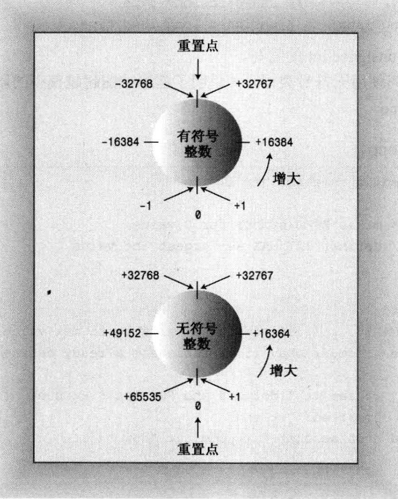
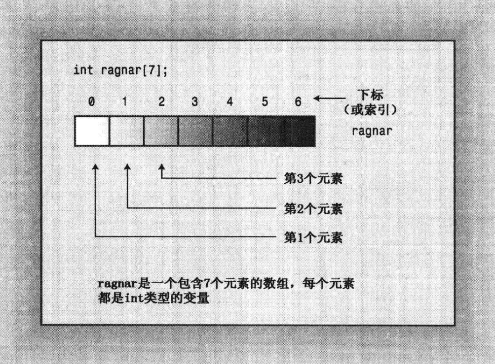
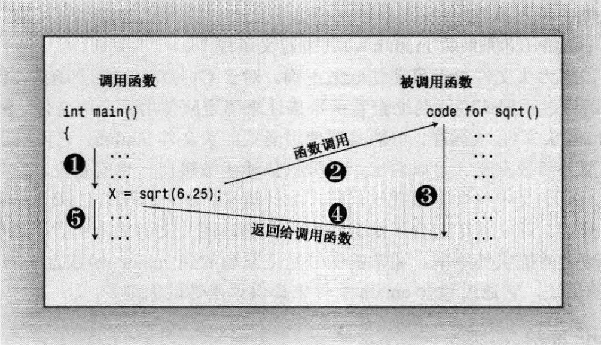

# 基础


## mian函数

```c++
int main(void){

	return 0;
}
```

1.  C/C++程序从main函数中开始执行
2. 第一行 int main( )叫函数头(function heading)，花括号({和})中包括的部分叫函数体
3. 每条完整的指令都称为语句，所有的语句都以分号结束，不能省略分号。
4. main()中最后一条语句叫做返回语句(returnstatement)，它结束该函数。


## 注释

注释以`//`打头，到行尾结束。注释可以位于单独的一行上，也可以和代码位于同一行。

符号`/*`和`*/`之间的部分，全部都是注释。

```C++
// 这里是一条注释

int main(void){
	return 0; // 后面这一部分也是注释。
}

/*
你好
这一部分全部都是注释
*/
```


## 预处理器

它处理名称以#开头的编译指令，不必执行任何特殊的操作来调用该预处理器，它会在编译程序时自动运行。

`#include <iostream>`

该编译指令导致预处理器将iostream 文件的内容添加到程序中。这是一种典型的预处理器操作：在源代码被编译之前，替换或添加文本。


## 头文件名

像 iostream 这样的文件叫做包含文件(include file) ——由于它们被包含在其他文件中；也叫头文件(header file) ——由于它们被包含在文件起始处。

C语言的传统是，头文件使用扩展名h，将其作为一种通过名称标识文件类型的简单方式。例如，头文件 math.h支持各种C语言数学函数。

现在，对老式C的头文件保留了扩展名h(C++程序仍可以使用这种文件)，而C++头文件则没有扩展名。

有些C头文件被转换为 C++头文件，这些文件被重新命名，去掉了扩展名h(使之成为C++风格的名称)，并在文件名称前面加上前缀c(表明来自C语言)。例如，C++版本的math.h为cmath。

有时C头文件的C版本和C++版本相同，而有时候版本做了一些修改。对于纯粹的 C++头文件(如 iostream)来说，去掉h不只是形式上的变化，没有h的头文件也可以包含名称空间。

| 头文件类型  | 约定                  | 示例       | 说明                                                  |
| :---------- | :-------------------- | :--------- | :---------------------------------------------------- |
| C++旧式风格 | 以.h 结尾             | iostream.h | C++程序可以使用                                       |
| C 旧式风格  | 以.h 结尾             | math.h     | C、C++程序可以使用                                    |
| C++新式风格 | 没有扩展名            | iostream   | C++程序可以使用，使用namespace std                    |
| 转换后的C   | 加上前缀c，没有扩展名 | cmath      | C++程序可以使用，可以使用不是C的特性，如namespace std |


## 命名空间

命名空间是一个声明性区域，为其内部的标识符（类型、函数和变量等的名称）提供一个范围。

命名空间范围内的所有标识符彼此可见，而没有任何限制。 **命名空间之外的标识符**可通过**使用每个标识符**的**完全限定名**来访问成员，也可通过**单个标识符的 using 声明**或命名空间中**所有标识符的 using 指令**来访问成员。 

使用namespace定义一个命名空间

```c++
namespace <标识符>{
	<C/C++源码>
	...
}
```


定义两个命名空间分别为`mathTools`和`englishTools`，在两个命名空间中都定义了两个函数，分别为`sum`和`reduce`。

```c++
int division()

namespace mathTools{
	int sum(......)
	
	int reduce(......)
}

namespace englishTools{
	int sum(......)
	
	int reduce(......)
        
    int multiplication()
}
```


### 完全限定名访问

```c++
mathTools::sum(); //使用mathTools命名空间中的sum函数
mathTools::reduce();
englishTools::sum();//使用englishTools命名空间中的sum函数
englishTools::reduce();
```

！！错误示范

```c++
//不加命名空间名称访问函数
//命名空间外部没有sum()函数
sum();
//正确
mathTools::sum();

//在mathTools访问multiplication函数
//multiplication函数不在mathTools中，而是在englishTools中
mathTools::multiplication();
//正确
englishTools::multiplication();

//在mathTools命名空间中访问division函数
//division函数不在命名空间中，可以直接访问
mathTools::division();
//正确
division();
```


### using访问单个标识符

```c++
using mathTools::sum;//仅引入mathTools命名空间中的sum函数
sum();//此时可以直接使用sum函数

reduce();//错误，reduce还是不能直接访问
mathTools::reduce(); //reduce函数现在还需要完全限定名称

using mathTools::reduce();//再把reduce函数引入
reduce(); //此时就可以直接访问reduce函数了
```


#### using 引入命名空间中的所有内容

```C++
using namespace mathTools; //引入mathTools命名空间中的所有内容
sum();
reduce();//正确，此时可以直接访问mathTools中所有内容
```

！！注意：

- 如果仅使用一个或两个标识符，则考虑 using 声明，以仅将单个标识符引入范围。
- using 指令可以放置在 .cpp 文件的顶部（在文件范围内），或放置在类或函数定义内。
- 避免将 using 指令放置在头文件 (*.h) 中，因为任何包含该标头的文件都会将命名空间中的所有内容引入范围，这将导致非常难以调试的名称隐藏和名称冲突问题。
- 在头文件中，始终使用完全限定名。 如果这些名称太长，可以使用命名空间别名将其缩短。

！！错误：

- 如果本地变量的名称与命名空间变量的名称相同，则隐藏命名空间变量。
- 使命名空间变量具有与全局变量相同的名称是错误的。


### 全局命名空间

如果一个内容（如：函数）没有在命名空间中定义，那么这个内容属于全局命名空间。

未在显式命名空间中声明某个标识符，则该标识符属于隐式全局命名空间的一部分。

尽量不要再全局命名空间中定义内容（main函数除外），若要显式限定全局标识符，请使用没有名称的范围解析运算符，有助于使其他人更轻松地了解你的代码。

```c++
//test.cpp file
#include <iostream>
using namespace std;

//sum函数定义在全局命名空间中，隐式在全局命名空间定义内容，不要使用这种方式
int sum(){
    ...
}

int ::division(){//显示的在全局命名空间中定义内容，如果不得已需要在全局命名空间中定义，请使用这种方法。
    ...
}

namespace Tools{
    //reduce函数定义在Tools命名空间中，而非全局命名空间
    int reduce(){
        ...
    }
}

int main(void){
	cout << "Welcome to my docs." << endl;
	return 0;
}
```


### 嵌套命名空间

C++命名空间可以嵌套，子命名空间可以直接访问父命名空间中的成员，而无需任何限定符，父命名空间需要访问子命名空间中的成员，就必须使用限定符。

```c++
namespace father{
	int number;
	
	int sum(){...}
	
	namespace child{
	
		int book;
		
		int rudece(){
			return number;//可以直接访问父命名空间中的内容
		}
	
	}
	
	int multiplication(){
		return child::book;//父命名空间访问子命名空间中的内容，必须使用限定符。
	}
	
}
```

命名空间是可以多次嵌套的，也可以拥有多个子命名空间，没有限制。

```c++
namespace one{
	
	namespace two{
		
		namespace three{
			...
		}
	
	}
    
    namespace childNamespace{
        ...
    }
}
```


### 内联命名空间

与普通嵌套命名空间不同，内联命名空间的成员会被视为父命名空间的成员。这意味着，如果你在父命名空间或内联命名空间中查找一个重载的函数，那么这两个命名空间中的所有重载版本都将被考虑在内。

```c++
namspace father {

	void func(int){...}

	inline namespace child{
		
		void func(double){...}
		
		void func(char){...}
	}

}

father::func(1);//调用father::func(int)
father::func(1.0);//调用father::child::func(double)
father::func('c');//调用father::child::func(char)

father::child::func(1); //!!注意:我这里使用的是整数
//此时只会搜索father::child命名空间中的，而不会搜索father命名空间中的
//调用father::child::func();
```


内联也是可以多次嵌套的，不推荐使用，只是了解这种方法从语法上来说是正确的

```C++
namspace father {

	void func(int){...}

	inline namespace child{
		
		void func(double){...}
		
		inline namespace Inline{
		
			void func(char){...}
		
		}
	}

}
father::func(1);//调用father::func(int)
father::func(1.0);//调用father::child::func(double)
father::func('c');//调用father::child::Inline::func(char)  !!注意:这里和上面的不同
```


如果你在一个内联命名空间中声明了一个模板，你可以在该内联命名空间的父命名空间中为这个模板声明一个专门化版本。

我们在内联命名空间`Inline`中声明了一个模板函数`func`，然后在`Inline`的父命名空间`Parent`中为这个模板函数声明了一个专门化版本。

当我们调用`Parent::func`并传入一个整数时，编译器会选择使用我们在`Parent`中声明的专门化版本。

```c++
namespace Parent {
    inline namespace Inline {
        template <typename T>
        void func(T) {
            cout << "General template\n";
        }
    }

    // 在父命名空间中为内联命名空间中的模板声明一个专门化版本
    template <>
    void func<int>(int) {
        cout << "Specialization for int\n";
    }
}

int main() {
    Parent::func(10);  // 输出 "Specialization for int"
    Parent::func(10.0);  // 输出 "General template"
}
```


如果将其反过来，在父命名空间中中声明模板，在内联命名空间中声明专门化的模板，则会出现错误。

在C++中，模板的专门化必须在模板首次声明的相同命名空间中进行。在你的代码中，你试图在内联命名空间`Inline`中专门化一个在父命名空间`Parent`中声明的模板，这是不允许的。

这里目前还不是很懂，如果在内联空间中声明模板，然后在父空间进行专门化，那么是此时认为父空间和内联空间是同一个空间，是允许的。而如果在父空间声明模板，在内联空间中进行专门化，此时认为父空间和内联命名空间不是同一个空间，是不允许的。

```c++
//！！错误代码！！
namespace Parent {
    template <typename T>
    void func(T) {
        std::cout << "General template\n";
    }

    inline namespace Inline {
        template <>
        void func<int>(int) {
            std::cout << "Specialization for int\n";
        }
    }
}

int main() {
    Parent::func(10);  // 输出 "Specialization for int"
    Parent::func(10.0);  // 输出 "General template"
}
```


首先，你可以创建一个父命名空间，并将接口的每个版本封装到嵌套在父命名空间内的其自己的命名空间中。

将最新或首选的版本的命名空间限定为内联。这个的命名空间中的所有成员都会被视为父命名空间的直接成员。

如果选择使用较旧版本，它仍然可以通过使用完全限定路径来访问它。

```c++
#include <iostream>

using std::cout;
using std::endl;

namespace Tools {

    namespace version1 {
        
        void func(void) {
            cout << "version1" << endl;
        }
    }

    namespace version2 {
        
        void func(void) {
            cout << "version2" << endl;
        }

    }

    //将最新版本存在的命名空间，声明为内联
    inline namespace version3 {
        
        void func(void) {
            cout << "version3" << endl;
        }

    }
}

int main() {

    //默认使用最新版本
    Tools::func(); 

    //也可以使用指定的版本
    Tools::version1::func();
    Tools::version2::func();
    Tools::version3::func();
}


//输出结果
/*
version3
version1
version2
version3
*/
```


当你在一个编译单元中首次声明一个命名空间，并且将它声明为内联命名空间时，该命名空间在该编译单元的所有后续声明中都将被视为内联的。

一个编译单元通常是指一个源文件（如`.cpp`文件），以及它直接或间接包含的所有头文件（如`.h`或`.hpp`文件）。

假设有`1.h`  `1.cpp`  `2.cpp`，其中`1.cpp` 和 `2.cpp` 都引用了 `1.h` ，`1.cpp` 和 `2.cpp` 也是两个不同的编译单元。

```c++
namespace father {

	//在第一次，将命名空间声明为内联，整个child命名空间全部都是内联
	inline namespace child {

		void func1(void) {
			cout << "func1" << endl;
		}
	}

	//即使这里没有inline，这一部分中的内容也是内联
	//如果第一次不使用inline，这里使用inline，则会报错，不能将非内联命名空间重新打开为内联
	namespace child {

		void func2(void) {

			cout << "func2" << endl;

		}

	}

}
```


### 命名空间别名

命名空间名称必须是唯一的，这意味着通常它们不应太短。 如果名称的长度使代码难以阅读，则可以使用用作实际名称的缩写的命名空间别名。

```c++
// 声明一个命名空间
namespace VeryLongNamespaceName {
    void func() {
        // ...
    }
}

// 为命名空间创建一个别名
namespace VLN = VeryLongNamespaceName;

int main() {
	
	//以下两者等价

	//使用原名称
	VeryLongNamespaceName::func();
    // 使用别名来调用函数
    VLN::func();
}

```


### 未命名的或匿名的命名空间

未命名的或匿名的命名空间是一种特殊的命名空间，它没有名称。

未命名的命名空间在其所在的文件（或更准确地说，在其所在的编译单元）内部是可见的，但在文件外部是不可见的。

这意味着，你可以在同一个文件中的任何位置使用未命名的命名空间中的标识符，但不能在其他文件中使用它们。

未命名的命名空间通常用于声明只在一个文件中使用的函数、变量或类型，以防止名称冲突。这是因为，即使在不同的文件中有相同名称的未命名的命名空间，它们也是完全独立的。

```c++
// 未命名的命名空间
namespace {
    void func() {
        // 这个函数只在这个文件中可见 在其他文件(其他编译单元)无法调用这个函数
    }
}

int main() {
    // 可以在这个文件中调用func
    func();
}

```


## 声明语句和变量

在C++中使用声明语句来指出存储类型并提供位置标签。

`int carrots;`

这条语句提供了两项信息：需要的内存以及该内存单元的名称。

程序中的声明语叫做**定义声明(definingdeclaration)**语句，简称为**定义(definition)**，这意味着它将导致编译器为变量分配内存空间。

在较为复杂的情况下，还可能有**引用声明(referencedeclaration)**，这些声明命令计算机**使用在其他地方定义的变量**。


## 标识符

标识符是用于命名变量、函数、类、模块，或任何其他用户自定义项目的名称。

以下是关于标识符的一些基本规则：

1. 标识符可以由**大写字母、小写字母、下划线和数字0~9**组成，但**必须以(大、小写)字母、下划线开头**。
2. 在C++语言程序中，大写字母和小写字母是**区分大小写**的，例如Name和name就代表了两种不同的标识符。
3. 标识符的其他部分可以跟随任意的字母、数字或下划线。
4. 标识符的长度没有限制，但建议保持适度，以提高代码的可读性。
5. 标识符不能与关键字重复


关键字是计算机语言中的词汇。本章使用了4个C++关键字：int、void、retum和 double。由于这些关键字都是 C++专用的，因此不能用作他用。也就是说，不能将 retum 用作变量名，也不能把 double 用作函数名。


## 赋值语句

赋值语句将值赋给存储单元。

`Carrots =25;`

符号"="叫做赋值运算符。C++(和C)有一项不寻常的特性——可以连续使用赋值运算符。

```c++
int steinway;
int baldwin;
int yamaha;
yamaha =baldwin=steinway=88;
```


在定义函数时可以为其赋值，这个过程称之为初始化。

`int yamaha = 100;`


# 变量类型


## 整形

整数就是没有小数部分的数字，如2、98、-5286和0。

宽度(width)用于描述存储整数时使用的内存量。使用的内存越多，则越宽。

C++的基本整型(按宽度递增的顺序排列)分别是 short、int、long 、long long。

1. short全少16;
2. int 至少与 short 一样长;
3. long 至少 32 位，且至少与 int 一样长;
4. long long 至少 64 位，且至少与 long 一样长。


## bool类型

`bool` 类型的变量可以有两个值：`true` 或 `false`。C++ 将非零值解释为 `true`，将零解释为 `false`。

声明一个 `bool` 变量：`bool is_ready = true;`。


字面值 `true` 和 `false` 都可以通过**提升转换为 `int` 类型**，`true` 被转换为 1，而 `false` 被转换为 0。

例如，`int ans = true;` 将 `ans` 赋值为 1，`int promise = false;` 将 `promise` 赋值为 0。


任何数字值或指针值都**可以被隐式转换**（即不用显式强制转换）为 `bool` 值。

任何**非零值**都被转换为 `true`，而**零**被转换为 `false`。

例如，`bool start = -100;` 将 `start` 赋值为 `true`，`bool stop = 0;` 将 `stop` 赋值为 `false`。


## 浮点型

浮点数能够表示带小数部分的数字。

### 标准表示

例如 `12.34`、`939001.32`、`0.00023` 和 `8.0`。即使小数部分为 0（如 `8.0`），小数点也确保该数字以浮点格式表示。

### E 表示法

E 表示法，也被称为科学记数法或指数记数法。

它由两部分组成：尾数（mantissa）和指数（exponent）。基本格式：

```
d.dddE+n
```

`d.ddd` 是尾数，`n` 是指数。`E` 表示 “乘以 10 的 `n` 次方”。

`3.14E2` 表示的是 `3.14 * 10^2`。

`3.14E-2` 表示的是 `3.14 * 10^-2`


指数可以是正数或负数。正指数表示将小数点向右移动，而负指数表示将小数点向左移动。

例如，`3.14E2` 表示将小数点向右移动两位，而 `3.14E-2` 表示将小数点向左移动两位。


### 类型

C++ 提供了三种浮点类型：`float`、`double` 和 `long double`。

1. `float` 至少为 32 位；
2. `double` 至少为 48 位，且不少于 `float`；
3. `long double` 至少和 `double` 一样多。


这三种类型的指数范围至少是 -37 到 37。

可以从头文件 `cfloat` 或 `float.h` 中找到系统的限制

1. **DBL_DIG、FLT_DIG、LDBL_DIG**：它们分别表示 `double`、`float` 和 `long double` 类型的最小有效位数。
2. **DBL_MANT_DIG、FLT_MANT_DIG、LDBL_MANT_DIG**：它们分别表示用于表示尾数的位数。
3. **DBL_MAX_10_EXP、FLT_MAX_10_EXP、LDBL_MAX_10_EXP**：它们分别表示最大指数值。
4. **DBL_MIN_10_EXP、FLT_MIN_10_EXP、LDBL_MIN_10_EXP**：它们分别表示最小指数值。


## 无符号类型

无符号类型指的是不能存储负数的类型，其优点是可以增大变量能够存储的最大值。

如果 short 表示的范围为-32768 到+32767，则无符号版本的表示范围为 0-65535。

仅当数值不会为负时才应使用无符号类型，如人口、粒数等。

要创建无符号版本的基本整型，只需使用关键字unsigned 来修改声明即可。

```c++
int number; //有符号
unsigned int number; //无符号
```


### 溢出

1. **初始化变量**：程序中有两个变量，一个是 `short` 类型的 `sam`，另一个是 `unsigned short` 类型的 `sue`。它们都被设置为 `short` 类型的最大值，即 32767。
2. **增加值**：然后，程序将 `sam` 和 `sue` 的值都加 1。对于 `sue` 来说，这没有问题，因为新值仍然远小于无符号整数的最大值。然而，`sam` 的值从 32767 变成了 -32768，这是因为 `short` 类型的变量在超过其最大值时会发生溢出。
3. **减少值**：同样，如果将 `sam` 设置为 0 并减去 1，结果是 -1，这是预期的。但是，如果将 `sue` 设置为 0 并减去 1，结果会变成 65535，这是因为无符号整数在减到 0 以下时会回绕到其类型能表示的最大值。
4. **整型变量的行为**：这些整型变量的行为类似于里程表，如果超过了限制，其值将回绕到范围的另一端。
5. **C++ 的保证**：C++ 保证了无符号类型的这种行为，但并不保证有符号整型在超过限制（上溢和下溢）时不出错，尽管这在当前的实现中是最常见的行为。




### char符号

在 C++ 中，`char` 类型默认情况下既不是有符号的，也不是无符号的。这是由 C++ 的实现决定的，以便编译器开发人员可以最大限度地将这种类型与硬件属性匹配起来。

如果 `char` 的某种特定行为对你来说非常重要，那么你可以显式地将类型设置为 `signed char` 或 `unsigned char`。

如果使用 `char` 变量来存储标准 ASCII 字符，那么 `char` 是否有符号都没关系，在这种情况下，可以使用 `char`。


## 扩展

### limits头文件

`limits` 是一个标准库头文件，它定义了各种变量类型的属性。这些属性包括类型可以表示的最大值、最小值、位数等。

例如，`INT_MAX` 和 `INT_MIN` 分别表示 `int` 类型可以表示的最大值和最小值。

```c++
cout << "Max int: " << INT_MAX << endl; // 输出 int 类型的最大值
cout << "Min int: " << INT_MIN << endl; // 输出 int 类型的最小值
```


# 运算符

## sizeof运算符

sizeof 是一个编译时运算符，用于确定其操作数的大小，**可对类型名或变量名使用** sizeof运算符。

对**类型名**(如imnt)使用sizeof运算符时，**应将名称放在括号**中;

但对**变量名**(如nshort)使用该运算符，**括号是可选**的:

```c++
cout << "int is" << sizeof(int) << "bytes.\n";
cout <<"short is" <<sizeof nshort << "bytes.\n";
```


## const 限定符

符号常量是一个具有特定值的标识符，这个值在程序运行期间不能改变。

例如，你可以创建一个名为 `Months` 的符号常量，用来表示一年中的月份数：`const int Months = 12;`。这样，你就可以在程序中使用 `Months`，而不是数字 12。

当一个变量被 `const` 修饰后，它的值就不能被修改。应在声明中对 `const` 进行初始化。如果在声明常量时没有提供值，则该常量的值将是不确定的，且无法修改。

`const` 比 `#define` 更好。首先，它能够明确指定类型。其次，可以使用 C++ 的作用域规则将定义限制在特定的函数或文件中。第三，可以将 `const` 用于更复杂的类型，如数组和结构。


## 优先级

C++ 使用优先级规则来决定首先使用哪个运算符。

1. 加法 (`+`) 和减法 (`-`) 的优先级相同。
2. 除法 (`/`) 和乘法 (`*`) 的优先级相同。
3. 乘除的优先级高于加减。


## 除法分支

如果两个操作数都是整数，那么 C++ 将执行整数除法。这意味着结果的小数部分将被丢弃，使得最后的结果是一个整数。例如，`5 / 2` 的结果是 `2`，而不是 `2.5`。

如果至少有一个操作数是浮点数，那么结果的小数部分将保留，结果为浮点数。例如，`5.0 / 2` 或 `5 / 2.0` 的结果是 `2.5`。


## 求模运算符

用于计算两个整数相除后的余数，只能用于整数。

```c++
int a = 10;
int b = 3;
int result = a % b;  // 结果为 1，因为 10 除以 3 的余数为 1
```


## 运算符重载

相同的符号进行多种操作叫做运算符重载(operator overloading)。

例如，除法运算符 `/` 表示了三种不同的运算：`int` 除法、`float` 除法和 `double` 除法。C++ 根据操作数的类型（上下文）来确定运算符的含义。

C++有一些内置的重载示例。C++还允许扩展运算符重载。


# 类型转换

C++自动执行很多类型转换：

1. 将一种算术类型的值赋给另一种算术类型的变量时，C++将对值进行转换;

2. 表达式中包含不同的类型时，C++将对值进行转换;

3. 将参数传递给函数时，C++将对值进行转换。


## 潜在的数值转换问题

将一个值赋给值取值范围更大的类型通常不会导致什么问题。

将0赋给 bool变量时，将被转换为false;而非零值将被转换为true。

将浮点值转换为整型会将数字截短(除掉小数部分)。

float 值对于 int 变量来说可能太大了。在这种情况下，C++并没有定义结果应该是什么；这意味着不同的实现（编译器）的反应可能不同。

| 转换                                                         | 潜在的问题                                                   |
| :----------------------------------------------------------- | :----------------------------------------------------------- |
| 将较大的浮点类型转换为较小的浮点类型，如将 `double` 转换为 `float` | 精度（有效数位）降低，值可能超出目标类型的取值范围，在这种情况下，结果将是不确定的 |
| 将浮点类型转换为整型                                         | 小数部分丢失，原来的值可能超出目标类型的取值范围，在这种情况下，结果将是不确定的 |
| 将较大的整型转换为较小的整型，如将 `long` 转换为 `short`     | 原来的值可能超出目标类型的取值范围，通常只复制右边的字节     |


## 列表初始化

使用大括号 `{}` 来初始化变量，常用于给复杂的数据类型提供值列表。

列表初始化对类型转换的要求更严格，它不允许缩窄（narrowing），例如，不允许将浮点型转换为整型。


在不同的整型之间转换或将整型转换为浮点型可能被允许，条件是编译器知道目标变量能够正确地存储赋给它的值。

例如，可以将 `long` 变量初始化为 `int` 值，因为 `long` 总是至少与 `int` 一样长；相反方向的转换也可能被允许，只要 `int` 变量能够存储赋给它的 `long` 常量。


## 表达式中的转换

计算表达式时，C++会将`bool`、`char`、`unsigned char`、`signed char`和`short`值转换为`int`。

`true`被转换为1，`false`被转换为0。

如果`short`比`int`短，则`unsigned short`类型将被转换为`int`；如果两种类型的长度相同，则`unsigned short`类型将被转换为`unsigned int`。

此外，`wchar_t`会被提升为足够宽以存储其取值范围的类型，如`int`、`unsigned int`、`long`或`unsigned long`。


运算涉及两种类型时，较小的类型将被转换为较大的类型。例如，当`int`和`float`相加时，`int`会被转换为`float`。编译器通过查阅校验表来确定在算术表达式中执行的转换。

以下是C++11版本的校验表：

1. 如果有一个操作数的类型是`long double`，则将另一个操作数转换为`long double`。
2. 否则，如果有一个操作数的类型是`double`，则将另一个操作数转换为`double`。
3. 否则，如果有一个操作数的类型是`float`，则将另一个操作数转换为`float`。
4. 否则，说明操作数都是整型，因此执行整型提升。
5. 在这种情况下，如果两个操作数都是有符号或无符号的，且其中一个操作数的级别比另一个低，则转换为级别高的类型。
6. 如果一个操作数为有符号的，另一个操作数为无符号的，且无符号操作数的级别比有符号操作数高，则将有符号操作数转换为无符号操作数所属的类型。
7. 否则，如果有符号类型可表示无符号类型的所有可能取值，则将无符号操作数转换为有符号操作数所属的类型。
8. 否则，将两个操作数都转换为有符号类型的无符号版本。


1. 有符号整型按级别从高到低依次为`long long`、`long`、`int`、`short`和`signed char`。
2. 无符号整型的排列顺序与有符号整型相同。
3. 类型`char`、`signed char`和`unsigned char`的级别相同。
4. 类型`bool`的级别最低。
5. `wchar_t`、`char16_t`和`char32_t`的级别与其底层类型相同。
6. 这些规则确保了在进行类型转换时不会损失数据，并使得计算机能以最快的速度进行运算。
7. 不同版本的C++和C语言在这些规则上可能有所不同。例如，传统的C语言总是将`float`提升为`double`，即使两个操作数都是`float`。


## 传递参数时的转换

传递参数时的类型转换通常由C++函数原型控制，可以取消原型对参数传递的控制。

在这种情况下，C++将对char和short类型(signed和 unsigned)应用整型提升，C++将 float参数提升为double。


这一部分还有疑问。


## 强制类型转换

这是一种显式地改变变量类型的方式，有两种基本的强制类型转换格式：

1. `(typeName)value`：这种格式来自C语言，它会将`value`转换为`typeName`类型。
2. `typeName(value)`：这种格式是纯粹的C++，它的想法是让强制类型转换看起来像是函数调用。


C++还引入了4个强制类型转换运算符，其中`static_cast<typeName>(value)`可以用于将值从一种数值类型转换为另一种数值类型。

它的使用更为严格，只能在类型之间进行转换，这些类型之间的转换在编译时是安全的。

例如，你可以这样将`thorn`转换为`long`类型：

```cpp
static_cast<long>(thorn) // 返回thorn的long类型转换
```


## auto关键字

`auto`关键字允许编译器根据初始值的类型推断变量的类型。例如：

```cpp
auto n = 100; // n 是 int 类型
auto x = 1.5; // x 是 double 类型
auto y = 1.3e12L; // y 是 long double 类型
```


然而，`auto`关键字并非设计用来处理这种简单情况的。例如，如果你想将x、y和z都指定为`double`类型，并编写了如下代码：

```cpp
auto x = 0.0; // ok, x 是 double 类型，因为 0.0 是 double 类型
double y = 0; // ok, 0 自动转换为 0.0
auto z = 0; // 错误，z 是 int 类型，因为 0 是 int 类型
```

在这种情况下，使用`auto`关键字可能会导致问题，因为`auto`关键字会根据初始值的类型来推断变量的类型。


当处理复杂类型，如标准模板库(STL)中的类型时，`auto`关键字的优势就显现出来了。例如，对于下述 C++98代码：

```cpp
std::vector<double> scores;
std::vector<double>::iterator pv = scores.begin();
```


C++11允许你将其重写为下面这样：

```cpp
std::vector<double> scores;
auto pv = scores.begin();
```

这样，你就不需要显式地写出迭代器的完整类型，编译器会自动为你推断出正确的类型。这在处理复杂的类型时尤其有用，可以使代码更简洁，更易于阅读和维护。


# 数组

数组是一种数据结构，可以存储多个同类型的值。每个值都存储在一个独立的数组元素中，计算机在内存中依次存储数组的各个元素。

数组的声明需要指出元素的类型、数组名和数组中的元素数。

例如，`int ragnar[7];`声明了一个名为`ragnar`的数组，该数组有7个元素，每个元素都可以存储一个`int`类型的值。




数组被称为复合类型，因为它是使用其他类型创建的。

数组必须是特定类型的，例如`char`数组或`long`数组。

数组的类型是由其元素的类型决定的，例如`float loans[20];`声明的`loans`的类型是“float数组”。


数组元素通过索引进行访问，C++数组的索引从0开始。

例如，`months[0]`是`months`数组的第一个元素，`months[11]`是最后一个元素。


编译器不会检查使用的下标是否有效，如果赋值给不存在的元素，可能会引发问题，如破坏数据或代码，或导致程序异常终止。


## 数组初始化

只有在定义数组时才能使用初始化，此后就不能使用了，也不能将一个数组赋给另一个数组，但可以使用下标分别给数组中的元素赋值。

```C++
int cards[4] = {3，6，8，10};// okay
int hand[4];// okay
hand[4] = {5，6，7，9};// not allowed
hand = cards;// not allowed
```


初始化数组时，提供的值可以少于数组的元素数目。

如果只对数组的一部分进行初始化，则编译器将把其他元素设置为0。

```C++
float hotelTips[5] = {5.0,2.5};
```


只要显式地将第一个元素初始化为0，编译器会将其他元素都初始化为0。

```C++
long totals[500]={0};
```


如果初始化为{1}而不是{0}，则第一个元素被设置为1，其他元素都被设置为0。

```C++
long totals[500]={1};
```


如果初始化数组时方括号内(`[]`)为空，C++编译器将计算元素个数。

例如，对于下面的声明，编译器将使`things` 数组包含4个元素：

```C++
short things[]=(1，5，3，8);
```


通常，让编译器计算元素个数是种很糟的做法，因为其计数可能与您想象的不一样。

例如，您可能不小心在列表中遗漏了一个值。


这种方法对于将字符数组初始化为一个字符串来说比较安全。

如果主要关心的问题是程序，而不是自己是否知道数组的大小，则可以这样做：

```c++
short things[]=(1，5，3，8); 
int num_elements=sizeof things/sizeof(short);
```


### 列表初始化数组

首先，初始化数组时，可省略等号(=):

```C++
double earnings[4]{1.2e4,1.6e4,1.1e4,1.7e4};
```


其次，可不在大括号内包含任何东西，这将把所有元素都设置为零

```c++
unsigned int counts[10]={};//all elements set to 0
float balances[100]{};//all elements set to 0
```


第三，列表初始化禁止缩窄转换

```c++
long plifs[]={25,92,3.0};			//not allowed
char slifs[4]{'h','i',1122011,\0'};	//not allowed
char tlifs[4]{'h','i',112,0'};		//allowed
```

1. 因为将浮点数转换为整型是缩窄操作，即使浮点数的小数点后面为零。
2. 因为1122011超出了char变量的取值范围(这里假设char 变量的长度为8位)。
3. 语句可通过编译，因为虽然112是一个int值，但它在char 变量的取值范围内。


# C风格字符串

在C++中，有两种处理字符串的方式：一种是C风格字符串，另一种是基于string类库的方法，这里主要介绍C风格的字符串。

C风格字符串是存储在内存的连续字节中的一系列字符，可以将字符串存储在char数组中。

C风格字符串的特殊性质是以空字符(null character)结尾，空字符被写作`\0`，其ASCII码为0，用来标记字符串的结尾。

```c++
char dog[6] = {'H', 'e', 'l', 'l', 'o', '\0'};	//not a string!
char cat[5] = {'H', 'e', 'l', 'l', 'o'};		// a string!
```


初始化字符串数组时，可以使用一个用引号括起的字符串，这种字符串被称为字符串常量或字符串字面值。

用引号括起的字符串隐式地包括结尾的空字符，因此不用显式地包括它。

```c++
char bird[11] = "Mr. Cheeps";
char fish[] = "Bubbles";
```


应确保数组足够大，能够存储字符串中所有字符——包括空字符。

处理字符串的函数根据空字符的位置，而不是数组长度来进行处理。


符串常量(使用双引号)不能与字符常量(使用单引号)互换。

字符常量(如’S’)是字符串编码的简写表示。在ASCII系统上，'S’只是83的另一种写法。

"S"不是字符常量，它表示的是两个字符(字符S和0)组成的字符串。


"S"实际上表示的是字符串所在的内存地址，因此不能将一个内存地址赋给字符变量。由于地址在C++中是一种独立的类型，因此C++编译器不允许这种不合理的做法。这是因为在C++中，字符串常量实际上是指向其第一个字符的指针，这将在后面的指针部分进行讨论。


### 字符串常量拼接

如果字符串很长，无法放到一行中，可以使用字符串常量的拼接（C/C++中都允许这种方法）。

将两个用引号括起的字符串合并为一个，任何两个由空白（空格、制表符和换行符）分隔的字符串常量都将自动拼接成一个。

以下三个字符串是等价的：

```C++
cout << "I'd give my right arm to be" " a great violinist.\n";
cout << "I'd give my right arm to be a great violinist.\n";
cout << "I'd give my right ar" "m to be a great violinist.\n";
```


# string 类

`string`类是ISO/ANSI C++98标准的一部分，它提供了一种更简单、更安全的方式来处理字符串，相比于传统的字符数组。

`string`类位于名称空间`std`中，因此你需要使用`using`编译指令，或者使用`std::string`来引用它。


1. 你可以使用C风格字符串来初始化`string`对象。

    `string str = "Hello, World!";`

2. 你可以使用数组表示法来访问存储在`string`对象中的字符。

    char c = str[0];`。

3. `string`对象可以声明为简单变量，而不是数组。

    `string str;`

4. 当你将输入读取到`string`对象中时，`string`对象会自动调整其大小以适应输入。


```C++
char first_date[] =		{"Le Chapon Dodu"};
char second_date[] =	{"The Elegant Plate"};
string third_date =		{"The Bread Bowl"};
string fourth_date		{"Hank's Fine Eats"}; //这里没有 = 
```


## 赋值、拼接和附加

1. **赋值**：在C++中，不能将一个数组赋给另一个数组，但可以将一个`string`对象赋给另一个`string`对象。例如：

```cpp
char charr1[20]; // 创建一个空数组
char charr2[20] = "jaguar"; // 创建一个初始化的数组
string str1; // 创建一个空的string对象
string str2 = "panther"; // 创建一个初始化的string对象

charr1 = charr2; // 无效，不允许数组赋值
str1 = str2; // 有效，允许对象赋值
```


1. **拼接和附加**：`string`类简化了字符串合并操作。你可以使用运算符`+`将两个`string`对象合并起来，也可以使用运算符`+=`将字符串附加到`string`对象的末尾。例如：

```cpp
string str3;
str3 = str1 + str2; // 将str1和str2拼接后赋值给str3
str1 += str2; // 将str2附加到str1的末尾
```


## 字符串输入与输出

暂略


## 其他形式的字符串字面值

除了`char`类型外，C++还有`wchar_t`类型，C++11新增了`char16_t`和`char32_t`类型，使用前缀`L`、`u`和`U`表示。

```C++
wchar_t title[] = L"Chief Astrogator"; // wchar_t string
char16_t name[] = u"Felonia Ripova"; // char16_t string
char32_t car[] = U"Humber Super Snipe"; // char32_t string
```


原始字符串是C++11新增的一种字符串类型。在原始字符串中，字符表示的就是自己。

例如，序列`\n`不表示换行符，而表示两个常规字符——斜杠和n。

因此在屏幕上显示时，将显示这两个字符。另一个例子是，可以在字符串中使用双引号`"`, 而无需像以前那样使用转义字符`\"`。

由于在原始字符串中可以包含双引号`"`, 因此不能再使用它来表示字符串的开头和末尾。因此，原始字符串使用`"(和)"`作为定界符，并使用前缀`R`来标识原始字符串。例如：

```cpp
cout << R"(Jim "King" Tutt uses "\n" instead of endl.)" << '\n';
```

这段代码将在屏幕上显示以下内容：

```cpp
Jim "King" Tutt uses "\n" instead of endl.
```


原始字符串使用`"(和)"`作为定界符，并使用前缀`R`来标识原始字符串。

如果要在原始字符串中包含`)"`，可以在表示字符串开头的`"`和`(`之间添加其他字符，这意味着表示字符串结尾的`"`和`)`之间也必须包含这些字符。


例如，使用`R"+*(`标识原始字符串的开头时，必须使用`)+*"`标识原始字符串的结尾。

```cpp
cout << R"+*("(Who wouldn't?)", she whispered.)+*" << endl;
```

它会在屏幕上显示以下内容：

```cpp
"(Who wouldn't?)", she whispered.
```


# 结构体


**声明结构体**：关键字 struct表明，这些代码定义的是一个结构的布局。

标识符 imnflatable 是这种数据格式的名称，因此新类型的名称为 inflatable。

大括号中包含的是结构存储的数据类型的列表，其中每个列表项都是一条声明语句。

```cpp
struct inflatable
{
    char name[20];
    float volume;
    double price;
};
```


**定义结构体变量**：定义结构后，便可以创建这种类型的变量了：

C++允许在声明结构变量时省略关键字struct（C语言不允许）：

```cpp
struct inflatable goose;  // 这是正确的
inflatable vincent;       // 这也是正确的
inflatable hat;
inflatable woopie_cushion;
inflatable mainframe;
```


**函数内部声明结构体**：如果你在`main`函数内部声明一个结构体，那么这个结构体只能在`main`函数内部被使用。

```cpp
int main() {
    struct inflatable {
        char name[20];
        float volume;
        double price;
    };
    inflatable hat;
    // ...
}
```

**函数外部声明结构体**：如果你在`main`函数外部声明一个结构体，那么这个结构体可以被程序中的任何函数使用。

```cpp
struct inflatable {
    char name[20];
    float volume;
    double price;
};

int main() {
    inflatable hat;
    // ...
}
```

**需前向声明的结构体**：如果你在`main`函数后面定义了一个结构体，那么你需要使用这个结构体之前进行前向声明。

```cpp
// 前向声明
struct inflatable;

int main() {
    // 使用结构体
    inflatable vincent;
    // ...
}

// 结构体定义
struct inflatable {
    char name[20];
    float volume;
    double price;
};
```


## 访问结构体

由于 hat 的类型为 infatable，因此可以使用成员运算符()来访问各个成员。

例如，hat.volume 指的是结构的 volume 成员，hat.price 指的是price 成员。

由于 price 成员被声明为 double类型，因此 hat.price 和 vincent.price 相当于是 double 类型的变量，可以像使用常规 double 变量那样来使用它们。

hat 是一个结构,而 hat.price 是一个 double 变量。

访问类成员函数(如 cin.getline( ))的方式是从访问结构成员变量(如vincent.price)的方式衍生而来的。


## 初始化

你可以使用花括号`{}`和逗号`,`来初始化结构体的成员。

```cpp
// 结构体定义
struct inflatable {
    char name[20];
    float volume;
    double price;
};
inflatable guest = {"Glorious Gloria", 1.88, 29.99};
```

在这个例子中，`"Glorious Gloria"`是`name`成员的值，`1.88`是`volume`成员的值，`29.99`是`price`成员的值。


**列表初始化结构体**：C++11支持使用列表初始化结构体，等号（`=`）是可选的。例如，你可以这样初始化一个`inflatable`类型的变量：

```cpp
inflatable duck{"Daphne", 0.12, 9.98};  // 在C++11中，可以省略等号
```


**初始化为零**：如果你在初始化结构体时没有提供任何值（即大括号内未包含任何东西），那么结构体的所有成员都将被设置为零。例如：

```cpp
inflatable mayor;  // mayor.volume 和 mayor.price 被设置为零，mayor.name 的每个字节都被设置为零
```


## 赋值

C++允许使用赋值运算符（`=`）将一个结构体赋值给另一个同类型的结构体。这种赋值方式会将一个结构体中的每个成员都设置为另一个结构体中相应成员的值，这被称为成员赋值（memberwise assignment）。


## 声明结构体时创建变量

可以在定义结构体的同时创建结构体变量。只需在结构体定义的结束括号后面添加变量名即可。

也可有在定义结构体的同时创建结构体变量的同时进行初始化。

```cpp
struct perks {
    int key_number;
    char car[12];
} mr_smith, ms_jones;  // 定义了两个perks类型的变量

struct perks {
    int key_number;
    char car[12];
} mr_glitz = {1, "Packard"};  // 初始化mr_glitz变量
```


## 无名结构体

可以声明没有名称的结构体类型，只需在定义结构体时省略名称。

这将创建一个这种类型的变量，但这种类型没有名称，因此以后无法创建这种类型的变量。

```cpp
struct {
    int x;
    int y;
} position;  // 创建了一个无名结构体变量position
```


C++结构体具有C结构体的所有特性，但还有更多。例如，C++结构体除了成员变量之外，还可以有成员函数。但这些高级特性通常被用于类中，而不是结构体中。


## 结构体数组

可以创建一个包含结构体的数组，就像创建基本类型数组一样。

例如，你可以创建一个包含100个`inflatable`结构体的数组：

```cpp
inflatable gifts[100];  // 创建一个包含100个inflatable结构体的数组
```


**初始化结构体数组**：你可以使用花括号（`{}`）和逗号（`,`）来初始化结构体数组。

每个元素的值都由逗号分隔，整个列表由花括号包围。

每个元素的值本身又是一个被花括号包围、用逗号分隔的值列表，这个列表用于初始化结构体的成员。例如：

```cpp
inflatable guests[2] = {
    {"Bambi", 0.5, 21.99},  // 初始化第一个结构体
    {"Godzilla", 2000, 565.99}  // 初始化第二个结构体
};
```


## 位字段

**定义位字段**：在C++中，你可以为结构体成员指定特定的位数，这在创建与硬件设备上的寄存器对应的数据结构时非常有用。

位字段的类型应为整型或枚举类型，后面跟着一个冒号和一个数字，数字指定了使用的位数。

```cpp
struct torgle_register {
    unsigned int SN : 4;  // 4位用于SN值
    unsigned int : 4;     // 4位未使用
    bool goodIn : 1;      // 有效输入（1位）
    bool goodTorgle : 1;  // 成功的torgling（1位）
};

//下面也是允许的
struct Inline {

	unsigned int SN : 4;
	bool DE : 1;
	unsigned int BT : 4;

};
```


**初始化和访问位字段**：你可以像通常那样初始化位字段，也可以使用标准的结构表示法来访问位字段。例如：

```cpp
torgle_register tr = {14, true, false};  // 初始化位字段
if (tr.goodIn) {                         // 访问位字段
    // ...
}
```


位字段通常用在低级编程中。一般来说，你可以使用整型和按位运算符来代替位字段。


# 字面值

## 整形

C++ 中的整型字面值可以以三种不同的基数来表示：10（十进制）、8（八进制）和 16（十六进制）。

无论整型字面值的表示基数是多少，它们都将**以二进制数（基数为 2）**的形式存储在计算机中。

C++ 使用数字常量的前一（两）位来标识基数。例如：

1. 如果第一位为 1~9，则基数为 10；
2. 如果第一位是 0，第二位为 1~7，则基数为 8；
3. 如果前两位为 0x 或 0X，则基数为 16。


在 C++ 中，对于不带后缀的整数，将使用能够存储该数的最小类型来表示

后缀是放在数字常量后面的字母，用于表示类型。例如：

1. **L 或 l**：表示该整数为 `long` 常量。
2. **u 或 U**：表示 `unsigned int` 常量。
3. **ul 或 UL**：表示 `unsigned long` 常量。
4. **ULL 或 ULL**：用于表示 `long long` 类型和 `unsigned long long` 类型。


## 浮点型

1. **默认情况**：像 `8.24` 和 `2.4E8` 这样的浮点常量默认为 `double` 类型。
2. **float 类型**：添加 `f` 或 `F` 后缀。
3. **long double 类型**：添加 `l` 或 `L` 后缀。


# 字符串

## 转义字符

有些字符不能直接通过键盘输入到程序中，或者它们在 C++ 语言中有特殊的含义。对于这些字符，C++ 提供了一种特殊的表示方法，称为转义序列。

- `\\`：表示一个反斜杠字符
- `\"`：表示一个双引号字符
- `\'`：表示一个单引号字符
- `\n`：表示一个换行符
- `\t`：表示一个制表符
- `\a`：表示一个振铃字符，它可以使终端扬声器振铃


## 通用字符名

通用字符名的用法类似于转义序列，可以以 `u` 或 `\U` 打头，后面是 8 个或 16 个十六进制位。

```
char c1 = '\u0065'; // 'e' 的 Unicode 码点是 0065
char c2 = '\u0066'; // 'f' 的 Unicode 码点是 0066
char c3 = '\u0067'; // 'g' 的 Unicode 码点是 0067

wchar_t wc1 = L'\u03B1'; // 希腊字母 'α' 的 Unicode 码点是 03B1
wchar_t wc2 = L'\u03B2'; // 希腊字母 'β' 的 Unicode 码点是 03B2
wchar_t wc3 = L'\u03B3'; // 希腊字母 'γ' 的 Unicode 码点是 03B3
```


# 函数

## 函数原型

在使用函数之前，C++编译器必须知道函数的参数类型和返回值类型，应当为程序中使用的每个函数提供原型。

函数原型之于函数就像变量声明之于变量——指出涉及的类型。

sqrt()的函数原型：`double sqrt(double);`

第一个 double 意味着 sqrt()将返回一个 double 值。括号中的 double 意味着 sqrt( )需要一个 double 参数。


## 有返回值的函数

有返回值的函数将生成一个值，而这个值可赋给变量或在其他表达式中使用。

例如，标准C/C++库包含一个名为 sqrt()的函数，它返回平方根。

假设要计算6.25的平方根，并将这个值赋给变量 x，则可以在程序中使用下面的语句:

```
x=sqrt(6.25);
```


表达式 sqrt(6.25)将调用 sqrt()函数。

**表达式 sqrt(6.25)**被称为**函数调用**，**被调用的函数**叫做**被调用函数(called function)**，**包含函数调用的函数**叫做**调用函数(calling function)。**




## 定义函数


### 函数格式

首先，有一个函数头;然后是花括号中的函数体。可以把函数的格式统一为如下的情形:

```
type functionname(argumentlist){
	statements
}
```


### 函数头

`void simon(int n)`

开头的 void 表明 simon()没有返回值。

括号中的 intn表明，使用 simon()时，应提供一个int参数。n是一个新的变量，函数调用时传递的值将被赋给它。


### 定义有返回值的函数

在函数头中指出返回类型，在函数体结尾处使用retum。

```c++
int stonetolb(int sts){
	return 14 *sts;
    /* 或者采用
    int pounds=14*sts;
    return pounds:
    */
}
```


# 类


## 类和对象概述

​	什么是类？什么是对象？可以这么理解，类指的是一类特征，比如胖子，他的特征是埃、胖、油腻等。而对象是一个具体的实体，例如：小明，这样一个实实在在的人。


在C++中，使用 `class book { ... }` 声明的一种类型，将其称作一个类。在使用 `book English;` 定义的一个变量，将其称作一个对象。


## 类声明


## 公有(public)和私有(private)

类的设计尽可能将**公有接口和实现细节分开**，即用户只需要通过**调用公有接口**就可以**实现特定的功能**，而**不需要去考虑该功能是如何实现**的。**public**(公有部分)的变量和函数，是使用该类的程序员可以**直接访问**的，**private**(私有部分)的变量和函数，程序员**无法直接访问**，只能通过**调用公有部分的接口**(函数)进行**间接访问**。


在下面程序中，用户可以直接访问Book中的Name变量，而不能直接访问CreationTime变量，必须通过GetTime来间接访问CreationTime变量。

```c++
class Book {
private:
    long long int CreationTime;

public:
	string Name;
	double value;
	float discount;
	
	double GetPrice(void){
		
		return value / discout;
	
	}
    
	long long int GetTime(void){
        
        return this->CreationTime;
        
    }

}
```


### 类成员函数

除了上面直接在class声明中定义成员函数，也可以只在class中进行声明，在其他地方定义，使用作用域解析运算符(**::**)来标识函数所属的类。

```C++
class Book{
public:
	...
	double GetPrice(void); //声明
	...
}

double Book::GetPrice(void){
	
	return value / discout;  //定义
	
}
```


### 内联函数

直接在类中定义的函数会自动成为内联函数，在类声明中，常将代码段小的函数作为内联函数，例如在下面的例子中，`Book::GetPric()`是一个内联函数。

```c++
class Book{
public:
	...
	double Book::GetPrice(void){
	
		return value / discout;
	
	}
	...
}


```


通过`inline`限定符可以使在外部定义的成员函数成为内联函数。

```c++
class Book{
public:
	...
	double GetPrice(void); //声明
	...
}

//inline限定符
inline double Book::GetPrice(void){
	
	return value / discout;  //定义
	
}
```


内联函数的特殊规则要求，在每个使用它们的文件中都对其进行定义。最简便的方法是：将内联定义放在定义类的头文件中(有些开发系统包含智能链接程序，允许将内联定义放在一个独立的实现文件)。然后在每个使用该内联函数的源程序中包含整个头文件。

根据改写规则(rewrite rule)，在类声明中定义方法，等同于用原型替换方法定义，然后在类声明的后面将定义改写为内联函数。（**这里暂时还不理解**）。


## 存储空间

创建的每个新对象都有自己的存储空间，用于存储其内部变量和类成员;但同一个类的所有对象共享同一组类方法，即每种方法只有一个副本。例如，假设 `kate` 和 `joe` 都是 `Stock` 对象，（shares是类中的变量）则 `kate.shares` 将占据一个内存块，而 `joe.shares` 占用另一个内存块，（show()是类中的函数）但 `kate.show()` 和 `joe.show()` 都调用同一个方法，也就是说，它们将执行同一个代码块，只是将这些代码用于不同的数据。


## 析构函数


