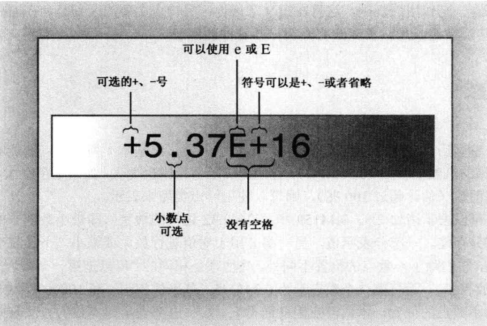

# 声明与定义

在C++中使用声明语句来指出存储类型并提供位置标签。

`int carrots;`

这条语句提供了两项信息：需要的内存以及该内存单元的名称。

程序中的声明语叫做**定义声明(definingdeclaration)**语句，简称为**定义(definition)**，这意味着它将导致编译器为变量分配内存空间。

在较为复杂的情况下，还可能有**引用声明(referencedeclaration)**，这些声明命令计算机**使用在其他地方定义的变量**。


## 1. const 限定符

符号常量是一个具有特定值的标识符，这个值在程序运行期间不能改变。

例如，创建一个名为 `Months` 的符号常量，：`const int Months = 12;`。

这样，你就可以在程序中使用 `Months`，而不是数字 12。


当一个变量被 `const` 修饰后，它的值就不能被修改。

应在声明中对 `const` 进行初始化。如果在声明常量时没有提供值，则该常量的值将是不确定的，且无法修改。


`const` 比 `#define` 更好。首先，它能够明确指定类型。其次，可以使用 C++ 的作用域规则将定义限制在特定的函数或文件中。第三，可以将 `const` 用于更复杂的类型，如数组和结构。


## 2. auto关键字

`auto`关键字允许编译器根据初始值的类型推断变量的类型。例如：

```cpp
auto n = 100; // n 是 int 类型
auto x = 1.5; // x 是 double 类型
auto y = 1.3e12L; // y 是 long double 类型
```


然而，`auto`关键字并非设计用来处理这种简单情况的。例如，如果你想将x、y和z都指定为`double`类型，并编写了如下代码：

```cpp
auto x = 0.0; // ok, x 是 double 类型，因为 0.0 是 double 类型
double y = 0; // ok, 0 自动转换为 0.0
auto z = 0; // 错误，z 是 int 类型，因为 0 是 int 类型
```

在这种情况下，使用`auto`关键字可能会导致问题，因为`auto`关键字会根据初始值的类型来推断变量的类型。


当处理复杂类型，如标准模板库(STL)中的类型时，`auto`关键字的优势就显现出来了。例如，对于下述 C++98代码：

```cpp
std::vector<double> scores;
std::vector<double>::iterator pv = scores.begin();
```


C++11允许你将其重写为下面这样：

```cpp
std::vector<double> scores;
auto pv = scores.begin();
```

这样，你就不需要显式地写出迭代器的完整类型，编译器会自动为你推断出正确的类型。这在处理复杂的类型时尤其有用，可以使代码更简洁，更易于阅读和维护。


# 基本数据类型

## 1. 整形

整数就是没有小数部分的数字，如2、98、-5286和0。

宽度(width)用于描述存储整数时使用的内存量。使用的内存越多，则越宽。

C++的基本整型(按宽度递增的顺序排列)分别是 short、int、long 、long long。

1. short全少16;
2. int 至少与 short 一样长;
3. long 至少 32 位，且至少与 int 一样长;
4. long long 至少 64 位，且至少与 long 一样长。


## 2. char字符型

在 C++ 中，`char` 类型默认情况下既不是有符号的，也不是无符号的。这是由 C++ 的实现决定的，以便编译器开发人员可以最大限度地将这种类型与硬件属性匹配起来。

如果 `char` 的某种特定行为对你来说非常重要，那么你可以显式地将类型设置为 `signed char` 或 `unsigned char`。

如果使用 `char` 变量来存储标准 ASCII 字符，那么 `char` 是否有符号都没关系，在这种情况下，可以使用 `char`。


## 3. bool类型

`bool` 类型的变量可以有两个值：`true` 或 `false`。C++ 将非零值解释为 `true`，将零解释为 `false`。

声明一个 `bool` 变量：`bool is_ready = true;`。


字面值 `true` 和 `false` 都可以通过**提升转换为 `int` 类型**，`true` 被转换为 1，而 `false` 被转换为 0。

例如，`int ans = true;` 将 `ans` 赋值为 1，`int promise = false;` 将 `promise` 赋值为 0。


任何数字值或指针值都**可以被隐式转换**（即不用显式强制转换）为 `bool` 值。

任何**非零值**都被转换为 `true`，而**零**被转换为 `false`。

例如，`bool start = -100;` 将 `start` 赋值为 `true`，`bool stop = 0;` 将 `stop` 赋值为 `false`。


## 4. 浮点型

浮点数能够表示带小数部分的数字。

### 4.1 标准表示

例如 `12.34`、`939001.32`、`0.00023` 和 `8.0`。即使小数部分为 0（如 `8.0`），小数点也确保该数字以浮点格式表示。

### 4.2 E 表示法

E 表示法，也被称为科学记数法或指数记数法。

它由两部分组成：尾数（mantissa）和指数（exponent）。基本格式：

```
d.dddE+n
```

`d.ddd` 是尾数，`n` 是指数。`E` 表示 “乘以 10 的 `n` 次方”。

`3.14E2` 表示的是 `3.14 * 10^2`。

`3.14E-2` 表示的是 `3.14 * 10^-2`


指数可以是正数或负数。正指数表示将小数点向右移动，而负指数表示将小数点向左移动。

例如，`3.14E2` 表示将小数点向右移动两位，而 `3.14E-2` 表示将小数点向左移动两位。




### 4.3 浮点类型变量

C++ 提供了三种浮点类型：`float`、`double` 和 `long double`。

1. `float` 至少为 32 位；
2. `double` 至少为 48 位，且不少于 `float`；
3. `long double` 至少和 `double` 一样多。


这三种类型的指数范围至少是 -37 到 37。

可以从头文件 `cfloat` 或 `float.h` 中找到系统的限制

1. **DBL_DIG、FLT_DIG、LDBL_DIG**：它们分别表示 `double`、`float` 和 `long double` 类型的最小有效位数。
2. **DBL_MANT_DIG、FLT_MANT_DIG、LDBL_MANT_DIG**：它们分别表示用于表示尾数的位数。
3. **DBL_MAX_10_EXP、FLT_MAX_10_EXP、LDBL_MAX_10_EXP**：它们分别表示最大指数值。
4. **DBL_MIN_10_EXP、FLT_MIN_10_EXP、LDBL_MIN_10_EXP**：它们分别表示最小指数值。


# 无符号类型

无符号类型指的是不能存储负数的类型，其优点是可以增大变量能够存储的最大值。

如果 short 表示的范围为-32768 到+32767，则无符号版本的表示范围为 0-65535。

仅当数值不会为负时才应使用无符号类型，如人口、粒数等。

要创建无符号版本的基本整型，只需使用关键字unsigned 来修改声明即可。

```c++
int number; //有符号
unsigned int number; //无符号
```


# 扩展

## 1. 溢出

1. **初始化变量**：程序中有两个变量，一个是 `short` 类型的 `sam`，另一个是 `unsigned short` 类型的 `sue`。它们都被设置为 `short` 类型的最大值，即 32767。
2. **增加值**：然后，程序将 `sam` 和 `sue` 的值都加 1。对于 `sue` 来说，这没有问题，因为新值仍然远小于无符号整数的最大值。然而，`sam` 的值从 32767 变成了 -32768，这是因为 `short` 类型的变量在超过其最大值时会发生溢出。
3. **减少值**：同样，如果将 `sam` 设置为 0 并减去 1，结果是 -1，这是预期的。但是，如果将 `sue` 设置为 0 并减去 1，结果会变成 65535，这是因为无符号整数在减到 0 以下时会回绕到其类型能表示的最大值。
4. **整型变量的行为**：这些整型变量的行为类似于里程表，如果超过了限制，其值将回绕到范围的另一端。
5. **C++ 的保证**：C++ 保证了无符号类型的这种行为，但并不保证有符号整型在超过限制（上溢和下溢）时不出错，尽管这在当前的实现中是最常见的行为。


## 2. limits头文件

`limits` 是一个标准库头文件，它定义了各种变量类型的属性。这些属性包括类型可以表示的最大值、最小值、位数等。

例如，`INT_MAX` 和 `INT_MIN` 分别表示 `int` 类型可以表示的最大值和最小值。

```c++
cout << "Max int: " << INT_MAX << endl; // 输出 int 类型的最大值
cout << "Min int: " << INT_MIN << endl; // 输出 int 类型的最小值
```


