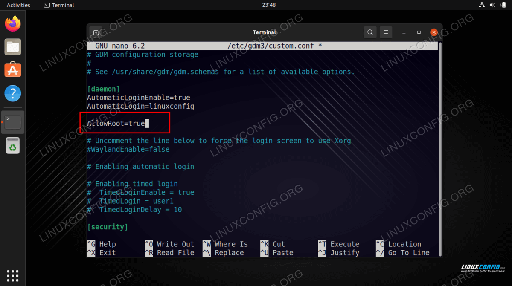
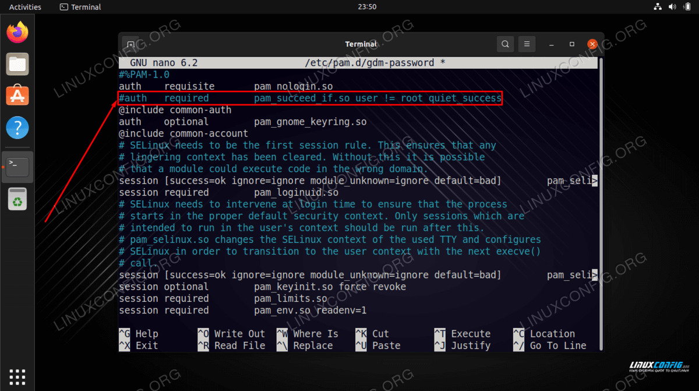
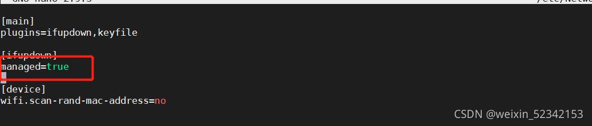

# 更新

你可以使用三个命令来升级 Kali：

```
apt upgrade
```

```
apt full-upgrade
```

```
apt dist-upgrade
```

它们之间有细微的差别：

- 该**`apt upgrade`**命令会下载和更新软件包，而不会删除以前安装在 Kali Linux 系统上的任何内容。
- 该**`apt full-upgrade`**命令下载和更新包。但是，如果需要，它还会删除已安装的软件包。
- 该**`apt dist-upgrade`**命令与常规升级相同，同时智能地处理不断变化的依赖项、删除过时的包和添加新的包。


# 设置系统语言方法

```
dpkg-reconfigure locales

在出现的列表中，使用空格键选中zh_CN.UTF-8 UTF-8123。
选中后，按下回车键。
在下一个界面中，选择zh_CN.UTF-8作为默认语言。
最后，重启系统以使更改生效
```


# 安装`gcc -m32`安装环境

```
sudo apt install build-essential
sudo apt-get install lib32readline-dev
```


## 编译安装

```
sudo apt-get install libgmp-dev libmpfr-dev libmpc-dev
../configure --prefix=/root/envir/gcc-13.2.0
make -j16
make install
```

​	


# 常见错误


# 配置软件源

```
/etc/apt/sources.list


deb https://mirrors.aliyun.com/kali kali-rolling main non-free contrib
deb-src https://mirrors.aliyun.com/kali kali-rolling main non-free contrib

#See https://www.kali.org/docs/general-use/kali-linux-sources-list-repositories/
#deb http://http.kali.org/kali kali-rolling main contrib non-free

# Additional line for source packages
# deb-src http://http.kali.org/kali kali-rolling main contrib non-free
```


# 签名失效

```shell
wget archive.kali.org/archive-key.asc   #下载签名
apt-key add archive-key.asc   #安装签名
```


# 配置环境变量

```shell
export PATH="$PATH:/you/path"
source /etc/profile
```

注意：

- 一定要加引号
- 如果source有问题，可以通过重启解决


# Ubuntu Desktop允许root用户登录


## 1. 设置root密码

```
sudo passwd root
```

```
sudo -i
passwd root
```


## 2. 编辑GDM文件

修改`	`文件，添加`AllowRoot=true`，更改后保存推出文件。

```
AllowRoot=true
```




## 3. PAM 身份验证守护进程配置文件

`/etc/pam.d/gdm-password`文件，注释一行`auth   required        pam_succeed_if.so user != root quiet_success`




## 4. 重启系统


## 安装ssh服务

```
apt-get install -y openssh-server
```


## SSH登录缓慢


### 1. DNS反向解析

SSH会进行反向DNS查找以解析连接主机，这可能导致延迟。

可以在服务器的sshd_config文件中设置`UseDNS no`来禁用反向查找


### 2. 空密码登录

不知道为什么，如果开启了空密码登录，会导致SSH连接时2-3秒的延迟。

`PermitEmptyPasswords yes`：这个选项表示是否允许空密码登录。如果设置为 yes，则允许用户使用空密码进行 SSH 登录。如果设置为 no，则不允许空密码登录。（**默认为：no**）


### 3.GSSAPI认证

GSSAPI认证需要对服务器端的IP地址进行反解析，如果服务器的IP地址没有配置PTR记录，那么就会在这里卡住。

sshd_config文件中将`GSSAPIAuthentication yes`更改为`no`


# 安装Vmware-tools

```
sudo apt-get install open-vm-tools-desktop
```


# 安装deb软件包

```
dpkg -i ***.deb
```


# Chrome安装后无法启动

## 1. 查看浏览器位置

```
whereis google-chrome  
google-chrome: /usr/bin/google-chrome /usr/share/man/man1/google-chrome.1.gz  
```


## 2. 修改浏览器

```
vim /usr/bin/google-chrome

exec -a "$0" "$HERE/chrome" "$@"
#修改为
exec -a "$0" "$HERE/chrome" "$@" --user-data-dir --no-sandbox 
```


# Which service should be restarted ?


编辑 /etc/needrestart/needrestart.conf 文件

```
vim /etc/needrestart/needrestart.conf
#$nrconf{restart} = 'i';#修改为
$nrconf{restart} = 'a';
```


# netplan网络配置

```
network:
  version: 2
  renderer: networkd
  ethernets:
    enp0s3:
      ## 可以ip a查看以太网连接名称
      dhcp4: true
    enp0s8:
      # addresses: []
      ## addresses添加网络掩码，如192.168.56.3/24
      addresses: [192.168.5.3/24]
      # gateway4: 10.10.10.1
      ## gateway4已经废弃，推荐使用routes
      routes:
      - to: "default"
        via: "192.168.5.1"
      nameservers:
        search: [mydomain , otherdomain ]
        addresses: [192.168.5.1 , 114.114.114.114]
      optional: true
```

```
netplan apply
```


# NetworkManager网络配置


## 1. 安装NetworkManager

```
 apt install network-manager
 systemctl enable NetworkManager
 systemctl start NetworkManager
```


## 2. 配置使用NetworkManager


修改配置文件 /etc/NetworkManager/NetworkManager.conf

```
vim /etc/NetworkManager/NetworkManager.conf 
```




修改配置文件/etc/netplan/00-installer-config.yaml

```
vim /etc/netplan/00-installer-config.yaml
```

```
network:
  version: 2
  renderer: NetworkManager
```


```
netplan apply
```


## 3. systemd-networkd冲突

如果您正在使用 `NetworkManager` 来管理网络，那么您通常不需要 `systemd-networkd` 或 `systemd-networkd-wait-online.service`。

同时开启了这两个来管理网络，可以会导致冲突，有一个在开启时无法正常工作，导致开机等待时机变长。

已经使用 `NetworkManager` ，那么您可以考虑禁用 `systemd-networkd-wait-online.service` 服务。您可以使用以下命令来停止并禁用该服务：

```bash
sudo systemctl stop systemd-networkd-wait-online.service
sudo systemctl disable systemd-networkd-wait-online.service
```


# Ubuntu LVM 磁盘扩容

## 1. 环境介绍

```
# sda
设备          大小 类型
/dev/sda1    1M BIOS 启动
/dev/sda2  1.8G Linux 文件系统
/dev/sda3  8.2G Linux 文件系统 #挂在到根路径
```


## 2. 扩充整个磁盘

VMDX将磁盘从20GB扩容到100GB


## 3. 扩容sda3分区

不删除原有分区的数据，而是直接在原有的分区扩充空间，使用 parted 或者 gparted 工具。

```
 apt-get install gparted
```

```
 gparted
```

在 gparted 的界面中，选择你想要调整大小的分区，然后选择"调整大小/移动"，注意：对齐选择Mib


## 4. 扩容物理卷（PV）

首先，你需要使用pvresize命令来扩容物理卷。这个命令会调整物理卷的大小以使用新的磁盘空间

```
    sudo pvresize /dev/sda3
```


## 5. 扩容逻辑卷（LV）：

使用lvextend命令来扩容逻辑卷。

```
sudo lvextend -l +100%FREE /dev/mapper/ubuntu--vg-ubuntu--lv
```


## 6. 扩大文件系统

扩展逻辑卷后，你需要调整文件系统的大小以使用新的逻辑卷空间。对于基于ext3和ext4的文件系统，你可以使用resize2fs命令。

```
sudo resize2fs /dev/mapper/ubuntu--vg-ubuntu--lv
```

