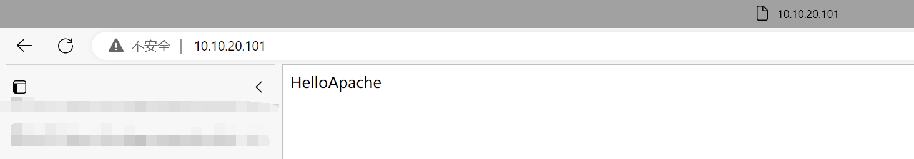
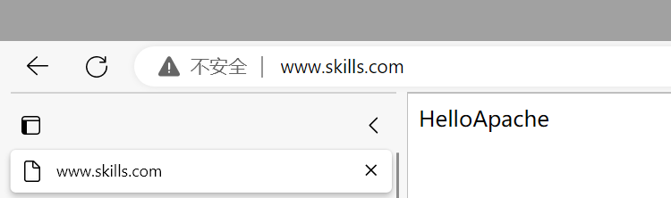
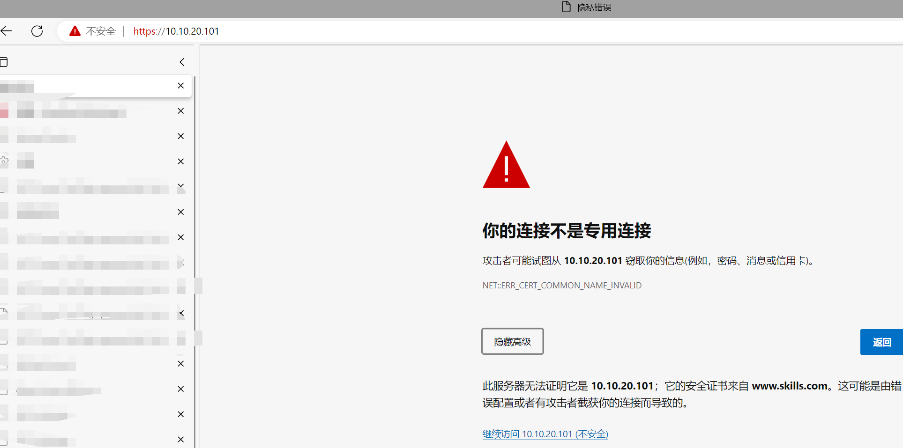
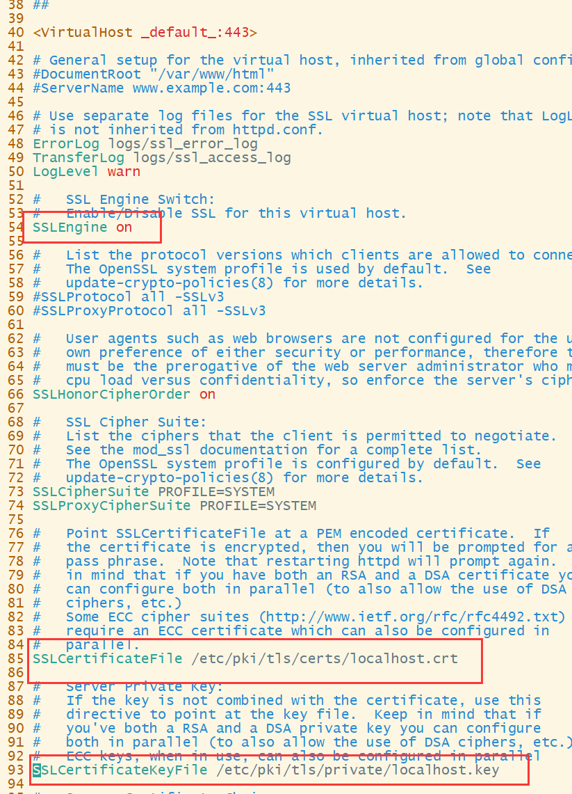
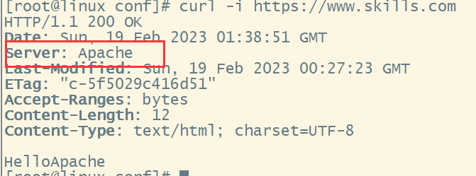

# Apache 安装与删除默认配置

```shell
[root@linux ~]# dnf -y install httpd
[root@linux ~]# cd /etc/httpd/
[root@linux httpd]# tree
.
├── conf
│   ├── httpd.conf
│   └── magic
├── conf.d
│   ├── autoindex.conf
│   ├── README
│   ├── userdir.conf
│   └── welcome.conf
├── conf.modules.d
│   ├── 00-base.conf
│   ├── 00-dav.conf
│   ├── 00-lua.conf
│   ├── 00-mpm.conf
│   ├── 00-optional.conf
│   ├── 00-proxy.conf
│   ├── 00-systemd.conf
│   ├── 01-cgi.conf
│   ├── 10-h2.conf
│   ├── 10-proxy_h2.conf
│   └── README
├── logs -> ../../var/log/httpd
├── modules -> ../../usr/lib64/httpd/modules
├── run -> /run/httpd
└── state -> ../../var/lib/httpd

7 directories, 17 files

修改主配置文件/etc/httpd/conf/httpd.conf,修改之前先备份

[root@linux httpd]# cd conf
[root@linux conf]# cp -p httpd.conf httpd.conf.back
```

删除这一部分配置文件


# 虚拟主机配置

```
[root@linux ~]# cd /etc/httpd/conf.d/
[root@linux conf.d]# touch www.skills.com.conf
[root@linux conf.d]# chown apache:apache www.skills.com.conf

IncludeOptional

[root@linux www]# cd /var/www/html/
[root@linux html]# mkdir www
[root@linux html]# chown apache:apache www
[root@linux html]# cd www/
[root@linux www]# echo HelloApache > index.html
[root@linux html]# systemctl restart httpd

基于IP+域名+端口的http建议网站搭建完成
```





# 启用https协议

> 注：证书信任等问题不在本章讨论范围内

```
安装ssl模块
[root@linux html]# dnf -y install mod_ssl
ssl.conf配置文件地址/etc/httpd/conf.d/ssl.conf

修改虚拟主机配置文件
<virtualHost 10.10.20.101:80>
        ServerName www.skills.com
        DocumentRoot "/var/www/html/www/"
        <Directory "/var/www/html/www/">
                AllowOverride None
                Require all granted
        </Directory>
</VirtualHost>

<virtualHost 10.10.20.101:443>
		#将上面的复制下来，端口设置为443，开启ssl设置文件路径，其他不变
        ServerName www.skills.com
        DocumentRoot "/var/www/html/www/"
        SSLEngine on   #开启ssl
        SSLCertificateFile /etc/ssl.skills.crt  #设置证书位置
        SSLCertificateKeyFile /etc/ssl/skills.key  #设置私钥位置
        <Directory "/var/www/html/www/">
                AllowOverride None
                Require all granted
        </Directory>
</VirtualHost>

[root@linux html]# systemctl restart httpd
基于IP+域名+端口的http和https的网站搭建完成
```

注意要输入https://www.skills.com，如果是www.skills.com则浏览器会默认到http://www.skills.com，采用的是http协议而不是https协议


也不要用IP地址进行访问，因为证书是颁发给www.skills.com也不是10.10.20.101，所以浏览器会提示安全问题



开启ssl和设置私钥和证书的位置，在ssl配置文件里面有相关命令，可以复制粘贴，不需要记忆



# URL重定向

使用Apache Rewrite实现URL重定向以及实现拒绝IP地址访问等操作

```
<virtualHost 10.10.20.101:80>
        ServerName www.skills.com
        DocumentRoot "/var/www/html/www/"
        RewriteEngine on #开启Rewrite重定向
        RewriteCond %{SERVER_NAME} ^(.*)((\.)skills(\.)com)$ 
        #如果使用*.skills.com访问
        RewriteRule ^.*$ https://www.skills.com/ [L,R] 
        #则重定向到https://www.skills.com
        Rewritecond %{SERVER_NAME} ^(skills(\.)com)$ 
        #如果skills.com访问
        RewriteRule ^.*$ https://www.skills.com/ [L,R] 
        #则重定向到https://www.skills.com
        RewriteRule ^.*$ /403 [L,F] 
        #拒绝其他访问（例如IP和其他不包含在内的域名，返回403）
        <Directory "/var/www/html/www/">
                AllowOverride None
                Require all granted
        </Directory>
</VirtualHost>

<virtualHost 10.10.20.101:443>
        ServerName www.skills.com
        DocumentRoot "/var/www/html/www/"
        RewriteEngine on 
        #开启Rewrite重定向
        Rewritecond %{SERVER_NAME} !^(www(\.)skills(\.)com)$ 
        #不是www.skills.com访问
        RewriteRule ^.*$ /403 [L,F] 
        #拒绝访问，返回403
        SSLEngine on
        SSLCertificateFile /etc/ssl/httpd/skills.crt
        SSLCertificateKeyFile /etc/ssl/httpd/skills.key
        <Directory "/var/www/html/www/">
                AllowOverride None
                Require all granted
        </Directory>
</VirtualHost>
```

>  				使用 skills.com 或 any.skills.com（any 代表任意网址前缀，用 linux2.skills.com 和 web.skills.com 测 试 ）访问 时，自动跳转到 www.skills.com

​		已经实现，如果是http://any.skills.com或http://skills.com访问,则会跳转到https://www.skills.com，如果是https://any.skills.com访问，除了https://wwww.skills.com都会拒绝访问.http和https均拒绝IP地址访问

# 隐藏安全信息

> 隐藏Apache版本号等安全信息

1.在未配置前在Linux使用curl查看网站服务器信息


2.修改配置文件/usr/share/doc/httpd/httpd-default.conf

对55行这一项进行修改为Prod，第65行默认为OFF


3.主配置文件添加参数，然后重启服务器

`echo "Include /usr/share/doc/httpd/httpd-default.conf" >> /etc/httpd/conf/httpd.conf`

`systemctl restart httpd`

4.查看再次使用curl查看apache和系统版本



# 双向认证

开启双向认证，要求客户端必须有SSL证书

修改配置文件

```
SSLVerifyClient require
 
SSLVerifyClient指令
描述：客户端证书验证类型
语法：SSLVerifyClient级别
默认值：SSLVerifyClient none
上下文：服务器配置、虚拟主机、目录、.htaccess
覆盖：AuthConfig
状态：扩展
模块：mod_ssl

此指令设置客户端身份验证的证书验证级别。请注意，该指令可以在每服务器和每目录上下文中使用。在每服务器上下文中，当建立连接时，它适用于标准SSL握手中使用的客户端身份验证过程。在每个目录上下文中，它在读取HTTP请求之后但在发送HTTP响应之前强制与重新配置的客户端验证级别重新协商SSL。


以下级别可用于级别：
none：根本不需要客户端证书
optional：客户端可以提供有效的证书
require：客户必须出示有效的证书
optional_noca：客户端可以提供有效的证书cc
但它不需要是（成功）可验证的。客户端身份验证不能依赖此选项。
实例
SSLVerifyClient要求

 SSLVerifyDepth 1
 SSLVerifyDepth指令

描述：客户端证书验证中CA证书的最大深度
语法：SSLVerifyDepth数字
默认值：SSLVerifyDepth 1
上下文：服务器配置、虚拟主机、目录、.htaccess
覆盖：AuthConfig
状态：扩展
模块：mod_ssl

此指令设置mod_ssl在确定客户端没有有效证书之前应验证的深度。请注意，该指令可以在每服务器和每目录上下文中使用。在每服务器上下文中，当建立连接时，它适用于标准SSL握手中使用的客户端身份验证过程。在每个目录上下文中，它在读取HTTP请求之后但在发送HTTP响应之前强制与重新配置的客户端验证深度进行SSL重新协商。

深度实际上是中间证书颁发者的最大数量，即验证客户端证书时允许遵循的CA证书的最大数量。深度为0表示仅接受自签名客户端证书，默认深度为1表示客户端证书可以自签名或必须由服务器直接知道的CA签名（即CA的证书在下面），等等。SLCACertificatePath

实例
SSLVerifyDepth 10

SSLCA证书文件指令
描述：用于客户端身份验证的级联PEM编码CA证书文件
语法：SSLCACertificateFile文件路径
上下文：服务器配置，虚拟主机
状态：扩展
模块：mod_ssl
此指令设置了一个一体化文件，您可以在其中组装您处理的客户端的证书颁发机构（CA）证书。这些用于客户端身份验证。这样的文件只是按优先顺序串联的各种PEM编码的证书文件。这可以作为.SSLCACertificatePath的替代和/或补充使用

实例
SSLCACertificateFile "/opt/temp/cacert.crt"

```


# Apache+php

```
#安装php软件包
dnf -y install php
#在DirectoryIndex index.html 加上 index.php
DirectoryIndex index.html index.php
#在已经配置好了的虚拟主机目录下创建一个文件，命名为index.php
#并添加以下内容<?php phpinfo(); ?
echo "<?php phpinfo(); ?" > index.php
#使用浏览器访问该网页，看到以下界面代表php安装成功
```


知识扩充：

Apache + PHP的运行环境我们就已经搭建起来了，那么问题来了，Apache跟PHP是怎么关联起来的呢？

实际上我们安装php的时候，系统已经自动添加了php的模块文件到Apache的安装目录下，即/etc/httpd/conf.d，在这个目录下我们可以看到有一个php.conf的文件，这个就是Apache关联php模块的配置。

在Apache的配置文件最底下一行我们也可以看到IncludeOptional conf.d/*.conf，这句配置就是加载/conf.d下面的所有.conf文件，换句话说，以后我们如果不想直接修改Apache的配置文件httpd.conf的话，我们就可以单独写一个.conf文件放到这个目录下。

PHP的安装目录在/etc/php.d，配置文件是/etc/php.ini