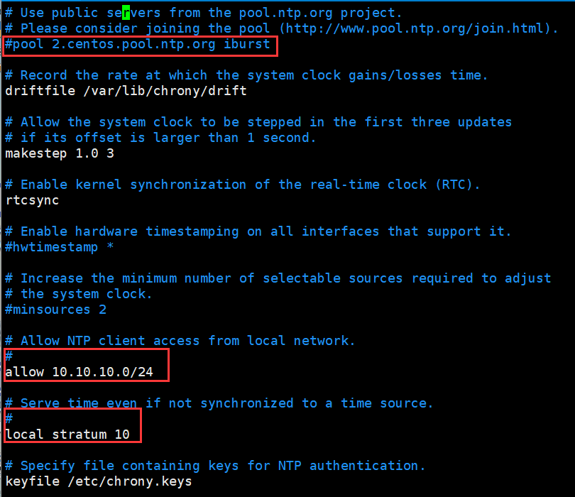

# Chrony时间同步

> 在Linux1配置时间服务器，设置时间为本地时间，时区为上海，为其他Linux主机提供时间同步服务


## 服务端配置

1.关闭Linux1 Chrony 设置时间和时区

```shell
/etc/chrony.conf

systemctl stop chronyd
timedatectl set-time "2015-5-1 10:15:26"
timedatectl set-timezone "Asia/Shanghai"
systemctl start chronyd
```


2.配置Linux1 Chrony文件

```
#1.注释pool xxx.xxx.xxx iburst

#2.取消注释 all xx.xx.xx.xx
#  改成 allow all

#3.取消注释 local stratum 10
```



重启chrony服务，关闭防火墙和selinux


## 客户端配置

安装chronyd软件，设置为开机自启

```
#1.在客户端上打开chrony主配置文件

#2.取消注释pool x.x.x.x iburst 
#  x.x.x.x修改为chrony服务端IP地址
```


# Shell脚本

编写shell脚本，分发客户端chrony配置文件，批量修改客户端的chrony配置文件，并重启客户端chrony

```shell
创建一个临时文件夹/opt/temp/
将chrony.conf文件复制一份到此处
pool xx.xx.xx.xx iburst   (xx为Linux1IP地址)
注释allow all 和 local stratum 10

touch chrony.sh && chmod 777 chrony.sh
vim chrony.sh

#!/bin/bash
HostFile="hostall.txt"
for((i=1;$i<=7;i++));
do
	HostIP=`sed -n "$i,$i p" $HostFile`
	sshpass -p Pass-1234 scp -o StrictHostKeyChecking=no chrony.conf root@$HostIP:/etc/chrony.conf
	sshpass -p Pass-1234 ssh -o StrictHostKeyChecking=no root@$HostIP "systemctl restart chronyd"
done

创建hostall.txt文件，主页修改chrony.sh中的$i<=xx(客户机数量，行数)
hostall.txt为客户机IP地址列表，一行一个。

dnf -y install sshpass 安装依赖工具
./chrony.sh    运行脚本
```
