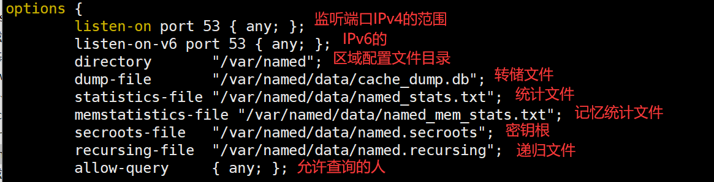
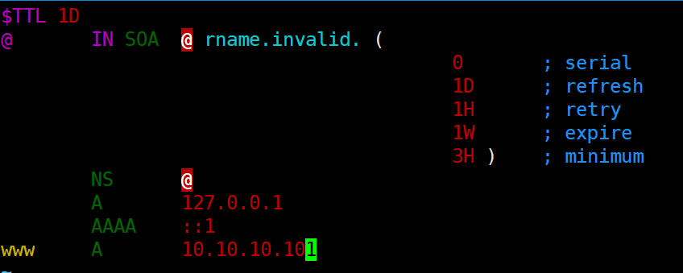

## DNS服务器及CADNS器的部署

### DNS服务器

#### １、安装DNS服务所需的软件包

软件包：**bind**

```
dnf -y install bind*    #安装DNS服务所需的软件包，自动解决依赖关系
```

#### ２、配置前检测

```
#selinux是否关闭或者正确配置
#firewalld(防火墙)是否开放端口/关闭
#bind是否正确安装    开启bind服务，将bind服务加入开机自启动
systemctl start named #启动bind服务 systemctl enable named   #添加到开机自启动
```

#### 3、配置主配置文件

```
#主配置文件位置   /etc/named.conf
[root@xiaoshae etc]# ls -la | grep "named" 
drwxr-x---   2 root named       6 11月  8 08:17 named
-rw-r-----   1 root named    1705 8月  24 2020 named.conf
-rw-r-----   1 root named    1029 8月  24 2020 named.rfc1912.zones
-rw-r--r--   1 root named    1070 8月  24 2020 named.root.key
-rw-r-----   1 root named     100 11月  8 08:27 rndc.key
options {
        listen-on port 53 { any; };    //开启监听端口53，接受任意IP连接
        listen-on-v6 port 53 { ::1; };    //支持IP V6
        directory       "/var/named";    //所有的正向反向区域文件都在这个目录下创建
        dump-file       "/var/named/data/cache_dump.db";
        statistics-file "/var/named/data/named_stats.txt";
        memstatistics-file "/var/named/data/named_mem_stats.txt";
        allow-query     { 0.0.0.0/0; };    //允许任意IP查询
#如无特殊需求，可以将三个花括号里面都改成  any;
```



```
#以下如无特殊要求，默认即可
```


```
#配置区域文件   /etc/named.rfc1912.zones
#也可以在named.conf中直接配置
#因为主文件中使用include包含了named.rfc1912.zones文件
[root@xiaoshae /]# cat /etc/named.conf | grep "include"
    include "/etc/crypto-policies/back-ends/bind.config";
include "/etc/named.rfc1912.zones";
include "/etc/named.root.key";
#建议在rfc1912中配置，因为里面有配置模板
```


```
#第一二个是模板，三四个是新建的
#因为IP是反向查询，要求IP要反过来写
#例如192.168.10.0  写成  10.168.192.in-addr.arpa
#file为改区域的文件位置   /var/named/（缺省不用写）  可在主配置文件中，修改该路径
——————
#编辑区域文件
#进入到/var/named/目录，创建两个文件
#10.10.10.zone和netskills.net.zone
#该目录下有一个模板，可直接复制。
#cp -p ./named.localhost 10.10.10.zone
#cp -p ./named.localhost netskills.net.zone
#编辑配置文件
```




```
A记录： 将域名指向一个IPv4地址（例如：100.100.100.100），需要增加A记录
CNAME记录： 如果将域名指向一个域名，实现与被指向域名相同的访问效果，需要增加CNAME记录。这个域名一般是主机服务商提供的一个域名
MX记录： 建立电子邮箱服务，将指向邮件服务器地址，需要设置MX记录。建立邮箱时，一般会根据邮箱服务商提供的MX记录填写此记录
NS记录： 域名解析服务器记录，如果要将子域名指定某个域名服务器来解析，需要设置NS记录
TXT记录： 可任意填写，可为空。一般做一些验证记录时会使用此项，如：做SPF（反垃圾邮件）记录
AAAA记录： 将主机名（或域名）指向一个IPv6地址（例如：ff03:0:0:0:0:0:0:c1），需要添加AAAA记录
SRV记录： 添加服务记录服务器服务记录时会添加此项，SRV记录了哪台计算机提供了哪个服务。格式为：服务的名字.协议的类型（例如：_example-server._tcp）。
SOA记录： SOA叫做起始授权机构记录，NS用于标识多台域名解析服务器，SOA记录用于在众多NS记录中那一台是主服务器
PTR记录： PTR记录是A记录的逆向记录，又称做IP反查记录或指针记录，负责将IP反向解析为域名
显性URL转发记录： 将域名指向一个http(s)协议地址，访问域名时，自动跳转至目标地址。例如：将www.liuht.cn显性转发到www.itbilu.com后，访问www.liuht.cn时，地址栏显示的地址为：www.itbilu.com。

隐性UR转发记录L： 将域名指向一个http(s)协议地址，访问域名时，自动跳转至目标地址，隐性转发会隐藏真实的目标地址。例如：将www.liuht.cn显性转发到www.itbilu.com后，访问www.liuht.cn时，地址栏显示的地址仍然是：www.liuht.cn。
```

```
#重启bind服务，并配置网卡中DNS服务器的地址
```

