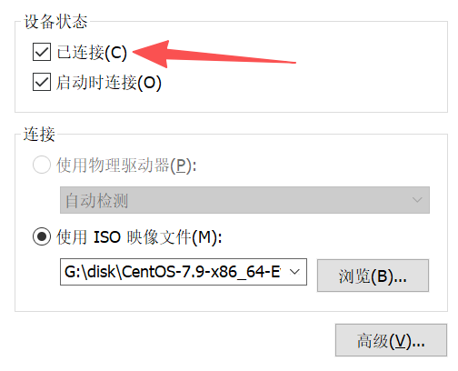

# PXE

PXE 是由 **Intel** 和 **Systemsoft** 共同制定的一项行业标准，它在设备的**固件**（Firmware）中提供预启动服务。它允许计算机（客户端）在没有操作系统或本地存储设备（如硬盘、U盘）的情况下，仅通过网卡（NIC）从网络服务器上启动。这项由Intel和Systemsoft在1999年发布的技术，已经成为现代数据中心、企业网络和大规模计算机管理的标准工具。

简而言之，它让计算机在操作系统尚未加载时，就能从网络服务器下载启动程序和操作系统镜像。


PXE 的工作流程建立在一套标准的客户端-服务器模型之上，并依赖于几个关键的网络协议，主要是 **DHCP** (动态主机配置协议) 和 **TFTP** (简单文件传输协议)。


## 核心组件

PXE 环境的实现依赖于客户端和服务器端的几个标准网络协议和服务


**PXE 客户端**

需要服务器有一块支持 PXE 的**网卡**（Network Interface Controller, NIC）。几乎所有物理线缆连接的网卡都支持。


**DHCP 服务器**（Dynamic Host Configuration Protocol）

负责给客户端分配 **IP 地址**和其它网络配置参数。

在PXE启动流程中，它还通过特定的DHCP选项向客户端提供引导信息：

- 选项 **DHCP 66 (next-server)** 来指定 **TFTP 服务器的 IP 地址**
- 选项 **DHCP 67 (bootfile-name)** 来指定**网络引导程序 (NBP) 的文件名**。


**TFTP 服务器**（Trivial File Transfer Protocol）：

这是一个轻量级的 FTP 协议，用于在网络中传输启动所需的**初始文件**（如 NBP、内核文件和初始 RAM 磁盘等）。


**HTTP/HTTPS** 服务器

一旦客户端加载了 NBP（iPXE 或其他高级引导加载程序），NBP **下载部署文件（如完整的操作系统镜像、大型安装文件包）时**通常会通过 **HTTP 或 HTTPS** 服务器来传输。

相比于 TFTP，HTTP 传输速度更快，效率更高，更适合传输 GB 级别的大文件。HTTPS 还能提供加密和安全认证。


## 工作流程

### DHCP

**PXE 客户端广播 DHCPDISCOVER 报文**

客户端在本地广播域（Broadcast Domain）内，以广播形式发送一个 `DHCPDISCOVER` 报文。

该报文中的 **选项 60 (Vendor Class Identifier)** 包含了特定于PXE的标识符，例如 `"PXEClient:Arch:xxxxx:UNDI:xxxxxx"`。该选项用于向 DHCP 服务器声明其 PXE 引导意图，以区别于常规的 IP 地址租约请求。


BIOS 客户端和 UEFI 客户端在发送 DHCP 请求包时，会通过一个特定的 **DHCP 选项 93 (Client System Architecture Type)** 来表明自己的“身份”。

**传统BIOS客户端** 发送的DHCP请求中，选项93的值通常是 **`0`** (代表 `Intel x86 PC`)。

**UEFI客户端** 发送的DHCP请求中，选项93的值根据具体架构而不同，例如：

- **`7`** (代表 `x86-64 UEFI`)
- **`9`** (代表 `x86-64 UEFI`)
- **`6`** (代表 `IA-32 UEFI`)

一个配置完善的DHCP服务器会检查这个选项93的值。然后，它会根据这个值，**动态地决定**在选项67（引导文件名）中返回哪一个NBP文件。

BIOS 和 UEFI 是两种完全不同的固件架构，它们无法执行为对方编译的程序。通过这种方式，不同架构的 PXE 客户端可以获取到与之兼容的 NBP 文件。


**DHCP 服务器的引导参数提供**

监听PXE请求的DHCP服务器在接收到 `DHCPDISCOVER` 报文后，会构建一个 `DHCPOFFER` 单播报文作为回应。

`DHCPOFFER` 报文中除了包含IP地址租约信息（`yiaddr` 字段等）外，还必须提供以下PXE专用的引导选项：

- **选项 66 (TFTP Server Name / next-server)**: 指定了提供引导文件的 TFTP 服务器地址。
- **选项 67 (Bootfile Name / filename)**: 定义了需要下载的网络引导程序 (NBP) 的完整路径及文件名。


**DHCP 客户端确认**

客户端接收到一个或多个 `DHCPOFFER` 后，会选择其中一个，并广播一个 `DHCPREQUEST` 报文，此报文的目的在于确认其选择的DHCP服务器及IP地址租约。

被选中的DHCP服务器最终返回一个 `DHCPACK` (DHCP Acknowledgment) 报文，正式确认网络参数分配。

客户端接收到 `DHCPACK` 后，便完成了网络接口的配置，并获得了执行下一步引导所需的全部信息：

- TFTP服务器地址
- NBP文件名


### 下载 NBP 引导程序

PXE客户端通过 DHCP 协议获取到 IP 地址、TFTP服务器地址（由 DHCP 选项 66 指定）以及网络引导程序（NBP）的文件名（由 DHCP 选项 67 定义）。随后，客户端将基于这些信息，使用 TFTP 协议向该服务器发起一个读请求（Read Request, RRQ），用以下载指定的 NBP 文件。


**下载 NBP (网络引导程序) 阶段必须通过 TFTP 协议。**

客户端计算机最初始的引导环境（**网卡上的 PXE 固件** ）。这段固件代码容量非常小（通常只有几十KB），它被烧录在网卡的ROM或主板的固件中。在这个微型环境中，没有空间去实现一个完整的 TCP/IP 协议栈，更不用说复杂的应用层协议如 HTTP 或 FTP 了。

TFTP (Trivial File Transfer Protocol) 协议的设计目标就是“简单”。它基于 UDP，没有复杂的连接状态管理和认证机制，代码实现非常精简，完美契合了固件环境的苛刻要求。


**控制权移交**

下载完成后，NBP (网络引导程序) 的二进制镜像已被完整加载至客户端内存。PXE 固件随即移交系统执行控制权，通过一个跳转指令将 CPU 的执行流重定向至 NBP 镜像的内存入口点 (Entry Point)，从而启动 NBP 的执行流程。


NBP (Network Bootstrap Program) 文件本质上是一个**微型的、专门用于网络引导的加载程序 (Bootloader)**。

它是一个可以直接在计算机的 CPU 上运行的**二进制可执行文件**，CPU 可以直接理解和执行的指令集合。

NBP 文件通常使用非常底层的编程语言编写，主要是 **C 语言**和**汇编语言 (Assembly)**。


**NBP 的核心组件**

1. **网络与文件加载器 (Network & File Loader):** 这是程序的核心。它内置了 TFTP 或更高级的 HTTP/NFS 等网络客户端，负责下载后续所有文件（如配置、内核）。
2. **配置解析器 (Configuration Parser):** 负责读取并理解自身的配置文件（例如 `pxelinux.cfg/default`），根据文件内容决定下一步的具体操作。
3. **用户界面 (User Interface):** 能够在屏幕上绘制一个简单的文本菜单，用于向用户展示可用的启动选项。
4. **执行控制模块 (Execution Control):** 负责将下载的文件放置到正确的内存地址，并在最后将 CPU 控制权精确地移交给操作系统内核。


**NBP 工作流程**

1. **加载配置:** 启动后，首先通过网络下载并解析自身的配置文件，以明确将要执行的任务。
2. **呈现菜单:** (可选) 根据配置在屏幕上显示一个启动菜单，并等待用户做出选择或自动超时。
3. **下载系统组件:** 根据配置指令，通过网络下载操作系统内核 (Kernel) 和初始内存盘 (initrd)。
4. **启动内核:** 将内核和 initrd 放置到正确的内存地址，最后执行跳转指令，将 CPU 的控制权移交给内核，至此 NBP 的任务完成。


## 构建 PXE 环境

操作系统版本（来源于 /etc/os-release 文件和 uname -a 命令，省略部分内容）：

```
root@xiaoshae:~# cat 
PRETTY_NAME="Ubuntu 24.04.1 LTS"
NAME="Ubuntu"
VERSION_ID="24.04"
VERSION="24.04.1 LTS (Noble Numbat)"
VERSION_CODENAME=noble
ID=ubuntu
ID_LIKE=debian
UBUNTU_CODENAME=noble
LOGO=ubuntu-logo
```

```
Linux xiaoshae 6.8.0-47-generic #47-Ubuntu SMP PREEMPT_DYNAMIC Fri Sep 27 21:40:26 UTC 2024 x86_64 x86_64 x86_64 GNU/Linux
```


网络信息（其他网卡与 PXE 服务无关，不展示）：

```
4: ens38: <BROADCAST,MULTICAST,UP,LOWER_UP> mtu 1500 qdisc fq_codel state UP group default qlen 1000
    link/ether 00:0c:29:24:d9:8e brd ff:ff:ff:ff:ff:ff
    altname enp2s6
    inet 10.33.1.1/16 brd 10.33.255.255 scope global noprefixroute ens38
       valid_lft forever preferred_lft forever
    inet6 fe80::4447:e0cb:20bb:1db1/64 scope link tentative noprefixroute 
       valid_lft forever preferred_lft forever
```


### tftp 服务器

#### 安装

更新系统软件包列表，安装 tftpd-hpa 软件包，这是一个功能增强的 TFTP 服务器。

```
sudo apt-get update
sudo apt install tftpd-hpa

systemctl start tftpd-hpa
systemctl enable tftpd-hpa
```

**tftpd-hpa 服务默认为开机自启动。**


备份配置文件：

```
mv /etc/default/tftpd-hpa /etc/default/tftpd-hpa.back
```


使用文本编辑器 vim 打开配置文件：

```
vim /etc/default/tftpd-hpa
```


将文件内容修改为如下所示。这些设置将使 TFTP 服务器监听所有网络接口的连接，并**允许上传新文件（可选）**。

```
# /etc/default/tftpd-hpa

TFTP_USERNAME="tftp"
TFTP_DIRECTORY="/pxe/tftp"
TFTP_ADDRESS=":69"
TFTP_OPTIONS="--secure --create --verbose"
```

配置文件参数详解：

​    

**TFTP_USERNAME**: TFTP 服务运行时使用的用户名。

**TFTP_DIRECTORY**: TFTP 的根目录，所有文件都将在此目录下进行传输。

**TFTP_ADDRESS**: 服务器监听的 IP 地址和端口。0.0.0.0:69 表示监听所有 IPv4 地址的 69 端口（TFTP 的标准端口）。

**TFTP_OPTIONS**: 附加选项。

- **--secure**: 将服务器的根目录切换到 TFTP_DIRECTORY 指定的目录，增强安全性。
- **--create**: 允许创建新文件，即允许客户端上传服务器上不存在的文件。


安装 tftpd-hpa 后，如果 /pxe/tftp 目录不存在，则创建该目录。

```
mkdir -p /pxe/tftp
```


为了使 TFTP 服务能够管理该目录下的文件，需要将目录的所有者更改为配置文件中指定的 tftp 用户，并赋予适当的读写执行权限。

```
# 更改目录所有者
sudo chown -R tftp:tftp /pxe/tftp

# 设置目录权限，755 允许所有者读写，其他用户只读
sudo chmod -R 755 /pxe/tftp
```

**注意**：有些教程建议使用 777 权限，这会允许任何用户写入，可能带来安全风险。对于大多数应用场景，755 是一个更安全的选择。


**安装 tftpd-hpa 成功后，服务会自动启动。若修改了配置文件，应手动重启 tftpd-hpa 服务。**

```
systemctl restart tftpd-hpa
```


#### 简单测试

**安装 TFTP 客户端**

```
apt install tftp-hpa
```


在服务器的 TFTP 根目录中创建一个用于测试下载的文件。

```
echo "tftp test content" | sudo tee /pxe/tftp/test.txt
```


连接到本地 TFTP 服务器并下载文件。

```
# 进入一个可写目录，例如 /tmp
cd /tmp

# 连接并下载文件
tftp localhost
tftp> get test.txt
tftp> quit

# 验证文件是否已下载
cat test.txt
```

注意：TFTP（Trivial File Transfer Protocol，简单文件传输协议）的设计初衷就是极简。它只包含了最**基本的功能：读取文件（GET/下载）和写入文件（PUT/上传）**。该协议本身并未定义列出目录、重命名或删除文件等功能。


创建一个新文件并上传到服务器。

```
echo "upload test" > upload.txt

# 连接并上传文件
tftp localhost
tftp> put upload.txt
tftp> quit

# 在服务器上验证文件是否已上传
ls -l /pxe/tftp/upload.txt
cat /pxe/tftp/upload.txt
```


**注意：测试完成后自行清理测试文件。**


### nginx 服务器

#### 安装

更新软件包列表并安装 nginx 服务。

```
apt-get update
apt -y install nginx

systemctl start nginx
systemctl enable nginx
```

**安装成功后会自动启动 Nginx 服务。** **nginx 服务默认为开机自启动。**


您需要创建一个专门的目录来存放您希望通过 HTTP 提供下载的文件。为了便于管理，我们将其创建在 /srv/http/。

```
mkdir -p /pxe/http/
```


**为 /pxe/http 目录设置正确的所有权和权限**，以确保 Nginx 进程（通常以 www-data 用户身份运行）有权访问这些文件。

```
# 将目录的所有权递归地赋予 www-data 用户和组
sudo chown -R www-data:www-data /pxe/http

# 确保目录及其中的文件具有正确的读取权限
sudo chmod -R 755 /pxe/http
```


在 **/etc/nginx/sites-available/** 目录下为您的文件服务器创建一个新的配置文件。

```
vim /etc/nginx/sites-available/file-server
```


将以下内容粘贴到您刚刚创建的 **file-server** 文件中。

```
server {
    listen 80 default_server;

    location / {
        root /pxe/http/;

		# 开启目录浏览功能，当访问一个目录时，会列出其中的文件
        autoindex on;

		# （可选）显示文件的确切大小，而不是以KB、MB、GB为单位
        autoindex_exact_size off;

		# （可选）显示文件的本地时间
        autoindex_localtime on;
		
		charset utf-8;
		
		# 尝试直接提供文件，如果找不到则返回 404 错误
        try_files $uri $uri/ =404;
    }

}
```


以下是无注释版本：

```
server {
    listen 80 default_server;

    location / {
        root /pxe/http/;
        autoindex on;
        autoindex_exact_size off;
        autoindex_localtime on;
		charset utf-8;
        try_files $uri $uri/ =404;
    }

}
```


Nginx 通过从 sites-enabled 目录读取配置来加载站点。我们需要创建一个从 sites-available 到 sites-enabled 的符号链接。

```
ln -s /etc/nginx/sites-available/file-server /etc/nginx/sites-enabled/
```


为了避免与默认的 Nginx 欢迎页面冲突，最好移除默认站点的符号链接。

```
rm /etc/nginx/sites-enabled/default
```


在重启服务之前，检查配置文件是否存在语法错误。

```
nginx -t
```


如果您看到如下输出，则表示配置正确：

```
nginx: the configuration file /etc/nginx/nginx.conf syntax is ok
nginx: configuration file /etc/nginx/nginx.conf test is successful
```


**重载 Nginx 服务**，以应用所有更改。

```
systemctl reload nginx
```


#### 测试

为了进行测试，我们可以在这个目录中创建一个示例文件：

```
echo "This is the nginx test file." | tee /pxe/http/nginx_test.txt
```


使用 curl 访问测试是否能正常访问。

```
curl -i http://127.0.0.1/nginx_test.txt
```


以下是 curl 命令的返回内容：

```
curl -i http://127.0.0.1/nginx_test.txt
HTTP/1.1 200 OK
Server: nginx/1.24.0 (Ubuntu)
Date: Wed, 08 Oct 2025 13:20:22 GMT
Content-Type: text/plain; charset=utf-8
Content-Length: 29
Last-Modified: Wed, 08 Oct 2025 13:19:42 GMT
Connection: keep-alive
ETag: "68e664ee-1d"
Accept-Ranges: bytes

This is the nginx test file.
```


**注意：测试完成后自行清理测试文件。**


### nfs 服务器

安装 NFS 服务器软件包

```
sudo apt-get update
sudo apt install nfs-kernel-server

sudo systemctl start nfs-kernel-server
sudo systemctl enable nfs-kernel-server
```


创建一个用于共享的目录，例如 **/pxe/nfs**：

```
mkdir -p /pxe/nfs
```


设置目录权限，确保客户端可以访问（根据需求调整权限）：

```
chown nobody:nogroup /pxe/nfs
chmod 755 /pxe/nfs
```


编辑 NFS 配置文件 /etc/exports，指定共享目录和访问权限：

```
vim /etc/exports
```


添加以下内容（根据你的网络和需求调整）：

```
/pxe/nfs 10.33.0.0/16(ro,sync,no_subtree_check)
```

- `/pxe/nfs`：共享的目录。
- `10.33.0.0/16`：允许访问的客户端网络（替换为你的网络范围，例如 192.168.1.* 或特定 IP）。
- `ro`：允许读，禁止写。
- `sync`：确保数据同步写入。
- `no_subtree_check`：禁用子树检查，提高性能。


更新 NFS 导出表：

```
sudo exportfs -a
```


### kea-dhcp 服务器

更新您的系统软件包列表并安装 Kea DHCPv4 服务器的软件包。

```
apt-get update
apt install kea-dhcp4-server

systemctl start kea-dhcp4-server
systemctl enable kea-dhcp4-server
```


Kea 的配置文件使用 JSON 格式，默认位于 /etc/kea/kea-dhcp4.conf。我们将备份原始文件并创建一个新的配置。


备份默认配置文件

```
mv /etc/kea/kea-dhcp4.conf /etc/kea/kea-dhcp4.conf.bak
```


创建并编辑新的配置文件

```
vim /etc/kea/kea-dhcp4.conf
```


将下面的 JSON 配置模板完整地复制并粘贴到文件中。**您需要根据您的网络环境修改其中的占位符**。

```json
{
    "Dhcp4": { // Kea DHCPv4 服务器的主配置块
        "interfaces-config": {
            "interfaces": [ "ens38" ] // 指定 DHCPv4 服务器监听的网络接口
        },

        "lease-database": {
            "type": "memfile", // 租约数据库类型：内存文件 (Memfile)
            "persist": true, // 启用持久化存储
            "name": "/var/lib/kea/kea-leases4.csv" // 存储 DHCPv4 租约信息的文件路径
        },

        "client-classes": [ // 客户端分类规则
            {
                "name": "PXE_BIOS",
                // 测试条件：DHCP 选项 93 (Client System Architecture) 的值是 0x0000 (Intel x86PC / BIOS)
                "test": "option[93].hex == 0x0000",
                "option-data": [
                    {
                        "name": "boot-file-name", // 分配给符合此分类的客户端的启动文件名 (TFTP 文件名)
                        "data": "undionly.kpxe" // 适用于 BIOS PXE 启动的 iPXE 文件
                    }
                ]
            },
            {
                "name": "PXE_UEFI",
                // 测试条件：选项 93 的值是 0x0007 (EFI IA32) 或 0x0009 (EFI X64)
                "test": "option[93].hex == 0x0007 or option[93].hex == 0x0009",
                "option-data": [
                    {
                        "name": "boot-file-name",
                        "data": "ipxe.efi" // 适用于 UEFI PXE 启动的 iPXE 文件
                    }
                ]
            }
        ],

        "subnet4": [ // IPv4 子网配置块
            {
                "subnet": "10.33.0.0/16", // 定义的子网 (网络地址和前缀长度)
                "pools": [ // 可分配的 IP 地址池
                    {
                        "pool": "10.33.1.100 - 10.33.1.200" // IP 地址范围
                    }
                ],
                "next-server": "10.33.1.1", // "next-server" 选项 (DHCP Option 66 / TFTP 服务器地址)
                "valid-lifetime": 4000, // 租约有效时长 (秒)
                "renew-timer": 1000, // 租约续期时间点 (秒)
                "rebind-timer": 2000 // 租约重绑定时间点 (秒)
            }
        ],

        "loggers": [ // 日志配置
            {
                "name": "kea-dhcp4", // 日志记录器名称
                "output_options": [
                    {
                        "output": "/var/log/kea/kea-dhcp4.log" // 日志文件路径
                    }
                ],
                "severity": "INFO", // 日志严重级别
                "debuglevel": 0 // 调试级别 (0-9)
            }
        ]
    }
}
```


以下是无注释版本：

```json
{
    "Dhcp4": {
        "interfaces-config": {
            "interfaces": [ "ens38" ]
        },

        "lease-database": {
            "type": "memfile",
            "persist": true,
            "name": "/var/lib/kea/kea-leases4.csv"
        },

        "client-classes": [
            {
                "name": "PXE_BIOS",
                "test": "option[93].hex == 0x0000",
                "option-data": [
                    {
                        "name": "boot-file-name",
                        "data": "undionly.kpxe"
                    }
                ]
            },
            {
                "name": "PXE_UEFI",
                "test": "option[93].hex == 0x0007 or option[93].hex == 0x0009",
                "option-data": [
                    {
                        "name": "boot-file-name",
                        "data": "ipxe.efi"
                    }
                ]
            }
        ],

        "subnet4": [
            {
                "subnet": "10.33.0.0/16",
                "pools": [
                    {
                        "pool": "10.33.1.100 - 10.33.1.200"
                    }
                ],
                "next-server": "10.33.1.1",
                "valid-lifetime": 4000,
                "renew-timer": 1000,
                "rebind-timer": 2000
            }
        ],

        "loggers": [
            {
                "name": "kea-dhcp4",
                "output_options": [
                    {
                        "output": "/var/log/kea/kea-dhcp4.log"
                    }
                ],
                "severity": "INFO",
                "debuglevel": 0
            }
        ]
    }
}

```


**如果修改了配置文件，需重启服务以应用更改。**

```
systemctl restart kea-dhcp4-server
```


**验证服务是否正在无错误地运行**

```
systemctl status kea-dhcp4-server
```

如果状态显示为 **active (running)**，则表示服务已成功启动。如果启动失败，通常是配置文件存在语法错误（例如，缺少逗号）或指定的网卡名称不正确。您可以通过 **sudo journalctl -u kea-dhcp4-server -f** 查看实时日志以排查问题。


### 编译 ipxe

在开始编译之前，您需要一个安装了必要开发工具的 Linux 环境。如果您使用的是基于 Debian/Ubuntu 的发行版，可以运行以下命令安装所需的依赖包：

```
apt-get update
apt install -y git build-essential liblzma-dev
```


从官方仓库克隆 iPXE 的源代码：

```
git clone https://github.com/ipxe/ipxe.git
```


切换到源代码目录

```
cd ipxe/src
```


在 src 目录下，创建一个名为 boot.ipxe 的文件。这个文件将包含您希望 iPXE 在启动时执行的指令。

```
boot.ipxe
```


这是一个 boot.ipxe 文件的示例，您可以根据自己的需求进行修改：

```
#!ipxe

dhcp
```

这里有问题，这只是一个示例。


#### ipxe.efi

**编译为 bin-x86_64-efi 架构的 ipxe.efi 文件**	

使用 make 命令，并指定目标平台为 bin-x86_64-efi/ipxe.efi，同时通过 EMBED 参数嵌入您的 boot.ipxe 脚本。

在 ipxe/src 目录下，运行以下命令：

```
make bin-x86_64-efi/ipxe.efi EMBED=boot.ipxe
```

编译过程可能需要一些时间。成功完成后，您将在 bin-x86_64-efi 目录下找到生成的 ipxe.efi 文件。


#### undionly.kpxe

**编译为 Legacy BIOS 架构的 undionly.kpxe 文件**

```
make bin/undionly.kpxe EMBED=boot.ipxe
```

编译成功后，你可以在 bin 目录下找到生成的 undionly.kpxe 文件


## 构建 Alpine PXE 环境

操作系统版本（来源于 /etc/os-release 文件和 uname -a 命令，省略部分内容）：

```
root@xiaoshae:~# cat 
PRETTY_NAME="Ubuntu 24.04.1 LTS"
NAME="Ubuntu"
VERSION_ID="24.04"
VERSION="24.04.1 LTS (Noble Numbat)"
VERSION_CODENAME=noble
ID=ubuntu
ID_LIKE=debian
UBUNTU_CODENAME=noble
LOGO=ubuntu-logo
```

```
Linux xiaoshae 6.8.0-47-generic #47-Ubuntu SMP PREEMPT_DYNAMIC Fri Sep 27 21:40:26 UTC 2024 x86_64 x86_64 x86_64 GNU/Linux
```


网络信息（其他网卡与 PXE 服务无关，不展示）：

```
4: ens38: <BROADCAST,MULTICAST,UP,LOWER_UP> mtu 1500 qdisc fq_codel state UP group default qlen 1000
    link/ether 00:0c:29:24:d9:8e brd ff:ff:ff:ff:ff:ff
    altname enp2s6
    inet 10.33.1.1/16 brd 10.33.255.255 scope global noprefixroute ens38
       valid_lft forever preferred_lft forever
    inet6 fe80::4447:e0cb:20bb:1db1/64 scope link tentative noprefixroute 
       valid_lft forever preferred_lft forever
```


### tftp 服务器


更新系统软件包列表，安装 tftpd-hpa 软件包，这是一个功能增强的 TFTP 服务器。

```
apk add tftp-hpa

rc-service in.tftpd start
rc-update add in.tftpd default
```

**tftpd-hpa 服务默认为开机自启动。**


使用文本编辑器 vim 打开配置文件：

```
vim /etc/conf.d/in.tftpd
```


将文件内容修改为如下所示。这些设置将使 TFTP 服务器监听所有网络接口的连接，并**允许上传新文件（可选）**。

```
# /etc/init.d/in.tftpd

# Path to server files from
# Depending on your application you may have to change this.
INTFTPD_PATH="/pxe/tftp/"
#INTFTPD_PATH="/var/tftp/"
#INTFTPD_PATH="/tftpboot/"
#INTFTPD_PATH="/tftproot/"

# For more options, see in.tftpd(8)
# -R 4096:32767 solves problems with ARC firmware, and obsoletes
# the /proc/sys/net/ipv4/ip_local_port_range hack.
# -s causes $INTFTPD_PATH to be the root of the TFTP tree.
# -l is passed by the init script in addition to these options.
INTFTPD_OPTS="-R 4096:32767 -s ${INTFTPD_PATH} -c -u nobody"
```


安装 tftpd-hpa 后，如果 /pxe/tftp 目录不存在，则创建该目录。

```
mkdir -p /pxe/tftp
```


为了使 TFTP 服务能够管理该目录下的文件，需要将目录的所有者更改为配置文件中指定的 tftp 用户，并赋予适当的读写执行权限。

```
# 更改目录所有者
chown -R nobody:nobody /pxe/tftp

# 设置目录权限，755 允许所有者读写，其他用户只读
chmod -R 755 /pxe/tftp
```

**注意**：有些教程建议使用 777 权限，这会允许任何用户写入，可能带来安全风险。对于大多数应用场景，755 是一个更安全的选择。


**若修改了配置文件，应手动重启 tftpd-hpa 服务。**

```
rc-service in.tftpd restart
```


### nginx 服务器

更新软件包列表并安装 nginx 服务。

```
apk add nginx

rc-service nginx start
rc-update add nginx default
```

**安装成功后会自动启动 Nginx 服务。** **nginx 服务默认为开机自启动。**


您需要创建一个专门的目录来存放您希望通过 HTTP 提供下载的文件。为了便于管理，我们将其创建在 /srv/http/。

```
mkdir -p /pxe/http/
```


**为 /pxe/http 目录设置正确的所有权和权限**，以确保 Nginx 进程（通常以 www-data 用户身份运行）有权访问这些文件。

```
# 将目录的所有权递归地赋予 www-data 用户和组
chown -R nginx:nginx /pxe/http

# 确保目录及其中的文件具有正确的读取权限
chmod -R 755 /pxe/http
```


删除 **/etc/nginx/http.d/default.conf** 文件

```
rm -rf /etc/nginx/http.d/default.conf
```


在 **/etc/nginx/http.d/file-server.conf** 创建一个新的配置文件。

```
vim /etc/nginx/http.d/file-server.conf
```


将以下内容粘贴到您刚刚创建的 **file-server** 文件中：

```
server {
    listen 80 default_server;

    location / {
        root /pxe/http/;
        autoindex on;
        autoindex_exact_size off;
        autoindex_localtime on;
		charset utf-8;
        try_files $uri $uri/ =404;
    }

}
```


在重启服务之前，检查配置文件是否存在语法错误。

```
nginx -t
```


如果您看到如下输出，则表示配置正确：

```
nginx: the configuration file /etc/nginx/nginx.conf syntax is ok
nginx: configuration file /etc/nginx/nginx.conf test is successful
```


**重载 Nginx 服务**，以应用所有更改。

```
rc-service nginx reload
```


### nfs 服务器

安装 NFS 服务器软件包

```
apk add nfs-utils

rc-service nfs start
rc-update add nfs default
```


创建一个用于共享的目录，例如 **/pxe/nfs**：

```
mkdir -p /pxe/nfs
```


设置目录权限，确保客户端可以访问（根据需求调整权限）：

```
chown nobody:nobody /pxe/nfs
chmod 755 /pxe/nfs
```


编辑 NFS 配置文件 /etc/exports，指定共享目录和访问权限：

```
vim /etc/exports
```


添加以下内容（根据你的网络和需求调整）：

```
/pxe/nfs 10.33.0.0/16(ro,sync,no_subtree_check)
```

- `/pxe/nfs`：共享的目录。
- `10.33.0.0/16`：允许访问的客户端网络（替换为你的网络范围，例如 192.168.1.* 或特定 IP）。
- `ro`：允许读，禁止写。
- `sync`：确保数据同步写入。
- `no_subtree_check`：禁用子树检查，提高性能。


更新 NFS 导出表：

```
exportfs -a
```


### kea-dhcp 服务器

更新您的系统软件包列表并安装 Kea DHCPv4 服务器的软件包。

```
apk add kea-dhcp4

rc-service kea-dhcp4 start
rc-update add kea-dhcp4 default
```


Kea 的配置文件使用 JSON 格式，默认位于 /etc/kea/kea-dhcp4.conf。我们将备份原始文件并创建一个新的配置。


备份默认配置文件

```
mv /etc/kea/kea-dhcp4.conf /etc/kea/kea-dhcp4.conf.bak
```


创建并编辑新的配置文件

```
vim /etc/kea/kea-dhcp4.conf
```


将下面的 JSON 配置模板完整地复制并粘贴到文件中。**您需要根据您的网络环境修改其中的占位符**。

```json
{
    "Dhcp4": {
        "interfaces-config": {
            "interfaces": [ "eth1" ]
        },

        "lease-database": {
            "type": "memfile",
            "persist": true,
            "name": "/var/lib/kea/kea-leases4.csv"
        },

        "client-classes": [
            {
                "name": "PXE_BIOS",
                "test": "option[93].hex == 0x0000",
                "option-data": [
                    {
                        "name": "boot-file-name",
                        "data": "undionly.kpxe"
                    }
                ]
            },
            {
                "name": "PXE_UEFI",
                "test": "option[93].hex == 0x0007 or option[93].hex == 0x0009",
                "option-data": [
                    {
                        "name": "boot-file-name",
                        "data": "ipxe.efi"
                    }
                ]
            }
        ],

        "subnet4": [
            {
                "id": 1,
                "subnet": "10.33.0.0/16",
                "pools": [
                    {
                        "pool": "10.33.1.100 - 10.33.1.200"
                    }
                ],
                "next-server": "10.33.1.1",
                "valid-lifetime": 4000,
                "renew-timer": 1000,
                "rebind-timer": 2000
            }
        ],

        "loggers": [
            {
                "name": "kea-dhcp4",
                "output_options": [
                    {
                        "output": "/var/log/kea/kea-dhcp4.log"
                    }
                ],
                "severity": "INFO",
                "debuglevel": 0
            }
        ]
    }
}

```


**如果修改了配置文件，需重启服务以应用更改。**

```
rc-service kea-dhcp4 restart
```


### 编译 ipxe

在开始编译之前，您需要一个安装了必要开发工具的 Linux 环境。如果您使用的是基于 Debian/Ubuntu 的发行版，可以运行以下命令安装所需的依赖包：

```
apk add build-base perl git xz-dev
```


从官方仓库克隆 iPXE 的源代码：

```
git clone https://github.com/ipxe/ipxe.git
```


切换到源代码目录

```
cd ipxe/src
```


在 src 目录下，创建一个名为 boot.ipxe 的文件。这个文件将包含您希望 iPXE 在启动时执行的指令。

```
boot.ipxe
```


这是一个 boot.ipxe 文件的示例，您可以根据自己的需求进行修改：

```
#!ipxe

dhcp
```

这里有问题，这只是一个示例。


#### ipxe.efi

**编译为 bin-x86_64-efi 架构的 ipxe.efi 文件**	

使用 make 命令，并指定目标平台为 bin-x86_64-efi/ipxe.efi，同时通过 EMBED 参数嵌入您的 boot.ipxe 脚本。

在 ipxe/src 目录下，运行以下命令：

```
make bin-x86_64-efi/ipxe.efi EMBED=boot.ipxe
```

编译过程可能需要一些时间。成功完成后，您将在 bin-x86_64-efi 目录下找到生成的 ipxe.efi 文件。


#### undionly.kpxe

**编译为 Legacy BIOS 架构的 undionly.kpxe 文件**

```
make bin/undionly.kpxe EMBED=boot.ipxe
```

编译成功后，你可以在 bin 目录下找到生成的 undionly.kpxe 文件


## 示例

### CentOS 7.9

该示例基于 ubuntu 24.04 pxe server 环境。


镜像信息：CentOS-7.9-x86_64-Everything-2009.iso

SHA-256：689531cce9cf484378481ae762f	ae362791a9be078fda10e4f6977bf8fa71350


PXE 客户端信息：

CPU：2

内存：2G**（最低 2G，网络引导需要更大的内存）**

磁盘：100GB（SATA）


CentOS 7.9 镜像，网络安装最少要 2G 内存（文本和图形化）。

rocky9.5 镜像，网络启动需要最少 2.5G 内存（文本和图形化）。

rocky10 镜像，本地启动最少 2G 内存（1G内存，无法进入安装界面）。


在 http 目录下创建 **boot**、**centos7.9** 和 **config** 文件夹。

```
mkdir /pxe/http/{boot,centos7.9,config}
```


#### 配置 ISO 镜像

将 ISO 镜像连接到 PXE 服务器，并设置开机自动挂载到 **/pxe/http/centos7.9** 文件夹。




使用 **blkid** 命令查看该 ISO 设备的 **UUID**。

```
# blkid

/dev/sr0: BLOCK_SIZE="2048" UUID="2020-11-02-15-15-23-00" LABEL="CentOS 7 x86_64" TYPE="iso9660" PTUUID="6b8b4567" PTTYPE="dos"
```


编辑 **/etc/fstab** 文件在文件末尾添加以下内容：

```
UUID="2020-11-02-15-15-23-00"	/pxe/http/centos7.9	iso9660	defaults	0	1
```


使挂载生效：

```
systemctl daemon-reload
mount -a
```


查看 **/pxe/http/centos7.9** 文件夹，检查是否挂载成功：

```
# ls /pxe/http/centos7.9/

CentOS_BuildTag  EULA  images    LiveOS    repodata              RPM-GPG-KEY-CentOS-Testing-7
EFI              GPL   isolinux  Packages  RPM-GPG-KEY-CentOS-7  TRANS.TBL、
```


#### 配置 boot 文件

将 ISO 镜像中的 **vmlinuz** 和 **initrd.img** 文件复制到 **/pxe/http/boot** 文件夹中。

**vmlinuz** 和 **initrd.img** 文件存在于 ISO 中的两个路径下，比对文件的 SHA256 值，两个路径下的文件完全一致：

```
/images/pxeboot/vmlinuz
/images/pxeboot/initrd.img
/isolinux/vmlinuz
/isolinux/initrd.img
```

注意：此处的根路径指的是 ISO 文件的根路径，而非系统文件中的根路径，系统文件的根路径为 **/pxe/http/centos7.9/...**


复制文件到 **/pxe/http/boot** 文件夹中，此处选择复制 **/pxe/http/centos7.9/images/pxeboot** 路径中的文件。

```
cp -p /pxe/http/centos7.9/images/pxeboot/vmlinuz /pxe/http/boot/vmlinuz
cp -p /pxe/http/centos7.9/images/pxeboot/initrd.img /pxe/http/boot/initrd.img
```


#### 编写 ks 文件

**anaconda-ks.cfg** 是一个用于 Red Hat 系列 Linux 发行版（如 CentOS、Fedora、RHEL 等）的 Kickstart 配置文件。它是由 Anaconda 安装程序在系统安装完成后自动生成的文件，通常位于 /root 目录下。

这个文件可以作为模板，用于创建自定义的 Kickstart 文件。通过修改 anaconda-ks.cfg，用户可以生成一个新的 Kickstart 文件，用于在其他机器上实现自动化、无交互的系统安装。


以下 **anaconda-ks.cfg** 是从新安装的 centos7.9 系统（基于 Legacy BIOS）中的 /root/ 路径下读取的。

**注意：这个文件是基于 Legacy BIOS，不一定能直接用于 UEFI，尤其是磁盘部分的配置。**

```
#version=DEVEL
# System authorization information
auth --enableshadow --passalgo=sha512
# Use CDROM installation media
cdrom
# Use graphical install
graphical
# Run the Setup Agent on first boot
firstboot --enable
ignoredisk --only-use=sda
# Keyboard layouts
keyboard --vckeymap=cn --xlayouts='cn'
# System language
lang zh_CN.UTF-8 --addsupport=en_US.UTF-8

# Network information
network  --bootproto=dhcp --device=ens33 --onboot=off --noipv6 --activate
network  --hostname=localhost.localdomain

# Root password
rootpw --iscrypted $6$1yqIn1ezD8dnN8jM$792zq2Vhyav0ANJ9qjjZy0AOy6L6Jq.jpCHsvgsRq7ExdAnic0pcbALNkVFGOEZQKAI53CMQ75U593CJWvy3o.
# System services
services --enabled="chronyd"
# System timezone
timezone Asia/Shanghai --isUtc
# System bootloader configuration
bootloader --append=" crashkernel=auto" --location=mbr --boot-drive=sda
# Partition clearing information
clearpart --none --initlabel
# Disk partitioning information
part pv.157 --fstype="lvmpv" --ondisk=sda --size=101375
part /boot --fstype="xfs" --ondisk=sda --size=1024
volgroup centos --pesize=4096 pv.157
logvol /  --fstype="xfs" --size=101372 --name=root --vgname=centos

%packages
@^minimal
@core
chrony
kexec-tools

%end

%addon com_redhat_kdump --enable --reserve-mb='auto'

%end

%anaconda
pwpolicy root --minlen=6 --minquality=1 --notstrict --nochanges --notempty
pwpolicy user --minlen=6 --minquality=1 --notstrict --nochanges --emptyok
pwpolicy luks --minlen=6 --minquality=1 --notstrict --nochanges --notempty
%end
```


将该文件作为模板文件进行修改，制作自定义的文件。


将第 5 行的 cdrom 命令注释掉（在行首添加 #）。

在第 6 行新增 `url --url http://10.33.1.1/centos7.9`。

```diff
    4 # Use CDROM installation media
-   5 cdrom
+   5 # cdrom
+   6 url --url http://10.33.1.1/centos7.9
    7 # Use graphical install
```

原始配置使用 CDROM 作为安装介质，注释掉 cdrom 表示不再从 CD/DVD 光盘读取安装文件。

通过指定 `url --url http://10.33.1.1/centos7.9`，Kickstart 配置文件指示安装程序从指定的网络地址（`http://10.33.1.1/centos7.9`）获取 CentOS 7.9 的安装文件。


将第 7 行的 graphical 命令注释掉（在行首添加 #）。

在第 8 行新增 text 命令。

```diff
    6 # Use graphical install
-   7 graphical
+   7 # graphical
+   8 text
    9 # Run the Setup Agent on first boot
```

原始配置使用图形化界面（GUI）进行安装，图形化安装需要更高的系统资源（如显示器支持、更多的内存和 CPU），注释掉 graphical 表示禁用图形化安装模式。

通过添加 text 命令，安装程序将使用文本模式（TUI，Text User Interface）进行安装。


将第 29 行的 `clearpart --none --initlabel` 修改为 `clearpart --all --initlabel`。

```diff
    28 # Partition clearing information
-   29 clearpart --none --initlabel
+   29 clearpart --all --initlabel
    30 # Disk partitioning information
```

`clearpart --none` 表示不对磁盘上的现有分区进行任何清除操作，保留所有现有分区和数据。

`clearpart --all` 指示安装程序在安装前清除磁盘上的所有分区和数据。这确保磁盘被完全初始化，适合全新安装或需要完全覆盖现有系统的场景。


在 Kickstart 文件的最后一行添加 `reboot` 命令。

```
reboot
```

添加 reboot 确保安装过程结束后系统自动重启，进入新安装的操作系统环境。


在 **/pxe/http/config/anaconda-ks.cfg** 创建文件，写入修改后的 **anaconda-ks.cfg** 完整文件。

```
vim /pxe/http/config/anaconda-ks.cfg
```

```
#version=DEVEL
# System authorization information
auth --enableshadow --passalgo=sha512
# Use CDROM installation media
# cdrom
url --url http://10.33.1.1/centos7.9
# Use graphical install
# graphical
#
text
#
# Run the Setup Agent on first boot
firstboot --enable
ignoredisk --only-use=sda
# Keyboard layouts
keyboard --vckeymap=cn --xlayouts='cn'
# System language
lang zh_CN.UTF-8 --addsupport=en_US.UTF-8

# Network information
network  --bootproto=dhcp --device=ens33 --onboot=off --noipv6 --activate
network  --hostname=localhost.localdomain

# Root password
rootpw --iscrypted $6$1yqIn1ezD8dnN8jM$792zq2Vhyav0ANJ9qjjZy0AOy6L6Jq.jpCHsvgsRq7ExdAnic0pcbALNkVFGOEZQKAI53CMQ75U593CJWvy3o.
# System services
services --enabled="chronyd"
# System timezone
timezone Asia/Shanghai --isUtc
# System bootloader configuration
bootloader --append=" crashkernel=auto" --location=mbr --boot-drive=sda
# Partition clearing information
# clearpart --none --initlabel
clearpart --all --initlabel
# Disk partitioning information
part pv.157 --fstype="lvmpv" --ondisk=sda --size=101375
part /boot --fstype="xfs" --ondisk=sda --size=1024
volgroup centos --pesize=4096 pv.157
logvol /  --fstype="xfs" --size=101372 --name=root --vgname=centos

%packages
@^minimal
@core
chrony
kexec-tools

%end

%addon com_redhat_kdump --enable --reserve-mb='auto'

%end

%anaconda
pwpolicy root --minlen=6 --minquality=1 --notstrict --nochanges --notempty
pwpolicy user --minlen=6 --minquality=1 --notstrict --nochanges --emptyok
pwpolicy luks --minlen=6 --minquality=1 --notstrict --nochanges --notempty
%end

reboot
```

**注意：这个文件是基于 Legacy BIOS，不一定能直接用于 UEFI，尤其是磁盘部分的配置。**


确保 **nginx** 服务对 **/pxe/http/boot** 和 **/pxe/http/config** 路径下的文件有读取权限：

```
chown -R www-data:www-data /pxe/http/boot
chown -R www-data:www-data /pxe/http/config

chmod -R 644 /pxe/http/boot
chmod -R 644 /pxe/http/config

chmod -R u+X /pxe/http/boot
chmod -R u+X /pxe/http/config
```


#### 编译 ipxe NBP 文件

编写  boot.ipxe 文件并编译 ipxe NBP 文件。


切换到 **/root/ipxe/src** 路径，使用 vim 新建并编辑 **boot.ipxe** 文件

```
cd /root/ipxe/src

vim boot.ipxe
```

在文件中添加以下内容：

```
#!ipxe

dhcp

set server-ip 10.33.1.1

set initrd http://${server-ip}/boot/initrd.img
set vmlinuz http://${server-ip}/boot/vmlinuz
set repo http://${server-ip}/centos7.9

set ks-config http://${server-ip}/config/anaconda-ks.cfg

kernel ${vmlinuz}
initrd ${initrd}

imgargs vmlinuz \
	initrd=initrd.img \
	ip=dhcp \
	inst.repo=${repo} \
	inst.ks=${ks-config}

boot
```


编译为 **bin/undionly.kpxe** 文件

```
make bin/undionly.kpxe EMBED=boot.ipxe
```


将 **bin** 路径下的 **undionly.kpxe** 文件复制到 **/pxe/tftp/undionly.kpxe**

```
cp -p bin/undionly.kpxe /pxe/tftp/undionly.kpxe
```


（可选）在  **/root/ipxe/src** 路径下创建 **install.sh** 脚本，在修改 **boot.ipxe** 文件执行该脚本，自动编译为 NBP 文件并复制到目标位置。

```
#!/bin/bash

TARGET=/pxe/tftp

cd /root/ipxe/src/

make bin-x86_64-efi/ipxe.efi EMBED=boot.ipxe -j 2
make bin/undionly.kpxe EMBED=boot.ipxe -j 2

cp -p bin-x86_64-efi/ipxe.efi $TARGET
cp -p bin/undionly.kpxe $TARGET

chown www-data:www-data $TARGET
chmod 644 $TARGET/*
```

​	

此时启动另外一台电脑，应该可以无人值守安装。

