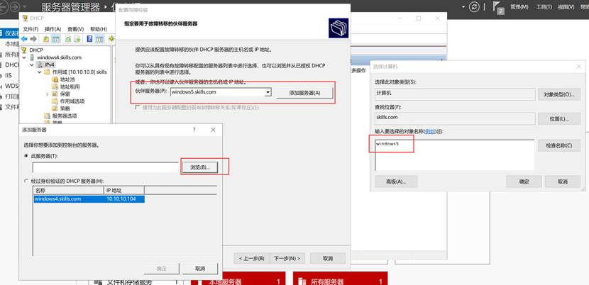
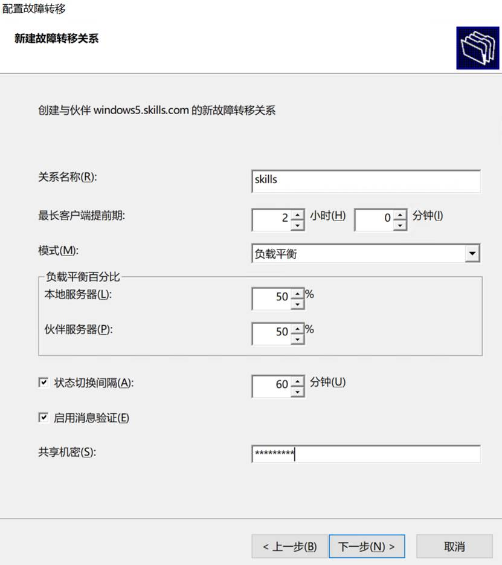
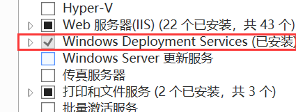

# DHCP安装配置

>   配置 windows4 和 windows5 为 DHCP 服务器，DHCP IPv4 的 作用域名称为 skills，地址范围为 10.10.10.10-10.10.10.19，租约期 3小时，网关为 10.10.10.254，DNS 为 10.10.10.101 和 10.10.10.102， DNS 域名为 skills.com。

在windows4和5上安装dhcp服务，新建ipv4作用域，名称设置为skills

设置起始IP的结束IP，设置子网掩码长度为24

排除IP地址无需设置

时间设置为3小时

选择，是，我想要立即配置这些选项

路由器（默认网关）输入网关IP点击添加

父域设置为skills.com，添加分别添加两个dns的IP地址

WINS服务器无需设置

一直下一步直到完成

# 故障转移服务

>   两台 DHCP 服务器实现故障转移，故障转移关系名称为 dhcp， 最长客户端提前期为 2 小时，模式为“负载平衡”，负载平衡比例各 为 50%，状态切换间隔 60 分钟，启用消息验证，共享机密为 Pass-1234

右击IPv4，配置故障转移，添加服务器为windows5

按照要求输入配置信息

一直下一步，直到完成

# WDS服务

windows4 上安装 WDS，部署安装 Windows Server 2022 Datacenter Core

添加Windows Deployment Services角色

工具，Windows部署服务

右击服务器，添加服务器，本地计算机

配置服务器，与Active Directory集成，远程文件夹默认，响应所有客户端计算机，不勾选

一直下一步直到结束

将iso复制到服务器，打开该iso

右击安装映像，添加安装映像，安装映像文件位置E:\sources\install.wim，勾选Server 2022 Datacenter Core

启动映像，添加启动映像，文件位置，E:\sources\boot.wim

最后右击添加的服务器，所有任务，启动服务器。