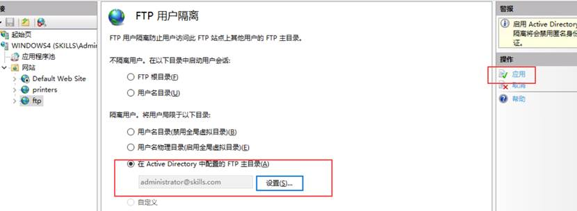

# FTP站点创建

FTP站点名称为ftp，站点绑定本机IP地址，站点根目录为：C:\ftp\ftproot

右击网站，添加FTP站点，站点名ftp，物理路径C:\ftp\ftproot，下一步设置IP，端口默认21，无需SSL。

下一步，身份验证勾选基本，允许访问，所有用户，权限，读写

# Active Directory隔离用户

Manager1和manager2测试，用户路径为C:\ftp\ftproot，用户目录名称与用户名相同

在ftproot创建manager1和manager2，高级共享这三个文件夹，给everyone完全控制权限。

FTP中选择FTP用户隔离，选择 在Active Directory中配置的FTP主目录

切换到Windows域控制器服务器，打开AD DS域用户和计算机，查看，勾选高级功能。分配配置manager1和manager2的这两项

 

# 操作连接限制

设置 FTP 最大客户端连接数为 100。设置无任何操作的超时时 间为 5 分钟,设置数据连接的超时时间为 1 分钟

控制通道超时时间：无任何操作的超时时间

数据连接超时时间：指定在数据通道上因不活动而超时时超时（以秒为单位）。 **注意：** 仅当达到此超时时，FTP 服务才会断开数据通道的连接

