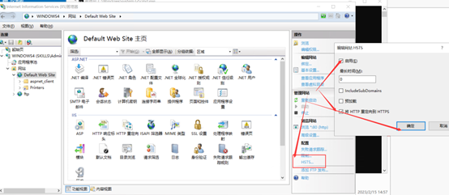
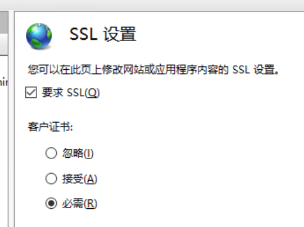
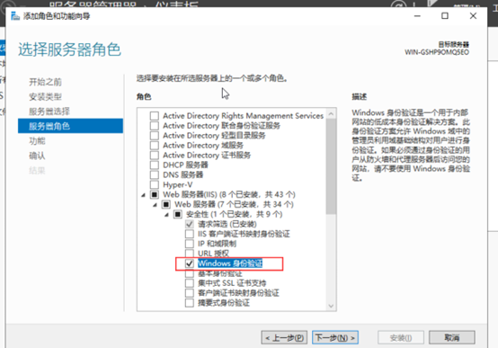
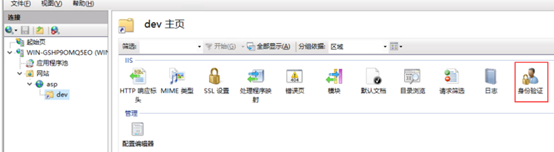
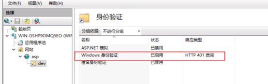
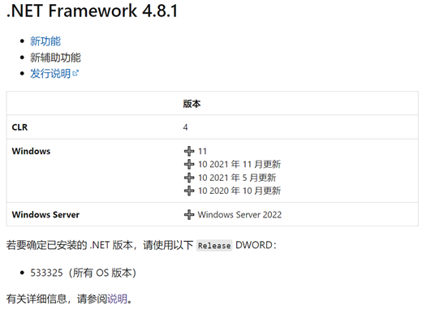

# Web基本配置

# 设置网站目录和默认文档

>   网站目录为 C:\IIS\Contents，主页文档 index.aspx 的内容为 "HelloAspx"

创建文件路径C:\IIS\Contents，创建文本index.aspx，使用记事本打开添加内容HelloAspx

在网站中添加默认文档index.aspx

创建网站时绑定该物理路径，或者在基本设置中设置该物理路径，连接为设置账户，使用域控制器管理员账户

# http + https 仅允许域名访问

http 和 https 绑定本机外部网络 IP 地址，仅允许使用域名访问

>   设置IP地址和端口号，允许IP地址和指向该IP地址的域名访问，IP+主机名+端口号，仅允许使用主机名所设置的域名访问。

绑定两个，类型分别为http和https，主机名设置为域名，IP设置为本机IP

https需要绑定证书，需要申请证书 后导入 。

# 启用 HSTS

>   启用 HSTS，实现 http 访问自动跳转到 https

# 客户端SSL证书验证，证书模板为“管理员”

网站主页打开SSL设置，勾选要求SSL，选择必须

客户机需要申请证书，浏览器访问时选择证书。

#  windows 身份验证

>   启用 windows 身份验证，只有通过身份验证的用户才能访问到 该站点。

安装Windows 身份验证

选中网站在网站主页IIS中选择身份验证

启用Windows身份验证，禁用匿名身份验证

# 虚拟目录

>   新建虚拟目录 dev，对应物理目录 C:\development，该虚拟目录 启用 windows 身份验证，只有通过身份验证的用户才能访问

新建目录C:\development

右击需要添加虚拟目录的网站

连接为设置为域控制器管理员账户

设置dev主页的身份验证（网站开启的身份验证会自动同步到虚拟目录）

# 匿名身份认证

访问打印机虚拟目录Printers时，启用匿名身份认证，匿名用户为dev1

打开Printers目录主页，选择身份认证，若没有该用户去Windows域控制器中添加用户

 

 

# 配置为 ASP 网站，网站仅支持 dotnet CLR v4.0

ASP.NET 是一个免费的 Web 框架，用于使用 HTML、CSS 和 JavaScript 构建出色的网站和 Web 应用程序。 还可以创建 Web API 并使用 Web 套接字等实时技术。

 

CLR 由其自己的版本号标识。 .NET Framework 版本号在每次发布时都会递增，但 CLR 版本并不总是递增的。 例如，.NET Framework 4、4.5 和更高版本包含 CLR 4，而 .NET Framework 2.0、3.0 和 3.5 包含 CLR 2.0。 （没有版本 3 的 CLR。）

## 配置方法：

