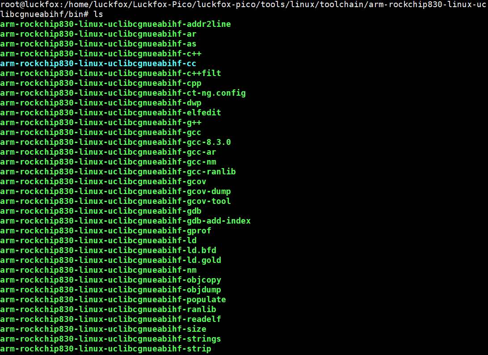
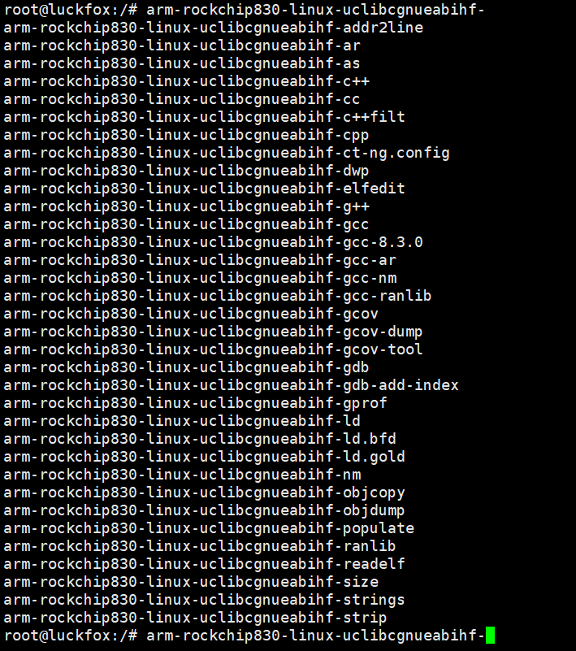
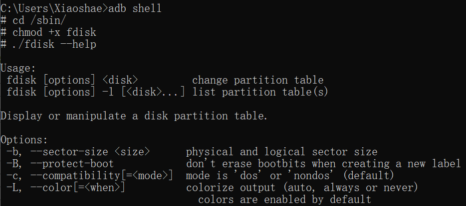

# 交叉编译util-linux(fdisk,mkfs)


## 1.编译安装ncurses

> **注意：不同的版本之间也可以造成一定的问题，我这里使用的版本是ncurses-6.1**
>
> **下载链接：https://ftp.gnu.org/pub/gnu/ncurses/**


### 准备工作

```
#解压ncurses
root@luckfox:/opt/build# tar -xf ncurses-6.1.tar.gz

#进入文件夹
root@luckfox:/opt/build# cd ncurses-6.1/

#创建构建目录
root@luckfox:/opt/build/ncurses-6.1# mkdir build

#进入构建目录
root@luckfox:/opt/build/ncurses-6.1# cd build/
```


#### 交叉编译环境

找到交叉编译工具链的位置，为其创建环境变量，确保可以正常识别到







### 编译安装

```bash
#预构建
../configure --host=arm-rockchip830-linux-uclibcgnueabihf --with-termlib --prefix=/soft/ncurses/

#host参数
#在上面的交叉编译工具链中，都是
[arm-rockchip830-linux-uclibcgnueabihf]-gcc
[arm-rockchip830-linux-uclibcgnueabihf]-cc
[arm-rockchip830-linux-uclibcgnueabihf]-g++
......
#如果你的交叉编译工具链为 [xxxxx]-gcc
#那么host参数就设置为 --host=xxxx

#--prefix参数，ncurses工具安装的位置

#编译
make -j16
#-j16表示使用16线程进行编译，按照自己本机实际的来进行选择

#安装
make install

#注意：在绝大多数情况下都会报错
#make[1]: 进入目录“/opt/build/ncurses-6.4/build/progs”
#/usr/bin/install -c -s tic     /soft/ncurses//bin/`echo tic|       sed 's/$//'|sed 's,x,x,'|sed #'s/$//'`
#strip: Unable to recognise the format of the input file `/soft/ncurses//bin/tic'
#/usr/bin/install: 拆解过程非正常中止
#Makefile:219: recipe for target 'install.progs' failed
#make[1]: *** [install.progs] Error 1
#make[1]: 离开目录“/opt/build/ncurses-6.4/build/progs”
#Makefile:133: recipe for target 'install' failed
#make: *** [install] Error 2

#这是因为没有使用交叉编译工具链中的strip，而是使用了系统本机的strip
#首先记录下系统本机的strip指向

root@luckfox:/# which strip
/usr/bin/strip
root@luckfox:/# ls -la /usr/bin/strip 
lrwxrwxrwx 1 root root 147 11月 27 13:26 /usr/bin/strip -> xxxxxxxxxx

#删除/usr/bin/strip 
root@luckfox:/# rm -rf /usr/bin/strip

#重新添加一条指向交叉编译工具链中的

 ln -s /home/luckfox/Luckfox-Pico/luckfox-pico/tools/linux/toolchain/arm-rockchip830-linux-uclibcgnueabihf/bin/arm-rockchip830-linux-uclibcgnueabihf-strip /usr/bin/strip
```


# 2.编译安装fdisk

> **util-linux中包含fdisk，最新的util-linux使用了c11标准中的特性，如果你不知道你的交叉编译工具链是否支持c11，那么可以选择老版本。**
>
> **这里我选择的版本为：v2.38**
>
> **下载链接：https://github.com/util-linux/util-linux/releases/tag/v2.38**


### 下载解压

```
tar -xf util-linux-2.38.tar.gz 
cd util-linux-2.38/
```


### 预构建

```
./autogen.sh
./configure CFLAGS='-I/soft/ncurses/include'  LDFLAGS='-L/soft/ncurses/lib' --with-ncurses --disable-widechar --disable-shared --host=arm-rockchip830-linux-uclibcgnueabihf

CFLAGS LDFLAGS 中指定的路径为刚刚编译安装的ncurses
--disable-shared 表示不使用动态链接库
```


出现错误，错误信息显示，你需要安装autopoint和libtool-2

```
root@luckfox:/opt/build/util-linux-2.39.1# ./autogen.sh 

ERROR: You must have autopoint installed to generate the util-linux build system.
       The autopoint command is part of the GNU gettext package.


ERROR: You must have libtool-2 installed to generate the util-linux build system.
```


ubuntu中的解决方法

```
sudo apt-get install autopoint
sudo apt-get install libtool
```


### 编译

```
 make -j16 fdisk
 #make -j16 mkfs
```


文件夹中会出现一个


# 3.复制到开发板上进行测试



