# Proxy

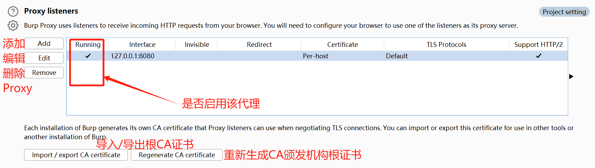


## 代理侦听器

### 添加代理

BurpSuite的代理侦听器仅支持HTTP代理协议，不支持Socks等其他协议，HTTP代理协议不支持设置。

添加了代理侦听器后，勾选**Running**，在BurpSuite启动之后，所有代理侦听器就会自动开启，无需手动开启。

注意：如果是保存在内存中的临时项目，添加代理侦听器，重启BurpSuite后代理侦听器会消失。

#### 指定IP和端口

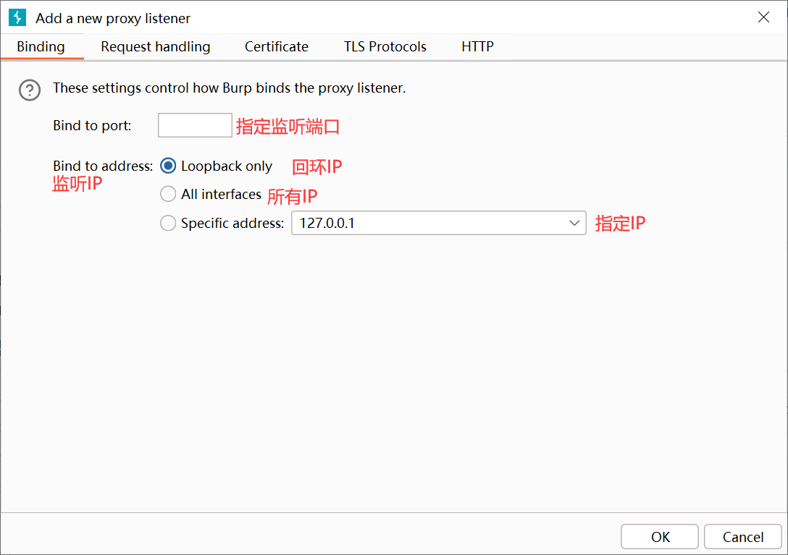


#### 指定二级代理

假设BurpSuite为一级代理，那么BurpSuite支持将接受到的流量处理完毕后转发给二级代理。


#### 自定义证书

如果选择前三项则会使用BurpSuite中根CA颁发的一个（二级证书）证书。如果选择第三项则使用指定的自定义证书。

1. 每个主机颁发的（二级）证书是相同的
2. 每个主机颁发的（二级）证书是不同的
3. 为当前代理侦听器指定特定的主机名证书
4. 使用自定义证书

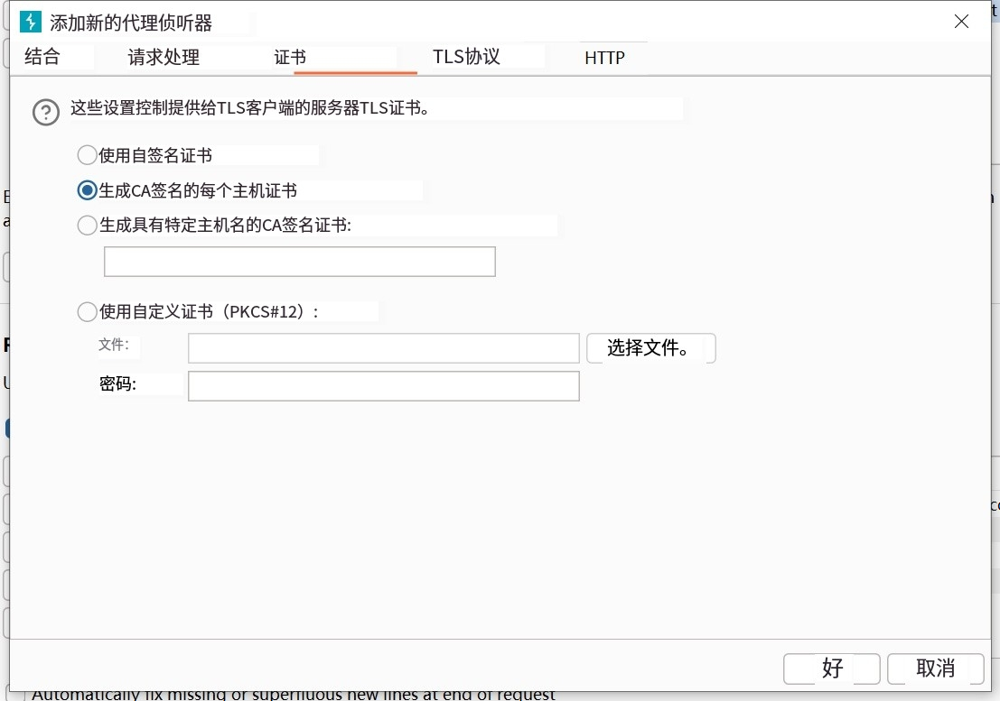

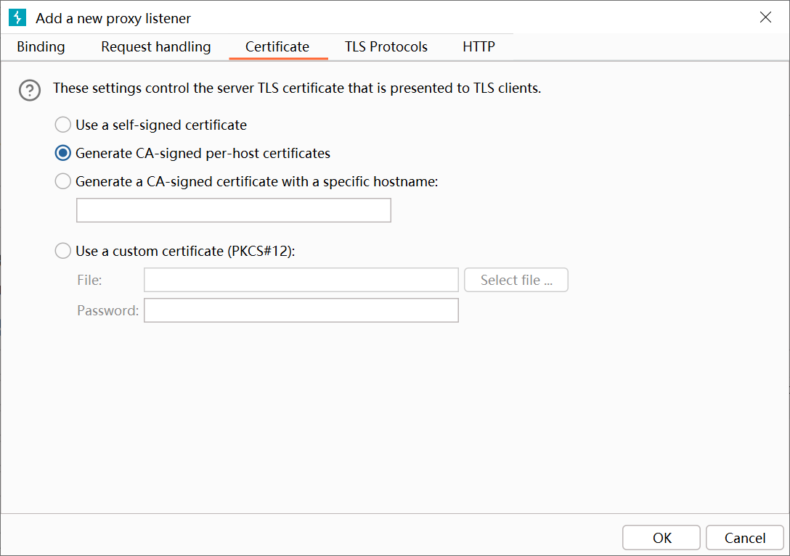


#### TLS协议

为当前代理侦听器指定TLS版本

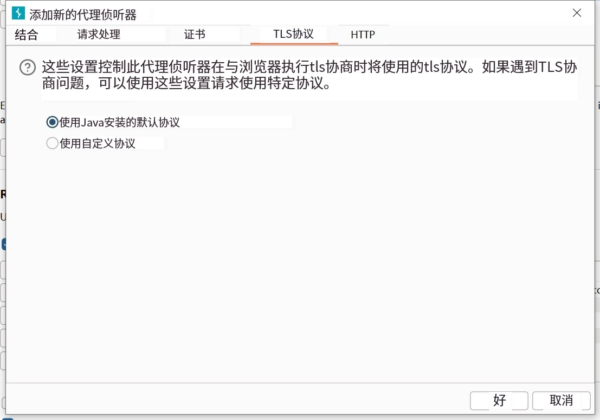


#### HTTP2

是否启用HTTP2x


## 拦截

在默认情况下拦截模式是关闭的，所有通过BurpSuite代理的数据包会被转发出去。开启拦截模式后，收到数据包后会被拦截下来，自行决定转发/丢弃该数据包，或者使用其他工具进行操作。

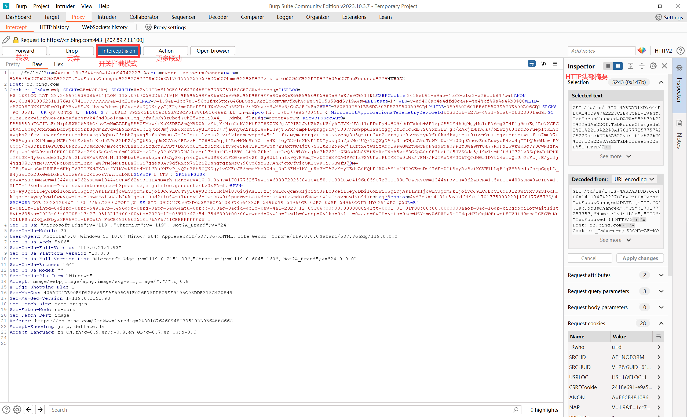


## HTTP历史

在Proxy中的HTTP history中可以查看经过BurpSuite转发的所有流量，选中一条请求后可以查看其信息。

双击一条请求可在新的窗口查看其信息。


- **Request**请求数据包
- **Response**响应数据包
- **Raw**原始数据包
- **Pretty**经过格式美化后的数据包
- **Render**渲染后的页面


- **Hex**16进制查看数据包


- **Hex**16进制查看数据包


### 请求信息摘要

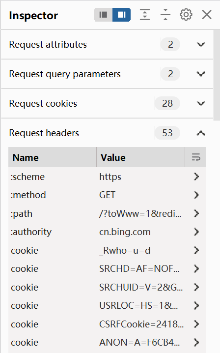


### 显示过滤器

单击此处即可设置过滤


#### 设置模式

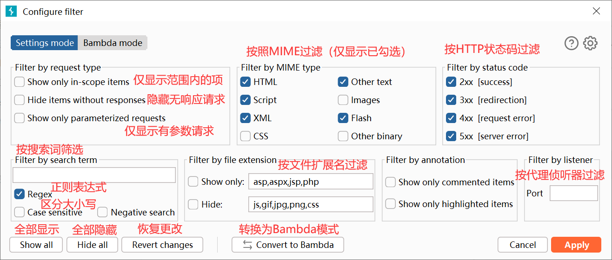


#### Bambda模式

可以更加精准的进行过滤


# Target

## Site Map

以树形目录的方式显示请求信息，也可以使用显示过滤器。


## issue definitions

Issue definitions 包含可以被SurpSuite探测到的漏洞详情。这表明通过burpsuite转发流量的网站可能存在下列漏洞，选择漏洞后可以查看该漏洞的介绍。


## Target scope

**包含在范围之内的**和**排除在范围之外**的，只会影响Target中的呈现，不会影响Proxy HTTP history等其他工具，但是如果添加完后在弹出的对话框中选择yes，则也会影响除Target之外的其他工具。


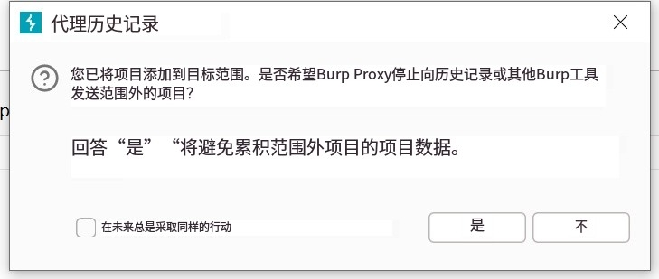


**所有的请求（数据包）都会被正常转发**，此处的设置仅仅只是决定呈现哪些请求，隐藏哪些请求。


### 范围外处理

如果勾选了**删除超出范围的请求**，那么在范围内的请求（数据包）才会被转发，不在范围内的请求则会按照设置的规则决定是否删除。

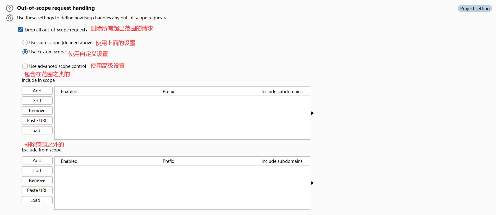


### 高级设置


# Repeater


## 新建Repeater

在Repeater中可以点击"+"按钮新建一个HTTP、WebSocket、标签群组。


新建了一个HTTP中默认情况下Reuqest中没有任何内容。


可以在Request中输入需要HTTP请求内容，然后在Inspector中可以预览请求中的头部信息

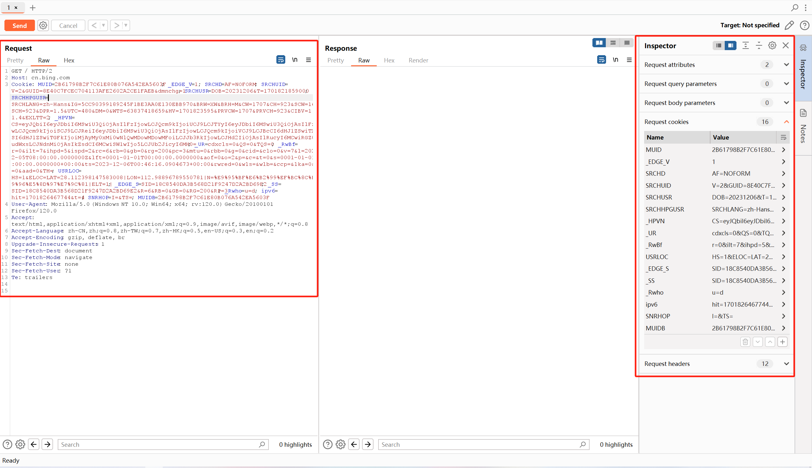


### 快速添加到Repeater

在BurpSuite其他工具中（例如：HTTP history）选中一个请求，右击选中 Send to Repeater ，就会自动在Repeater中新建一个标签，并将请求内容添加到Request中。

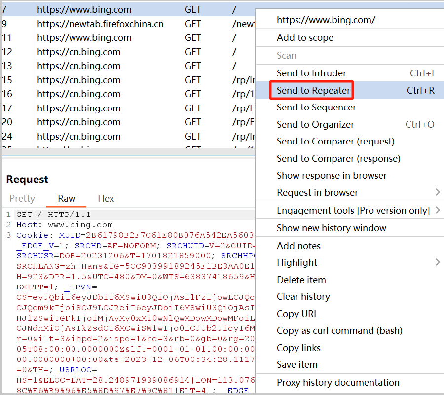


### Send

单击Send即可发送一次当前Request中的请求，多次单击Send即可多次发送。

在Response中可以查看服务端响应的内容

在Send旁边可以查看多次发送请求中，每一次的结果。

**不同标签中的Request和Response互不影响。**


### 发送分组 HTTP 请求

在测试的过程中可能创建了多个标签，BurpSuite允许以多种方式分组发送HTTP请求。

现在假设存在三个标签，点击"+"，创建一个标签组。

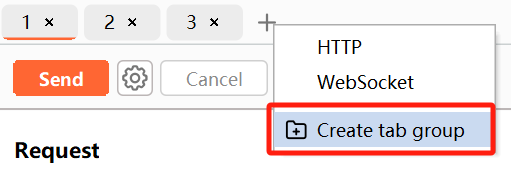

将三个标签添加到当前标签组中。


可以展开标签组，对标签组中的每一个标签进行独立操作。可以取消标签组，或者删除标签组（包括里面的所有标签）


单击 Send 旁边的下拉列表，可以选择分组发送的不同形式。

- Send group in sequence (single connection)：顺序发送（单一连接）
    - Burp Repeater建立到目标的**一个TCP连接**，按顺序发送请求，然后关闭连接。
- Send group in sequence (separate connections)：顺序发送（独立连接）
    - 对于组中的每个标签，Burp Repeater都会**为不同的标签，建立独立的TCP连接**，按顺序发送请求，然后关闭连接。
- Send group in parallel：并行发送
    - 对于组中的每个标签，Burp Repeater都会为不同的标签，建立独立的TCP连接，**所有TCP连接建立成功后，同时发送所有请求。**


**第一项和第三项**，要求所有的标签中的请求必须**为同一个HOST（连接到同一个主机）**才可以使用，否则只能使用第二项。


选择一项后，单击 Send group xxxx 即可分组发送HTTP请求。


# Intruder

## Hack Mode

### Sniper

该模式支持多个pyload插入点，只能设置一个payload，一次仅支持在一个点插入payload。


payload

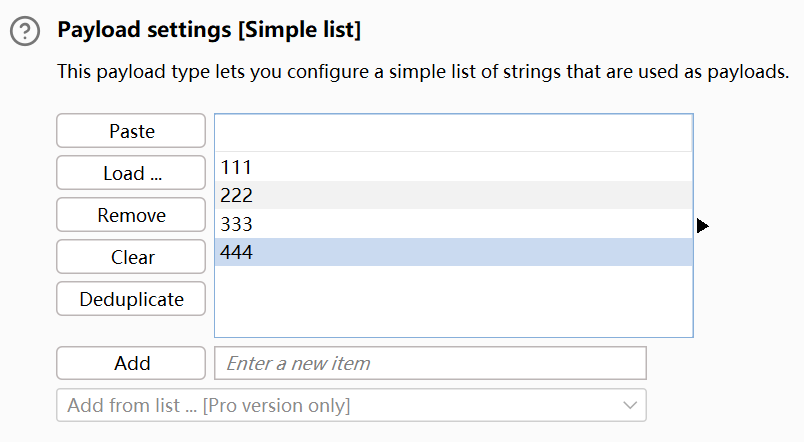

第一次在User处插入111、222、333、444，Pass和ck处为空

第二次在Pass处插入111、222、333、444，User和ck处为空

第三次在ck处插入111、222、333、444，User和Pass处为空

```
第1次，111，空，空
第2次，222，空，空
第3次，333，空，空
第4次，444，空，空
第5次，空，111，空
第6次，空，222，空
第7次，空，333，空
第8次，空，444，空
第9次，空，空，111
....
```


### Battering ram

该模式支持多个pyload插入点，只能设置一个payload，一次循环在每个点插入相同的payload

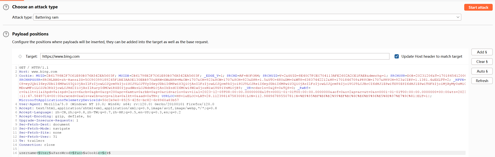


payload


循环第一次，在User、Pass、ck插入的值都为111

循环第二次，在User、Pass、ck插入的值都为222

循环第三次，在User、Pass、ck插入的值都为333

### Pitchfork

该模式支持多个pyload插入点，可以设置多个payload，每一次循环将一个payload插入对应的点，循环次数按照payload数量最少的来。

假设存在插入点User（payload1）、Pass（payload2）、ck（payload3）。

```
payload1:
111
222
333
444

payload2:
888
999


payload3:
777
666
555
```


只会循环2次，应为第二个payload数量是最少的（为2）

第一次为111、888、777

第二次为222、999、666


### Cluster bomb

该模式支持多个pyload插入点，可以设置多个payload。

如果设置了两个payload。

第一次，在第一个点插入payload（1），然后在第二个点循环插入payload（从第一个到最后一个，全部）

第二次，在第一个点插入payload（2），然后在第二个点循环插入payload（从第一个到最后一个，全部）

```
payload1:
111
222

payload2:
888
999
000
```

```
第一次，111、888
第二次，111、999
第三次，111、000
第四次，222、888
第四次，222、999
.......
```


以下是设置3个payload的效果（多个payload效果一致）

```
payload1:
111
222

payload2:
888
999

payload3:
aaa
bbb
ccc
```

```
第1次，111、888、aaa
第2次，111、888、bbb
第3次，111、888、ccc
第4次，111、999、aaa
第5次，111、999、bbb
第6次，111、999、ccc
第7次，222、888、aaa
第8次，222、888、bbb
第9次，222、888、ccc
第10次，222、999、aaa
......

第1次，111、888、aaa
第2次，222、888、aaa
第3次，111、999、aaa
第4次，222、999、aaa
第5次，111、888、bbb
第6次，222、888、bbb
第7次，111、999、bbb
第8次，222、999、bbb
第9次，111、888、ccc
......
```


## Payloads

### Settings

#### Simple list

配置一个用作payload的简单字符串列表。每一行就是一个独立的payload


#### Runtime file

从文件中读取payload，每一行就是一个独立的payload。

其实这个跟Simple list直接Load就是一样的意思而已，只是Simple list如果汇入的文档很大，Simple list会显示文件中的内容，所以需要加载很久，Runtime file则不会显示文件中的内容。


#### Recursive grep

在Intruder中的Setting中可以设置Grep - Extract，在此处可以设置在Attack中显示响应中特定的值。


在Recursive grep中可以设置，在当前请求中使用上一次响应中特定的值。

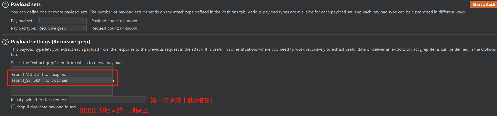


#### Numbers

指定范围指定格式生成数字。type可以指定数字是**顺序生成**还是**随机生成**。数字可以为小数，但是Format必须设置为Decimal

##### Sequential

从1开始生成，每次增加2（**Step可以未负数**），最大值为10。所以生成的值为1、3、5、7、9。Sequential不能设置How many字段

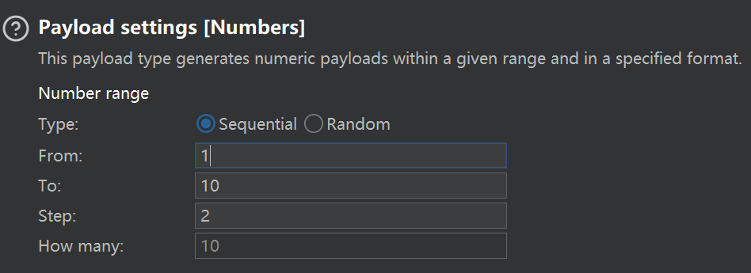


##### Random

在1-100范围之间，随机生成10个paylaod，Random不能设置Step字段。

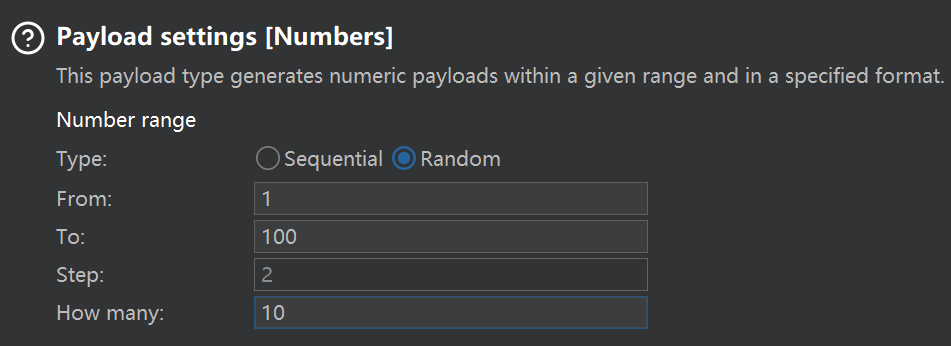


##### Format Hex

**Base** - 指定数字是以十进制还是十六进制形式生成。

（当Base为Hex时，只能设置以下两个字段）

**Min integer digits** - 设置每个数字的最小整数位数。整数位数较少的数字在左侧用零填充。

**Max integer digits** - 设置每个数字的最大整数位数。具有更多整数位的数字将被截断，丢失其最高有效整数位。


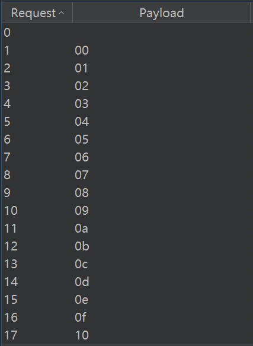


##### Format Decimal

**Min fraction digits** - 最小小数位数 - 设置每个数字的最小小数位数（小数点后）。小数位数较少的数字在右侧用零填充。仅在生成十进制数时可用。

**Max fraction digits** - 设置每个数字的最大小数位数（小数点后）。小数位数较多的数字将被截断，失去最不重要的小数位数。仅在生成十进制数时可用。

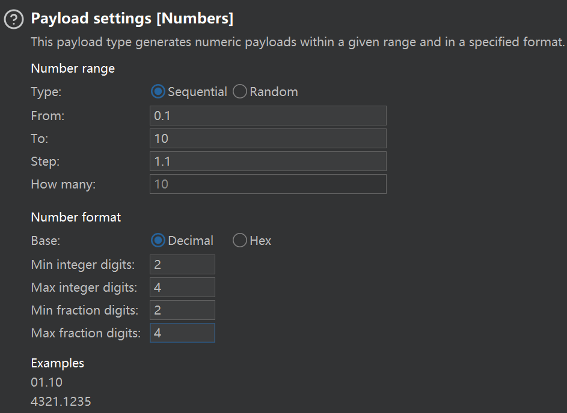

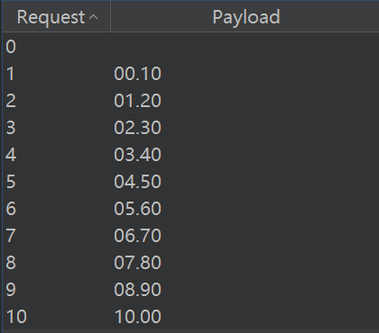

#### Dates

**From**  - 设置将生成的第一个（也是最早）日期。

**To** - 设置将生成的最后（和最新）日期的值（或步长值的最接近的较低增量）。

**Step** - 设置连续日期之间的增量，以天、周、月或年为单位。它必须是一个正值。

**Format** - 设置表示日期的格式。可以选择多种预定义的日期格式，也可以输入自定义格式。

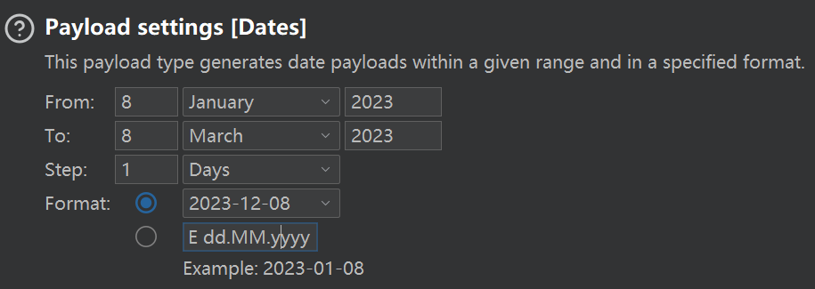

#### Brute forcer

能够生成指定长度的有效负载，其中包含指定字符集的所有排列。


**Character set** - 指定有效负载中使用的字符集。请注意，有效负载的总数随着该组的大小呈指数增长。

**Min length** - 设置最短有效负载的长度。

**Max length** - 设置最长有效负载的长度。


#### Username generator

能够使用各种常见方案从姓名或电子邮件地址列表中获取潜在的用户名。

如果目标是特定的人类用户，并且不知道应用程序中使用的用户名或电子邮件地址方案，则此有效负载类型非常有用。

例如，提供名称“peter wiener”会产生最多 115 个可能的用户名（可以配置列表中每个项目生成的最大有效负载数。）：

```
peterweiner
peter.wiener
wienerpeter
wiener.peter
peter
wiener
peterw
peter.w
wpeter
w.peter
pwiener
p.wiener
wienerp
wiener.p
...
```

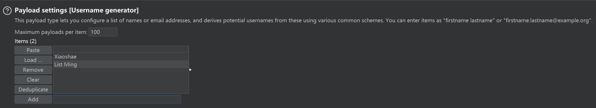


### Processing


### Encoding