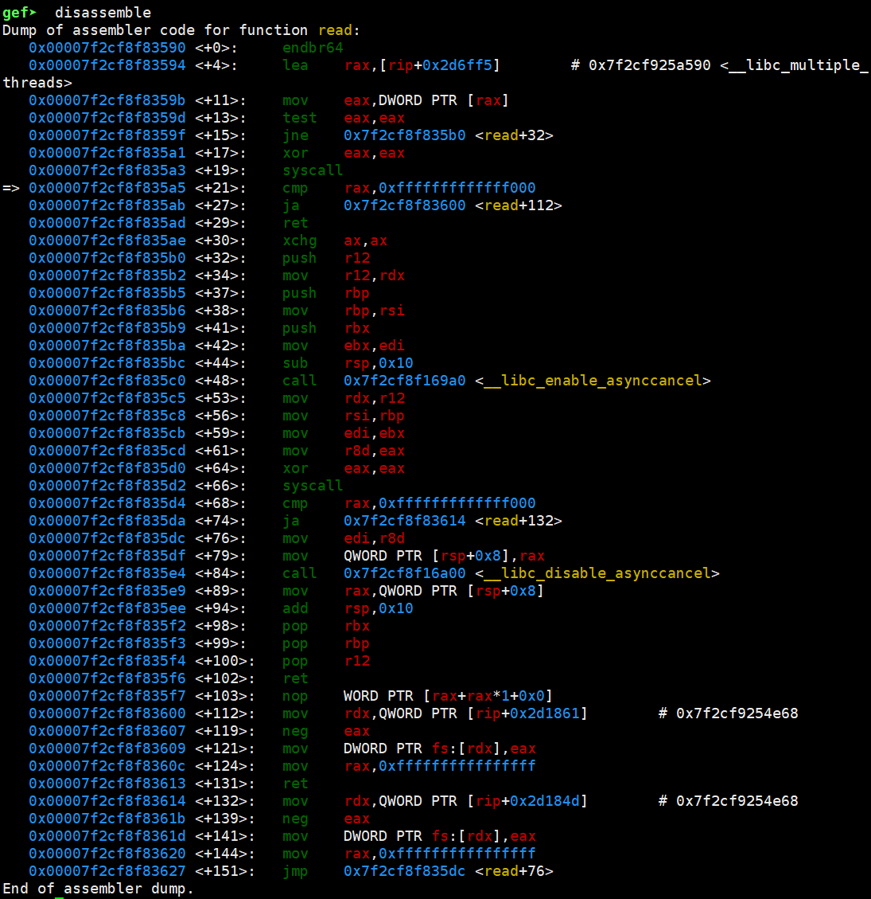

# python pwntools proc模块


# binary

指定二进制文件，不对其进行检查

context.binary = binary = ELF("./pwn109",checksec=False)


# level_log

指定日志等级，设置为debug以方便寻找错误

context.log_level = "debug"


# process

process()函数是Python的pwntools库中的一个函数，它用于创建一个新的进程，并使用管道进行通信


# pidof

pidof()函数是Python的pwntools库中的一个函数，它用于获取目标的进程ID。返回的PID取决于目标的类型1：

- 如果目标是字符串：返回所有进程名称与目标匹配的进程的PID。
- 如果目标是pwnlib.tubes.process.process：返回目标的PID的单例列表。


# wait_for_debugger

wait_for_debugger()函数是Python的pwntools库中的一个函数，它用于等待进程被跟踪1。如果设置了debugger_pid并且调试器退出，它将引发错误1。以下是该函数的参数的详细说明：

- pid（整数）：进程的PID。
- debugger_pid（整数）：调试器的PID。如果设置了此参数并且调试器退出，将引发错误。


# recvuntil

recvuntil()函数是Python的pwntools库中的一个函数，它用于从进程中读取数据，直到遇到指定的分隔符1。以下是该函数的参数的详细说明：

delims（字符串或字节）：分隔符。函数将一直读取数据，直到遇到这个分隔符1。
drop（布尔值）：如果设置为True，则返回的数据将不包含分隔符1。


# pause

pwntools库中有一个名为pause()的函数，可以用来暂停程序的运行，直到用户输入任何内容后，程序才会继续运行。这个函数没有参数。以下是一个使用pause()函数的例子：

```python
from pwn import *
print("程序即将暂停...")
pause()
print("程序继续运行！")
```


# 发送函数

## send

`send()`函数可以向进程的stdin写入数据。例如：

```python
p.send(b'aaaa')
```


## sendline

`sendline()`函数可以向进程的stdin写入数据，并在末尾添加一个换行符。例如：

```python
p.sendline(b'aaaa')
```

这等同于`p.send(b'aaaa' + b'\\n')`。


## sendafter

`sendafter()`函数可以在读取到指定字符串后向进程写入数据。例如：

```python
p.sendafter('some string', b'aaaa')
```


## sendlineafter

`sendlineafter()`函数可以在读取到指定字符串后向进程写入数据，并在末尾添加一个换行符。例如：

```python
p.sendlineafter('some string', b'aaaa')
```


## write

`write()`函数可以向进程的stdin写入数据。例如：

```python
p.write(b'aaaa')
```


## writeline

`writeline()`函数可以向进程的stdin写入数据，并在末尾添加一个换行符。例如：

```python
p.writeline(b'aaaa')
```

这等同于`p.write(b'aaaa' + b'\\n')`。


## writeafter

`writeafter()`函数可以在读取到指定字符串后向进程写入数据。例如：

```python
p.writeafter('some string', b'aaaa')
```


## writelineafter

`writelineafter()`函数可以在读取到指定字符串后向进程写入数据，并在末尾添加一个换行符。例如：

```python
p.writelineafter('some string', b'aaaa')
```


# 接收函数

## recv

`recv()`函数可以从进程的stdout读取指定数量的字节。例如：

```python
p.recv(123)
```


## recvline

`recvline()`函数可以从进程的stdout读取一行数据。例如：

```python
p.recvline()
```

这等同于`p.recvuntil('\\n')`。


## recvuntil

`recvuntil()`函数可以从进程的stdout读取数据，直到遇到指定的字符串。例如：

```python
p.recvuntil('some string')
```


## recvall

`recvall()`函数可以读取进程的stdout中的所有数据。例如：

```python
p.recvall()
```


## clean

`clean()`函数可以读取进程的stdout中的所有数据，但是有一个超时时间。例如：

```python
p.clean(1)
```


## read

`read()`函数可以从进程的stdout读取指定数量的字节。例如：

```python
p.read(123)
```


## readline

`readline()`函数可以从进程的stdout读取一行数据。例如：

```python
p.readline()
```

这等同于`p.readuntil('\\n')`。


## readuntil

`readuntil()`函数可以从进程的stdout读取数据，直到遇到指定的字符串。例如：

```python
p.readuntil('some string')
```


## readall

`readall()`函数可以读取进程的stdout中的所有数据。例如：

```python
p.readall()
```


# 示例

```python
#!/usr/bin/env python
from pwn import *


context.binary = binary = ELF("./pwn109",checksec=False)
context.log_level = "debug"

#启动一个进程
p = process()

#获取进程的pid
pid = util.proc.pidof(p)
pid = pid[0]

#等待进程被跟踪
util.proc.wait_for_debugger(pid)

#从程序中持续读取内容，直到遇到"ahead 😏\n"
p.recvuntil("ahead 😏\n")

#发送yes  注意：这里没有发送换行符，也就是或程序会继续监听键盘，直到用户输入回车
p.send(b"yes")

#"将 a1b2c3 转为 c3b2a1"
def reverse_pairs(s):
    # 将字符串分割成每两个字符一组
    pairs = [s[i:i+2] for i in range(0, len(s), 2)]
    # 反转整个列表并连接成字符串
    return ''.join(pairs[::-1])


```


启动进程，等待被跟踪


gdb 跟踪进程


被跟踪后程序继续运行


此时还可以通过gdb来调试程序

查看当前运行的程序，到了什么位置




查看寄存器内容，获取栈位置


然后查看栈上的内容，可以通过这种方式看看，exp是否按照想要的方式正确的覆盖了栈上的内容


