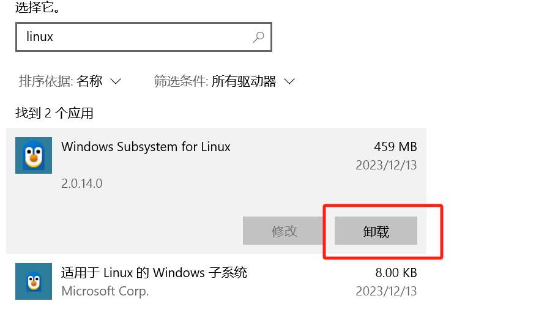
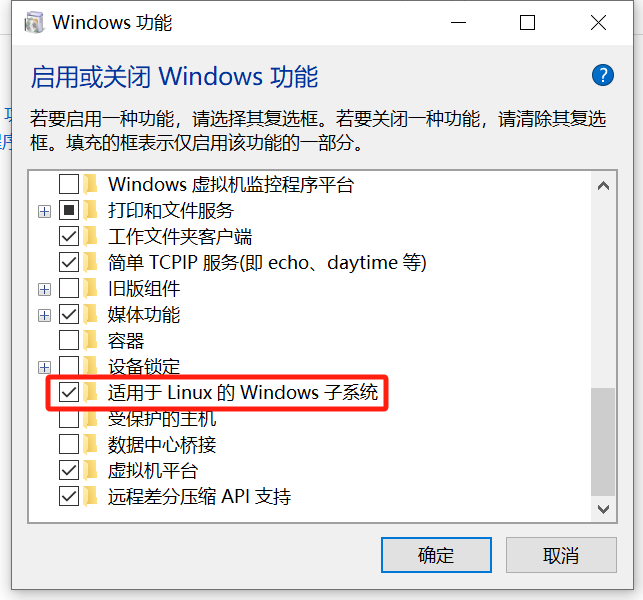

# 完全卸载wsl




重启后卸载完成。如果有其他和虚拟机相关的一律取消勾选


# 安装




重启操作系统


管理员权限powershell   执行命令

```
dism.exe /online /enable-feature /featurename:VirtualMachinePlatform /all /norestart
wsl --update
#多次执行wsl --update 直到提示以及是最新版本
```


重启操作系统后完成安装


安装完成


# 设置


## 导入导出

```
wsl --export [子系统] [保存地址]
wsl --export docker-desktop E:\wsl2\docker-desktop\docker-desktop.tar

wsl --import [子系统名称] [子系统存储路径] [子系统文件]
wsl --import docker-desktop  E:\wsl2\docker-desktop E:\wsl2\docker-desktop\docker-desktop.tar
```


## 删除子系统

```
wsl --unregister docker-desktop-data
```


## 设置默认用户

```
<wsl> config --default-user <username>
#例如  设置Ubuntu 20.04 启动后默认用户为root
ubuntu2004.exe config --default-user root
```


## 限制内存大小

在资源管理器的地址栏里 输入`C:\Users\YourUsername` , 查看是否有 .wslconfig 文件。 如果没有， 直接右键创建一个。

添加内容

```
[wsl2]
memory=3GB
```

