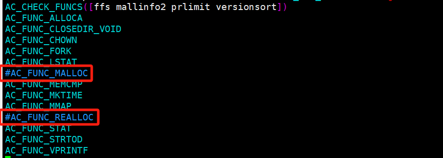

# 交叉编译lvm2


解压进入

```
root@luckfox:/opt/build# tar -xf lvm2-2_03_22.tar.gz 
root@luckfox:/opt/build# cd lvm2-2_03_22/
```


修改configure.ac

注释

```
AC_FUNC_MALLOC
AC_FUNC_REALLOC
```




安装工具

```
sudo apt-get install autoconf-archive
sudo apt-get install autoconf
sudo apt-get install automake
```


执行命令

```
autoreconf
```


预处理

```
../configure --host=arm-rockchip830-linux-uclibcgnueabihf --prefix=/soft/lvm2/ CFLAGS="-I/soft/libaio/include" LDFLAGS="-L/soft/libaio/lib" --disable-share
```


编译安装

```
make -j16
```


