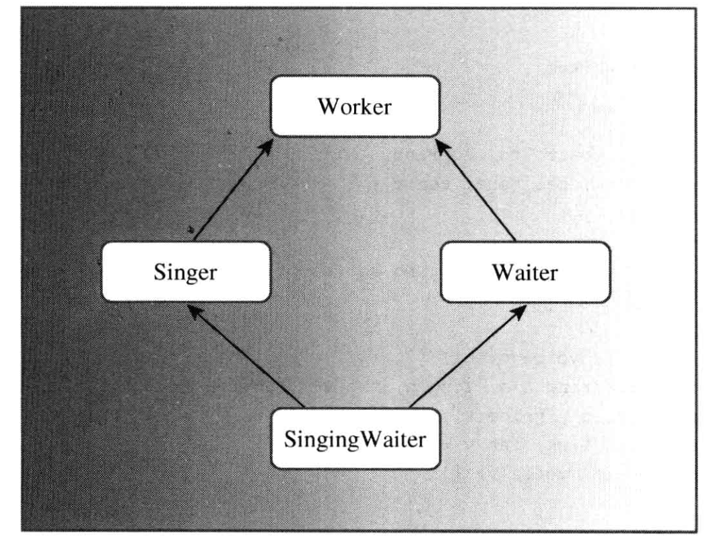
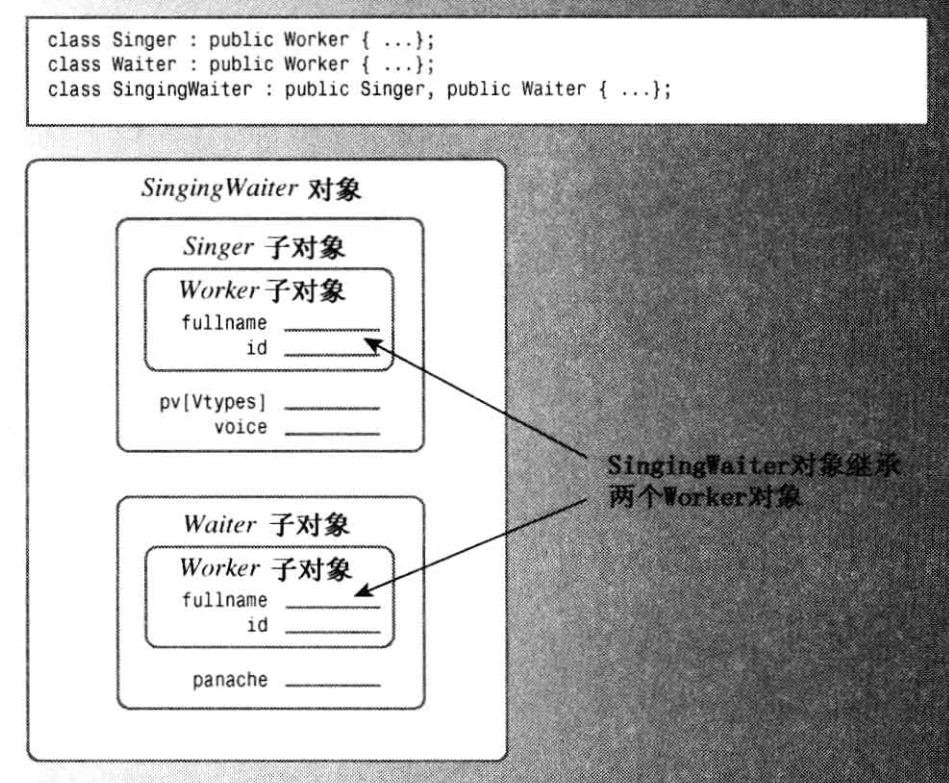

# string 类

`string`类是ISO/ANSI C++98标准的一部分，它提供了一种更简单、更安全的方式来处理字符串，相比于传统的字符数组。

`string`类位于名称空间`std`中，因此你需要使用`using`编译指令，或者使用`std::string`来引用它。


1. 你可以使用C风格字符串来初始化`string`对象。

    `string str = "Hello, World!";`

2. 你可以使用数组表示法来访问存储在`string`对象中的字符。

    `char c = str[0];`。

3. `string`对象可以声明为简单变量，而不是数组。

    `string str;`

4. 当你将输入读取到`string`对象中时，`string`对象会自动调整其大小以适应输入。


```C++
char first_date[] =		{"Le Chapon Dodu"};
char second_date[] =	{"The Elegant Plate"};
string third_date =		{"The Bread Bowl"};
string fourth_date		{"Hank's Fine Eats"}; //这里没有 = 
```


## 赋值、拼接和附加

1. **赋值**：在C++中，不能将一个数组赋给另一个数组，但可以将一个`string`对象赋给另一个`string`对象。例如：

```cpp
char charr1[20]; // 创建一个空数组
char charr2[20] = "jaguar"; // 创建一个初始化的数组
string str1; // 创建一个空的string对象
string str2 = "panther"; // 创建一个初始化的string对象

charr1 = charr2; // 无效，不允许数组赋值
str1 = str2; // 有效，允许对象赋值
```


1. **拼接和附加**：`string`类简化了字符串合并操作。你可以使用运算符`+`将两个`string`对象合并起来，也可以使用运算符`+=`将字符串附加到`string`对象的末尾。例如：

```cpp
string str3;
str3 = str1 + str2; // 将str1和str2拼接后赋值给str3
str1 += str2; // 将str2附加到str1的末尾
```


## 字符串输入与输出

暂略


## 其他形式的字符串字面值

除了`char`类型外，C++还有`wchar_t`类型，C++11新增了`char16_t`和`char32_t`类型，使用前缀`L`、`u`和`U`表示。

```C++
wchar_t title[] = L"Chief Astrogator"; // wchar_t string
char16_t name[] = u"Felonia Ripova"; // char16_t string
char32_t car[] = U"Humber Super Snipe"; // char32_t string
```


原始字符串是C++11新增的一种字符串类型。在原始字符串中，字符表示的就是自己。

例如，序列`\n`不表示换行符，而表示两个常规字符——斜杠和n。

因此在屏幕上显示时，将显示这两个字符。另一个例子是，可以在字符串中使用双引号`"`, 而无需像以前那样使用转义字符`\"`。

由于在原始字符串中可以包含双引号`"`, 因此不能再使用它来表示字符串的开头和末尾。因此，原始字符串使用`"(和)"`作为定界符，并使用前缀`R`来标识原始字符串。例如：

```cpp
cout << R"(Jim "King" Tutt uses "\n" instead of endl.)" << '\n';
```

这段代码将在屏幕上显示以下内容：

```cpp
Jim "King" Tutt uses "\n" instead of endl.
```


原始字符串使用`"(和)"`作为定界符，并使用前缀`R`来标识原始字符串。

如果要在原始字符串中包含`)"`，可以在表示字符串开头的`"`和`(`之间添加其他字符，这意味着表示字符串结尾的`"`和`)`之间也必须包含这些字符。


例如，使用`R"+*(`标识原始字符串的开头时，必须使用`)+*"`标识原始字符串的结尾。

```cpp
cout << R"+*("(Who wouldn't?)", she whispered.)+*" << endl;
```

它会在屏幕上显示以下内容：

```cpp
"(Who wouldn't?)", she whispered.
```


# 模板类vector

模板类`vector`是一种动态数组，类型于`string`，长度可以在运行阶段设置，可以在末尾附加新数据，也可以在中间插入新数据。

实际上，`vector`类使用`new`和`delete`来管理内存，但这种工作是自动完成的。


包含头文件`vector`，`vector`包含在名称空间`std`中，可以使用`using`编译指令：

```cpp
#include <vector>
using std::vector;
```


模板使用不同的语法来指出它存储的数据类型。

例如，`vector<int>`对象存储的是`int`类型的数据，`vector<double>`对象存储的是`double`类型的数据。

`vector<double> vd(n);`创建了一个包含`n`个`double`类型元素的`vector`对象。

插入或添加值时会自动调整长度，因此可以将`vector`对象的初始长度设置为零。

```cpp
std::vector<int> v;  // 创建一个空的vector

// 使用push_back()添加元素
// 此方法可以在末尾添加一个元素，同时vector的长度会自动增加1。
v.push_back(1);

// 使用pop_back()删除元素
// 此方法可以删除最后一个元素，同时vector的长度会自动减少1。
v.pop_back();

// 使用resize()设置长度
// 此方法可以直接设置vector的长度。
v.resize(5);
```


# 类模板array

`array`是一个模板类，它提供了一种更安全、更方便的方式来创建和使用固定长度的数组。

与传统的数组一样，`array`对象的长度是固定的，它使用栈（静态内存分配），而不是自由存储区，因此其效率与数组相同，但更方便，更安全。


要使用`std::array`，你需要包含头文件，并使用using指令：

```cpp
#include <array>
using std:array;


```


语法格式：`std::array<type, size> variable_name;`

其中`type`是元素的类型，`size`是数组的大小（元素的数量，此处不能为变量），`variable_name`是变量名。

```cpp
array<int,10> tc;
```


# 类高级操作


## 转换函数（to类）

只接受一个参数的构造函数可以作为转换函数。

例如，如果有一个类Stonewt，并且它有一个接受double类型参数的构造函数：

```cpp
Stonewt(double lbs);
```

用于将 double 类型的值转换为 Stonewt 类型：

```cpp
Stonewt myCat;
myCat = 19.6;
```

C++新增了关键字 explicit,用于关闭这种自动特性：

```cpp
explicit Stonewt(double lbs);
```

现在只能通过强制类型转换将double类型的值转换为Stonewt类型的对象：

```cpp
// 创建一个 Stonewt 对象
Stonewt myCat;

// 下面的代码将会报错，因为我们已经禁止了隐式转换
// myCat = 19.6;
// Stonewt myCat = 19.6;

// 显式强制类型转换，这是允许的
myCat = Stonewt(19.6);

// 旧式的显式类型转换，这也是允许的
myCat = (Stonewt)19.6;
```


如果在声明中使用了关键字explicit，则Stonewt(double)将只用于显式强制类型转换，否则还可以用于下面的隐式转换：

- 将 Stonewt对象初始化为 double 值时。
- 将 double 值赋给 Stonewt 对象时。
- 将 double 值传递给接受 Stonewt参数的函数时。
- 返回值被声明为 Stonewt的函数试图返回 double 值时。在上述任意一种情况下，使用可转换为double类型的内置类型时。


仅当转换不存在二义性时，才会进行这种二步转换。

如果这个类还定义了构造函数 Stonewt(long)，则编译器将拒绝这些语句，可能指出：int可被转换为long或 double，因此调用存在二义性。


以下情况也可以出现二义性：

```cpp
Time(int hour = 0, int minutes = 0);

Time(int hour_new);
```


如果给任意一个加上explicit关键字，就没有二义性了：

```cpp
explicit Time(int hour = 0, int minutes = 0);

Time(int hour_new);
```


## 转换函数

将用户自定义的类型，要转换为typeName 类型，需要使用这种形式的转换函数:

```cpp
operator typeName();
```

请注意以下几点：

- 转换函数必须是类方法（成员函数）；
- 转换函数不能指定返回类型；
- 转换函数不能有参数。

例如，转换为 double 类型的函数的原型如下:

```cpp
operator double();
```


二义性

假设定义了从Stonewt到double或int的类型转换：

```cpp
operator double(void);
operator int(void);
```


将Stonewt赋值long，int 和 double 值都可以被赋给 long 变量，存在二义性，编译器会报错：

```cpp
Stonewt temp;
long number = temp; // 非法的
long number = int(temp);		//合法
long number = long(temp);		//合法
```


假设现在没有为Stonewt重载<<运算符，需要转换为基类才能使用ostream进行输出：

cout既可以输出int，又可以输出double，也会出现二义性。

```cpp
Stonewt temp;
cout << temp << endl;				// 非法的
cout << int(temp) << endl;			//合法
cout << double(temp) << endl;		//合法
```


在下面的一个例子中，Stonewt会被转换为int，然后用于数组下标的索引：

```cpp
Stonewt temp;
int array[5];
cout << array[temp] << endl;
```


在 C++98 中，关键字 explicit 不能用于转换函数，但 C++11 消除了这种限制。有了声明后，需要强制转换时将调用这些运算符：

```cpp
Stonewt temp;
int number = temp;			// 非法
int number = int(temp);		// 合法
```


## 转换函数和友元函数

假设定义了Stonewt的加法重载函数，double转换到Stonewt以及Stonewt转换到double的函数。

```cpp
//以下两个加法重载只能存在一个
Stonewt operator+(const Stonewt & st) const {}
friend Stonewt operator+(const Stonewt & st1,const Stonewt & st2) const {}

// double 转换到 Stonewt
Stonewt(double floating);

// Stonewt 转换到 double
operator double(void) const;
```


如果使用了类成员运算符重载（非友元函数的运算符重载） 和 仅double转换到Stonewt的转换，以下是允许的：

```cpp
Stonewt tempSt1,SumSt;
double tempD;
SumSt = tempSt1 + tempD;
```


它会被转换为（虽然需要提供Stonewt类型的参数，但是有double到Stonewt的自动类型转换）：

```cpp
SumSt = tempSt1.operator+(tempD);
```


但如果将tempSt1和tempD的位置互换，则不行：

```cpp
SumSt = tempD + tempSt1;			// 非法
SumSt = Stonewt(tempD) + tempSt1;	// 合法
```

因为编译器不会将tempSt1（double）类型转换为Stonewt，在调用tempSt1的成员运算符重载函数，当然可以使用强制类型转换，显示的将double转换为Stonewt则可以。

但如果使用友元函数，则支持上面的操作，因为友元函数是先判断是否存在可以调用的函数，判断时发现tempD(double)可以自动转换为Stonewt。


当**double 转换到 Stonewt** 和 **Stonewt 转换到 double**同时存在，则会出现下面的问题：

```cpp
Stonewt tempSt1,SumSt;
double tempD;
SumSt = tempSt1 + tempD;
```

在第三条语法中，具有二义性，即：

将tempSt1转换为double与tempD进行编译器内置的double + double的操作。

将tempD转换为Stonewt，进行用户重载的Stonewt + Stonewt的操作。

以上两种都是可以的，但两者同时存在，所以编译器不会允许编译通过。


一种解决方法是，将**Stonewt 转换到 double**声明为explicit 关键字，然后在使用的时候进行强制类型转换。


如果只有在赋值的时候，才会使用到将**Stonewt 转换到 double**，则可以重载`赋值(=)`运算符。


# 类继承

可使用名为“继承”的机制从现有类派生新类。 用于派生的类称为特定派生类的“基类”。 使用以下语法声明派生类：

```c++
class Derived : [virtual] [access-specifier] Base
{
   // member list
};
class Derived : [virtual] [access-specifier] Base1,
   [virtual] [access-specifier] Base2, . . .
{
   // member list
};
```

在类的标记（名称）后面，显示了一个后跟基本规范列表的冒号。

冒号后面是访问修饰符，它是关键字 **`public`**、**`protected`** 或 **`private`** 之一，默认为**`private`**。用于控制派生类对于基类的权限。

可指定多个基类，并用逗号分隔。 如果指定了单个基类，则继承模型为**单一继承**。 如果指定了多个基类，则继承模型称为**多重继承**。


派生类不能直接访问基类的私有成员，而必须使用基类的公有方法来访问私有的基类成员。


## 派生类构造函数

派生类不仅要对新的成员进行初始化，还需要对基类成员进行初始化。初始化派生类的成员必须手动进行，而初始化基类成员，可以调用基类的构造函数（或赋值构造函数）：

```cpp
class user {

public:

	user(const string& newName = "", const unsigned int& newAge = 0) {

		user& object = *this;

		object.Name = newName;
		object.Age = newAge;

	}
	user(const char* newName, const unsigned int& newAge = 0) : user((string)(newName), newAge) { ; }


	user(const user& source);


private:

	string Name;
	int Age;

public:

};

//1. 将基类 user 派生一个 group 类型
class group : public user{

public:
	
	group(const string& newGroupName = "", const string& newName = "", const unsigned int& newAge = 0)
		: group(newGroupName, user(newName, newAge)) { ; }


	group(const char* newGroupName, const string& newName = "", const unsigned int& newAge = 0)
		: group((string)(newGroupName), user(newName,newAge)) { ; }
	
	//2. 派生类 group 构造函数，支持一个 user 基类的引用变量，调用 user 基类的赋值构造函数进行初始化
	group(const string& newGroupName, const user& newUser) : user(newUser){

		group& object = *this;

		object.groupName = newGroupName;

	}

private:
	
	string groupName;
	

public:

};
```


## 基类和派生类的关系

基类的引用和指向基类的指针，可以去引用或指向一个派生类对象，例如：

```C++
group tmpGroup;

user * tmpbase = & tmpGroup;
user & base = tmpGroup;
```

但这只是单项的，派生类的指针或引用，不能指向或引用一个基类对象。


由此可见，可以将一个派生类对象赋值给一个基类的对象，例如：

将派生类group赋值给基类user;

在基类user没有定义赋值构造函数的时候，默认存在一个user(const user & [标识符]);的赋值构造函数。

const user& 是可以引用一个 group 对象的。


is-a(is-a-kind-of)：描述某种事物是另一种事物的一种类型或种类

has-a：某种事物拥有或包含另一种事物

is-like-a：如果A “is-like-a” B，那么可以理解为A像B，但并不完全是B。

is-implemented-as-a：如果A “is-implemented-as-a” B，那么可以理解为A是通过B来实现的

user-a：如果类A “uses-a” 类B，那么可以理解为类A使用了类B。


## 虚函数

假设现在存在一个base基类，然后通过base基类派生出一个Derived派生类，然后这两个内中都存在一个同名的方法（函数）。

如果是是通过对象来进行访问，那么base对象调用base类中的方法，Derived对象调用Derived类中的方法。

```C++
#include <iostream>
#include <string>

using std::cout;
using std::endl;
using std::string;


class Base {

public:
	Base(const string& newBaseName = "");

	Base(const char* newBaseName) : Base((string)(newBaseName));

private:
	string BaseName;

public:
	void setName(const string& newBaseName);
	string getName(void) const;
	
};


class Derived : public Base {

public:
	Derived(const string& newDerivedName = "",const string & newBaseName = "") 
		: Base(newBaseName);
		
	Derived(const char* newDerivedName, const string newBaseName = "") 
		: Derived((string)(newDerivedName), newBaseName);

private:
	string DerivedName;

public:
	void setName(const string& newDerivedName);
	string getName(void) const;

};

```

```c++
Base a = "BaseName";
cout << a.getName() << endl; // Base::getName()
Derived b = "DerivedName";
cout << b.getName() << endl; // Derived::getName()
```


如果一个函数只在派生类中存在，那么你不能通过基类的引用或指针来调用它。

```C++
#include <iostream>
#include <string>

using std::cout;
using std::endl;
using std::string;


class Base {

public:
	// 假设基类中没有 getName函数
	// string getName(void) const;
	
};


class Derived : public Base {、

public:
    // getName函数仅在派生类中存在
	string getName(void) const;

};

```

```C++
Base a = "BaseName";
Derived b = "DerivedName";

Derived & P_Derived = b;
cout << p_base.getName() << endl; // Base::getName() 

Base & p_Base = a;
cout << p_base.getName() << endl; // 非法语句，Base中没有getName函数，无法调用Derived类中的getName函数
```


如果一个基类的函数被声明为`virtual`，那么在所有从这个基类派生出来的类中，（与）这个函数（同名）都会自动成为虚函数。

对以上代码的修改，只需要将Base类中部分修改为：

```cpp
class Base {
...

public:
	virtual void setName(const string& newBaseName);
	virtual string getName(void) const;

...
}
```


如果一个函数在基类和派生类中存在，但**未被**声明为虚函数，则通过指针或引用的类型来确定调用哪一个函数。

```c++
Base a = "BaseName";
Derived b = "DerivedName";

Base & p_Base = a;
cout << p_base.getName() << endl; // Base::getName()

Base & P_Derived = b;
cout << p_base.getName() << endl; // Base::getName() , 即使它指向的是一个Derived对象
```


如果一个函数在基类和派生类中存在，但**且被**声明为虚函数，则调用引用或指针所指向的对象类型的函数版本

```cpp
Base a = "BaseName";
Derived b = "DerivedName";

Base & p_Base = a;
cout << p_base.getName() << endl; // Base::getName()

Base & P_Derived = b;
cout << p_base.getName() << endl; // Derived::getName() , 根据引用的对象来调用函数，而不是引用的类型
```


## 虚函数重定义

如果一个虚函数在基类和派生类中的函数特征（即函数参数列表）不同，那么可以说在派生类中对这个虚函数进行了重定义。

如果在派生类中对基类的虚函数进行了重定义，那么编译器会自动隐藏基类中的虚函数，此时只能调用派生类中的虚函数，无法调用基类中的虚函数。


假设创建了如下所示的代码：

```cpp
class Dwelling {
public:
    virtual void showperks(int a) const;
};

class Hovel : public Dwelling {
public:
    virtual void showperks() const;
};

```


```cpp
Hovel test;
test.showperks(1);	// 错误
test.showperks();	// 正确
```


如果重新定义继承的方法，应确保与原来的原型完全相同。

如果返回类型是基类引用或指针，则可以修改为指向派生类的引用或指针（这种例外是新出现的），称为返回类型协变（covariance of return type）。

注意下面代码中 build 虚函数的返回值：

```cpp
class Dwelling
{
public :
    
    virtual Dwelling &build(int n);
};

class Hovel: public Dwelling
{
public :
    
    virtual Hovel &build(int n); 
};

```


如果基类声明被重载了，则应在派生类中重新定义所有的基类版本。

如果只重新定义一个版本，则另外两个版本将被隐藏，派生类对象将无法使用它们。

```cpp
class Dwelling
{
public :
    // three overloaded showperks()
    virtual void showperks(int a) const;
    virtual void showperks(double x) const;
    virtual void showperks() const;
};

class Hovel: public Dwelling
{
public :
    // three redefined showperks()
    virtual void showperks(int a) const;
    virtual void showperks(double x) const;
    virtual void showperks() const;
};
```


注意，如果不需要修改，则新定义可只调用基类版本：

```cpp
void Hovel::showperks() const
{
    Dwelling::showperks();
}
```


## 访问控制protected

protected于private类似，private只能被当前类的成员函数所访问，而protected类型可以被当前类以及派生类的成员所访问。

对于类的外部，protected具有相同的特性。

对于类数据成员，最好采用私有访问控制，不要使用保护访问控制，同时通过基类方法使派生类能够访问基类数据。

对于类成员函数，保护访问控制很有用，它让派生类能够访问公众不能使用的内部函数。


## 纯虚函数

在C++中，**抽象基类**和**纯虚函数**是面向对象编程的重要概念。

**抽象基类**（Abstract Base Class，ABC）是一种只能用作基类的类，不能实例化。这种类的主要目的是为派生类提供一个公共的接口。抽象基类至少包含一个纯虚函数。

```cpp
class AbstractClass {
public:
    // 纯虚函数
    virtual void pureVirtualFunction() = 0;
};
```


**纯虚函数**（Pure Virtual Function）是在基类中声明的虚函数，它在基类中没有定义，但要求任何派生类必须定义。纯虚函数是通过在声明中赋值0来指定的。

```cpp
virtual void pureVirtualFunction() = 0;
```

可以选择在基类中为纯虚函数提供定义：

```cpp
class AbstractClass {
public:
    // 纯虚函数
    virtual void pureVirtualFunction() = 0;
};

void AbstractClass::pureVirtualFunction(){

	// ... 代码定义 ... 

}
    
```


如果一个类包含一个或多个纯虚函数，那么这个类就是抽象基类。派生类必须实现所有的纯虚函数，否则它也将成为抽象基类。

```cpp
class DerivedClass : public AbstractClass {
public:
    // 必须实现的纯虚函数
    void pureVirtualFunction() override {
        // 具体实现
    }
};
```


## 继承和动态内存分配

当基类和派生类都采用动态内存分配时，派生类的析构函数、复制构造函数、赋值运算符都必须使用相应的基类方法来处理基类元素。

对于析构函数，这是自动完成的。

```cpp
baseDMA::~baseDMA() // takes care of baseDMA stuff
{
    delete []label;
}

hasDMA::~hasDMA() // takes care of hasDMA stuff
{
    delete []style;
}

```

对于构造函数，这是通过在初始化成员列表中，调用基类的复制构造函数来完成的；如果不这样做，将自动调用基类的默认构造函数。

```cpp
baseDMA::baseDMA(const baseDMA &rs)
{
    label = new char[std::strlen(rs.label) + 1];
    std::strcpy(label, rs.label);
    rating = rs.rating;
}

hasDMA::hasDMA(const hasDMA &hs) : baseDMA(hs)
{
    style = new char[std::strlen(hs.style) + 1];
    std::strcpy(style, hs.style);
}

```

对于赋值运算符，这是通过使用作用域解析运算符显式地调用基类的赋值运算符来完成的。

```cpp
baseDMA & baseDMA::operator=(const baseDMA & rs)
{
    if (this == &rs)
        return *this;
    delete []label;
    label = new char[std::strlen(rs.label) + 1];
    std::strcpy(label, rs.label);
    rating = rs.rating;
    return *this;
}

hasDMA & hasDMA::operator=(const hasDMA &hs)
{
    if(this == &hs)
        return *this;
    baseDMA::operator=(hs); // copy base portion
    delete []style; // prepare for new style
    style = new char[std::strlen(hs.style) + 1];
    std::strcpy(style, hs.style);
    return *this;
}

```


## 派生类访问基类友元函数

派生类的友元函数可以直接访问派生类的私有成员，所以可以直接进行cout输出，但是无法直接访问基类的私有成员，只能通过访问基类的友元函数。

派生类如何使用基类的友元，因为友元不是成员函数，所以不能使用作用域解析运算符来指出要使用哪个函数，可以使用强制类型转换。

```cpp
//基类的友元函数
std::ostream &operator<<(std::ostream &os, const baseDMA & rs)
{
    os << "Label: " << rs.label << std::endl;
    os << "Rating: " << rs.rating << std::endl;
    return os;
}

```

```cpp
//派生类的友元函数
std::ostream & operator<<(std::ostream & os, const hasDMA &rs)
{
    os << (const baseDMA &)hs;
    // 上面的代码将会被转换为：
    // operator(os,(const baseDMA&)hs);
	// 也可以直接使用 这种方法 暂未验证
    
    os << "Style: " << hs.style << std::endl;
    return os;
}

```


## 各种继承方式


## 使用私有继承


### 1. 初始化基类组件

使用私有继承，在构造函数的初始化列表中，应该使用私有基类的类名来对基类进行构造。

```C++
class Student : private std::string{

public:

	Student(const & std::string Name) : std::string(Name);
	Student(const char * Name) : std::string(Name);

}
```


### 2. 访问基类的方法

私有继承使得能够使用类名和作用域解析运算符来调用基类的方法

```C++
class Student : private std::string {

public:
	
	size_t len(void){
	
		//调用string基类中的size方法
		//类似于 string a; a.size();
		return std::string::size();
	
	}	

}
```


### 3. 访问基类对象

由于 Student 类是从 string 类派生而来的，因此可以通过强制类型转换，将Student 对象转换为 string 对象;结果为继承而来的string对象。

指针 this 指向用来调用方法的对象，因此*this 为用来调用方法的对象，在这个例子中，为类型为 Student 的对象。

为避免调用构造函数创建新的对象，可使用强制类型转换来创建一个引用。

```C++
const string & Student::Name() const
{

	return (const string & ) *this;

}
```


### 4. 访问基类友元函数

可以通过显式地转换为基类来调用正确的函数：

```C++
ostream & operator<<(ostream & os,const Student & stu)
{
	os << "Scores for" << (const string &) stu << ":\n";
}
```

显式地将 stu 转换为 string对象引用，进而调用函数 operator<<(ostream &,const String &)。


引用 stu 不会自动转换为 string引用。根本原因在于,在私有继承中,在不进行显式类型转换的情况下,不能将指向派生类的引用或指针赋给基类引用或指针。

另一个原因是，由于这个类使用的是多重继承，编译器将无法确定应转换成哪个基类，如果两个基类都提供了函数 operator<<( )。


## 使用using重新定义访问权限

使用一个usimg声明(就像名称空间那样)，来指出派生类可以使用特定的基类成员，即使采用的是私有派生。

假如希望Student类直接使用string类中的size函数。

```cpp
class Student : private std::string {

public:

	using std::string::size;

}
```

注意，using声明只使用成员名——圆括号、函数特征标和返回类型。引入一个函数，会引入它的所有重载版本（如果有的话）。


# 多重继承



假设首先从 Singer和 Waiter 公有派生出 SingingWaiter。

因为 Singer 和 Waiter 都继承了一个 Worker 组件，因此 SingingWaiter 将包含两个 Worker 组件。


例如，通常可以将派生类对象的地址赋给基类指针，但现在将出现二义性：

```cpp
SingingWaiter ed;
Worker *pw=&ed;
```


通常，这种赋值将把基类指针设置为派生对象中的基类对象的地址。

但ed中包含两个 Worker 对象有两个地址可供选择，所以应使用类型转换来指定对象：



```cpp
Worker *pwl=(Waiter *)&ed;
Worker *pw2=(Singer *)&ed;
```


### 1. 虚基类

虚基类使得从多个类(它们的基类相同)派生出的对象只继承一个基类对象。例如，通过在类声明中使用关键字 virtual，可以使 Worker 被用作 Singer 和 Waiter 的虚基类(virtual和 public 的次序无关紧要)：

```cpp
class Singer : virtual public Worker { ... };
class Waiter : public virtual Worker { ... };
```


然后，可以将 SingingWaiter 类定义为：

```cpp
class SingerWaiter : public singer , public waiter { ... }; 
```

现在，SingingWaiter 对象将只包含 Worker 对象的一个副本。从本质上说，继承的 Singer 和 Waiter 对象共享一个 Worker 对象，而不是各自引入自己的 Worker 对象副本。


### 2. 虚基类构造函数

使用虚基类时，需要对类构造函数采用一种新的方法。对于非虚基类，唯一可以出现在初始化列表中的构造函数是即时基类构造函数。但这些构造函数可能需要将信息传递给其基类。


1. C类的构造函数只能调用B类的构造函数，而B类的构造函数只能调用A类的构造函数。
2. 这里，C类的构造函数使用值 q，并将值m和n传递给B类的构造函数;
3. 而B类的构造函数使用值m，并将值n传递给 A 类的构造函数。


```cpp
class A {
    int a;
public:
    A(int n=0):a(n){}
};

class B:public A {
    int b;
public:
    B(int m=0, int n=0):A(n), b(m){}
};

class C:public B {
    int c;
public:
    C(int q=0, int m=0, int n=0):B(m, n), c(q){}
};
```


在C++中，如果一个类有虚基类，自动传递信息时，将通过2条不同的途径(Waiter和Singer)将wk传递给 Worker 对象。为避免这种冲突，C++在基类是虚的时，禁止信息通过中间类自动传递给基类。

```cpp
SingingWaiter(const Worker &wk, int p=0, int v=Singer::other)
: Waiter(wk, p), Singer(wk, v) {} // flawed
```


在构造函数中，必须显式地调用虚基类的构造函数。如果不这样做，编译器将使用虚基类的默认构造函数：

```cpp
SingingWaiter(const Worker &wk, int p=0, int v=Singer::other)
: Worker(wk), Waiter(wk, p), Singer(wk, v) {}

```


### 3. 成员函数

如果一个类从多个基类继承了同名的成员函数，那么在派生类中直接调用这个函数会产生二义性。

为了解决这个问题，可以使用作用域解析运算符来指定调用哪个基类的成员函数。例如，`newhire.Singer::Show();` 就是调用 `Singer` 类的 `Show()` 函数。


更好的做法是在派生类中重新定义这个函数，并在函数内部明确调用需要的基类函数：

```cpp
void SingingWaiter::Show() {
    Singer::Show();
    Waiter::Show();
}
```

`SingingWaiter` 类的 `Show()` 函数就会先调用 `Singer` 类的 `Show()` 函数，然后再调用 `Waiter` 类的 `Show()` 函数。

这样做可能会导致一些信息被重复显示，因为 `Singer::Show()` 和 `Waiter::Show()` 都可能会调用 `Worker::Show()`。


可以将 `Show()` 函数分解为多个部分，每个部分只显示一部分信息，然后在派生类中组合这些部分。

```cpp
void Worker::Data() const {
    cout << "Name: " << fullname << "\n";
    cout << "Employee ID: " << id << "\n";
}

void Waiter::Data() const {
    cout << "Panache rating: " << panache << "\n";
}

void Singer::Data() const {
    cout << "Vocal range: " << pv[voice] << "\n";
}

void SingingWaiter::Data() const {
    Singer::Data();
    Waiter::Data();
}

void SingingWaiter::Show() const {
    cout << "Category: singing waiter\n";
    Worker::Data();
    Data();
}
```


### 4. 如何理解虚基类

1. 基类本身无法决定是否成为虚基类，这是由派生类决定的。
2. 派生类可以使用`virtual`关键字来声明其基类，这表明该基类可以被多个派生类共享。
3. 如果一个派生类从多个基类继承，且这些基类中有两个或更多的相同的间接虚基类，那么这个虚基类将会被共享。


例子：

1. 有一个基类`A`
2. 三个派生类`B1`、`B2`和`B3`，它们都继承自`A`
3. `B1`和`B2`将`A`声明为虚基类，而`B3`则直接继承`A`。
4. 派生类`C`，它继承自`B1`、`B2`和`B3`。
5. `C`会有两个`A`基类的实例，其中一个`A`实例是由`B1`和`B2`共享的（因为它们将`A`声明为虚基类），另一个`A`实例则是由`B3`独享的（因为`B3`直接继承`A`）


### 5. 成员优先级

一个成员名如何优先于另一个成员名？派生类中的名称优先于直接或间接祖先类中的相同名称。

例1：

1. 基类A由omg函数
2. 派生类B继承基类A，派生类B定义了自己的omg函数
3. 派生类C继承派生类B，如果在派生类C中调用omg函数，则调用派生类B的omg函数，而不是基类A中的omg函数
4. 如果派生类C也定义了自己的omg函数，则直接调用自身的omg函数。


例2：

1. 基类A由omg函数
2. 派生类B1和B2分别继承基类A，派生类B1和B2分别定义了自己的omg函数
3. 派生类C继承派生类B1和B2，如果在派生类C中调用omg函数，则产生二义性。
4. 如果派生类C定义了自己的omg函数，则直接调用自身的omg函数。


