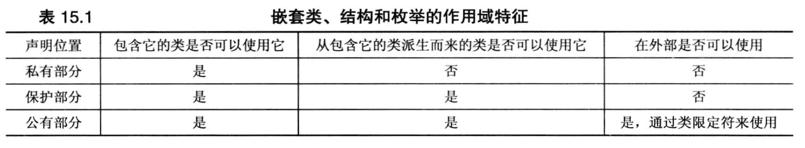

# 模板类

## 1.模板类的定义

```
template <class Type>
template <typename Type>
```

- 关键字template表示要定义一个模板。
- class表明Type是一个通用的类型说明符，可以用typename替代。
- Type指的是泛行名，当模板被调用时将被具体的类型值取代。（如：int、string）


## 2. 模板类方法定义

```
void classname<Type>::Fun(Type & n);
```

如果在类声明中定义方法（内联定义），则可以省略模板前缀和类型限定符

```
void Fun(Type & n);
```


模板的具体实现——如用来处理int对象——被称之为实例化或具体化。

不能将模板成员函数放在独立的实现文件(.c)中，最简单的方法是将所有模板信息放在同一个头文件中。


## 3. 使用模板类

仅包含模板并不能生成模板类，必须请求实例化，也就是声明一个类型为模板类的对象。

```cpp
template <class T>
class Stack {
	//...
}

//...

Stack<int> x;
Stack<double> King;
```

以上将会生成两个独立的类声明和两组独立的方法

- 类声明`Stack<int>`将使用int类型替换模板中所有的Type
- 类声明`Stack<double>`将使用double类型替换模板中的所有double
- `Stack<Type>` 泛行标识符（这里为Type）称为“类型参数”，类似于变量，只能赋给类型。


注意：必须显式地提供所需的类型，这与常规的函数模板是不同的，因为编译器可以根据函数的参数类型来确定要生成哪种函数:


## 4. 非类型参数

`int n`指出n的类型为int，这种参数（指定特定的类型，而不是用泛型名）称之为**非类型**或**表达式**参数。

可以为类模板的泛型设置默认值。

不可以为函数模板的泛型设置默认值。

可以为类模板和函数模板的非类型参数设置默认值。

```cpp
template <class T = double,int n =10>
class Stack {
	
private:
	T array[n];
}

//...

Stack<int,20>;
Stack<>;
```


浮点模板是非标准的，下面的代码是非法的。

```cpp
template<double v>
class Double {

	T x;
};
```


Stack构造函数中的三条语句都是非法的。

不能修改参数的值。

不能使用参数的地址。

```cpp
template <int n>
class Stack {
	
private:
	Stack(void){
	
		//n = 10;
		//n++;
		//int *p = &n;
	
	}
}
```


非类型模板参数的主要缺点是，每种数组大小都将生成自己的模板。也就是说，下面的声明将生成两个独立的类声明：

```cpp
ArrayTP<double, 12> eggweights;
ArrayTP<double, 13> donuts;
```


但下面的声明只生成一个类声明，并将数组大小信息传递给类的构造函数：

```cpp
Stack<int> eggs(12);
Stack<int> dunkers(13);
```

这就是说，`ArrayTP<double, 12>`和`ArrayTP<double, 13>`是两个完全不同的类型，即使它们的元素类型（`double`）是相同的。因为在模板实例化时，非类型参数的每个不同值都会生成一个新的模板实例。


### 5. 模板的多功能性


#### 5.1 模板的递归

归使用模板：另一个模板多功能性的例子是，可以递归使用模板。

例如，对于前面的数组模板定义，可以这样使用它:

```cpp
ArrayTP< ArrayTP<int,5>,10> twodee;
```


这使得twodee 是一个包含 10个元素的数组,其中每个元素都是一个包含5个`int`元素的数组。与之等价的常规数组声明如下:

```cpp
int twodee[10][5];
```


请注意，在模板语法中，维的顺序与等价的二维数组相反。


#### 5.2 使用多个类型参数

```cpp
//pairs.cpp-- defining and using a Pair template
#include <iostream>
#include <string>
template<class T1, class T2>
class Pair {
private:
    
    T1 a;
    T2 b;
    
public:
    T1 & first(void) { return a; }
    T2 & second() { return b; }
};

int main(void){
    
    Pair<int,double> p1;
    
    p1.first() = 15;
    p2.second() = 15.5;
    
    return 0;
    
}
```


## 6. 具体化

### 6.1 隐式实例化

```
ArrayTP<int,100> stuff; 
```


编译器在需要对象之前，不会生成类的隐式实例化。

```
ArrayTP<double,30>* pt; //指针
```


第二条语句导致编译器生成类定义，并根据该定义创建一个对象。

```
pt = new ArrayTP<double,30>; // 现在需要一个对象。
```


### 6.2 显示实例化

当使用关键字 `template` 并指出所需类型来声明类时，编译器将生成类声明的显式实例化(explicit instantiation)。

声明必须位于模板定义所在的名称空间中。

例如，下面的声明将 `ArrayTP<string,100>` 声明为一个类：

```cpp
template class ArrayTP<string,100>; // 生成 ArrayTP<string,100> 类。
```


在这种情况下，虽然没有创建或提及类对象，编译器也将生成类声明(包括方法定义)。

隐式实例化一样，也将根据通用模板来生成具体化。


### 6.3 显示具体化

显式具体化(explicit specialization)是特定类型(用于替换模板中的泛型)的定义。

有时候，可能需要在为特殊类型实例化时，对模板进行修改，使其行为不同。


如果 `T` 表示一种类，则只要定义了 `T::operator>()` 方法，就可以为所有类型进行排序。

不过对于char*类型时，这要求类定义使用 `strcmp()`，而不是 `>` 来对值（地址）进行比较。


具体化类模板定义的格式如下：

```cpp
template <> class Classname<specialized-type-name> {...};
```


提供一个专供 `const char *` 类型使用的 `SortedArray` 模板，可以使用类似于下面的代码：

```cpp
template<> class SortedArray<const char *>
{
    // details omitted
}
```


当请求 `const char *` 类型的 `SortedArray` 模板时，编译器将使用上述专用的定义，而不是通用的模板定义：

```cpp
// 使用通用定义
SortedArray<int> scores;
// 使用专用定义
SortedArray<const char *> dates;
```


### 6.4 部分具体化

C++还允许部分具体化(partial specialization)，即部分限制模板的通用性。

例如，部分具体化可以给类型参数之一指定具体的类型：


通用模板

```cpp
template<class T1, class T2> class Pair {...};
```


T2 设置为 int 的特化

```cpp
template <class T1> class Pair<T1, int> {...};
```


关键字 `template` 后面的尖括号声明的是没有被具体化的类型参数。

因此，上述第二个声明将 `T2` 具体化为 `int`，但 `T1` 保持不变。

注意，如果指定所有的类型，则尖括号将为空，这将导致显式具体化：

```cpp
// T1 和 T2 都设置为 int 的特化
template <> class Pair<int, int> {...};
```


如果有多个模板可供选择，编译器将使用具体化程度最高的模板。给定上述三个模板，情况如下：

```cpp
Pair<double, double> p1; // 使用通用 Pair 模板
Pair<double, int> p2; // 使用 Pair<T1, int> 部分特化
Pair<int, int> p3; // 使用 Pair<int, int> 显式特化
```


通过为指针提供特殊版本来部分具体化现有的模板：

```cpp
template<class T>
// 通用版本
class Feeb {...};
template<class T*>
// 指针部分特化
class Feeb {...};
```


如果提供的类型不是指针，则编译器将使用通用版本；如果提供的是指针，则编译器将使用指针具体化版本：

```cpp
Feeb<char> fb1; // 使用通用 Feeb 模板，T 是 char
Feeb<char *> fb2; // 使用 Feeb<T*> 特化，T 是 char
```


如果没有进行部分具体化，则第二个声明将使用通用模板，将 `T` 转换为 `char *` 类型。如果进行了部分具体化，则第二个声明将使用具体化模板，将 `T` 转换为 `char`。

部分具体化特性使得能够设置各种限制。例如，可以这样做：

```cpp
// 通用模板
template <class T1, class T2, class T3> class Trio {...};
// T3 设置为 T2 的特化
template <class T1, class T2> class Trio<T1, T2, T2> {...};
// T3 和 T2 都设置为 T1* 的特化
template <class T1> class Trio<T1, T1*, T1*> {...};
```


给定上述声明，编译器将作出如下选择：

```cpp
Trio<int, short, char *> t1; // 使用通用模板
Trio<int, short, short> t2; // 使用 Trio<T1, T2, T2> 特化
Trio<char, char *, char *> t3; // 使用 Trio<T1, T1*, T1*> 特化
```


## 7. 成员模板

```cpp
#include <iostream>
using std::cout;
using std::endl;

template <typename T>
class beta {
private:
    
    template <typename V> // nested template class member class hold
    class hold {
    private:
        V val;
    public:
        hold(V v = 0): val(v) {}
        void show() const { cout << val << endl; }
        V Value() const { return val; }
    };
    
    hold<T> q; // template object
    hold<int> n; // template object
    
public:
    beta(T t, int i): q(t), n(i) {}
    
    template<typename U> // template method
    U blab(U u, T t) { return (n.Value() + q.Value()) * u / t; }

};

int main(void){
    
    beta<double> guy(3.5, 3);

    cout << guy.blab(10, 2.3) << endl;		// cout1
    
    cout << guy.blab(10.0, 2.3) << endl;	// cout2
    
    return 0;
}
```

`hold`模板是在`beta`类的私有部分声明的，因此只能在`beta`类中访问它。

`beta`类使用`hold`模板声明了两个数据成员：`hold<T> q`和`hold<int> n`。


在`main()`函数中，下述声明使得`T`表示的是`double`，因此`q`的类型为`hold<double>`：

```cpp
beta<double> guy(3.5, 3);
```


`blab()`方法的`U`类型由该方法被调用时的参数值显式确定，`T`类型由对象的实例化类型确定。

这个例子中，`guy`的声明将`T`的类型设置为`double`。


cout1 中调用的第一个参数将`U`的类型设置为`int`（参数10对应的类型）：

```cpp
cout << guy.blab(10, 2.3) << endl;		// cout1
```

虽然混合类型引起的自动类型转换，导致`blab()`中的计算以`double`类型进行，但返回值的类型为`U`（即`int`），因此它被截断为28。


cout1 中调用的第一个参数将`U`的类型设置为`double`（参数10.0对应的类型）：

```cpp
cout << guy.blab(10.0, 2.3) << endl;	// cout2
```

这使得返回类型为`double`，因此输出为28.2608。


可以在`beta`模板中声明`hold`类和`blab`方法，并在`beta`模板的外面定义它们：

```cpp
// member definition
template <typename T>
template <typename U>
U beta<T>::blab(U u, T t) { return (n.Value() + q.Value()) * u / t; }
```

上述定义将`T`、`V`和`U`用作模板参数。因为模板是嵌套的，因此必须使用下面的语法：

```cpp
template <typename T>
template <typename V>
```

而不能使用下面的语法：

```cpp
template<typename T, typename V>
```

定义还必须指出`hold`和`blab`是`beta<T>`类的成员，这是通过使用作用域解析运算符来完成的。


## 8. 将模板用作参数

```cpp
#include <iostream>

using std::cout;
using std::endl;

template<class T>
class value {
	
	T number;

public:

	value(int number = 0) : number(number) {
		;
	}

	void show(void) {
		cout << number << endl;
		return;
	}
	
	T& valueGet(void) {
		return number;
	}
};

template<template<class T> class Thing>
class Crab {

private:

	Thing<int> v1;
	Thing<double> v2;

public:

	Crab(int v1 = 0, int v2 = 0) : v1(v1),v2(v2) {
		;
	}

	void set(int v1, int v2) {
	
		Crab<Thing>& object = *this;
		
		object.v1.valueGet() = v1;
		object.v2.valueGet() = v2;

		return;
	}
	
	void show(void) {
			
		Crab<Thing>& object = *this;
		
		object.v1.show();
		object.v2.show();

		return;
	}
};


int main(void) {

	Crab<value> x(1, 3.0);

	x.show();

	x.set(5, 10.0);

	x.show();

	return 0;
}
```

模板可以包含类型参数(如typenameT)和非类型参数(如int n)。

模板还可以包含本身就是模板的参数，这种参数是模板新增的特性，用于实现 STL。

```cpp
template <template <typename T>class Thing>
class Crab
```


模板参数是 `template <typename T> class Thing`，其中 `template <typename T> class` 是类型，`Thing` 是参数。这意味着什么呢？假设有下面的声明：

```cpp
Crab<King> legs;
```


为使上述声明被接受，模板参数 `King` 必须是一个模板类，其声明与模板参数 `Thing` 的声明匹配：

```cpp
template <typename T>
class King {
    // ...
};
```


`Crab`的声明声明了两个对象：`Thing<int> vl;` 和 `Thing<double> v2;`。

前面的 `Crab<value> x(1, 3.0)` 声明将用 `value<int>` 替换 `Thing<int>`，用 `value<double>` 替换 `Thing<double>`。

`Thing<int>`将被实例化为` value<int>`，而 `Thing<double>`将被实例化为 `value<double>`。

模板参数 Thing 将被替换为声明 Crab 对象时被用作模板参数的模板类型。


Crab 类的声明对 Thing 代表的模板类做了另外2个假设，即这个类包含一个show( )方法，包含一个 valueGet()方法，且这些方法有特定的接口。Crab类可以使用任何与Thing类型声明匹配,并包含方法 show()和 valueGet()的模板类。


可以混合使用模板参数和常规参数，例如，`Crab`类的声明可以像下面这样打头:

```cpp
template <template <typename T> class Thing, typename U, typename V>
class Crab {
    // ...
    private :
    Thing<U> s1;
    Thing<V> s2;
};
```


现在，成员`s1`和`s2`可存储的数据类型为泛型，而不是用硬编码指定的类型。这要求将程序中 `nebula`的声明修改成下面这样:

```cpp
Crab<value, int, double> nebula; // T=value，U=int，V=double
```

模板参数 `T`表示一种模板类型，而类型参数`U`和`V`表示非模板类型。


## 9.模板类和友元

模板类声明也可以有友元。模板的友元分3类:

- 非模板友元
- 约束(bound)模板友元，即友元的类型取决于类被实例化时的类型
- 非约束(unbound)模板友元，即友元的所有具体化都是类的每一个具体化的友元。


### 9.1 模板类的非模板友元函数

在模板类中将一个常规函数声明为友元:

```cpp
template <class T>
class HasFriend {
public :
    friend void counts(void); // friend to all HasFriend instantiations
};
```

上述声明使 `counts()` 函数成为模板所有实例化的友元。例如，它将是类 `HasFriend<int>` 和 `HasFriend<string>` 的友元。`counts()` 函数不是通过对象调用的(它是友元，不是成员函数)，也没有对象参数。

它如何访问 `HasFriend` 对象，它可以访问全局对象；可以使用全局指针访问非全局对象；可以创建自己的对象；可以访问独立于对象的模板类的静态数据成员。


不能通过以下方法为友元函数提供模板类参数：

```cpp
friend void report(HasFriend &);
```


原因是不存在 `HasFriend` 这样的对象。

只有特定的具体化，如 `HasFriend<short>`。

要提供模板类参数，必须指明具体化。例如，可以这样做:

```cpp
template <class T>
class HasFriend {
    friend void report(HasFriend<T>&); // bound template friend
};
```


为理解上述代码的功能，想想声明一个特定类型的对象时，将生成的具体化:`HasFriend<int> hf;` 

编译器将用 `int` 替代模板参数 `T`，因此友元声明的格式如下:

```cpp
class HasFriend<int> {
    friend void report(HasFriend<int>&); // bound template friend
};
```


带 `HasFriend<int>` 参数的 `report()` 将成为 `HasFriend<int>` 类的友元。

带 `HasFriend<double>` 参数的 `report()` 将是  `HasFriend<double>` 类的友元。

这些都是`report()` 的一个重载版本，`report()` 本身并不是模板函数，而只是使用一个模板作参数。

这意味着必须为要使用的友元定义显式具体化：

```cpp
void report(HasFriend<short>&) {...};
void report(HasFriend<int>&) {...};
```


### 9.2 模板类的约束模板友元函数


在类定义的前面声明每个模板函数。

```cpp
template <typename T> void counts();
template <typename T> void report(T &);
```


在函数中再次将模板声明为友元。这些语句根据类模板参数的类型声明具体化：

```cpp
template <typename TT>
class HasFriendT {
    // ...
    friend void counts<TT>();
    friend void report<>(HasFriendT<TT> &);
};
```


声明中的 `<>` 指出这是模板具体化。

对于 `report()`，`<>` 可以为空，因为可以从函数参数推断出如下模板类型参数: `HasFriendT<TT>`。

然而，也可以使用：

```cpp
report<HasFriendT<TT> >(HasFriendT<TT>&)
```


假设声明了这样一个对象:

```cpp
HasFriendT<int> squack;
```


编译器将用 `int` 替换 `TT`，并生成下面的类定义:

```cpp
class HasFriendT<int> {
    friend void counts<int>();
    friend void report<>(HasFriendT<int>&);
};
```

基于 `TT` 的具体化将变为 `int`，基于 `HasFriend<TT>` 的具体化将变为 `HasFriend<int>`。

模板具体化 `counts<int>()` 和 `report<HasFriendT<int> >()` 被声明为 `HasFriendT<int>` 类的友元。


`count()` 函数调用没有可被编译器用来推断出所需具体化的函数参数，所以这些调用使用 `count<int>()` 和 `count<double>()` 指明具体化。

`report()` 调用，编译器可以从参数类型推断出要使用的具体化。使用 `<>` 格式也能获得同样的效果：

```cpp
HasFriendT<int> oj1;
HasFriendT<double> oj2;

counts<int>();
counts<double>();

report(oj1);		// oj1的类型为HasFriendT<int>
report<int>(oj1);	// 所以调用report<int>()

report(oj1);		// oj2的类型为HasFriendT<double>
report<double>(oj1);// 所以调用report<double>()
```


### 9.3 模板类的非约束模板友元函数

程序清单14.24 `manyfrnd.cpp`

```cpp
//manyfrnd.cpp-unbound template friend to a template class
#include <iostream>
using std::cout;
using std::endl;

template <typename T>
class ManyFriend {
private :
    T item;
public:
    ManyFriend(const T& i): item(i) {}
    template <typename C,typename D> friend void show2(C &,D &);
};

template <typename C,typename D>
void show2(C &c,D & d) {
    cout << c.item << "," << d.item << endl;
}

int main() {
    ManyFriend<int> hfi1(10);
    ManyFriend<int> hfi2(20);
    ManyFriend<double> hfdb(10.5);
    cout << "hfi1,hfi2:";
    show2(hfi1,hfi2);
    cout << "hfdb,hfi2:";
    show2(hfdb,hfi2);
    return 0;
}
```


约束模板友元函数中`int` 类具体化获得 `int` 函数具体化，依此类推。

通过在类内部声明模板，可以创建非约束友元函数，即每个函数具体化都是每个类具体化的友元。


对于非约束友元，友元模板类型参数与模板类类型参数是不同的：

```cpp
template <typename T>
class ManyFriend {
    // ...
    template <typename C,typename D> friend void show2(C &, D &);
};
```


程序清单 14.24 是一个使用非约束友元的例子。其中，函数调用 `show2(hf1，hf2)` 与下面的具体化匹配:

因为它是所有 `ManyFriend` 具体化的友元，所以能够访问所有具体化的 `item` 成员，但它只访问了 `ManyFriend<int>` 对象。

```cpp
void show2<ManyFriend<int>&,ManyFriend<int>&>
(ManyFriend<int>&c,ManyFriend<int>&d);
```


`show2(hfd,hf2)` 与下面具体化匹配：

它也是所有 `ManyFriend` 具体化的友元，并访问了 `ManyFriend<int>` 对象的 `item` 成员和 `ManyFriend<double>` 对象的 `item` 成员。

```cpp
void show2<ManyFriend<double>&，ManyFriend<int>&>
(ManyFriend<double>&c，ManyFriend<int>&d);
```


## 10. 模板别名

如果能为类型指定别名，将很方便，在模板设计中尤其如此。可使用typedef为模板具体化指定别名:

```cpp
// 定义三个typedef别名
typedef std::array<double,12> arrd;
typedef std::array<int,12> arri;
typedef std::array<std::string,12> arrst;
arrd gallons; // gallons是类型std::array<double,12>
arri days; // days是类型std::array<int,12>
arrst months; // months是类型std::array<std::string,12>
```


但如果您经常编写类似于上述typedef的代码，您可能怀疑要么自己忘记了可简化这项任务的 C++功能，要么 C++没有提供这样的功能。C++11新增了一项功能–使用模板提供一系列别名，如下所示:

```cpp
template<typename T>
using arrtype = std::array<T,12>; // 模板用于创建多个别名
```


这将 `arrtype` 定义为一个模板别名，可使用它来指定类型，如下所示:

```cpp
// gallons是类型std::array<double,12>
arrtype<double> gallons;
// days是类型std::array<int,12>
arrtype<int> days;
// months是类型std::array<std::string,12>
arrtype<std::string> months;
```


总之，`arrtype<T>`表示类型 `std::array<T,12>`。C++11 允许将语法 `using =` 用于非模板。用于非模板时，这种语法与常规typedef等价:

```cpp
typedef const char *pcl; // typedef语法
using pc2 = const char *; // using = 语法
// typedef语法
typedef const int *(*pal)[10];
using pa2 = const int*(*)[10]; // using = 语法
```


# 友元

## 1. 友元类

如果想让一个类中的所有成员函数，访问另一个类中的私有部分，则需要将这个类声明为另一个类的友元类。

```cpp
class B;

class A {

	friend class B;

private:

	int x;

};

class B {

public:

	int Sum2(A & temp) {
		return temp.x * temp.x;
	}

	int Sum3(A& temp) {
		return temp.x * temp.x * temp.x;
	}

};
```

将类型B声明为类型A的友元函数，类型B的每一个成员函数都可以访问类型A的私有成员。


## 2. 友元成员函数

如果只想要一个类的部分成员函数访问另一个类的私有部分，则只需要将一个类的部分成员函数声明为友元函数。

在A类中将B类中的Sum2成员函数访问私有部分数据，B类中的其他成员函数无法访问。

```cpp
class A;

class B {
public:
	int Sum2(A& temp);
};


class A {
	friend int B::Sum2(A&temp);
private:
	int x;
};

int B::Sum2(A& temp) {
	return temp.x * temp.x;
}
```


## 3. 共同的友元

函数需要访问两个类的私有数据。

它可以是一个类的成员，同时是另一个类的友元。

但将函数作为两个类的友元更合理。


例如，假定有一个Probe 类和一个 Analyzer 类，前者表示某种可编程的测量设备，后

```cpp
// 前置声明
class Analyzer;

class Probe {
public:
    // 将 Analyzer 的 sync 函数声明为 Probe 的友元函数
    friend void sync(Analyzer &a, const Probe &p);
    // 将 Probe 的 sync 函数声明为 Analyzer 的友元函数
    friend void sync(Probe &p, const Analyzer &a);
};

class Analyzer {
public:
    // 将 Analyzer 的 sync 函数声明为 Probe 的友元函数
    friend void sync(Analyzer &a, const Probe &p);
    // 将 Probe 的 sync 函数声明为 Analyzer 的友元函数
    friend void sync(Probe &p, const Analyzer &a);
};

// 定义友元函数
inline void sync(Analyzer &a, const Probe &p) {
    // 同步 a 和 p
}

inline void sync(Probe &p, const Analyzer &a) {
    // 同步 p 和 a
}

```


## 4. 其他友元关系

新的方案将受益于相互的友情，一些Remote 方法能够像前面那样影响 Tv 对象，而一些 Tv 方法也能影响 Remote对象。

这可以通过让类彼此成为对方的友元来实现，即除了Remote是Tv的友元外，TV 还是 Remote 的友元。

需要记住的一点是，对于使用 Remote 对象的 Tv方法，其原型可在 Remote 类声明之前声明，但必须在 Remote 类声明之后定义：

```cpp
// 前置声明
class Remote;

class Tv {
public:
    friend class Remote;  // 将 Remote 声明为 Tv 的友元类
    void buzz(Remote &r);
};

class Remote {
public:
    friend class Tv;  // 将 Tv 声明为 Remote 的友元类
    void volup(Tv &t){
    	t.volup();
	}
};

// 在 Remote 类定义之后，定义 Tv::buzz() 函数
inline void Tv::buzz(Remote & r) {
    // ...
}

```

`Tv`类和`Remote`类互相将对方声明为友元类，这样，每个类的成员函数就可以访问另一个类的私有和保护成员。


## 5. 友元与前置声明

### 5.1 友元类

如果将另一个类声明为这个类的友元类，则必须在这个类之前声明另一个类，此时可以使用前置声明。

```cpp
class B;

class A {

	friend class B;

};

class B {
	...
};
```


## 5.2 友元成员函数

对于声明友元成员函数的要求则比较苛刻


如果你想将一个类的成员函数声明为另一个类的友元函数，那么你需要遵循以下步骤：

1. 在这个类中，对这个友元成员函数进行声明（如果需要）。
2. 只声明这个成员函数，而不定义它。
3. 在另一个类将这个成员函数声明为友元函数之后，再在定义这个成员函数。

```cpp
class A;

class B {
public:
	int Sum2(A& temp);				// 1.对这个友元成员函数进行声明，只声明这个成员函数，而不定义它
};

class A {
	friend int B::Sum2(A&temp);		// 2.在另一个类将这个成员函数声明为友元函数
private:
	int x;
};

int B::Sum2(A& temp) {				// 3.在另一个类将这个成员函数声明为友元函数之后，再在定义这个成员函数。
	return temp.x * temp.x;
}
```


# 嵌套类

在 C++中，可以将类声明放在另一个类中。在另一个类中声明的类被称为嵌套类(nested class)。

```
class Queue{

private:

	class Node{
	
		Item item;
		Node * next;
		Node(const Item & i) : item(i), nexxt(0) { }
	
	}


}
```


## 1. 作用域



---

**私有嵌套**

如果嵌套类是在另一个类的私有部分声明的，则只有另一个类的后来者（后面写的程序代码）知道它。

Queue成员可以使用Node对象和指向 Node 对象的指针，但是程序的其他部分甚至不知道存在 Node类。

对于从 Queue 派生而来的类，Node 也是不可见的，因为派生类不能直接访问基类的私有部分。

---

**保护嵌套**

如果嵌套类是在另一个类的保护部分声明的，则它对于后者来说是可见的，但是对于外部世界则是不可见的。

派生类将知道嵌套类，并可以直接创建这种类型的对象。

---

**公有嵌套**

如果嵌套类是在另一个类的公有部分声明的，则允许后者、后者的派生类以及外部世界使用它，因为它是公有的

在外部世界使用它时，必须使用类限定符。

```cpp
class Queue{
public:
	class Node{ ...}
}

//外面世界使用Node

Queue::Node object;
```


## 2. 模板中的嵌套

在模板中使用嵌套类，并不会出现什么问题，只是有几点需要注意。

```cpp
template<class Item>
class Queue{
public:
	class Node{ 
    	Item item;
    }
}

//外面世界使用Node

Queue::Node object;
```


上面模板中 Node 类中的 itam 变量是利用通用类型 Item 来定义的。

下面的声明将导致 item 被定义成用于存储 double 值：

```cpp
Queue<double> dq;
```

下面的声明将导致 item 被定义成用于存储 char 值:

```cpp
QueueTp<char>cq;
```


这两个 Node类将在两个独立的QueueTP 类中定义，因此不会发生名称冲突。

它们分别为：

```cpp
QueueTP<double>::Node
QueueTP<char>::Node
```


# RTTI

RTTI是运行阶段类型识别(Runtime Type Identification)的简称，旨在为程序在运行阶段确定对象的类型提供一种标准方式。


## 1. dynamic_cast

dynamic_cast用于确定"是否可以安全地将对象的地址赋值给特定类型的指针"。


有三个类：`Grand`，`Superb`和`Magnificent`。

其中，`Superb`是`Grand`的派生类，`Magnificent`是`Superb`的派生类。这就形成了一个类的层次结构。

三个指针：`pg`，`ps`和`pm`，它们分别指向`Grand`，`Superb`和`Magnificent`的实例。


```cpp
class Grand { virtual void func() {} // 虚函数 };
class Superb : public Grand { // ... };
class Magnificent : public Superb { // ... };

// 创建指针
Grand *pg = new Grand;
Grand *ps = new Superb;
Grand *pm = new Magnificent;

// 类型转换
Magnificent *pl = dynamic_cast<Magnificent*>(pm);  // #1
Magnificent *p2 = dynamic_cast<Magnificent*>(pg);  // #2
Superb *p3 = dynamic_cast<Superb*>(pm);            // #3
```


接下来，我们进行了三次类型转换：

1. `Magnificent* pl = (Magnificent*)pm;`（#1）
2. `Magnificent* p2 = (Magnificent*)pg;`（#2）
3. `Superb* p3 = (Magnificent*)pm;`（#3）

现在，我们来分析一下哪些类型转换是安全的。

- 类型转换#1是安全的，因为`pm`实际上指向的是一个`Magnificent`的实例，所以将其转换为`Magnificent*`是没有问题的。
- 类型转换#2是不安全的。虽然语法上允许这样做，但是`pg`实际上指向的是一个`Grand`的实例，而我们试图将其转换为`Magnificent*`。因为`Magnificent`是`Grand`的派生类，所以`Magnificent`可能有一些`Grand`没有的成员。如果我们试图通过`p2`访问这些成员，就会出现问题。
- 类型转换#3是安全的，因为`pm`实际上指向的是一个`Magnificent`的实例，而`Magnificent`是`Superb`的派生类，所以将其转换为`Superb*`是没有问题的。

只有当指针类型与对象的类型相同，或者对象是指针类型的派生类时，类型转换才是安全的。


 dynamic_cast的语法：

```cpp
Superb *pm = dynamic_cast<Superb*>(pg);
```

这行代码的含义是尝试将`pg`指向的对象转换为`Superb*`类型。

转换是合法的，`dynamic_cast`会返回对象的地址，否则，`dynamic_cast`会返回一个空指针。


## 2. typeid

`typeid`运算符可以确定两个对象是否为同种类型，可以接受两种参数：类名或者对象的表达式。

`typeid`运算符返回一个对`type_info`对象的引用，其中，`type_info`是在头文件`typeinfo`中定义的一个类。

`type_info`类重载了`==`和`!=`运算符，以便可以使用这些运算符来对类型进行比较。


如果`pg`指向的是一个`Magnificent`对象，则下述表达式的结果为`bool`值`true`，否则为`false`：

```cpp
typeid(Magnificent) == typeid(*pg)
```

如果`pg`是一个空指针，程序将引发`bad_typeid`异常。该异常类型是从`exception`类派生而来的，是在头文件`typeinfo`中声明的。

注意：typeid是一个运算符，并不是一个函数，不能通过函数来理解typeid引发的异常。


`type_info`类的实现随厂商而异，但包含一个`name()`成员，该函数返回一个随实现而异的字符串：通常（但并非一定）是类的名称。例如，下面的语句显示指针`pg`指向的对象所属的类定义的字符串：

```cpp
cout << "Now processing type " << typeid(*pg).name() << ".\n";
```


## 3. RTTI的应用

```cpp
#include <iostream>
#include <cstdlib>
#include <ctime>
#include <typeinfo>
using namespace std;

class Grand {
private:
    int hold;
public:
    Grand(int h = 0) : hold(h) {
        cout << "I am a grand class!\n";
    }
    virtual void Speak() const {
        cout << "I am a grand class!\n";
    }
    virtual int Value() const {
        return hold;
    }
};

class Superb : public Grand {
public:
    Superb(int h = 0) : Grand(h) {}
    void Speak() const {
        cout << "I am a superb class!!\n";
    }
    virtual void Say() const {
        cout << "I hold the superb value of " << Value() << "!\n";
    }
};

class Magnificent : public Superb {
private:
    char ch;
public:
    Magnificent(int h = 0, char cv = 'A') : Superb(h), ch(cv) {}
    void Speak() const {
        cout << "I am a magnificent class!!!\n";
    }
    void Say() const {
        cout << "I hold the character " << ch << " and the integer " << Value() << "!\n";
    }
};

Grand* GetOne() {
    Grand* p = NULL;
    switch (rand() % 3) {
    case 0:
        p = new Grand(rand() % 100);
        break;
    case 1:
        p = new Superb(rand() % 100);
        break;
    case 2:
        p = new Magnificent(rand() % 100, 'A' + rand() % 26);
        break;
    }
    return p;
}

int main() {
    srand(time(0));
    Grand* pg;
    Superb* ps;
    for (int i = 0; i < 5; i++) {
        pg = GetOne();
        cout << "Now processing type " << typeid(*pg).name() << ".\n";
        pg->Speak();
        if (ps = dynamic_cast<Superb*>(pg)) {
            ps->Say();
        }
        if (typeid(Magnificent) == typeid(*pg)) {
            cout << "Yes, you're really magnificent.\n";
        }
    }
    return 0;
}
```

---

`Grand`类定义了一个虚函数`Speak()`，`Superb`类和`Magnificent`类都重写了这个函数。

直接通过`Grand*`类型的指针`pg`来调用`Speak()`，而不需要知道`pg`指向的具体类型：

```cpp
pg->Speak();
```


`Superb`类定义了`Say()`函数，其派生类都会继承（或重写）这个函数。

所以以下代码适用于所有从`Superb`派生而来的类：

```cpp
if (ps = dynamic_cast<Superb*>(pg)) {
    ps->Say();
}
```

如果`pg`实际上指向的对象是`Superb`类的实例或其派生类的实例，那么这个转换就是合法的，`dynamic_cast`会返回对象的地址。否则，`dynamic_cast`会返回一个空指针。

如果`ps`非空（即转换成功），就会调用`ps->Say()`。


`typeid(Magnificent)`和`typeid(*pg)`都会返回一个`std::type_info`对象的引用，这个对象包含了类型信息。

如果`pg`指向的对象的类型是`Magnificent`，那么`typeid(Magnificent)`和`typeid(*pg)`返回的`type_info`对象是相同的。

所以`typeid(Magnificent) == typeid(*pg)`的结果为`true`，就会打印出"Yes, you’re really magnificent."。

```cpp
if (typeid(Magnificent) == typeid(*pg)) {
    cout << "Yes, you're really magnificent.\n";
}
```

如果`pg`指向的对象的类型不是`Magnificent`，那么`typeid(Magnificent) == typeid(*pg)`的结果为`false`，就不会打印出任何东西。


# 类型转换运算符

在 C++的创始人 Bjarne Stroustrup 看来，C 语言中的类型转换运算符太过松散。

对于这种松散情况，Stroustrup采取的措施是，更严格地限制允许的类型转换，并添加了4个类型转换运算符，使转换过程更规范：

- `dynamic_cast`
- `const_cast`
- `static_cast`
- `reinterpret_cast`


## 1. dynamic_cast

通常，该运算符的语法如下：

该运算符的用途是，使得能够在类层次结构中进行向上转换（由于is-a关系，这样的类型转换是安全的），而不允许其他转换。

```cpp
dynamic_cast<type-name>(expression)
```


假设`High`和`Low`是两个类，而`ph`和`pl`的类型分别为`High*`和`Low*`。

当`Low`是`High`的可访问基类（直接或间接）时，下面的语句才将一个`Low*`指针赋给`pl`：

```cpp
pl = dynamic_cast<Low*>(ph);
```

否则，该语句将空指针赋给`pl`。


## 2. const_cast

`const_cast`运算符用于改变值为`const`或`volatile`，其语法与`dynamic_cast`运算符相同：

```cpp
const_cast<type-name>(expression)
```


`const`：用于声明常量，表示的值就不能被修改。

`volatile`：用于告诉编译器，变量的值可能会在程序运行期间被外部因素改变，

---

有时候可能需要这样一个值，它在大多数时候是常量，而有时又是可以修改的。

可以将指向这个值的指针声明为`const`，并在需要修改它的时候，使用`const_cast`。


```cpp
int x = 10;
const int * cp = &x;

int * p = const_cast<int *>cp;
*p = 20;
```

---

`const_cast`不是万能的。它可以修改指向一个值的指针，但修改`const`值的结果是不确定的。

```cpp
// constcast.cpp -- using const cast<>
#include <iostream>
using std::cout;
using std::endl;

void change(const int* pt, int n);

int main() {
    int pop1 = 38383;
    const int pop2 = 2000;
    cout << "pop1, pop2: " << pop1 << ", " << pop2 << endl;
    change(&pop1, -103);
    change(&pop2, -103);
    cout << "pop1, pop2: " << pop1 << ", " << pop2 << endl;
    return 0;
}

void change(const int* pt, int n) {
    int* pc;
    pc = const_cast<int*>(pt);
    *pc += n;
}
```

运行结果：

```
pop1, pop2: 38383, 2000
pop1, pop2: 38280, 2000
```

调用`change()`时，修改了`pop1`，但没有修改`pop2`。

在`change()`中，指针被声明为`const int*`，因此不能用来修改指向的`int`。

指针`pc`删除了`const`特征，因此可用来修改指向的值，但仅当指向的值不是`const`时才可行。

因此，`pc`可用于修改`pop1`，但不能用于修改`pop2`。


## 3. static_cast

`static_cast`运算符的语法与其他类型转换运算符相同：

```cpp
static_cast<type-name>(expression)
```

仅当`type_name`可以被隐式转换为`expression`所属的类型，或`expression`可以被隐式转换为`type_name`所属的类型时，上述转换才是合法的。


假设`High`是`Low`的基类，则从`High`到`Low`的转换、从`Low`到`High`的转换都是合法的。

而`Pond`是一个无关的类，而从`Low`到`Pond`的转换是不允许的：

```cpp
High bar;
Low blow;
...
High* pb = static_cast<High*>(&blow);  // 允许
Low* pl = static_cast<Low*>(&bar);     // 允许
Pond* pmer = static_cast<Pond*>(&blow);  // 不允许
```

第一种转换是合法的，因为向上转换可以隐式地进行。

第二种转换是从基类指针到派生类指针，在不进行显式类型转换的情况下，将无法进行。但由于无需进行类型转换，便可以进行另一个方向的类型转换，因此使用`static_cast`来进行向下转换是合法的。


同理，由于无需进行类型转换，枚举值就可以被转换为整型，所以可以用`static_cast`将整型转换为枚举值。

同样，可以使用`static_cast`将`double`转换为`int`、将`float`转换为`long`以及其他各种数值转换。


## 4. reinterpret_cast

`reinterpret_cast`运算符用于执行天生危险的类型转换。该运算符的语法与另外3个相同：

它不允许删除`const`，但会执行其他令人生厌的操作。有时程序员必须做一些依赖于实现的、令人生厌的操作，使用`reinterpret_cast`运算符可以简化对这种行为的跟踪工作。

```cpp
reinterpret_cast<type-name>(expression)
```


下面是一个使用示例：

```cpp
struct dat {
    short a;
    short b;
};
long value = 0x224B118;
dat *pd = reinterpret_cast<dat*>(&value);  // display first 2 bytes of value
cout << hex << pd->a;
```

通常，这样的转换适用于依赖于实现的底层编程技术，是不可移植的。

例如，不同系统在存储多字节整型时，可能以不同的顺序存储其中的字节。


`reinterpret_cast`运算符并不支持所有的类型转换。

例如，可以将指针类型转换为足以存储指针表示的整型，但不能将指针转换为更小的整型或浮点型。另一个限制是，不能将函数指针转换为数据指针，反之亦然。

