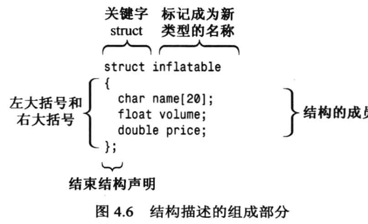

# 结构体



## 1. 声明

关键字 struct表明，这些代码定义的是一个结构的布局。

标识符 imnflatable 是这种数据格式的名称，因此新类型的名称为 inflatable。

大括号中包含的是结构存储的数据类型的列表，其中每个列表项都是一条声明语句。

```cpp
struct inflatable
{
    char name[20];
    float volume;
    double price;
};
```


## 2. 定义

### 2.1 结构体变量

**定义结构体变量**：定义结构后，便可以创建这种类型的变量了：

C++允许在声明结构变量时省略关键字struct（C语言不允许）：

```cpp
struct inflatable goose;  // 这是正确的
inflatable vincent;       // 这也是正确的
inflatable hat;
inflatable woopie_cushion;
inflatable mainframe;
```


### 2.2 函数内部声明结构体

如果你在`main`函数内部声明一个结构体，那么这个结构体只能在`main`函数内部被使用。

```cpp
int main() {
    struct inflatable {
        char name[20];
        float volume;
        double price;
    };
    inflatable hat;
    // ...
}
```


### 2.3 函数外部声明结构体

如果你在`main`函数外部声明一个结构体，那么这个结构体可以被程序中的任何函数使用。

```cpp
struct inflatable {
    char name[20];
    float volume;
    double price;
};

int main() {
    inflatable hat;
    // ...
}
```


### 2.4 向前声明结构体

如果你在`main`函数后面定义了一个结构体，那么你需要使用这个结构体之前进行前向声明。

```cpp
// 前向声明
struct inflatable;

int main() {
    // 使用结构体
    inflatable vincent;
    // ...
}

// 结构体定义
struct inflatable {
    char name[20];
    float volume;
    double price;
};
```


## 3. 访问

结构体使用成员运算符`.`来访问各个成员。

例如，hat.volume 指的是结构的 volume 成员，hat.price 指的是price 成员。

hat 是一个结构,而 hat.price 是一个 double 变量。


## 3. 初始化

你可以使用花括号`{}`和逗号`,`来初始化结构体的成员。

```cpp
// 结构体定义
struct inflatable {
    char name[20];
    float volume;
    double price;
};
inflatable guest = {"Glorious Gloria", 1.88, 29.99};
```

在这个例子中，`"Glorious Gloria"`是`name`成员的值，`1.88`是`volume`成员的值，`29.99`是`price`成员的值。


### 3.1 列表初始化

C++11支持使用列表初始化结构体，等号（`=`）是可选的。例如，你可以这样初始化一个`inflatable`类型的变量：

```cpp
inflatable duck{"Daphne", 0.12, 9.98};  // 在C++11中，可以省略等号
```


### 3.2 零初始化

如果你在初始化结构体时没有提供任何值（即大括号内未包含任何东西），那么结构体的所有成员都将被设置为零。例如：

```cpp
inflatable mayor;  // mayor.volume 和 mayor.price 被设置为零，mayor.name 的每个字节都被设置为零
```


## 4. 赋值

C++允许使用赋值运算符（`=`）将一个结构体赋值给另一个同类型的结构体。这种赋值方式会将一个结构体中的每个成员都设置为另一个结构体中相应成员的值，这被称为成员赋值（memberwise assignment）。


## 5. 声明结构体时创建变量

可以在定义结构体的同时创建结构体变量。只需在结构体定义的结束括号后面添加变量名即可。

也可有在定义结构体的同时创建结构体变量的同时进行初始化。

```cpp
struct perks {
    int key_number;
    char car[12];
} mr_smith, ms_jones;  // 定义了两个perks类型的变量

struct perks {
    int key_number;
    char car[12];
} mr_glitz = {1, "Packard"};  // 初始化mr_glitz变量
```


## 6. 无名结构体

可以声明没有名称的结构体类型，只需在定义结构体时省略名称。

这将创建一个这种类型的变量，但这种类型没有名称，因此以后无法创建这种类型的变量。

```cpp
struct {
    int x;
    int y;
} position;  // 创建了一个无名结构体变量position
```


C++结构体具有C结构体的所有特性，但还有更多。例如，C++结构体除了成员变量之外，还可以有成员函数。但这些高级特性通常被用于类中，而不是结构体中。


## 7. 结构体数组

可以创建一个包含结构体的数组，就像创建基本类型数组一样。

例如，你可以创建一个包含100个`inflatable`结构体的数组：

```cpp
inflatable gifts[100];  // 创建一个包含100个inflatable结构体的数组
```


### 7.1 数组初始化

你可以使用花括号（`{}`）和逗号（`,`）来初始化结构体数组。

每个元素的值都由逗号分隔，整个列表由花括号包围。

每个元素的值本身又是一个被花括号包围、用逗号分隔的值列表，这个列表用于初始化结构体的成员。例如：

```cpp
inflatable guests[2] = {
    {"Bambi", 0.5, 21.99},  // 初始化第一个结构体
    {"Godzilla", 2000, 565.99}  // 初始化第二个结构体
};
```


## 8. 位字段

**定义位字段**：在C++中，你可以为结构体成员指定特定的位数，这在创建与硬件设备上的寄存器对应的数据结构时非常有用。

位字段的类型应为整型或枚举类型，后面跟着一个冒号和一个数字，数字指定了使用的位数。

```cpp
struct torgle_register {
    unsigned int SN : 4;  // 4位用于SN值
    unsigned int : 4;     // 4位未使用
    bool goodIn : 1;      // 有效输入（1位）
    bool goodTorgle : 1;  // 成功的torgling（1位）
};

//下面也是允许的
struct Inline {

	unsigned int SN : 4;
	bool DE : 1;
	unsigned int BT : 4;

};
```


### 8.1 初始化和访问

你可以像通常那样初始化位字段，也可以使用标准的结构表示法来访问位字段。例如：

```cpp
torgle_register tr = {14, true, false};  // 初始化位字段
if (tr.goodIn) {                         // 访问位字段
    // ...
}
```


位字段通常用在低级编程中。一般来说，你可以使用整型和按位运算符来代替位字段。


