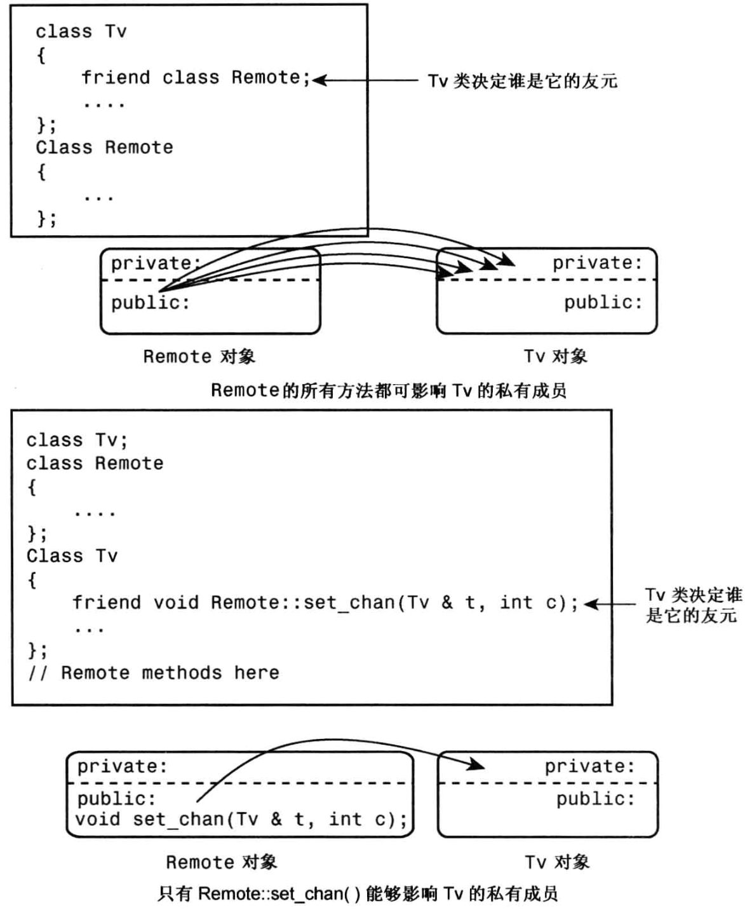

# 友元

## 1. 友元函数

如果将一个成员变量或者函数设置为私有，则只能在其他成员函数中访问，而无法通过其他函数访问，例如：

```cpp
class Time {
private:
	int length;
	void show_length(void) {
		cout << this->length << endl;
	}

public:
	int hour;
	int minutes;

	void show_time(void) {
		cout << this->hour << endl;
		cout << this->minutes << endl;
	}
};

int main(void) {
	Time test;

	test.hour = 10;
	test.minutes = 50;
	
	test.show_time();

	test.length = 10;
	test.show_length();
}
```

hour、minutes以及show_time()都是公有部分可以在其他函数中访问，而length和show_length()是私有部分，无法再非成员函数中访问。


如果想要在非成员函数中访问私有变量，则需要将这个函数声明为友元函数，例如：

```cpp
class Time {
private:

	int length;

	void show_length(void) {

		cout << this->length << endl;

	}

public:

	int hour;
	int minutes;

	void show_time(void) {
		
		cout << this->hour << endl;
		cout << this->minutes << endl;

	}
	
    //声明友元函数，在函数原型前面加上friend关键字
	friend void show_all(Time& show_time);

};

//定义友元函数 此处不能有friend关键字
void show_all(Time& display) {

	display.hour = 10;
	display.minutes = 30;
	display.show_time();

	display.length = 25;
	display.show_length();

	return;
}

int main(void) {

	Time test;
	show_all(test);

}
```

首先在类外部定义了一个函数，，由于该函数非类中成员函数，所以无需使用`::`类限定符。

```cpp
void show_all(Time& display){}			// 友元函数的定义
void Time::show_all(Time& display){}	// 类成员函数的定义
```

在类外部定义的函数不能有friend关键字，然后需要在类中进行声明，在函数原型前面加上friend关键字。

如果该函数需要访问多个类的私有成员，则必须在每一个类中使用friend声明为友元函数。

将友元函数声明在公有部分还是私有部分，对友元函数的访问权限没有影响，通常会将友元函数声明在公有部分，这样可以清楚地表明这个函数是类的一个接口。


如果想要将友元函数定义在类中，指向在定义前面加上`friend`关键字就可以了：

```cpp
class Time{

public:
	
	void show_time(void){	// 定义在类中的成员函数
		/* ... */
	}
	
	friend show_all(void){	// 定义在类中的友元函数
		/* ... */
	}

}
```


## 2. 友元类

如果想让一个类中的所有成员函数，访问另一个类中的私有部分，则需要将这个类声明为另一个类的友元类。

```cpp
class B;

class A {

	friend class B;

private:

	int x;

};

class B {

public:

	int Sum2(A & temp) {
		return temp.x * temp.x;
	}

	int Sum3(A& temp) {
		return temp.x * temp.x * temp.x;
	}

};
```

将类型B声明为类型A的友元函数，类型B的每一个成员函数都可以访问类型A的私有成员。


## 3. 友元成员函数

如果只想要一个类的部分成员函数访问另一个类的私有部分，则只需要将一个类的部分成员函数声明为友元函数。

在A类中将B类中的Sum2成员函数访问私有部分数据，B类中的其他成员函数无法访问。

```cpp
class A;

class B {
public:
	int Sum2(A& temp);
};


class A {
	friend int B::Sum2(A&temp);
private:
	int x;
};

int B::Sum2(A& temp) {
	return temp.x * temp.x;
}
```





## 4. 共同的友元

函数需要访问两个类的私有数据。

它可以是一个类的成员，同时是另一个类的友元。

但将函数作为两个类的友元更合理。


例如，假定有一个Probe 类和一个 Analyzer 类，前者表示某种可编程的测量设备，后

```cpp
// 前置声明
class Analyzer;

class Probe {
public:
    // 将 Analyzer 的 sync 函数声明为 Probe 的友元函数
    friend void sync(Analyzer &a, const Probe &p);
    // 将 Probe 的 sync 函数声明为 Analyzer 的友元函数
    friend void sync(Probe &p, const Analyzer &a);
};

class Analyzer {
public:
    // 将 Analyzer 的 sync 函数声明为 Probe 的友元函数
    friend void sync(Analyzer &a, const Probe &p);
    // 将 Probe 的 sync 函数声明为 Analyzer 的友元函数
    friend void sync(Probe &p, const Analyzer &a);
};

// 定义友元函数
inline void sync(Analyzer &a, const Probe &p) {
    // 同步 a 和 p
}

inline void sync(Probe &p, const Analyzer &a) {
    // 同步 p 和 a
}

```


## 5. 其他友元关系

新的方案将受益于相互的友情，一些Remote 方法能够像前面那样影响 Tv 对象，而一些 Tv 方法也能影响 Remote对象。

这可以通过让类彼此成为对方的友元来实现，即除了Remote是Tv的友元外，TV 还是 Remote 的友元。

需要记住的一点是，对于使用 Remote 对象的 Tv方法，其原型可在 Remote 类声明之前声明，但必须在 Remote 类声明之后定义：

```cpp
// 前置声明
class Remote;

class Tv {
public:
    friend class Remote;  // 将 Remote 声明为 Tv 的友元类
    void buzz(Remote &r);
};

class Remote {
public:
    friend class Tv;  // 将 Tv 声明为 Remote 的友元类
    void volup(Tv &t){
    	t.volup();
	}
};

// 在 Remote 类定义之后，定义 Tv::buzz() 函数
inline void Tv::buzz(Remote & r) {
    // ...
}

```

`Tv`类和`Remote`类互相将对方声明为友元类，这样，每个类的成员函数就可以访问另一个类的私有和保护成员。


## 6. 友元与前置声明

### 6.1 友元类

如果将另一个类声明为这个类的友元类，则必须在这个类之前声明另一个类，此时可以使用前置声明。

```cpp
class B;

class A {

	friend class B;

};

class B {
	...
};
```


### 6.2 友元成员函数

对于声明友元成员函数的要求则比较苛刻


如果你想将一个类的成员函数声明为另一个类的友元函数，那么你需要遵循以下步骤：

1. 在这个类中，对这个友元成员函数进行声明（如果需要）。
2. 只声明这个成员函数，而不定义它。
3. 在另一个类将这个成员函数声明为友元函数之后，再在定义这个成员函数。

```cpp
class A;

class B {
public:
	int Sum2(A& temp);				// 1.对这个友元成员函数进行声明，只声明这个成员函数，而不定义它
};

class A {
	friend int B::Sum2(A&temp);		// 2.在另一个类将这个成员函数声明为友元函数
private:
	int x;
};

int B::Sum2(A& temp) {				// 3.在另一个类将这个成员函数声明为友元函数之后，再在定义这个成员函数。
	return temp.x * temp.x;
}
```

