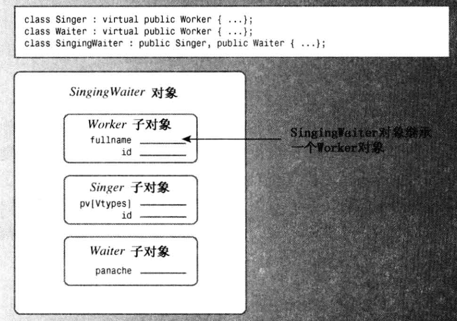

# 多重继承


假设首先从 Singer和 Waiter 公有派生出 SingingWaiter。

因为 Singer 和 Waiter 都继承了一个 Worker 组件，因此 SingingWaiter 将包含两个 Worker 组件。


例如，通常可以将派生类对象的地址赋给基类指针，但现在将出现二义性：

```cpp
SingingWaiter ed;
Worker *pw=&ed;
```


通常，这种赋值将把基类指针设置为派生对象中的基类对象的地址。

但ed中包含两个 Worker 对象有两个地址可供选择，所以应使用类型转换来指定对象：


```cpp
Worker *pwl=(Waiter *)&ed;
Worker *pw2=(Singer *)&ed;
```


## 1. 虚基类

虚基类使得从多个类(它们的基类相同)派生出的对象只继承一个基类对象。例如，通过在类声明中使用关键字 virtual，可以使 Worker 被用作 Singer 和 Waiter 的虚基类(virtual和 public 的次序无关紧要)：

```cpp
class Singer : virtual public Worker { ... };
class Waiter : public virtual Worker { ... };
```


然后，可以将 SingingWaiter 类定义为：

```cpp
class SingerWaiter : public singer , public waiter { ... }; 
```

现在，SingingWaiter 对象将只包含 Worker 对象的一个副本。从本质上说，继承的 Singer 和 Waiter 对象共享一个 Worker 对象，而不是各自引入自己的 Worker 对象副本。




## 2. 虚基类构造函数

使用虚基类时，需要对类构造函数采用一种新的方法。对于非虚基类，唯一可以出现在初始化列表中的构造函数是即时基类构造函数。但这些构造函数可能需要将信息传递给其基类。


1. C类的构造函数只能调用B类的构造函数，而B类的构造函数只能调用A类的构造函数。
2. 这里，C类的构造函数使用值 q，并将值m和n传递给B类的构造函数;
3. 而B类的构造函数使用值m，并将值n传递给 A 类的构造函数。


```cpp
class A {
    int a;
public:
    A(int n=0):a(n){}
};

class B:public A {
    int b;
public:
    B(int m=0, int n=0):A(n), b(m){}
};

class C:public B {
    int c;
public:
    C(int q=0, int m=0, int n=0):B(m, n), c(q){}
};
```


在C++中，如果一个类有虚基类，自动传递信息时，将通过2条不同的途径(Waiter和Singer)将wk传递给 Worker 对象。为避免这种冲突，C++在基类是虚的时，禁止信息通过中间类自动传递给基类。

```cpp
SingingWaiter(const Worker &wk, int p=0, int v=Singer::other)
: Waiter(wk, p), Singer(wk, v) {} // flawed
```


在构造函数中，必须显式地调用虚基类的构造函数。如果不这样做，编译器将使用虚基类的默认构造函数：

```cpp
SingingWaiter(const Worker &wk, int p=0, int v=Singer::other)
: Worker(wk), Waiter(wk, p), Singer(wk, v) {}

```


## 3. 成员函数

如果一个类从多个基类继承了同名的成员函数，那么在派生类中直接调用这个函数会产生二义性。

为了解决这个问题，可以使用作用域解析运算符来指定调用哪个基类的成员函数。例如，`newhire.Singer::Show();` 就是调用 `Singer` 类的 `Show()` 函数。


更好的做法是在派生类中重新定义这个函数，并在函数内部明确调用需要的基类函数：

```cpp
void SingingWaiter::Show() {
    Singer::Show();
    Waiter::Show();
}
```

`SingingWaiter` 类的 `Show()` 函数就会先调用 `Singer` 类的 `Show()` 函数，然后再调用 `Waiter` 类的 `Show()` 函数。

这样做可能会导致一些信息被重复显示，因为 `Singer::Show()` 和 `Waiter::Show()` 都可能会调用 `Worker::Show()`。


可以将 `Show()` 函数分解为多个部分，每个部分只显示一部分信息，然后在派生类中组合这些部分。

```cpp
void Worker::Data() const {
    cout << "Name: " << fullname << "\n";
    cout << "Employee ID: " << id << "\n";
}

void Waiter::Data() const {
    cout << "Panache rating: " << panache << "\n";
}

void Singer::Data() const {
    cout << "Vocal range: " << pv[voice] << "\n";
}

void SingingWaiter::Data() const {
    Singer::Data();
    Waiter::Data();
}

void SingingWaiter::Show() const {
    cout << "Category: singing waiter\n";
    Worker::Data();
    Data();
}
```


## 4. 如何理解虚基类

1. 基类本身无法决定是否成为虚基类，这是由派生类决定的。
2. 派生类可以使用`virtual`关键字来声明其基类，这表明该基类可以被多个派生类共享。
3. 如果一个派生类从多个基类继承，且这些基类中有两个或更多的相同的间接虚基类，那么这个虚基类将会被共享。


例子：

1. 有一个基类`A`
2. 三个派生类`B1`、`B2`和`B3`，它们都继承自`A`
3. `B1`和`B2`将`A`声明为虚基类，而`B3`则直接继承`A`。
4. 派生类`C`，它继承自`B1`、`B2`和`B3`。
5. `C`会有两个`A`基类的实例，其中一个`A`实例是由`B1`和`B2`共享的（因为它们将`A`声明为虚基类），另一个`A`实例则是由`B3`独享的（因为`B3`直接继承`A`）


## 5. 成员优先级

一个成员名如何优先于另一个成员名？派生类中的名称优先于直接或间接祖先类中的相同名称。

例1：

1. 基类A由omg函数
2. 派生类B继承基类A，派生类B定义了自己的omg函数
3. 派生类C继承派生类B，如果在派生类C中调用omg函数，则调用派生类B的omg函数，而不是基类A中的omg函数
4. 如果派生类C也定义了自己的omg函数，则直接调用自身的omg函数。


例2：

1. 基类A由omg函数
2. 派生类B1和B2分别继承基类A，派生类B1和B2分别定义了自己的omg函数
3. 派生类C继承派生类B1和B2，如果在派生类C中调用omg函数，则产生二义性。
4. 如果派生类C定义了自己的omg函数，则直接调用自身的omg函数。


