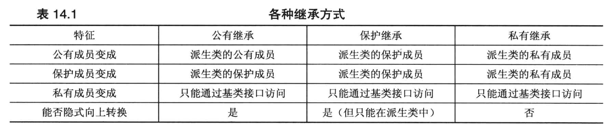

# 类继承

可使用名为“继承”的机制从现有类派生新类。 用于派生的类称为特定派生类的“基类”。 使用以下语法声明派生类：

```c++
class Derived : [virtual] [access-specifier] Base
{
   // member list
};
class Derived : [virtual] [access-specifier] Base1,
   [virtual] [access-specifier] Base2, . . .
{
   // member list
};
```

在类的标记（名称）后面，显示了一个后跟基本规范列表的冒号。

冒号后面是访问修饰符，它是关键字 **`public`**、**`protected`** 或 **`private`** 之一，默认为**`private`**。用于控制派生类对于基类的权限。

可指定多个基类，并用逗号分隔。 如果指定了单个基类，则继承模型为**单一继承**。 如果指定了多个基类，则继承模型称为**多重继承**。


派生类不能直接访问基类的私有成员，而必须使用基类的公有方法来访问私有的基类成员。


## 派生类构造函数

派生类不仅要对新的成员进行初始化，还需要对基类成员进行初始化。初始化派生类的成员必须手动进行，而初始化基类成员，可以调用基类的构造函数（或赋值构造函数）：

```cpp
class user {

public:

	user(const string& newName = "", const unsigned int& newAge = 0) {

		user& object = *this;

		object.Name = newName;
		object.Age = newAge;

	}
	user(const char* newName, const unsigned int& newAge = 0) : user((string)(newName), newAge) { ; }


	user(const user& source);


private:

	string Name;
	int Age;

public:

};

//1. 将基类 user 派生一个 group 类型
class group : public user{

public:
	
	group(const string& newGroupName = "", const string& newName = "", const unsigned int& newAge = 0)
		: group(newGroupName, user(newName, newAge)) { ; }


	group(const char* newGroupName, const string& newName = "", const unsigned int& newAge = 0)
		: group((string)(newGroupName), user(newName,newAge)) { ; }
	
	//2. 派生类 group 构造函数，支持一个 user 基类的引用变量，调用 user 基类的赋值构造函数进行初始化
	group(const string& newGroupName, const user& newUser) : user(newUser){

		group& object = *this;

		object.groupName = newGroupName;

	}

private:
	
	string groupName;
	

public:

};
```


## 基类和派生类的关系

基类的引用和指向基类的指针，可以去引用或指向一个派生类对象，例如：

```C++
group tmpGroup;

user * tmpbase = & tmpGroup;
user & base = tmpGroup;
```

但这只是单项的，派生类的指针或引用，不能指向或引用一个基类对象。


由此可见，可以将一个派生类对象赋值给一个基类的对象，例如：

将派生类group赋值给基类user;

在基类user没有定义赋值构造函数的时候，默认存在一个user(const user & [标识符]);的赋值构造函数。

const user& 是可以引用一个 group 对象的。


is-a(is-a-kind-of)：描述某种事物是另一种事物的一种类型或种类

has-a：某种事物拥有或包含另一种事物

is-like-a：如果A “is-like-a” B，那么可以理解为A像B，但并不完全是B。

is-implemented-as-a：如果A “is-implemented-as-a” B，那么可以理解为A是通过B来实现的

user-a：如果类A “uses-a” 类B，那么可以理解为类A使用了类B。


## 虚函数

假设现在存在一个base基类，然后通过base基类派生出一个Derived派生类，然后这两个内中都存在一个同名的方法（函数）。

如果是是通过对象来进行访问，那么base对象调用base类中的方法，Derived对象调用Derived类中的方法。

```C++
#include <iostream>
#include <string>

using std::cout;
using std::endl;
using std::string;


class Base {

public:
	Base(const string& newBaseName = "");

	Base(const char* newBaseName) : Base((string)(newBaseName));

private:
	string BaseName;

public:
	void setName(const string& newBaseName);
	string getName(void) const;
	
};


class Derived : public Base {

public:
	Derived(const string& newDerivedName = "",const string & newBaseName = "") 
		: Base(newBaseName);
		
	Derived(const char* newDerivedName, const string newBaseName = "") 
		: Derived((string)(newDerivedName), newBaseName);

private:
	string DerivedName;

public:
	void setName(const string& newDerivedName);
	string getName(void) const;

};

```

```c++
Base a = "BaseName";
cout << a.getName() << endl; // Base::getName()
Derived b = "DerivedName";
cout << b.getName() << endl; // Derived::getName()
```


如果一个函数只在派生类中存在，那么你不能通过基类的引用或指针来调用它。

```C++
#include <iostream>
#include <string>

using std::cout;
using std::endl;
using std::string;


class Base {

public:
	// 假设基类中没有 getName函数
	// string getName(void) const;
	
};


class Derived : public Base {、

public:
    // getName函数仅在派生类中存在
	string getName(void) const;

};

```

```C++
Base a = "BaseName";
Derived b = "DerivedName";

Derived & P_Derived = b;
cout << p_base.getName() << endl; // Base::getName() 

Base & p_Base = a;
cout << p_base.getName() << endl; // 非法语句，Base中没有getName函数，无法调用Derived类中的getName函数
```


如果一个基类的函数被声明为`virtual`，那么在所有从这个基类派生出来的类中，（与）这个函数（同名）都会自动成为虚函数。

对以上代码的修改，只需要将Base类中部分修改为：

```cpp
class Base {
...

public:
	virtual void setName(const string& newBaseName);
	virtual string getName(void) const;

...
}
```


如果一个函数在基类和派生类中存在，但**未被**声明为虚函数，则通过指针或引用的类型来确定调用哪一个函数。

```c++
Base a = "BaseName";
Derived b = "DerivedName";

Base & p_Base = a;
cout << p_base.getName() << endl; // Base::getName()

Base & P_Derived = b;
cout << p_base.getName() << endl; // Base::getName() , 即使它指向的是一个Derived对象
```


如果一个函数在基类和派生类中存在，但**且被**声明为虚函数，则调用引用或指针所指向的对象类型的函数版本

```cpp
Base a = "BaseName";
Derived b = "DerivedName";

Base & p_Base = a;
cout << p_base.getName() << endl; // Base::getName()

Base & P_Derived = b;
cout << p_base.getName() << endl; // Derived::getName() , 根据引用的对象来调用函数，而不是引用的类型
```


## 虚函数重定义

如果一个虚函数在基类和派生类中的函数特征（即函数参数列表）不同，那么可以说在派生类中对这个虚函数进行了重定义。

如果在派生类中对基类的虚函数进行了重定义，那么编译器会自动隐藏基类中的虚函数，此时只能调用派生类中的虚函数，无法调用基类中的虚函数。


假设创建了如下所示的代码：

```cpp
class Dwelling {
public:
    virtual void showperks(int a) const;
};

class Hovel : public Dwelling {
public:
    virtual void showperks() const;
};

```


```cpp
Hovel test;
test.showperks(1);	// 错误
test.showperks();	// 正确
```


如果重新定义继承的方法，应确保与原来的原型完全相同。

如果返回类型是基类引用或指针，则可以修改为指向派生类的引用或指针（这种例外是新出现的），称为返回类型协变（covariance of return type）。

注意下面代码中 build 虚函数的返回值：

```cpp
class Dwelling
{
public :
    
    virtual Dwelling &build(int n);
};

class Hovel: public Dwelling
{
public :
    
    virtual Hovel &build(int n); 
};

```


如果基类声明被重载了，则应在派生类中重新定义所有的基类版本。

如果只重新定义一个版本，则另外两个版本将被隐藏，派生类对象将无法使用它们。

```cpp
class Dwelling
{
public :
    // three overloaded showperks()
    virtual void showperks(int a) const;
    virtual void showperks(double x) const;
    virtual void showperks() const;
};

class Hovel: public Dwelling
{
public :
    // three redefined showperks()
    virtual void showperks(int a) const;
    virtual void showperks(double x) const;
    virtual void showperks() const;
};
```


注意，如果不需要修改，则新定义可只调用基类版本：

```cpp
void Hovel::showperks() const
{
    Dwelling::showperks();
}
```


## 访问控制protected

protected于private类似，private只能被当前类的成员函数所访问，而protected类型可以被当前类以及派生类的成员所访问。

对于类的外部，protected具有相同的特性。

对于类数据成员，最好采用私有访问控制，不要使用保护访问控制，同时通过基类方法使派生类能够访问基类数据。

对于类成员函数，保护访问控制很有用，它让派生类能够访问公众不能使用的内部函数。


## 纯虚函数

在C++中，**抽象基类**和**纯虚函数**是面向对象编程的重要概念。

**抽象基类**（Abstract Base Class，ABC）是一种只能用作基类的类，不能实例化。这种类的主要目的是为派生类提供一个公共的接口。抽象基类至少包含一个纯虚函数。

```cpp
class AbstractClass {
public:
    // 纯虚函数
    virtual void pureVirtualFunction() = 0;
};
```


**纯虚函数**（Pure Virtual Function）是在基类中声明的虚函数，它在基类中没有定义，但要求任何派生类必须定义。纯虚函数是通过在声明中赋值0来指定的。

```cpp
virtual void pureVirtualFunction() = 0;
```

可以选择在基类中为纯虚函数提供定义：

```cpp
class AbstractClass {
public:
    // 纯虚函数
    virtual void pureVirtualFunction() = 0;
};

void AbstractClass::pureVirtualFunction(){

	// ... 代码定义 ... 

}
    
```


如果一个类包含一个或多个纯虚函数，那么这个类就是抽象基类。派生类必须实现所有的纯虚函数，否则它也将成为抽象基类。

```cpp
class DerivedClass : public AbstractClass {
public:
    // 必须实现的纯虚函数
    void pureVirtualFunction() override {
        // 具体实现
    }
};
```


## 继承和动态内存分配

当基类和派生类都采用动态内存分配时，派生类的析构函数、复制构造函数、赋值运算符都必须使用相应的基类方法来处理基类元素。

对于析构函数，这是自动完成的。

```cpp
baseDMA::~baseDMA() // takes care of baseDMA stuff
{
    delete []label;
}

hasDMA::~hasDMA() // takes care of hasDMA stuff
{
    delete []style;
}

```

对于构造函数，这是通过在初始化成员列表中，调用基类的复制构造函数来完成的；如果不这样做，将自动调用基类的默认构造函数。

```cpp
baseDMA::baseDMA(const baseDMA &rs)
{
    label = new char[std::strlen(rs.label) + 1];
    std::strcpy(label, rs.label);
    rating = rs.rating;
}

hasDMA::hasDMA(const hasDMA &hs) : baseDMA(hs)
{
    style = new char[std::strlen(hs.style) + 1];
    std::strcpy(style, hs.style);
}

```

对于赋值运算符，这是通过使用作用域解析运算符显式地调用基类的赋值运算符来完成的。

```cpp
baseDMA & baseDMA::operator=(const baseDMA & rs)
{
    if (this == &rs)
        return *this;
    delete []label;
    label = new char[std::strlen(rs.label) + 1];
    std::strcpy(label, rs.label);
    rating = rs.rating;
    return *this;
}

hasDMA & hasDMA::operator=(const hasDMA &hs)
{
    if(this == &hs)
        return *this;
    baseDMA::operator=(hs); // copy base portion
    delete []style; // prepare for new style
    style = new char[std::strlen(hs.style) + 1];
    std::strcpy(style, hs.style);
    return *this;
}

```


## 派生类访问基类友元函数

派生类的友元函数可以直接访问派生类的私有成员，所以可以直接进行cout输出，但是无法直接访问基类的私有成员，只能通过访问基类的友元函数。

派生类如何使用基类的友元，因为友元不是成员函数，所以不能使用作用域解析运算符来指出要使用哪个函数，可以使用强制类型转换。

```cpp
//基类的友元函数
std::ostream &operator<<(std::ostream &os, const baseDMA & rs)
{
    os << "Label: " << rs.label << std::endl;
    os << "Rating: " << rs.rating << std::endl;
    return os;
}

```

```cpp
//派生类的友元函数
std::ostream & operator<<(std::ostream & os, const hasDMA &rs)
{
    os << (const baseDMA &)hs;
    // 上面的代码将会被转换为：
    // operator(os,(const baseDMA&)hs);
	// 也可以直接使用 这种方法 暂未验证
    
    os << "Style: " << hs.style << std::endl;
    return os;
}

```


## 各种继承方式




## 使用私有继承


### 1. 初始化基类组件

使用私有继承，在构造函数的初始化列表中，应该使用私有基类的类名来对基类进行构造。

```C++
class Student : private std::string{

public:

	Student(const & std::string Name) : std::string(Name);
	Student(const char * Name) : std::string(Name);

}
```


### 2. 访问基类的方法

私有继承使得能够使用类名和作用域解析运算符来调用基类的方法

```C++
class Student : private std::string {

public:
	
	size_t len(void){
	
		//调用string基类中的size方法
		//类似于 string a; a.size();
		return std::string::size();
	
	}	

}
```


### 3. 访问基类对象

由于 Student 类是从 string 类派生而来的，因此可以通过强制类型转换，将Student 对象转换为 string 对象;结果为继承而来的string对象。

指针 this 指向用来调用方法的对象，因此*this 为用来调用方法的对象，在这个例子中，为类型为 Student 的对象。

为避免调用构造函数创建新的对象，可使用强制类型转换来创建一个引用。

```C++
const string & Student::Name() const
{

	return (const string & ) *this;

}
```


### 4. 访问基类友元函数

可以通过显式地转换为基类来调用正确的函数：

```C++
ostream & operator<<(ostream & os,const Student & stu)
{
	os << "Scores for" << (const string &) stu << ":\n";
}
```

显式地将 stu 转换为 string对象引用，进而调用函数 operator<<(ostream &,const String &)。


引用 stu 不会自动转换为 string引用。根本原因在于,在私有继承中,在不进行显式类型转换的情况下,不能将指向派生类的引用或指针赋给基类引用或指针。

另一个原因是，由于这个类使用的是多重继承，编译器将无法确定应转换成哪个基类，如果两个基类都提供了函数 operator<<( )。


## 使用using重新定义访问权限

使用一个usimg声明(就像名称空间那样)，来指出派生类可以使用特定的基类成员，即使采用的是私有派生。

假如希望Student类直接使用string类中的size函数。

```cpp
class Student : private std::string {

public:

	using std::string::size;

}
```

注意，using声明只使用成员名——圆括号、函数特征标和返回类型。引入一个函数，会引入它的所有重载版本（如果有的话）。