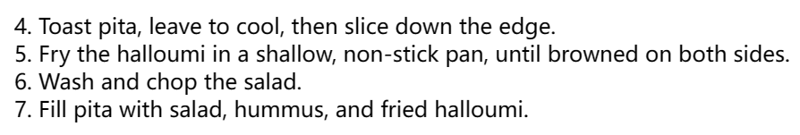
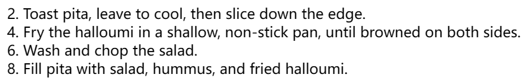

# 列表样式

列表和描述列表都有其默认样式：

- `<ul>` 和 `<ol>` 元素：16px的上、下外边距；20px的左内边距。
- `<li>`元素：没有任何边距（内边距和外边距）
- `<dl>`元素：16px的上、下边距；没有内边距
- `<dd>`元素：40px的左外边距


## 列表特定样式

- list-style-type：设置用于列表的项目符号的类型，例如无序列表的方形或圆形项目符号，或有序列表的数字、字母或罗马数字。
- list-style-position：设置在每个项目开始之前，项目符号是出现在列表项内，还是出现在其外。
- list-style-image：允许为项目符号使用自定义图片，而不是简单的方形或圆形。


### list-style-position属性

项目外：


项目内：


### list-style-image 属性

允许对于项目符号使用自定义图片，但是在控制项目符号的位置，大小等方面是有限的。

最好使用 background 系列属性：

```css
ul {
  padding-left: 2rem;
  list-style-type: none;
}

ul li {
  padding-left: 2rem;
  background-image: url(star.svg);
  background-position: 0 0;
  background-size: 1.6rem 1.6rem;
  background-repeat: no-repeat;
}
```


### 简写

三种属性可以用一个单独的简写属性 list-style 来设置。

```css
ul {
  list-style-type: square;
  list-style-image: url(example.png);
  list-style-position: inside;
}
```

可以被如下方式代替：

```css
ul {
  list-style: square url(example.png) inside;
}
```


# 管理列表计数

## start

start 属性允许你从 1 以外的数字开始计数。以下示例：

```css
<ol start="4">
  <li>Toast pita, leave to cool, then slice down the edge.</li>
  <li>
    Fry the halloumi in a shallow, non-stick pan, until browned on both sides.
  </li>
  <li>Wash and chop the salad.</li>
  <li>Fill pita with salad, hummus, and fried halloumi.</li>
</ol>
```

输出的结果如下：




## reversed

reversed 属性将使列表反向计数。以下示例：

```css
<ol start="4" reversed>
  <li>Toast pita, leave to cool, then slice down the edge.</li>
  <li>
    Fry the halloumi in a shallow, non-stick pan, until browned on both sides.
  </li>
  <li>Wash and chop the salad.</li>
  <li>Fill pita with salad, hummus, and fried halloumi.</li>
</ol>
```

输出的结果如下：


## value

value 属性允许设置列表项指定数值，以下示例：

```css
<ol>
  <li value="2">Toast pita, leave to cool, then slice down the edge.</li>
  <li value="4">
    Fry the halloumi in a shallow, non-stick pan, until browned on both sides.
  </li>
  <li value="6">Wash and chop the salad.</li>
  <li value="8">Fill pita with salad, hummus, and fried halloumi.</li>
</ol>
```

输出的结果如下：

