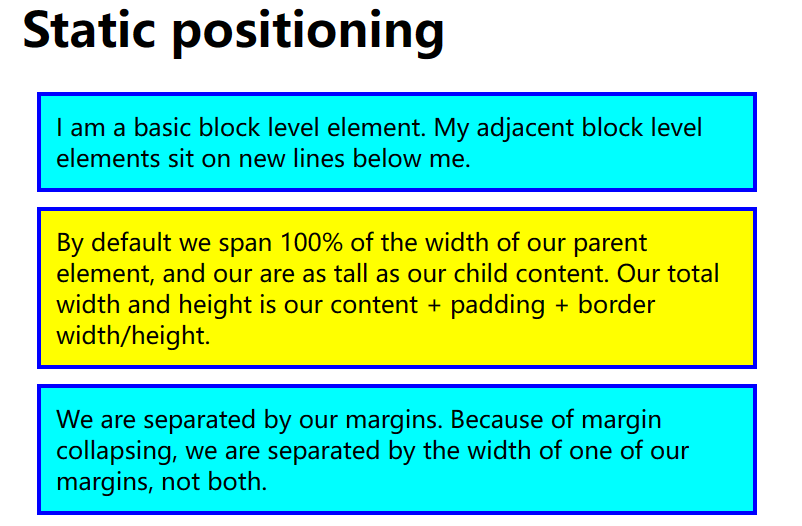
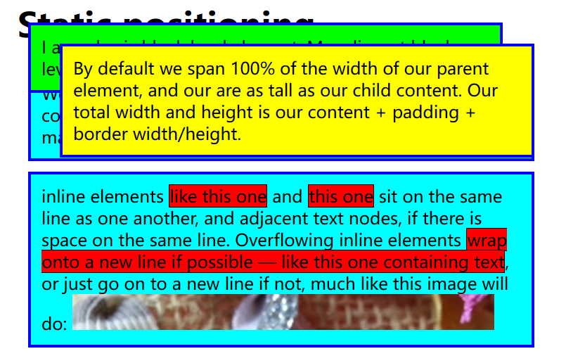
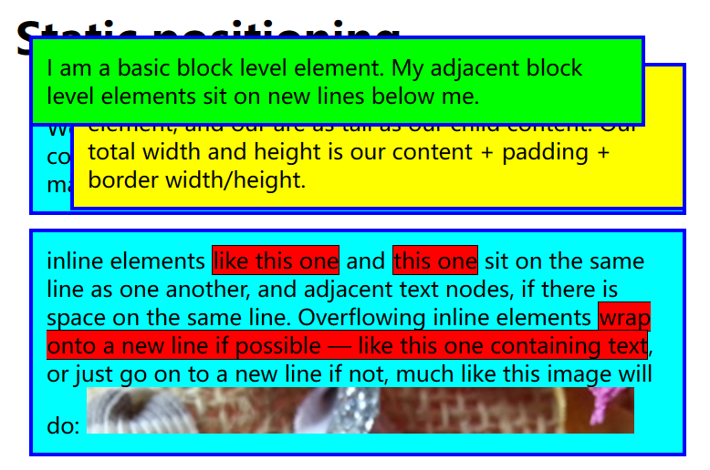
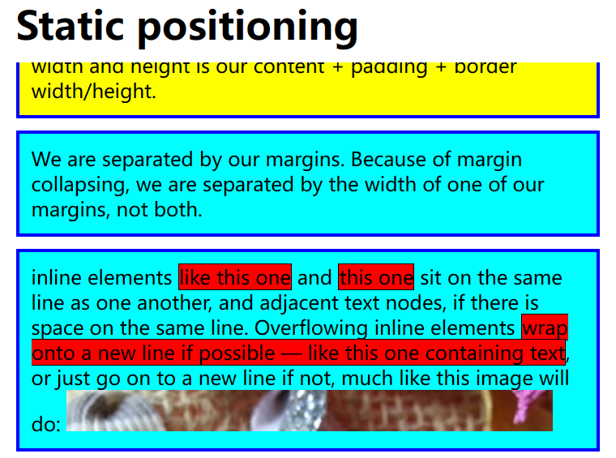

# 定位

定位的整个想法是允许我们覆盖上面描述的基本文档流行为。

创建一个浮动在页面其他部分顶部的 UI 元素，并且/或者始终停留在浏览器窗口内的相同位置，无论页面滚动多少


## 静态定位

静态定位是每个元素获取的默认值，它只是意味着“将元素放入它在文档布局流中的正常位置。

```css
.positioned {
  position: static;
}
```


## 相对位置

它与静态定位非常相似，占据在正常的文档流中，除了你仍然可以修改它的最终位置，包括让它与页面上的其他元素重叠。

position 属性设置为 relative 以使用相对位置：

```css
.positioned {
  position: relative;
}
```


top, bottom, left, 和 right 来精确指定要将定位元素移动到的位置。

如果你指定 `top: 30px;`一个力推动框的顶部，使它（**以文档布局流中正常位置为基点**）向下移动 30px。

```css
.positioned {
  position: relative;
  top: 30px;
  left: 30px;
}
```

使用前：



使用后：


## 绝对定位

绝对定位的元素应该在文档流中的间隙不再存在，绝对定位的元素不再存在于正常文档布局流中，就像绝对定位元素不再存在。


position 属性设置为 absolute 已使用绝对定位。

一个绝对定位元素，依据“包含元素”来进行定位，“包含元素”是**相对于绝对定位元素**最近的非`static`定位的祖先元素。

如果所有的父元素都没有显式地定义 position 属性，绝对定位元素会被包含在**初始块容器**中。

这个初始块容器有着和浏览器视口一样的尺寸，并且`<html>`元素也被包含在这个容器里面。绝对定位元素在 HTML 源代码中，是被放在 `<body>` 中的，但是在最终的布局里面，它离页面（而不是 `<body>`）的左边界、上边界有 30px 的距离。


将 positioned 类的属性设置为：

```css
position: absolute;
top: 30px;
left: 30px;

background: yellow;
```


为绝对定位元素（position）设置“包含元素”（body），将body的position属性设置为：

```css
position: relative;
```


效果：


### z-index

当有多个元素使用绝对定位，并且它们产生了重叠，源顺序中**后定位元素在顶部**，源顺序中**先定位元素底部**。


将第一段也使用绝对定位：

```css
p:nth-of-type(1) {
  position: absolute;
  background: lime;
  top: 10px;
  right: 30px;
}
```

由于绿色背景的元素先定义，黄色背景的元素后定义，所以**黄色背景元素出现在绿色背景元素的顶部**，效果：




z-index值大的出现在顶部，定位的元素都具有 z-index 为 auto，实际上为 0。

将绿色背景的z-index设置为1，黄色背景的默认为0，此时绿色背景元素将出现在黄色背景元素的顶部：




## 固定定位

将position属性设置为fixed，则使用固定定位，固定元素则是相对于浏览器视口本身。


将黄色和绿色背景的元素位置恢复为静态，body 规则以删除position: relative; 声明并添加固定高度：

```css
body {
  width: 500px;
  height: 1400px;
  margin: 0 auto;
}
```

将h1元素设置为固定定位，让它坐在视口的顶部中心：

```css
h1 {
  position: fixed;
  top: 0;
  width: 500px;
  margin: 0 auto;
  background: white;
  padding: 10px;
}
```

由于h1从正常文档流中移除，所以h1不会产生空隙，会直接覆盖第一个段落，所以给第一个段落设置20px的上边距：

```css
body p:nth-of-type(1) {
  margin-top: 60px;
}
```


效果：





## sticky

sticky 基本上是相对位置和固定位置的混合体，它允许被定位的元素表现得像相对定位一样，直到它滚动到某个阈值点（例如，从视口顶部起 10 像素）为止，此后它就变得固定了。


`top`和`left`属性是基于其最近的滚动祖先（最近的有滚动条的祖先）和包含块（最近的`position`设置为`relative`, `absolute`, `fixed`或`sticky`的祖先）。


```css
.positioned {
  position: sticky;
  top: 30px;
  left: 30px;
}
```

效果图：


