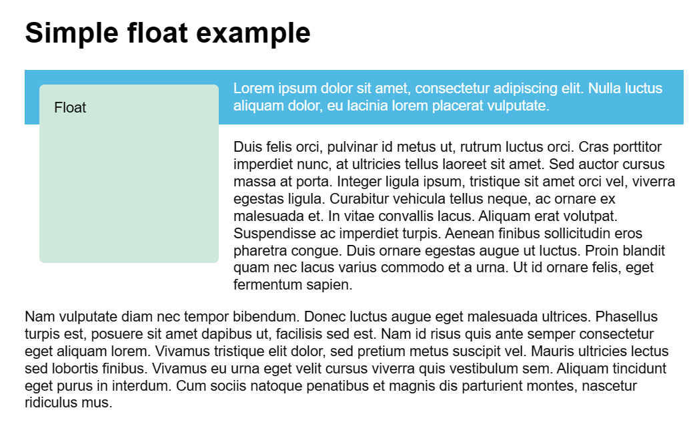
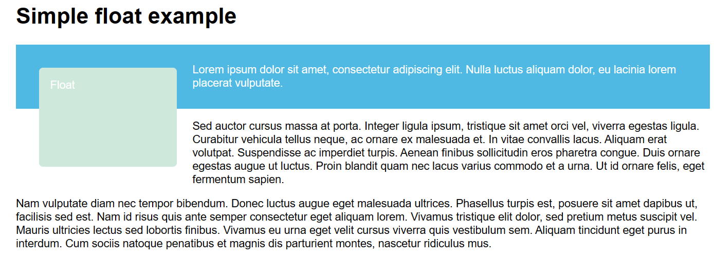

# 浮动

float 属性最初只用于在成块的文本内浮动图像，但 Web 开发人员很快意识到，任何东西都可以浮动，而不仅仅是图像，所以浮动的使用范围扩大了。

浮动曾被用来实现整个网站页面的布局，目前出现了更新更好的页面布局技术，所以使用浮动来进行页面布局应被看作传统的布局方法。


## 使盒子浮动

向规则 .box 下添加 float 

```css
.box {
  float: left;
  margin: 15px;
  width: 150px;
  height: 100px;
  border-radius: 5px;
  background-color: rgb(207, 232, 220);
  padding: 1em;
}
```

展示效果：


浮动元素 (这个例子中的 `<div>` 元素) 会脱离正常的文档布局流，并吸附到其父容器的左边（这个例子中的 `<body>` 元素）。在正常布局中位于该浮动元素之下的内容，此时会围绕着浮动元素，填满其右侧的空间。


## 清除浮动

如果我们不想让剩余元素也受到浮动元素的影响，我们需要 停止 它；这是通过添加 clear 属性实现的。

向浮动元素下方的第二个段落添加 cleared 类，然后向 CSS 文件中添加以下样式：

```css
.cleared {
  clear: left;
}
```


`clear` 属性接受下列值：

- `left`：停止任何活动的左浮动
- `right`：停止任何活动的右浮动
- `both`：停止任何活动的左右浮动


## 清除浮动元素周围的盒子

如果存在一个盒子 同时 包含了很高的浮动元素和一个很短的段落。

第一个段落与浮动的盒子共同处于类名为 wrapper 的 `<div> `元素之下。

```css
<div class="wrapper">
    <div class="box">Float</div>

    <p>
        Lorem ipsum dolor sit amet, consectetur adipiscing elit. Nulla luctus
        aliquam dolor, eu lacinia lorem placerat vulputate.
    </p>

</div>

<p>
    Sed auctor cursus massa at porta. Integer ligula ipsum, tristique sit amet
    orci vel, viverra egestas ligula. Curabitur vehicula tellus neque, ac ornare
    ex malesuada et. In vitae convallis lacus. Aliquam erat volutpat. Suspendisse
    ac imperdiet turpis. Aenean finibus sollicitudin eros pharetra congue. Duis
    ornare egestas augue ut luctus. Proin blandit quam nec lacus varius commodo et
    a urna. Ut id ornare felis, eget fermentum sapien.
</p>
```


为 .wrapper 类添加如下规则：

```css
.wrapper {
  background-color: rgb(79, 185, 227);
  padding: 10px;
  color: #fff;
}
```

显示效果：




这是因为浮动的元素脱离了正常文档流，浮动的元素的大小，不能撑起div，整个div没有设定高度，依靠p标签的高度撑起，所以出现了高度塌缩。


## clearfix 小技巧

可以在wrapper盒子中的最后假如一个div，并设置clear为both（不受浮动影响），此时他会添加到Float浮动盒子的下方，撑起整个wrapper盒子。

```css
<h1>Simple float example</h1>

<div class="wrapper">
    <div class="box">Float</div>

    <p>
        Lorem ipsum dolor sit amet, consectetur adipiscing elit. Nulla luctus
        aliquam dolor, eu lacinia lorem placerat vulputate.
    </p>

    <div style="clear: both;">
    </div>

</div>

<p>
    Sed auctor cursus massa at porta. Integer ligula ipsum, tristique sit amet
    orci vel, viverra egestas ligula. Curabitur vehicula tellus neque, ac ornare
    ex malesuada et. In vitae convallis lacus. Aliquam erat volutpat. Suspendisse
    ac imperdiet turpis. Aenean finibus sollicitudin eros pharetra congue. Duis
    ornare egestas augue ut luctus. Proin blandit quam nec lacus varius commodo et
    a urna. Ut id ornare felis, eget fermentum sapien.
</p>
```


可以通过::after来简化：

```css
.wrapper::after {
  content: "";
  clear: both;
  display: block;
}
```


## overflow

在包裹元素上添加 overflow: auto 规则：

```css
.wrapper {
  background-color: rgb(79, 185, 227);
  padding: 10px;
  color: #fff;
  overflow: auto;
}
```

大部分情况下这种小技巧都可以奏效，但是可能会出现莫名其妙的滚动条或裁剪阴影，这是使用 overflow 带来的一些副作用。


## display: flow-root

使用 display 属性的 flow-root 值。它可以无需小技巧来创建块格式化上下文（BFC），在使用上没有副作用。

```css
.wrapper {
  background-color: rgb(79, 185, 227);
  padding: 10px;
  color: #fff;
  display: flow-root;
}
```

