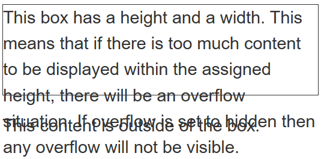

# 溢出

一个盒子，在块方向上已经受到 `height` 的限制。添加过多的内容，以至于盒子里面没有空间容纳，内容正在从盒子里面溢出。

单词位于在内联方向上，受到限制的盒子里面。盒子已经被做得小到无法放置那个单词的地步，于是那个单词就突破了盒子的限制。

overflow 属性：

visible：如果盒子无法容纳内容，则会溢出覆盖盒子外的内容

hidden：溢出部分的内容被隐藏

scroll：浏览器总会显示滚动条，即使没有足够多引起溢出的内容。

auto：此时由浏览器决定是否显示滚动条。一般仅会在有内容溢出时会显示滚动条。

`overflow-y: scroll` 来仅在 `y` 轴方向滚动，总是会显示。

`overflow-x: scroll` 来仅在 `x` 轴方向滚动，总是会显示。

