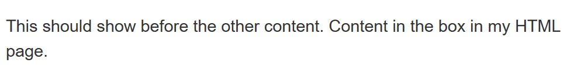
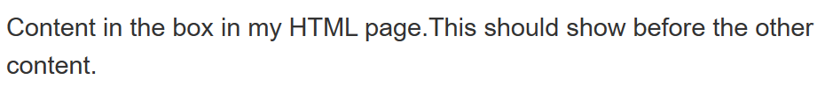

# 选择器

## 1. 通配符选择器

通配符选择器（`*`）可以匹配页面中的所有元素。

```css
* {
	color: red;
}
```

把页面中所有元素的文本颜色设置为红色。


## 2.标签选择器

标签选择器可以匹配页面中所有特定类型的元素。

```css
p {
	text-align: center;
}
```

将把页面中所有 `<p>` 元素的文本对齐方式设置为居中。


## 3. 类选择器

类选择器可以匹配页面中所有具有特定类的元素。

```css
.highlight {
	background-color: yellow;
}
```

把页面中所有类为 `highlight` 的元素的背景颜色设置为黄色。


使用 `class` 属性来指定元素的类：

```html
<div class="highlight">这是一个黄色背景的 div 元素。</div>
```


### 指向特定元素的类

建立一个指向**应用一个类**的特定元素。

```css
h1.highlight {
  color: white;
}
```

仅当一个h1标签被设置为highlight时，CSS规则才会生效。


### 多个类指向一个元素

仅当一个元素中包含了多个类，这些内容才会生效：

```css
.notebox {
  border: 4px solid #666;
  padding: .5em;
}

.notebox.warning {
  border-color: orange;
  font-weight: bold;
}

.notebox.danger {
  border-color: red;
  font-weight: bold;
}
```

.notebox.warning元素必须同时包含notebox和warning两个元素。

.notebox.danger元素必须同时包含notebox和danger两个元素。


## 4. ID选择器

ID选择器可以匹配页面中具有特定 ID 的元素。

```css
#myId {
	font-size: 20px;
}
```

把页面中 ID 为 `myId` 的元素的字体大小设置为 20 像素。


你可以使用 `id` 属性来指定元素的 ID：

```html
<div id="myId">这是一个字体大小为 20 像素的 div 元素。</div>
```


## id和class的使用

### class

同时设置多个类，只需要在 `class` 属性中用空格分隔每个类名即可。例如：

```html
<div class="class1 class2 class3">这是一个 div 元素，它有三个类：class1、class2 和 class3。</div>
```


### id

每个元素只能有一个唯一的 ID，不能设置多个ID，例如：

```html
<div id="myId">这是一个 div 元素，它的 ID 是 myId。</div>
```


### id and class

同时设置类（class）和 ID。例如：

```html
<div class="myClass" id="myId">这是一个 div 元素，它的类是 myClass，ID 是 myId。</div>
```

```html
<div class="myClass1 myClass2 myClass3" id="myId">这是一个 div 元素，它的类是 myClass1 myClass2 myClass3，ID 是 myId。</div>
```


# 属性选择器

这些选择器允许基于一个元素自身是否存在某个属性（例如href）或者基于各式不同的按属性值的匹配，来选取元素。

| 选择器          | 示例                            | 描述                                                         |
| :-------------- | :------------------------------ | :----------------------------------------------------------- |
| [attr]`         | `a[title]`                      | 匹配带有一个名为*attr*的属性的元素——方括号里的值。           |
| `[attr=value]`  | `a[href="https://example.com"]` | 匹配带有一个名为*attr*的属性的元素，其值正为*value*——引号中的字符串。 |
| `[attr~=value]` | `p[class~="special"]`           | 匹配带有一个名为*attr*的属性的元素，其值正为*value*，或者匹配带有一个*attr*属性的元素，其值有一个或者更多，至少有一个和*value*匹配。注意，在一列中的好几个值，是用空格隔开的。 |
| `[attr|=value]` | `div[lang|="zh"]`               | 匹配带有一个名为*attr*的属性的元素，其值可正为*value*，或者开始为*value*，后面紧随着一个连字符。 |

示例：

1. 选择a标签，且包含title属性的元素
2. 选择a标签，且包含href属性，且href属性的值为"https://example.com"的元素
3. 选择p标签，且包含class属性，且class属性中的值有**一个或多个**匹配special的元素。
4. 选择div标签，且包含lang属性，且lang属性中的值以zh开始的元素。


## 子字符串匹配选择器

这些选择器让更高级的属性的值的子字符串的匹配变得可行。

例如，如果你有`box-warning`和`box-error`类，想把开头为“box-”字符串的每个物件都匹配上的话，你可以用`[class^="box-"]`来把它们两个都选中。

| 选择器          | 示例                | 描述                                                         |
| :-------------- | :------------------ | :----------------------------------------------------------- |
| `[attr^=value]` | `li[class^="box-"]` | 匹配带有一个名为*attr*的属性的元素，其值开头为*value*子字符串。 |
| `[attr$=value]` | `li[class$="-box"]` | 匹配带有一个名为*attr*的属性的元素，其值结尾为*value*子字符串 |
| `[attr*=value]` | `li[class*="box"]`  | 匹配带有一个名为*attr*的属性的元素，其值的字符串中的任何地方，至少出现了一次*value*子字符串。 |


## 大小写敏感

HTML 中是大小写敏感的。如果想在大小写不敏感的情况下，匹配属性值的话，可以在闭合括号之前，使用`i`值。

```css
li[class="a"] {
  background-color: yellow;
}

li[class="a" i] {
  color: red;
}
```

匹配：

1. class为a的元素。
2. class为a或A的元素。


# 伪选择器


## 伪类选择器

伪类是选择器的一种，它用于选择处于特定状态的元素，比如当它们是这一**类型的第一个元素**时，或者是当**鼠标指针悬浮在元素上面**的时候。

`:first-child`一直选中第一个子元素，让一篇文章中的第一段变大加粗：

```css
article p:first-child {
  font-size: 120%;
  font-weight: bold;
}
```

```html
<article>
  <p>Veggies es bonus vobis, proinde vos postulo essum magis kohlrabi welsh onion daikon amaranth tatsoi tomatillo melon azuki bean garlic.
  </p>

  <p>Gumbo beet greens corn soko endive gumbo gourd. Parsley shallot courgette tatsoi pea sprouts fava bean collard greens dandelion okra wakame tomato. Dandelion cucumber earthnut pea peanut soko zucchini.     </p>
</article>
```

此时，即使在article新增一段话，可以自动调整。


## 用户伪行为类

一些伪类只会在用户以某种方式和文档交互的时候应用。

`:hover`——上面提到过，只会在用户将指针挪到元素上的时候才会激活，一般就是链接元素。
`:focus`——只会在用户使用键盘控制，选定元素的时候激活。


## 伪元素

伪元素开头为双冒号`::`。


如果你想选中一段的第一行，你可以把它用一个`<span>`元素包起来，然后使用元素选择器。

由于我们一般不会知道一行能放下多少单词/字符；因为屏幕宽度或者字体大小改变的时候这也会变；通过改变 HTML 的方式来可预测地这么做是不可能的。


`::first-line`伪元素选择器，选中一段的第一行：

```css
article p::first-line {
  font-size: 120%;
  font-weight: bold;
}
```

```html
<article>
  <p>Veggies es bonus vobis, proinde vos postulo essum magis kohlrabi welsh onion daikon amaranth tatsoi tomatillo melon azuki bean garlic.</p>

  <p>Gumbo beet greens corn soko endive gumbo gourd. Parsley shallot courgette tatsoi pea sprouts fava bean collard greens dandelion okra wakame tomato. Dandelion cucumber earthnut pea peanut soko zucchini.</p>
</article>
```


## 伪类和伪元素

第一段的第一行加粗，你需要把`:first-child`和`::first-line`选择器放到一起。

```css
article p:first-child::first-line {
  font-size: 120%;
  font-weight: bold;
}
```


## ::before 和::after 

能用这些插入一个文本字符串。


在**前面**插入内容：

```css
.box::before {
  content: "This should show before the other content. ";
}
```

```html
<p class="box">Content in the box in my HTML page.</p>
```

显示结果：




在**后面**插入内容：

```css
.box::after {
  content: "This should show before the other content. ";
}
```

```html
<p class="box">Content in the box in my HTML page.</p>
```

显示结果：




# 关系选择器

## 选择器列表

选择器列表，又称“并集选择器”，可以匹配多个选择器所选择的所有元素。

例如，`h1, h2, h3` 将选择所有 `h1`、`h2` 和 `h3` 元素。

CSS：

```css
h1, h2, h3 {
    color: blue;
}
```


HTML：

```css
<h1>这是一个蓝色的标题。</h1>
<h2>这也是一个蓝色的标题。</h2>
<h3>这还是一个蓝色的标题。</h3>
<p>这是一个没有颜色的段落。</p>
```


空格可以在逗号前或后，你可能还会发现如果每个选择器都另起一行，会更好读些：

```css
h1,
h2,
h3 {
  color: blue;
}
```


## 后代选择器

有三个类：`father`，`son1`，和 `son2`，使用后代选择器 `.father .son2 {}`。

选中所有作为 `.father` 类元素后代的 `.son2` 类元素，只要 `.son2` 类元素在 `.father` 类元素的内部（无论嵌套层次多深），它们都会被这个选择器选中。

```html
<div class="father">
  <div class="son1">
    <div class="son2"> <!-- 这个元素会被选中 -->
      Hello, world!
    </div>
  </div>
  <div class="son2"> <!-- 这个元素也会被选中 -->
    Hello, world!
  </div>
</div>
```


## 子代关系选择器

子代关系选择器是个大于号（`>`），只会在选择器选中直接子元素的时候匹配。继承关系上更远的后代则不会匹配。

```html
.father > .son2 {}

<div class="father">
  <div class="son1">
    <div class="son2"> <!-- 不会被选中 -->
      Hello, world!
    </div>
  </div>
  <div class="son2"> <!-- 这个元素也会被选中 -->
    Hello, world!
  </div>
</div>
```


## 邻接兄弟

选择某个元素紧随其后的元素，这两个元素必须有相同的父元素，并且第二个元素必须紧跟在第一个元素之后。

```html
.son1 + .son2 {}

<div class="father">
  <div class="son1">
    Hello, world!
  </div>
  <div class="son2">   <!-- 这个元素被选中 -->
    Hello, world!
  </div>
</div>
```


## 通用兄弟

如果想选中一个元素的兄弟元素，即使它们不直接相邻，还是可以使用通用兄弟关系选择器（`~`）。

```html
h1 ~ p {}

<article>
  <h1>A heading</h1>
  <p>I am a paragraph.</p> <!-- 这个元素被选中 -->
  <div>I am a div</div>
  <p>I am another paragraph.</p> <!-- 这个元素被选中 -->
</article>
```


