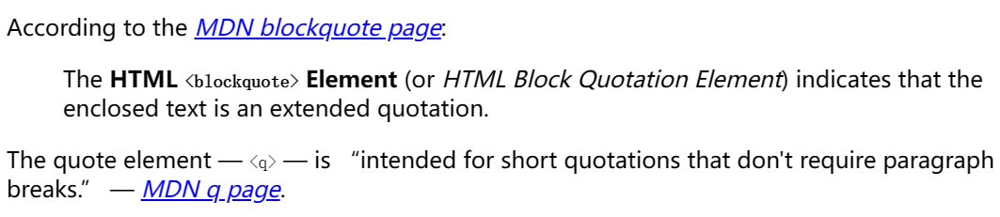
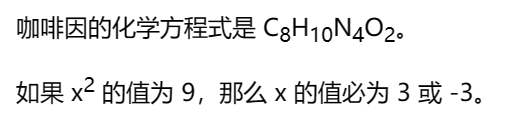
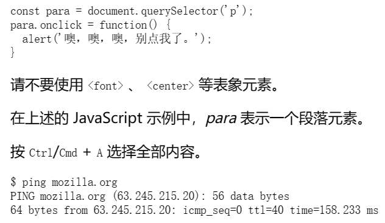

# 文本处理


##  空白

在 HTML 元素的内容中使用多少空格（包括一个或多个空白字符或换行），当渲染这些代码的时候，HTML 解释器会将连续出现的空白字符减少为一个单独的空格符。

下面的两个代码片段是等价的：

```html
<p>狗 狗 很 呆 萌。</p>

<p>狗 狗        很
         呆 萌。</p>
```


# 标题和段落

一共有六种标题元素标签——h1、h2、h3、h4、h5 和 h6。

`<h1>` 表示主标题，`<h2>` 表示二级子标题，`<h3>` 表示三级子标题，依此类推。


每个段落是通过 <p> 元素标签进行定义的：

```html
<p>我是一个段落，千真万确。</p>
```


## 编辑结构层次

在一个故事中，`<h1>` 表示故事的名字，`<h2>` 表示每个章节的标题，`<h3>` 表示每个章节下的子标题，以此类推。

```html
<h1>三国演义</h1>

<p>罗贯中</p>

<h2>第一回 宴桃园豪杰三结义 斩黄巾英雄首立功</h2>

<p>
  话说天下大势，分久必合，合久必分。周末七国分争，并入于秦。及秦灭之后，楚、汉分争，又并入于汉……
</p>

<h2>第二回 张翼德怒鞭督邮 何国舅谋诛宦竖</h2>

<p>
  且说董卓字仲颖，陇西临洮人也，官拜河东太守，自来骄傲。当日怠慢了玄德，张飞性发，便欲杀之……
</p>

<h3>却说张飞</h3>

<p>
  却说张飞饮了数杯闷酒，乘马从馆驿前过，见五六十个老人，皆在门前痛哭。飞问其故，众老人答曰：“督邮逼勒县吏，欲害刘公；我等皆来苦告，不得放入，反遭把门人赶打！”……
</p>
```


所涉及的元素具体代表什么，完全取决于作者编辑的内容，只要层次结构是合理的。

在创建此类结构时，只需要记住一些最佳实践：

- 最好只对每个页面使用一次 `<h1>`——这是顶级标题，所有其他标题位于层次结构中的下方。
- 请确保在层次结构中以正确的顺序使用标题。不要使用 `<h3>` 来表示副标题，后面再跟 `<h2>` 来表示二级副标题.
- 在现有的六个标题层次中，除非觉得有必要，否则应该争取每页使用不超过三个。


# 列表


## 无序列表

每份无序的清单从 `<ul>` 元素开始，需要包裹清单上所有被列出的项目。

用 `<li>` 元素把每个列出的项目单独包裹起来：

```html
<ul>
  <li>豆浆</li>
  <li>油条</li>
  <li>豆汁</li>
  <li>焦圈</li>
</ul>
```


## 有序列表

需要用 `<ol>` 元素将所有项目包裹，而不是 `<ul>`：

```html
<ol>
  <li>沿这条路走到头</li>
  <li>右转</li>
  <li>直行穿过第一个十字路口</li>
  <li>在第三个十字路口处左转</li>
  <li>继续走 300 米，学校就在你的右手边</li>
</ol>
```


## 嵌套列表

将一个列表嵌入到另一个列表是完全可以的。

你可能想让一些子项目列在一级项目之下。

```html
<ol>
	<li>目视前方</li>
	<li>操作方向盘</li>
		<ul>
			<li>如果你是左撇子，用左手</li>
			<li>如果你是右撇子，用右手</li>
		</ul>
</ol>
```


# 重点强调

在日常用语中，我们常常会加重某个字的读音，或者用加粗等方式突出某句话的重点。

HTML 也提供了相应的标签，用于标记某些文本，使其具有加粗、倾斜、下划线等效果。


## 强调

在口语表达中，我们有时会强调某些字，用来改变这句话的意思。同样地，在书面用语中，我们可以使用斜体字来达到同样的效果。


在 HTML 中我们用 `<em>`（emphasis）元素来标记这样的情况。这样做既可以让文档读起来更有趣，也可以被屏幕阅读器识别，并以不同的语调发出。

浏览器默认样式为斜体，但你不应该纯粹为了获得斜体风格而使用这个标签。如果仅仅为了获得斜体样式而不增加语义辅助，你应该使用 `<span>` 元素和一些 CSS，或者是 `<i>` 元素（见下文）。

```html
<p>我很<em>庆幸</em>你没有<em>迟到</em>。</p>
```


## 强烈的重要性

为了强调重要的词，在口语方面我们往往用重音强调，在书面用语中则是用粗体字来达到强调的效果。


在 HTML 中我们用 `<strong>`（strong importance）元素来标记这样的情况。

使文档更有用之外，也可以被屏幕阅读器识别，并以不同的语调发出。

浏览器默认样式为粗体，但你不应该纯粹为了获得粗体风格而使用这个标签。如果仅仅为了获得粗体样式而不增加语义辅助，你应该使用 `<span>` 元素和一些 CSS，或者是 `<b>` 元素（见下文）。

```html
<p>就指望你了，千万<strong>不要</strong>迟到！</p>
```


## 斜体字、粗体字、下划线

HTML5 重新定义了 `<b>`、`<i>` 和 `<u>`，赋予了它们新的语义角色。


最好的经验法则是：

只有在没有更合适的元素时，才适合使用 `<b>`、`<i>` 或 `<u>` 来表达传统上用粗体、斜体或下划线表达的意思；

而通常情况下是有更合适的元素可供使用的。`<strong>`、`<em>`、`<mark>` 或 `<span>` 可能是更加合适的选择。


始终保持无障碍的开发理念。斜体的概念对使用屏幕阅读器的人或使用拉丁字母以外的书写系统的人没有什么帮助。

- `<i>` 被用来传达传统上用斜体表达的意义：外国文字，分类名称，技术术语，一种思想……
- `<b>` 被用来传达传统上用粗体表达的意义：关键字，产品名称，引导句……
- `<u>` 被用来传达传统上用下划线表达的意义：专有名词，拼写错误……


注意：人们强烈地将下划线与超链接联系起来。因此，在网页中，最好只给链接加下划线。


## 描述列表

这种列表的目的是标记一组项目及其相关描述，例如术语和定义，或者是问题和答案等。

- `<dl>`: 描述列表元素，用于定义一个包含术语定义以及描述的列表。
- `<dt>`: 定义项目或名字，给出了术语名。
- `<dd>`: 描述每一个项目或名字，给出了术语的**一个或多个**定义（描述）。


示例：

```html
<dl>
  <dt>内心独白</dt>
  <dd>
    戏剧中，某个角色对自己的内心活动或感受进行念白表演，这些台词只面向观众，而其他角色不会听到。
  </dd>
  <dt>语言独白</dt>
  <dd>
    戏剧中，某个角色把自己的想法直接进行念白表演，观众和其他角色都可以听到。
  </dd>
  <dt>旁白</dt>
  <dd>
    戏剧中，为渲染幽默或戏剧性效果而进行的场景之外的补充注释念白，只面向观众，内容一般都是角色的感受、想法、以及一些背景信息等。
  </dd>
  <dd>
    写作中，指与当前主题相关的一段内容，通常不适于直接置于内容主线中，因此置于附近的其他位置（通常位于主线内容旁边一个文本框内）。
  </dd>
</dl>
```


## 引用

`<blockquote>`: 块级引用元素，表示所包含的文本是扩展引用。

通常，这通过缩进在视觉上呈现。可以使用cite属性提供引用信息的源文档或消息的URL。

例如：

```html
<blockquote cite="https://datatracker.ietf.org/doc/html/rfc1149">
  <p>鸟类运输可以提供高延迟、低吞吐量和低高度的服务。</p>
</blockquote>
```


`<q>`: 行内引用元素，用于引用较短的内容。

使用后会自动为文字的左右两边加上双引号，可以使用cite属性提供引用信息的源文档或消息的URL。

例如：

```html
<p><q>作者李白</q></p>
```


`<cite>`: 表示引用内容的标题，使用后会自动将文字改成斜体

例如：

```html
<p><cite>唐诗三百首</cite></p>
```


文章示例：

```html
<p>
  According to the
  <a href="/zh-CN/docs/Web/HTML/Element/blockquote">
    <cite>MDN blockquote page</cite></a
  >:
</p>

<blockquote
  cite="https://developer.mozilla.org/zh-CN/docs/Web/HTML/Element/blockquote">
  <p>
    The <strong>HTML <code>&lt;blockquote&gt;</code> Element</strong> (or
    <em>HTML Block Quotation Element</em>) indicates that the enclosed text is
    an extended quotation.
  </p>
</blockquote>

<p>
  The quote element — <code>&lt;q&gt;</code> — is
  <q cite="https://developer.mozilla.org/zh-CN/docs/Web/HTML/Element/q"
    >intended for short quotations that don't require paragraph breaks.</q
  >
  — <a href="/zh-CN/docs/Web/HTML/Element/q"> <cite>MDN q page</cite></a
  >.
</p>
```

显示效果：




## 缩略语

`<abbr>`：它常被用来包裹一个缩略语或缩写，并且提供缩写的解释。

```html
<p> <abbr title="美国国家航空航天局">NASA</abbr> 做了一些动人心弦的事情。</p>
```

显示效果：


注意：当鼠标放置在“NASA”上时会出现“美国国家航空航天局”


## 标记联系方式

HTML 有个用于标记联系方式的元素——`<address>`。它仅仅包含联系方式，例如：

```html
<address>Chris Mills, Manchester, The Grim North, UK</address>
```


其中可以包含更复杂的标记和其他形式的联系方式，如：

```html
<address>
  <p>
    Chris Mills<br />
    Manchester<br />
    The Grim North<br />
    UK
  </p>

  <ul>
    <li>Tel: 01234 567 890</li>
    <li>Email: me@grim-north.co.uk</li>
  </ul>
</address>
```

显示效果：


注意，如果链接的页面包含了联系信息，像下面这样也是可以的：

```html
<address>
  由 <a href="../authors/chris-mills/">Chris Mills</a> 编写的页面。
</address>
```


## 上标和下标

`<sup>` 和 `<sub> `元素用于上标和下标。

```html
<p>
  咖啡因的化学方程式是 C<sub>8</sub>H<sub>10</sub>N<sub>4</sub>O<sub>2</sub>。
</p>
<p>如果 x<sup>2</sup> 的值为 9，那么 x 的值必为 3 或 -3。</p>
```

显示效果：




展示计算机代码

`<code>`：用于标记计算机通用代码。

`<pre>`：用于保留空白字符（通常用于代码块）——如果文本中使用了缩进或多余的空白，浏览器将忽略它，你将不会在呈现的页面上看到它。但是，如果你将文本包含在 `<pre></pre>` 标签中，那么空白将会以与你在文本编辑器中看到的相同的方式渲染出来。
`<var>`：用于标记具体变量名。
`<kbd>`：用于标记输入电脑的键盘（或其他类型）输入。
`<samp>`：用于标记计算机程序的输出。


示例：

```html
<pre><code>const para = document.querySelector('p');

para.onclick = function() {
  alert('噢，噢，噢，别点我了。');
}</code></pre>

<p>
  请不要使用 <code>&lt;font&gt;</code> 、
  <code>&lt;center&gt;</code> 等表象元素。
</p>

<p>在上述的 JavaScript 示例中，<var>para</var> 表示一个段落元素。</p>

<p>按 <kbd>Ctrl</kbd>/<kbd>Cmd</kbd> + <kbd>A</kbd> 选择全部内容。</p>

<pre>$ <kbd>ping mozilla.org</kbd>
<samp>PING mozilla.org (63.245.215.20): 56 data bytes
64 bytes from 63.245.215.20: icmp_seq=0 ttl=40 time=158.233 ms</samp></pre>
```

显示效果：




## 标记时间和日期

时间和日期标记为可供机器识别的格式的 `<time>` 元素。

```html
<time datetime="2016-01-20">2016 年 1 月 20 日</time>
```


界上有许多种书写日期的格式，上边的日期可能被写成：

- 20 January 2016
- 20th January 2016
- Jan 20 2016
- 20/06/16
- 06/20/16


这些不同的格式不容易被电脑识别。

假如你想自动抓取页面上所有事件的日期并将它们插入到日历中，`<time>` 元素允许你附上清晰的、可被机器识别的时间或日期来实现这种需求。


许多其他支持的格式：

```html
<!-- 标准简单日期 -->
<time datetime="2016-01-20">20 January 2016</time>
<!-- 只包含年份和月份-->
<time datetime="2016-01">January 2016</time>
<!-- 只包含月份和日期 -->
<time datetime="01-20">20 January</time>
<!-- 只包含时间，小时和分钟数 -->
<time datetime="19:30">19:30</time>
<!-- 还可包含秒和毫秒 -->
<time datetime="19:30:01.856">19:30:01.856</time>
<!-- 日期和时间 -->
<time datetime="2016-01-20T19:30">7.30pm, 20 January 2016</time>
<!-- 含有时区偏移值的日期时间 -->
<time datetime="2016-01-20T19:30+01:00"
  >7.30pm, 20 January 2016 is 8.30pm in France</time
>
<!-- 提及特定周 -->
<time datetime="2016-W04">The fourth week of 2016</time>
```

