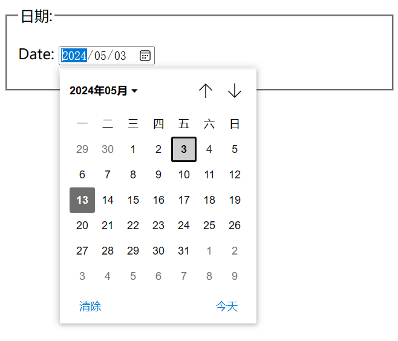
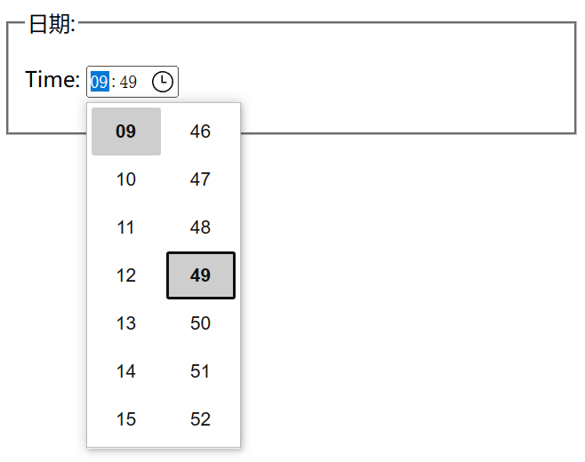
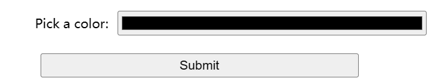
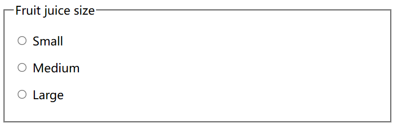
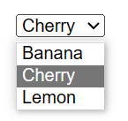
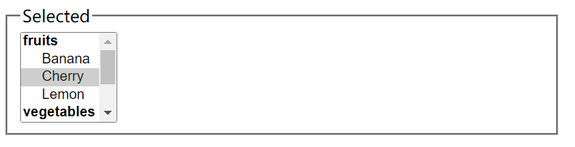
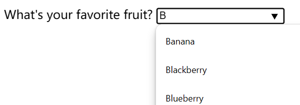
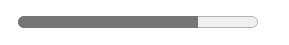
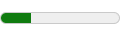
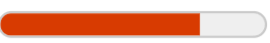

# 表单

## form元素

所有表单都以一个 `<form>` 元素开始：

```html
<form action="/my-handling-form-page" method="post"></form>
```

它的所有属性都是可选的，但实践中最好至少要设置 `action` 属性和 `method` 属性。

- action 属性定义了在提交表单时，应该把所收集的数据送给谁（URL）去处理。
- method 属性定义了发送数据的 HTTP 方法（通常是 get 或 post）。


## label元素

`<label>`元素为相关的表单控件提供一个**描述性的文本**，**让用户明白**与之关联的**表单控件的用途**，特别是对于那些依赖屏幕阅读器的**视觉障碍用户**。


### 用途

- **点击交互**：当用户点击`<label>`元素内的文本时，浏览器会自动将焦点转移到与之关联的表单控件上。这对于没有鼠标或者使用触摸屏的用户来说是非常便利的。
- **键盘导航**：它也帮助键盘导航的用户，使得用户可以通过Tab键直接定位到与标签关联的输入字段。


### 用法

- 通过在`<label>`标签中使用`for`属性，并将其值设置为相关表单控件的`id`属性值。

    ```html
    <label for="username">用户名：</label>
    <input type="text" id="username">
    ```

    

- 将表单控件放置在`<label>`标签内部，此时不再需要`for`属性。（这种方式可能导致屏幕阅读器无法正常识别）。

    ```html
    <label>邮箱：<input type="email"></label>
    ```


### form属性

在HTML5中，`<label>`元素新增了一个`form`属性，允许你指定此标签属于哪一个或哪几个表单（通过表单的id列表，以空格分隔）。

这在`<label>`和关联的表单控件不在同一个`<form>`标签内时特别有用。

```html
<label form="login" for="username">UserName:</label>

<form id="login">
	<input id="username" type="text" name="username" />
</form>
```


# input元素

## 文本类

文本输入框是最基本的表单小部件。这是一种非常方便的方式，可以让用户输入任何类型的数据。

所有文本框都有一些通用规范：

- 它们可以被标记为 **readonly**（用户不能修改输入值）甚至是 **disabled**（输入值永远不会与表单数据的其余部分一起发送）。
- 它们可以有一个 **placeholder**；这是文本输入框中出现的文本，用来简略描述输入框的目的。
- 它们可以使用 **size**（框的物理尺寸）和 **maxlength（**可以输入的最大字符数）进行限制。
- 如果浏览器支持的话，它们可以从拼写检查（使用 **spellcheck** 属性）中获益。


### text

使用 type 属性值被设置为 text 的 `<input>` 元素创建一个单行文本框（同样的，如果你不提供 type 属性，该属性将被默认设置为 text）。

```html
<label for="name">姓名：</label>
<input type="text" id="name" name="name">
```


注意：

在你指定的 `type` 属性的值在浏览器中是未知的情况下（比如你指定 type="date"，但是浏览器不支持原生日期选择器），属性值也将会回落到 text。

单行文本框只有一个真正的约束：如果你输入带有换行符的文本，浏览器会在发送数据之前删除这些换行符。


### email

`email`类型用于输入电子邮件地址，浏览器会对其进行基本的格式验证，比如检查是否包含`@`符号以及`.`（点）的存在和位置是否符合电子邮件地址的基本结构。

```html
<label for="email">邮箱：</label>
<input type="email" id="email" name="email">
```

如果输入内容格式错误则无法提交，且会进行提示：


**multiple属性**

搭配使用 multiple 属性，以允许在同一个 email 输入框中输入多个电子邮件地址，以英文逗号分隔：

```html
<input type="email" id="email" name="email" multiple />
```

在某些设备上——特别是像智能手机这样具有动态键盘的触摸设备——可能会出现一个包括 `@` 键的更适合于输入电子邮件地址的虚拟键盘。


注意：在默认限制条件下，`a@b` 也是一个合法的电子邮件地址，因为 `email` input 类型默认也允许内部网络的电子邮件地址。


### url

在 `type` 属性值中使用 `url`，即可创建一个用于输入网址的文本字段：

```html
<input type="url" id="url" name="url" />
```

它为字段添加了特殊的验证约束。浏览器会在没有协议（例如 `http:`）输入或网址格式不对的情况下报告错误。在具有动态键盘的设备上，键盘通常会显示部分或全部冒号、句号和正斜杠作为默认键。


### password

通过设置 type 属性值为 `password` 来设置该类型框：

```html
<input type="password" id="pwd" name="pwd" />
```

它不会为输入的文本添加任何特殊的约束，但是它会模糊输入到字段中的值（例如，用点或星号），这样它就不能被其他人读取。


## 数字和范围


### number

在 `type` 属性值中使用 `number`.这个控件外观与文本域类似，并通常以旋转器（spinner）的形式提供按钮来增加和减少控件的值。

使用 `min` 和 `max` 属性控制允许输入的最小值和最大值。


`step` 属性来设定每次按下 spinner 按钮增加或减少的值。

- 默认认情况下，number input 类型只允许整数值输入；
- 为了允许浮点数输入，要指定 `step="any"`；
- 省略了此值，step 会默认为 1，意味着只有自然数是有效的输入。


从 `1` 到 `10` 之间选择值的数字选择器，且单击一次按钮所增长或减少的值为 `2`。

```html
<input type="number" name="age" id="age" min="1" max="10" step="2" />
```


可从 `0` 到 `1` 之间选择值得数字选择器，且单击一次按钮所增长或减少的值为 `0.01`。

```html
<input type="number" name="change" id="pennies" min="0" max="1" step="0.01" />
```


在有动态键盘的设备上，一般会显示数字键盘。


### range

在 `<input>` 元素中使用 range 作为属性 type 的值，就可以创建一个滑块，滑块可以通过鼠标、触摸，或用键盘的方向键移动。

分别配置 min、max 、value 和 step 属性来设置滑块的最小值、最大值、默认值和增量值。


基本的 HTML 代码：

```html
<label for="price">Choose a maximum house price: </label>
<input
  type="range"
  name="price"
  id="price"
  min="50000"
  max="500000"
  step="100"
  value="250000" />
<output class="price-output" for="price"></output>
```

取值为 `50000` 到 `500000` 之间的滑块，每次的增量值是 100，`value` 属性设定了此滑块的默认值为 `250000`。


滑块不提供任何种类的视觉反馈来说明当前的值，可以使用 `<output>` 元素输出当前值，它可以指定 `for` 属性，允许你将它与输出值来自的一个或多个元素联系起来。

要真正显示当前值，并在其变化时更新，必须使用 JavaScript ：

```javascript
const price = document.querySelector("#price");
const output = document.querySelector(".price-output");

output.textContent = price.value;

price.addEventListener("input", () => {
  output.textContent = price.value;
});
```


从使用上来说，滑块的准确性不如文本字段。因此，它们被用来挑选*精确值*不一定那么重要的数字。

例如：你在买房网站等网站上经常看到这种情况，你想设置一个最高的房产价格来进行过滤。


## 日期和时间

日期和时间控件可由 `<input>` 元素和一个合适的 type 属性值来创建，该值取决于要收集的类型（日期、时间、还是以上全部）。

### date

`<input type="date">` 创建了显示和选择带有**年、月、日**信息的控件。

```html
<input type="date" name="date" id="date" />
```




### month

`<input type="month">` 创建了显示和选择带有年份信息的某个月的控件。

```html
<input type="month" name="month" id="month" />
```


### week

`<input type="week">` 创建了显示和选择一年中特定编号周的控件。

一周以周一开始，一直运行到周日结束。另外，每年的第一周总会包含那一年首个星期四，其中可能不包括当年的第一天，也可能包括前一年的最后几天。

```html
<input type="week" name="week" id="week" />
```


### time

`<input type="time">` 创建了显示和选择时间的控件。

时间可能会以 12 小时制显示，但一定会以 24 小时制形式返回。

```html
<input type="time" name="time" id="time" />
```




### datetime-local

`<input type="datetime-local">` 创建了显示和选择一个没有特定时区信息的日期和时间的控件。

```html
<input type="datetime-local" name="datetime" id="datetime" />
```


### 限制日期/时间值
所有的日期和时间控件总可以由 min 和 max 属性控制，可由 step 属性进一步做控制，具体值随着 input 类型的不同而产生变化。

```html
<label for="myDate">When are you available this summer?</label>
<input
  type="date"
  name="myDate"
  min="2013-06-01"
  max="2013-08-31"
  step="7"
  id="myDate" />
```


`step`属性用于定义日期选择器中可选日期的间隔。具体到日期类型，`step`的值表示日期间隔的天数。在您的示例中，`step="7"`意味着用户只能选择以7天为间隔的日期，通常是每周的同一天。

换句话说，当设置了`step="7"`之后，日期选择器将只显示和可选每周的某一天，比如每周的周一。如果最小日期是2013-06-01（周六），那么用户可以选择的日期将是6月1日、6月8日、6月15日等，都是星期六。


## 选择类

大多数表单部件，一旦表单提交，所有具有 name 属性的小部件都会被发送，即使没有任何值被填。


对于可选中项，只有在勾选时才发送它们的值：

- 如果他们没有被勾选，就不会发送任何东西，甚至连他们的名字也没有；
- 如果它们被勾选且没有提供值（value）时，将会发送名字和缺省值 `on`。


### checkbox

`type` 属性值为 checkbox 的 `<input>` 元素来创建一个**复选框**

```html
<input type="checkbox" id="questionOne" name="subscribe" value="yes" checked />
```

复选框元素应该使用具有相同值的 `name` 属性，包含 `checked` 属性使复选框在页面加载时自动被选中。


**示例：**

```html
<fieldset>
	<legend> Authorize </legend>
	<p>
		<input id="Name" type="checkbox" name="Authorize" value="Name" checked />
		<label for="Name">Name</label>
	</p>
	<p>
		<input id="Age" type="checkbox" name="Authorize" value="Age" />
		<label for="Age">Age</label>
	</p>
	<p>
		<input id="Gender" type="checkbox" name="Authorize" value="Gender" checked />
		<label for="Gender">Gender</label>
	</p>
</fieldset>
```

---


### radio

`type` 属性值为 radio 的 `<input>` 元素来创建一个单选按钮

```html
<input type="radio" id="soup" name="meal" checked />
```


如果它们的 `name` 属性共享相同的值，那么它们将被认为属于同一组的按钮。

同一组中只有一个按钮可以同时被选；这意味着当其中一个被选中时，所有其他的都将自动未选中。

如果没有选中任何一个，那么整个单选按钮池就被认为处于未知状态，并且没有以表单的形式发送任何值。


示例：

```html
<fieldset>
	<legend> Login Method </legend>
	<p>
		<input id="Wechat" type="radio" name="LoginMethod" value="WeChat" checked />
		<label for="Wechat">WeChat</label>
	</p>
	<p>
		<input id="QQ" type="radio" name="LoginMethod" value="QQ" />
		<label for="QQ">QQ</label>
	</p>
</fieldset>
```

---


### file

以使用 `<input>` 元素，将它的 type 属性设置为 file。被接受的文件类型可以使用 accept 属性来约束，添加 `multiple` 属性允许选中多个文件。


#### 示例

在本例中，创建一个文件选择器，请求图形图像文件。在本例中，允许用户选择多个文件。

```html
<input type="file" name="file" id="file" accept="image/*" multiple />
```


在一些移动终端上，文件选择器可以访问由设备相机和麦克风直接获取的图片、视频、音频。我们只需要这样设置 `accept` 属性即可（分别对应相机捕获的图片、视频和麦克风获取的音频）：

```html
<input type="file" accept="image/*;capture=camera" />
<input type="file" accept="video/*;capture=camcorder" />
<input type="file" accept="audio/*;capture=microphone" />
```


## 特殊类

### search

在页面和应用程序上创建搜索框，将 `type` 属性设置为 `search` 就可以使用这种控件：

```html
<input type="search" id="search" name="search" />
```


`text` 字段和 `search` 字段的主要区别是浏览器赋予它们的外观显示。通常情况下，`search` 字段拥有圆角边框，有时会显示“Ⓧ”标志，当点击它时会清除输入框。

在动态键盘设备上，键盘的回车键会显示“**search**”，或显示为放大镜图标。


在一些浏览器中的样式


注意：`search` 字段的值可以自动地保存下来，在同一网站的自动完成框中复用输入，这样的特性倾向于在大多数现代浏览器中自动进行。


### tel

在 `type` 属性中使用 `tel` 值，即可创建一个专门用于输入电话号码的文本域：

```html
<input type="tel" id="tel" name="tel" />
```


当使用带有动态键盘的移动设备访问带有 `type="tel"` 的表单时，大多数设备会显示数字键盘。这意味着只要数字键盘有用，这种类型就很有用，而且不只是用于电话号码。


由于世界各地的电话号码格式多种多样，这种类型的字段对用户输入的值没有任何限制（这意味着它可能包括字母等非数字值）。


### color

颜色总是有点难处理。有许多方法来表达它们，如 RGB 值（十进制或十六进制）、HSL 值、关键词等。

用于输入颜色的控件可以由 `type` 为 `color` 的 `<input>` 元素创建：

```html
<input type="color" name="color" id="color" />
```


在支持的情况下，点击一个颜色控件将倾向于显示操作系统的默认颜色选择功能，以便你真正做出选择。




### image

图像按钮是使用 `type` 属性值设置为 `image`  的 `<input>` 元素创建的。

控件渲染的方式与 `` 几乎完全相同。只是在用户点击它时，图像按钮的行为与提交（submit）按钮相同。

这个元素支持与 `` 元素相同的属性，和其他表单按钮支持的所有属性。

```html
<input type="image" alt="Click me!" src="my-img.png" width="80" height="30" />
```


如果使用图像按钮来提交表单，这个小部件不会提交它的值；而是提交在图像上单击处的 X 和 Y 坐标（坐标是相对于图像的，这意味着图像的左上角表示坐标 (0, 0)），坐标被发送为两个键/值对：

- X 值键是 name 属性的值，后面是字符串“.x”。
- Y 值键是 name 属性的值，后面是字符串“.y”。


例如，当你点击这个小部件图像坐标为 (123,456) 的位置时，它将会通过 `get` 方法提交。你可以看到类似的 URL：

```
http://foo.com?pos.x=123&pos.y=456
```


### hidden

它被用于创建对用户不可见的表单部件，但在发送表单时，会与其他的表单数据一起被发送到服务器。

例如，你可能希望向服务器提交一个时间戳，说明订单是何时产生的。因为它是隐藏的，所以用户看不到也不能简单地修改该值，它将永远不会获得焦点，屏幕阅读器也不会注意到它。

```html
<input type="hidden" id="timestamp" name="timestamp" value="1286705410" />
```

如果你创建了这样一个元素，就需要设置它的 `name` 和 `value` 属性。元素的值可以通过 JavaScript 动态设置。


# input按钮和buttom元素

- **submit**：将表单数据发送到服务器。对于 `<button>` 元素，省略 type 属性（或是一个无效的 type 值）的结果就是一个提交按钮。
- **reset**：将所有表单小部件重新设置为它们的默认值。
- **image**：没有自动生效的按钮，但是可以使用 JavaScript 代码进行定制。
- **buttom元素**：`<button>` 元素。它也带有 submit、reset 和 button 这几个 type 属性，与 `<input>` 的三种按钮行为一致。它们之间的主要区别在于 `<button>` 元素更易于设置样式。


每一种与 `<button>` 对应类型等价的 `<input>` 类型的示例：

### submit

```html
<button type="submit">This is a <strong>submit button</strong></button>

<input type="submit" value="This is a submit button" />
```


### reset

```html
<button type="reset">This is a <strong>reset button</strong></button>

<input type="reset" value="This is a reset button" />
```


### anonymous

```html
<button type="button">This is an <strong>anonymous button</strong></button>

<input type="button" value="This is an anonymous button" />
```


`<button>` 元素允许你在它们的标签中使用 HTML 内容，这些内容被插入到 `<button>` 开始和结束的标签之间。另一方面，`<input>` 元素是空元素；它显示的内容需要插入到 `value` 属性中，因此只接受纯文本内容。


# `<fieldset>` 和 `<legend>` 元素

`<fieldset>`元素是一种方便的用于创建具有相同目的的小部件组的方式，出于样式和语义目的。你可以在`<fieldset>`开口标签后加上一个 `<legend>`元素来给`<fieldset>` 标上标签。 `<legend>`的文本内容正式地描述了`<fieldset>`里所含有部件的用途。


示例：

```html
<form>
  <fieldset>
    <legend>Fruit juice size</legend>
    <p>
      <input type="radio" name="size" id="size_1" value="small" />
      <label for="size_1">Small</label>
    </p>
    <p>
      <input type="radio" name="size" id="size_2" value="medium" />
      <label for="size_2">Medium</label>
    </p>
    <p>
      <input type="radio" name="size" id="size_3" value="large" />
      <label for="size_3">Large</label>
    </p>
  </fieldset>
</form>
```

---




# 多行文本域

多行文本域使用 `<textarea>` 元素指定，而不是使用 `<input>` 元素。

```html
<textarea cols="30" rows="8"></textarea>
```


`<textarea>` 元素中用户**可以**在要提交的数据中**包含硬换行**（如按下回车键产生）。

`<textarea>` 也需要关闭标签，其中要包含的**默认文字**需要放在开闭**标签之间**。而input的默认文字在value属性中指定。

即使可以将任何东西放入到 `<textarea>` 元素中，甚至可以包含其他 HTML 元素、CSS 和 JavaScript，由于该元素的特性，这些内容都将**以纯文本的形式渲染**。

在视觉上，输入的文字会换行，并且表单空间的大小是可调的。现代浏览器会提供拖动手柄，你可以通过拖拽来放大或缩小文本区的大小。


在一些浏览器中的渲染效果：


## 控制多行渲染

`<textarea>` 接受三种属性来控制其多行渲染行为：

- **cols**：指定文本控件的可见宽度（列），单位为字符的宽度。这实际上是起始宽度，因为它可以通过调整 <textarea> 的大小来改变，也可以用 CSS 重写。如果没有指定，默认值是 20。
- **rows**：指定文本控件的可见行数。这实际上是起始高度，因为它可以通过调整 <textarea> 的大小来改变，也可以用 CSS 重写。如果没有指定，默认值是 2。
- **wrap**：指定如何控制文本换行。取值可能为 soft（默认值），意味着**提交的文字没有换行**，而浏览器中**渲染的文字有换行**；hard（使用此属性必须指定 `cols` 的值），意味着**提交**的文字和浏览器中**渲染**的文字**都有换行**；和 off，**停止任何换行行为**。


## 控制文本域可缩放性

`resize` 属性控制：

- `both`：默认值——允许横向和纵向缩放行为。
- `horizontal`：只允许横向水平缩放行为。
- `vertical`：只允许纵向竖直缩放行为。
- `none`：不允许缩放行为。
- `block` 和 `inline`：实验性的值，仅允许以 `block` 或 `inline` 方向缩放，如何变化取决于文字的方向，请参阅处理不同文字方向以了解更多内容。


# 下拉控件

下拉菜单是一种简单地让用户从许多不同选项中进行选择的控件，不占用用户界面太多空间。

HTML 有两种下拉内容：一种是**选择框**、另外一种是**自动补全框**。


选择框
一个简单的选择框是由 `<select>` 元素及一个或多个 `<option>` 子元素构成的，每个子元素指定了选择框的可能取值。

可以给某一个option元素设置selected属性，使其成为默认值。

```html
<select id="simple" name="simple">
  <option>Banana</option>
  <option selected>Cherry</option>
  <option>Lemon</option>
</select>
```

---




## 使用 optgroup

`<optgroup>`中可以嵌套`<option>`元素，以在视觉上关联一组取值：

注意：`<optgroup>`是无法被选中的

```html
<select id="groups" name="groups">
  <optgroup label="fruits">
    <option>Banana</option>
    <option selected>Cherry</option>
    <option>Lemon</option>
  </optgroup>
  <optgroup label="vegetables">
    <option>Carrot</option>
    <option>Eggplant</option>
    <option>Potato</option>
  </optgroup>
</select>
```

---


如果一个 `<option>` 元素明确设置了 `value` 属性，当表单提交时也会提交那个选项对应的值。如果像上面的例子那样省略了 `value` 属性，`<option>` 元素的内容会作为提交的值。

所以 `value` 属性并不是必需的，然而你可能需要向服务器中发送与视觉所见相比缩短或者改变过的值。

```html
<select id="simple" name="simple">
  <option value="banana">Big, beautiful yellow banana</option>
  <option value="cherry">Succulent, juicy cherry</option>
  <option value="lemon">Sharp, powerful lemon</option>
</select>
```


其他：通过 `size` 属性控制在选择框不处于聚焦状态时，可见选项的数量。


## 多选选择框

为 `<select>` 元素添加 `multiple` 属性，允许用户使用操作系统提供的机制选择多个值（如按下 Cmd/Ctrl 并先后单击多个值）。

```html
<select id="multi" name="multi" multiple size="5">
  <optgroup label="fruits">
    <option>Banana</option>
    <option selected>Cherry</option>
    <option>Lemon</option>
  </optgroup>
  <optgroup label="vegetables">
    <option>Carrot</option>
    <option>Eggplant</option>
    <option>Potato</option>
  </optgroup>
</select>
```

---




## 自动补全框

首先需要一个input元素作为输入框（如 `text` 或 `email` 输入类型）。

其次，通过`<datalist>` 元素以及 `<option>` 子元素，为表单项提供推荐的自动补全值。

`<datalist>` 元素需要指定一个 `id`，然后在input元素中通过list属性指定该id。


### 基础示例

```html
<label for="myFruit">What's your favorite fruit?</label>
<input type="text" name="myFruit" id="myFruit" list="mySuggestion" />
<datalist id="mySuggestion">
  <option>Apple</option>
  <option>Banana</option>
  <option>Blackberry</option>
  <option>Blueberry</option>
  <option>Lemon</option>
  <option>Lychee</option>
  <option>Peach</option>
  <option>Pear</option>
</datalist>
```

---





### Datalist 支持和回退

几乎所有浏览器支持 datalist，但是如果你仍然需要给诸如 IE 10 及以前的旧版浏览器提供支持，有一个提供回退的小窍门：

```html
<label for="myFruit">What is your favorite fruit? (With fallback)</label>
<input type="text" id="myFruit" name="fruit" list="fruitList" />

<datalist id="fruitList">
  <label for="suggestion">or pick a fruit</label>
  <select id="suggestion" name="altFruit">
    <option>Apple</option>
    <option>Banana</option>
    <option>Blackberry</option>
    <option>Blueberry</option>
    <option>Lemon</option>
    <option>Lychee</option>
    <option>Peach</option>
    <option>Pear</option>
  </select>
</datalist>
```

支持 `<datalist>` 元素的浏览器会忽略任何非 `<option>` 元素，而 datalist 仍然会按期工作。


不支持 `<datalist>` 元素的旧浏览器，会忽略掉 `<datalist>` 元素。此时 `<datalist>` 元素中的`label`元素会生效，`select`也会去绑定`option`元素。

以下屏幕截图显示了在 Safari 6 中 datalist 回退的渲染效果：


注意：如果要使用这个回退处理，确保服务器端同时收集了 `<input>` 和 `<select>` 的值。


# 计量器和进度条

## 进度条

进度条表示一个随时间变化的数值，最高可以达到 `max` 属性所指定的最大值。这样的条是使用 `<progress>` 元素创建出来的。

```html
<progress max="100" value="75">75/100</progress>
```




这可以实现任何需要进度报告的事情，例如下载文件的百分比，或问卷调查中填写过问题的数量。

`<progress>` 元素中的内容是供不支持此元素浏览器进行回退，以及给屏幕阅读器提供发音材料的机制。


## 计量器

`<meter>`元素用于表示一个特定范围内的度量，其表现形式可以是进度条或者类似的可视化展示。

常会用到`min`、`max`、`low`、`high`这几个属性来划分度量值的范围并赋予其意义。下面是这些属性之间的关系和各自的作用：

- `min`: 定义了度量范围的最小值。
- `max`: 定义了度量范围的最大值。
- `low`: 用来分割“下半部分”范围和“中间部分”范围的阈值。
- `high`: 用来分割“中间部分”范围和“上半部分”范围的阈值。


四者的关系总结如下：

- `min` <= `low` < `high` <= `max`
- 整个数值范围被分为三个区域：
    - **下半部分**：从`min`到`low`（包含两者）。
    - **中间部分**：从`low`到`high`（不包含两者）。
    - **上半部分**：从`high`到`max`（包含两者）。


`optimum` 值定义了 `<meter>` 元素的最佳值，optimum值处于不同的部分，会有不同的结果：

- **在上半部分范围内**：**下半部分**范围被认为是**最差部分**，**中间部分**范围被认为是**平均部分**，而**上半部分**范围被认为是**首选部分**。
- **在中间部分范围内**：**下半部分**范围被认为是**平均部分**，**中间部分**范围被认为是**首选部分**，而**上半部分**范围也被认为是**平均部分**。
- **在下半部分范围内**：**下半部分**范围被认为是**首选部分**，**中间部分**范围被认为是**平均部分**，而**上半部分**范围被认为是最**差的部分**。


所有实现了 `<meter>` 元素的浏览器使用这些值来改变计量器的颜色：

- 如果当前值位于首选范围，则计量器显示为绿色。
- 如果当前值位于平均范围，则计量器显示为黄色。
- 如果当前值位于最差范围，则计量器显示为红色。


### 示例

```html
<meter min="0" max="100" value="25" low="33" high="66" optimum="1">1</meter>
```



---

```html
<meter min="0" max="100" value="50" low="33" high="66" optimum="1">1</meter>
```


---

```html
<meter min="0" max="100" value="75" low="33" high="66" optimum="1">1</meter>
```




