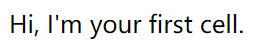
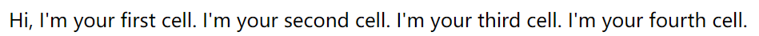
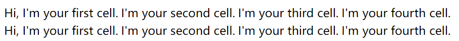
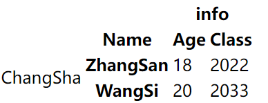
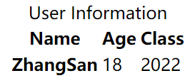
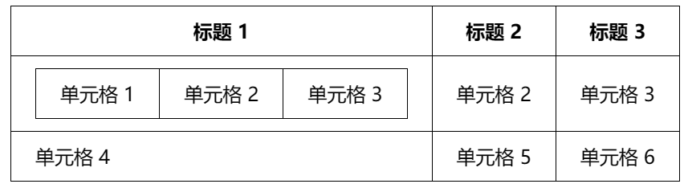
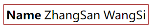

# 表格

所有的表格内容全部包裹在`<table>`标签中。

## 单元格

在表格中，最小的内容容器是单元格，是通过 `<td>` 元素创建的。

```html
<table>
   <td>Hi, I'm your first cell.</td>
</table>
```

---




单元格不会放置在彼此的下方，而是自动与同一行上的其他单元格对齐。

每个 `<td>` 元素 创建一个单独单元格，它们共同组成了第一行。

```html
<table>
    <td>Hi, I'm your first cell.</td>
	<td>I'm your second cell.</td>
	<td>I'm your third cell.</td>
	<td>I'm your fourth cell.</td>
</table>
```

---




每一行都需要一个额外的 `<tr>` 元素来包装，每个单元格的内容都应该写在 `<td>`中。

```html
<table>
    <tr>
		<td>Hi, I'm your first cell.</td>
		<td>I'm your second cell.</td>
		<td>I'm your third cell.</td>
		<td>I'm your fourth cell.</td>
	</tr>
	<tr>
	<td>Hi, I'm your first cell.</td>
		<td>I'm your second cell.</td>
		<td>I'm your third cell.</td>
		<td>I'm your fourth cell.</td>
	</tr>
</table>

```

---





## `<th>`标题元素

表格中的标题是特殊的单元格，通常在行或列的开始处。

标题在视觉上和语义上都能被识别为标题，使用` <th> `元素。用法和 `<td>`是一样的，除了它表示为标题，不是普通的单元格以外。

标题会被**加粗显示**

```html
<table>
    <tr>
        <th>Name</th>
        <th>Age</th>
        <th>Class</th>
    </tr>
    <tr>
        <th>ZhangSan</th>
        <td>18</td>
        <td>2022</td>
    </tr>
</table>
```

---


## 单元格跨越行和列

表格中的标题和单元格有 `colspan` 和 `rowspan` 属性，它们接受一个没有单位的数字值，数字决定了它们的宽度或高度是几个单元格。

比如，`colspan="2"` 使一个单元格的宽度是两个单元格。

```html
<table>
    <tr>
        <td colspan="2"></td>
        <th colspan="2">info</th>
    </tr>
    <tr>
        <td></td>
        <th>Name</th>
        <th>Age</th>
        <th>Class</th>
    </tr>
    <tr>
        <td rowspan="2">ChangSha</td>
        <th>ZhangSan</th>
        <td>18</td>
        <td>2022</td>
    </tr>
    <tr>
        <th>WangSi</th>
        <td>20</td>
        <td>2033</td>
    </tr>
</table>
```

---




## 整列样式

  `<col>` 和 `<colgroup>`定义整列数据的样式信息，让一列中的每个数据的样式都一样。

`<colgroup>`容器中包裹`<col>`元素，每一个 `<col>` 都会指定每列的样式。

如果某一个列不需要设置样式，则需要一个空`<col>`元素，可以用`span` 属性指定样式应用到表格中多少列。

```html
<table>
    <colgroup>
        <col >
        <col style="background-color: chartreuse">
        <col span="2" style="background-color: brown" >
    </colgroup>
    <tr>
        <td colspan="2"></td>
        <th colspan="2">info</th>
    </tr>
    <tr>
        <td></td>
        <th>Name</th>
        <th>Age</th>
        <th>Class</th>
    </tr>
    <tr>
        <td rowspan="2">ChangSha</td>
        <th>ZhangSan</th>
        <td>18</td>
        <td>2022</td>
    </tr>
    <tr>
        <th>WangSi</th>
        <td>20</td>
        <td>2033</td>
    </tr>
</table>
```

---


# 高级表格

## 标题

`<caption>` 元素为表格增加一个标题：

```html
<table>
    <caption>User Information</caption>
    <tr>
        <th>Name</th>
        <th>Age</th>
        <th>Class</th>
    </tr>
    <tr>
        <th>ZhangSan</th>
        <td>18</td>
        <td>2022</td>
    </tr>
</table>
```

---




## 表格结构

添加 `<thead>`、`<tfoot>` 和 `<tbody>` 结构。

- `<thead>` 元素必须包住表格中作为表头的部分。一般是第一行，往往都是每列的标题。如果你使用了  `<col>`/`<colgroup> ` 元素，那么 `<thead>` 元素就需要放在它们的下面。
- `<tfoot>` 元素需要包住表格中作为表脚的部分。一般是最后一行，往往是对前面所有行的总结，可以将`<tfoot>`放在表格的底部，或者就放在 `<thead>` 的下面。(浏览器仍将它呈现在表格的底部)
- `<tbody>` 元素需要包住表格内容中不在表头或表尾的其他部分。


注意：`<tbody>` 总是包含在每个表中，如果你没有在代码中指定它，那就是隐式的。


```html
<table>
    <caption>User Information</caption>
    <thead>
    <tr>
        <th>Name</th>
        <th>Age</th>
        <th>Class</th>
    </tr>
    </thead>
    <tbody>
    <tr>
        <th>ZhangSan</th>
        <td>18</td>
        <td>2022</td>
    </tr>
    </tbody>
    <tfoot>
    <tr>
        <th>Summarize</th>
        <td colspan="2" style="text-align: center">None</td>
    </tr>
    </tfoot>
</table>
```

---


## 嵌套表格

通常是不建议的，因为这种做法会使标记看上去很难理解。

以及在很多情况下，也许你只需要插入额外的单元格、行、列到已有的表格中。

然而有时候是必要的，比如你想要从其他资源中更简单地导入内容。

```
<table id="table1">
  <tr>
    <th>标题 1</th>
    <th>标题 2</th>
    <th>标题 3</th>
  </tr>
  <tr>
    <td id="nested">
      <table id="table2">
        <tr>
          <td>单元格 1</td>
          <td>单元格 2</td>
          <td>单元格 3</td>
        </tr>
      </table>
    </td>
    <td>单元格 2</td>
    <td>单元格 3</td>
  </tr>
  <tr>
    <td>单元格 4</td>
    <td>单元格 5</td>
    <td>单元格 6</td>
  </tr>
</table>
```

---




# 无障碍

## scope

- `scope` 属性用于 `<th>` 元素中，主要目的是为了帮助屏幕阅读器更好地理解表格结构，明确表头是应用于所在行还是所在列。


1. **列表头定义**:

    - 使用 `scope="col"` 明确表示该表头是所在列的头部。

    ```html
    <th scope="col">Column Header</th>
    ```

2. **行表头定义**:

    - 使用 `scope="row"` 表示该表头定义了所在行。

    ```html
    <th scope="row">Row Header</th>
    ```

3. **colgroup 和 rowgroup**

    - `scope="colgroup"`: 用于定义跨越多个列的表头，通常位于列组的顶部。

    - `scope="rowgroup"`: 虽然标准中提及，但在实际应用中较少见，主要用于定义跨越多行的表头组。

### 示例

- **列表头示例**:

    ```html
    <thead>
      <tr>
        <th scope="col">Purchase</th>
        <th scope="col">Location</th>
        <th scope="col">Date</th>
        <th scope="col">Evaluation</th>
        <th scope="col">Cost (€)</th>
      </tr>
    </thead>
    ```

- **行表头示例**:

    ```html
    <tr>
      <th scope="row">Haircut</th>
      <td>Hairdresser</td>
      <td>12/09</td>
      <td>Great idea</td>
      <td>30</td>
    </tr>
    ```


**复杂表格结构示例**: 假设有一个表格，其中“衣物”作为一组列的总标题，“长裤”、“衬衫”、“裙子”为子标题：

```html
<tr>
  <th scope="colgroup">衣物</th>
  <!-- 子列标题 -->
  <th scope="col">长裤</th>
  <th scope="col">衬衫</th>
  <th scope="col">裙子</th>
</tr>
```


## id 和headers属性

替代 scope 属性，提供另一种方式来明确表格中单元格与其对应标题之间的关系，增强无障碍访问。

```python
<thead>
  <tr>
    <th id="purchase">Purchase</th>
    <th id="location">Location</th>
    <th id="date">Date</th>
    <th id="evaluation">Evaluation</th>
    <th id="cost">Cost (€)</th>
  </tr>
</thead>
<tbody>
  <tr>
    <th id="haircut">Haircut</th>
    <td headers="location haircut">Hairdresser</td>
    <td headers="date haircut">12/09</td>
    <td headers="evaluation haircut">Great idea</td>
    <td headers="cost haircut">30</td>
  </tr>
  <!-- 更多行... -->
</tbody>
```

1. **为 `<th>` 元素分配唯一 `id`**:

    - 每个表头单元格需赋予一个唯一的 `id`，便于关联。

    ```html
    <!-- 行 -->
    <th id="purchase">Purchase</th>
    <!-- 列 -->
    <th id="haircut">Haircut</th>
    ```

2. **为 `<td>` 元素设置 `headers` 属性**:

    - 每个数据单元格的 `headers` 属性应包含其相关的所有表头 `id`，以空格分隔。

    ```html
    <td headers="location haircut">Hairdresser</td>
    <!-- headers="行id 列id" -->
    ```


# CSS表格

## border

当给`<table>`元素设置边框时，将应用到整个表格中。

当给`<tr>`元素设置边框时，则是给这一行单元格设置外边框线。

当给`<th>`或`<td>`设置边框时，则是给单元格设置边框。

```html
<table style="border: 1px solid brown">
    <tr>
        <th>Name</th>
        <td>ZhangSan</td>
        <td>WangSi</td>
    </tr>
</table>
```

---




```

```


##  table-layout

采用 `table-layout: fixed` 模式后，列宽将依据列标题的设定宽度确定，之后单元格内容会根据这些固定的列宽进行适应性调整。

对于表头 (`<th>`) 中的每个列，使用 `width` 属性并指定百分比值来设定列宽。例如，第一个列设为30%，第二个列20%，以此类推，确保总和不超过100%。


```css
table {
  table-layout: fixed; /* 固定布局模式 */
  width: 100%; /* 表格宽度充满其容器 */
}
thead th:nth-child(1) { width: 30%; }
thead th:nth-child(2) { width: 20%; }
thead th:nth-child(3) { width: 15%; }
thead th:nth-child(4) { width: 35%; }
```


## border-collapse

默认情况下，当在表元素上设置边框时，它们之间将会有间隔。


使用 `border-collapse: collapse;` ，让边框合为一条


##  caption-side

caption-side用于设置标题的位置，如果它被赋予了一个`bottom`的值，将导致标题被放置在表格的底部。

**（请注意右下角）**

