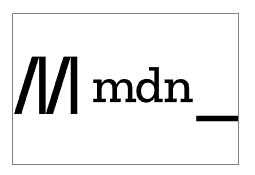

# URL

统一资源定位符（Uniform Resource Locator，URL）是一个定义了在网络上的位置的一个文本字符串。例如，Mozilla 的简体中文主页位于 https://www.mozilla.org/zh-CN/。


有一个名为 `webSite` 的文件夹，这就是的网站的根目录，在这个目录里，有两个子目录：`pdfs` 和 `projects`。

 `webSite` 的文件夹，有

两个文件：`index.html` 和 `contacts.html`

 `pdfs` 的文件夹，有个文件：`project-brief.pdf`

 `projects` 的文件夹，有个文件：`index.html`


现在，如果你想在网页上创建链接：

**指向当前目录**：

如果你想在 `index.html`（主页）上创建一个链接到 `contacts.html`，你只需要写 `<a href="contacts.html">联系人页面</a>`。


**指向子目录**：

如果你想在 `index.html`（主页）上创建一个链接到 `projects/index.html`，你需要写 `<a href="projects/index.html">项目主页</a>`。


**指向上级目录**：

如果你想在 `projects/index.html` 上创建一个链接到 `pdfs/project-brief.pdf`，你需要写 `<a href="../pdfs/project-brief.pdf">项目简介</a>`。


## 绝对URL

这是一个完整的网址，包括协议（如 `https://`）和域名（如 `www.example.com`）。无论你在哪里使用它，它总是指向同一个地方。

例如，`https://www.example.com/projects/index.html` 就是一个绝对 URL。


## 相对URL

这是一个基于你当前位置的链接。它的目标会根据你在哪里使用它而改变。

例如，如果你在 `webSite` 目录的 `index.html` 文件中，你可以用 `pdfs/project-brief.pdf` 来链接到同一目录下的 `pdfs` 子目录的 `project-brief.pdf` 文件。

但是，如果你把 `index.html` 文件移动到别的地方，这个链接就可能会失效。


# 超链接

超链接使我们能够将我们的文档链接到任何其他文档（或其他资源），也可以链接到文档的指定部分。几乎任何网络内容都可以转换为链接，点击（或激活）超链接将使网络浏览器转到另一个网址（URL）。


## 链接的解析

通过将文本或其他内容包裹在 `<a>` 元素内，并给它一个包含网址的 **href** 属性（也称为超文本引用或目标，它将包含一个网址）来创建一个基本链接。

```HTML
<p>
  我创建了一个指向
  <a href="https://www.mozilla.org/zh-CN/">Mozilla 主页</a>的链接。
</p>
```


## 块级链接

任何内容，甚至**块级内容**都可以作为链接出现。

如果想让标题元素变为链接，就把它包裹在锚点元素（<a>）内，像这个代码段一样：

```html
<a href="https://developer.mozilla.org/zh-CN/">
  <h1>MDN Web 文档</h1>
</a>
<p>自从 2005 年起，就开始记载包括 CSS、HTML、JavaScript 等网络技术。</p>
```


它将标题转化为了链接：


## 图片链接

如果有需要作为链接的图片，使用 `<a>` 元素来包裹要引用图片的 `` 元素：

```html
<a href="https://developer.mozilla.org/zh-CN/">
  
</a>
```


它将 MDN 徽标转化为了链接：




## title属性

这旨在包含关于链接的补充信息，例如页面包含什么样的信息或需要注意的事情。

```html
<p>
  我创建了一个指向<a
    href="https://www.mozilla.org/zh-CN/"
    title="了解 Mozilla 使命以及如何参与贡献的最佳站点。"
    >Mozilla 主页</a
  >的超链接。
</p>
```

结果如下（当鼠标指针悬停在链接上时，标题将作为提示信息出现）：


备注： 链接的标题**仅当鼠标悬停**在其上时**才会显示**，这意味着**使用键盘**来导航网页的人很**难获取到标题信息**。如果**标题信息对于页面非常重要**，你应该使用所有用户能都方便获取的方式来呈现，例如**放在常规文本中**。


## 文档片段

超链接除了可以链接到文档外，也可以链接到 HTML 文档的特定部分（被称为**文档片段**）。


首先给要链接到的元素分配一个 **id** 属性：

```html
<h2 id="Mailing_address">邮寄地址</h2>
```


为了链接到那个特定的 id，要将它放在 URL 的末尾，并在前面包含井号（#），例如：

```html
<p>
  要提供意见和建议，请将信件邮寄至<a href="contacts.html#Mailing_address"
    >我们的地址</a
  >。
</p>
```


你甚至可以在同一份文档下，通过链接文档片段，来**链接到当前文档**的另一部分（省略URL）：

```html
<p>本页面底部可以找到<a href="#Mailing_address">公司邮寄地址</a>。</p>
```


## download属性

当你链接到要下载的资源而不是在浏览器中打开时，你可以使用 download 属性来提供一个默认的保存文件名。

下面是一个 Firefox 的 Windows 最新版本下载链接的示例：

```html
<a
  href="https://download.mozilla.org/?product=firefox-latest-ssl&os=win64&lang=zh-CN"
  download="firefox-latest-64bit-installer.exe">
  下载最新的 Firefox 中文版 - Windows（64 位）
</a>
```


## 电子邮件

当点击一个链接或按钮时，可能会开启新的邮件的发送而不是连接到一个资源或页面。

使用 `<a>` 元素和 `mailto: URL` 协议实现。


指明收件人电子邮件地址的 mailto: 链接。例如：

```html
<a href="mailto:nowhere@mozilla.org">向 nowhere 发邮件</a>
```


电子邮件地址是可选的。如果你省略了它（也就是说，你的 href 属性仅仅只是简单的“`mailto:`”），发送新的电子邮件的窗口也会被用户的邮件客户端打开，只是没有收件人的地址信息，这通常在“分享”链接是很有用的，用户可以给他们选择的地址发送邮件。


## 指定详细信息

除了电子邮件地址，你还可以提供其他信息。

其中最常用的是主题（subject）、抄送（cc）和主体（body）（这不是一个真正的标头字段，但允许你为新邮件指定一个简短的内容消息）。


下面是一个包含 cc、bcc、主题和主体的示例：

```html
<a
  href="mailto:nowhere@mozilla.org?cc=name2@rapidtables.com&bcc=name3@rapidtables.com&subject=The%20subject%20of%20the%20email&body=The%20body%20of%20the%20email">
  发送含有 cc、bcc、主题和主体的邮件
</a>
```


**备注**：

- 每个字段的值必须使用 URL 编码，即使用百分号转义的非打印字符（不可见字符如制表符、换行符、分页符）和空格。
- 同时注意使用问号（?）来分隔主 URL 与参数值，以及使用 & 符来分隔 mailto: URL 中的各个参数。这是标准的 URL 查询标记方法。
- 阅读 GET 方法以了解哪种 URL 查询标记方法是更常用的。


这里有一些其他的示例 mailto 链接：

- mailto:
- mailto:nowhere@mozilla.org
- mailto:nowhere@mozilla.org,nobody@mozilla.org
- mailto:nowhere@mozilla.org?cc=nobody@mozilla.org
- mailto:nowhere@mozilla.org?cc=nobody@mozilla.org&subject=This%20is%20the%20subject