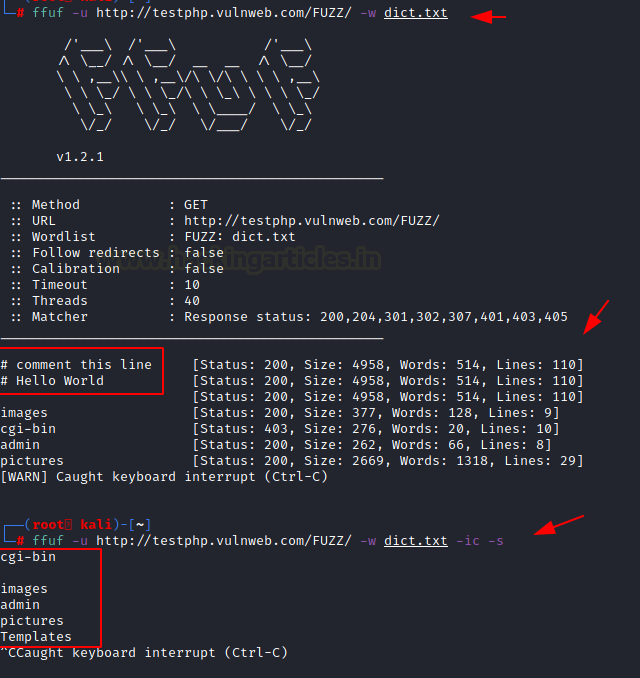
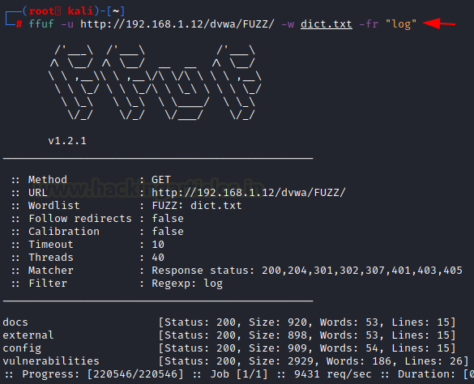
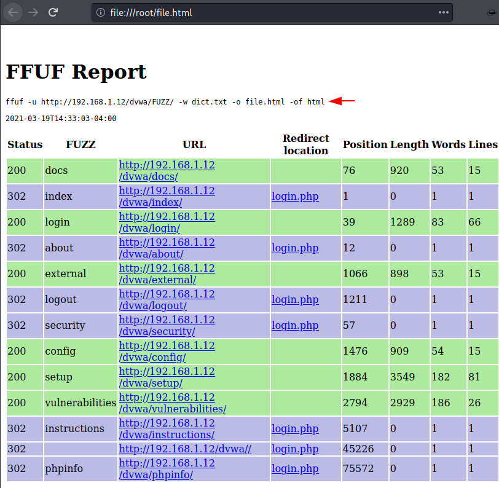

# FFUF

在本文中，我们将学习如何使用 ffuf（“Fuzz Faster U Fool”的缩写），这是一款有趣的开源网络模糊测试工具。自发布以来，许多人都对 ffuf 产生了浓厚兴趣，尤其是在漏洞赏金领域。那么，让我们深入探讨这一学习过程吧。

**目录**

- **ffuf 简介**
- **设置**
- **输入选项**
    - 简单攻击
    - 多个字典列表
    - 忽略字典注释和静默模式
    - 扩展名
    - 请求 | 请求协议 | 模式
- **匹配选项**
    - 匹配 HTTP 代码
    - 匹配行数
    - 匹配单词数
    - 匹配大小
    - 匹配正则表达式
- **过滤选项**
    - 过滤代码
    - 过滤行数
    - 过滤大小
    - 过滤单词数
    - 过滤正则表达式
- **通用选项**
    - 自定义自动校准
    - 颜色
    - 任务最大时间
    - 作业最大时间
    - 延迟
    - 请求速率
    - 错误函数
    - 详细模式
- **输出选项**
    - HTML 格式的输出
    - CSV 格式的输出
    - 所有输出格式
- **HTTP 选项**
    - 超时
    - 主机头
    - 递归
    - 使用 Cookie 攻击
    - Burp 套件代理
- **结论**

## 简介

它是一种在 Web 服务器上进行 Web 模糊测试的专业命令行方法，作者 [(**@joohoi**](https://twitter.com/joohoi)**)** 功不可没。自从发布以来，许多人特别是漏洞赏金领域的人们纷纷转向使用 ffuf。虽然这种转变的大部分原因可能是从众心理，但也有相当一部分人因为 FFUF 的速度、多功能性以及易于与外部工具集成的能力而做出了这一选择。

### 安装

对于 Kali Linux 用户，可通过apt仓库快速安装：

```
apt install ffuf
```


安装此工具后，要获取其工作参数和选项，我们只需使用 **[-h]** 参数作为帮助选项。

```
ffuf -h
```


## 输入选项

这些是帮助我们通过字典列表为 URL 提供所需数据进行 Web 模糊测试的参数。

### 1.  基础攻击

对于默认攻击，我们需要使用 **[-u]** 参数指定目标 URL 和 **[-w]** 参数加载字典列表，如下图所示。

```
ffuf -u http://testphp.vulnweb.com/FUZZ/ -w dict.txt
```

- 运行命令后，让我们关注结果。
    - 首先我们注意到它默认在 **HTTP 方法** GET 上运行。
    - 接下来是 **响应代码状态** [200, 204, 301, 302, 307, 401, 403, 405};
    - 它还显示了我们的攻击进展。在进度结束时，我们得到了结果。


### 2. 多字典协同攻击

有时一个单词表不足以显示我们想要的结果。在这种情况下，我们可以同时使用多个字典列表以获得更好的结果。

这里我提供了两个字典 dict.txt 作为 W1 和 dns.txt 作为 W2，ffuf 将同时读取这两个字典。

```
ffuf -u https://ignitetechnologies.in/W2/W1/ -w dict.txt:W1 -w dns_dict.txt:W2
```


### 3. 忽略字典注释和静默模式

通常，默认字典可能有一些注释会影响我们结果的准确性。在这种情况下，我们可以使用 **[-ic]** 参数自动跳过字典中的注释。

```
ffuf -u http://testphp.vulnweb.com/FUZZ/ -w dict.txt -ic -s
```




### 4. 扩展名

我们可以借助 **[-e]** 参数搜索 Web 服务器上的特定扩展文件，我们只需要指定扩展文件与 **[-e]** 参数一起使用即可。

```
ffuf -u http://192.168.1.12/dvwa/FUZZ/ -w dict.txt -e .php
```


### 5. 请求 | 请求协议 | 模式:

Burp Suite 是一个用于进行 Web 应用测试的高级框架。它的可以和不同工具相互配合，有助于整体测试过程。

Burp Suite 中的**集束炸弹**（攻击模式）是一项使用**多个<u>有效负载集（字典）</u>**的功能，多个位置设置不同的字典，攻击时逐一遍历每个字典。

FFUF 也支持 Burp Suite 中的**集束炸弹**（攻击模式）， **[-request]** 参数可以指定 **request 文本内容**，**[-request-proto]** 参数指定**协议**，**[-mode]** 参数指定**攻击模式**。

首先，我们在目标 URL 页面上输入账号密码并提交表单，并使用 Burp Suite 捕获请求数据。


现在，在 Burpsuite 的拦截标签页中，将表单中的**账号**替换为 **HFUZZ**，**密码**替换为 **WFUZZ**。然后将此 request 全部内容复制到文本中，并将其命名（这里命名为 **brute.txt** ）


现在进入主要攻击阶段，其中 **[-request]** 参数指定 **requests 文本文件**。**[-request-proto]** 参数**指定 http 协议**，**[-mode]** 指定攻击模式为**集束炸弹**。

```
ffuf -request brute.txt -request-proto http -mode clusterbomb -w users.txt:HFUZZ -w pass.txt:WFUZZ -mc 200
```

正如我们在攻击结果中看到的，我们已经成功找到了针对该特定目标工作的 SQL 注入。（此方式也适用于爆破账号密码）


## 匹配选项

如果我们希望 ffuf 只显示对我们 Web 模糊测试数据重要的数据。可以通过这些选项匹配重要的内容。示例：HTTP 代码、行数、单词数、大小和正则表达式。

### 1. 匹配 HTTP 状态码

要理解此参数，我们需要考虑一个简单的攻击，可以看到哪些 **HTTP 状态码**出现在我们的结果中。

```
ffuf -u http://192.168.1.12/dvwa/FUZZ/ -w dict.txt
```


我们可以清楚地看到，它显示了一些 302 HTTP 状态码以及 200 HTTP 状态码。


如果只需要成功的如 200 HTTP 状态码结果，我们只需使用 **[-mc]** 参数以及我们特定的 HTTP 状态码。

```
ffuf -u http://192.168.1.12/dvwa/FUZZ/ -w dict.txt -mc 200
```


### 2. 匹配行数

通过 **[-ml]** 参数设置**行数**筛选条件，仅显示与指定行数完全一致的内容结果。

```
ffuf -u http://192.168.1.12/dvwa/FUZZ/ -w dict.txt -ml 15
```


### 3. 匹配单词数

通过 **[-ml]** 参数设置**单词数**筛选条件，仅显示与指定**单词数**完全一致的内容结果。

```
ffuf -u http://192.168.1.12/dvwa/FUZZ/ -w dict.txt -mw 53
```


### 4. 匹配大小

通过 **[-ml]** 参数设置**结果大小**筛选条件，仅显示与指定**结果大小**完全一致的内容结果。

```
ffuf -u http://192.168.1.12/dvwa/FUZZ/ -w dict.txt -ms 2929
```


### 5. 正则表达式匹配

通过 **[-mr]** 参数指定正则表达式，仅显示能**被正则表达式匹配**的内容结果。

这是字典的内容。


通过使用此字典，在攻击场景中使用 **[-mr]** 参数。

```
ffuf -u http://testphp.vulnweb.com/showimage.php?file=FUZZ -w dict2.txt -mr "root:x"
```


在这里，我们得到了 HTTP 响应 200。


## 过滤选项

过滤选项与匹配选项完全相反。我们可以使用这些选项从我们的 Web 模糊测试中删除不需要的内容。示例：HTTP 代码、行数、单词数、大小、正则表达式。

### 1. 过滤状态码

**[-fc]** 参数需要我们想从结果中删除的特定 HTTP 状态码。

```
ffuf -u http://192.168.1.12/dvwa/FUZZ/ -w dict.txt -fc 302
```


### 2. 过滤行数

**[-fl]** 参数能够从我们的结果中删除特定长度，或者我们可以从攻击中过滤掉它。

```
ffuf -u http://192.168.1.12/dvwa/FUZZ/ -w dict.txt -fl 26
```


### 3. 过滤大小

**[-fs]** 参数能够在攻击命令期间描述由我们指定的大小进行过滤。

```
ffuf -u http://192.168.1.12/dvwa/FUZZ/ -w dict.txt -fs 2929
```


### 4. 过滤单词

**[-fw]** 参数能够从我们想要删除的结果中过滤掉单词计数。

```
ffuf -u http://192.168.1.12/dvwa/FUZZ/ -w dict.txt -fw 83
```


### 5. 正则表达式过滤

通过 **[-fr]** 参数指定正则表达式，**忽略**能**被正则表达式匹配**的内容结果。

```
ffuf -u http://192.168.1.12/dvwa/FUZZ/ -w dict.txt -fr "log"
```




## 通用选项

这些是该工具的一般参数，围绕其在 Web 模糊测试中的常规工作展开。

### 1. 自动校准

自动校准（Auto Calibration）是一种机制，用于帮助工具动态调整其行为以适应目标服务器的响应模式。

通过 **[-acc]** 参数根据我们的需要自定义此功能。必须配合 **[-ac]** 参数的一起使用。

```
ffuf -u http://192.168.1.12/dvwa/FUZZ/ -w dict.txt -acc -ac -fl 26 -ac -fs 2929 -ac -fw 54
```


### 2. 颜色

有时颜色分离会为结果中的所有细节创造额外的关注点。这个 [-c] 参数有助于创建颜色分离。

```
ffuf -u http://192.168.1.12/dvwa/FUZZ/ -w dict.txt -c
```


### 3. 任务的最大时间

如果你希望在有限的时间内进行模糊测试，可以选择 **[-maxtime]** 参数。

```
ffuf -u http://192.168.1.12/dvwa/FUZZ/ -w dict.txt -maxtime 5
```


### 4, 作业的最大时间

借助 **[-maxtime-job]** 参数，我们可以为每次请求设置时间限制。

```
ffuf -u http://192.168.1.12/dvwa/FUZZ/ -w dict.txt -maxtime-job 2
```


### 5. 延迟

**[-p]** 参数给每个请求创建特定的延迟。

```
ffuf -u http://192.168.1.12/dvwa/FUZZ/ -w dict.txt -p 0.5
```


### 6. 请求速率

 **[-rate]** 参数为每次攻击创建单独的请求速率。

```
ffuf -u http://192.168.1.12/dvwa/FUZZ/ -w dict.txt -rate 500
```


### 7. 错误处理

第一个参数是 **[-se]**，当无法发送请求到目标服务器时停止。第二个参数是 **[-sf]**，当超过 95% 的请求发生错误时停止。第三个参数是 **[-sa]** 它是两个错误参数的组合。

在我们的情况下，我们使用 **[-se]** 参数，当我们的请求不真实时，它将停止我们的攻击。

```
ffuf -u http://ignitetechnologies.in/W2/W1/ -w dict.txt:W1 -w dns_dict.txt:W2 -se
```


### 8. 详细模式

详细输出，打印完整 URL 和重定向位置（如果有）以及结果。

```
ffuf -u http://192.168.1.12/dvwa/FUZZ/ -w dict.txt -v
```


### 9. Threads

通过 **[-t]** 参数设置进程的线程数，默认情况下，它设置为 40。

```
ffuf -u http://192.168.1.12/dvwa/FUZZ/ -w dict.txt -t 1000
```


## 输出选项

我们保存攻击性能记录以供记录、提高可读性和潜在参考。我们使用 [-o] 参数保存输出，但需要使用 [-of] 参数指定其格式。

### 1. HTML 格式

我们使用 [-of] 参数并以 HTML 格式定义。通过使用命令，我们可以以 html 创建报告。

```
ffuf -u http://192.168.1.12/dvwa/FUZZ/ -w dict.txt -o file.html -of html
```


完成此攻击后，我们需要检查输出文件是否符合要求。我们可以看到文件已成功创建。



### 2. CSV 格式的输出

同样，我们只需使用 [-of] 参数的 csv 格式。csv 是逗号分隔值，文件允许您以表格格式存储数据。

```
ffuf -u http://192.168.1.12/dvwa/FUZZ/ -w dict.txt -o file.csv -of csv
```


完成此攻击后，我们需要检查输出文件是否符合要求。我们可以看到文件已成功创建。


### 3. 所有输出格式

同样，如果我们希望一次性获得所有输出格式，只需使用 **[-of all]** 参数。比如 json, ejson, html, md, csv, ecsv。遵循此命令以一次生成所有报告。

```
ffuf -u http://192.168.1.12/dvwa/FUZZ/ -w dict.txt -o output/file -of all
```


完成此攻击后，我们需要检查输出文件是否符合要求。我们可以看到所有文件都已成功创建。


## HTTP 选项

选项围绕 HTTP 选项，有时需要详细信息来运行 Web 模糊测试，如 HTTP 请求、Cookie、HTTP 头等。

### 1. Timeout

通过 **[-timeout]** 参数**设置请求的超时时间**。

```
ffuf -u http://192.168.1.12/dvwa/FUZZ/ -w dict.txt -timeout 5
```


### 2. 主机头

如果我们想对子域进行模糊测试，可以使用 **[-H]** 参数以及域名字典列表，如下命令所示。

```
ffuf -u https://google.com -w dns_dict.txt -mc 200 -H "HOST: FUZZ.google.com"
```


### 3. 递归

通过 **-recursion** 启用递归扫描。仅支持 FUZZ 关键字，并且 URL（-u）必须以此关键字结尾。（默认值：false）。

通过 **-recursion-depth** 参数设置最大递归深度。（默认值：0）

```
ffuf -u "http://testphp.vulnweb.com/FUZZ/" -w dict.txt -recursion
```


### 4. 使用 Cookie 攻击

有时 Web 模糊测试不会在未经身份验证的站点上显示结果。通过 **[-b]** 参数设置会话 Cookie。

```
ffuf -u http://192.168.1.12/dvwa/FUZZ/ -w dict.txt -b "PHPSESSID:"7aaaa6d88edcf7cd2ea4e3853ebb8bde""
```


### 5. 重放代理

如您所知，在免费版的 Burp 套件（社区版）中使用 Intruder 功能时存在速度限制。Intruder 攻击已被严重放缓，每个命令进一步减缓了攻击。

在我们的情况下，我们使用 Burp 套件代理来获取评估结果。首先，我们必须在端口 8080 上建立本地主机代理。


现在使用 **[-replay-proxy]** 参数，它将 requests 请求发送到代理服务器上（Burp Suite）。

```
ffuf -u http://192.168.1.12/dvwa/FUZZ/ -w dict.txt -replay-proxy http://127.0.0.1:8080 -v -mc 200
```


这次攻击将在两个平台上显示我们的结果。第一个平台在 kali 终端上，第二个在 Burp 套件 HTTP 历史标签页上。通过这些各种技术，我们可以更好地了解我们的目标和攻击结果。


## 结论

ffuf 常常被拿来与 dirb 或 dirbuster 等工具进行比较，尽管在某种程度上它们是准确的，但这并不是一个合理的类比。虽然 FFUF 可以用来暴力破解文件，但它真正的优势在于其简洁性，一个更适合与 FFUF 比较的工具是 Burp Suite Intruder 或 Turbo Intruder。

**作者**: Shubham Sharma 是一位充满热情的网络安全研究员，联系 **[LinkedIn](https://www.linkedin.com/in/shubham-sharma-626964153/)** 和 **[Twitter](https://twitter.com/Shubham_pen)**。


## 示例

### 路径

通用文件列表（例如 raft-medium-files-lowercase.txt）开始枚举。

```
ffuf -u http://10.10.195.181/FUZZ -w /usr/share/seclists/Discovery/Web-Content/raft-medium-files-lowercase.txt
```


需要注意的是，通用字典往往包含大量无关文件扩展名，例如：一个 NGINX + **PHP 网站**，几乎不可能出现 `.asp .jsp` ，但通用字典中可能包含大量的 `aaa.asp bbb.asp aaa.jsp bbb.jsp ...`。 

通常可以假设 `index.<extension>` 是大多数网站的默认页面，因此我们可以尝试仅针对 `index` 使用常见扩展名。通过这种方法，我们通常可以确定网站使用的编程语言。

```
head /usr/share/seclists/Discovery/Web-Content/web-extensions.txt            
.asp
.aspx
.bat
.c
.cfm
.cgi
.css
.com
.dll
.exe
```

测试指令示例（在 index 后动态扩展名）：

```
ffuf -u http://10.10.195.181/indexFUZZ -w /usr/share/seclists/Discovery/Web-Content/web-extensions.txt
```


现在获取**网站支持的扩展名**，我们可以尝试通用词列表（不带扩展名），并有效的扩展名和一些常见的扩展名，如 `.txt`。

```
ffuf -u http://10.10.195.181/FUZZ -w /usr/share/seclists/Discovery/Web-Content/raft-medium-words-lowercase.txt -e .php,.txt
```


目录名称的选取通常不局限于特定环境类型，在文件模糊测试前优先列举目录往往是更高效的策略。

```
ffuf -u http://10.10.195.181/FUZZ -w /usr/share/seclists/Discovery/Web-Content/raft-medium-directories-lowercase.txt
```


### GET

ffuf 允许你将关键字放在任何地方，当你找到页面或 API 端点但不知道其接受的参数时，可以通过模糊测试发现潜在参数。

```
ffuf -u 'http://MACHINE_IP/sqli-labs/Less-1/?FUZZ=1' -c -w burp-parameter-names.txt -fw 39
ffuf -u 'http://MACHINE_IP/sqli-labs/Less-1/?FUZZ=1' -c -w raft-medium-words-lowercase.txt -fw 39
```


现在我们找到了一个接受整数值的参数，我们将开始模糊测试值。

此时，我们可以生成一个单词列表并保存一个包含整数的文件。为了省去一个步骤，我们可以使用 `-w -` ，它告诉 ffuf 从 stdout 读取一个单词列表。这将允许我们使用我们选择的命令生成一个整数列表，然后将输出通过管道传输到 ffuf。

```
seq 0 255 | ffuf -u 'http://MACHINE_IP/sqli-labs/Less-1/?id=FUZZ' -c -w - -fw 33
```


### POST

我们还可以使用 ffuf 进行基于单词表的暴力攻击，例如在身份验证页面上尝试密码。

```
ffuf -u http://MACHINE_IP/sqli-labs/Less-11/ -c -w hak5.txt \
	-X POST -d 'uname=Dummy&passwd=FUZZ&submit=Submit' -fs 1435 \
	-H 'Content-Type: application/x-www-form-urlencoded'
```

这里我们必须使用 POST 方法（用`-X`指定）并提供 POST 数据（用`-d` ），其中包括`FUZZ`关键字来代替密码。

我们还必须指定自定义标头 `-H 'Content-Type: application/x-www-form-urlencoded'` 因为 ffuf 不会像 curl 那样自动设置此内容类型标头。


### ffuf  详细参数

**HTTP 选项：**

```
-H                  请求头 "名称: 值"（冒号分隔）。可多次使用
-X                  指定 HTTP 方法
-b                  Cookie 数据 "NAME1=VALUE1; NAME2=VALUE2"（类 curl 格式）
-cc                 客户端证书（需同时定义客户端密钥）
-ck                 客户端密钥（需同时定义客户端证书）
-d                  POST 数据
-http2              启用 HTTP/2 协议（默认：false）
-ignore-body        不获取响应体内容（默认：false）
-r                  跟随重定向（默认：false）
-raw                不进行 URI 编码（默认：false）
-recursion          递归扫描（仅支持 FUZZ 关键字，且 URL 必须以该关键字结尾）（默认：false）
-recursion-depth    最大递归深度（默认：0）
-recursion-strategy 递归策略："default" 基于重定向，"greedy" 贪婪匹配（默认：default）
-replay-proxy       通过指定代理重放匹配请求
-sni                指定 TLS SNI（不支持 FUZZ 关键字）
-timeout            HTTP 请求超时（秒）（默认：10）
-u                  目标 URL
-x                  代理地址（支持 SOCKS5/HTTP）。例如：http://127.0.0.1:8080 或 socks5://127.0.0.1:8080
```


**通用选项：**

```
-V                  显示版本信息（默认：false）
-ac                 自动校准过滤选项（默认：false）
-acc                自定义校准字符串（可多次使用，隐含 -ac）
-ach                按主机自动校准（默认：false）
-ack                自动校准关键字（默认：FUZZ）
-acs                自定义校准策略（可多次使用，隐含 -ac）
-c                  彩色输出（默认：false）
-config             从文件加载配置
-json               JSON 格式输出（默认：false）
-maxtime            最大运行时间（秒）（默认：0）
-maxtime-job        单任务最大运行时间（秒）（默认：0）
-noninteractive     禁用交互式控制台（默认：false）
-p                  请求间隔（秒），支持随机范围。例如 "0.1" 或 "0.1-2.0"
-rate               每秒请求数（默认：0）
-s                  静默模式（默认：false）
-sa                 遇到任何错误即停止（隐含 -sf 和 -se）（默认：false）
-scraperfile        自定义爬取规则文件路径
-scrapers           启用的爬取器组（默认：all）
-se                 遇到意外错误即停止（默认：false）
-search             通过 FFUFHASH 搜索历史记录
-sf                 当 95% 响应为 403 时停止（默认：false）
-t                  并发线程数（默认：40）
-v                  显示完整 URL 和重定向地址（默认：false）
```


**示例用法：**

```bash
# 从 wordlist.txt 模糊测试路径，过滤内容长度为 42 的响应（彩色详细输出）
ffuf -w wordlist.txt -u https://example.org/FUZZ -mc all -fs 42 -c -v

# 模糊测试 Host 头，匹配 200 状态码
ffuf -w hosts.txt -u https://example.org/ -H "Host: FUZZ" -mc 200

# 模糊测试 JSON POST 数据，过滤包含 "error" 的响应
ffuf -w entries.txt -u https://example.org/ -X POST \
  -H "Content-Type: application/json" \
  -d '{"name": "FUZZ", "anotherkey": "anothervalue"}' -fr "error"
```


## 字典

### SecLists 

#### 1. 通用目录/文件枚举

- **作用** ：用于发现 Web 服务器上的隐藏目录、备份文件、配置文件等。
- 典型字典 
    - `directory-list-*.txt`：不同规模的目录爆破字典（如 `directory-list-2.3-medium.txt`）
    - `common.txt`、`big.txt`：常见文件名/目录名集合，如 `robots.txt`、`admin/` 等。
    - `raft-*.txt`：基于概率统计的高效字典（如 `raft-medium-words.txt`）

------

#### 2. API 端点发现

- **作用** ：针对 RESTful API 或 Web 服务接口的路径枚举。
- 典型字典 
    - `api/api-endpoints.txt`、`api-seen-in-wild.txt`：收集实际场景中常见的 API 路径（如 `/api/v1/users`）。
    - `common-api-endpoints-mazen160.txt`：专注于 API 特定端点的字典。

------

#### 3. CMS 专项检测

- **作用** ：针对 WordPress、Drupal、Joomla 等 CMS 的插件、主题、配置文件路径枚举。
- 典型字典 
    - `CMS/wordpress.fuzz.txt`、`wp-plugins.fuzz.txt`：WordPress 插件及主题探测。
    - `CMS/magento.txt`、`CMS/drupal.txt`：特定 CMS 的敏感路径集合。

------

#### 4. 文件扩展名/语言特性

- **作用** ：探测特定编程语言或框架的文件（如配置文件、日志文件）。
- 典型字典 
    - `File-Extensions-Universal-SVNDigger-Project/`：按语言分类的扩展名字典（如 `.php`、`.config`）。
    - `Programming-Language-Specific/PHP.fuzz.txt`：PHP 后门或敏感文件名。

------

#### 5. 参数与头部挖掘

- **作用** ：发现隐藏的 HTTP 参数或请求头（如调试参数、未公开 API）。
- 典型字典 
    - `BurpSuite-ParamMiner/`：配合 Burp Suite 的参数挖掘字典。
    - `burp-parameter-names.txt`：常见参数名集合。

------

##3# 6. 漏洞利用辅助

- **作用** ：辅助检测特定漏洞（如备份文件泄露、敏感配置）。
- 典型字典 
    - `Common-DB-Backups.txt`：数据库备份文件名（如 `.sql`、`.bak`）。
    - `versioning_metafiles.txt`：版本控制文件（如 `.gitignore`）。

------

#### 7. 框架/服务专项

- **作用** ：针对特定 Web 服务器或框架（如 Apache、Tomcat、SAP）的路径枚举。
- 典型字典 
    - `Web-Servers/Apache.txt`、`Web-Servers/nginx.txt`：服务器特定路径。
    - `SAP-NetWeaver.txt`、`wso2-enterprise-integrator.txt`：企业级服务路径。
