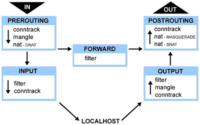

# iptables 入门


## 介绍

防火墙是保护服务器和基础设施的重要工具。在Linux生态系统中，iptables是一个广泛使用的防火墙工具，它与内核的 netfilter 数据包过滤框架协同工作。

Netfilter为程序提供了钩子点。当数据包流经网络栈时，将触发相应钩子的内核模块。具体触发哪些钩子取决于数据包的进出方向、目标地址以及是否在之前节点被丢弃/拒绝。


### 钩子与内置链

Netfilter钩子与内置链的对应关系及触发场景:

| netfilter 钩子       | 内置链      | 触发场景                                                     |
| -------------------- | ----------- | ------------------------------------------------------------ |
| `NF_IP_PRE_ROUTING`  | PREROUTING  | 所有入站流量进入网络栈后立即触发，发生于路由决策之前。       |
| `NF_IP_LOCAL_IN`     | INPUT       | 经路由判定目标为本机的入站数据包触发。                       |
| `NF_IP_FORWARD`      | FORWARD     | 经路由判定需转发至其他主机的数据包触发。                     |
| `NF_IP_LOCAL_OUT`    | OUTPUT      | 本地生成的出站流量进入网络栈时即刻触发。                     |
| `NF_IP_POST_ROUTING` | POSTROUTING | 所有出站或转发的流量在完成路由后、即将发送至物理链路前触发。 |

假设服务器知道如何路由数据包，而且防火墙允许数据包传输，下面就是不同场景下包的游走流程：

- 收到的、目的是本机的包：`PRETOUTING` -> `INPUT`
- 收到的、目的是其他主机的包：`PRETOUTING` -> `FORWARD` -> `POSTROUTING`
- 本地产生的包：`OUTPUT` -> `POSTROUTING`




### 表

iptables通过**表**对规则进行分类，每个表包含一组链（**并非所有表都包含全部链**），链中存放实际规则。

| Raw        | Mangle      | Nat         | Filter  | Security |
| ---------- | ----------- | ----------- | ------- | -------- |
| PREROUTING | PREROUTING  | PREROUTING  |         |          |
|            | INPUT       |             | INPUT   | INPUT    |
|            | FORWARD     |             | FORWARD | FORWARD  |
| OUTPUT     | OUTPUT      | OUTPUT      | OUTPUT  | OUTPUT   |
|            | POSTROUTING | POSTROUTING |         |          |

注意：**同一表中的不同链**（如 filter 表的 INPUT 和 FORWARD），**以及不同表中的同名链**（如 filter 表的 INPUT 和 security 表的 INPUT），可配置的规则类型均不同。


### 链优先级

在iptables的不同表中存在同名链类型。例如nat、raw、mangle三个表都包含 PREROUTING 链，它们都关联到 NF_IP_PRE_ROUTING 钩子。当数据包到达这个钩子时，系统会按照预设的优先级顺序依次处理不同表中的 PREROUTING 链，具体顺序为：

| Tables/Chains  | PREROUTING | INPUT | FORWARD | OUTPUT | POSTROUTING |
| :------------- | :--------- | :---- | :------ | :----- | :---------- |
| (路由判断)     |            |       |         | Y      |             |
| **raw**        | Y          |       |         | Y      |             |
| (连接跟踪）    | Y          |       |         | Y      |             |
| **mangle**     | Y          | Y     | Y       | Y      | Y           |
| **nat (DNAT)** | Y          |       |         | Y      |             |
| (路由判断)     | Y          |       |         | Y      |             |
| **filter**     |            | Y     | Y       | Y      |             |
| **security**   |            | Y     | Y       | Y      |             |
| **nat (SNAT)** |            | Y     |         | Y      | Y           |

- 当触发某个 netfilter 的钩子时，系统会按照表格中自上而下的顺序执行处理流程。
- 某些情况下会跳过特定表的特定链处理，例如：对于新建的网络连接，只有首个数据包会经过 NAT 规则匹配，后续数据包会自动沿用已建立的转换规则
- 表优先级：**Raw -> Mangle -> Nat -> Filter -> Security**


目标为本机的入站包：**PREROUTING → INPUT**

- 依次经过raw、mangle、nat(DNAT)表的PREROUTING链，再经mangle、filter、security、nat(SNAT)表的INPUT链。


### 规则

**规则**放置在**特定表**的**特定链**里面。当**链被调用**的时候，包会按优先级**依次匹配链里面的规则**。

规则由**匹配条件**与**目标动作**两部分构成，存储在特定表的链中。链被调用时，数据包将按顺序匹配链中所有规则。

**匹配条件**

通过灵活的组合条件识别目标流量，支持：

- 协议类型（TCP/UDP/ICMP等）
- 源/目标地址与端口
- 输入/输出接口
- 连接状态（NEW/ESTABLISHED等）
- 扩展模块（如字符串匹配、时间限制等）


**目标动作**

分为两类处理方式：

- **终止型目标**：如`ACCEPT`（放行）、`DROP`（静默丢弃）、`REJECT`（拒绝并响应）。触发后立即终止当前链的评估。
- **非终止型目标**：如`LOG`（记录日志）、`MARK`（打标记）。执行后继续评估后续规则。
- **跳转目标**：通过`-j`跳转至用户自定义链，实现模块化规则管理。自定义链处理完毕后返回原链继续执行，或通过`RETURN`提前返回。


### 用户自定义链

用户自定义链主要用于规则的组织管理。与直接关联系统数据包处理流程的内置链不同，自定义链需要通过"跳转"规则手动触发（例如使用-j参数指定链名）。当数据包进入自定义链后，存在两种返回原链的情况：

1) 遍历完自定义链所有规则未命中 
2) 规则触发RETURN动作。这种机制允许将规则集模块化，支持多级链式跳转，形成灵活的分层规则结构。


### 连接状态

连接状态在**规则匹配条件**中使用，连接跟踪系统中的连接状态有：

- `NEW`：如果到达的包关连不到任何已有的连接，但包是合法的，就为这个包创建一个新连接。对 面向连接的（connection-aware）的协议例如 TCP 以及非面向连接的（connectionless ）的协议例如 UDP 都适用
- `ESTABLISHED`：当一个连接收到应答方向的合法包时，状态从 `NEW` 变成 `ESTABLISHED`。对 TCP 这个合法包其实就是 `SYN/ACK` 包；对 UDP 和 ICMP 是源和目 的 IP 与原包相反的包
- `RELATED`：包不属于已有的连接，但是和已有的连接有一定关系。这可能是辅助连接（ helper connection），例如 FTP 数据传输连接，或者是其他协议试图建立连接时的 ICMP 应答包
- `INVALID`：包不属于已有连接，并且因为某些原因不能用来创建一个新连接，例如无法 识别、无法路由等等
- `UNTRACKED`：如果在 `raw` table 中标记为目标是 `UNTRACKED`，这个包将不会进入连 接跟踪系统
- `SNAT`：包的源地址被 NAT 修改之后会进入的虚拟状态。连接跟踪系统据此在收到反向包时对地址做反向转换
- `DNAT`：包的目的地址被 NAT 修改之后会进入的虚拟状态。连接跟踪系统据此在收到反向包时对地址做反向转换

这些状态可以定位到连接生命周期内部，管理员可以编写出更加细粒度、适用范围更大、更安全的规则。


## 基本操作

- 启动iptables: `service iptables start`
- 关闭iptables: `service iptables stop`
- 重启iptables: `service iptables restart`
- 查看iptables状态: `service iptables status`
- 保存iptables配置: `service iptables save`
- iptables 服务配置文件: `/etc/sysconfig/iptables-config`
- iptables 规则保存文件: `/etc/sysconfig/iptables`
- 打开iptables 转发: `echo "1" > /proc/sys/net/ipv4/ip_forward`


### ubuntu

安装 iptables-persistent 工具

```
sudo apt update
sudo apt install iptables-persistent
```


自动保存 IPv4 (`rules.v4`) 和 IPv6 (`rules.v6`) 规则。

```
netfilter-persistent save
```


将当前规则保存到 `/etc/iptables/rules.v4` 以实现永久生效：

```
sudo iptables-save | sudo tee /etc/iptables/rules.v4
```


将当前规则保存到 `/etc/iptables/rules.v6` 以实现永久生效：

```
sudo ip6tables-save | sudo tee /etc/iptables/rules.v6
```


将 `netfilter-persistent` 服务设置为开机自启。

```
systemctl enable netfilter-persistent
```


确认 `netfilter-persistent` 服务已启用，以便启动时加载规则：

```
systemctl status netfilter-persistent

● netfilter-persistent.service - netfilter persistent configuration
     Loaded: loaded (/usr/lib/systemd/system/netfilter-persistent.service; enabled; preset: enabled)
    Drop-In: /usr/lib/systemd/system/netfilter-persistent.service.d
             └─iptables.conf
     Active: active (exited) since Wed 2025-03-26 11:24:31 CST; 2min 17s ago
       Docs: man:netfilter-persistent(8)
   Main PID: 3158 (code=exited, status=0/SUCCESS)
        CPU: 6ms
```


临时启用 IP 转发

```
echo "1" > /proc/sys/net/ipv4/ip_forward
```


永久启用 IP 转发，编辑 `/etc/sysctl.conf` 文件添加以下行，并执行 `sysctl -p` 生效。

```
net.ipv4.ip_forward=1
```


## 命令参考

命令：

```
iptables [ -t 表名 ] 命令选项 [ 链名 ] [ 匹配条件 ] [ -j 目标动作或跳转 ]
```


### 表名

使用 `-t` 选项可以指定操作的表，默认是 filter 表。如果未指定表名并尝试在 POSTROUTING 链插入规则，系统会默认操作 filter 表的 POSTROUTING 链。由于 filter 表本身不存在这个链，最终会导致操作失败并报错。

支持的表名：

- **filter**
- **nat**
- **mangle**
- **raw**
- **security**


### 命令选项

| 选项         | 描述                                   |
| ------------ | -------------------------------------- |
| -A           | 在指定的链末尾追加一条新的规则         |
| -D           | 删除指定链中的一条规则                 |
| -I           | 在指定的链中插入一条新的规则           |
| -R           | 修改或替换指定链中的一条规则           |
| -L           | 列出指定链中的所有规则                 |
| -F           | 清空指定链中的所有规则                 |
| -N           | 新建一条用户自定义的规则链             |
| -X           | 删除指定表中用户自定义的规则链         |
| -P           | 设置指定链的默认策略                   |
| -n           | 以数字形式显示输出结果                 |
| -v           | 查看规则列表时显示详细信息             |
| -V           | 查看iptables 版本信息                  |
| -h           | 查看帮助信息                           |
| –line-number | 查看规则列表时，显示规则在链中的顺序号 |


### 链名

常见的**内建链**和**用户自定义扩展链**，具体名称如下：

- **PREROUTING**
- **INPUT**
- **FORWARD**
- **OUTPUT**
- **POSTROUTING**
- **用户自定义链**


### 匹配条件

匹配条件包括**基本匹配**和**扩展匹配**，**扩展匹配**又分为**隐式扩展**和**显式扩展**。

基本匹配：无需加载额外模块即可直接使用的匹配条件，属于 iptables 的**核心功能**。

| 匹配参数 | 说明                            |
| -------- | ------------------------------- |
| -p       | 指定规则协议，tcp udp icmp all  |
| -s       | 指定数据包的源地址，ip hostname |
| -d       | 指定目的地址                    |
| -i       | 输入接口                        |
| -o       | 输出接口                        |


**隐式扩展**：某些扩展匹配与协议强绑定，系统会根据 `-p` 参数**自动加载对应模块**，无需手动指定 `-m`。

当使用 `-p tcp` 时，系统会自动加载 tcp 模块，因此命令中 -m tcp 是可选参数（不影响命令结果）：

```
iptables -A INPUT [ -m tcp ] -p tcp --dport 22 -j ACCEPT
```

| 隐含扩展条件 | 需包含  | 扩展项     | 说明                                                         |
| ------------ | ------- | ---------- | ------------------------------------------------------------ |
| -m tcp       | -p tcp  | –sport     | 源端口                                                       |
|              |         | –dport     | 目标端口                                                     |
|              |         | –tcp-flags | 标志位检查（如 SYN,ACK,RST,FIN 的组合）                      |
|              |         | –syn       | 第一次握手                                                   |
| -m udp       | -p udp  | –sport     | 源端口                                                       |
|              |         | –dport     | 目标端口                                                     |
| -m icmp      | -p icmp | –icmp-type | 指定具体的ICMP消息类型：<br>8（Ping 请求包）<br>0（Ping 响应包） |


**显式扩展**：必须通过 `-m` 手动指定模块名称才能使用的扩展匹配，支持**复杂逻辑**或**跨协议功能**。

| 显示扩展条件 | 扩展项              | 说明                            |
| ------------ | ------------------- | ------------------------------- |
| -m state     | --state             | 检测连接的状态                  |
| -m multiport | --source-ports      | 多个源端口                      |
|              | --destination-ports | 多个目的端口                    |
|              | --ports             | 源和目的端口                    |
| -m limit     | --limit             | 速率(包/分钟)                   |
|              | --limit-burst       | 峰值速率                        |
| -m connlimit | --connlimit-above n | 多个条件                        |
| -m iprange   | --src-range ip-ip   | 源IP范围                        |
|              | --dst-range ip-ip   | 目的IP范围                      |
| -m mac       | --mac-source        | mac地址限制                     |
| -m string    | --algo [bm\|kmp]    | 匹配算法                        |
|              | --string "pattern"  | 要匹配的字符串                  |
| -m recent    | --name              | 设定列表名称                    |
|              | --rsource           | 源地址                          |
|              | --rdest             | 目的地址                        |
|              | --set               | 添加源地址的包到列表中          |
|              | --update            | 每次建立连接都更新列表          |
|              | --rcheck            | 检测地址是否在列表              |
|              | --seconds           | 指定时间内，与rcheck,update共用 |
|              | --hitcount          | 命中次数，与rcheck，update共用  |
|              | --remove            | 在列表中删除相应地址            |


### 目标动作（或跳转）

使用 `-j` 选项可以指定两类操作（**目标动作**或**跳转**）：

- **目标动作**：直接决定数据包的最终命运，**执行后不再匹配后续规则**。
- **跳转到自定义链**：将规则执行流程转移到用户自定义的规则链


**基础动作**：**无需加载额外模块**，直接支持的内置操作。

| 目标动作       | 说明                                                   |
| -------------- | ------------------------------------------------------ |
| `ACCEPT`       | 允许数据包通过。                                       |
| `DROP`         | 丢弃数据包（无响应）。                                 |
| `QUEUE`        | 将数据包移交到用户空间                                 |
| `RETURN`       | 退出当前链，返回上一级链继续处理。                     |
| `JUMP`（跳转） | 将数据包转发到用户自定义链处理（例如 `-j MY_CHAIN`）。 |


**扩展动作**：**需通过 `-m` 显式加载模块**，支持复杂操作。

| 目标动作     | 依赖模块/表   | 说明                                                         |
| ------------ | ------------- | ------------------------------------------------------------ |
| `REJECT`     | `-m reject`   | 拒绝数据包并返回响应（如 `--reject-with icmp-port-unreachable`）。 |
| `LOG`        | `-m log`      | 记录日志（如 `--log-prefix "Dropped: "`）。                  |
| `DNAT`       | `nat` 表      | 修改目的地址（用于端口转发，需在 `PREROUTING` 链）。         |
| `SNAT`       | `nat` 表      | 修改源地址（用于网络地址转换）。                             |
| `MASQUERADE` | `nat` 表      | 动态源地址伪装（适用于动态 IP 场景）。                       |
| `REDIRECT`   | `-m redirect` | 重定向数据包到本机端口（如将 80 端口重定向到 8080）。        |
| `CONNMARK`   | `-m connmark` | 标记连接（结合 `MARK` 用于流量控制）。                       |


## 示例

### 链默认行为

**默认策略（Policy）** 是 iptables 链（如 `INPUT`、`OUTPUT`、`FORWARD`）的最终行为。

如果**数据包未匹配任何规则**，则执行链的默认策略。常用策略：`ACCEPT`（允许）、`DROP`（丢弃）、`REJECT`（拒绝并返回响应）。


> **INPUT 和 OUTPUT 默认为 ACCEPT，FORWARD 默认为 DROP。**


设置默认策略的命令语法：

```
sudo iptables -P <链名> <策略>
```


将 INPUT 链默认行为设为 DROP（严格安全模式）

```
iptables -P INPUT DROP
```

- 所有未被明确允许的入站流量将被丢弃。


将 OUTPUT 链默认行为设为 ACCEPT（宽松出站）

```
iptables -P OUTPUT ACCEPT
```

- 允许所有未被明确禁止的出站流量。


将 FORWARD 链设为 REJECT（禁止路由转发）

```
iptables -P FORWARD REJECT
```

- 拒绝转发流量并返回 icmp-port-unreachable 响应。


### Filter

#### INPUT

允许 SSH、HTTP、HTTPS（22、80、443） 访问

```
iptables -A INPUT -p tcp --dport 22 -j ACCEPT
iptables -A INPUT -p tcp --dport 80 -j ACCEPT
iptables -A INPUT -p tcp --dport 443 -j ACCEPT
```

- 允许 TCP 协议的 22 端口（SSH）、80 端口（HTTP）和 443 端口（HTTPS）访问本机。


允许 ICMP（Ping）

```
iptables -A INPUT -p icmp --icmp-type echo-request -j ACCEPT
```

- 允许 ICMP 协议的 echo-request（Ping 请求）访问本机。


允许来自特定 IP 的访问

```
iptables -A INPUT -s 192.168.1.100 -j ACCEPT
```

- 允许来自 IP 地址 `192.168.1.100` 的所有流量访问本机。


允许已建立的连接

```
iptables -A INPUT -m state --state ESTABLISHED,RELATED -j ACCEPT
```

- 允许已建立的连接和相关的流量访问本机。


拒绝所有其他流量

```
iptables -A INPUT -j DROP
```

- 拒绝所有未明确允许的流量。


#### OUTPUT

允许本机访问外网

```
iptables -A OUTPUT -o eth0 -j ACCEPT
```

- 允许从本机通过外网接口 `eth0` 发出的所有流量。


允许本机访问 DNS

```
iptables -A OUTPUT -p udp --dport 53 -j ACCEPT
```

- 允许本机通过 UDP 协议的 53 端口（DNS）访问外部。


允许本机访问 HTTP 和 HTTPS

```
iptables -A OUTPUT -p tcp --dport 80 -j ACCEPTiptables -A OUTPUT -p tcp --dport 443 -j ACCEPT
```

- 允许本机通过 TCP 协议的 80 端口（HTTP）和 443 端口（HTTPS）访问外部。


允许本机 Ping 外部

```
iptables -A OUTPUT -p icmp --icmp-type echo-request -j ACCEPT
```

- 允许本机发出 ICMP 协议的 `echo-request`（Ping 请求）。


允许已建立的连接

```
iptables -A OUTPUT -m state --state ESTABLISHED,RELATED -j ACCEPT
```

- 允许已建立的连接和相关的输出流量。


拒绝所有其他输出流量

```
iptables -A OUTPUT -j DROP
```

- 拒绝所有未明确允许的输出流量。


#### FORWARD

允许内网访问外

```
iptables -A FORWARD -i eth1 -o eth0 -j ACCEPT
```

- 允许从内网接口 eth1 到外网接口 eth0 的转发流量。


允许外网访问内网特定服务

```
iptables -A FORWARD -i eth0 -o eth1 -p tcp --dport 80 -j ACCEPT
```

- 允许从外网接口 eth0 到内网接口 eth1 的 HTTP 流量。


允许已建立的连接

```
iptables -A FORWARD -m state --state ESTABLISHED,RELATED -j ACCEPT
```

- 允许已建立的连接和相关的转发流量。


拒绝所有其他转发流量

```
iptables -A FORWARD -j DROP
```

- 拒绝所有未明确允许的转发流量。


### NAT

添加 NAT 规则，将 40000-50000 端口的 UDP 流量重定向到 443 端口：

```
sudo iptables -t nat -A PREROUTING -p udp --dport 40000:50000 -j REDIRECT --to-ports 443
```

