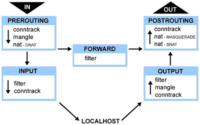

# iptables 入门


防火墙是保护服务器和基础设施的重要工具。在Linux生态系统中，iptables是一个广泛使用的防火墙工具，它与内核的 netfilter 数据包过滤框架协同工作。

Netfilter为程序提供了钩子点。当数据包流经网络栈时，将触发相应钩子的内核模块。具体触发哪些钩子取决于数据包的进出方向、目标地址以及是否在之前节点被丢弃/拒绝。


Netfilter钩子与内置链的对应关系及触发场景:

| netfilter 钩子       | 内置链      | 触发场景                                                     |
| -------------------- | ----------- | ------------------------------------------------------------ |
| `NF_IP_PRE_ROUTING`  | PREROUTING  | 所有入站流量进入网络栈后立即触发，发生于路由决策之前。       |
| `NF_IP_LOCAL_IN`     | INPUT       | 经路由判定目标为本机的入站数据包触发。                       |
| `NF_IP_FORWARD`      | FORWARD     | 经路由判定需转发至其他主机的数据包触发。                     |
| `NF_IP_LOCAL_OUT`    | OUTPUT      | 本地生成的出站流量进入网络栈时即刻触发。                     |
| `NF_IP_POST_ROUTING` | POSTROUTING | 所有出站或转发的流量在完成路由后、即将发送至物理链路前触发。 |

假设服务器知道如何路由数据包，而且防火墙允许数据包传输，下面就是不同场景下包的游走流程：

- 收到的、目的是本机的包：`PRETOUTING` -> `INPUT`
- 收到的、目的是其他主机的包：`PRETOUTING` -> `FORWARD` -> `POSTROUTING`
- 本地产生的包：`OUTPUT` -> `POSTROUTING`


iptables通过**表**对规则进行分类，每个表包含一组链（**并非所有表都包含全部链**），链中存放实际规则。

| Raw        | Mangle      | Nat         | Filter  | Security |
| ---------- | ----------- | ----------- | ------- | -------- |
| PREROUTING | PREROUTING  | PREROUTING  |         |          |
|            | INPUT       |             | INPUT   | INPUT    |
|            | FORWARD     |             | FORWARD | FORWARD  |
| OUTPUT     | OUTPUT      | OUTPUT      | OUTPUT  | OUTPUT   |
|            | POSTROUTING | POSTROUTING |         |          |

注意：**同一表中的不同链**（如 filter 表的 INPUT 和 FORWARD），**以及不同表中的同名链**（如 filter 表的 INPUT 和 security 表的 INPUT），可配置的规则类型均不同。


在iptables的不同表中存在同名链类型。例如nat、raw、mangle三个表都包含 PREROUTING 链，它们都关联到 NF_IP_PRE_ROUTING 钩子。当数据包到达这个钩子时，系统会按照预设的优先级顺序依次处理不同表中的 PREROUTING 链，具体顺序为：

| Tables/Chains  | PREROUTING | INPUT | FORWARD | OUTPUT | POSTROUTING |
| :------------- | :--------- | :---- | :------ | :----- | :---------- |
| (路由判断)     |            |       |         | Y      |             |
| **raw**        | Y          |       |         | Y      |             |
| (连接跟踪）    | Y          |       |         | Y      |             |
| **mangle**     | Y          | Y     | Y       | Y      | Y           |
| **nat (DNAT)** | Y          |       |         | Y      |             |
| (路由判断)     | Y          |       |         | Y      |             |
| **filter**     |            | Y     | Y       | Y      |             |
| **security**   |            | Y     | Y       | Y      |             |
| **nat (SNAT)** |            | Y     |         | Y      | Y           |

- 当触发某个 netfilter 的钩子时，系统会按照表格中自上而下的顺序执行处理流程。
- 某些情况下会跳过特定表的特定链处理，例如：对于新建的网络连接，只有首个数据包会经过 NAT 规则匹配，后续数据包会自动沿用已建立的转换规则


目标为本机的入站包：**PREROUTING → INPUT**

- 依次经过raw、mangle、nat(DNAT)表的PREROUTING链，再经mangle、filter、security、nat(SNAT)表的INPUT链。


**规则**放置在**特定表**的**特定链**里面。当**链被调用**的时候，包会按优先级**依次匹配链里面的规则**。

规则由**匹配条件**与**目标动作**两部分构成，存储在特定表的链中。链被调用时，数据包将按顺序匹配链中所有规则。

**匹配条件**

通过灵活的组合条件识别目标流量，支持：

- 协议类型（TCP/UDP/ICMP等）
- 源/目标地址与端口
- 输入/输出接口
- 连接状态（NEW/ESTABLISHED等）
- 扩展模块（如字符串匹配、时间限制等）


**目标动作**

分为两类处理方式：

- **终止型目标**：如`ACCEPT`（放行）、`DROP`（静默丢弃）、`REJECT`（拒绝并响应）。触发后立即终止当前链的评估。
- **非终止型目标**：如`LOG`（记录日志）、`MARK`（打标记）。执行后继续评估后续规则。
- **跳转目标**：通过`-j`跳转至用户自定义链，实现模块化规则管理。自定义链处理完毕后返回原链继续执行，或通过`RETURN`提前返回。


**用户自定义链**

跳转目标是跳转到其他链继续处理。此前我们已讨论过与 netfilter 钩子绑定的内置链，这些钩子会主动调用内置链。然而，iptables还允许管理员出于组织管理目的创建自定义链。

规则可以像存入内置链那样被放置在用户自定义链中。不同之处在于，用户自定义链只能通过规则"跳转"（jumping）的方式被访问（它们本身并未注册到任何netfilter钩子）。

用户自定义链实质上是调用链的功能扩展。例如，当用户自定义链的规则遍历完毕，或匹配规则激活了RETURN目标时，数据包跳转至发起调用的原链。还可以继续跳转到其他用户自定义链。


**连接状态（匹配条件）**

连接状态在**规则匹配条件**中使用，连接跟踪系统中的连接状态有：

- `NEW`：如果到达的包关连不到任何已有的连接，但包是合法的，就为这个包创建一个新连接。对 面向连接的（connection-aware）的协议例如 TCP 以及非面向连接的（connectionless ）的协议例如 UDP 都适用
- `ESTABLISHED`：当一个连接收到应答方向的合法包时，状态从 `NEW` 变成 `ESTABLISHED`。对 TCP 这个合法包其实就是 `SYN/ACK` 包；对 UDP 和 ICMP 是源和目 的 IP 与原包相反的包
- `RELATED`：包不属于已有的连接，但是和已有的连接有一定关系。这可能是辅助连接（ helper connection），例如 FTP 数据传输连接，或者是其他协议试图建立连接时的 ICMP 应答包
- `INVALID`：包不属于已有连接，并且因为某些原因不能用来创建一个新连接，例如无法 识别、无法路由等等
- `UNTRACKED`：如果在 `raw` table 中标记为目标是 `UNTRACKED`，这个包将不会进入连 接跟踪系统
- `SNAT`：包的源地址被 NAT 修改之后会进入的虚拟状态。连接跟踪系统据此在收到 反向包时对地址做反向转换
- `DNAT`：包的目的地址被 NAT 修改之后会进入的虚拟状态。连接跟踪系统据此在收到 反向包时对地址做反向转换

这些状态可以定位到连接生命周期内部，管理员可以编写出更加细粒度、适用范围更大、更 安全的规则。


## iptables 介绍

> linux的包过滤功能，即linux防火墙，由 `netfilter` 和 `iptables` 两个组件组成。
>
> `netfilter` 组件也叫做内核空间，是内核的一部分，由一些信息包过滤表组成。这些表包含内核用来控制信息包过滤处理的规则集。
>
> `iptables` 组件是一种工具，也称为用户空间，它使插入、修改和除去信息包过滤表中的规则变得容易。


## iptables 的结构

> ```
> iptables --> Tables --> Chains --> Rules
> ```
>
> 简单的讲，tables由chains组成，chains又由rules组成。iptables默认有四个表 **Filter** **NAT** **Mangle** **Raw** ，其包含的链如下:
>
> > | Raw表        | Mangle表      | Nat表         | Filter表  |
> > | ------------ | ------------- | ------------- | --------- |
> > | Prerouting链 | Prerouting链  | Prerouting链  | Input链   |
> > | Output链     | Postrouting链 | Postrouting链 | Forward链 |
> > |              | Input链       | Output链      | Output链  |
> > |              | Output链      |               |           |
> > |              | Forward链     |               |           |


## iptables 的工作流程



iptables 工作流程


## filter 表详解

1. 在iptables 中，filter表起过滤数据包的功能，它具有以下三种内建链:

    ```
    INPUT链 - 处理来自外部的数据
    OUTPUT链 - 处理向外发送的数据
    FORWARD链 - 将数据转发到本机的其他网卡设备上
    ```

2. 数据流向场景:

    ```
    访问本机: 在INPUT链上做过滤
    本机访问外部: 在OUTPUT链上做过滤
    通过本机访问其他主机: 在FORWARD链上做过滤
    ```

3. iptables 基本操作

    - 启动iptables: `service iptables start`
    - 关闭iptables: `service iptables stop`
    - 重启iptables: `service iptables restart`
    - 查看iptables状态: `service iptables status`
    - 保存iptables配置: `service iptables save`
    - iptables 服务配置文件: `/etc/sysconfig/iptables-config`
    - iptables 规则保存文件: `/etc/sysconfig/iptables`
    - 打开iptables 转发: `echo "1" > /proc/sys/net/ipv4/ip_forward`


## iptables 命令参考

> 命令:
>
> ```
> iptables [ -t 表名 ] 命令选项 [ 链名 ] [ 条件匹配 ] [ -j 目标动作或跳转 ]
> ```

- 表名: Filter Nat Mangle Raw 起包过滤功能的表为Filter ，可以不填，默认为Filter

- 命令选项

    > | -A           | 在指定的链末尾追加一条新的规则         |
    > | ------------ | -------------------------------------- |
    > | -D           | 删除指定链中的一条规则                 |
    > | -I           | 在指定的链中插入一条新的规则           |
    > | -R           | 修改或替换指定链中的一条规则           |
    > | -L           | 列出指定链中的所有规则                 |
    > | -F           | 清空指定链中的所有规则                 |
    > | -N           | 新建一条用户自定义的规则链             |
    > | -X           | 删除指定表中用户自定义的规则链         |
    > | -P           | 设置指定链的默认策略                   |
    > | -n           | 以数字形式显示输出结果                 |
    > | -v           | 查看规则列表时显示详细信息             |
    > | -V           | 查看iptables 版本信息                  |
    > | -h           | 查看帮助信息                           |
    > | –line-number | 查看规则列表时，显示规则在链中的顺序号 |

- 链名

    ```
    INPUT链 - 处理来自外部的数据
    OUTPUT链 - 处理向外发送的数据
    FORWARD链 - 将数据转发到本机的其他网卡设备上
    ```

- 条件匹配

    > 条件匹配分为基本匹配和扩展匹配，扩展匹配又分为隐式扩展和显示扩展

    - 基本匹配

        | 匹配参数 | 说明                            |
        | -------- | ------------------------------- |
        | -p       | 指定规则协议，tcp udp icmp all  |
        | -s       | 指定数据包的源地址，ip hostname |
        | -d       | 指定目的地址                    |
        | -i       | 输入接口                        |
        | -o       | 输出接口                        |

    - 隐式扩展匹配

        | 隐含扩展条件 | 需包含          | 扩展项     | 说明                        |
        | ------------ | --------------- | ---------- | --------------------------- |
        | -m tcp       | -p tcp          | –sport     | 源端口                      |
        | –dport       | 目标端口        |            |                             |
        | –tcp-flags   | SYN ACK RST FIN |            |                             |
        | –syn         | 第一次握手      |            |                             |
        | -m udp       | -p udp          | –sport     | 源端口                      |
        | –dport       | 目标端口        |            |                             |
        | -m icmp      | -p icmp         | –icmp-type | 8:echo-request 0:echo-reply |

    - 显示扩展匹配

    > | 显示扩展条件       | 扩展项                          | 说明           |
    > | ------------------ | ------------------------------- | -------------- |
    > | -m state           | –state                          | 检测连接的状态 |
    > | -m multiport       | –source-ports                   | 多个源端口     |
    > | –destination-ports | 多个目的端口                    |                |
    > | –ports             | 源和目的端口                    |                |
    > | -m limit           | –limit                          | 速率(包/分钟)  |
    > | –limit-burst       | 峰值速率                        |                |
    > | -m connlimit       | –connlimit-above n              | 多个条件       |
    > | -m iprange         | –src-range ip-ip                | 源IP范围       |
    > | –dst-range ip-ip   | 目的IP范围                      |                |
    > | -m mac             | –mac-source                     | mac地址限制    |
    > | -m string          | –algo [bm\|kmp]                 | 匹配算法       |
    > | –string “pattern”  | 要匹配的字符串                  |                |
    > | -m recent          | –name                           | 设定列表名称   |
    > | –rsource           | 源地址                          |                |
    > | –rdest             | 目的地址                        |                |
    > | –set               | 添加源地址的包到列表中          |                |
    > | –update            | 每次建立连接都更新列表          |                |
    > | –rcheck            | 检测地址是否在列表              |                |
    > | –seconds           | 指定时间内，与rcheck,update共用 |                |
    > | –hitcount          | 命中次数，与rcheck，update共用  |                |
    > | –remove            | 在列表中删除相应地址            |                |

> - 目标值
>
>     数据包控制方式分为四种:
>
>     ```
>     ACCEPT:  允许数据包通过
>     DROP:    直接丢弃数据包，不给出任何回应信息
>     REJECT:  拒绝数据包通过，必须时会给数据发送端一个响应信息
>     LOG:     在日志文件中记录日志信息，然后将数据包传递给下一条规则
>     QUEUE:   防火墙将数据包移交到用户空间
>     RETURN:  防火墙停止执行当前链中的后续Rules，并返回到调用链
>     ```


## iptables 常见命令

1. 删除iptables 现有规则

    `iptables -F`

2. 查看iptables规则

    `iptables -L (iptables -L -v -n)`

3. 增加一条规则到最后

    `iptables -A INPUT -i eth0 -p tcp --dport 80 -m state --state NEW,ESTABLISHED -j ACCEPT`

4. 添加一条规则到指定位置

    `iptables -I INPUT 2 -i eth0 -p tcp --dport 80 -m state --state NEW,ESTABLISHED -j ACCEPT`

5. 删除一条规则

    `iptables -D INPUT 2`

6. 修改一条规则

    `iptables -R INPUT 3 -i eth0 -p tcp --dport 80 -m state --state NEW,ESTABLISHED -j ACCEPT`

7. 设置默认策略

    `iptables -P INPUT DROP`

8. 允许远程主机进行ssh连接

    `iptables -A INPUT -i eth0 -p tcp --dport 22 -m state --state NEW,ESTABLISHED -j ACCEPT`

    `iptables -A OUTPUT -o eth0 -p tcp --sport 22 -m state --state ESTABLISHED -j ACCEPT`

9. 允许本地主机进行ssh连接

    `iptables -A INPUT -i eth0 -p tcp --sport 22 -m state --state ESTABLISHED -j ACCEPT`

    `iptables -A OUTPUT -o eth0 -p tcp --dport 22 -m state --state NEW,ESTABLISHED -j ACCEPT`

10. 允许HTTP请求

    `iptables -A INPUT -i eth0 -p tcp --dport 80 -m state --state NEW,ESTABLISHED -j ACCEPT`

    `iptables -A OUTPUT -o eth0 -p tcp --sport 80 -m state --state ESTABLISHED -j ACCEPT`

11. 限制ping 192.168.146.3主机的数据包数，平均2/s，最多不能超过3个

    `iptables -A INPUT -i eth0 -d 192.168.146.3 -p icmp --icmp-type 8 -m limit --limit 2/second --limit-burst 3 -j ACCEPT`

12. 限制ssh连接速率（默认策略是DROP）

    `iptables -I INPUT 1 -p tcp --dport 22 -d 192.168.146.3 -m state --state ESTABLISHED -j ACCEPT`

    `iptables -I INPUT 2 -p tcp --dport 22 -d 192.168.146.3 -m limit --limit 2/minute --limit-burst 2 -m state --state NEW -j ACCEPT`


## 如何正确配置iptables

1. 删除现有规则

    ```
    iptables -F
    ```

2. 配置默认链策略

    ```
    iptables -P INPUT DROP
    iptables -P FORWARD DROP
    iptables -P OUTPUT DROP
    ```

3. 允许远程主机进行ssh连接

    ```
    iptables -A INPUT -i eth0 -p tcp --dport 22 -m state --state NEW,ESTABLISHED -j ACCEPT
    iptables -A OUTPUT -o eth0 -p tcp --sport 22 -m state --state ESTABLISHED -j ACCEPT
    ```

4. 允许本地主机进行ssh连接

    ```
    iptables -A OUTPUT -o eth0 -p tcp --dport 22 -m state --state NEW,ESTABLISHED -j ACCEPT
    iptables -A INPUT -i eth0 -p tcp --sport 22 -m state --state ESTABLISHED -j ACCEPT
    ```

5. 允许HTTP请求

    ```
    iptables -A INPUT -i eth0 -p tcp --dport 80 -m state --state NEW,ESTABLISHED -j ACCEPT
    iptables -A OUTPUT -o eth0 -p tcp --sport 80 -m state --state ESTABLISHED -j ACCEPT
    ```


## 使用iptables 抵御常见攻击

1. 防止SYN攻击

    - 限制SYN请求速度，需要设置一个合理的速度，不然会影响正常用户的请求

        ```
        iptables -N syn-flood  #新建一条规则链
        iptables -A INPUT -p tcp --syn -j syn-flood  #输入的SYN请求跳转到syn-flood规则链
        iptables -A syn-flood -m limit --limit 1/s --limit-burse 4 -j RETURN
        iptables -A syn-flood -j DROP
        ```

    - 限制单个IP的最大SYN连接数

        ```
        iptables -A INPUT -i eth0 -p tcp --syn -m connlimit --connlimit-above 15 -j DROP
        ```

2. 防止DOS攻击

    使用recent模块抵御DOS攻击:

    ```
    iptables -I INPUT -p tcp --dport 22 -m connlimit --connlimit-above 3 -j DROP  #单个IP最多连接3个会话
    iptables -I INPUT -p tcp --dport 22 -m state --state NEW -m recent --set --name SSH   #只要是新的连接请求，就把它加入到SSH列表中
    iptables -I INPUT -p tcp --dport 22 -m state --state NEW -m recent --update --seconds 300 --hitcount 3 --name SSH -j DROP  #5分钟内尝试次数达到3次，就拒绝提供SSH列表中的这个IP服务，被限制五分钟后即可恢复访问
    ```

3. 防止单个IP访问量过大

    ```
    iptables -I INPUT -p tcp --dport 80 -m connlimit --connlimit-above 30 -j DROP
    ```

4. 木马反弹

    ```
    iptables -A OUTPUT -m state --state NEW -j DROP
    ```

5. 防止ping 攻击

    ```
    iptables -A INPUT -p icmp --icmp-type echo-request -m limit --limit 1/m -j ACCEPT
    ```