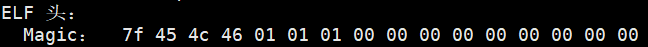
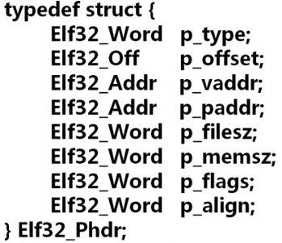
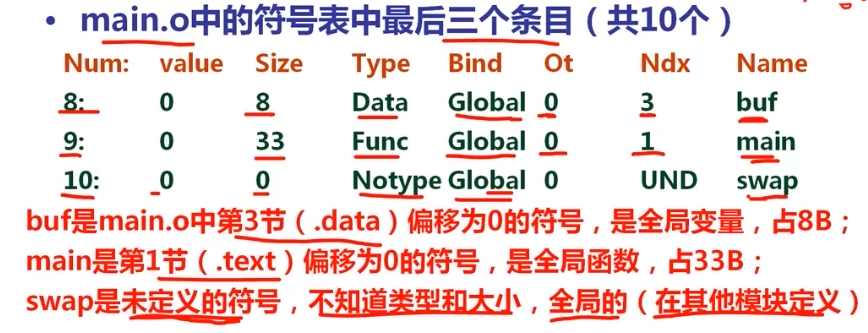
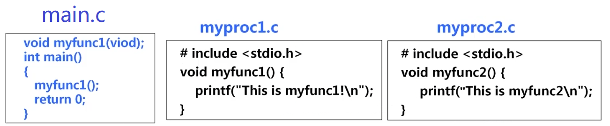

# elf文件

# elf header


## e_ident



这是一个16字节的`unsigned char`数组。

### Magic Num - e_ident[0:3]

前四个字节包含着一个 `magic number`，表示该文件是一个 ELF 文件。这四个字节的值分别是`0x7f，0x45，0x4c，0x46`，对应ASCII字符就是`.ELF`


### EI_Class - e_ident[4]

指示文件类型，是ELF32还是ELF64位。如果这个字节的值是0x01，那么就表示这是一个32位的ELF文件；如果这个字节的值是0x02，那么就表示这是一个64位的ELF文件。


### EI_DATA - e_ident[5]

数据编码，确定小端序还是大端序。如果这个字节的值是0x01，那么就表示这是一个小端序的ELF文件；如果这个字节的值是0x02，那么就表示这是一个大端序的ELF文件


小端序和大端序是计算机中用于区分多个字节数据的存储顺序的概念。

- 大端序（Big-Endian）：高位字节存储在低地址，低位字节存储在高地址。这种排列方式与数据用字节表示时的书写顺序一致，符合人类的阅读习惯。

- 小端序（Little-Endian）：低位字节存储在低地址，高位字节存储在高地址。小端序与人类的阅读习惯相反，但更符合计算机读取内存的方式，因为CPU读取内存中的数据时，是从低地址向高地址方向进行读取。


例如，将12345678h写入1000h开始的内存中，以大端序和小端序模式存放结果如下2：

- 大端序：在内存地址1000h处存储12，1001h处存储34，1002h处存储56，1003h处存储78。
- 小端序：在内存地址1000h处存储78，1001h处存储56，1002h处存储34，1003h处存储12。


### EI_Version - e_ident[6]

标识ELF Version, 该值等于EV_CURRENT，目前为1，这个字段表示文件版本。它用于标识ELF文件的版本。


### EI_OSABI - e_ident[7]

 表示着该文件运行的操作系统


### EI_ABIVERSION - e_ident[8]

 标志着 ABI （应用二进制接口）的版本，ABI相当于硬件层级的API。


### EI_PAD - e_ident[8:15]

 填充位，用零填充用以对齐，可以预留给未来使用


## e_type

此成员标识对象文件类型。


| 字段        | 值       | 意义           |
| ----------- | -------- | -------------- |
| `ET_NONE`   | `0`      | 无文件类型     |
| `ET_REL`    | `1`      | 可重定位文件   |
| `ET_EXEC`   | `2`      | 可执行文件     |
| `ET_DYN`    | `3`      | 共享对象文件   |
| `ET_CORE`   | `4`      | 核心文件       |
| `ET_LOOS`   | `0xfe00` | 特定于操作系统 |
| `ET_HIOS`   | `0xfeff` | 特定于操作系统 |
| `ET_LOPROC` | `0xff00` | 特定于处理器   |
| `ET_HIPROC` | `0xffff` | 特定于处理器   |


尽管未指定核心文件内容， type 保留用于标记文件。


## e_machine

表示当前机器（CPU）的架构


## e_version

此成员标识对象文件版本。

| 名字         | 值   | 意义     |
| ------------ | ---- | -------- |
| `EV_NONE`    | `0`  | 版本无效 |
| `EV_CURRENT` | `1`  | 目前版本 |


## e_entry

程序入口点地址，这是可执行程序的入口点地址。


## e_phoff

程序头部表偏移，从ELF文件头部到程序头部的第一个字节的字节数 ，如果没有则02。一般来说，程序头部就在elf头部下面，所以程序头部偏移一般等于elf头部大小。


## e_shoff

节区头部表偏移，从ELF文件头部到节区头部的第一个字节的字节数这是节区表的索引地址，如果没有则为02。


## e_flags

处理器标志，这是处理器的标志。


## e_ehsize

ELF头部大小，这是ELF头部的大小2。


## e_phentsize

程序头部表项大小，这是程序头部表的单个表项的大小2。

程序头部表，实际上是一个数组，一个表项实际上是数组中的一个元素，这里说的表项大小，实际上指的是数组中一个元素所占的字节数。


## e_phnum

程序头部表项数，这是程序头部表的表项数。

这里指的是程序头部数组中，元素的个数。


## e_shentsize

节区头部表项大小，这是节区表的单个表项的大小2。

节区头部表，实际上是一个数组，一个表项实际上是数组中的一个元素，这里说的表项大小，实际上指的是数组中一个元素所占的字节数。


## e_shnum

节区头部表项数，这是节区表的表项数2。

这里指的是节区头部表中，元素的个数。


## e_shstrndx

ELF文件中有一个节用于存储节区的名称，这里是为n表示节用于存储节区名称的节区在第n个


# 节区头部


## sh_name

`sh_name`字段表示节区名字在`.shstrtab`节区中的偏移。`.shstrtab`节区是一个特殊的节区，它包含了所有节区的名称。例如，如果`sh_name`的值是10，那么这个节区的名称就在`.shstrtab`节区的第10个字节开始。


## sh_type

`sh_type`字段表示节区的类型。例如，它可以是`SHT_SYMTAB`（符号表）、`SHT_RELA`（重定位条目，带有显式加数）等。


## sh_flags

`sh_flags`字段表示节区的标志，这些标志描述了节区在虚拟空间中的访问属性。例如，`SHF_WRITE`表示节区是可写的，`SHF_ALLOC`表示节区在执行过程中占用内存。


## sh_addr

如果节区会被加载到内存中，那么`sh_addr`字段就表示节区的虚拟地址。例如，如果一个节区在程序运行时被加载到内存地址0x400000，那么`sh_addr`的值就是0x400000。


## sh_offset

`sh_offset`字段表示节区在文件中的偏移地址。例如，如果一个节区从文件的第1024个字节开始，那么`sh_offset`的值就是1024。注意，对于`.bss`节区来说，这个字段没有意义，因为`.bss`节区在文件中不占用任何空间。


## sh_size

`sh_size`字段表示节区在文件中所占的长度。例如，如果一个节区的长度是400字节，那么`sh_size`的值就是400。


## sh_link

`sh_link`和`sh_info`字段用于与链接相关的节区，如`.rel.text`、`.rel.data`、`.symtab`等节区。例如，对于符号表（`SHT_SYMTAB`或`SHT_DYNSYM`）节区，`sh_link`字段指向与符号表条目相关的字符串表。


## sh_info

`sh_info`字段的含义取决于节区的类型。例如，对于符号表（`SHT_SYMTAB`或`SHT_DYNSYM`）节区，`sh_info`字段表示第一个非局部符号的索引。


## sh_addralign

`sh_addralign`字段表示节区的对齐要求。例如，如果一个节区需要按照4字节对齐，那么`sh_addralign`的值就是4。


## sh_entsize

`sh_entsize`字段表示节区中每个表项的长度。如果节区中的表项长度不固定，那么这个字段的值就是0。例如，对于符号表节区，每个表项的长度是固定的，所以`sh_entsize`的值就是符号表条目的长度。


# ELF文件的程序头部



ELF文件的程序头部包含了一些重要的信息，这些信息描述了文件中的各个段（segment）。下面是对这些字段的详细解释：

## p_type

`p_type`字段表示段的类型。例如，它可以是`PT_LOAD`（可加载的段）、`PT_DYNAMIC`（动态链接信息）等。

## p_offset

`p_offset`字段表示段在文件中的偏移地址。例如，如果一个段从文件的第1024个字节开始，那么`p_offset`的值就是1024。

## p_vaddr

`p_vaddr`字段表示段在虚拟内存中的地址。例如，如果一个段在程序运行时被加载到内存地址0x400000，那么`p_vaddr`的值就是0x400000。

## p_paddr

`p_paddr`字段表示段在物理内存中的地址。在系统软件中，这个字段有特殊的用途。在其他情况下，它通常被设置为和`p_vaddr`字段相同的值。

## p_filesz

`p_filesz`字段表示段在文件中所占的长度。例如，如果一个段的长度是400字节，那么`p_filesz`的值就是400。

## p_memsz

`p_memsz`字段表示段在内存中所占的长度。注意，这个长度可能大于`p_filesz`字段的值，因为有些段在内存中的长度会因为`.bss`节区的存在而变大。

## p_flags

`p_flags`字段表示段的标志，这些标志描述了段在虚拟空间中的访问属性。例如，`PF_X`表示段是可执行的，`PF_W`表示段是可写的，`PF_R`表示段是可读的。

## p_align

`p_align`字段表示段的对齐要求。例如，如果一个段需要按照4字节对齐，那么`p_align`的值就是4。在加载段到内存时，`p_vaddr`和`p_offset`字段的值必须满足这个对齐要求。


# 静态链接


## 符号链接的类型

Global symbols（模块内部定义的，全局符号）

由模块m定义并能被其他模块引用的符号。例如，非static C函数和非static的C全局变量


External symbols(外部定义的，外部符号)

由其他模块定义并被模块m引用的全局符号


Local symbols（本模块定义并引用的，局部符号）
仅由模块m定义和引用的本地符号。例如，在模块m中定义的带static的C函数和变量


局部符号不是局部变量，局部变量是分配在栈中的临时变量，链接器不关心这种局部变量。


## 全局符号强弱性

在C语言中，全局符号（如函数和全局变量）可以被定义为强符号或弱符号。

强符号是由函数定义和已初始化的全局变量定义产生的，而弱符号是由未初始化的全局变量定义产生的。

链接器在解析符号引用时，会优先选择强符号。


1. 如果一个符号被多次定义为强符号则会报错。
2. 如果一个符号同时被定义为强符号和弱符号，那么链接器会忽略弱符号。
3. 如果一个符号只被定义为弱符号，那么链接器会选择任意一个。


## 符号表

符号表是一个在编译时生成的数据结构，它存储了程序中所有的函数和变量的名称、类型和地址。符号表是链接器解析符号引用和进行重定位的重要依据。




st_name

ELF文件中有一个节区，用于存放符号表的名称，st_name表示符号名称在节区中的偏移量，也就是从节区首地址，到该符号名称字符串首地址之间的距离


st_value

如果是函数，表示函数名在text节中的偏移量，

如果是变量，表示变量在data节或者bss节中的偏移量


st_size

如果是函数，表示该函数编译成汇编代码后，整个函数所占的字节数

如果是变量，表示该变量类型所占的字节数（例如：变量是int型，那么这里就是4字节）


st_info

指出符号的类型或者绑定的属性

类型（type）：数据、函数、源文件、节、未知

绑定属性（bind）：全局符号、局部符号、若符号


st_shndx

符号对应目标所在的节，例如该符号是一个函数，在.text节中，而.text节是ELF文件中第2个节，那么这里就是2

其他情况：ABS表示不被重定位；UND表示未定义；COM表示未初始化数据（.bss），此时value表示对齐要求，size给出最小大小


## 符号解析

程序中有定义和引用的符号（函数和变量）


编译器将定义的符号放在符号表（节）中。

编译器将符号的引用存放在重定位节(.ret.text和.ret.data)中。


连接器将**每个符号的引用**都与**一个确定的符号定义**建立连接


### 符号解析过程




- **E**：所有将被合并以组成可执行文件的目标文件集合。
- **U**：当前所有未解析的引用符号的集合。
- **D**：当前所有定义符号的集合。


1. 在开始时，E、U、D都是空的。然后，我们首先扫描`main.o`，并将它加入到E中。同时，我们将`myfunc1`加入到U中，将`main`加入到D中。
2. 接下来，我们扫描`mylib.a`，并将U中所有符号（在这个例子中是`myfunc1`）与`mylib.a`中所有目标模块（`myproc1.o`和`myproc2.o`）进行匹配。
3. 我们发现`myfunc1`在`myproc1.o`中被定义，因此我们将`myproc1.o`加入到E中，将`myfunc1`从U转移到D中。
4. 在`myproc1.o`中，我们发现还有一个未解析的符号`printf`，因此我们将它加入到U中。
5. 此时U中只有一个未解析的符号`printf`，而D中有`main`和`myfunc1`。
6. 由于模块`myproc2.o`没有被加入到E中，因此它被丢弃。
7. 接下来，扫描默认的库文件`libc.a`。我们发现其目标模块`printf.o`定义了`printf`，于是`printf`也从U移到D，并将`printf.o`加入E。
8. 同时，我们把它定义的所有符号加入D，而所有未解析的符号加入U。


处理完`libc.a`时，U一定是空的。这是因为`libc.a`是标准C库，它提供了C语言的所有标准函数，因此，任何一个C程序都可以在`libc.a`中找到它需要的所有函数。这也就是为什么我们在链接时总是会扫描`libc.a`的原因。


### 链接顺序问题


1. 链接器按照命令行给出的顺序扫描 `.o` 和 `.a` 文件。
2. 在扫描过程中，链接器将当前未解析的引用记录到一个列表 `U` 中。
3. 每当遇到一个新的 `.o` 或 `.a` 中的模块，链接器都会尝试用它来解析 `U` 中的符号。
4. 如果在扫描结束时，`U` 中仍有未被解析的符号，则会发生错误。


例子1：假设我们有两个库 mylibc1.a 和 mylibc2.a，并且 mylibc1.a 调用了 mylibc2.a 中的某个函数。

在这种情况下，我们需要在命令行中首先指定 mylibc1.a，然后指定 mylibc2.a。

这样，链接器在扫描 mylibc1.a 时会将未解析的引用添加到列表 U 中，然后在扫描 mylibc2.a 时解析这些引用。对应的编译命令可能如下：

```
gcc -o myprog myprog.o mylibc1.a mylibc2.a
```


例子2： mylibc1.a 调用了 mylibc2.a 中的某个函数， mylibc2.a 也调用了 mylibc1.a 中的某个函数。

在这种情况下，需要在命令行中首先指定 mylibc2.a，然后指定 mylibc1.a。然后，需要再次指定 mylibc2.a，以解析在扫描 mylibc1.a 时添加到列表 U 中的任何新引用。

因此，命令行应该是 mylibc2.a mylibc1.a mylibc2.a。这样，链接器可以正确解析所有的外部引用。

如果在最后一次扫描 mylibc2.a 后，列表 U 中仍有未解析的引用，那么链接器将报错。这就是为什么我们可能需要在命令行中多次指定同一个库的原因。这种情况通常在库之间存在循环依赖时出现。对应的编译命令可能如下：

```
gcc -o myprog myprog.o mylibc2.a mylibc1.a mylibc2.a
```


例子3：一个库 `mylibc.a` 中的两个文件 `my1.o` 和 `my2.o` 互相引用。

链接器会按照它们在库中的顺序来扫描这两个文件。如果 `my1.o` 在 `my2.o` 之前，并且 `my1.o` 引用了 `my2.o` 中的符号，那么在扫描 `my1.o` 时，链接器会将这个未解析的引用添加到列表 `U` 中，然后在扫描 `my2.o` 时解析这个引用。

然而，如果 `my2.o` 也引用了 `my1.o` 中的符号，那么在扫描 `my2.o` 时，链接器会将这个未解析的引用添加到列表 `U` 中。但是，由于 `my1.o` 已经被扫描过了，所以链接器无法解析这个引用，从而导致错误。

为了解决这个问题，我们需要在命令行中多次指定这个库，以便链接器可以多次扫描它。例如，我们可以使用以下命令：

```
gcc -o myprog myprog.o mylibc.a mylibc.a
```


## 重定位


### PC相对地址重定位

PC相对地址重定位是一种常用的重定位方式，它主要用于处理跳转和分支指令。在这种情况下，目标地址是相对于当前指令的位置计算的，也就是说，它是基于程序计数器（PC）的值来确定的。

当链接器合并多个目标文件时，就可以知道程序加载到内存后的虚拟地址了，每个文件中的符号引用都需要进行重定位。在PC相对地址重定位中，链接器会将每个符号引用修改为从当前指令到目标地址的相对偏移量。例如，如果一个`call`指令引用了一个函数，那么链接器会计算从`call`指令到函数入口的偏移量，并将这个偏移量填写到`call`指令中。这样，当程序加载到内存并开始执行时，`call`指令就可以正确地跳转到函数入口。

PC相对地址重定位的优点是它可以使生成的可执行文件位置无关，也就是说，无论程序加载到内存的什么位置，它都可以正确地执行。这是因为PC相对地址重定位使用的是相对偏移量，而不是绝对地址。


### 绝对地址重定位

绝对地址重定位是另一种重定位方式，它直接使用目标地址，而不是相对偏移量。在这种情况下，链接器会将每个符号引用修改为目标地址。

当链接器合并多个目标文件时，就可以知道程序加载到内存后的虚拟地址了，链接器会遍历每个文件中的所有符号引用，计算它们的目标地址，并将这些地址填写到符号引用的位置。

绝对地址重定位的优点是它可以直接使用目标地址，而不需要计算相对偏移量。然而，它的缺点是生成的可执行文件是位置相关的，也就是说，程序必须加载到内存的特定位置才能正确地执行。这是因为绝对地址重定位使用的是绝对地址，而不是相对偏移量。


### PC相对地址重定位

合并多个文件后，，然后将修改文件中的符号引用为相对的值，例如call 则填写此处到跳转目标出的差值


### 绝对地址重定位

合并多个文件后，就可以直到程序加载到内存后的虚拟地址了，直接在符号应用处填上虚拟地址。


# 动态链接


# 延迟绑定技术以及GOT和PLT表的详细介绍

## 引言

在计算机科学中，动态链接是一种在运行时将预编译的可执行代码（例如函数或模块）与主程序（调用代码）链接的过程。

在Linux系统中，动态链接主要依赖于两个重要的数据结构：全局偏移量表（GOT）和程序链接表（PLT）。这两个表在程序的运行时解析过程中起着至关重要的作用。


## 全局偏移量表（GOT）

全局偏移量表（GOT）是一个在程序的数据段中的表，它存储了程序中所有需要动态链接的函数和变量的地址。当程序第一次调用一个动态链接的函数时，动态链接器会查找该函数在动态链接库中的地址，然后将这个地址存储在GOT表中的相应条目中。这样，当程序再次调用这个函数时，它就可以直接从GOT表中获取这个函数的地址，而不需要再次进行查找。


## 程序链接表（PLT）

程序链接表（PLT）是一个在程序的代码段中的表，它包含了一系列的跳转指令，这些指令用于跳转到GOT表中的相应条目。当程序需要调用一个动态链接的函数时，它会首先跳转到PLT表中的相应条目，然后通过这个条目跳转到GOT表中的相应条目，最后跳转到这个函数在动态链接库中的实际地址。


## 延迟绑定

延迟绑定（也被称为惰性绑定）是一种优化技术，它可以延迟函数地址的解析过程，直到这个函数被实际调用为止。这种技术可以减少程序启动时的开销，并且可以使程序只解析那些实际需要的函数的地址。


在使用延迟绑定时，程序中的call指令会跳转到对应的PLT表项，然后PLT表项的第一条指令会跳转到GOT表中存放的地址。


### 第一次调用函数

1. 在第一次调用函数时，程序会call到对应的plt表。
2. plt表的第一条语句时，跳转到got表中存放的地址处，由于got表最初存放的地址为plt表第二条语句的首地址，所以相当于，plt表的第一条语句是跳转到plt表的第二条语句。
3. plt表的第二条语句是，将动态链接函数对应的标识，pushl到栈中，然后执行下一条语句。
4. plt表的第三条语句是跳转到plt[0]表。
5. plt[0]的第一条语句是将got[1]表的内容pushl到栈中，然后执行第二条语句。
6. plt[0]的第二条语句是跳转到got[2]表中存放地址的位置。
7. got[2]表存放的地址是，动态链接器延迟绑定代码的入口地址。
8. 动态链接器延迟绑定代码会，找到动态链接库中函数在内存中的地址，将地址保存到对应的got表中，然后跳转到该函数中执行函数


### 第二次调用函数

1. 在第一次调用函数时，程序会call到对应的plt表。
2. plt表的第一条语句时，跳转到got表中存放的地址处，由于got表地址已经被修改为了函数地址，所以plt的第一条语句执行后就跳转到了函数中，开始执行函数了