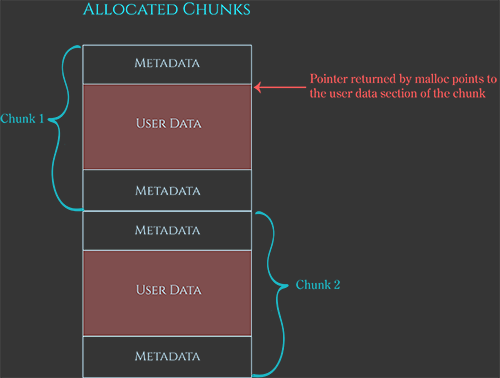
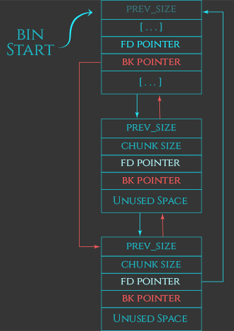
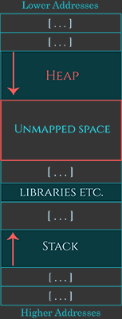
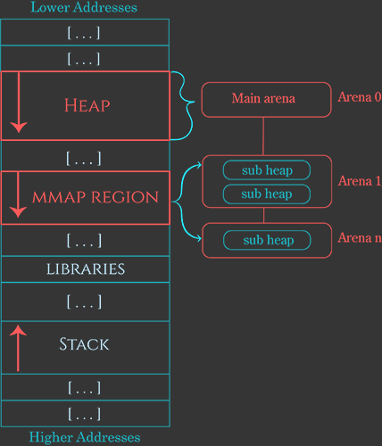
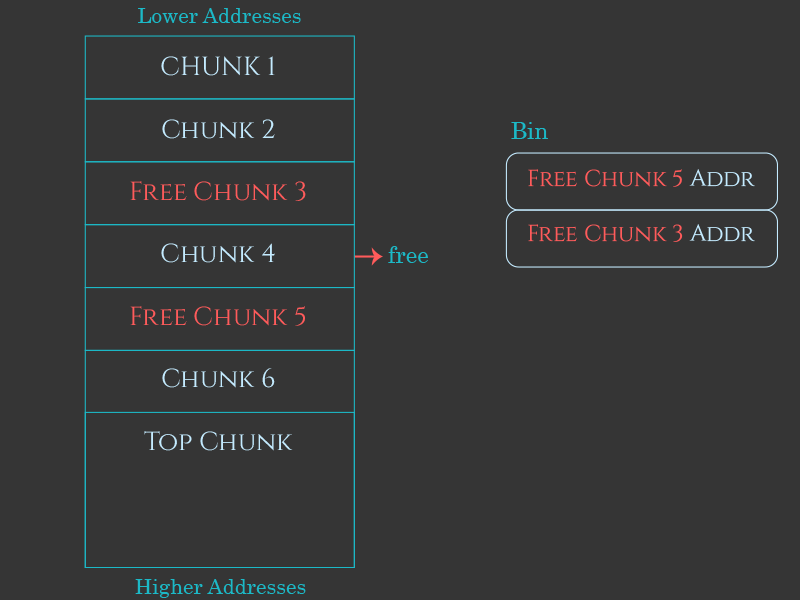
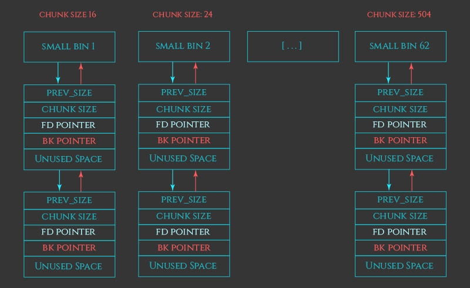

# heap

## 什么是堆，为什么人们使用它？

首先：什么是堆，它的用途是什么？

堆被C和C++程序员用来在程序执行期间手动分配新的进程内存区域。程序员通过调用诸如`malloc`之类的堆函数请求堆管理器分配这些内存区域。这些分配的内存区域，或称为“分配”，可以由程序员使用、修改或引用，直到程序员不再需要它，并通过调用`free`将其返回给堆管理器为止。


以下是一个C程序如何在堆上分配、使用并最终释放一个结构的例子：

```c
typedef struct { int field1; char* field2; } SomeStruct;

int main() {
    SomeStruct* myObject = (SomeStruct*)malloc(sizeof(SomeStruct));
    if (myObject != NULL) {
        myObject->field1 = 1234;
        myObject->field2 = "Hello World!";
        do_stuff(myObject);
        free(myObject);
    }
    return 0;
}
```


以下是程序员在使用堆时必须遵循的一些基本规则，以及如果违反这些规则可能会出现的漏洞类别。

**堆规则及其违反时可能出现的漏洞类别**

1. 如果由 `malloc` 返回的指针已被传递给 `free`，则**不要**读取或写入这个指针。
    - 可能导致 **释放后使用漏洞**。
2. 不要在堆分配中使用或泄露未初始化的信息。
    - 可能导致 **信息泄露或未初始化数据漏洞**。
3. 不要在分配的末尾之后读取或写入字节。
    - 可能导致 **堆溢出和越界读取漏洞**。
4. 不要将源自 `malloc` 的指针传递给 `free` 多次。
    - 可能导致 **重复释放漏洞**。
5. 不要在分配的开始之前读取或写入字节。
    - 可能导致 **堆下溢漏洞**。
6. 不要将未源自 `malloc` 的指针传递给 `free`。
    - 可能导致 **无效释放漏洞**。
7. 不要在检查 `malloc` 返回的指针是否为 `NULL` 之前使用该指针。
    - 可能导致 **空指针解引用漏洞和偶尔的任意写入漏洞**。

------

1. 除了 `calloc`，它通过将其初始化为零来显式初始化分配。
2. 或与 `malloc` 兼容的函数，包括 `realloc`、`calloc` 和 `memalign`。
3. `free(NULL)` 是允许的，不是无效释放，但什么也不做。


当然，`malloc`和`free`并不是C和C++程序员与堆交互的唯一方式。C++开发人员经常通过C++运算符`new`和`new[]`分配内存。这些分配必须通过对应的C++运算符`delete`和`delete[]`释放，而不是使用`free`。程序员还可以通过与`malloc`兼容的堆函数如`calloc`、`realloc`和`memalign`分配内存，这些函数像`malloc`一样，最终通过`free`释放。

为了简单起见，我最初只会讨论`malloc`和`free`。一旦我们理解了这两个函数，其他大多数堆函数就变得很容易理解了。


这里是一个C++程序如何在堆上分配、使用并最终释放一个结构的例子：

```c++
class SomeClass { public: int field1; char* field2; };

int main() {
    SomeClass* myObject = new SomeClass();
    myObject->field1 = 1234;
    myObject->field2 = "Hello World!";
    do_stuff(myObject);
    delete myObject;
    return 0;
}
```


## 内存块配策略

**内存块和块分配策略 Memory chunks and the chunk allocation strategies**

假设程序员通过`malloc`请求10字节的内存。为了满足这个请求，堆管理器不仅仅要找到一个随机的10字节区域供程序员写入。堆管理器还需要存储关于该分配的元数据。这个元数据是与程序员可以使用的10字节区域一起存储的。

堆管理器还必须确保分配是**32位系统上的8字节**对齐，或**64位系统上的16字节**对齐。如果程序员只是想存储一些文本字符串或字节数组，那么分配的对齐方式并不重要，但如果程序员打算使用分配来存储更复杂的数据结构，对齐方式可能会影响程序的正确性和性能。由于`malloc`无法知道程序员将在其分配中存储什么，堆管理器必须**默认确保所有分配都是对齐**的。

这个分配**元数据**和**对齐填充字节**是与`malloc`将返回给**程序员的内存区域一起存储**的。因此，堆管理器内部分配的“块”略大于程序员最初要求的大小。当程序员请求10字节的内存时，堆管理器会找到或创建一个新的块，该块足够大以存储10字节空间加上元数据和对齐填充字节。然后，堆管理器将此块标记为“已分配”，并将指向块内对齐的10字节“**用户数据”区域的指针返回给程序员**，作为`malloc`调用的返回值。




## 块分配：基本策略

那么堆管理器内部是如何分配这些块的呢？

首先，让我们看一下**小块内存分配（这是堆管理器所做的大部分工作）的简化策略**。我将在下面更详细地解释这些步骤，一旦我们完成了这些，我们可以看看巨大分配的特殊情况。

小块内存分配的简化策略如下：

1. 如果有**先前释放的块**，并且该块足够大以满足请求，堆管理器将使用该释放的块进行新的分配。
2. 否则，如果有可用空间位于堆的顶部，堆管理器将从该可用空间分配一个新的块并使用它。
3. 否则，堆管理器将请求内核向堆的末尾添加新内存，并从这个新分配的空间中分配一个新的块。
4. 如果所有这些策略都失败，分配无法完成，`malloc`返回`NULL`。


## 从空闲的 chunk 中分配

概念上，从已释放的块中分配是非常简单的。随着内存被传递回`free`，堆管理器在一系列不同的链表（称为“bins”）中跟踪这些已释放的块。当发出分配请求时，堆管理器会在这些bins中搜索一个足够大的已释放块以满足请求。如果找到了，它可以将该块从bin中移除，将其标记为“已分配”，然后将该块的“用户数据”区域的指针返回给程序员作为`malloc`的返回值。

出于性能原因，有几种不同类型的bins，即快速bin、未分类bin、小型bin、大型bin和每线程tcache。我将在本系列的下一部分详细介绍这些不同类型的bins。




## 从堆的顶部分配

如果没有可用的已释放块可以满足分配请求，堆管理器必须构造一个新的块。为此，堆管理器首先查看堆末尾的空闲空间（有时称为“top chunk”或“remainder chunk”），看是否有足够的空间。如果有，堆管理器会从这个空闲空间制造一个新的块。


### 什么是 "Top Chunk"？

"Top chunk" 位于当前堆的最末端。它是堆中最后一个未分配的、连续的空闲区域。

- 当程序请求新的内存分配时，堆管理器首先会检查是否有已释放的块可以满足请求。如果没有合适的已释放块，堆管理器会尝试从 "top chunk" 中分配内存。
- 如果 "top chunk" 的大小足够大，可以直接从中分割出一个新的块来满足分配请求，并将剩余的部分继续作为 "top chunk"。


如果 "top chunk" 的大小不足以满足请求，堆管理器会通过系统调用（如 `sbrk` 或 `mmap`）向操作系统请求更多的内存，以扩展堆的大小。**（扩展机制）**

- **单线程应用**：在单线程应用中，堆管理器通常使用 `sbrk` 系统调用来扩展堆。`sbrk` 会增加程序的“断点”（program break），从而为堆分配更多的内存。每次 `sbrk` 调用都会将新的内存添加到 "top chunk" 的末尾。
- **多线程应用**：在多线程应用中，堆管理器可能会使用 `mmap` 来为次要 arena（secondary arenas）创建新的子堆（subheaps）。每个子堆也有自己的 "top chunk"，用于管理该子堆的扩展。


**回收机制**

当程序释放内存时，如果释放的块位于 "top chunk" 的前面，并且与 "top chunk" 相邻，堆管理器会将这两个块合并，形成一个新的更大的 "top chunk"。这种合并操作称为“合并”（coalescing），它可以提高内存利用率并减少内存碎片。


**特殊性**

- "Top chunk" 是堆中唯一一个始终处于堆末尾的空闲块。它不需要像其他空闲块那样被放入自由列表（free list）中，因为它是堆扩展的直接来源。
- "Top chunk" 的元数据通常存储在其前面的已分配块中，而不是像其他块那样有独立的元数据结构。


### 请求内核在堆顶添加更多内存

一旦堆末尾的空闲空间用尽，堆管理器将不得不请求内核向堆的末尾添加更多内存。

在初始堆中，堆管理器通过调用`sbrk`请求内核在堆的末尾分配更多内存。在大多数基于Linux的系统中，这个函数内部使用了一个名为`brk`的系统调用。这个系统调用的名字有点令人困惑——它最初意味着“改变程序断点位置”，这是一种复杂的方式来表示它在程序加载到内存之后的区域添加更多内存。由于这是堆管理器创建初始堆的地方，这个系统调用的效果是在程序的初始堆的末尾分配更多内存。

最终，使用`sbrk`扩展堆将会失败——堆最终会变得如此之大，以至于进一步扩展会导致它与其他进程地址空间中的东西发生冲突，比如内存映射、共享库或线程的栈区域。一旦堆达到这一点，堆管理器将通过调用`mmap`将新的非连续内存附加到初始程序堆上来解决这个问题。

如果`mmap`也失败了，那么进程就无法再分配更多的内存，`malloc`返回`NULL`。


### MMAP 非连续内存到主堆

注意：MMAP 非连续内存到主堆并**不是指 MMAP 分配的内存是非连续**的，而是指 **MAPP 分配的连续内存与主堆不是连续的**。


当**堆（sbrk）**增长到一定程度时，可能会与其他内存区域（如栈、共享库、映射文件等）发生冲突，导致 `sbrk` 无法再扩展堆。

堆管理器会转而使用 `mmap` 来分配新的内存区域。虽然 **`mmap` 分配的内存块与主堆在地址空间中是非连续的**，但在**逻辑上，它们仍然是主堆的一部分**。堆管理器会将这些内存块视为主堆的扩展，而不会将其视为独立的子堆。


### 通过 MMAP 进行堆外分配

非常大的分配请求在堆管理器中得到了特殊待遇。这些大块是通过直接调用`mmap`分配的，并且这个事实通过块元数据中的一个标志来标记。当这些巨大的分配通过`free`调用返回给堆管理器时，堆管理器通过`munmap`将整个`mmap`区域释放回系统。

默认情况下，这个阈值是32位系统上的128KB至512KB，64位系统上的32MB，但是这个阈值也可以根据堆管理器检测到这些大分配是暂时使用而动态增加。


## Arenas

在多线程应用程序中，堆管理器需要防御内部堆数据结构的竞争条件，这可能会导致程序崩溃。在ptmalloc2之前，堆管理器通过在每次堆操作之前使用全局互斥锁来确保只有单个线程可以与堆交互，从而实现了这一点。

虽然这种策略有效，但由于堆分配器是高频率使用且性能敏感的，这导致了在使用大量线程的应用程序中出现了显著的性能问题。为了应对这一情况，ptmalloc2堆分配器引入了“arena”的概念。每个arena基本上是完全独立的堆，它独立管理自己的块分配和自由bin。

每个arena仍然使用互斥锁序列化对其内部数据结构的访问，但只要线程交互的是不同的arena，它们就可以安全地执行堆操作，而无需等待其他线程。

对于单线程应用程序，这是堆管理器唯一使用的arena。然而，随着新线程加入进程，堆管理器会为每个新线程分配并附加一个子 arena，以减少线程在尝试执行`malloc`和`free`等堆操作时等待其他线程的可能性。

每当新线程加入进程时，堆管理器会尝试找到没有其他线程正在使用的arena，并将该arena附加到该线程。一旦所有可用的arena都被其他线程使用，堆管理器会创建一个新的arena，最多可达32位进程的2倍CPU核心数和64位进程的8倍CPU核心数。一旦达到这个限制，堆管理器放弃，并且多个线程将不得不共享一个arena，执行堆操作时可能需要其中一个线程等待另一个线程。

子 arena使用一个或多个通过`mmap`和`mprotect`创建的“subheap”来模拟主堆的行为。


### Subheaps

子堆的工作方式与初始程序堆大致相同，有两个主要区别。回想一下，初始堆位于程序加载到内存之后，并通过`sbrk`动态扩展。相比之下，每个子堆通过`mmap`定位到内存中，堆管理器手动使用`mprotect`模拟子堆的增长。




当堆管理器想要创建一个子堆时，它首先请求内核保留一个子堆可以增长到的内存区域，通过调用`mmap`。保留这个区域不会直接将内存分配到子堆中；它只是请求内核不要在这个区域内分配给其他（例如：线程栈、`mmap`区域和其他分配）。

默认情况下，子堆的最大大小——因此为子堆预留的内存区域大小——在32位进程中为1MB，在64位系统上为64MB。

这是通过请求标记为`PROT_NONE`的页面来完成的，这向内核发出信号，只需为该区域预留地址范围；现在还不需要内核将内存附加到它上面。

初始堆通过`sbrk`增长，堆管理器通过手动调用`mprotect`将区域中的页面从`PROT_NONE`更改为`PROT_READ | PROT_WRITE`来模拟“增长”子堆到这个预留的地址范围内。这导致内核将物理内存附加到这些地址，实际上使子堆逐渐增长，直到整个`mmap`区域充满。一旦整个子堆耗尽，arena只需分配另一个子堆。这允许次要arena几乎无限增长，最终仅在内核内存耗尽或进程地址空间耗尽时失败。




`PROT_NONE` 和 `PROT_READ | PROT_WRITE` 是 Linux 系统调用中用于指定内存保护权限的标志，而 `mprotect` 是一个系统调用，它允许改变现有内存区域的访问权限。


**PROT_NONE**

当一个内存页面被标记为 `PROT_NONE` 时，意味着该页面上的任何读、写或执行操作都将导致一个段错误（Segmentation Fault）。也就是说，程序不能对该页面进行任何访问。

在堆管理器创建一个新的子堆时，它会首先请求一块大的内存区域，但并不立即需要所有这些内存都被映射到物理内存中。通过将这块内存区域的所有页面设置为 `PROT_NONE`，堆管理器告诉内核：“我想要预留这个地址空间，但我现在还不需要实际的物理内存。” 这样做可以有效地保留地址空间，防止其他分配（如线程栈、共享库等）占用这个区域。


**PROT_READ | PROT_WRITE**

`PROT_READ` 表示页面可以被读取，`PROT_WRITE` 表示页面可以被写入。当这两个标志组合使用时，表示页面既可以被读取也可以被写入。

当堆管理器需要实际使用这部分内存时，它会通过 `mprotect` 系统调用来更改页面（一部分页面，逐步增长）的保护权限，从 `PROT_NONE` 更改为 `PROT_READ | PROT_WRITE`。

这意味着程序现在可以在这部分内存上进行读写操作。这种做法使得堆管理器可以在需要时逐步将内存页面映射到物理内存中，从而节省资源并提高性能。


## Chunk 元数据

chunk 不仅包含将作为 malloc 返回值提供给程序员的 “user data” 区域，还包含元数据。

块元数据在内存中的确切布局可能有点令人困惑，因为**堆管理器源代码（堆管理器的实现）**将**一个块末尾的元数据与下一个块开头的元数据组合在一起**，而且某些元数据字段的存在或使用取决于块的各种特征。


这是 Chunk 在 malloc.c 中的的结构体定义

```C
struct malloc_chunk {

INTERNAL_SIZE_T      mchunk_prev_size;  /* 前一个块的大小（如果可用）。  */
INTERNAL_SIZE_T      mchunk_size;       /* 当前块大小（以字节为单位），包括开销（为了对齐而填充的字节） */

struct malloc_chunk* fd;         /* 双向链表的指针 —— 仅在 free chunk 中使用. */
struct malloc_chunk* bk;

/* 仅用于 large chunk：指向上或下一个 large chunk 的指针.  */

struct malloc_chunk* fd_nextsize; /* 双向链表的指针 —— 仅在 free chunk 中使用. */
struct malloc_chunk* bk_nextsize;

};
```


*mchunk_size*：提供给程序员的 “user data” 区域的**前面（低地址）**存在 *mchunk_size* 字段。在 *malloc* 期间写入，稍后由 *free* 用于决定如何处理分配的释放。

*mchunk_size*字段在 32 位系统上是 4 字节整数，在 64 位系统上是 8 字节整数。

*mchunk_size* 存储四条信息：块大小和称为 “A”、“M” 和 “P” 的三个位。（存储在同一个 *size_t* 字段）

假设位于 64 位系统上，块大小是 16 字节对齐的，那么 `mchunk_size` 字段的布局如下：

```
+-+-+-+-+-+-+-+-+-+-+-+-+-+-+-+-+-+-+-+-+-+-+-+-+-+-+-+-+-+-+-+-+
|             Size of chunk, in bytes                     |A|M|P|
+-+-+-+-+-+-+-+-+-+-+-+-+-+-+-+-+-+-+-+-+-+-+-+-+-+-+-+-+-+-+-+-+
```

- **块大小**：表示**当前块的实际大小**。
- **`A` 标志位**：**设置 “A” 标志（值：1）**用于告诉堆管理器该**块属于 secondary arena**，而**不是 main arena**。
    - 如果设置了 A 标志，则管理器必须搜索每个arena，并查看指针是否位于任意一个arena的子堆（subheaps）内。
    - 如果未设置标志，则堆管理器可以使搜索短路，因为它知道 chunk 来自主 arena。
- **`M` 标志位**：**“M” 标志**用于表示该块是通过 **mmap 进行的堆外分配**。
    - 当这个分配最终被传递回 *free* 时，堆管理器将立即通过 munmap 将整个块返回给操作系统， 而不是尝试回收它。
    - 因此，释放的 chunks 永远不会设置此标志。
- **`P` 标志位**：**“P” 标志**用来指示**当前块之前的那个块**是**否是空闲**的（即已经被释放，可以用于合并）。
    - 它指示前一个 chunk 是 *free* chunk。这意味着当*这个* chunk 被释放时，它可以安全地与前一个 chunk 合并，从而创建一个更大的 free chunk。





## Free

当程序员使用来自 `malloc`（或兼容 `malloc` 的分配函数如 `calloc`）的分配后的内存后，会将它传递给 `free` 以释放回堆管理器。

C 标准定义 `free(NULL)` 什么也不做，但对于所有其他调用 `free` 的情况，堆管理器的第一个任务是将指针解析回对应的块。


### 指针与 Chunk 转换

每个**内存块**包含一些**元数据**，这些元数据对于程序员来说是不可见的，但对堆管理器来说却是必要的。

`malloc`返回给用户的指针实际上是**指向 Chunk(内存块) 内某个偏移位置的地址**，而不是直接指向块的起始地址。

偏移量通常是两个`SIZE_SZ`的大小，其中`SIZE_SZ`是系统字长（例如，在32位系统上是4字节，在64位系统上是8字节）。

用户指针指向的是从块起始位置向后偏移了两个`SIZE_SZ`的位置。


1. **内存块（chunk）的指针`p`转换为用户可见的指针**

```c
#define chunk2mem(p) ((void *) ((char *) (p) + 2 * SIZE_SZ))
```

将`p`转换为字符指针（`(char *)`），然后加上两个`SIZE_SZ`的偏移量，最后再转换回`void *`类型。

**转换后的指针**指向的是**用户数据区域的起始位置**。


2. **用户可见的指针`mem`转换回指向内存块（chunk）的指针**

```
#define mem2chunk(mem) ((mchunkptr)((char *) (mem) - 2 * SIZE_SZ))
```

将`mem`转换为字符指针，然后减去两个`SIZE_SZ`的偏移量，最后再转换回`mchunkptr`类型。

**转换后的指针**指向的是**Chunk 的起始位置**。

mchunkptr 类型为：`typedef struct malloc_chunk* mchunkptr;`


如果传递给 free 的指针是由 **malloc 函数分配**的，那么这种转换才是有效的。如果传递了**其他指针**给 `free`，堆管理器可能会释放或回收无效的块，导致内存损坏问题，这可能导致进程崩溃，甚至可能让黑客远程接管进程。

**free** 首先进行一些基本的健全性检查，以查看要释放的指针是否明显无效。

如果任何检查失败，程序将终止。这些检查包括：

1. 检查分配是否对齐在8字节（或64位系统上的16字节）边界上，因为 `malloc` 确保所有分配都对齐。
2. 检查块的大小字段是否不可能——例如，因为它太小、太大、不对齐，或者会超出进程地址空间的末尾。
3. 检查块是否位于 arena 的边界内。
4. 检查块是否已经标记为已释放，通过检查下一个块开始处元数据中的“P”位。

堆管理器的检查并不全面；攻击者有可能绕过这些健全性检查。


### 已经释放的 Chunk

**已释放的 Chunk** 也存储元数据。像**未释放 Chunk** 一样，它们存储“块大小”、“A”和“P”字段，但**不使用“M”字段**，因为通过 `mmap` 分配的块在 `free` 期间总是会被 `munmap` 而不是变成一个用于回收的空闲块。


### 使用 bin 回收内存

堆管理器需要跟踪**已释放的 Chunk** ，以便 malloc 分配新的内存时重新使用它们。

堆管理器一系列名为“bin”的列表，共有五种类型：

- 62 个小 bin
- 63 个大 bin
- 1 个未分类 bin
- 10 个快速 bin
- 每线程 64 个 tcache bin


小型 bin、大型 bin 和未分类 bin 都存在于同一个数组中：

- 索引 0 **未使用（保留）**。
- 索引 1 是未分类 bin
- 索引 2-64 是小型 bin
- 索引 65-127 是大型 bin


### free 基本算法

free 的基本算法如下：

1. 如果块的元数据中设置了 M 位，则分配是在堆外进行的，应该通过 `munmap` 释放。
2. 否则，如果此 chunk *之前的* chunk 是 free 的，则该 chunk 将向后合并以创建更大的 free chunk。
3. 同样，如果此 chunk *之后*的 chunk 是 free 的，则该 chunk 将向前合并以创建更大的 free chunk。
4. 如果这个 chunk 与堆的 “top chunk” 没有间隔，则整个 chunk 与 top chunk 合并，而不是存储在 “bin” 中。
5. 否则，块被标记为空闲并放置在适当的 bin 中。


### 小 bin

小 bin 是最容易理解的基本 bin 。它们有 62 个，每个小 bin 存储具有相同固定大小的块。

在 32 位系统上，每个**小于 512** 字节的块（或在 64 位系统上**小于 1024** 字节）都有一个相应的小 bin。

由于每个小 bin 只存储一种大小的 chunk，因此它们会自动排序，因此在这些列表中插入和删除条目的速度非常快。

**注意：这里小于 512 或 1024 是严格小于（不包含 512 或 1024）**


为什么是 62 个小 bin 呢？

在 64 位操作系统中，一个 chunk 必须是 16 对齐的。一个最小的 **chunk 必须包含 mchunk_size 和用户数据**。

在 64 位中 mchunk_size 占用 8 字节，而用户申请的内存空间也必须是 16 对齐的。

如果用户申请的空闲不是 16 对齐，自动扩展到 16 位对齐。例如用户申请 7 / 8 / 9 字节都会自动扩展为 16 字节。

mchunk_size 占用 8 字节，用户最小申请占用 16 字节，合起来为 24 字节。

但必须保持 16 对齐，所以会填充 8 字节（理论上用户也可以使用这 8 个字节），合起来为 32字节。

**在 64 位操作系统中，一个最小的 chunk 为 32字节。**

为了保持 16 对齐，每次 chunk 大小的递增为 16 字节。

```
No.   Size
1       32
2       48
3       64
...
62    1008
```

1008 刚好小于 1024（以 16 为倍数）。

按照上图表，bin 1 只存储 32 字节的 chunk，bin 2 只存储 48 字节的 chunk。


**在 32 为操作系统中，一个最小的 chunk 为 16 为字节。**

为了保持 8 字节对齐，每次 chunk 大小的递增为 8 字节。

```
No.   Size
1       16
2       24
3       32
...
62     508
```




### 大 bin

对于超过 512 字节（64 位系统上为 1024 字节）的块，堆管理器使用“大型 bin”。每个大型 bin 的工作方式与小型 bin 基本相同，但它们**存储的是一定范围内的块**，而不是固定大小的块。

每个大型 bin 的大小范围设计为不与其他小型 bin 或其他大型 bin 的范围重叠。换句话说，给定一个块的大小，正好有一个小型 bin 或大型 bin 与这个大小对应。

因为**每个大型 bin 存储一系列大小不同的块**，所以插入到 bin 上的块必须手动排序，并且从列表中分配时需要遍历列表。这使得大型 bin 本质上比小型 bin 慢。然而，大型 bin 在大多数程序中使用频率较低。这是因为大多数程序在运行过程中倾向于频繁地进行小内存分配和释放，而不是大内存分配和释放。

出于同样的原因，“大型 bin”的范围集中在较小的块大小；在 32 位操作系统中，最小的“大型 bin”覆盖了从 512 字节到 576 字节的 64 字节范围，而第二大 bin 覆盖了 256KB 的大小范围。最大的大型 bin 覆盖了所有超过 1MB 的已释放块。


