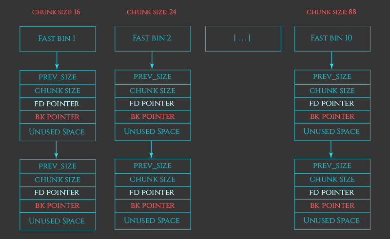

# heap

## 什么是堆，为什么人们使用它？

首先：什么是堆，它的用途是什么？

堆被C和C++程序员用来在程序执行期间手动分配新的进程内存区域。程序员通过调用诸如`malloc`之类的堆函数请求堆管理器分配这些内存区域。这些分配的内存区域，或称为“分配”，可以由程序员使用、修改或引用，直到程序员不再需要它，并通过调用`free`将其返回给堆管理器为止。


以下是一个C程序如何在堆上分配、使用并最终释放一个结构的例子：

```c
typedef struct { int field1; char* field2; } SomeStruct;

int main() {
    SomeStruct* myObject = (SomeStruct*)malloc(sizeof(SomeStruct));
    if (myObject != NULL) {
        myObject->field1 = 1234;
        myObject->field2 = "Hello World!";
        do_stuff(myObject);
        free(myObject);
    }
    return 0;
}
```


以下是程序员在使用堆时必须遵循的一些基本规则，以及如果违反这些规则可能会出现的漏洞类别。

**堆规则及其违反时可能出现的漏洞类别**

1. 如果由 `malloc` 返回的指针已被传递给 `free`，则**不要**读取或写入这个指针。
    - 可能导致 **释放后使用漏洞**。
2. 不要在堆分配中使用或泄露未初始化的信息。
    - 可能导致 **信息泄露或未初始化数据漏洞**。
3. 不要在分配的末尾之后读取或写入字节。
    - 可能导致 **堆溢出和越界读取漏洞**。
4. 不要将源自 `malloc` 的指针传递给 `free` 多次。
    - 可能导致 **重复释放漏洞**。
5. 不要在分配的开始之前读取或写入字节。
    - 可能导致 **堆下溢漏洞**。
6. 不要将未源自 `malloc` 的指针传递给 `free`。
    - 可能导致 **无效释放漏洞**。
7. 不要在检查 `malloc` 返回的指针是否为 `NULL` 之前使用该指针。
    - 可能导致 **空指针解引用漏洞和偶尔的任意写入漏洞**。

------

1. 除了 `calloc`，它通过将其初始化为零来显式初始化分配。
2. 或与 `malloc` 兼容的函数，包括 `realloc`、`calloc` 和 `memalign`。
3. `free(NULL)` 是允许的，不是无效释放，但什么也不做。


当然，`malloc`和`free`并不是C和C++程序员与堆交互的唯一方式。C++开发人员经常通过C++运算符`new`和`new[]`分配内存。这些分配必须通过对应的C++运算符`delete`和`delete[]`释放，而不是使用`free`。程序员还可以通过与`malloc`兼容的堆函数如`calloc`、`realloc`和`memalign`分配内存，这些函数像`malloc`一样，最终通过`free`释放。

为了简单起见，我最初只会讨论`malloc`和`free`。一旦我们理解了这两个函数，其他大多数堆函数就变得很容易理解了。


这里是一个C++程序如何在堆上分配、使用并最终释放一个结构的例子：

```c++
class SomeClass { public: int field1; char* field2; };

int main() {
    SomeClass* myObject = new SomeClass();
    myObject->field1 = 1234;
    myObject->field2 = "Hello World!";
    do_stuff(myObject);
    delete myObject;
    return 0;
}
```


## 内存块配策略

**内存块和块分配策略 Memory chunks and the chunk allocation strategies**

假设程序员通过`malloc`请求10字节的内存。为了满足这个请求，堆管理器不仅仅要找到一个随机的10字节区域供程序员写入。堆管理器还需要存储关于该分配的元数据。这个元数据是与程序员可以使用的10字节区域一起存储的。

堆管理器还必须确保分配是**32位系统上的8字节**对齐，或**64位系统上的16字节**对齐。如果程序员只是想存储一些文本字符串或字节数组，那么分配的对齐方式并不重要，但如果程序员打算使用分配来存储更复杂的数据结构，对齐方式可能会影响程序的正确性和性能。由于`malloc`无法知道程序员将在其分配中存储什么，堆管理器必须**默认确保所有分配都是对齐**的。

这个分配**元数据**和**对齐填充字节**是与`malloc`将返回给**程序员的内存区域一起存储**的。因此，堆管理器内部分配的“块”略大于程序员最初要求的大小。当程序员请求10字节的内存时，堆管理器会找到或创建一个新的块，该块足够大以存储10字节空间加上元数据和对齐填充字节。然后，堆管理器将此块标记为“已分配”，并将指向块内对齐的10字节“**用户数据”区域的指针返回给程序员**，作为`malloc`调用的返回值。


## 块分配：基本策略

那么堆管理器内部是如何分配这些块的呢？

首先，让我们看一下**小块内存分配（这是堆管理器所做的大部分工作）的简化策略**。我将在下面更详细地解释这些步骤，一旦我们完成了这些，我们可以看看巨大分配的特殊情况。

小块内存分配的简化策略如下：

1. 如果有**先前释放的块**，并且该块足够大以满足请求，堆管理器将使用该释放的块进行新的分配。
2. 否则，如果有可用空间位于堆的顶部，堆管理器将从该可用空间分配一个新的块并使用它。
3. 否则，堆管理器将请求内核向堆的末尾添加新内存，并从这个新分配的空间中分配一个新的块。
4. 如果所有这些策略都失败，分配无法完成，`malloc`返回`NULL`。


## 从空闲的 chunk 中分配

概念上，从已释放的块中分配是非常简单的。随着内存被传递回`free`，堆管理器在一系列不同的链表（称为“bins”）中跟踪这些已释放的块。当发出分配请求时，堆管理器会在这些bins中搜索一个足够大的已释放块以满足请求。如果找到了，它可以将该块从bin中移除，将其标记为“已分配”，然后将该块的“用户数据”区域的指针返回给程序员作为`malloc`的返回值。

出于性能原因，有几种不同类型的bins，即快速bin、未分类bin、小型bin、大型bin和每线程tcache。我将在本系列的下一部分详细介绍这些不同类型的bins。


## 从堆的顶部分配

如果没有可用的已释放块可以满足分配请求，堆管理器必须构造一个新的块。为此，堆管理器首先查看堆末尾的空闲空间（有时称为“top chunk”或“remainder chunk”），看是否有足够的空间。如果有，堆管理器会从这个空闲空间制造一个新的块。


### 什么是 "Top Chunk"？

"Top chunk" 位于当前堆的最末端。它是堆中最后一个未分配的、连续的空闲区域。

- 当程序请求新的内存分配时，堆管理器首先会检查是否有已释放的块可以满足请求。如果没有合适的已释放块，堆管理器会尝试从 "top chunk" 中分配内存。
- 如果 "top chunk" 的大小足够大，可以直接从中分割出一个新的块来满足分配请求，并将剩余的部分继续作为 "top chunk"。


如果 "top chunk" 的大小不足以满足请求，堆管理器会通过系统调用（如 `sbrk` 或 `mmap`）向操作系统请求更多的内存，以扩展堆的大小。**（扩展机制）**

- **单线程应用**：在单线程应用中，堆管理器通常使用 `sbrk` 系统调用来扩展堆。`sbrk` 会增加程序的“断点”（program break），从而为堆分配更多的内存。每次 `sbrk` 调用都会将新的内存添加到 "top chunk" 的末尾。
- **多线程应用**：在多线程应用中，堆管理器可能会使用 `mmap` 来为次要 arena（secondary arenas）创建新的子堆（subheaps）。每个子堆也有自己的 "top chunk"，用于管理该子堆的扩展。


**回收机制**

当程序释放内存时，如果释放的块位于 "top chunk" 的前面，并且与 "top chunk" 相邻，堆管理器会将这两个块合并，形成一个新的更大的 "top chunk"。这种合并操作称为“合并”（coalescing），它可以提高内存利用率并减少内存碎片。


**特殊性**

- "Top chunk" 是堆中唯一一个始终处于堆末尾的空闲块。它不需要像其他空闲块那样被放入自由列表（free list）中，因为它是堆扩展的直接来源。
- "Top chunk" 的元数据通常存储在其前面的已分配块中，而不是像其他块那样有独立的元数据结构。


### 请求内核在堆顶添加更多内存

一旦堆末尾的空闲空间用尽，堆管理器将不得不请求内核向堆的末尾添加更多内存。

在初始堆中，堆管理器通过调用`sbrk`请求内核在堆的末尾分配更多内存。在大多数基于Linux的系统中，这个函数内部使用了一个名为`brk`的系统调用。这个系统调用的名字有点令人困惑——它最初意味着“改变程序断点位置”，这是一种复杂的方式来表示它在程序加载到内存之后的区域添加更多内存。由于这是堆管理器创建初始堆的地方，这个系统调用的效果是在程序的初始堆的末尾分配更多内存。

最终，使用`sbrk`扩展堆将会失败——堆最终会变得如此之大，以至于进一步扩展会导致它与其他进程地址空间中的东西发生冲突，比如内存映射、共享库或线程的栈区域。一旦堆达到这一点，堆管理器将通过调用`mmap`将新的非连续内存附加到初始程序堆上来解决这个问题。

如果`mmap`也失败了，那么进程就无法再分配更多的内存，`malloc`返回`NULL`。


### MMAP 非连续内存到主堆

注意：MMAP 非连续内存到主堆并**不是指 MMAP 分配的内存是非连续**的，而是指 **MAPP 分配的连续内存与主堆不是连续的**。


当**堆（sbrk）**增长到一定程度时，可能会与其他内存区域（如栈、共享库、映射文件等）发生冲突，导致 `sbrk` 无法再扩展堆。

堆管理器会转而使用 `mmap` 来分配新的内存区域。虽然 **`mmap` 分配的内存块与主堆在地址空间中是非连续的**，但在**逻辑上，它们仍然是主堆的一部分**。堆管理器会将这些内存块视为主堆的扩展，而不会将其视为独立的子堆。


### 通过 MMAP 进行堆外分配

非常大的分配请求在堆管理器中得到了特殊待遇。这些大块是通过直接调用`mmap`分配的，并且这个事实通过块元数据中的一个标志来标记。当这些巨大的分配通过`free`调用返回给堆管理器时，堆管理器通过`munmap`将整个`mmap`区域释放回系统。

默认情况下，这个阈值是32位系统上的128KB至512KB，64位系统上的32MB，但是这个阈值也可以根据堆管理器检测到这些大分配是暂时使用而动态增加。


## Arenas

在多线程应用程序中，堆管理器需要防御内部堆数据结构的竞争条件，这可能会导致程序崩溃。在ptmalloc2之前，堆管理器通过在每次堆操作之前使用全局互斥锁来确保只有单个线程可以与堆交互，从而实现了这一点。

虽然这种策略有效，但由于堆分配器是高频率使用且性能敏感的，这导致了在使用大量线程的应用程序中出现了显著的性能问题。为了应对这一情况，ptmalloc2堆分配器引入了“arena”的概念。每个arena基本上是完全独立的堆，它独立管理自己的块分配和自由bin。

每个arena仍然使用互斥锁序列化对其内部数据结构的访问，但只要线程交互的是不同的arena，它们就可以安全地执行堆操作，而无需等待其他线程。

对于单线程应用程序，这是堆管理器唯一使用的arena。然而，随着新线程加入进程，堆管理器会为每个新线程分配并附加一个子 arena，以减少线程在尝试执行`malloc`和`free`等堆操作时等待其他线程的可能性。

每当新线程加入进程时，堆管理器会尝试找到没有其他线程正在使用的arena，并将该arena附加到该线程。一旦所有可用的arena都被其他线程使用，堆管理器会创建一个新的arena，最多可达32位进程的2倍CPU核心数和64位进程的8倍CPU核心数。一旦达到这个限制，堆管理器放弃，并且多个线程将不得不共享一个arena，执行堆操作时可能需要其中一个线程等待另一个线程。

子 arena使用一个或多个通过`mmap`和`mprotect`创建的“subheap”来模拟主堆的行为。


### Subheaps

子堆的工作方式与初始程序堆大致相同，有两个主要区别。回想一下，初始堆位于程序加载到内存之后，并通过`sbrk`动态扩展。相比之下，每个子堆通过`mmap`定位到内存中，堆管理器手动使用`mprotect`模拟子堆的增长。


当堆管理器想要创建一个子堆时，它首先请求内核保留一个子堆可以增长到的内存区域，通过调用`mmap`。保留这个区域不会直接将内存分配到子堆中；它只是请求内核不要在这个区域内分配给其他（例如：线程栈、`mmap`区域和其他分配）。

默认情况下，子堆的最大大小——因此为子堆预留的内存区域大小——在32位进程中为1MB，在64位系统上为64MB。

这是通过请求标记为`PROT_NONE`的页面来完成的，这向内核发出信号，只需为该区域预留地址范围；现在还不需要内核将内存附加到它上面。

初始堆通过`sbrk`增长，堆管理器通过手动调用`mprotect`将区域中的页面从`PROT_NONE`更改为`PROT_READ | PROT_WRITE`来模拟“增长”子堆到这个预留的地址范围内。这导致内核将物理内存附加到这些地址，实际上使子堆逐渐增长，直到整个`mmap`区域充满。一旦整个子堆耗尽，arena只需分配另一个子堆。这允许次要arena几乎无限增长，最终仅在内核内存耗尽或进程地址空间耗尽时失败。


`PROT_NONE` 和 `PROT_READ | PROT_WRITE` 是 Linux 系统调用中用于指定内存保护权限的标志，而 `mprotect` 是一个系统调用，它允许改变现有内存区域的访问权限。


**PROT_NONE**

当一个内存页面被标记为 `PROT_NONE` 时，意味着该页面上的任何读、写或执行操作都将导致一个段错误（Segmentation Fault）。也就是说，程序不能对该页面进行任何访问。

在堆管理器创建一个新的子堆时，它会首先请求一块大的内存区域，但并不立即需要所有这些内存都被映射到物理内存中。通过将这块内存区域的所有页面设置为 `PROT_NONE`，堆管理器告诉内核：“我想要预留这个地址空间，但我现在还不需要实际的物理内存。” 这样做可以有效地保留地址空间，防止其他分配（如线程栈、共享库等）占用这个区域。


**PROT_READ | PROT_WRITE**

`PROT_READ` 表示页面可以被读取，`PROT_WRITE` 表示页面可以被写入。当这两个标志组合使用时，表示页面既可以被读取也可以被写入。

当堆管理器需要实际使用这部分内存时，它会通过 `mprotect` 系统调用来更改页面（一部分页面，逐步增长）的保护权限，从 `PROT_NONE` 更改为 `PROT_READ | PROT_WRITE`。

这意味着程序现在可以在这部分内存上进行读写操作。这种做法使得堆管理器可以在需要时逐步将内存页面映射到物理内存中，从而节省资源并提高性能。


## Chunk 元数据

chunk 不仅包含将作为 malloc 返回值提供给程序员的 “user data” 区域，还包含元数据。

块元数据在内存中的确切布局可能有点令人困惑，因为**堆管理器源代码（堆管理器的实现）**将**一个块末尾的元数据与下一个块开头的元数据组合在一起**，而且某些元数据字段的存在或使用取决于块的各种特征。


这是 Chunk 在 malloc.c 中的的结构体定义

```C
struct malloc_chunk {

INTERNAL_SIZE_T      mchunk_prev_size;  /* 前一个块的大小（如果可用）。  */
INTERNAL_SIZE_T      mchunk_size;       /* 当前块大小（以字节为单位），包括开销（为了对齐而填充的字节） */

struct malloc_chunk* fd;         /* 双向链表的指针 —— 仅在 free chunk 中使用. */
struct malloc_chunk* bk;

/* 仅用于 large chunk：指向上或下一个 large chunk 的指针.  */

struct malloc_chunk* fd_nextsize; /* 双向链表的指针 —— 仅在 free chunk 中使用. */
struct malloc_chunk* bk_nextsize;

};
```


*mchunk_size*：提供给程序员的 “user data” 区域的**前面（低地址）**存在 *mchunk_size* 字段。在 *malloc* 期间写入，稍后由 *free* 用于决定如何处理分配的释放。

*mchunk_size*字段在 32 位系统上是 4 字节整数，在 64 位系统上是 8 字节整数。

*mchunk_size* 存储四条信息：块大小和称为 “A”、“M” 和 “P” 的三个位。（存储在同一个 *size_t* 字段）

假设位于 64 位系统上，块大小是 16 字节对齐的，那么 `mchunk_size` 字段的布局如下：

```
+-+-+-+-+-+-+-+-+-+-+-+-+-+-+-+-+-+-+-+-+-+-+-+-+-+-+-+-+-+-+-+-+
|             Size of chunk, in bytes                     |A|M|P|
+-+-+-+-+-+-+-+-+-+-+-+-+-+-+-+-+-+-+-+-+-+-+-+-+-+-+-+-+-+-+-+-+
```

- **块大小**：表示**当前块的实际大小**。
- **`A` 标志位**：**设置 “A” 标志（值：1）**用于告诉堆管理器该**块属于 secondary arena**，而**不是 main arena**。
    - 如果设置了 A 标志，则管理器必须搜索每个arena，并查看指针是否位于任意一个arena的子堆（subheaps）内。
    - 如果未设置标志，则堆管理器可以使搜索短路，因为它知道 chunk 来自主 arena。
        - 如果 `A` **未设置**（为0），则表示当前块**属于 main arena**。
        - 如果 `A` **已设置**（为0），则表示当前块**属于 secondary arena**。
- **`M` 标志位**：**“M” 标志**用于表示该块是通过 **mmap 进行的堆外分配**。
    - 当这个分配最终被传递回 *free* 时，堆管理器将立即通过 munmap 将整个块返回给操作系统， 而不是尝试回收它。
    - 因此，释放的 chunks 永远不会设置此标志。
        - 如果 `M` **未设置**（为0），则表示当前块**不是堆外分配**。
        - 如果 `M` **已设置**（为1），则表示当前块**是堆外分配**。
- **`P` 标志位**：**“P” 标志**用来指示**当前块之前的那个块**是**否是空闲**的（即已经被释放，可以用于合并）。
    - 它指示前一个 chunk 是 *free* chunk。这意味着当*这个* chunk 被释放时，它可以安全地与前一个 chunk 合并，从而创建一个更大的 free chunk。
        - 如果 `P` **未设置**（为0），则表示前一个块是**空闲的**（free chunk）。
        - 如果 `P` **已设置**（为1），则表示前一个块是**正在使用的**（in use）。


C 代码示例：

```c
#include <stdio.h>
#include <stdlib.h>

int main(void) {

    int *p1 = (int*) malloc(sizeof(int));
    int *p2 = (int*) malloc(64 * 1024 * 1024); // 64MB

    *p1 = 0b00000100000000110000001000000001; // 0b 00000100 00000011 00000010 00000001
    *p2 = 0b00000100000000110000001000000001; // 0b 00000100 00000011 00000010 00000001

    printf("p1 address %p\n",p1);
    printf("p2 address %p\n",p2);

    free(p1);
    free(p2);

    return 0;
}
```


输出 p1 和 p2 指针指向的位置：

```
p1 address 0x5555555592a0
p2 address 0x7ffff3a00010
```


p1 指针指向用户空间，减去 16 位获得 元数据。

```
(gdb) x/32bt 0x5555555592a0 - 16

0x555555559290:	00000000	00000000	00000000	00000000	00000000	00000000	00000000	00000000
0x555555559298:	00100001	00000000	00000000	00000000	00000000	00000000	00000000	00000000
0x5555555592a0:	00000001	00000010	00000011	00000100	00000000	00000000	00000000	00000000
0x5555555592a8:	00000000	00000000	00000000	00000000	00000000	00000000	00000000	00000000
```

p1 元数据在内存中为：

```
0x555555559298:	00100001	00000000	00000000	00000000	00000000	00000000	00000000	00000000
```

这里为小端存储，**最低有效位在内存中的最低字节**，转为适合人类阅读的方式：

```
00000000	00000000	00000000	00000000	00000000	00000000	00000000	00100001
```

**mchunk_size 字段**的布局如下：

```
+-+-+-+-+-+-+-+-+-+-+-+-+-+-+-+-+-+-+-+-+-+-+-+-+-+-+-+-+-+-+-+-+-+-+-+-+-+-+-+
| 00000000 00000000 00000000 00000000 00000000 00000000	00000000 00100  |0|0|1|
+-+-+-+-+-+-+-+-+-+-+-+-+-+-+-+-+-+-+-+-+-+-+-+-+-+-+-+-+-+-+-+-+-+-+-+-+-+-+-+
```

当前区块大小并不是 00100 ( 4 ) 字节。

虽然 |0|0|1| 是 A M P ，但计算 chunk 大小时也要将这三位视为有效位，但其取值固定为 |0|0|0|。

当前 chunk 大小为 00100000 (00100|0|0|0|) 32 字节。

- 标志 A 设为 0，表示当前 **chunk 属于 main arena**；
- 标志 M 设为 0，表示当前 **chunk 不是堆外分配**；
- 表示 P 设为 1，表示**前一个 chunk 正在使用**。


```
(gdb) x/32bt 0x7ffff3a00010 - 16 
0x7ffff3a00000:	00000000	00000000	00000000	00000000	00000000	00000000	00000000	00000000
0x7ffff3a00008:	00000010	00010000	00000000	00000100	00000000	00000000	00000000	00000000
0x7ffff3a00010:	00000001	00000010	00000011	00000100	00000000	00000000	00000000	00000000
0x7ffff3a00018:	00000000	00000000	00000000	00000000	00000000	00000000	00000000	00000000
```

**mchunk_size 字段**的布局如下：

```
+-+-+-+-+-+-+-+-+-+-+-+-+-+-+-+-+-+-+-+-+-+-+-+-+-+-+-+-+-+-+-+-+-+-+-+-+-+-+-+
| 00000000 00000000 00000000 00000000 00000100 00000000	00010000 00000  |0|1|0|
+-+-+-+-+-+-+-+-+-+-+-+-+-+-+-+-+-+-+-+-+-+-+-+-+-+-+-+-+-+-+-+-+-+-+-+-+-+-+-+
```

当前 chunk 大小为 00000100 00000000 00010000 00000000 (67112960) 字节。

- 标志 A 设为 0，表示当前 **chunk 属于 main arena**；
- 标志 M 设为 1，表示当前 **chunk 是堆外分配**；
- 标志 P 设为 0，表示**前一个 chunk 是空闲的**。

**注意：因为当前 chunk 是堆外分配，所以它没有相邻的 chunk，标志 P 在这里无意义。**


## Free

当程序员使用来自 `malloc`（或兼容 `malloc` 的分配函数如 `calloc`）的分配后的内存后，会将它传递给 `free` 以释放回堆管理器。

C 标准定义 `free(NULL)` 什么也不做，但对于所有其他调用 `free` 的情况，堆管理器的第一个任务是将指针解析回对应的块。


### 指针与 Chunk 转换

每个**内存块**包含一些**元数据**，这些元数据对于程序员来说是不可见的，但对堆管理器来说却是必要的。

`malloc`返回给用户的指针实际上是**指向 Chunk(内存块) 内某个偏移位置的地址**，而不是直接指向块的起始地址。

偏移量通常是两个`SIZE_SZ`的大小，其中`SIZE_SZ`是系统字长（例如，在32位系统上是4字节，在64位系统上是8字节）。

用户指针指向的是从块起始位置向后偏移了两个`SIZE_SZ`的位置。


1. **内存块（chunk）的指针`p`转换为用户可见的指针**

```c
#define chunk2mem(p) ((void *) ((char *) (p) + 2 * SIZE_SZ))
```

将`p`转换为字符指针（`(char *)`），然后加上两个`SIZE_SZ`的偏移量，最后再转换回`void *`类型。

**转换后的指针**指向的是**用户数据区域的起始位置**。


2. **用户可见的指针`mem`转换回指向内存块（chunk）的指针**

```
#define mem2chunk(mem) ((mchunkptr)((char *) (mem) - 2 * SIZE_SZ))
```

将`mem`转换为字符指针，然后减去两个`SIZE_SZ`的偏移量，最后再转换回`mchunkptr`类型。

**转换后的指针**指向的是**Chunk 的起始位置**。

mchunkptr 类型为：`typedef struct malloc_chunk* mchunkptr;`


如果传递给 free 的指针是由 **malloc 函数分配**的，那么这种转换才是有效的。如果传递了**其他指针**给 `free`，堆管理器可能会释放或回收无效的块，导致内存损坏问题，这可能导致进程崩溃，甚至可能让黑客远程接管进程。

**free** 首先进行一些基本的健全性检查，以查看要释放的指针是否明显无效。

如果任何检查失败，程序将终止。这些检查包括：

1. 检查分配是否对齐在8字节（或64位系统上的16字节）边界上，因为 `malloc` 确保所有分配都对齐。
2. 检查块的大小字段是否不可能——例如，因为它太小、太大、不对齐，或者会超出进程地址空间的末尾。
3. 检查块是否位于 arena 的边界内。
4. 检查块是否已经标记为已释放，通过检查下一个块开始处元数据中的“P”位。

堆管理器的检查并不全面；攻击者有可能绕过这些健全性检查。


### 已经释放的 Chunk

**已释放的 Chunk** 也存储元数据。像**未释放 Chunk** 一样，它们存储“块大小”、“A”和“P”字段，但**不使用“M”字段**，因为通过 `mmap` 分配的块在 `free` 期间总是会被 `munmap` 而不是变成一个用于回收的空闲块。


### 使用 bin 回收内存

堆管理器需要跟踪**已释放的 Chunk** ，以便 malloc 分配新的内存时重新使用它们。**一个正在被用户使用的内存块（即已分配给应用程序并且尚未释放的块）不会存储在任何类型的自由链表（free bin）中**。

堆管理器一系列名为“bin”的列表，共有五种类型：

- 62 个小 bin
- 63 个大 bin
- 1 个未分类 bin
- 10 个快速 bin
- 每线程 64 个 tcache bin


小型 bin、大型 bin 和未分类 bin 都存在于同一个数组中：

- 索引 0 **未使用（保留）**。
- 索引 1 是未分类 bin
- 索引 2-64 是小型 bin
- 索引 65-127 是大型 bin


### free 基本算法

free 的基本算法如下：

1. 如果块的元数据中设置了 M 位，则分配是在堆外进行的，应该通过 `munmap` 释放。
2. 否则，如果此 chunk *之前的* chunk 是 free 的，则该 chunk 将向后合并以创建更大的 free chunk。
3. 同样，如果此 chunk *之后*的 chunk 是 free 的，则该 chunk 将向前合并以创建更大的 free chunk。
4. 如果这个 chunk 与堆的 “top chunk” 没有间隔，则整个 chunk 与 top chunk 合并，而不是存储在 “bin” 中。
5. 否则，块被标记为空闲并放置在适当的 bin 中。


### 小 bin

小 bin 是最容易理解的基本 bin 。它们有 62 个，每个小 bin 存储具有相同固定大小的块。

在 32 位系统上，每个**小于 512** 字节的块（或在 64 位系统上**小于 1024** 字节）都有一个相应的小 bin。

由于每个小 bin 只存储一种大小的 chunk，因此它们会自动排序，因此在这些列表中插入和删除条目的速度非常快。

**注意：这里小于 512 或 1024 是严格小于（不包含 512 或 1024）**


为什么是 62 个小 bin 呢？

在 64 位操作系统中，一个 chunk 必须是 16 对齐的。一个最小的 **chunk 必须包含 mchunk_size 和用户数据**。

在 64 位中 mchunk_size 占用 8 字节，而用户申请的内存空间也必须是 16 对齐的。

如果用户申请的空闲不是 16 对齐，自动扩展到 16 位对齐。例如用户申请 7 / 8 / 9 字节都会自动扩展为 16 字节。

mchunk_size 占用 8 字节，用户最小申请占用 16 字节，合起来为 24 字节。

但必须保持 16 对齐，所以会填充 8 字节（理论上用户也可以使用这 8 个字节），合起来为 32字节。

**在 64 位操作系统中，一个最小的 chunk 为 32字节。**

为了保持 16 对齐，每次 chunk 大小的递增为 16 字节。

```
No.   Size
1       32
2       48
3       64
...
62    1008
```

1008 刚好小于 1024（以 16 为倍数）。

按照上图表，bin 1 只存储 32 字节的 chunk，bin 2 只存储 48 字节的 chunk。


**在 32 为操作系统中，一个最小的 chunk 为 16 为字节。**

为了保持 8 字节对齐，每次 chunk 大小的递增为 8 字节。

```
No.   Size
1       16
2       24
3       32
...
62     504
```


### 大 bin

对于超过 512 字节（64 位系统上为 1024 字节）的块，堆管理器使用“大型 bin”。每个大型 bin 的工作方式与小型 bin 基本相同，但它们**存储的是一定范围内的块**，而不是固定大小的块。

每个大型 bin 的大小范围设计为不与其他小型 bin 或其他大型 bin 的范围重叠。换句话说，给定一个块的大小，正好有一个小型 bin 或大型 bin 与这个大小对应。

因为**每个大型 bin 存储一系列大小不同的块**，所以插入到 bin 上的块必须手动排序，并且从列表中分配时需要遍历列表。这使得大型 bin 本质上比小型 bin 慢。然而，大型 bin 在大多数程序中使用频率较低。这是因为大多数程序在运行过程中倾向于频繁地进行小内存分配和释放，而不是大内存分配和释放。

出于同样的原因，“大型 bin”的范围集中在较小的块大小；在 32 位操作系统中，最小的“大型 bin”覆盖了从 512 字节到 576 字节的 64 字节范围，而第二大 bin 覆盖了 256KB 的大小范围。最大的大型 bin 覆盖了所有超过 1MB 的已释放块。


大块 1 - 32 的范围是 64 字节的增量。

大块 33 - 48 的范围是 512 字节的增量。

大块 49 - 56 的范围是 4096 字节的增量。

大块 57 - 60 的范围是 32768 字节的增量。

大块 61 - 62 的范围是 262144 字节的增量。

大块 63  的范围是 大于 1 MB 的增量。


示例：

```
No.        Size
1:       512 - 576      包含 512 但不包含 576
2:       576 - 640      同理
3:       640 - 704
...
32:    2496 - 2560
```


### 未分类的 bin

堆管理器通过一个名为“未分类 bin”的优化缓存层进一步改进了这一基本算法。这个优化基于以下观察：

- 当程序释放多个内存块时，这些释放操作往往会在短时间内集中发生。例如，当你删除一个树或链表时，程序会遍历该数据结构，并一次性释放每个节点所占用的内存。这意味着多个内存块会在很短的时间内被连续地释放。
- 在许多情况下，程序在释放某个内存块后，很快就会请求相同大小的内存块进行新的分配。例如，当你更新一个列表中的条目时，可能会先释放旧条目的内存，然后立即为新条目分配相同大小的内存。


当一个内存块被释放时，堆管理器会执行以下步骤：

- 堆管理器首先检查该块的前后相邻块是否已经空闲。如果相邻块是空闲的，堆管理器会尝试将这些块合并成一个更大的空闲块。
- 无论是否进行了合并，堆管理器都会将这个块（或合并后的较大块）放入未分类 bin 中。


当下一次 malloc 请求一个内存块时，堆管理器会遍历未分类 bin 查找合适的块：

- 如果未分类 bin 中存在一个**恰好满足请求大小的块**，堆管理器会立即将该块分配给用户。
- 如果未分类 bin 中存在一个**比请求大小稍大的块**，堆管理器可能会分割该块，将一部分分配给用户，另一部分作为新的空闲块放回未分类 bin 或其他适当的 bin 中。
- 如果未分类 bin 中**没有合适的块**，堆管理器会继续检查其他 bin（如小型 bin、大型 bin）或从堆顶获取新的内存。

如果 **malloc** 需要一个较大的块，而未分类 bin 中只有较小的块，堆管理器可能会对未分类 bin 进行一次清理操作，将其中的块重新分类并放入合适的小型 bin 或大型 bin 中。


~~堆管理器在将释放的 chunk 放入正确的 bin 之前，合并这些释放的 chunk，并将这些 chunk 放置在未分类 bin 中。在下一次 malloc 时，对管理器会检查未分类 bin 中的每一个 chunk。~~

- ~~如果这个 chunk 满足用户所需内存空间的要求，堆管理器会立即重新使用这个 chunk。~~
- ~~如果不满足，堆管理器将块放入其对应的小型 bin 或大型 bin 中。~~


### 快速 bin

快速 bin 是在我们已经见过的三种基本 bin 之上进一步的优化。这些 bin 实际上保持最近释放的小块处于“快速周转队列”中，故意保持块不与其邻居合并，以便如果很快就有 `malloc` 请求该块大小，它可以立即被重用。

在 32 位操作系统中，有 10 个这样的快速 bin，每个快速 bin 仅负责单一固定块大小，覆盖 16、24、32、40、48、56、64、72、80 和 88 字节加上块元数据的大小。


快速 bin 中的块永远不会与它们的邻居合并，堆管理器不会设置下一个块开始处的“P”位。可以概念化地认为，堆管理器没有真正释放快速 bin 中的块。

快速 bin 仅覆盖单一块大小，因此是自动排序的，因此插入和删除操作非常快。由于快速 bin 中的块不会被合并，它们也可以存储在单向链表中，而不需要存储在双向链表上，以便在块合并时可以从列表中移除。


快速 bin 的缺点是快速 bin 中的块没有“真正”被释放或合并，这最终会导致进程的内存碎片化并随时间膨胀。为了解决这个问题，堆管理器定期“整合”堆。

在发生下面三种情况时，堆管理器会“整合”堆：

- malloc 请求的内存空间大于快速 bin 可以服务的大小（即超过 512 字节或 64 位系统上的 1024 字节）；
- 释放任何超过 64KB（64KB 是一个启发式选择的值）的块；
- 程序调用 malloc_trim 或 mallopt 时发生。

启发式选择的值是指通过经验和实际测试得出的一个合理的、经验性的阈值或参数，而不是基于严格的数学推导或理论计算。用户可以通过 `mallopt` 函数调整这个阈值，以适应不同应用程序的需求。




###  Tcache bin

**Tcache (per-thread cache) bins** Tcache（每线程缓存）箱。

堆管理器用于加速分配的最后一个优化是每线程缓存，或称为“tcache”分配器。但首先让我们看看tcache试图解决的问题。

计算机系统上的每个进程可能同时运行多个线程，进行并发操作。例如，一个高流量的Web服务器可能有多个同时的传入请求，Web服务器可能会为每个传入请求提供自己的线程，而不是让每个请求排队等待服务。

一个进程中的每个线程共享相同的地址空间（如：相同的代码和内存中的数据）。每个线程有自己的寄存器和堆栈来存储临时局部变量，但是像全局变量和堆这样的资源是所有线程之间共享的。


协调像堆这样的全局资源的访问是一个复杂的事情，处理不当的话可能会出现“竞态条件”，这会导致难以调试的崩溃，这些问题往往也被黑客利用。

假设一个正在一个线程上服务的Web请求尝试更新（写入）数据库某一项内容，而另一个并发的Web请求尝试读取同一项内容。

通常，我们希望确保第二个线程不会读取到正在被另一个线程覆盖写入的中间状态的内容，因为这个中间状态的内容可能是不完整或损坏的。

数据库解决这个问题，一种非常常见的方法是使用锁，将同时访问全局资源的请求强制进入顺序队列。如果两个线程同时尝试访问同一行，则一个操作必须在下一个开始之前完成。


一般而言，锁的工作原理是，一个线程在使用全局资源之前，对这个全局资源进行“标记”，表示这个线程已经取得了这个全局资源的所有权。当这个线程使用完全局资源后，记资源不再被使用。

如果另一个线程想要使用全局资源，但是这个全局资源已经被其他线程标记为“正在使用”。那么这个线程就会等待其他线程完成，直到这个全局资源再次被标记为“未使用”。

这确保了全局资源一次只被一个线程使用。但这也有成本：等待中的线程会停滞并浪费时间。这被称为“锁竞争”。

对于全局变量，等待全局变量所损失的效率是可以接受的。但对于经常被所有线程使用的堆，“锁竞争”所尝产生的等待时间会拖慢整个程序的运行效率。


堆管理器主要通过使用每个线程的arena来解决这个问题，其中每个线程有自己的arena，直到它达到阈值。

Tcache bin 在 glibc 2.26 版本中添加到 malloc 内存分配函数中的，并默认启用。它旨在减少锁产生的等待时间。


每个 arena 有 64 个 Tcache bin，每个 Tcache bin 专门用于存储特定大小的 chunk。默认情况下，每个 tcache bin 最多可以存储7个chunk，但这可以通过`mallopt`函数调整。

默认情况下：在64位系统上 tcache bin 涵盖从 24 字节到 1032 字节，在 32 位系统上涵盖从 12 字节到 516 字节

```
/* With rounding and alignment, the bins are...
 idx 0   bytes 0..24 (64-bit) or 0..12 (32-bit)
 idx 1   bytes 25..40 or 13..20
 idx 2   bytes 41..56 or 21..28
 etc.  */
```

- `idx 0` 在 64 位系统上负责分配 0 到 24 字节大小的内存请求，在 32 位系统上则负责 0 到 12 字节的请求。
- `idx 1` 在 64 位系统上负责 25 到 40 字节，在 32 位系统上负责 13 到 20 字节。
- `idx 2` 在 64 位系统上负责 41 到 56 字节，在 32 位系统上负责 21 到 28 字节。

注意：这里指的是请求的字节数（也就是程序员通过 malloc 传递过来的值），而不是实际的 chunk 大小，因为 chunk 中要包含元数据，所以实际的 chunk 大小超过程序员请求的字节数。


在 32 位系统上 0 到 12 字节的请求，被视为 12 字节的请求，在包括元数据所需的字节数，chunk 的实际大小为 16 字节。

在 32 位系统，默认情况下，Tcache bin 1 负责存储 7 个 16 字节的 chunk。


#### Chunk 是如何进入 Tcache bin 的？

当 Chunk 被释放时，堆管理器会查看块是否适合对应块大小的 Tcache bin 。像 Fast bin 一样，Tcache bin 上的块被认为是“在使用中”，不会与相邻的 Free chunk 合并。

如果释放的 chunk 所对应的 tcache bin 已满（或块太大无法放入tcache bin），堆管理器会恢复到我们旧的慢路径策略，即获取堆锁，然后像以前一样处理块。

对应的 tcache 分配也非常直接。对于一个 chunk 请求，如果有适当 tcache bin 的块可用，堆会立即返回那个 chunk 。如果请求的 chunk 对于 tcache 来说太大，也像以前一样继续。


In the case where we try and make an allocation, there is a corresponding tcache bin, but that bin is full, we do a slightly-modified allocation strategy. Rather than just taking the heap lock and finding a single chunk, we take the heap lock and opportunistically promote as many chunks as possible at this size to the tcache while we still hold the heap lock, up to the tcache bin limit of seven, and return the last matching chunk back to the user.

在我们尝试进行分配的情况下，有一个对应的tcache bin，但该bin已满，我们执行稍微修改的分配策略。我们并不是仅仅获取堆锁并找到单个块，而是获取堆锁，并在我们仍然持有堆锁的同时，将尽可能多的这个大小的块提升到tcache，直到tcachebin限制为7，并将最后一个匹配的块返回给用户。


上面是文章中的原文，但是我觉得这里得描述不正确，下面是我自己的理解：

当用户请求一个 chunk，这个 chunk 的大小对应某个 tcache bin 时，但是 tcache bin 中的 chunk 已经耗尽（分配完了）时。

堆管理器会锁住堆（防止其他线程修改），然后从其他 bin 中寻找这个大小的 chunk，并将其放入 tcache bin 中，直到达到 tcache bin 的限制（默认为 7 ），然后在（其他 bin）中寻找一个 chunk 并返回给用户。

当用户请求的 chunk 在对应的 tcache bin 中存在时，则直接从 tcache bin 中返回一个 chunk 给用户。


