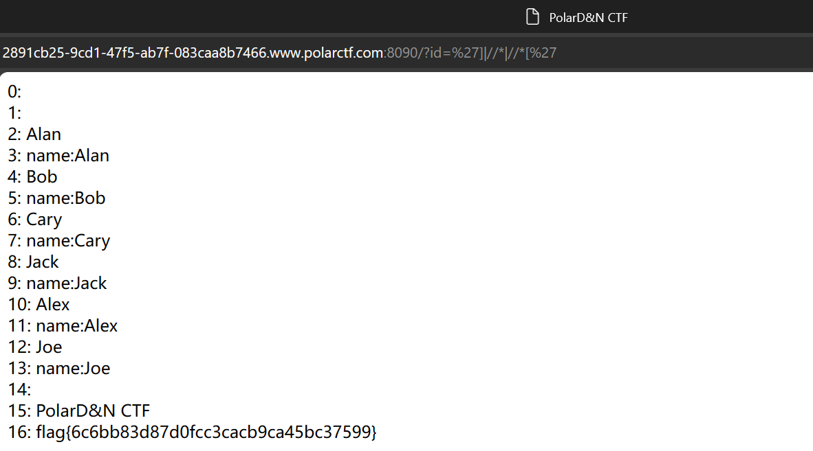

# xml基本语法

## 声明

XML 文档第一行以 XML 声明开始，用来表述文档的一些信息，如：

```xml
<?xml version="1.0" encoding="UTF-8"?>
```


## 开始和结束标签

- 开始标签：**<name>**
- 结束标签：**</name>**

```
<?xml version="1.0" encoding="UTF-8"?>
<site>
  <name>RUNOOB</name>
  <url>https://www.runoob.com</url>
  <logo>runoob-logo.png</logo>
  <desc>编程学习网站</desc>
</site>
```


## 树结构

树结构，它从"根部"开始，然后扩展到"枝叶"。

```xml
<?xml version="1.0" encoding="UTF-8"?>
<note>
<to>Tove</to>
<from>Jani</from>
<heading>Reminder</heading>
<body>Don't forget me this weekend!</body>
</note>
```


下一行描述文档的**根元素**（像在说："本文档是一个便签"）：

```xml
<note>
```

接下来 4 行描述根的 4 个**子元素**（to, from, heading 以及 body）：

```xml
<to>Tove</to>
<from>Jani</from>
<heading>Reminder</heading>
<body>Don't forget me this weekend!</body>
```

最后一行定义根元素的结尾：

```xml
</note>
```

从这个实例中，XML 文档包含了一张 Jani 写给 Tove 的便签。


## 大小写敏感

标签 <Letter> 与标签 <letter> 是不同的。

必须使用相同的大小写来编写打开标签和关闭标签：

```xml
<Message>这是错误的</message>
<message>这是正确的</message>
```


## 实体引用

一些字符拥有特殊的意义。

如果把字符 "<" 放在 XML 元素中，会发生错误，这是因为解析器会把它当作新元素的开始。

这样会产生 XML 错误：

```xml
<message>if salary < 1000 then</message>
```

为了避免这个错误，请用**实体引用**来代替 "<" 字符：

```xml'
<message>if salary &lt; 1000 then</message>
```

在 XML 中，有 5 个预定义的实体引用：

| &lt;   | <    | less than      |
| ------ | ---- | -------------- |
| &gt;   | >    | greater than   |
| &amp;  | &    | ampersand      |
| &apos; | '    | apostrophe     |
| &quot; | "    | quotation mark |

**注释：**在 XML 中，只有字符 "<" 和 "&" 确实是非法的。


## 注释

在 XML 中编写注释的语法与 HTML 的语法很相似。

```
<!-- This is a comment -->
```


## 命名规则

- 名称可以包含字母、数字以及其他的字符
- 名称不能以数字或者标点符号开始
- 名称不能以字母 xml（或者 XML、Xml 等等）开始
- 名称不能包含空格


## 属性

属性提供有关元素的额外信息：

```xml

<a href="demo.html">
```

属性通常提供不属于数据组成部分的信息。在下面的实例中，文件类型与数据无关，但是对需要处理这个元素的软件来说却很重要：

```xml
<file type="gif">computer.gif</file>
```


# XPATH语法

## 父（Parent）

每个元素以及属性都有一个父。

在下面的例子中，book 元素是 title、author、year 以及 price 元素的父：

```
<book>
  <title>Harry Potter</title>
  <author>J K. Rowling</author>
  <year>2005</year>
  <price>29.99</price>
</book>
```

## 子（Children）

元素节点可有零个、一个或多个子。

在下面的例子中，title、author、year 以及 price 元素都是 book 元素的子：

```
<book>
  <title>Harry Potter</title>
  <author>J K. Rowling</author>
  <year>2005</year>
  <price>29.99</price>
</book>
```

## 同胞（Sibling）

拥有相同的父的节点

在下面的例子中，title、author、year 以及 price 元素都是同胞：

```
<book>
  <title>Harry Potter</title>
  <author>J K. Rowling</author>
  <year>2005</year>
  <price>29.99</price>
</book>
```

## 先辈（Ancestor）

某节点的父、父的父，等等。

在下面的例子中，title 元素的先辈是 book 元素和 bookstore 元素：

```
<bookstore>

<book>
  <title>Harry Potter</title>
  <author>J K. Rowling</author>
  <year>2005</year>
  <price>29.99</price>
</book>

</bookstore>
```

## 后代（Descendant）

某个节点的子，子的子，等等。

在下面的例子中，bookstore 的后代是 book、title、author、year 以及 price 元素：

```
<bookstore>

<book>
  <title>Harry Potter</title>
  <author>J K. Rowling</author>
  <year>2005</year>
  <price>29.99</price>
</book>

</bookstore>
```


## 选取节点

| 表达式   | 描述                                                       |
| :------- | :--------------------------------------------------------- |
| nodename | 选取此节点的所有子节点。                                   |
| /        | 从根节点选取（取子节点）。                                 |
| //       | 从当前节点开始选择节点，而不考虑它们的位置（取子孙节点）。 |
| .        | 选取当前节点。                                             |
| ..       | 选取当前节点的父节点。                                     |
| @        | 选取属性。                                                 |


在下面的表格中，我们已列出了一些路径表达式以及表达式的结果：

| 路径表达式      | 结果                                                         |
| :-------------- | :----------------------------------------------------------- |
| bookstore       | 选取 bookstore 元素的所有子节点。                            |
| /bookstore      | 选取根元素 bookstore。注释：假如路径起始于正斜杠( / )，则此路径始终代表到某元素的绝对路径！ |
| bookstore/book  | 选取属于 bookstore 的子元素的所有 book 元素。                |
| //book          | 选取所有 book 子元素，而不管它们在文档中的位置。             |
| bookstore//book | 选择属于 bookstore 元素的后代的所有 book 元素，而不管它们位于 bookstore 之下的什么位置。 |
| //@lang         | 选取名为 lang 的所有属性。                                   |


## 谓语（Predicates）

谓语用来查找某个特定的节点或者包含某个指定的值的节点。

谓语被嵌在方括号中。

在下面的表格中，我们列出了带有谓语的一些路径表达式，以及表达式的结果：

| 路径表达式                          | 结果                                                         |
| :---------------------------------- | :----------------------------------------------------------- |
| /bookstore/book[1]                  | 选取属于 bookstore 子元素的第一个 book 元素。                |
| /bookstore/book[last()]             | 选取属于 bookstore 子元素的最后一个 book 元素。              |
| /bookstore/book[last()-1]           | 选取属于 bookstore 子元素的倒数第二个 book 元素。            |
| /bookstore/book[position()<3]       | 选取最前面的两个属于 bookstore 元素的子元素的 book 元素。    |
| //title[@lang]                      | 选取所有拥有名为 lang 的属性的 title 元素。                  |
| //title[@lang='eng']                | 选取所有 title 元素，且这些元素拥有值为 eng 的 lang 属性。   |
| /bookstore/book[price>35.00]        | 选取 bookstore 元素的所有 book 元素，且其中的 price 元素的值须大于 35.00。 |
| /bookstore/book[price>35.00]//title | 选取 bookstore 元素中的 book 元素的所有 title 元素，且其中的 price 元素的值须大于 35.00。 |


## 选取未知节点

XPath 通配符可用来选取未知的 XML 元素。

| 通配符 | 描述                 |
| :----- | :------------------- |
| *      | 匹配任何元素节点。   |
| @*     | 匹配任何属性节点。   |
| node() | 匹配任何类型的节点。 |

在下面的表格中，我们列出了一些路径表达式，以及这些表达式的结果：

| 路径表达式   | 结果                              |
| :----------- | :-------------------------------- |
| /bookstore/* | 选取 bookstore 元素的所有子元素。 |
| //*          | 选取文档中的所有元素。            |
| //title[@*]  | 选取所有带有属性的 title 元素。   |


## 选取若干路径

通过在路径表达式中使用"|"运算符，您可以选取若干个路径。

在下面的表格中，我们列出了一些路径表达式，以及这些表达式的结果：

| 路径表达式                       | 结果                                                         |
| :------------------------------- | :----------------------------------------------------------- |
| //book/title \| //book/price     | 选取 book 元素的所有 title 和 price 元素。                   |
| //title \| //price               | 选取文档中的所有 title 和 price 元素。                       |
| /bookstore/book/title \| //price | 选取属于 bookstore 元素的 book 元素的所有 title 元素，以及文档中所有的 price 元素。 |


## 万能语法（`']|//*|//*['`）

```
$user="]|//*|//*["
$query="user/username[@name="."'".$user."'"."]";

//第一个 '] 和 [@name=' 进行闭合为[@name='']
//连接上 //* 表示选取文档中的所有元素
//后面的 //*[' 和 '] 进行闭合为 //*[''] 表示选取文档中所有属性的元素
```


### ctf例题

