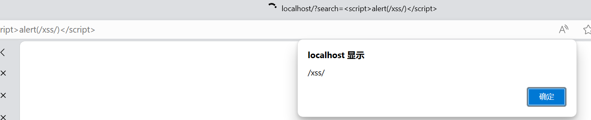
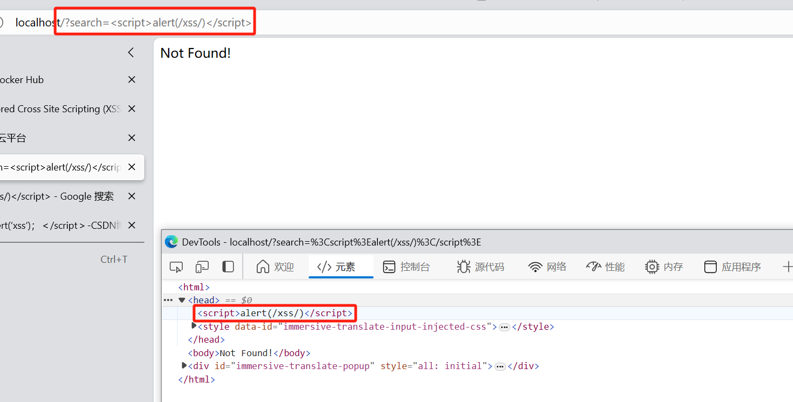

# XSS简介

简单来说，XSS就是通过攻击者精心构造的JS代码注入到网页中，当用户访问被XSS注入的网页，XSS代码就会被提取出来。用户浏览器就会解析这段XSS代码，然而由于浏览器并不具有人格，不会判断代码是否恶意，只要代码符合语法规则，浏览器就会解析这段XSS代码。

从上述可知，XSS属于客户端攻击，受害者最终是用户，网站的管理员也是用户之一。

## 攻击条件

实施XSS攻击需要具备的两个条件

- 需要向Web页面注入精心构造的恶意代码
- 对用户的输入没有做过滤，恶意代码能够被浏览器成功的执行

## 危害

- 盗取各种用户账号
- 窃取用户Cookie资料，冒充用户身份进入网站
- 劫持用户会话，执行任意操作
- 刷流量，执行弹窗广告传播蠕虫病毒
- 攻击者能在一定限度内记录用户的键盘输入

# XSS分类

## 反射型XSS

反射型XSS又称为非持久型XSS，是现在最容易出现的一种XSS漏洞。用户在请求某条URL地址的时候，会携带一部分数据。当客户端进行访问某条链接时，攻击者可以将恶意代码植入到URL，如果服务端未对URL携带的参数做判断或者过滤处理，直接返回响应页面，那么XSS攻击代码就会一起被传输到用户的浏览器，从而触发反射型XSS。


比如，当用户进行搜索时，返回结果通常会包括用户原始的搜索内容，如果攻击者精心构造包含XSS恶意代码的链接，诱导用户点击并成功执行后，用户的信息就可以被窃取，甚至可以模拟用户进行一些操作。


特点

- 非持久性
- 参数型脚本
- 反射型XSS的JS代码在Web应用的参数(变量)中，如搜索框等地方

数据流量走向：浏览器->后端-> 浏览器


```
<script>alert(/xss/)</script>
```







## 存储型XSS

存储型XSS又叫持久型XSS。一般而言，它是三种XSS里危害最大的一种。此类型的XSS漏洞是由于恶意攻击代码被持久化保存到服务器上，然后被显示到HTML页面之中这类漏洞经常出现在用户评论的页面，攻击者精心构造XSS代码，保存到数据库中，当其他用户再次访问这个页面时，就会触发并执行恶意的XSS代码，从而窃取用户的敏感信息。


- 持久性跨站脚本
- 持久性体现在JS代码不是在某个参数(变量)中，而是写进数据库或文件等可以永久保存数据的介质中，如留言板等地方

数据流量走向: 浏览器 -> 后端-> 数据-> 后端> 浏览器


## DOM型XSS

