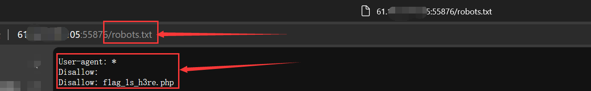
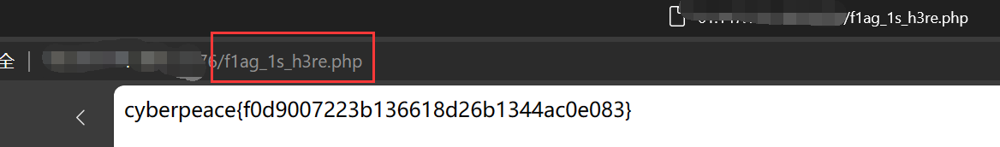

# robots

robots是搜索引擎爬虫协议，也就是你网站和爬虫的协议。

robots是告诉搜索引擎，你可以爬取收录我的什么页面，你不可以爬取和收录我的那些页面。robots很好的控制网站那些页面可以被爬取，那些页面不可以被爬取。

但是robots是一个君子协定，爬虫和用户不一定会遵守这个协定，纯靠自觉。

协议的内容保存在根路径下的robots.txt文件中



```
User-agent: Baidu
Disallow: /appstore

User-agent: * 
Allow:*
```

不允许baidu访问appstore中的内容，允许所有人访问所有内容


但是robots可能会泄露一些敏感信息，例如：

```
User-agent: *
Disallow: /BackstageManagement/admin.php
```

这条robots语句再告诉所有人不允许访问后台的同时，也泄露了后台的具体路径


ctf robots例题：

访问web的robots.txt文件

```
User-agent: *
Disallow: 
Disallow: f1ag_1s_h3re.php
```

泄露了flag的地址，访问该文件地址，成功获取到flag




